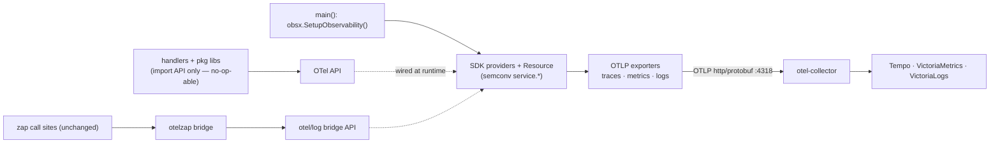
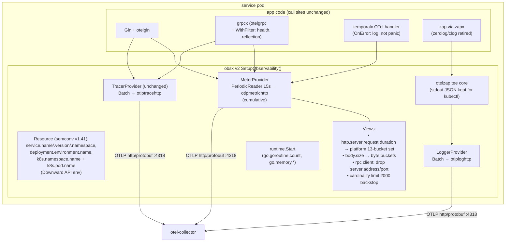
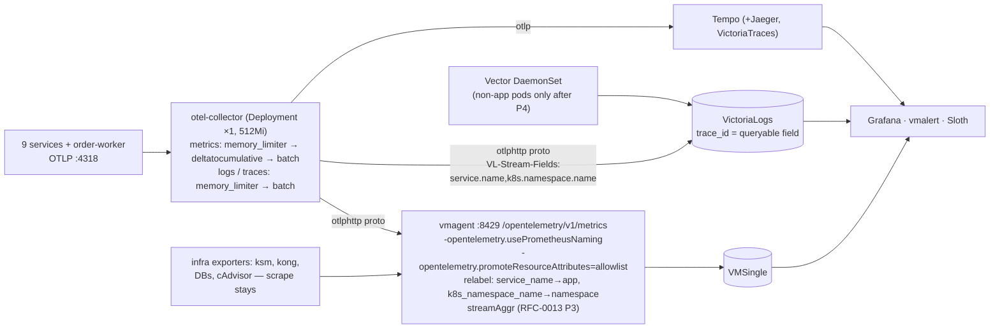
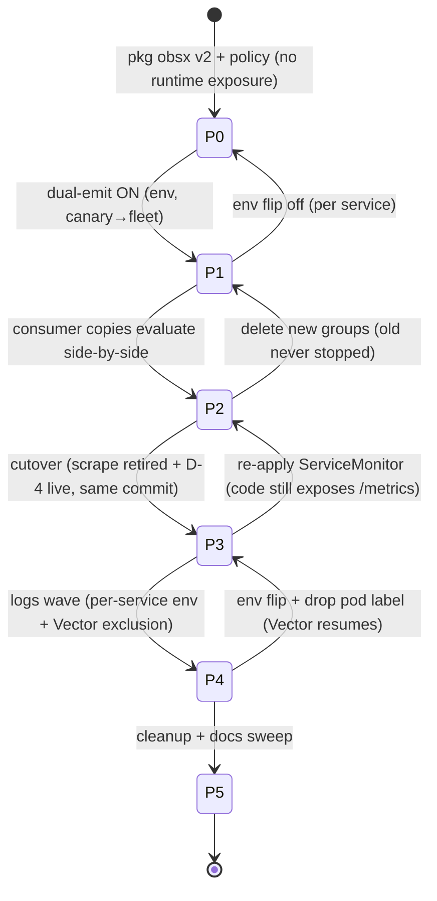

# RFC-0014 Full OpenTelemetry adoption: OTLP push for metrics, logs and traces

| Status | Scope | Created | Last updated |
|--------|-------|---------|--------------|
| implemented (live-cluster drill pending) | platform-wide | 2026-07-08 | 2026-07-10 |

> **Don't forget: every decision is a tradeoff.** This RFC deliberately accepts
> a large, measured blast radius (every metrics consumer is renamed) in
> exchange for one instrumentation standard end-to-end. The costs are itemized
> in Drawbacks and [tracking.md](tracking.md); the rollout is engineered so no
> single step is irreversible.

## Summary

Move all nine platform services (plus the order-worker) from the current
hybrid observability stack — prometheus client_golang app metrics scraped by
VMAgent, three JSON log schemas shipped by Vector, OTel used only for traces
and as a metrics bridge — to the **full OpenTelemetry standard**: one OTel
SDK per service emitting **metrics, logs and traces over OTLP push** through
the existing in-cluster OTel Collector, with **semantic-convention metric
names adopted immediately**. Metrics land in VictoriaMetrics via its OTLP
ingest (through vmagent, so relabeling and stream aggregation keep their
single choke point), logs land in VictoriaLogs with `trace_id` as a real
queryable field (fixing the platform's broken log↔trace correlation), traces
keep flowing to Tempo. (The originally planned `checkout-service` exemption
was dropped at P3 landing — the service was never integrated in-cluster, so
there was nothing to fence; see [ADR-016](../../adr/ADR-016-otel-metrics-cutover/).)

## Motivation

Three forces converge:

1. **Standardization.** The platform runs two metrics APIs (client_golang +
   OTel-bridged) with two naming conventions on one endpoint, three JSON log
   schemas across nine services, and ~380 duplicated lines of tracing init per
   repo. Each seam has already produced real drift (cart middleware, product
   tracing, user log levels — found by the 2026-07 observability review).
2. **Correlation is broken where it matters.** `trace_id` is not a queryable
   field in VictoriaLogs (Vector extracts only `level`), so Tempo's
   traces→logs and every runbook `trace_id:"…"` query silently match nothing.
   Exemplars are dead end-to-end and VictoriaMetrics will never support them
   (upstream won't-fix). The OTLP log path fixes this at the root: VictoriaLogs
   maps the OTLP `TraceId` to a native `trace_id` field.
3. **Ecosystem direction.** OTel Go is stable for traces and metrics (v1.44),
   beta for the logs *bridge* (accepted), and the SDK→Collector→backend
   pattern is the production standard at scale (eBay, Shopify, Skyscanner at
   ~1,000 services). VictoriaMetrics and VictoriaLogs both ship first-class
   OTLP ingest. This platform exists to mirror production practice — this is
   the practice.

### Goals

- **One instrumentation standard**: OTel API in library code, one
  `SetupObservability` wiring point per service, OTLP push for all three
  signals.
- **Semconv naming now**: `http.server.request.duration` &co., surfaced to
  PromQL as `http_server_request_duration_seconds_*` via VictoriaMetrics'
  Prometheus-naming translation — one rename wave, never two.
- **Correlation restored**: `trace_id:"<id>"` in VictoriaLogs returns the
  request's logs; Tempo traces→logs works.
- **No flag day**: every phase is dual-emit/shadowed with a one-file or
  one-env rollback, following the platform's `PAYMENT_ENABLED` rollout
  precedent.
- **The drift class dies**: per-service middleware copies
  (`prometheus/tracing/logging/resource.go` ×9) are absorbed into
  `pkg/obsx` v2.

### Non-Goals

- `checkout-service` migration (moot at landing — the service was never
  integrated in-cluster; the planned fence was dropped, ADR-016).
- VMSingle → VMCluster, retention/downsampling changes.
- An exemplar-capable TSDB path (accepted loss; correlation via logs+traces).
- New business/DB/cache instrumentation (tracked separately).
- Replacing Vector for non-instrumented pods (it stays, permanently, for
  infra/system logs and checkout).

## Proposal

### OTel in one page: API vs SDK vs Contrib (who imports what)

The OTel spec's core rule: *instrumented libraries depend only on the API;
if no SDK is installed, API calls are no-ops.*

| Layer | Go modules | Who imports it | What it is |
|---|---|---|---|
| **API** | `go.opentelemetry.io/otel`, `otel/trace`, `otel/metric`, `otel/log` (bridge API) | Library/shared code (`pkg/obsx`, `pkg/grpcx`, middleware) | Interfaces + globals + built-in no-op. Free until wired. |
| **SDK** | `otel/sdk`, `otel/sdk/metric`, `otel/sdk/log`, `otel/sdk/resource` | Application `main()` only | The real implementation: providers, processors, readers, `Resource`. |
| **Exporters** (SDK plugins) | `otlptracehttp`, `otlpmetrichttp`, `otlploghttp` | `main()` only | Swappable backends; OTLP is native. |
| **Contrib** | `otelgin`, `otelgrpc`, `instrumentation/runtime`, `bridges/{otelzap,otelslog}` | Router middleware; bridges + `runtime.Start` in `main()` | Instrumentation for third-party libs + log bridges. |

Go signal stability (verified against release v1.44.0, the version the
platform already runs for traces): **Traces Stable · Metrics Stable · Logs
Beta** — and for Go, "Logs" is a *bridge* API: application code never calls an
OTel logs API; only the zap handler constructed in `main()` changes.

### Alternatives

| | (1) Status quo: hybrid pull | (2) OTel SDK + Prometheus exporter (pull) | **(3) Full OTLP push — chosen** |
|---|---|---|---|
| Instrumentation APIs | two | one | one |
| Pipeline | VMAgent scrape 15s | scrape 15s | SDK → collector → vmagent OTLP |
| `up{}` liveness | free | free | must be rebuilt (D-4) |
| Log↔trace correlation | broken (R1) | still broken | **fixed** (`trace_id` field in VL) |
| Three log schemas | persist | persist | resolved (zapx + otelzap) |
| Consumer blast radius | none | none | 17 alerts · 15 rules · 3 SLIs · 27 panels · 19 docs files |
| Ecosystem alignment | drifting | halfway | full |

**(2) rejected** because it pays most of the SDK-migration cost while fixing
neither correlation nor the log-schema drift, and leaves the pull/push
question to be re-litigated later. **(1) rejected** by decision: the 2026-07
review's "keep the hybrid" verdict was premised on the consumer-rename cost
being unacceptable; that cost is now explicitly accepted, and it buys the only
architecture that fixes R1/R6 structurally.

## Architecture & Diagrams

**In-process (each of the 9 services + order-worker):** one call —
`obsx.SetupObservability(ctx, cfg)` (pkg/obsx v2) — replaces today's four
per-service middleware copies:

**Cluster pipeline** (extends the existing otel-collector HelmRelease — traces
and logs pipelines already exist there):

## Design Details

### Decisions (D-1 … D-14)

| # | Decision | Choice — rationale |
|---|---|---|
| D-1 | Naming flag | `-opentelemetry.usePrometheusNaming` on vmagent: `http.server.request.duration` (unit s) surfaces as `http_server_request_duration_seconds_*` — PromQL/Sloth/mop stay idiomatic; consumer migration is a mechanical rename. |
| D-2 | Resource-attr allowlist | `-opentelemetry.promoteResourceAttributes=service.name,service.version,k8s.namespace.name,k8s.pod.name,deployment.environment.name`. VictoriaMetrics promotes **all** resource attributes to labels by default; SDK defaults (`service.instance.id`, `process.pid`) would mint a full new series set per restart. **Must land before any service pushes.** |
| D-3 | job/app/namespace | vmagent remote-write relabel: `service_name`→`app`, `k8s_namespace_name`→`namespace`; `job` is not reconstructed. All `sum by (app, namespace)` grouping survives; only metric families and attribute labels rename. |
| D-4 | `up{}` replacement | `up{job="microservices"}` ceases to exist under push. Replacement: absence alerts on `go_goroutine_count` (exported every 15 s by `runtime.Start`, traffic-independent, carries `app`) + a pipeline-health alert on collector exporter-failure self-metrics. |
| D-5 | Collector | Extend the existing HelmRelease (`kubernetes/infra/controllers/tracing/otel-collector/`); Deployment ×1; 512Mi / memory_limiter 400Mi; metrics pipeline `[memory_limiter, deltatocumulative, batch]` (defensive — the Go SDK is cumulative by default, and delta samples in VM break `rate()`). |
| D-6 | Protocol | OTLP **http/protobuf :4318** for all three signals — VictoriaMetrics/VictoriaLogs accept nothing else (no gRPC, no JSON), and traces already use it. |
| D-7 | Export interval | PeriodicReader **15 s, set explicitly** = the current scrape interval, so dashboard granularity and Sloth burn-rate math are unchanged by construction (the SDK default 60 s would be a silent 4× regression). |
| D-8 | Semconv pin | `semconv/v1.41.0` in obsx v2 (platform currently pins v1.24 — HTTP attributes renamed in between; one deliberate jump, bumps only via pkg releases). |
| D-9 | Temporal metrics | Keep the temporalx OTel handler (first-class once the MeterProvider is real); `OnError` fixed to log; order-worker PodMonitor retired at P3. |
| D-10 | grpcx | `otelgrpc.WithFilter` (health + reflection RPCs stop minting series/spans) + Views dropping `server.address`/`server.port` on client metrics (pod-IP churn). |
| D-11 | pkg/metricsx tracker | **Superseded** → `pkg/obsx` v2 `SetupObservability` absorbs prometheus + tracing + logging + resource init (same root cause, wider seam; kills the ×9 duplication). |
| D-12 | Loggers | Converge on **zapx + otelzap bridge**; `clog` retired, `zerolog` frozen (checkout-only import). 7/9 services are already zapx — smallest blast radius; OTLP normalizes the record shape so the 3-schema drift cannot recur. |
| D-13 | checkout exemption | **Amended at P3 landing (ADR-016):** checkout-service was never integrated in-cluster, so the ServiceMonitor was deleted outright and no `legacy-checkout` fence exists. (Original plan: trim the ServiceMonitor to checkout + keep a fenced old-name group.) |
| D-14 | Exemplars | Accept the loss on the VictoriaMetrics path (upstream won't-fix; they were already dead end-to-end). Correlation = `trace_id` in logs + Tempo. Docs updated to say so. |

### Metric mapping (old → semconv → PromQL-visible)

| Old | Semconv instrument | PromQL name (after D-1) | Notes |
|---|---|---|---|
| `request_duration_seconds{method,path,code}` | `http.server.request.duration` (Stable, s) | `http_server_request_duration_seconds_*` | labels → `http_request_method`, `http_route`, `http_response_status_code` (+`url_scheme`). **View with the platform 13-bucket set is mandatory** — semconv defaults lack `le=2` (Apdex) and 0.2/0.3 (SLO points). |
| `requests_in_flight` | `http.server.active_requests` | `http_server_active_requests` | no `http.route` attribute — per-path in-flight lost (all consumers `sum by (app)`; acceptable). |
| `request/response_size_bytes` | `http.server.{request,response}.body.size` | `http_server_*_body_size_bytes_*` | semconv has no bucket advice → View with byte buckets. |
| `up{job="microservices"}` | — (does not exist under push) | — | → D-4. |
| `go_goroutines` | `go.goroutine.count` (contrib runtime) | `go_goroutine_count` | alert exprs rewritten. |
| `go_gc_duration_seconds` (summary) | `go.memory.gc.pause.duration` (histogram) | `go_memory_gc_pause_duration_seconds_*` | same math on `_sum`/`_count`. |
| `process_resident_memory_bytes` | **no Go-runtime equivalent** | — | memory alert moves to cAdvisor `container_memory_working_set_bytes` (limits-aware — an improvement). |
| `rpc_*_call_duration_seconds` | already semconv | unchanged | gains Views + Filter. |

**Two cross-cutting label traps** (they break consumers even without any
rename): `job` becomes per-service `service.name` — the shared value
`"microservices"` was a ServiceMonitor-relabeling artifact and never comes
back; `app`/`namespace` were also relabeling artifacts — restored by D-2+D-3
so every existing `sum by (app, namespace)` keeps its shape.

**Measured blast radius** (grepped at RFC time; live checklist in
[tracking.md](tracking.md)): 17 alerts (27 metric refs) · 15 recording rules
(the record *names* re-mint too) · mop chart 3 SLIs (7 refs → every
Sloth-generated rule regenerates) · microservices dashboard 27 panels + 2
template variables (28 query hits) · 19 docs files (140 lines) · RFC-0013 P3
streamAggr pattern · ServiceMonitor + order-worker PodMonitor retired.

### Phased delivery

| Phase | Scope | Repos touched |
|-------|-------|---------------|
| **P0 — pkg obsx v2 + policy page ✅** | `SetupObservability(ctx, cfg)`: Resource (Downward API env), TracerProvider (unchanged), MeterProvider (15 s reader + Views), LoggerProvider + otelzap tee, `runtime.Start`, one shutdown; grpcx `WithFilter`; temporalx `OnError`; metrics/logs providers behind `OTEL_METRICS_ENABLED` / `OTEL_LOGS_ENABLED` (default **off**). Rewrite `docs/observability/opentelemetry/README.md` as the policy page (semconv v1.41 invariant, bucket sets, allowlist, cardinality posture, "never set `OTEL_SEMCONV_STABILITY_OPT_IN`"). *Exit: pkg release tagged; unit tests prove the Views (13-bucket set applied, `server.address` dropped). Rollback: don't bump the dep.* | pkg, homelab (docs) |
| **P1 — dual-emit metrics** *(local-stack ✅ 2026-07-09: 9 service PRs + collector/VM pipeline + env fleet-wide, canary e2e-verified; cluster still pending — mop Downward API envs `K8S_NAMESPACE_NAME`/`K8S_POD_NAME` + values flip)* | Services bump pkg + set `OTEL_METRICS_ENABLED=true`; client_golang middleware and `/metrics` untouched — **both pipelines live**. Homelab: collector metrics pipeline; vmagent D-1/D-2 flags + D-3 relabel; Downward API env into the mop values. **Ordering: vmagent flags land and one canary service is verified before the fleet.** *Exit: `http_server_request_duration_seconds_bucket{app=…}` with 13 buckets + app/namespace labels; series delta ≈ 2× app series, zero churn labels, no `otel.metric.overflow`. Rollback: env flip per service.* | 9 service repos, homelab, helm-charts |
| **P2 — consumer migration (side-by-side)** *(✅ 2026-07-09 — copies authored+verified on live series; soak compressed by owner decision, see ADR-016)* | New-name copies: 17 alerts (memory alert → cAdvisor; D-4 absence alerts authored, inactive), 15 recording rules (new record names), mop `slo.yaml` SLIs → Sloth regeneration, dashboard panels + template variables (re-keyed off `go_goroutine_count`), **new gRPC east-west alert pair + dashboard row** (the transport finally gets monitoring — on the names that will survive). Old + new groups evaluate together; new-name alerts route to a staging receiver. *Exit: ≥ 1 week soak with old-vs-new p95 / error-ratio / burn-rate agreeing within tolerance. Rollback: delete new groups.* | homelab, helm-charts, grafana-dashboards |
| **P3 — metrics cutover** *(config cutover ✅ 2026-07-09, ADR-016 — D-13 amended at landing: checkout never integrated, fence dropped; pod-kill drill + Sloth window at next `make up`; code-removal wave pending)* | Retire the apps' ServiceMonitor (trim to checkout, D-13) + order-worker PodMonitor; activate D-4 alerts **in the same commit**; retire old-name groups (except `legacy-checkout`). *Later, separate PR wave:* remove client_golang middleware + `/metrics` + the otelprom bridge from services and pkg — deferring code removal is deliberate: re-applying the ServiceMonitor stays a one-file rollback until then. *Exit: no `request_duration_seconds` ingested for `app!="checkout-service"`; **pod-kill test proves the new liveness alert fires**; one full Sloth window on new SLIs. Spawned [ADR-016](../../adr/ADR-016-otel-metrics-cutover/) recording the cutover decisions.* | homelab, then 9 repos + pkg |
| **P4 — logs wave** *(✅ 2026-07-09 — logger convergence + OTLP-logs tee ×9 + gRPC access-log interceptor; `trace_id:"<id>"` returns app logs in VictoriaLogs, verified local-stack; cluster Vector label-exclusion + Tempo re-point landed, live check at next `make up`)* | auth (zerolog→zapx) and cart (clog→zapx) converge first; then per-service `OTEL_LOGS_ENABLED=true` (otelzap tee → OTLP → VictoriaLogs with `VL-Stream-Fields`) + a pod label excluding that pod's stdout from Vector (no double ingestion); stdout JSON kept for `kubectl logs`; 4xx log-level policy unified. Tempo `tracesToLogsV2` re-pointed at the real `trace_id` field; runbooks updated. *Exit: `trace_id:"<id>"` returns the request's app logs; volume within ±10% of the Vector baseline; no duplicate lines. Rollback: env flip + drop the pod label — Vector resumes instantly.* | pkg, 9 repos, homelab |
| **P5 — cleanup + docs sweep** *(✅ 2026-07-09 — docs swept to semconv names, exemplar claims corrected to the trace_id-in-logs reality, legacy dashboard deleted; dead middleware already removed in the P3 code-removal wave)* | 19 docs files / 140 lines re-pointed to the new names; exemplar claims corrected; RFC-0013 P3 streamAggr pattern rewritten to `http_server_request_duration_seconds.*`; dead middleware deleted ×9; CHANGELOG. *Exit: `grep -r request_duration_seconds` hits only historical RFC/ADR text (no fence exists — ADR-016).* | homelab, 9 repos |

### Enabling / disabling

Both new providers are env-gated per service (`OTEL_METRICS_ENABLED`,
`OTEL_LOGS_ENABLED`, default off) — enabling is a values change, disabling is
the same change reverted; no rebuilds on the rollback path until the final
code-removal wave, whose precondition is a completed cutover.

### Drawbacks

- **`up{}` disappears** for pushed apps — liveness detection is rebuilt on
  weaker primitives (absence of pushed series); the pod-kill test in P3 is
  the guard, but this is a real semantic regression accepted knowingly.
- **Exemplars are permanently off** on the VictoriaMetrics path (they were
  already dark; now it is written down).
- **A multi-week dual-emit window** with two names for every truth —
  mitigated by the staging receiver, "(new)"-suffixed dashboard copies, and
  [tracking.md](tracking.md).
- **Logs ride a beta bridge** (`otel/log` v0.20) — accepted; blast radius is
  per-service and reversible by env flip, and Vector never stops tailing
  stdout.
- The OTLP metrics path adds the collector as a new hop for metrics
  (previously scrape-direct); collector self-metrics + memory_limiter guard
  it.

## Security considerations

No change to PSS, Kyverno posture, images, or ports beyond the collector's
existing OTLP listener. OTLP traffic is plaintext **in-cluster**, exactly like
today's trace export path; NetworkPolicy remains the fence (collector
namespace policy must admit app namespaces on :4318 — same rule that exists
for traces today). The forbidden-label rule (no PII/tokens in labels or
resource attributes) carries over to the D-2 allowlist by construction.

## Observability & SLO impact

This RFC *is* the observability change; its own guardrails:

- **Sloth/mop coupling is the sharpest edge**: the SLIs live in the mop Helm
  chart, so a bad rename silently regenerates the whole SLO alert tree. P2
  renders old and new Sloth outputs side-by-side for ≥ 1 week and compares
  error-budget panels before P3.
- The 13-bucket View preserves Apdex (`le=0.5`, `le=2`) and the 0.2/0.3/0.75
  SLO precision points — without it the SLO math silently breaks (semconv
  defaults lack those bounds).
- During dual-emit, ingestion roughly doubles for app series (~3k → ~6k);
  VMSingle idles today, and the window is bounded.
- New self-signals to watch: collector exporter failures,
  `vm_protoparser_rows_read_total{type="opentelemetry"}`,
  `otel.metric.overflow` (cardinality backstop), VictoriaLogs stream count.

## Rollout & rollback

Blast radius per phase is in the phase table; the invariant across all of
them: **the legacy path is never destroyed until its replacement has survived
a soak and a kill test**, and code deletion always trails config cutover by
one PR wave.

## Testing / verification

- **Per-phase exit criteria** as in the phase table (canary series shape,
  soak agreement, pod-kill test, trace_id query, volume parity).
- **Local-stack e2e is the merge gate for every service-code phase (P1, P3
  code-wave, P4)**: `docker compose up -d --build` (throttled), then curl
  flows **and an `agent-browser` login-flow test** (login `alice` /
  `password123` by username → cart → order details), plus verification that
  the new signal is visible in the local VictoriaMetrics/VictoriaLogs
  (`http_server_request_duration_seconds_*` series; `trace_id` field on log
  entries).
- **Go gauntlet before every push**: build + `go test -race` + golangci-lint
  + new-code coverage ≥ 80% + goconst + reviewer/security agents; homelab PRs
  run `make validate`.
- P0 carries pkg unit tests asserting View behavior and an integration test
  pinning the (SDK, contrib, semconv) attribute names — the guard against
  semconv skew.

## Implementation History

- 2026-07-08 — RFC created from the observability code review (5-agent audit
  + 3-agent OTel/VictoriaMetrics deep research + design synthesis). Baselines:
  measured blast radius in [tracking.md](tracking.md); dual-pipeline current
  state and findings R1–R8 in the review (local artifact).
- 2026-07-08 — **P0 landed**: `pkg` v0.16.0 (duynhlab/pkg#37) ships
  `obsx.SetupObservability` (semconv v1.41 Resource, OTLP providers behind
  default-off flags, mandatory Views incl. the 13-bucket set and the
  rpc-client `server.address` drop, level-gated otelzap bridge), the grpcx
  health/reflection telemetry filter and the temporalx non-panic `OnError`;
  `docs/observability/opentelemetry/README.md` promoted to the instrumentation
  policy page. Reviewed by code-reviewer + security-auditor (all Required
  findings fixed, incl. the otelzap Debug-level parity issue).

## Related

- **Supersedes**: the review's "Option C — hybrid + policy" verdict (its
  policy page and pkg-seam fixes survive as P0); [RFC-0013](../RFC-0013/) D3
  tracker (pkg/metricsx → obsx v2, D-11); RFC-0013 P4 pkg-seam items
  (absorbed by P0).
- **Interacts with**: [RFC-0013](../RFC-0013/) P3 streamAggr shadow pilot —
  proceeds unchanged through P3 of this plan (dual-emit keeps the old family
  alive); its match pattern is rewritten in P5. RFC-0013 P4's manifest-header
  sweep folds into P5 here.
- **Consumers checklist**: [tracking.md](tracking.md).
- **ADRs**: the P3 cutover spawned
  [ADR-016 — OTel metrics cutover](../../adr/ADR-016-otel-metrics-cutover/).
- Docs to be produced: P0 rewrites
  [`docs/observability/opentelemetry/README.md`](../../../observability/opentelemetry/README.md)
  as the instrumentation policy page; every phase updates the affected
  `docs/observability/` pages (see tracking).
- References (official docs): [OTel languages/Go](https://opentelemetry.io/docs/languages/go/) ·
  [versioning & stability](https://opentelemetry.io/docs/specs/otel/versioning-and-stability/) ·
  [HTTP metrics semconv](https://opentelemetry.io/docs/specs/semconv/http/http-metrics/) ·
  [VictoriaMetrics OTel integration](https://docs.victoriametrics.com/victoriametrics/integrations/opentelemetry/) ·
  [VictoriaLogs OTel ingestion](https://docs.victoriametrics.com/victorialogs/data-ingestion/opentelemetry/) ·
  [vmagent](https://docs.victoriametrics.com/victoriametrics/vmagent/)

---
_Last updated: 2026-07-10_
