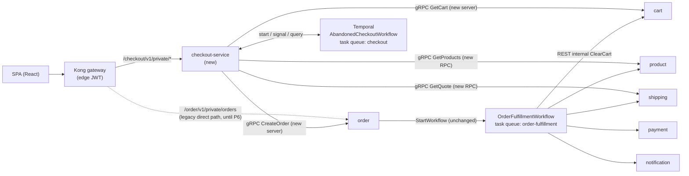
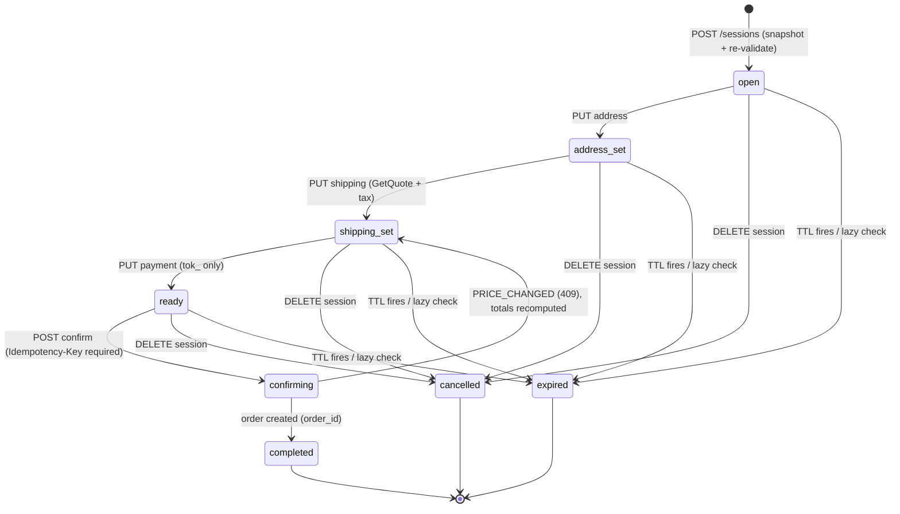
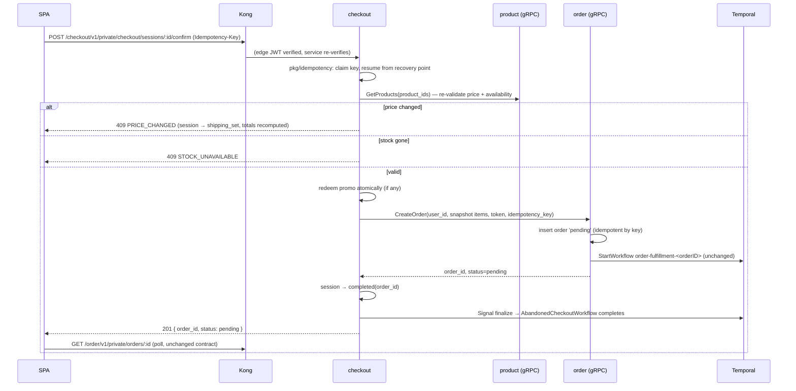

# RFC-0015: Checkout service — session state machine, price re-validation, and the order handoff

| Status | Scope | Created | Last updated |
|--------|-------|---------|--------------|
| provisional | platform-wide | 2026-07-11 | 2026-07-12 |

> **Don't forget: every decision is a tradeoff.** The headline tradeoffs in this
> RFC: checkout does **not** own orders or the saga (it pays an extra internal
> hop at confirm to keep order the single writer); stock is **checked but not
> reserved** at checkout (an accepted TOCTOU window, closed by the saga); and
> session expiry is a **durable Temporal timer with a lazy-expiry backstop**
> (correctness never depends on a worker being alive).

## Summary

Introduce **checkout-service**, the last missing domain service of the platform:
a session/UX orchestrator that sits between the SPA and order-service. It owns
an ephemeral, short-TTL **checkout session** (cart snapshot, address, shipping
method, promo code, computed totals) driven by an explicit **state machine**;
**re-validates price and stock against product-service** at session creation
and again at confirm (closing the documented stale-price gap); computes totals
from a real **shipping quote** and a **tax rule**, all in int64 minor units; and
on confirm performs a durably **idempotent handoff** to order-service, which
remains the sole orders-writer and saga-starter. Session abandonment is handled
by a per-session **Temporal durable timer** (`AbandonedCheckoutWorkflow`) — the
platform's first use of `workflow.Sleep`, Signals, Query handlers, and
Signal-With-Start. All synchronous east-west calls from checkout are gRPC,
which requires two new gRPC servers (cart, order) and two new RPCs on existing
servers (product, shipping).

## Motivation

Checkout on this platform is currently a single POST: the SPA calls
`POST /order/v1/private/orders` directly; order-service reads pricing live from
cart (REST, forwarded JWT), inserts the order as `pending`, starts the
`OrderFulfillmentWorkflow` saga, and the SPA polls. That works, but it is not
how a production commerce stack shapes the purchase funnel, and it leaves real
gaps that are already acknowledged in our docs:

- **Stale prices.** Cart stores `product_price` denormalized at add-to-cart
  time and is treated as the pricing authority at checkout
  ([`docs/api/microservices.md`](../../../api/microservices.md)). Nothing
  re-validates against product-service between "add to cart" (possibly days
  ago) and "place order". A price change silently charges the old price.
- **No purchase state.** Address, shipping method, and payment selection have
  nowhere to live server-side. The SPA submits everything in one shot; there is
  no multi-step flow, no server-enforced step ordering, and no way to resume an
  interrupted checkout.
- **Hardcoded costs.** Shipping is a `$5.00` constant inside cart-service; tax
  does not exist. Neither belongs to cart.
- **Weak idempotency at the top of the funnel.** `POST /orders` accepts an
  *optional* `Idempotency-Key` header with a simple replay check — unlike
  payment-service, which uses the durable `pkg/idempotency` library
  ([ADR-010](../../adr/ADR-010-shared-idempotency-library/)). A double-clicked
  "Place order" is only safe if the SPA happens to send a key.
- **Unused Temporal surface.** The saga uses activities, retries, and
  compensation — but the platform has never used durable timers, Signals,
  Query handlers, or Signal-With-Start. Ephemeral sessions with deadlines
  ("thousands of sessions, each with its own 30-minute clock, no cron") are
  the canonical use case.

### Goals

- A dedicated **checkout-service** (Go, 3-layer, `mop` chart, `checkout`
  domain) owning `checkout_sessions` with an explicit FSM:
  `open → address_set → shipping_set → ready → confirming → completed`.
- **Price/stock re-validation** at session create and at confirm, with
  product-service as the price authority at checkout time and a first-class
  `PRICE_CHANGED` UX path.
- **Durably idempotent confirm** — the second consumer of `pkg/idempotency`
  (validating ADR-010's claim of reusability), with a deterministic key
  propagated to order-service.
- **Totals composition** in int64 minor units:
  `total = subtotal + shipping_quote + tax − discount`, with the shipping fee
  from a new shipping `GetQuote` RPC and tax from a flat-rate rule table.
- **Promo codes** with expiry, global redemption caps, and per-user limits,
  redeemed atomically at confirm.
- **`AbandonedCheckoutWorkflow`**: per-session durable timer with
  activity-reset Signals, a Query handler, Signal-With-Start, and a
  lazy-expiry backstop in the logic layer.
- **East-west convention completed**: all four synchronous checkout calls
  (cart, product, shipping, order) are gRPC, adding gRPC servers to cart and
  order and closing the largest remaining REST east-west exception.
- Order-service remains the **single writer of `orders` and the only
  saga-starter**; the shipped `OrderFulfillmentWorkflow` is not modified.

### Non-Goals

- **No message bus.** Kafka / RabbitMQ / Debezium CDC are not deployed on this
  platform; asynchronous work stays on Temporal plus the transactional-outbox
  pattern payment already uses. An eventing backbone (e.g. an `order.created`
  fan-out for consumers outside the saga) is deliberately deferred to a future
  RFC — this design does not preclude it (the confirm pivot is a natural
  outbox/publish point later).
- **No second saga.** The "parent CheckoutWorkflow" from early sketches already
  exists as `OrderFulfillmentWorkflow`
  ([`docs/api/temporal-order-fulfillment.md`](../../../api/temporal-order-fulfillment.md));
  this RFC does not wrap, replace, or re-parent it.
- **No asynchronous payment confirmation via Signal, and no
  post-confirmation order cancellation.** Both touch the shipped
  payment/mockpay/saga trio (mockpay would need an async-confirm mode; the
  `Authorize` step would change shape) and are split into a named follow-up,
  **RFC-0016**. Cancelling a *session* before confirm is in scope (trivial FSM
  transition); cancelling an *order* after confirm is not.
- **No soft-reservation of stock at checkout.** Reservation stays exclusively
  with the saga's `ReserveStock` step (product-service is the inventory owner,
  [RFC-0003](../RFC-0003/)). Checkout only checks availability.
- **No guest checkout** — the whole flow lives under `/private/` behind JWT.
- **No promo stacking, targeting, or admin UI** — one code per session, seeded
  by migration.
- **No cart write-path changes.** The saga's best-effort `ClearCart` step and
  cart's browser API are untouched; cart gains a read-only gRPC surface.

## Architecture & Diagrams

### Where checkout sits

Checkout is a *client-only* service: nothing dials into it except Kong. Every
synchronous east-west edge it introduces is gRPC (`:9090`, `pkg/grpcx`,
headless `{svc}-grpc` Services, NetworkPolicy-fenced — mTLS remains deferred to
[RFC-0002](../RFC-0002/)). The saga and its edges are unchanged.



### Session state machine

States advance strictly forward through the funnel; a price change detected at
confirm drops the session back to `shipping_set` (totals must be recomputed).
`expired` and `cancelled` are terminal. Transitions are enforced in the logic
layer with a transition table, mirroring payment's state machine, and rejected
transitions return the existing `INVALID_TRANSITION` error code.



Notes on the shape:

- Edits under way (`PUT address` on a `shipping_set` session, changing the
  shipping method from `ready`) re-enter the corresponding state — the table
  allows same-or-earlier-state mutations, never forward jumps.
- There is no separate `abandoned` state: an abandoned checkout **is**
  `expired` with a `reason` column (`timer` vs `lazy`). One fewer state, same
  analytics.

### Confirm sequence (the critical path)



The SPA-facing contract after confirm is **identical to today**: a pending
order id, then polling. Checkout changes *who assembles and validates the
input*, not the fulfillment contract.

## Proposal

### Checkout session and snapshot

`POST /checkout/v1/private/checkout/sessions` snapshots the user's cart into
`checkout_session_items` — but with a deliberate authority shift:

- **cart is the item-list authority** — which products, what quantities. Read
  via the new `cart.v1/GetCart` RPC.
- **product is the price authority at checkout time** — unit prices are taken
  from `product.v1/GetProducts` (batch), *not* from cart's denormalized
  `product_price`. This is the fix for the stale-price gap: the price shown on
  the checkout screen is the price at checkout time, locked into the snapshot
  (`unit_price_minor`, int64 minor units — the representation order and
  payment already use since RFC-0010 P3).

If a snapshot price differs from the cart's denormalized price, the response
flags the affected lines (`price_changed: true` per item) so the SPA can render
a "price updated since you added this" notice — the funnel is honest instead of
silently different.

One session per user: `POST /sessions` is idempotent — if an active
(non-terminal) session exists it is returned (`200`) instead of creating a
second one (`201`), enforced by a partial unique index on `user_id`. An empty
cart is a `409`.

### REST API (Variant A, browser-facing)

All routes are `private` (JWT; Kong edge-JWT applies). Following
[`docs/api/api-naming-convention.md`](../../../api/api-naming-convention.md):
checkout, like auth, is a process-named service with no natural plural, so
its owning segment is the literal **`checkout`** with resources (`sessions`)
nested beneath it (naming convention v3.0.1,
[ADR-017](../../adr/ADR-017-api-path-collection-noun/)).

| Method | Path | Purpose |
|--------|------|---------|
| POST | `/checkout/v1/private/checkout/sessions` | Create (or return active) session: snapshot cart, re-validate prices, start/reset the abandonment timer |
| GET | `/checkout/v1/private/checkout/sessions/:id` | Session + items + computed totals (owner-scoped) |
| PUT | `/checkout/v1/private/checkout/sessions/:id/address` | Set shipping address → `address_set` |
| PUT | `/checkout/v1/private/checkout/sessions/:id/shipping` | Choose method; fetches shipping `GetQuote`, computes tax → `shipping_set` |
| PUT | `/checkout/v1/private/checkout/sessions/:id/payment` | Attach payment method — `tok_…` token only, PAN-like input rejected `400` before persist (same PCI-safe rule as order/payment) → `ready` |
| POST | `/checkout/v1/private/checkout/sessions/:id/promo` | Apply a promo code (validity checked now; redemption counted at confirm) |
| POST | `/checkout/v1/private/checkout/sessions/:id/confirm` | **`Idempotency-Key` header required** — re-validate, redeem promo, `CreateOrder`, → `completed` |
| DELETE | `/checkout/v1/private/checkout/sessions/:id` | Cancel the session |

New `httpx` error codes: `SESSION_EXPIRED`, `PRICE_CHANGED`,
`STOCK_UNAVAILABLE`, `PROMO_INVALID`, `PROMO_EXPIRED`, `PROMO_EXHAUSTED`.
Every session mutation first runs the lazy-expiry check (see below); mutating
an expired session returns `410 SESSION_EXPIRED`.

### New gRPC surfaces

Checkout is the first service whose *every* synchronous east-west call is gRPC,
per the platform convention. Four surfaces, two of them new servers:

| Edge | Surface | Status today | Change |
|------|---------|--------------|--------|
| checkout → cart | `cart.v1/GetCart(user_id) → items[]` | cart has **no gRPC server** | New proto package + server via `pkg/grpcx`; `grpc_server: true` in `rsip-cart`; `cart-grpc` headless Service; NetworkPolicy admits `checkout` ns to `:9090` |
| checkout → product | `product.v1/GetProducts(ids[]) → {id, name, price_minor, available_qty}[]` | server exists (`ReserveStock`/`ReleaseStock`) | Additive batch read RPC |
| checkout → shipping | `shipping.v1/GetQuote(method, region) → {fee_minor, eta_days}` | server exists | Additive RPC; rates from a static rule table inside shipping (ending cart's `$5` constant as the fee authority) |
| checkout → order | `order.v1/CreateOrder(user_id, items[], payment_method_token, idempotency_key) → {order_id, status}` | order has **no gRPC server** (client only) | New proto package + server; `grpc_server: true` in `rsip-order`; `order-grpc` headless Service; NetworkPolicy admits `checkout` ns to `:9090` |

Design points:

- **`CreateOrder` is the boundary-defining RPC.** Order keeps exactly its
  current invariant — "insert `pending` row and `StartWorkflow` in one
  place" — now reachable by an internal caller. The gRPC path **skips order's
  live cart read**: checkout has already re-validated against product-service,
  a strictly stronger check than re-reading cart's denormalized prices. The
  REST `POST /orders` path keeps its existing cart validation untouched until
  P6. `idempotency_key` is a required request field on the RPC (unlike the
  optional REST header).
- **`GetCart` is read-only.** The saga's `ClearCart` stays on the tokenless
  REST internal route; migrating cart's write path to gRPC is listed as a
  follow-up criterion in the spawned ADR, not done here.
- gRPC carries no user JWT (consistent with every existing east-west edge):
  identity crosses as an explicit `user_id` field, callers are constrained by
  NetworkPolicy, and mTLS remains RFC-0002's job. The tradeoff — an in-cluster
  workload that defeats NetworkPolicy could forge `user_id` — is the same
  accepted posture as `ReserveStock`/`CreateShipment` today.

### Price & stock re-validation policy

Re-validation runs twice: at session create (UX honesty) and at confirm
(the money moment).

- **Price:** confirm-time price ≠ snapshot price → `409 PRICE_CHANGED`, the
  session drops to `shipping_set`, totals are recomputed from the new prices,
  and the SPA shows the diff. The user re-confirms at the new price — nobody
  is silently charged a price they never saw.
- **Stock:** `available_qty < quantity` → `409 STOCK_UNAVAILABLE`. This is a
  **check, not a reservation**. The authoritative claim on stock remains the
  saga's idempotent `ReserveStock` (keyed by order id).

**Named tradeoff (TOCTOU):** between checkout's availability check and the
saga's `ReserveStock`, stock can still be taken by a concurrent order. That is
accepted by design: the check is a fail-fast UX filter; the saga is the
correctness gate and already compensates cleanly (`ReleaseStock`, void, fail
order). The alternative — checkout soft-reserving stock — would put two writers
on the reservation ledger and break RFC-0003's single-owner semantics for a
marginal UX gain.

### Totals, tax, and shipping quote

`total = subtotal + shipping_fee + tax − discount`, all int64 minor units, all
persisted on the session at each recompute (a session is an auditable quote):

- **Shipping fee** comes from shipping's `GetQuote` at `PUT …/shipping`. Rates
  live in shipping-service (static method x region table) — the quote belongs
  to the shipping domain, not to cart or checkout.
- **Tax** is a flat-rate rule table (`region → rate_bps`) inside checkout's DB,
  seeded by migration, applied to `subtotal + shipping_fee`. Deliberately
  simple: the lesson is *where tax computation lives and when it runs*
  (quote-time, recomputed on every totals change), not tax-law modeling.

### Promo codes

Tables `promo_codes` (`code`, `kind` percent|fixed, `value`, `expires_at`,
`max_redemptions`, `redeemed_count`, `per_user_limit`) and `promo_redemptions`
(code, user, session, order, timestamp), seeded by migration.

- `POST …/promo` validates (exists, not expired, caps not exhausted for this
  user) and attaches the code — it does **not** count a redemption, so an
  abandoned session never burns a use.
- Redemption is counted **at confirm**, atomically:
  `UPDATE promo_codes SET redeemed_count = redeemed_count + 1 WHERE code = $1
  AND redeemed_count < max_redemptions` — zero rows updated means
  `409 PROMO_EXHAUSTED`. The per-user limit is enforced by counting
  `promo_redemptions` in the same transaction. A concurrent-redemption race
  test (N goroutines, cap M, exactly M succeed) is an explicit exit criterion.

### AbandonedCheckoutWorkflow (Temporal)

The platform's first timer/Signal/Query workflow, entirely decoupled from the
fulfillment saga. One workflow instance per session,
ID `checkout-session-<sessionID>`, on a new task queue **`checkout`**, executed
by a **checkout-worker** (second Deployment of the checkout image with
`args: ["worker"]` — exactly the order/order-worker pattern).

```go
// Sketch — real code lives in checkout-service.
func AbandonedCheckoutWorkflow(ctx workflow.Context, in SessionInput) error {
    activityCh := workflow.GetSignalChannel(ctx, "activity") // any mutation resets the clock
    finalizeCh := workflow.GetSignalChannel(ctx, "finalize") // confirmed or cancelled
    for {
        timerCtx, cancelTimer := workflow.WithCancel(ctx)
        timer := workflow.NewTimer(timerCtx, in.TTL) // durable 30-minute clock
        selector := workflow.NewSelector(ctx)
        fired, done := false, false
        selector.AddFuture(timer, func(workflow.Future) { fired = true })
        selector.AddReceive(activityCh, func(c workflow.ReceiveChannel, _ bool) { c.Receive(ctx, nil) })
        selector.AddReceive(finalizeCh, func(c workflow.ReceiveChannel, _ bool) { c.Receive(ctx, nil); done = true })
        selector.Select(ctx)
        cancelTimer()
        if done { return nil }                    // completed/cancelled — nothing to do
        if fired { break }                        // TTL elapsed with no activity
    }                                             // else: activity signal — loop, timer resets
    return workflow.ExecuteActivity(ctx, MarkSessionExpired, in.SessionID).Get(ctx, nil)
}
```

- **Signal-With-Start** from `POST /sessions` makes create idempotent against
  worker/API races (start if absent, signal `activity` if present).
- Every mutation sends `activity` (timer reset — the "user is still filling
  the form" semantics chosen for this platform); confirm/cancel send
  `finalize`.
- A **Query handler** (`session_state`) exposes the workflow's view (state,
  deadline) for debugging in the Temporal UI — the platform's first Query.
- `MarkSessionExpired` is idempotent and conditional
  (`UPDATE … SET status='expired', reason='timer' WHERE status NOT IN
  (terminal states)`) — a late-firing timer against a completed session is a
  no-op.
- Optional stretch: on expiry, a best-effort abandoned-checkout email via the
  existing notification `SendEmail` RPC (same fire-and-forget posture as the
  saga's notify steps).

**Lazy-expiry backstop (the production lesson):** the logic layer treats
`now > expires_at` as expired on **every read and mutation**, regardless of
what Temporal has done. If the worker is down for an hour, no session is
honored past its deadline — the timer workflow is an *actor* that tidies state
and triggers side effects; it is never the source of truth for validity.
Correctness degrades to "expiry recorded late", never "expired session
accepted".

**Stretch (P2):** an additive, read-only Query handler on
`OrderFulfillmentWorkflow` exposing saga progress ("reserving stock",
"capturing payment") that order's details endpoint could surface — zero risk to
the saga, deferred if it slips.

### Data model (checkout DB)

New `checkout` database on `cnpg-db` (RFC-0012 triplet). Sketch:

- `checkout_sessions` — id (uuid), user_id, status, address (jsonb),
  shipping_method, shipping_fee_minor, tax_minor, promo_code (nullable),
  discount_minor, subtotal_minor, total_minor, currency,
  payment_method_token (nullable, `tok_…` only), order_id (nullable),
  expires_at, expired_reason (nullable), created_at, updated_at. Partial
  unique index: `UNIQUE (user_id) WHERE status IN ('open','address_set',
  'shipping_set','ready','confirming')`.
- `checkout_session_items` — session_id, product_id, product_name, quantity,
  unit_price_minor, cart_price_minor (for the price-changed diff).
- `tax_rules` — region, rate_bps (seeded).
- `promo_codes`, `promo_redemptions` — as above (seeded).
- `idempotency_keys` — owned by `pkg/idempotency` (same shape as payment's).

### User Stories

- *Shopper:* prices I see at checkout are the prices I pay; if something
  changed since I carted it, I'm told and re-confirm — never surprised on the
  invoice.
- *Shopper:* I can stop at the address step, come back 10 minutes later, and
  continue; if I disappear for 30+ minutes the session quietly expires and my
  cart is untouched.
- *Shopper:* double-clicking "Place order" (or retrying on a flaky connection)
  never creates two orders or burns my promo code twice.
- *Platform engineer:* I can watch thousands of per-session countdown clocks in
  the Temporal UI, query any one of them, and kill the worker without any
  expired session being honored.
- *Platform engineer:* order remains the one place orders are created and the
  saga is started, whether the caller is the legacy SPA path or checkout.

### Alternatives

**Boundary — who creates the order and starts the saga?**

| Option | Verdict |
|--------|---------|
| **(chosen) Checkout calls a new `order.v1/CreateOrder` gRPC; order keeps the insert-pending + StartWorkflow invariant** | One extra internal hop at confirm; in exchange the saga contract, order's single-writer status, and the SPA poll contract are untouched, and the east-west convention is honored |
| Parent `CheckoutWorkflow` wrapping the saga as a child, with a `CreateOrder` activity | Rejected: blurs `orders` ownership (a checkout-owned activity writing another service's records), breaks the shipped 201-pending-poll contract, and forces a refactor of a working saga to learn child workflows — a lesson available far cheaper elsewhere |
| Checkout starts `OrderFulfillmentWorkflow` directly | Rejected: the saga assumes the `pending` row exists before `StartWorkflow`; checkout cannot write order's DB (DB-per-service), so insert and start would split across two services — a race by construction |
| REST forward-JWT to the existing `POST /orders` (no order gRPC) | Rejected after review: minimal-change but perpetuates the REST east-west exception the convention says to close; chosen path accepts the refactor deliberately ("do it like production does") |
| Extend order-service with session endpoints (no new service) | Rejected: welds ephemeral funnel state (30-minute TTL, UX-shaped) onto the durable transactional record owner; separate lifecycles, separate DB, separate scaling — and the domain boundary *is* the lesson |

**Session storage & expiry**

| Option | Verdict |
|--------|---------|
| **(chosen) Postgres triplet + per-session Temporal timer + lazy backstop** | FSM with audit trail, survives restarts, teaches durable timers; backstop removes the worker as a single point of failure for correctness |
| Valkey with `EXPIRE` | Rejected as authority: eviction can silently drop live sessions, no FSM audit, no reliable expiry callback for side effects; fine later as a read cache |
| Cron/poll sweeper for expiry | Rejected: another scheduled moving part, coarse granularity, teaches nothing new — and still needs the lazy check anyway |

**Timer semantics** — hard 15-minute TTL from create (flash-sale style
"your slot is held") was considered; chosen instead: 30 minutes reset on every
mutation (Signal reset), because nothing is actually held (no reservation), so
the clock models user presence, not resource holding.

### What this deliberately does not introduce (corrections from early research)

The exploratory notes that seeded this RFC assumed several components this
platform does not have. Recording the deltas so the RFC is honest about the
starting point:

- ~~Kafka `order.created` topic, Debezium/Postgres CDC~~ → no broker exists;
  Temporal + payment's outbox cover today's async needs. Future-work RFC.
- ~~New parent "CheckoutWorkflow" saga~~ → already exists as
  `OrderFulfillmentWorkflow`; not duplicated.
- ~~Payment confirmation Signal, CancelOrderWorkflow~~ → RFC-0016.
- ~~Shipping child workflow + Continue-As-New~~ → shipping is an in-cluster
  mock with no long-lived carrier callbacks; a child workflow here would be
  ceremony without a driver. Revisit with a real carrier-webhook RFC.

## Design Details — phased delivery

Same delivery discipline as RFC-0010: each phase lands green in **local-stack
e2e first**, then the cluster phase (P5) brings GitOps manifests. Code trails
config; every phase independently shippable.

| Phase | Deliverable | Exit criteria | Repos |
|-------|-------------|---------------|-------|
| **P1 — service + sessions + re-validation** | checkout-service scaffold (3-layer, `pkg` authmw/obsx/httpx/migratex, CI + Sonar); `checkout` DB; sessions CRUD + FSM + snapshot; **cart gRPC server (`GetCart`)**; **product `GetProducts`**; create-time re-validation; new error codes; local-stack: checkout container (no host port — reached only through Kong, platform convention) + Kong route + `init.sql` DB | Session lifecycle e2e in local-stack; a product price change between add-to-cart and session-create is detected and flagged | checkout-service (new), pkg, cart-service, product-service, homelab (local-stack) |
| **P2 — confirm + abandonment** | `pkg/idempotency` on confirm; **order gRPC server (`CreateOrder`)**; confirm→order handoff; `AbandonedCheckoutWorkflow` + checkout-worker + lazy backstop; (stretch) saga Query handler | Full checkout→order→saga→`confirmed` e2e; confirm replay with same key returns the same order, no double saga; abandoned session expires on TTL with worker up **and** is rejected with worker down | checkout-service, pkg, order-service, homelab (local-stack), (order-service stretch) |
| **P3 — totals + SPA cutover** | shipping `GetQuote`; tax rules; totals in minor units; SPA multi-step checkout flow (dual-entry: legacy direct `POST /orders` stays live) | Totals correct across fee/tax/discount combinations; SPA completes a purchase through checkout; legacy path still passes regression | shipping-service, pkg, checkout-service, frontend |
| **P4 — promo codes** | promo tables + apply + atomic confirm-time redemption + per-user limits | Concurrent-redemption race test: cap never exceeded; expired/exhausted codes rejected with correct codes | checkout-service |
| **P5 — cluster GitOps** | `kubernetes/apps/services/checkout.yaml` (RSIP, `domain: checkout`, no `grpc_server` — client only) + checkout-worker HelmRelease (order-worker pattern); cnpg-db triplet `services/checkout.yaml` + kustomization + `pg_hba` line (ADR-013/015); app-ns secret copy; OpenBAO seed; NetworkPolicies (checkout ingress: Kong→8080 only; cart/order netpol: admit `checkout` ns →9090); **add `checkout` to the Kyverno policies with hardcoded namespace lists** (RFC-0010 P5 lesson); Kong route; dashboards/SLO via chart | `make validate` clean; Flux reconciles; cluster e2e purchase through checkout | homelab |
| **P6 — deprecate the direct path** | SPA drops direct `POST /orders`; order removes the now-redundant live-cart re-check on the REST path; docs sweep (`api.md`, `microservices.md`, temporal doc, this RFC → `implemented`) | SPA has a single checkout entry; docs match reality | order-service, frontend, homelab (docs) |

### Impact on existing services

| Service | Change | Risk |
|---------|--------|------|
| cart | +gRPC server (`GetCart`, read-only), `grpc_server: true`, netpol :9090 for checkout | Low — additive; browser API and saga `ClearCart` untouched |
| product | +`GetProducts` batch RPC | Low — additive read on an existing server |
| shipping | +`GetQuote` RPC + static rate table | Low — additive; existing shipment RPCs untouched |
| order | +gRPC server (`CreateOrder`); P6: drop redundant cart re-check on REST path | Medium — first gRPC server on order; mitigated by reusing the exact code path REST uses and by P6 sequencing |
| frontend | P3 multi-step checkout UI; P6 single entry | Medium — dual-entry until P6 keeps rollback one revert away |
| pkg | New proto packages `cart.v1`, `order.v1`; additions to `product.v1`, `shipping.v1`; second `pkg/idempotency` consumer | Low |
| payment, notification, mockpay | **None** (notification optionally reused as-is for abandonment email) | — |
| `OrderFulfillmentWorkflow` / order-worker | **None** (stretch Query is additive) | — |

### Reversibility & operator visibility

- **Enable/disable:** checkout is dark until the SPA cutover (P3); no backend
  feature flag needed because no existing call path is rewired (contrast with
  RFC-0010's `PAYMENT_ENABLED`, which gated a saga step).
- **Rollback:** revert the SPA to the direct `POST /orders` path — checkout
  can then be scaled to zero or removed entirely; **no other service dials
  checkout**, so removal breaks nothing. The four new gRPC surfaces are
  additive and inert without their caller.
- **Visibility:** `flux get helmreleases -n checkout`; sessions and timers in
  the Temporal UI (`checkout` task queue); business metrics below.
- **Drawbacks (stated):** one more service+worker+DB to run; a second
  idempotency store to reason about; dual validation paths (checkout gRPC vs
  legacy REST) during P3–P5; TOCTOU stock window (accepted, see above); per-
  session workflows cost Temporal history (bounded: one timer loop + at most a
  handful of signals per session, hours-long lifetime — far below
  Continue-As-New territory).

## Security considerations

- **AuthN/Z:** all browser routes `private` — Kong edge JWT (RFC-0009 Phase 4)
  plus authoritative in-service verification (`pkg/authmw`); sessions
  owner-scoped by JWT `user_id` (anti-IDOR, same posture as order).
- **PCI-shaped hygiene:** `PUT …/payment` accepts only `tok_…` references,
  rejects PAN-like input `400` pre-persist — the rule order and payment
  already enforce; checkout stores the token, never card data.
- **NetworkPolicy (live, default-deny):** checkout ingress = Kong →8080 only
  (checkout runs **no** gRPC server); checkout egress = cart/product/shipping/
  order :9090, Temporal frontend :7233, PgDog :6432. cart and order netpols
  gain a `checkout`-namespace allow on :9090. Payment's tight policy is the
  model; payment itself is untouched (still admits only `order` ns).
- **gRPC trust:** no user JWT east-west; explicit `user_id` fields fenced by
  NetworkPolicy — identical to today's `ReserveStock`/`CreateShipment` posture;
  mTLS remains [RFC-0002](../RFC-0002/).
- **Kyverno/PSS:** `checkout` namespace joins PSS-restricted app namespaces;
  image `ghcr.io/duynhlab/checkout-service/checkout-service:<tag>`, pinned;
  probes + resources per admission policy; the hardcoded namespace-list
  policies must gain `checkout` (explicit P5 item — the RFC-0010 P5 regression
  we are not repeating).
- **Secrets:** DB creds via the standard ESO/OpenBAO triplet path; no new
  secret classes.
- **Abuse:** promo redemption is atomic and capped; the `/checkout/*` routes
  get the same Kong rate-limiting configuration as sibling service routes.

## Observability & SLO impact

- RED metrics, logs, and traces via `pkg/obsx` OTLP push (RFC-0014) — checkout
  and checkout-worker are born on the post-RFC-0014 pipeline; no scrape config.
- SLO via the `mop` chart's `slo.enabled` (Sloth) — same availability/latency
  objectives as sibling services; fleet-wide microservices alert rules apply
  automatically.
- Proposed business metrics: `checkout_sessions_created_total`,
  `checkout_sessions_confirmed_total`,
  `checkout_sessions_expired_total{reason="timer|lazy"}`,
  `checkout_price_changed_total`, `checkout_promo_redemptions_total`.
  A sustained `expired{reason="lazy"}` majority is the "worker is down or
  wedged" signal.
- checkout-worker exports Temporal SDK worker metrics like order-worker; the
  saga's dashboards are unaffected.
- Watch during rollout: confirm-path p95 (adds two gRPC hops vs legacy),
  `PRICE_CHANGED` rate (should be rare; a spike means product pricing churn or
  a bug), order-creation success parity between the two entry paths.

## Rollout & rollback

Phased P1→P6 as above. Blast-radius notes:

- P1–P2 are invisible to users (no SPA change); the four new gRPC surfaces are
  additive and idle until checkout calls them.
- P3 cuts the SPA over while the legacy path stays live — rollback at any
  point through P5 is a frontend revert, nothing server-side.
- P5 is manifests-only, gated by `make validate` and Flux dependency ordering
  (checkout joins `rs-checkout` under the `apps-local` Kustomization, which
  already depends on databases + monitoring + temporal).
- P6 is the only phase that removes behavior (SPA direct path, order's
  redundant cart check) and lands last, after the checkout path has soaked.

## Testing / verification

- **Unit:** FSM transition table (every legal/illegal edge), totals math
  (minor-units property tests), promo validation, lazy-expiry predicate.
- **Race:** concurrent promo redemption (cap M, N≫M goroutines, exactly M
  succeed); concurrent confirm with the same Idempotency-Key (one order).
- **Workflow (Temporal Go SDK test env):** timer fires → expired; `activity`
  signal resets; `finalize` completes without expiry; late timer vs completed
  session is a no-op.
- **e2e (local-stack, each phase):** full purchase through checkout;
  price-change-at-confirm 409 → re-confirm; stock-gone 409; abandonment with
  worker up (timer) and worker down (lazy rejection); legacy-path regression
  until P6.
- **Cluster (P5):** `make validate`; Flux reconciliation; cluster e2e
  purchase; NetworkPolicy verification (checkout cannot reach payment :9090;
  nothing reaches checkout except Kong).
- Standard service-repo gauntlet per PR: golangci-lint, `go test -race`,
  Sonar new-code coverage ≥80%.

## Implementation History

- 2026-07-11 — RFC created (provisional); scope decisions locked with review:
  gRPC boundary (order/cart servers), Temporal scope split (RFC-0016),
  1-session-per-user + 30-min reset-on-activity TTL, P6 deprecation of the
  direct order path.
- 2026-07-12 — aligned with the platform's ADR-017 (v3 collection-noun
  paths): spawned-ADR numbers shifted to 018–022; checkout's collection noun
  `sessions` registered (planned) in the naming convention. Route shapes were
  already conformant — no path changed.
- 2026-07-12 — convention-owner review: routes nest under the literal
  `checkout` segment (`/checkout/v1/private/checkout/sessions[…]`, naming
  convention v3.0.1) — a bare `sessions` collection was ambiguous; applied
  pre-P3 (no consumers), so no aliases.
- 2026-07-12 — **P1 shipped** (local-stack): checkout-service rebuilt on the
  platform template (old non-conforming scaffold removed); sessions
  create/get/address/cancel + full FSM + lazy-expiry backstop; cart gRPC
  server (`GetCart`, ADR-021) + product `GetProducts` (ADR-020) + pkg
  v0.19.0 (cart.v1, checkout httpx codes). Deviation from the draft: no host
  port `8010` — checkout follows the platform convention (services are
  reached only through Kong).
- 2026-07-13 — **P2 shipped** (local-stack): confirm handoff + abandonment.
  order.v1/CreateOrder (order's first gRPC server; idempotent by
  `(user_id, idempotency_key)` with a replay fingerprint, pending-only saga
  kickoff gate + RejectDuplicate — ADR-018); checkout PUT shipping (fee/tax
  0-stub until P3) + PUT payment (`tok_` only) + POST confirm
  (pkg/idempotency Claim→marker→CreateOrder→Finish with session↔claim
  binding and deadline fencing; PRICE_CHANGED/STOCK_UNAVAILABLE requote
  never consumes the key); AbandonedCheckoutWorkflow + checkout-worker
  (DB-authoritative ExpireIfDue + re-arm — ADR-019); confirm/expiry metrics;
  pkg v0.20.0 (order.v1). Design hardened by two adversarial doubt cycles
  per risky artifact (fresh-context reviewer + Codex CLI): the marker, the
  binding, the deadline fence, and the wake-up-not-verdict timer all come
  from review findings. Deviations from the draft: the confirm entry gate
  requires the FSM `ready` state (draft implied confirm from `ready` only —
  unchanged), and re-validation is skipped once an order attempt was ever
  authorized (marker) — the draft's "re-validate at confirm" is preserved
  for FIRST attempts only, by correctness necessity.
- 2026-07-13 — **P3 shipped** (local-stack): totals + SPA cutover.
  shipping.v1/GetQuote (static method × region rate table — the fee
  authority; pkg v0.21.0); checkout composes
  `total = subtotal + fee + tax − discount` in minor units from a seeded
  `tax_rules` table (DEFAULT fallback), invalidates the quote on address
  change, and recomputes tax on confirm-time requotes — the stored total is
  always recomputed in SQL from persisted components. The SPA cuts
  `/checkout` over to the multi-step session funnel (server FSM drives the
  steps; one persisted Idempotency-Key per session; requotes re-render with
  changed lines flagged) with the legacy one-shot flow kept at
  `/checkout/legacy` (dual-entry until P6).

- 2026-07-13 — **P4 shipped** (local-stack): promo codes. Apply/remove as a
  validated preview (never a counted use); atomic confirm-time redemption
  (ADR-022: redeem strictly BEFORE the attempt marker, ON CONFLICT
  (code, session_id) anchor evaluated before expiry/caps, FOR UPDATE
  serialization — both caps race-tested); exhausted/expired strips to
  shipping_set and never consumes the Idempotency-Key; discounts re-derive
  at every totals change. **Scope deviation from the phase table:** the wave
  also touched pkg (v0.22.0) and order-service — implementation surfaced a
  P3 gap where the saga charged subtotal + the legacy $5 demo fee instead
  of the session's quoted fee/tax; CreateOrder now carries
  fee/tax/discount, order persists them (migration 000007 restates
  check_order_total as the full composition), and the e2e asserts
  session total == order total == charged amount.

## Related

- [RFC-0003](../RFC-0003/) — inventory ownership: why checkout checks but never
  reserves stock.
- [RFC-0009](../RFC-0009/) — JWT + Kong edge auth: the `/private/` posture
  checkout inherits.
- [RFC-0010](../RFC-0010/) — payment service: `pkg/idempotency` (ADR-010),
  minor units, mockpay, and the saga steps checkout hands off to.
- [RFC-0012](../RFC-0012/) — CNPG declarative triplets: how the `checkout` DB
  is provisioned.
- [RFC-0014](../RFC-0014/) — OTLP observability pipeline checkout is born on.
- [RFC-0002](../RFC-0002/) — east-west mTLS (deferred hardening for the four
  new gRPC edges).
- **RFC-0016 (planned)** — asynchronous payment confirmation via Temporal
  Signal (mockpay async-confirm mode) + post-confirmation order cancellation
  (CancelOrderWorkflow with conditional compensation).
- Expected spawned ADRs (shifted +1 on 2026-07-12 — ADR-017 was taken by the
  platform's [api-path-collection-noun](../../adr/ADR-017-api-path-collection-noun/)
  decision): ADR-018 checkout/order boundary (`CreateOrder` gRPC; order keeps
  orders-writer + saga-starter); ADR-019 session expiry (durable timer + lazy
  backstop); ADR-020 re-validation policy (product as checkout price
  authority; stock check-only); ADR-021 cart gRPC read surface (and criteria
  for migrating cart writes); ADR-022 atomic promo redemption.
- Docs to update on implementation: [`docs/api/api.md`](../../../api/api.md),
  [`docs/api/api-naming-convention.md`](../../../api/api-naming-convention.md),
  [`docs/api/microservices.md`](../../../api/microservices.md),
  [`docs/api/grpc-internal-comms.md`](../../../api/grpc-internal-comms.md),
  [`docs/api/temporal-order-fulfillment.md`](../../../api/temporal-order-fulfillment.md),
  [`SERVICES.md`](../../../../SERVICES.md).
