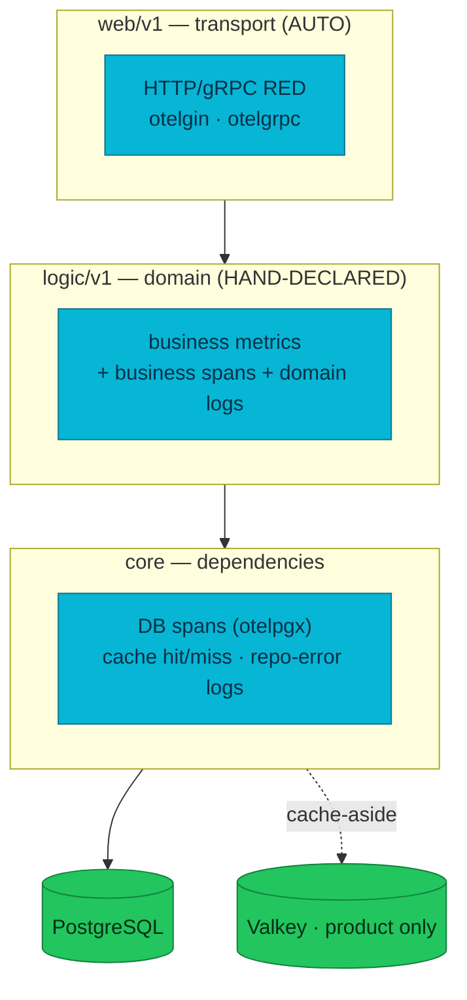

# RFC-0017 Platform telemetry standard: per-layer signal ownership + fleet instrumentation

| Status | Scope | Created | Last updated |
|--------|-------|---------|--------------|
| provisional | platform-wide | 2026-07-14 | 2026-07-14 |

> **Don't forget: every decision is a tradeoff.** This RFC deliberately spends
> effort instrumenting *every* service's data layer and domain — more code and
> more series than "the auto layer is enough" — in exchange for a fleet that
> can be debugged and reasoned about uniformly. The cost is itemized in
> Drawbacks; the guardrail against its main risk (cardinality) is a hard
> bounded-label rule.

## Summary

RFC-0014 moved the platform to full OTLP push and gave every service **RED**
(HTTP/gRPC, via `otelgin`/`otelgrpc`) and **USE** (Go runtime + cAdvisor) for
free. A 10-service audit shows the story stops there: the **`logic` layer owns
no business metrics** on 9 of 10 services (only checkout has any), the **`core`
layer is telemetry-dark everywhere** — no service traces its database queries —
and repository errors vanish into bare `return err`. This RFC makes the
**3-layer × 3-signal ownership model explicit and normative**, then instruments
the whole fleet to it: DB query tracing at `core` (a shared `pkg` helper),
structured repo-error logs, and a per-service **business-metrics catalog** at
`logic`. It is a production-grade rollout, not a demo — the goal is a platform
whose telemetry mirrors what a mature production estate looks like.

## Motivation

The platform's observability is uneven in a way that only shows up under
pressure:

- **The `core` layer is invisible.** No service attaches an `otelpgx`
  `QueryTracer` to its `pgxpool` (verified across all 10). A `logic`-layer span
  like `auth.login` therefore has **no child DB span** — a slow login cannot be
  attributed to SQL vs bcrypt, and a database outage produces spans with a
  recorded error but no queryable log at the source (repositories `return err`
  with no table/op/SQLSTATE context).
- **The `logic` layer has no domain metrics.** Business outcomes exist only as
  trace span-events (`authentication.failed`, `refresh.reuse_detected`,
  `insufficient_stock`, …). They cannot be rated, alerted, or dashboarded —
  there is no `login-failure-rate`, no `payment decline-rate`, no
  `saga-compensation-rate`, no cache `hit-ratio`. Only checkout-service (RFC-0015
  P4) declares business instruments, and it is the reference the rest should
  follow.
- **Small correctness/leak issues ride along.** Two services carry a redundant
  manual `http.request` span duplicating `otelgin`'s server span; two set
  `username`/`email` as span attributes (PII + unbounded-cardinality risk).
- **The dashboards drifted.** The local-stack board still queries pre-cutover
  metrics that are no longer emitted (`go_memstats_*`, `go_threads`,
  `process_cpu_seconds_total`, `requests_in_flight`, `up{}`).

RFC-0014 was the pipeline; this RFC is the **coverage** — closing it to a
production bar across every service and every layer.

### Goals

- A **normative 3-layer × 3-signal ownership model** every service and PR follows.
- **`core` DB tracing fleet-wide** via a shared `pkg` helper (one place, all 10
  adopt) so every `logic` span shows its DB children, plus structured
  repo-error logs (table/op/SQLSTATE).
- A **per-service business-metrics catalog** at the `logic` layer — the domain
  KPIs each service should own, with **bounded labels and no PII**.
- **Consume it:** alerts and SLOs on the new domain KPIs, and a **separate**
  business-metrics dashboard (never mixed into the RED/runtime board).
- Small hygiene fixes: drop redundant manual HTTP spans; remove PII span attrs.

### Non-Goals

- No change to the OTLP pipeline, backends, or vmagent config (RFC-0014 stands).
- **No exemplars** (accepted-lost in RFC-0014; correlation stays via `trace_id`).
- No new tracing/metrics backend.
- No cache layer added where none exists — only instrument the one that does
  (product's Valkey). A user-service cache is a *finding*, not a deliverable here.
- SPA/business-facing dashboards beyond the operator board are out of scope.

## Proposal

### The standard — per-layer signal ownership

Each of the three architectural layers **owns** a distinct slice of telemetry.
This is the normative table; a PR that instruments the wrong layer (e.g. a
business metric in `web`, or a DB span hand-rolled in `logic`) is rejected.

| Layer | Owns | Metrics | Traces | Logs |
|-------|------|---------|--------|------|
| **`web/v1`** | transport | HTTP + gRPC **RED — AUTO** (`otelgin`/`otelgrpc`); never hand-written | server span **AUTO**; **no** redundant manual `http.request` span | one request log carrying `trace_id`; middleware chain = tracing → logging |
| **`logic/v1`** | domain | **business metrics live here** — OTel Meter counters/histograms, bounded labels | business spans (per use-case) — **never** PII in attributes | domain-event logs (outcome + `trace_id`) |
| **`core`** | dependencies | DB + cache metrics (hit/miss, op duration where no tracer) | **DB query spans via `otelpgx`**; cache spans via `redisotel` | **repo errors logged with context** (table, op, SQLSTATE) |

### Conventions (normative)

1. **Business metrics are declared in `logic`** via `otel.Meter("<service>")`,
   OTel dotted names (`<service>.<noun>.<verb>`), `WithUnit("s")` for durations,
   monotonic counters for counts. vmagent's `usePrometheusNaming` renders the
   PromQL form (counter → `_total`, seconds histogram → `_seconds`).
2. **Every label value is enumerable and bounded.** A `reason`/`result`/`outcome`
   with a small fixed set is fine; `user_id`, `order_id`, `session_id`,
   `payment_id`, `promo_code`, IPs, or raw errors are **forbidden** as labels or
   span attributes (they belong in logs/traces). See
   [metrics-apps cardinality control](../../../observability/metrics/metrics-apps.md#app-side-cardinality-control).
3. **DB tracing is uniform**, added once as a shared `pkg` helper that attaches
   an `otelpgx` `QueryTracer` to the pool at build time — services opt in with
   one line, not a per-repo copy. `otelpgx` is tracer-only; it does not change
   the pooler's simple-protocol query mode.
4. **RED/USE are never hand-written.** If a service author is declaring an HTTP
   or runtime counter, they are doing it wrong — those come from the auto layer.

### Alternatives

| | (1) Auto layer only (status quo) | (2) Per-repo DB tracing + ad-hoc metrics | **(3) Standard + shared helper + catalog — chosen** |
|---|---|---|---|
| `core` visibility | none | uniform but 10 copies | uniform, one helper |
| Business metrics | none (except checkout) | inconsistent naming/labels | one convention, reviewed catalog |
| Cardinality safety | n/a | per-author judgement | hard bounded-label rule |
| Effort | zero | high + drift | moderate, front-loaded in `pkg` |

**(1) rejected** — it is the current gap. **(2) rejected** — it reintroduces the
per-service drift RFC-0014 spent effort deleting.

## Design Details

### `core` layer — DB tracing + error logs (uniform, all 10)

A `pkg` helper wraps pool construction so `poolCfg.ConnConfig.Tracer` is an
`otelpgx` tracer feeding the global TracerProvider `obsx` installs. Result:
every `logic` span gains child `db.query` spans (statement, table, rows,
duration) and DB latency/errors become attributable. Repositories additionally
log failures with structured context (table, op, SQLSTATE) instead of bare
`return err`. Cache (product only): `redisotel` on the go-redis client for
cache-op spans + a hit/miss counter.

### `logic` layer — per-service business-metrics catalog

Curated from the audit; each is a `logic`-layer instrument with bounded labels.
`checkout` is already implemented (RFC-0015 P4) and is the reference; its four
funnel-completion additions are listed for parity. **Priority** guides wave
order, not inclusion.

| Service | Metric (PromQL) | Type | Bounded labels | Purpose | Priority |
|---------|-----------------|------|----------------|---------|----------|
| **auth** | `auth_login_attempts_total` | Counter | `result`=success\|invalid_credentials\|user_not_found | Core auth KPI; brute-force/credential-stuffing alert | High |
| auth | `auth_registrations_total` | Counter | `result`=success\|conflict\|error | Signup volume + failure ratio | High |
| auth | `auth_refresh_operations_total` | Counter | `result`=rotated\|invalid\|expired\|reuse_detected | Token-rotation health + stolen-token replay signal | High |
| auth | `auth_family_revocations_total` | Counter | `reason`=logout\|reuse | Revocations, separating logout from theft | Med |
| auth | `auth_password_hash_duration_seconds` | Histogram | `op`=hash\|compare | Isolate bcrypt cost from SQL time | Med |
| **user** | `user_profile_created_total` | Counter | `result`=success\|already_exists\|invalid_email\|invalid_user_id | Registration-completion tail (auth→user handshake) | Med |
| user | `user_profile_updated_total` | Counter | `result`=success\|unauthorized | Write volume + authz-failure signal | Med |
| user | `user_profile_lookup_total` | Counter | `audience`=public\|private, `found`=true\|false | Read split + 404 rate (justifies a future cache) | Med |
| **product** | `product_cache_operations_total` | Counter | `op`=get_product\|get_list, `result`=hit\|miss\|error | **Cache hit-ratio** (RED for cache-aside) | High |
| product | `product_stock_reservations_total` | Counter | `result`=reserved\|insufficient_stock\|error | Saga inventory-rejection rate (business vs infra) | High |
| product | `product_stock_releases_total` | Counter | `result`=released\|error | Saga compensation volume/failures | Med |
| product | `product_cache_stampede_lock_total` | Counter | `outcome`=acquired\|populated_by_peer\|timeout_fallback | Lock contention / DB-fallback stampedes | Med |
| product | `product_reviews_aggregation_total` | Counter | `result`=ok\|soft_failed\|no_client | Review gRPC soft-fail rate | Med |
| **cart** | `cart_operations_total` | Counter | `operation`=add\|update\|remove\|clear, `outcome`=ok\|invalid_qty\|not_found\|error | Cart write funnel + error rate per op | High |
| cart | `cart_items_added_total` | Counter | `result`=added\|rejected_invalid_qty | Top of purchase-conversion funnel | Med |
| cart | `cart_cleared_total` | Counter | `source`=user_rest\|internal_saga | Checkout-completion vs abandonment clears | Med |
| cart | `cart_snapshot_requests_total` | Counter | `result`=ok\|empty\|invalid_arg\|error | gRPC GetCart (RFC-0015 checkout read) | Med |
| **order** | `orders_created_total` | Counter | `result`=created\|replayed\|invalid, `source`=rest\|grpc_checkout | Throughput + idempotent-replay + validation-reject | High |
| order | `order_value_minor` | Histogram (minor USD) | `totals_source`=demo\|checkout_quoted | AOV/revenue + mispriced-quote detection | Med |
| order | `saga_outcome_total` | Counter | `outcome`=confirmed\|failed\|compensated | Fulfillment success rate (top SLO) | High |
| order | `saga_compensation_total` | Counter | `step`=void_payment\|refund_payment\|release_stock\|cancel_shipment\|fail_order, `result`=ok\|failed | Stuck-money detection (failed refund/void) | High |
| order | `payment_activity_total` | Counter | `op`=authorize\|capture\|void\|refund, `result`=ok\|declined\|rejected\|error | Authorize decline + capture failure | High |
| order | `stock_reservation_total` | Counter | `result`=reserved\|insufficient\|error | Insufficient-stock rate (common saga failure) | Med |
| **review** | `reviews_created_total` | Counter | `result`=created\|duplicate\|invalid_rating | Creation happy-path vs rejects | Med |
| review | `reviews_rating` | Histogram (rating 1–5) | — | Rating distribution (signature domain signal) | Med |
| review | `reviews_duplicate_rejected_total` | Counter | — | Business + integrity signal (pre-check + DB race) | Low |
| review | `grpc_reviews_truncated_total` | Counter | — | Silent truncation at the 10k gRPC cap | Low |
| **shipping** | `shipping_quote_requests_total` | Counter | `method`=standard\|express, `region_bucket`=domestic\|intl, `outcome`=ok\|unknown_input | GetQuote demand mix + 400 rate | High |
| shipping | `shipment_created_total` | Counter | `outcome`=ok\|invalid_order_id\|error | Saga step-2 volume + idempotent repeats | Med |
| shipping | `shipment_cancelled_total` | Counter | `outcome`=ok\|error | Saga compensation frequency | Med |
| shipping | `shipment_lookup_total` | Counter | `kind`=track\|by_order, `found`=true\|false | Customer tracking + fulfillment polling hit/miss | Med |
| **notification** | `notification_send_total` | Counter | `channel`=email\|sms, `outcome`=sent\|invalid_recipient\|error | Core domain event; send-volume + failure SLO | High |
| notification | `notification_read_total` | Counter | `mode`=single\|all | Engagement with delivered notifications | Low |
| notification | `notification_send_duration_seconds` | Histogram | `channel`=email\|sms | Send latency seam (future real provider) | Low |
| **payment** | `payment_authorization_total` | Counter | `result`=authorized\|declined\|error, `currency` | Decline rate — primary payment KPI | High |
| payment | `payment_operation_total` | Counter | `op`=capture\|void\|refund, `result`=ok\|rejected\|error | Money-lifecycle transitions | High |
| payment | `payment_captured_amount_minor_total` | Counter | `currency` | Settled money volume | Med |
| payment | `payment_provider_request_duration_seconds` | Histogram | `op`=charge\|capture\|refund\|void, `outcome`=ok\|declined\|transient | mockpay dependency SLI (the money hop) | High |
| payment | `payment_reconciliation_discrepancies_total` | Counter | `kind` (bounded) | Ledger-vs-provider drift per recon run | High |
| payment | `payment_outbox_pending` | UpDownCounter/gauge | — | Unpublished outbox backlog (stuck relay) | Med |
| **checkout** *(has 6; +4 for the funnel)* | `checkout_sessions_created_total` | Counter | — | Funnel entry — the missing conversion denominator | High |
| checkout | `checkout_confirm_rejected_total` | Counter | `reason`=in_flight\|key_conflict\|order_rejected\|upstream | Confirm failure taxonomy | High |
| checkout | `checkout_promo_applied_total` | Counter | — | Promo apply attempts (funnel vs redeemed) | Med |
| checkout | `checkout_session_stage_reached_total` | Counter | `stage`=address_set\|shipping_set\|ready | Per-stage funnel drop-off | Med |

### `web` hygiene (all services)

Delete the redundant manual `http.request` span where present (otelgin already
emits the server span); confirm the chain is exactly tracing → logging.

## Security considerations

- **PII must never be a metric label or span attribute.** Remove `username`/
  `email` span attributes (auth/user). Domain identity that must be captured for
  forensics goes in **logs** (redacted per policy), not metrics/traces.
- Security-relevant domain events (`auth_login_attempts_total{result=invalid_credentials}`,
  `auth_refresh_operations_total{result=reuse_detected}`) become **alertable** —
  a direct security win over span-event-only visibility.

## Observability & SLO impact

- New series budget: bounded per the label sets above; estimated additive load
  is small relative to the RED baseline (each counter is `services × label
  combinations`, all enumerable). No unbounded label is introduced.
- New alerts: login-failure-rate, refresh-reuse, payment decline-rate,
  saga-compensation-rate (stuck money), cache hit-ratio floor, outbox backlog.
- New SLIs where a domain KPI is a genuine objective (e.g. fulfillment success
  = `saga_outcome_total{outcome=confirmed}` ratio) — via Sloth, following the
  existing pattern.

## Rollout & rollback

Waves; each service PR is TDD-first (a test asserts the instrument records the
expected series), source-driven against the pinned OTel API, one service per
PR, gauntlet-reviewed; the shared `pkg` helper gets a doubt-cycle before fleet
rollout.

- **W0 — `pkg` foundation:** `otelpgx` DB-tracer helper + business-metric
  convention doc (+ optional `redisotel` helper). Tag `pkg`. Rollback: services
  simply don't adopt.
- **W1 — `core`, uniform (all 10):** adopt DB tracing + structured repo-error
  logs; delete redundant `http.request` spans; remove PII span attrs.
- **W2 — `logic` business metrics, per service:** the catalog above, richer
  domains first (payment, order, auth, product), then the rest; checkout's +4.
- **W3 — special surfaces:** payment mockpay-hop tracing + `traceparent`
  propagation; order saga custom metrics; product `redisotel` + hit/miss.
- **W4 — consume it:** fix the stale RED/runtime dashboard (drop dead
  scrape-era panels) and add a **separate** `$app`-templated business-metrics
  dashboard, in both the local-stack json and the cluster `grafana-dashboards`
  repo; alerts + SLOs; finalize docs.

Each wave is independently revertable; W0 lands before anything depends on it.

## Testing / verification

- Per service: `go build` + `go test -race` (instrument-records-series test) +
  golangci-lint + gauntlet; local-stack shows the new metrics in VictoriaMetrics
  and DB child spans in Tempo under the `logic` span.
- Fleet: on `make up`, `count({__name__=~"<svc>_.*"})` shows the new business
  series per service; a Tempo trace of a checkout→order→saga path shows a DB
  span at every hop; the business dashboard renders per `$app`.

## Implementation History

- 2026-07-14 — RFC drafted from a 10-service telemetry audit (3 layers × 3
  signals) + the doc-accuracy pass that exposed the checkout-only business-metric
  gap. `provisional` pending review.

## Related

- [RFC-0013](../RFC-0013/) — cardinality audit & streaming-aggregation playbook
  (the bounded-label discipline this RFC enforces).
- [RFC-0014](../RFC-0014/) — full OpenTelemetry adoption (the OTLP-push pipeline
  this RFC builds coverage on top of); [ADR-016](../../adr/ADR-016-otel-metrics-cutover/).
- [RFC-0015](../RFC-0015/) — checkout service, whose P4 business metrics are the
  reference pattern for the `logic`-layer catalog.
- [Application Metrics (RED)](../../../observability/metrics/metrics-apps.md) —
  the metrics-pillar doc this RFC extends with the Business family.

---
_Last updated: 2026-07-14_
