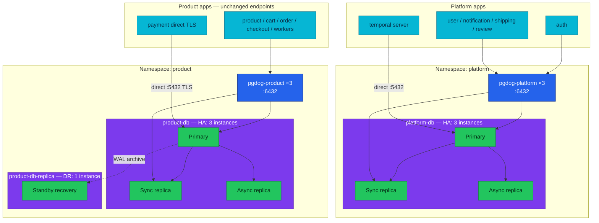
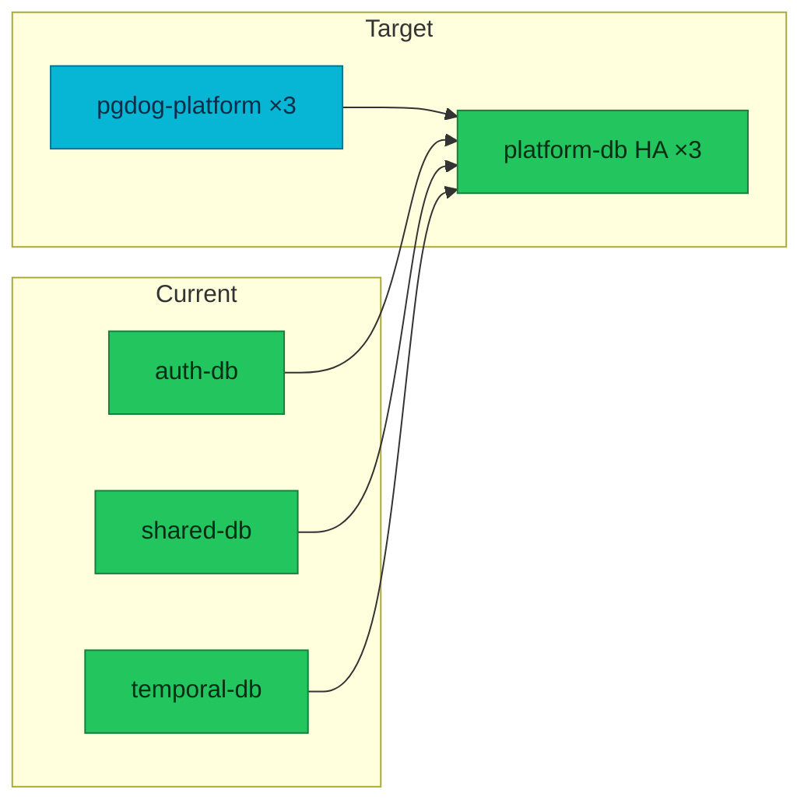

# RFC-0018: Consolidate platform PostgreSQL — merge auth, shared, and temporal into platform-db

| Status | Scope | Created | Last updated |
|--------|-------|---------|--------------|
| provisional | infra | 2026-07-17 | 2026-07-17 |

> **Origin:** the homelab runs **five** CloudNativePG clusters (four operational +
> one DR) and **three** PgDog poolers. Operational overhead, doc drift
> (`cnpg-db` / Zalando archaeology), and known gaps — **`shared-db` single-node
> SPOF** ([RFC-0005](../RFC-0005/)), **`temporal-db` without Barman backups**
> ([RFC-0001](../RFC-0001/)) — motivate consolidating the non-product tier into one
> HA cluster while leaving **`product-db` / `product-db-replica` / `pgdog-product`
> unchanged**.

> **Tradeoff:** we trade a **multi-database migration** (seven logical DBs, new
> `platform` namespace, unified pooler, mandatory docs sweep) for **two operational
> clusters + one DR** (down from four + one), HA for the former supporting tier,
> and a single source of truth for platform persistence docs. The alternative —
> scaling `shared-db` to three instances in isolation — closes the SPOF cheaply
> but leaves five clusters, three poolers, and temporal backup gap untouched.

## Summary

Merge **`auth-db`**, **`shared-db`**, and **`temporal-db`** into a new
**`platform-db`** CloudNativePG cluster (3 instances, sync quorum `ANY 1`, Barman
WAL archive) hosted in namespace **`platform`**, fronted by a new **`pgdog-platform`**
PgDog HelmRelease (3 replicas, five pooled application databases). Retain
**`product-db`**, **`product-db-replica`**, and **`pgdog-product`** with **zero
rename and zero app endpoint churn** on the product tier.

Target inventory: **3 CNPG clusters** (2 operational + 1 DR), **2 PgDog poolers**.

## Motivation

### As-built (2026-07)

| Cluster | Namespace | Instances | Pooler | Backup | Gap |
|---------|-----------|-----------|--------|--------|-----|
| `auth-db` | `auth` | 3 (HA) | `pgdog-auth` ×3 | Barman | Own cluster + pooler |
| `shared-db` | `user` | **1 (SPOF)** | `pgdog-shared` ×1 | Barman | RFC-0005 open |
| `temporal-db` | `temporal` | 1 | — (direct) | **None** | RFC-0001 follow-up |
| `product-db` | `product` | 3 (HA) | `pgdog-product` ×3 | Barman | T0 — keep |
| `product-db-replica` | `product` | 1 (DR) | — | Barman | T0 DR — keep |

Documentation is **internally consistent among canonical hub pages** (`002-database-integration.md`, `010-drp.md`, etc.) but **contradicts legacy runbooks** still describing Zalando WAL-G, `cnpg-db`, and `pgdog-cnpg`. A cluster merge without a **docs gate** would widen that gap.

### Goals

- **3 clusters total:** `platform-db`, `product-db`, `product-db-replica`.
- **2 poolers:** `pgdog-platform`, `pgdog-product`.
- **Close RFC-0005 SPOF:** supporting databases run on HA `platform-db` (3 instances).
- **Close temporal backup gap:** `temporal` + `temporal_visibility` WAL-archive via Barman on `platform-db`.
- **Product tier zero churn:** no rename of `product-db*`, `pgdog-product`, or product/cart/order/checkout/payment app `db_host`.
- **Docs deliverable:** rewrite hub docs + fix active stale runbooks (see [Documentation impact matrix](#documentation-impact-matrix)); RFC-0018 is the checklist source of truth.
- **DR unchanged on product line:** `product-db-replica` keeps object-store recovery from `product-db`.

### Non-Goals

- **Renaming product tier** to `commerce-*` or any other prefix.
- **DR cluster for `platform-db`** in this RFC (HA + Barman + PITR only; platform DR is follow-up).
- **Migrating `product-db`** or changing payment direct-TLS bypass of PgDog.
- **local-stack** Docker Compose Postgres (single container) — out of scope.
- **Production cluster Flux wiring** — manifests reusable; prod bootstrap remains TODO.
- Rewriting **implemented RFC/ADR history** — supersession banners only.

## Proposal

### Target topology



### Naming (frozen)

#### New — platform tier

| Resource | Name | Namespace |
|----------|------|-----------|
| CNPG `Cluster` | `platform-db` | `platform` |
| PgDog `HelmRelease` | `pgdog-platform` | `platform` |
| Write service | `platform-db-rw.platform.svc.cluster.local:5432` | — |
| Read service | `platform-db-r.platform.svc.cluster.local:5432` | — |
| Pooler service | `pgdog-platform.platform.svc.cluster.local:6432` | — |
| Manifest tree | `kubernetes/infra/configs/databases/clusters/platform-db/` | — |
| OpenBAO prefix | `secret/local/databases/platform-db/{auth,user,notification,shipping,review}` | — |
| ESO secrets | `platform-db-secret`, `platform-db-user-secret`, `platform-db-notification-secret`, `platform-db-shipping-secret`, `platform-db-review-secret` | `platform` |
| Temporal app secret | `platform-db-app` (CNPG-generated) | `platform` |
| Barman prefix | `s3://pg-backups-cnpg/platform-db/` | — |

#### Unchanged — product tier

| Resource | Name |
|----------|------|
| CNPG clusters | `product-db`, `product-db-replica` |
| PgDog | `pgdog-product` |
| App pooler host | `pgdog-product.product.svc.cluster.local:6432` |
| Payment direct host | `product-db-rw.product.svc.cluster.local:5432` |
| Secrets | `product-db-*-secret` |
| Barman / externalCluster | existing `product-db-*` names |

#### Unchanged — logical databases and roles

`auth`, `user`, `notification`, `shipping`, `review`, `temporal`, `temporal_visibility`, `product`, `cart`, `order`, `payment`, `checkout`.

### Pooler consolidation

| Current | After |
|---------|-------|
| `pgdog-auth` (×3, `auth`) | Merged → **`pgdog-platform`** |
| `pgdog-shared` (×1, `user`) | Merged → **`pgdog-platform`** (replicas **1→3**) |
| `pgdog-product` (×3, `product`) | **Unchanged** |

`pgdog-platform` config: PgDog chart **v0.39**, port **6432**, `poolMode: transaction`, `poolSize: 30` per DB, R/W split to `platform-db-rw` / `platform-db-r`, LSN lag checks, `valuesFrom` for five role secrets, PDB `minAvailable: 2`.

**Bypass pooler (unchanged pattern):**

| Consumer | Endpoint | Reason |
|----------|----------|--------|
| `payment-service` | `product-db-rw.product:5432` (TLS) | Direct-TLS ADR; not via transaction pooler |
| `temporal` server | `platform-db-rw.platform:5432` | Temporal manages its own pool; no PgDog |
| Flyway initContainers | `*-rw:5432` direct | DDL bypasses pooler |

### Logical database layout

| Cluster | Databases | Consumers |
|---------|-----------|-----------|
| `platform-db` | `auth`, `user`, `notification`, `shipping`, `review`, `temporal`, `temporal_visibility` | auth, user, notification, shipping, review, Temporal |
| `product-db` | `product`, `cart`, `order`, `payment`, `checkout` | product, cart, order, payment, checkout, workers |
| `product-db-replica` | mirror of `product-db` | DR only — no app traffic |

Per-service provisioning follows the RFC-0012 **triplet** on `platform-db` (ExternalSecret + DatabaseRole + Database), reusing patterns from existing `auth-db` and `shared-db` service manifests.

### Alternatives

| # | Option | Pro | Con | Verdict |
|---|--------|-----|-----|---------|
| **(a)** | **Merge auth + shared + temporal → `platform-db`** *(this RFC)* | 3 clusters; closes shared SPOF + temporal backup gap; 2 poolers | Large migration; platform blast radius; docs sweep | **Recommended** |
| (b) | Scale `shared-db` to 3 instances only (RFC-0005 option a) | Minimal churn | Still 5 clusters, 3 poolers; temporal gap remains | Rejected — insufficient consolidation |
| (c) | Rename product tier to `commerce-*` | Domain naming clarity | App/secret/DR churn on T0; rejected by operator | **Rejected** |
| (d) | Single mega-cluster for all DBs | One cluster to operate | T0 blast radius; DR story harder; 2-cluster target missed | Rejected |
| (e) | Keep `temporal-db` separate | Isolates workflow store | 4 operational clusters — misses target | Rejected |

## Architecture & Diagrams

### Migration flow (high level)



### App endpoint changes

| Service / worker | Current | After |
|------------------|---------|-------|
| auth | `pgdog-auth.auth:6432` | `pgdog-platform.platform:6432` |
| user, notification, shipping, review | `pgdog-shared.user:6432` | `pgdog-platform.platform:6432` |
| temporal | `temporal-db-rw.temporal:5432` | `platform-db-rw.platform:5432` |
| product, cart, order, checkout, workers | `pgdog-product.product:6432` | **unchanged** |
| payment | `product-db-rw.product:5432` | **unchanged** |

## Design Details

### CNPG `platform-db` spec (summary)

- `instances: 3`, PostgreSQL 18, image aligned with existing clusters.
- `synchronous: method: any`, `number: 1`, `dataDurability: required` (same as `auth-db`).
- Barman Cloud plugin + `ScheduledBackup` (new object store / prefix).
- `pg_hba` connection isolation per role (ADR-015 pattern) — five app roles + temporal.
- RFC-0012 triplets under `platform-db/services/` and `platform-db/secrets/`.

### Resource impact (Kind homelab)

| | Current | After | Delta |
|---|---------|-------|-------|
| Postgres pods | 9 | 7 | −2 |
| PgDog pods | 7 | 6 | −1 |
| CNPG Cluster CRs | 5 | 3 | −2 |

### Drawbacks

- **Platform blast radius:** one HA incident affects auth, four supporting services, and Temporal persistence.
- **Migration risk:** seven logical DBs + cross-namespace secret cutover; homelab accepts brief downtime per DB.
- **Docs mandatory:** ~18 hub/runbook rewrites; shipping without docs gate leaves contradictory topology in repo.
- **No platform DR cluster:** RPO/RTO for platform tier = in-cluster HA + Barman PITR, not object-store replica cluster.

## Security considerations

- New namespace **`platform`**: PSS restricted, explicit NetworkPolicy (`network-policies/platform.yaml`) — app namespaces → `:6432`; pooler → `platform-db-rw:5432`; monitoring → `:9090`/`:9187`.
- Slim **`auth`** and **`user`** namespace netpolicies after decommission — Postgres/pooler rules removed; app-only ingress remains.
- Cross-namespace egress: each app ns that used `pgdog-shared.user` or `pgdog-auth.auth` must allow **`platform:6432`**.
- Kyverno hardcoded namespace lists: add `platform` where required (RFC-0010 P5 lesson).
- pg_hba per-role isolation carried forward from auth-db + shared-db manifests.

## Observability & SLO impact

| Area | Change |
|------|--------|
| Prometheus rules | Add `prometheusrules/postgres/cnpg-platform-db/` (full HA set); **remove** `cnpg-auth-db/`, `cnpg-shared-db/` |
| `alert-catalog.md` | Update cluster ownership; temporal covered by platform-db rules |
| Grafana `pgdog` dashboard | Add `pgdog-platform` series; `pgdog-product` unchanged |
| Temporal alert text | `temporal-db` → `platform-db` in `temporal/prometheusrule.yaml` |
| PodMonitors | `platform-db` operator-managed; update `monitoring.md` inventory |

Product-tier PromQL in `cnpg/` — **no change**.

## Rollout & rollback

Phases land as separate PR waves; **docs P0 draft ready for review before platform cutover**.

| Phase | Deliverable | Rollback |
|-------|-------------|----------|
| **P0** | RFC-0018 merged `provisional`; P0 hub docs drafted | N/A |
| **P1** | `platform` ns + `platform-db` + `pgdog-platform` parallel; data migration per DB | Apps still on old clusters; delete platform-db |
| **P2** | Flip platform app `db_host`; Temporal CR; netpol; decommission auth/shared/temporal clusters + old poolers | Revert RSIPs + Temporal CR; keep old clusters 24h |
| **P3** | Docs P0/P1 complete; observability rules; validation gate; CHANGELOG | Revert doc PR |
| **P4** | DR drill `product-db-replica`; platform-db backup/restore drill | N/A |

**Product tier:** no rollout phase — untouched.

### Data migration order (platform-db)

1. `review` → `shipping` → `notification` → `user` → `auth`
2. `temporal` + `temporal_visibility` (Temporal maintenance window)

Tooling: `pg_dump`/`pg_restore` per DB on homelab (acceptable downtime); logical replication optional for prod follow-up.

## Testing / verification

### Infra

- `make validate` clean after manifest changes.
- Flux reconciles `platform-db` Ready; healthCheck in `databases.yaml` updated.
- Per-role pooler auth: `psql -h pgdog-platform.platform -p 6432 -U <role> -d <db>`.
- R/W split: writes on primary, SELECT routed to `-r` service.

### E2E (platform tier — mandatory before decommission)

- Login (auth → `pgdog-platform`).
- User profile CRUD.
- Notification / shipping / review smoke paths.
- Temporal workflow (checkout/order fulfillment path if applicable).

### E2E (product tier — regression)

- Full purchase flow unchanged (`pgdog-product` endpoints).
- Payment direct-TLS path unchanged.

### Docs validation gate

```bash
# No current-state refs to decommissioned clusters (exclude proposals/history)
rg 'auth-db|shared-db|temporal-db|pgdog-auth|pgdog-shared' docs/ kubernetes/ \
  --glob '!CHANGELOG.md' --glob '!docs/proposals/**' \
  --glob '!**/003.2*' --glob '!**/zalando*'

# Hubs mention new topology
rg 'platform-db|pgdog-platform' docs/databases/002-database-integration.md docs/platform/setup.md
```

Render every changed Mermaid block with `mmdc` before merge (AGENTS.md diagram workflow).

## Documentation impact matrix

**Definition of Done:** all **P0** rows updated; **P1** stale-name fixes shipped; validation gate passes.

### P0 — must rewrite (current-state / active ops)

| File | Primary change |
|------|----------------|
| [`docs/databases/002-database-integration.md`](../../../databases/002-database-integration.md) | 3-cluster / 2-pooler hub; platform-db table; Mermaid |
| [`docs/databases/004-replication-strategy.md`](../../../databases/004-replication-strategy.md) | Cluster inventory |
| [`docs/databases/006-backup-strategy.md`](../../../databases/006-backup-strategy.md) | Barman prefixes; temporal on platform-db |
| [`docs/databases/008-pooler.md`](../../../databases/008-pooler.md) | 2 poolers |
| [`docs/databases/010-drp.md`](../../../databases/010-drp.md) | Cluster table; drills |
| [`docs/databases/010.1-rpo-rto-planning.md`](../../../databases/010.1-rpo-rto-planning.md) | Tier mapping |
| [`docs/databases/010.2-restore-and-failover-drills.md`](../../../databases/010.2-restore-and-failover-drills.md) | Drill D → platform-db |
| [`docs/databases/010.4-emergency-recovery.md`](../../../databases/010.4-emergency-recovery.md) | Pooler names; platform cutover |
| [`docs/platform/setup.md`](../../../platform/setup.md) | Expected cluster state |
| [`docs/platform/application-delivery.md`](../../../platform/application-delivery.md) | Domain → DB map |
| [`docs/api/microservices.md`](../../../api/microservices.md) | Per-service DB endpoints |
| [`docs/api/api.md`](../../../api/api.md) | Topology diagram |
| [`docs/api/temporal-order-fulfillment.md`](../../../api/temporal-order-fulfillment.md) | Persistence host |
| [`docs/security/network-policies.md`](../../../security/network-policies.md) | `:6432` → ns `platform` |
| [`docs/secrets/openbao.md`](../../../secrets/openbao.md) | Path diagram |
| [`docs/secrets/README.md`](../../../secrets/README.md#kubernetes-secret-catalog) | Secret names |
| [`docs/observability/metrics/postgresql/README.md`](../../../observability/metrics/postgresql/README.md) | Inventory |
| [`docs/observability/alerting/alert-catalog.md`](../../../observability/alerting/alert-catalog.md) | Rule ownership |
| [`docs/observability/alerting/README.md`](../../../observability/alerting/README.md) | Index sync |
| [`docs/databases/runbooks/pgdog-operations.md`](../../../databases/runbooks/pgdog-operations.md) | Add pgdog-platform |
| [`docs/README.md`](../../README.md) | Fix PgDog runbook index (line ~292) |
| [`kubernetes/infra/configs/databases/README.md`](../../../../kubernetes/infra/configs/databases/README.md) | Infra hub |
| [`kubernetes/infra/configs/databases/clusters/README.md`](../../../../kubernetes/infra/configs/databases/clusters/README.md) | Cluster table |
| [`kubernetes/infra/configs/observability/metrics/prometheusrules/postgres/README.md`](../../../../kubernetes/infra/configs/observability/metrics/prometheusrules/postgres/README.md) | cnpg-platform-db |

### P1 — fix stale names (ops copy-paste broken today)

| File | Fix |
|------|-----|
| [`docs/databases/runbooks/postgres-backup-restore.md`](../../../databases/runbooks/postgres-backup-restore.md) | Zalando → CNPG Barman |
| [`docs/databases/runbooks/rotate-cnpg-service-password.md`](../../../databases/runbooks/rotate-cnpg-service-password.md) | `pgdog-cnpg` → `pgdog-product` / `pgdog-platform` |
| [`docs/databases/005-ha-dr-deep-dive.md`](../../../databases/005-ha-dr-deep-dive.md) | Stale pooler names |
| [`docs/databases/003.1-operator-cnpg.md`](../../../databases/003.1-operator-cnpg.md) | CNPG on all clusters |
| [`docs/databases/003-operator-comparison.md`](../../../databases/003-operator-comparison.md) | 3-cluster table |
| [`docs/databases/009-extensions.md`](../../../databases/009-extensions.md) | platform-db row |
| [`docs/observability/metrics/postgresql/custom-metrics.md`](../../../observability/metrics/postgresql/custom-metrics.md) | PodMonitor paths |
| [`docs/observability/logging/README.md#platform-pipeline`](../../../observability/logging/README.md#platform-pipeline) | pgaudit clusters |
| [`docs/observability/metrics/victoriametrics.md`](../../../observability/metrics/victoriametrics.md) | VMRule dirs |

### P2 — RFC/ADR supersession banners (no history rewrite)

| Artifact | Action |
|----------|--------|
| [RFC-0005](../RFC-0005/) | **Supersede** — shared SPOF addressed by platform-db HA merge |
| [RFC-0001](../RFC-0001/), [ADR-001](../../adr/ADR-001-adopt-temporal-for-order-fulfillment/), [ADR-002](../../adr/ADR-002-deploy-temporal-via-operator/) | Banner: persistence host → `platform-db` |
| [RFC-0012](../RFC-0012/), [ADR-013/14/15](../../adr/) | Banner: `cnpg-db`/`pgdog-cnpg` shipped as `product-db`/`pgdog-product` |

### P3 — legacy archaeology (banner only)

`zalando-ha-scaling.md`, `prepared-databases.md`, `003.2-operator-zalando.md` — strengthen legacy banners; no current-state claims.

### Docs unchanged (product tier)

`001-postgresql-internals.md`, product sections of `005-ha-dr-deep-dive.md`, `add-service-database.md`, `cnpg-dr-replica-bootstrap.md`, `checkout.md`, product-tier app RSIPs.

## Implementation History

| Date | Milestone |
|------|-----------|
| 2026-07-17 | RFC-0018 opened (`provisional`) |

## Related

- **Supersedes (partial):** [RFC-0005](../RFC-0005/) supporting-shared-db HA goal
- **Amends persistence host for:** [RFC-0001](../RFC-0001/), [ADR-001](../../adr/ADR-001-adopt-temporal-for-order-fulfillment/), [ADR-002](../../adr/ADR-002-deploy-temporal-via-operator/)
- **Builds on:** [RFC-0012](../RFC-0012/) triplet pattern, [ADR-013](../../adr/ADR-013-per-service-db-triplet/), [ADR-014](../../adr/ADR-014-pooler-credentials-valuesfrom/), [ADR-015](../../adr/ADR-015-pg-hba-connection-isolation/)
- **Canonical docs after ship:** [`docs/databases/002-database-integration.md`](../../../databases/002-database-integration.md), [`docs/databases/010-drp.md`](../../../databases/010-drp.md)
- **DR unchanged:** [`docs/databases/010.3-cross-region-dr.md`](../../../databases/010.3-cross-region-dr.md) (product line)

---
_Last updated: 2026-07-17_
