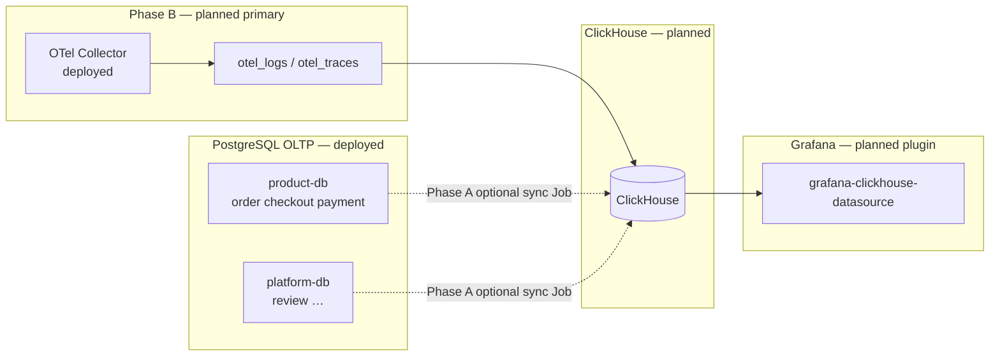

# RFC-0019: ClickHouse for OTel logs/traces SQL (+ optional commerce analytics)

| Status | Scope | Research | Created | Last updated |
|--------|-------|----------|---------|--------------|
| accepted (Phase B) | platform-wide | [./research.md](./research.md) — gate passed 2026-07-17 | 2026-07-17 | 2026-07-19 |

> **Decision (2026-07-19):** implementing **Phase B only** (OTel logs+traces SQL). **Phase A
> (commerce facts) is out of scope** for this implementation — observability-only. ClickHouse
> runs **alongside** VictoriaLogs/VictoriaTraces; **metrics stay on VictoriaMetrics**. Operator:
> **Altinity**; storage: **PVC**; retention: **TTL 90d**. See
> [ADR-023](../../adr/ADR-023-clickhouse-observability-olap/) and the operational guide
> [clickhouse/README.md](../../../observability/clickhouse/README.md).

> **Tradeoff:** we add a new OLAP runtime (operator, storage, Grafana plugin, Collector
> exporter) to answer **long-retention SQL on logs and traces** — accepting operational
> surface — instead of stretching VictoriaLogs / Tempo for cross-day ad-hoc analytics or
> standing up ClickStack.

## Summary

Evaluate and (later) pilot **ClickHouse** as a **supplementary OLAP** store on the
duynhlab platform.

- **Phase B (primary):** OTel Collector fan-out of **logs and traces** into `otel_logs` /
  `otel_traces` tables for long-retention SQL analytics via the Grafana ClickHouse
  datasource. VictoriaLogs / Tempo remain day-to-day ops primaries; metrics stay on
  VictoriaMetrics. **No ClickStack.**
- **Phase A (optional):** batch-sync **basic commerce facts** from PostgreSQL
  (`order`, `checkout`, `payment`, optional `review`) into ClickHouse fact tables for
  GMV / funnel / capture-rate panels. **No new public analytics HTTP APIs.**
- **Never:** replace CNPG, VictoriaMetrics, VictoriaLogs, or Tempo as sources of truth
  for transactions or ops signals.

Learning guide: [`docs/observability/clickhouse/README.md`](../../../observability/clickhouse/README.md).
Background: [`./research.md`](./research.md).

## Motivation

VictoriaLogs and Tempo cover day-to-day ops, but cross-day SQL on structured log/trace
fields (service, status, duration, error patterns) is awkward at scale. RED metrics in
VictoriaMetrics do not replace log/trace search. Optionally, commerce owners also want
GMV / funnel charts without heavy scans on `product-db` OLTP.

### Goals

- Document a **provisional** adopt path for ClickHouse on Kind/GitOps.
- Define **Phase B** — Collector → `otel_logs` / `otel_traces` → Grafana SQL (builds on
  [RFC-0014](../RFC-0014/) fan-out).
- Define **optional Phase A** fact tables mapped to existing API contracts
  ([order](../../../api/order.md), [checkout](../../../api/checkout.md),
  [payments](../../../api/payments.md), [review](../../../api/review.md)).
- Prefer **batch sync** over CDC for the optional commerce pilot.
- Keep Grafana as the query UI (ClickHouse datasource plugin).
- Recommend **Altinity `ClickHouseInstallation`** for the Kind pilot (Official operator remains an alternative).

### Non-Goals

- Shipping Kubernetes manifests, GrafanaDatasource CRs, or sync Jobs in this RFC PR.
- Replacing Postgres for writes or money ledgers.
- Auth/user PII analytics; cart abandonment warehouse; reconciliation discrepancy store.
- Real-time CDC; new `/{service}/v1/...` analytics endpoints.
- Mandatory ClickStack / HyperDX.
- Replacing Victoria* / Tempo for daily ops.

## Proposal

1. **Adopt ClickHouse as planned OLAP** — supplementary only.
2. **Phase B** — Collector exporter → `otel_logs` / `otel_traces`; Grafana SQL panels for
   log/trace analytics; VL/Tempo unchanged as ops primaries.
3. **Optional Phase A schema** — `fact_orders`, `fact_order_items`, `fact_payments`,
   `fact_checkout_sessions`, optional thin `fact_reviews` (see research).
4. **Optional Phase A ingest** — CronJob / one-shot Job: SQL export from PgDog → ClickHouse INSERT.
5. **Query** — install `grafana-clickhouse-datasource` for Phase B (and Phase A if enabled).
6. **Operator** — default **Altinity CHI** on Kind; revisit Official if Cloud-parity features are required.

### User stories

- As on-call, I can run **SQL over retained OTel logs/traces** (error rates by service,
  slow spans) without exporting from VictoriaLogs/Tempo for every question.
- As a platform owner, I can keep **VictoriaLogs / Tempo** for live triage while ClickHouse
  holds longer-retention OLAP copies for analytics.
- *(Optional Phase A)* As a product owner, I can chart **confirmed GMV by day** or **checkout
  funnel** without querying the order primary under load.

### Alternatives

See [research.md § Alternatives](./research.md#alternatives). Rejected for the primary path:
ClickStack (extra stack), replacing VL/Tempo as ops primaries, Postgres-only heavy analytics
(OLTP risk). Optional Phase A rejects Metabase-on-primary for the same OLTP reason.

## Architecture & Diagrams

## Design Details

### Enablement

- Feature is **docs + RFC only** until a follow-up PR adds operator HelmRelease + CHI/CR,
  sync Job, NetworkPolicy, secrets, and Grafana plugin install.
- Default behavior of all microservices: **unchanged** (no dual-write).

### Drawbacks

- Extra cluster component to patch, backup, and Kyverno-harden.
- Batch lag (facts not real-time).
- Risk of copying sensitive fields if sync SQL is careless — require column allowlists.

### Disable / rollback

- Delete ClickHouse CRs, Job, and Grafana datasource; Postgres and Victoria* untouched.

## Security considerations

- Sync Job uses least-privilege DB roles (SELECT on allowlisted tables/columns only).
- Prefer hashed or omitted `user_id` in facts.
- NetworkPolicy: ClickHouse not on public Ingress; Grafana in-cluster only.
- Kyverno: requests/limits, probes, non-root, no `:latest`.

## Observability & SLO impact

- No change to service SLOs in Phase B or optional Phase A.
- Add operator/ClickHouse health dashboards after deploy (follow-up).
- Do not route RED metrics through ClickHouse.

## Rollout & rollback

| Phase | Work | Rollback |
|-------|------|----------|
| **Docs** | This RFC + learning guide | Revert docs PR |
| **Pilot** | Altinity operator + single-replica CHI on Kind | Delete CR / HelmRelease |
| **Phase B** | OTel exporter + `otel_*` tables + Grafana plugin | Remove exporter; keep VL/Tempo |
| **Phase A** *(optional)* | Sync Job + commerce fact panels | Suspend Job; remove fact panels |

## Testing / verification

- Kind: CHI Ready; smoke `INSERT`/`SELECT`.
- Grafana panel renders OTel log/trace SQL from seeded demo data.
- *(Optional Phase A)* Sync Job dry-run; GMV / funnel panels from commerce facts.
- Confirm no service API contract changes (`docs/api/*` cite-only).

## Implementation History

| Date | Note |
|------|------|
| 2026-07-17 | RFC opened (`provisional`); learning guide published under `docs/observability/clickhouse/` |

## Related

- [./research.md](./research.md)
- [`docs/observability/clickhouse/README.md`](../../../observability/clickhouse/README.md)
- [`docs/api/README.md`](../../../api/README.md)
- [RFC-0014](../RFC-0014/) — OTel adoption (Phase B builds on Collector fan-out)
- [RFC-0018](../RFC-0018/) — platform-db / product-db topology for optional Phase A sync sources

---
_Last updated: 2026-07-17_
