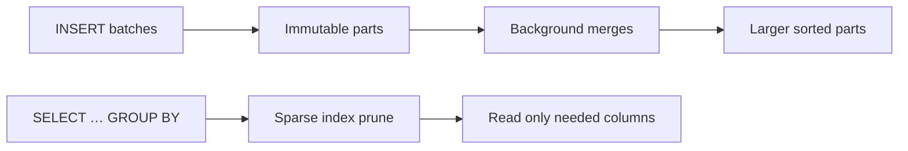
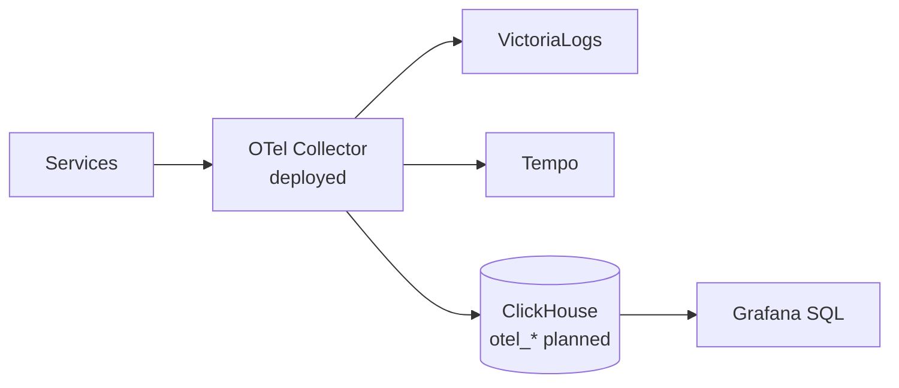

# RFC-0019 — Research: ClickHouse for OTel logs/traces SQL (+ optional commerce analytics)

| | |
|---|---|
| **RFC** | RFC-0019 |
| **Status** | researching → gate passed with README |
| **Scope** | platform-wide |
| **Created** | 2026-07-17 |
| **Last updated** | 2026-07-17 |

> **Plain-language research.** Blog-post style before the decision in [`README.md`](./README.md).
> After jargon, use **"In plain terms"** blockquotes. Facts verified against platform docs +
> ClickHouse / Grafana / operator public docs.
>
> **Start from a real problem.** Frame on-call / product questions first; use homelab to
> prove the approach before shipping manifests.

---

## Table of contents

1. [Problem statement](#problem-statement)
2. [Reading path](#reading-path)
3. [What ClickHouse is](#what-clickhouse-is)
4. [Core mechanism](#core-mechanism)
5. [Platform as-built](#platform-as-built)
6. [OTel SQL path (Phase B)](#otel-sql-path-phase-b)
7. [Commerce analytics facts (Phase A — optional)](#commerce-analytics-facts-phase-a--optional)
8. [Alternatives](#alternatives)
9. [Open questions](#open-questions)
10. [References](#references)
11. [Context7 audit log](#context7-audit-log)
12. [Research review gate](#research-review-gate)

---

## Problem statement

### Real-world trigger

| | |
|---|---|
| **Situation** | On-call needs cross-day SQL on log/trace fields (errors by service, slow spans, status mixes) beyond VictoriaLogs/Tempo ergonomics at long retention |
| **Who feels it** | Platform / on-call; commerce owners optionally want GMV / funnel without OLTP scans |
| **Why now** | OTel fan-out is live ([RFC-0014](../RFC-0014/)); VL/Tempo stay ops primaries but ad-hoc analytics across days is painful |
| **If we do nothing** | Manual exports, short retention only, or risky heavy queries on hot Postgres for business charts |

> **In plain terms:** we need an OLAP store for **logs and traces SQL** first; optional commerce facts second.

**Example triggers**

- **On-call / incident:** “Which services logged 5xx most in the last 14 days?” (structured log SQL)
- **Design review:** “Can we query traces by duration percentile without replacing Tempo?”
- **Product (optional):** “GMV by day?” / “checkout open → completed rate?” without scanning `product-db`

### What homelab practice proves

- Can we run ClickHouse on Kind under Kyverno + cert-manager without replacing Victoria* / Tempo?
- Can Collector → `otel_logs` / `otel_traces` answer on-call SQL questions in Grafana?
- *(Optional)* Can a batch sync of order/checkout/payment facts answer GMV and funnel panels?

Deep mechanism guide: [`docs/observability/clickhouse/README.md`](../../../observability/clickhouse/README.md).

---

## Reading path

1. Problem statement (above)
2. Mechanism summary → full guide linked above
3. OTel SQL path (Phase B — primary)
4. Optional commerce facts (Phase A)
5. Alternatives + gate

---

## What ClickHouse is

ClickHouse is an open-source **columnar OLAP** database. It appends data in **parts**, merges them in the background (**MergeTree**), and prunes reads with a **sparse index** (first row of each ~8192-row **granule**) plus optional skipping indexes.

> **In plain terms:** ClickHouse is great at “count errors by service over 30 days” on append-only event columns — logs, traces, or mirrored commerce facts.

It does **not** replace CNPG for ACID commerce state or VictoriaLogs/Tempo for live ops triage.

---

## Core mechanism

| Term | Meaning |
|------|---------|
| Part | On-disk chunk from an insert batch |
| Granule | Default read unit (~8192 rows) |
| Sparse index | One entry per granule (first-row key) |
| Mutation | Async ALTER UPDATE/DELETE (expensive vs append) |

---

## Platform as-built

| Layer | Deployed reality |
|-------|------------------|
| OLTP | CloudNativePG `product-db` + `platform-db`, PgDog poolers |
| Metrics | VictoriaMetrics (OTLP + scrape-era consumers) |
| Logs | VictoriaLogs + Vector + app OTLP tee |
| Traces | Tempo (RustFS), Jaeger ephemeral, VictoriaTraces pilot |
| Viz | Grafana Operator + datasources — **no** ClickHouse plugin yet |
| ClickHouse | **Absent** |

Optional Phase A API ownership: [`docs/api/README.md`](../../../api/README.md) — [order](../../../api/order.md), [checkout](../../../api/checkout.md), [payments](../../../api/payments.md), [review](../../../api/review.md).

---

## OTel SQL path (Phase B)

**Primary adopt path:** existing OTel Collector fan-out → ClickHouse exporter →
`otel_logs` / `otel_traces` MergeTree tables → Grafana ClickHouse datasource.

VictoriaLogs / Tempo remain **day-to-day ops primaries**. Metrics stay on VictoriaMetrics.
**No ClickStack.**

---

## Commerce analytics facts (Phase A — optional)

Optional later: mirror **read-only commerce facts** into ClickHouse. No new public analytics HTTP APIs. PostgreSQL remains source of truth.

| Fact table | Source contract | Minimum columns | Questions |
|------------|-----------------|-----------------|-----------|
| `fact_orders` | order.md | `order_id`, anon user key, `status`, `total_minor`, `created_at` | GMV/day; status mix |
| `fact_order_items` | order items | `order_id`, `product_id`, `qty`, `line_subtotal_minor` | Top products |
| `fact_payments` | payments.md | `order_id`, `status`, `amount_minor`, `refunded_minor`, `created_at` | Capture / refund rates |
| `fact_checkout_sessions` | checkout.md | `session_id`, `status`, totals, timestamps, optional promo | Funnel conversion |
| `fact_reviews` | review.md | `product_id`, `rating`, `created_at` | Rating trends |

**Ingest:** batch SQL export Job (nightly / on-demand) via PgDog — **not** CDC.

**Non-goals for Phase A:** PII warehouses, cart abandonment deep dive, reconciliation discrepancy warehouse, real-time CDC, writing business state into ClickHouse.

---

## Alternatives

| Option | Pros | Cons |
|--------|------|------|
| **(a) VictoriaLogs/Tempo only** | Zero new infra | Weak long-retention cross-signal SQL analytics |
| **(b) ClickStack / HyperDX** | All-in-one observability UI | Extra stack; not GitOps-native here |
| **(c) Postgres-only commerce analytics** | Zero new infra | Heavy OLTP scans; saga/checkout risk |
| **(d) Defer entirely** | No cost | Long-retention SQL gap remains |
| **(e) ClickHouse Phase B OTel + optional Phase A facts** *(recommended)* | Fits OLAP; VL/Tempo untouched for ops | New operator + exporter + Grafana plugin to operate |

---

## Open questions

- Exact ClickHouse exporter config and table schema for OTel logs/traces (align with Grafana plugin expectations)
- Retention / partition policy for `otel_*` vs VL/Tempo
- *(Phase A)* Exact anonymization for `user_id` in facts (hash vs omit)
- *(Phase A)* Whether `fact_reviews` ships in the first sync Job or waits

---

## References

- [`docs/observability/clickhouse/README.md`](../../../observability/clickhouse/README.md)
- [`docs/api/order.md`](../../../api/order.md), [`checkout.md`](../../../api/checkout.md), [`payments.md`](../../../api/payments.md), [`review.md`](../../../api/review.md)
- ClickHouse MergeTree docs; Grafana ClickHouse datasource docs; Altinity / Official operators

---

## Context7 audit log

| Claim / section | Source checked | Result |
|-----------------|----------------|--------|
| Sparse index = first row per granule | ClickHouse MergeTree docs (prior audit 2026-07-17) | confirmed |
| Grafana ClickHouse datasource (no ClickStack) | Grafana plugin docs | confirmed |
| Altinity CHI maturity vs Official operator | Operator repos / release notes | Altinity recommended for Kind pilot |

---

## Research review gate

- [x] Answers a **real-world problem** (long-retention log/trace SQL; optional GMV / funnel)
- [x] **Problem statement** names situation, who feels it, cost of inaction
- [x] At least **two alternatives** with tradeoffs
- [x] **Platform as-built** filled from manifests/docs
- [x] Primary use-case direction stated (Phase B OTel logs/traces; Phase A commerce optional)
- [x] Context7 / doc audit noted; footer date set
- [x] At least **one Mermaid** diagram; **planned** vs deployed labeled
- [x] No Kubernetes manifest changes in this research file
- [x] Owner sign-off: **ready for RFC** (provisional README)

---

_Last verified: 2026-07-17._
