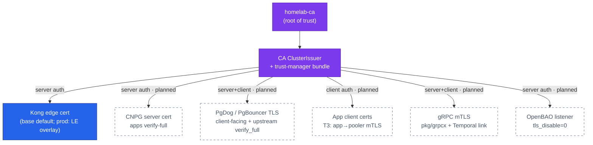
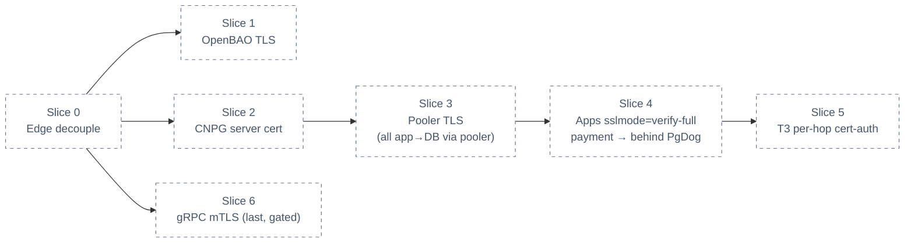

# RFC-0020 Internal TLS on the `homelab-ca` root

| Status | Scope | Research | Created | Last updated |
|--------|-------|----------|---------|--------------|
| provisional | platform-wide | [./research.md](./research.md) — gate passed 2026-07-22 | 2026-07-22 | 2026-07-22 |

> **Don't forget: every decision is a tradeoff.** This RFC buys encrypted, identity-verified
> internal transport at the cost of per-tier certificate wiring, strict rollout ordering, and
> one more thing that can expire. The rejected alternatives and the drawbacks are recorded
> below and in [research § Alternatives](./research.md#alternatives).

## Prerequisites

- [x] [./research.md](./research.md) merged (#576); [research review gate](./research.md#research-review-gate) ticked (2026-07-22)
- [x] Context7 audit complete (#579 — PgDog, Istio, OpenBAO rows resolved)
- [x] Owner approved **ready for RFC** (2026-07-22)
- Mechanism deep-dive lives in [./research.md](./research.md) — this file records decisions, target architecture, and rollout only.

## Summary

Issue a leaf certificate from the already-deployed **`homelab-ca`** (cert-manager
`ClusterIssuer` + trust-manager root bundle) to **every internal endpoint** — CNPG Postgres,
the PgDog/PgBouncer pooler tier, east-west gRPC, and the OpenBAO listener — and decouple the
edge from Cloudflare/Let's Encrypt in the base overlay. One root, six rollout slices, no new
PKI component. All app→DB traffic goes through poolers (`payment`'s direct hop is retired),
apps land on `sslmode=verify-full` in one step, and gRPC mTLS (absorbed from superseded
RFC-0002) ships last as its own gated phase.

## Motivation

The platform runs a real private CA but issues exactly one certificate (the Kong edge
wildcard); every internal hop is plaintext or shared-password over an optionally-encrypted
socket. On any engagement this is the first internal pen-test / SOC-2 "encryption in transit"
finding, and three ADRs (005, 015, 025) each defer their TLS slice to "later" with no owner.
The PKI foundation is deployed and idle — this RFC puts it to work before the platform moves
to cloud. Full problem framing: [research § Problem statement](./research.md#problem-statement).

### Goals

- Every internal hop encrypted and server-verified against **one root** (`homelab-ca`):
  app→pooler→CNPG, service→service gRPC, everything→OpenBAO.
- All 10 services reach Postgres **through a pooler** with `sslmode=verify-full` — no
  direct-to-CNPG exceptions (`payment` returns behind `pgdog-product`).
- OpenBAO listener on TLS (`tls_disable = 0`) with cert-manager-issued cert (ADR-005 target).
- East-west gRPC on in-process mTLS via `pkg/grpcx`/`pkg/temporalx` (formerly RFC-0002).
- Edge issuer decoupled: base default `homelab-ca`; `letsencrypt-prod` becomes a prod overlay.
- One rotation policy: 90d leaves, renewed 30d before expiry, reload without restart.

### Non-Goals

- **No service mesh / SPIFFE** — rejected at this scale; mesh-later is owned by
  [RFC-0006](../RFC-0006/).
- **No OpenBAO PKI engine** — the CA stays in cert-manager. Moving key custody into OpenBAO
  is future work (chicken-and-egg with Slice 1: OpenBAO's own listener cert must exist before
  OpenBAO starts). The cert-manager Vault issuer keeps that migration open without touching
  workloads.
- **No change to CNPG replication** — `streaming_replica` cert-auth stays on CNPG's own
  auto-CA (never leaves the CNPG boundary).
- **No credential-model changes** — dynamic creds / rotation are RFC-0008; this RFC secures
  the transport those credentials travel over. T1/T2/T3 stack with it.
- **local-stack stays plaintext** — the compose e2e stack keeps its single-network trust
  model; this RFC is cluster-scoped.

## Proposal

Adopt **per-workload cert-manager TLS, in-process** (research option (a)) and climb the three
tiers — T1 encrypt, T2 verify-server, T3 client-cert — per plane, in six slices. Decisions
locked at the research gate (owner, 2026-07-22):

| # | Decision |
|---|----------|
| 1 | Root of trust: reuse `homelab-ca` + trust-manager — no new PKI component |
| 2 | **All app→DB via pooler** — no direct-to-CNPG; `payment`'s direct hop is transitional |
| 3 | CNPG server cert **re-issued from `homelab-ca`** via `spec.certificates` (apps keep one trust root) |
| 4 | Apps jump **straight to `verify-full`** (no intermediate `require` step) |
| 5 | **T3 is per-hop**: app→pooler mTLS (PgDog `tls_client_ca_certificate`); pooler→Postgres carries the pooler's identity (`hostssl … cert` authenticates the pooler; per-role auth stays password/`auth_query` on that hop) |
| 6 | Rotation: **90d lifetime / renew at 30d**, one policy for all internal leaves |
| 7 | `streaming_replica` stays CNPG-managed |
| 8 | Scope: **umbrella Slice 0–6**; Slice 6 (gRPC) last, gated, touches service repos |

### User Stories

- *As the operator*, I can show an auditor that no internal hop carries data or passwords in
  cleartext, and that every endpoint proves its identity against one documented root.
- *As on-call*, when I rotate a database password (RFC-0008), the transport it travels over
  is encrypted and server-verified — a sniffed pooler hop no longer yields credentials.
- *As a service author*, I get TLS by following the platform pattern (mount the trust bundle,
  set `sslmode=verify-full`) — no per-service PKI decisions.

### Alternatives

Rejected (full analysis in [research § Alternatives](./research.md#alternatives)): service
mesh (disproportionate for ~9 hops — RFC-0006), SPIFFE/SPIRE (heavy control plane before
cloud), OpenBAO PKI engine (bootstrap circularity — future work), status quo (leaves the
finding open; NetworkPolicy answers "who may connect", never "which service is this").

## Architecture & Diagrams

Target state — every leaf signed by the same root (adapted from
[research § Core mechanism](./research.md#core-mechanism); all internal leaves **planned**):

Rollout dependency graph (all **planned**; a lower tier blocks the one above it):

## Design Details

Per-slice knobs (mechanism detail and worked syntax: [research § Worked
examples](./research.md#worked-examples)):

| Slice | Change | Where |
|-------|--------|-------|
| 0 | Base edge `Certificate` issuer → `homelab-ca`; drop Cloudflare/LE + `cloudflare-api-token` from base; re-add `letsencrypt-prod` as prod overlay | `kubernetes/infra/` cert + kustomize overlays |
| 1 | `global.tlsDisable: false`; listener `tls_cert_file`/`tls_key_file`; `retry_join` → `https://` + `leader_ca_cert_file`; probe scheme HTTPS; ESO `SecretStore` + bootstrap job get `caBundle` | `kubernetes/infra/controllers/secrets/openbao/helmrelease.yaml` + ESO config |
| 2 | CNPG `spec.certificates.serverTLSSecret`/`serverCASecret` from a cert-manager `Certificate` (SANs: `-rw`/`-ro`/`-r` service names) | `kubernetes/infra/configs/databases/clusters/*` |
| 3 | PgDog `tls_certificate`/`tls_private_key` (client-facing) + `tls_verify = verify_full` + `tls_server_ca_certificate` (upstream); PgBouncer equivalent on platform-db pooler | pooler HelmRelease/Pooler manifests |
| 4 | App `DATABASE_URL` → `sslmode=verify-full` + `sslrootcert` from the mounted trust bundle; **`payment` moves from `product-db-rw` direct to `pgdog-product`** | `kubernetes/apps/services/*.yaml` values |
| 5 | PgDog `tls_client_required` + `tls_client_ca_certificate`; per-service client `Certificate`s; `pg_hba` `hostssl … cert` for the pooler identity (ADR-025 ties in) | pooler + CNPG `pg_hba` + app certs |
| 6 | `pkg/grpcx`/`pkg/temporalx` TLS credentials; per-service server+client `Certificate`; NetworkPolicy unchanged | `duynhlab/pkg` + service repos + homelab certs |

- **Enable/disable:** each slice is an independent values/manifest change, revertible by
  itself (`tls_verify` back to `prefer`, `tlsDisable: true`, `sslmode` back, issuer swap).
  Slice 4 depends on 2+3 being live; disabling 2 or 3 requires stepping 4 back first —
  the reverse of the dependency graph.
- **Default-behavior change:** none until a slice merges; after Slice 4 a service without
  the trust bundle mounted fails DB connect at startup (fail-closed, visible in probes).
- **Operator detection:** `Certificate` objects Ready in `cmctl status`; `psql \conninfo`
  / `pg_stat_ssl` show TLS; `openssl s_client` against `:8200`/`:9090`/`:6432`; PgDog admin
  `SHOW` counters.
- **Drawbacks:** more objects that can expire (mitigated by one 90d/30d policy + expiry
  alert); strict ordering during bring-up (`make up` drill per slice); Slice 6 spans repos
  (why it is last and gated); TLS handshake adds marginal latency on east-west hops.

## Security considerations

- **No secrets in git** — keys live only in cert-manager-managed Secrets; Kyverno policies
  and PSS restricted profiles are unaffected (no privileged/hostPath needed anywhere).
- **NetworkPolicy stays the connectivity fence** — TLS adds *identity and encryption*, it
  does not replace the netpol layer ("who may connect" vs "which service is this").
- trust-manager keeps distributing **root-only** bundles; leaves never enter the bundle.
- T3 hop semantics are explicit (Decision 5) so the pooler cannot be mistaken for
  end-to-end app identity at the database.

## Observability & SLO impact

- Alert on `certmanager_certificate_expiration_timestamp_seconds` (< 14d) — add to the alert
  catalog with Slice 0; watch `certmanager_certificate_ready_status`.
- During each DB slice watch connection-error rates and `pg_stat_ssl` coverage; during
  Slice 6 watch gRPC error/latency RED panels for handshake regressions.
- No SLO targets change; error budgets guard each slice's rollout window.

## Rollout & rollback

One slice = one PR = one `make up` drill, in dependency order 0 → 1 → 2 → 3 → 4 → 5 → 6
(1 and 6 only require 0). Blast radius per slice: 0 edge-only; 1 OpenBAO+ESO chain; 2–5
database plane (2 and 3 are transparent to apps — `prefer`-mode clients keep connecting);
6 east-west calls. Rollback = revert that slice's PR; slices 2–3 can roll back only after
stepping 4 back to `sslmode=disable` (reverse order). `payment`'s pooler migration (Slice 4)
falls back to its current direct-TLS connection string.

## Testing / verification

- `make validate` per PR; `make up` drill per slice (fresh-cluster bring-up is where
  ordering bugs live — probe/retry_join/floci interactions).
- Slice 1: `openssl s_client` on `:8200`, ESO round-trip, kill a pod → auto-unseal over TLS.
- Slices 2–4: `psql "sslmode=verify-full" \conninfo` per service DB via pooler;
  `pg_stat_ssl` shows all 10 services' connections TLS; negative test: wrong CA fails.
- Slice 5: connect without client cert → rejected at pooler; `hostssl … cert` verified.
- Slice 6: `grpcurl` with/without client cert; e2e audit (checkout flow crosses 4 gRPC hops).

## Implementation History

- 2026-07-21 — research merged (#576); RFC-0002 superseded (east-west absorbed here).
- 2026-07-21 — Context7 audit completed (#579): PgDog TLS confirmed, pooler blocker cleared.
- 2026-07-22 — owner decisions recorded (all-via-pooler, replication stays CNPG-managed,
  server-cert source, verify-full jump, 90d/30d, umbrella scope); gate passed; this README
  (provisional).

## Related

- [./research.md](./research.md) — plain-language research and Context7 audit trail
- [RFC-0002](../RFC-0002/) (superseded — gRPC mTLS absorbed as Slice 6) · [RFC-0006](../RFC-0006/) (mesh-later) · [RFC-0008](../RFC-0008/) (credentials — complements)
- [ADR-005](../../adr/ADR-005-openbao-ha-raft/) (OpenBAO TLS target) · [ADR-015](../../adr/ADR-015-pg-hba-connection-isolation/) (`pg_hba` isolation) · [ADR-025](../../adr/ADR-025-pgdog-passthrough-dynamic-db-creds/) (credential ladder)
- [`docs/secrets/cert-manager.md`](../../../secrets/cert-manager.md) — deployed PKI chain

---
_Last updated: 2026-07-22_
