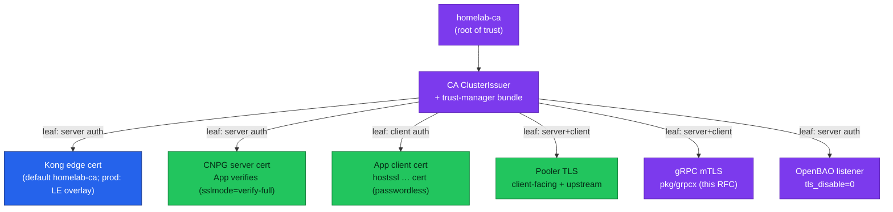
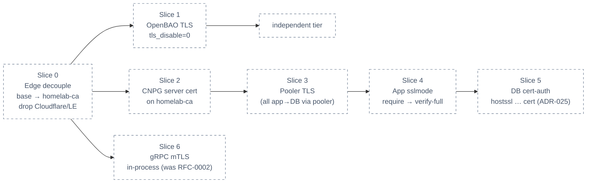

# RFC-0020 — Research: Internal TLS everywhere on the `homelab-ca` root

<!-- Copy this file when reserving RFC-NNNN. Do NOT copy README.md until the research review gate passes. -->

| | |
|---|---|
| **RFC** | RFC-0020 |
| **Status** | researching |
| **Scope** | platform-wide |
| **Created** | 2026-07-21 |
| **Last updated** | 2026-07-22 |

> **Plain-language research.** Write like a careful blog post, not an RFC. After jargon,
> add **"In plain terms"** blockquotes. Facts must still be verified (Context7 + manifests).
>
> **Start from a real problem.** We already run a private certificate authority
> (`homelab-ca`) and it protects exactly one thing — the public edge. Everything *inside*
> the cluster still talks in plaintext or trusts a shared password. This research asks: what
> does it take to drive that one root down every internal tier, and is it worth it before cloud?

---

## Table of contents

1. [Problem statement](#problem-statement)
2. [Reading path](#reading-path)
3. [What internal-TLS-on-one-root is](#what-internal-tls-on-one-root-is)
4. [Core components](#core-components)
5. [Core mechanism](#core-mechanism)
6. [Glossary](#glossary)
7. [Worked examples](#worked-examples)
8. [vs platform as-built](#vs-platform-as-built)
9. [Integration paths](#integration-paths)
10. [Alternatives](#alternatives)
11. [Open questions](#open-questions)
12. [FAQ](#faq)
13. [References](#references)
14. [Context7 audit log](#context7-audit-log)
15. [Research review gate](#research-review-gate)

---

## Problem statement

### Real-world trigger

| | |
|---|---|
| **Situation** | The platform runs a real private CA (`homelab-ca`, cert-manager) and distributes its root via trust-manager — but the only certificate it ever issues is the Kong edge wildcard. Every hop *inside* the cluster (app→database, app→pooler, service→service gRPC, everything→OpenBAO) is either plaintext or authenticated by a shared password over an optionally-encrypted socket. |
| **Who feels it** | Platform + security. On a real engagement this is the first finding in any internal pen-test or SOC-2 "encryption in transit" control. |
| **Why now** | The PKI foundation and trust distribution already exist and are idle internally; three ADRs each defer their slice of internal TLS to "later" with no owner; and the operator is deciding the production-ready security posture *before* moving to cloud. |
| **If we do nothing** | Internal traffic stays sniffable behind only a NetworkPolicy fence; there is no cryptographic *service identity* (NetworkPolicy answers "who may connect", never "which service is this"); the password-rotation and dynamic-cred work (RFC-0008) rests on a transport that itself carries the password in cleartext-capable connections; and the maturity gap silently reads as "done" because the edge is green. |

> **In plain terms:** we built a lock and a key factory, then only locked the front door. Everything behind it is on the honour system.

### What homelab practice proves

- That the **existing `homelab-ca` + trust-manager** can issue and distribute leaves to *internal* workloads (not just the edge) with no new PKI component — the same pattern this RFC extends to gRPC (the east-west tier, formerly RFC-0002).
- **Per tier**, what "turn TLS on" actually costs: which knobs (CNPG `spec.certificates`, `pg_hba hostssl`, pooler config, OpenBAO listener) and which ordering constraints (a pooler that speaks no TLS blocks the app behind it; a cert that must exist before a pod starts).
- Whether the **pooler tier is the true blocker** (PgDog terminates no TLS today) and, if so, which escape hatch fits (migrate to PgBouncer, go direct-to-CNPG, or accept plaintext behind the fence). **Answered:** PgDog is TLS-capable end-to-end (audit log), so the pooler tier is a configuration slice, not a blocker — no escape hatch needed.
- The honest **security uplift vs operational weight** trade — enough to decide in the RFC whether to climb all tiers now or stage them.

---

## Reading path

Suggested order through this file:

1. [What internal-TLS-on-one-root is](#what-internal-tls-on-one-root-is) → [Core mechanism](#core-mechanism)
2. [vs platform as-built](#vs-platform-as-built) → [Integration paths](#integration-paths) → [Alternatives](#alternatives)
3. [Open questions](#open-questions) → [FAQ](#faq) → [Research review gate](#research-review-gate)

---

## What internal-TLS-on-one-root is

Public Key Infrastructure (PKI) replaces "do you know the shared secret?" with "can you prove
who you are, cryptographically?" — verified against a single trusted **root certificate
authority (CA)**. The root signs an issuer; the issuer signs short-lived **leaf** certificates;
a verifier that trusts only the root can validate any leaf by walking the signature chain
upward.

This platform already has that root — `homelab-ca` — plus a trust-distribution mechanism
(trust-manager fans the root into namespaces as a mounted bundle). "Internal TLS on one root"
means **issuing a leaf to every internal endpoint from that same `homelab-ca`** so each hop is
encrypted, and — where it earns its keep — mutually authenticated by certificate instead of by
password.

There are three escalating tiers of "TLS on", and conflating them is the main source of
confusion:

| Tier | What the client does | What it buys | Postgres `sslmode` |
|------|----------------------|--------------|--------------------|
| **T1 Encrypt** | Opens TLS, ignores who the server is | Wire is encrypted (no sniffing) | `require` |
| **T2 Verify server** | Verifies the server's cert against `homelab-ca` | + you're talking to the *real* server (no MITM) | `verify-full` |
| **T3 Client-cert auth** | *Also* presents its own leaf; server verifies it | + passwordless mutual identity (mTLS) | `verify-full` + `hostssl … cert` |

> **In plain terms:** T1 hides the conversation, T2 confirms who you called, T3 also proves who *you* are — and lets you throw the password away.

---

## Core components

| Component | Role |
|-----------|------|
| `homelab-ca` (cert-manager `ClusterIssuer`) | The one root that signs every internal leaf. Already deployed. |
| trust-manager `homelab-ca-bundle` | Distributes the root cert into namespaces (`needs-trust=true`) so clients can verify. Already deployed. |
| cert-manager `Certificate` | Declarative request for a per-workload leaf (server and/or client auth) from `homelab-ca`. |
| CNPG `Cluster.spec.certificates` | Points a CNPG cluster at operator-supplied `serverCASecret` / `serverTLSSecret` / `clientCASecret` instead of CNPG's own auto-CA. |
| Postgres `pg_hba` `hostssl … cert` | Enforces TLS + certificate authentication per (role, database). |
| Pooler TLS (PgBouncer / PgDog) | Terminates client TLS and/or speaks TLS upstream to Postgres. **The current gap.** |
| OpenBAO listener TLS | `tls_disable = 0` + a cert-manager cert on the `:8200` listener. |
| `pkg/grpcx` / `pkg/temporalx` | In-process TLS credentials for east-west gRPC + the Temporal link (this RFC's east-west tier, formerly RFC-0002). |

---

## Core mechanism

**Mechanism — how one root becomes many verified hops.** Every box below is a leaf signed by
the same `homelab-ca`; every client mounts the root bundle and verifies the leaf it is handed.



> **In plain terms:** we already mint one certificate (the edge). This is the same act repeated
> for the database, the pooler, gRPC, and the secrets store — all signed by the root the cluster
> already trusts.

---

## Glossary

| Term | In plain English |
|------|------------------|
| Root CA | The self-signed certificate everything ultimately trusts (`homelab-ca`). |
| Leaf certificate | A short-lived per-workload cert signed (indirectly) by the root. |
| mTLS | Both sides present and verify certificates — mutual identity, not just an encrypted pipe. |
| `sslmode` | Postgres client setting: `disable` / `require` (encrypt) / `verify-full` (encrypt + verify server). |
| `hostssl … cert` | A `pg_hba` rule requiring TLS *and* client-certificate authentication for a (role, db). |
| trust bundle | The root cert, distributed to workloads so they can verify leaves. |
| Pooler | Connection multiplexer in front of Postgres (PgBouncer for platform-db, PgDog for product-db). |

---

## Worked examples

> **Not deployed** — syntax and mechanism only; homelab does not run these yet.

**CNPG server cert from `homelab-ca` (T2 target):**

```yaml
spec:
  certificates:
    serverCASecret: homelab-ca-bundle      # so apps verify against the shared root
    serverTLSSecret: platform-db-server-tls # a cert-manager Certificate from homelab-ca
```

**pg_hba client-cert auth (T3 target):**

```
hostssl notification notification all cert   # TLS required + client cert = identity; no password
```

**OpenBAO listener TLS (from ADR-005 production target):**

```hcl
listener "tcp" {
  tls_disable      = 0
  tls_cert_file    = "/etc/openbao/tls/tls.crt"   # cert-manager Certificate from homelab-ca
  tls_key_file     = "/etc/openbao/tls/tls.key"
  address          = "[::]:8200"
}
```

---

## vs platform as-built

Verified against manifests on 2026-07-21. Marks **deployed** vs **planned**.

| Aspect | Platform today (deployed) | Target on `homelab-ca` (planned) |
|--------|---------------------------|----------------------------------|
| PKI root + trust distribution | `selfsigned-bootstrap → homelab-ca → CA issuer` + trust-manager root-only bundle | unchanged — the anchor |
| Edge (Kong) | `kong-proxy-tls` wildcard; **prod** `letsencrypt-prod` (Cloudflare DNS-01), **local** patched to `homelab-ca` | base default → `homelab-ca`; **prod overlay** re-adds `letsencrypt-prod` (Cloudflare/ACME dropped from base) |
| DB replication | CNPG uses TLS `cert` auth for `streaming_replica` — but from **CNPG's own auto-CA**, not `homelab-ca` | keep CNPG-managed (owner decision 2026-07-22) |
| App → DB | 9 services `sslmode=disable` via poolers; only `payment` is `hostssl`+`require` direct to CNPG | T2 `verify-full` against `homelab-ca`; then T3 cert-auth (ADR-025) — **all via pooler** (owner decision 2026-07-22; `payment`'s direct hop is transitional) |
| Pooler (PgBouncer / PgDog) | No client-facing TLS; PgDog upstream plaintext; PgBouncer only uses CNPG auto client-cert for `auth_query` | client + upstream TLS — PgDog confirmed TLS-capable up to `verify_full` + mTLS (audit log) |
| East-west gRPC | plaintext `insecure.NewCredentials()`; Temporal link no TLS | in-process mTLS — **this RFC's east-west tier** (formerly RFC-0002) |
| Secrets (OpenBAO) | listener `tls_disable = 1`, plaintext `:8200` | `tls_disable = 0`, cert-manager cert (ADR-005 prod target) |

---

## Integration paths

All **planned** until manifests exist. The rollout order matters — a lower tier blocks the one
above it.



> **In plain terms:** fix the front-door issuer first (easy, isolated), then work the two
> independent chains — the secrets store on its own, and the database chain where each step
> unlocks the next. gRPC is this RFC's Slice 6 (in-process, formerly RFC-0002).

**Hard dependency:** App→DB `verify-full` (Slice 4) is **blocked by the pooler tier** (Slice 3) —
you cannot ask an app to verify a TLS server if the pooler in front of it speaks no TLS. This is
why `payment` (direct-to-CNPG, no pooler) is the *only* service on `require` today.

**Owner decision (2026-07-22): every app→DB path goes through its pooler — no
direct-to-CNPG exceptions.** `payment`'s direct connection existed only because the pooler
spoke no TLS; it is transitional and returns behind `pgdog-product` once Slice 3 lands.
Direct/bypass is no longer an escape hatch in any slice.

---

## Alternatives

Decision stays open; this frames the space. The service-identity question is **already decided
by sibling docs** — do not re-litigate here, reference them.

| Option | Pros | Cons |
|--------|------|------|
| **(a) Per-workload cert-manager TLS, in-process** *(recommended direction)* | Reuses the deployed `homelab-ca` + trust-manager; no new component; matches the edge + CNPG-replication pattern already in the cluster; the superseded RFC-0002 already committed to it for gRPC | Per-workload `Certificate` + mount wiring; each tier has its own knob and ordering; app must be TLS-aware |
| **(b) Service mesh (Istio Ambient / Linkerd)** | Transparent mTLS with no app changes; policy + observability bundled | **Deferred by [RFC-0006](../RFC-0006/) as disproportionate** for ~9 hops; large operational surface for a Kind/small cluster; still would not cover DB/OpenBAO natively |
| **(c) SPIFFE/SPIRE workload identity** | Industry standard for short-lived SVID identity incl. Postgres/MySQL auth | **Rejected** at this scale (echoed by RFC-0006); heavy control plane; overkill before cloud |
| **(d) Do nothing internally (status quo)** | Zero effort; NetworkPolicy already fences connectivity | Leaves the security finding open; no service identity; blocks ADR-025 cert-auth and undercuts RFC-0008 |

**Cloud mapping (why this is still the right learning target):** on managed cloud the edge would
use **Cloudflare DNS-01 / Let's Encrypt** (exactly the overlay we keep for prod), and managed
databases (**RDS / Cloud SQL IAM auth**) would replace DB client-cert auth with passwordless IAM.
`homelab-ca` + mTLS is the **self-hosted equivalent** of that cloud identity plane — learning it
here maps directly to "flip to IAM" later.

---

## Open questions

- [x] **PgDog TLS capability** — **answered (2026-07-21, see audit log)**: PgDog supports
      client-facing TLS (`tls_certificate`/`tls_private_key`, optional `tls_client_required`),
      upstream verification up to `tls_verify = verify_full` with `tls_server_ca_certificate`,
      and experimental mTLS client-cert auth (`tls_client_ca_certificate`). Fallbacks (i)–(iii)
      are not needed; Slice 3 becomes a PgDog configuration change. **App→DB `verify-full` is
      unblocked.**
- [x] **CNPG server-cert source** — **decided (owner, 2026-07-22): re-issue from `homelab-ca`**
      via `spec.certificates` (`serverCASecret`/`serverTLSSecret`). Apps keep exactly one trust
      root (the bundle they already mount); distributing CNPG's auto-CA would add a second
      root to every client — against this RFC's goal. Re-bootstrap brittleness is handled by
      cert-manager re-issuing declaratively from the `Certificate` CR.
- [x] **What does "sslmode true" mean per tier** — **decided (owner, 2026-07-22): jump straight
      to `verify-full` for all 10 services** (no intermediate `require` step — same wiring
      effort, strictly more protection). **T3 is defined per hop** because of the
      all-via-pooler decision: with a pooler in the middle, Postgres `hostssl … cert`
      authenticates the *pooler's* client cert, not the app's — so per-service cert identity
      lives on the app→pooler leg (PgDog `tls_client_ca_certificate`), while the
      pooler→Postgres leg carries the pooler's identity (per-role auth stays
      password/`auth_query` at that hop). The README specifies the per-hop meaning.
- [x] **Cert lifetimes / rotation** — **decided (owner, 2026-07-22): one policy for all internal
      leaves — 90d lifetime, renew 30d before expiry** (the RFC-0002 heritage). cert-manager
      handles renewal; consumers reload without restart (OpenBAO via SIGHUP, CNPG/PgDog via
      operator/config reload). Hours-scale TTLs only pay off with SPIFFE-style identity,
      which is rejected at this scale.
- [x] **OpenBAO TLS bootstrap ordering** — **direction set (owner, 2026-07-22)**: cert-manager
      already reconciles in the wave before secrets in the Flux chain; the OpenBAO
      `Certificate` gets a readiness gate before the HelmRelease, and the `retry_join`
      https flip + probe scheme change land in the same commit as the listener change.
      Verified against floci auto-unseal in a `make up` drill (Testing section of the README).
- [x] **`streaming_replica`** — **decided (owner, 2026-07-22): leave CNPG-managed.** CNPG's
      internal replication cert-auth stays on its own auto-CA; it never leaves the CNPG
      cluster boundary, and folding it onto `homelab-ca` adds re-bootstrap brittleness for
      no external-trust gain. Revisit only if a single-root compliance requirement appears.
- [x] **Scope of the first RFC** — **decided (owner, 2026-07-22): umbrella, Slice 0–6.** The
      PgDog blocker is gone, so every slice is a configuration change inside homelab except
      Slice 6 (gRPC mTLS touches `pkg/grpcx` in service repos) — Slice 6 ships last as its
      own gated phase.

---

## FAQ

**Isn't a service mesh the "proper" way to do mTLS everywhere?**

For a large fleet, often yes. Here, RFC-0006 already judged Istio Ambient / Linkerd
disproportionate for ~9 hops, and the in-process approach (this RFC, formerly RFC-0002) was chosen. A mesh also would not natively
cover the database or OpenBAO tiers, which is where most of this work actually lives.

**Why drop Cloudflare / Let's Encrypt now if prod will need it?**

The ACME path needs a real DNS zone + a `cloudflare-api-token` that cannot be committed to git,
and the local cluster already patches the edge to `homelab-ca`. Making `homelab-ca` the base
default (and reintroducing `letsencrypt-prod` as a prod overlay) removes a dead, secret-dependent
issuer from the repo and makes local and base identical. It is a clean inversion of today's
patch, not a loss of capability.

**Does this replace the password / dynamic-credential work (RFC-0008)?**

No — it complements it. T1/T2 encrypt and verify the transport those credentials travel over;
T3 (cert-auth) is the endpoint where a service could stop using a password entirely. They stack.

---

## References

<!-- Official product docs only. Synthesize in-house — no embedded third-party tutorials. -->

- cert-manager — issuers, `Certificate`, trust-manager `Bundle`.
- CloudNativePG — TLS/SSL connections, `Cluster.spec.certificates`, client-certificate
  authentication, `cnpg` plugin certificate issuance.
- PostgreSQL — `pg_hba.conf` auth methods (`hostssl`, `cert`), libpq `sslmode`.
- PgBouncer — client/server TLS settings. PgDog — TLS settings (client, upstream verification, mTLS).
- OpenBAO / HashiCorp Vault — `listener "tcp"` TLS configuration.
- Internal: [RFC-0002](../RFC-0002/) (superseded — its east-west gRPC mTLS design is absorbed
  by this RFC), [RFC-0006](../RFC-0006/) (mesh
  evaluation), [ADR-005](../../adr/ADR-005-openbao-ha-raft/), [ADR-015](../../adr/ADR-015-pg-hba-connection-isolation/),
  [ADR-025](../../adr/ADR-025-pgdog-passthrough-dynamic-db-creds/), and the cert-manager guide
  [`docs/secrets/cert-manager.md`](../../../secrets/cert-manager.md).

---

## Context7 audit log

<!-- Record Context7 (or official doc) queries and corrections applied in this file. -->

| Claim / section | Source checked | Result |
|-----------------|----------------|--------|
| cert-manager reference PKI (`selfSigned → CA issuer`) matches homelab's chain | Context7 `/cert-manager/website` (2026-07-21) | confirmed |
| trust-manager should distribute **root certs only** | Context7 `/cert-manager/website` | confirmed |
| CNPG supports `hostssl … cert` client-cert auth + `cnpg` plugin issues client certs "as an alternative to password-based auth"; `spec.certificates` (serverCA/serverTLS/clientCA) | Context7 `/cloudnative-pg/cloudnative-pg` | confirmed |
| CNPG `streaming_replica` already uses TLS client-cert auth | Context7 `/cloudnative-pg/cloudnative-pg` | confirmed |
| SPIFFE/SPIRE issues short-lived SVIDs with explicit Postgres/MySQL auth use-cases | Context7 `/spiffe/spire` | confirmed |
| PgDog client + upstream TLS capability | Context7 `/pgdogdev/pgdog` + PgDog official docs (2026-07-21) | **confirmed — full ladder**: client-facing `tls_certificate`/`tls_private_key` + `tls_client_required`; upstream `tls_verify` (`none`/`prefer` default/`verify_ca`/`verify_full`) + `tls_server_ca_certificate`; mTLS client-cert auth via `tls_client_ca_certificate` (experimental). Unblocks Slice 3/4 — no PgBouncer migration needed |
| Istio Ambient vs sidecar overhead (for RFC-0006 cross-ref) | Context7 `/websites/istio_io` (2026-07-21) | confirmed — sidecar = per-pod Envoy with per-pod resource cost; ambient = node-level `ztunnel` DaemonSet (HBONE mTLS, `DISABLE` unsupported); cross-ref only, owned by RFC-0006 |
| OpenBAO listener TLS config shape | Context7 `/openbao/openbao` (2026-07-21) | confirmed — `listener "tcp"` `tls_cert_file`/`tls_key_file` (`tls_disable` opt-out); cert reloads on SIGHUP, fits cert-manager rotation |

---

## Research review gate

- [x] Answers a **real-world problem** you'd recognize at work (internal pen-test / SOC-2
      encryption-in-transit finding) — not generic vendor marketing (owner confirmed 2026-07-22)
- [x] **Problem statement** names situation, who feels it, and cost of doing nothing
- [x] At least **two alternatives** documented with tradeoffs
- [x] **Platform as-built** section filled from manifests/docs (not boilerplate)
- [x] Primary use-case direction stated — in-process per-workload on `homelab-ca`; scope decided: umbrella Slice 0–6 (owner, 2026-07-22)
- [x] **Context7 audit** complete; footer date updated (PgDog, Istio, and OpenBAO rows resolved 2026-07-21)
- [x] At least **one Mermaid** diagram; labels match deployed vs **planned** reality
- [x] No Kubernetes manifest changes smuggled into this research file
- [x] Owner sign-off: **ready for RFC** (2026-07-22 — decisions recorded in [Open questions](#open-questions); RFC: [./README.md](./README.md))

---

_Last verified: 2026-07-22 (Context7 complete + manifest cross-check; all open questions decided — gate passed)._
