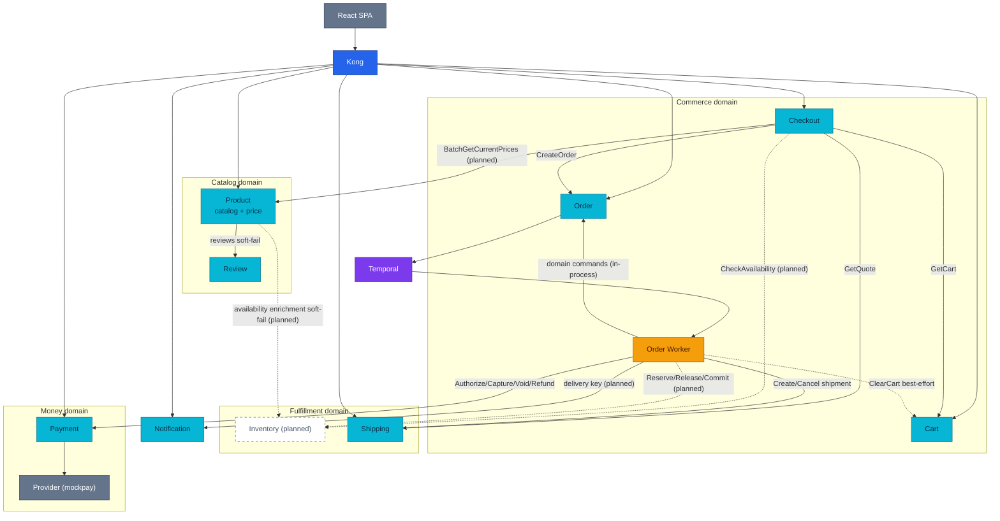
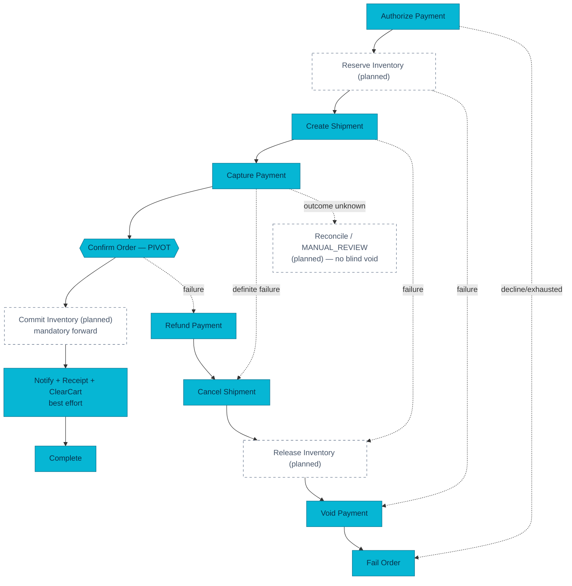

# RFC-0021 Platform overhaul: inventory extraction, order aggregate, payment hardening

| Status | Scope | Research | Created | Last updated |
|--------|-------|----------|---------|--------------|
| provisional | platform-wide | [./research.md](./research.md) — gate passed 2026-07-23 | 2026-07-23 | 2026-07-23 |

> **Supersedes [RFC-0003](../RFC-0003/README.md)** (*Inventory ownership and stock
> semantics*), which ratified product-service as the inventory owner. RFC-0003's own
> Drawbacks section named this RFC's direction as the escalation path ("Alternative
> (b)": a dedicated inventory-service). RFC-0003 is retained as a pointer; its stock
> semantics (`available → reserved → sold/released`) carry forward into the inventory
> reservation FSM below.

## Prerequisites

- [x] [./research.md](./research.md) merged; [research review gate](./research.md#research-review-gate) ticked
- [x] Context7 audit complete (see research footer)
- [x] Owner approved **ready for RFC** (2026-07-23)

## Summary

One umbrella program, three tracks, eight phases. Extract a dedicated
**`inventory-service`** as the sole authority for stock (warehouse, balance,
reservation, movement ledger) out of product-service via expand → migrate → contract;
**strengthen the Order domain** into a real aggregate (domain transition methods,
optimistic concurrency, status history, durable workflow-start outbox); **harden
Payment** for production ambiguity (provider-unknown state, payment attempts,
saga-path refund request IDs, windowed reconciliation with alerts, background-role
split). Temporal stays the orchestrator; no broker is introduced; every contract
change is additive first and removed only at usage zero.

## Motivation

Product-service owns two bounded contexts with opposite profiles: read-heavy catalog
and write/concurrency-heavy stock (`ReserveStock` decrements `stock_quantity` in
place). Order status is a two-transition enum with unconditional updates — no version
CAS, no history, no durable start record. Payment is strong (FSM + CAS, append-only
double-entry ledger, transactional outbox, webhook HMAC + dedupe) but cannot express
"provider outcome unknown", scans its full history every reconciliation pass, and has
no discrepancy alert. The 2026-07-23 code audit in [./research.md](./research.md)
verified all of this against fresh `main`.

### Goals

- Inventory is the only service that changes stock balances and reservations; Product
  is catalog/price-only. No oversell, no double-reserve, no double-commit — proven by
  DB constraints and concurrency tests.
- The order saga survives the migration: in-flight workflows complete on the old path
  (workflow versioning), new workflows use Inventory with `Commit` as a **mandatory
  forward** step after the `ConfirmOrder` pivot (long retries + alert + reconciler —
  never best-effort).
- Order transitions happen only through domain commands with optimistic concurrency
  and an auditable status history; a workflow-start outbox removes zombie-pending
  orders.
- Payment distinguishes definite failure from unknown outcome; refunds are
  request-level idempotent on every path; reconciliation is windowed and alerting.
- Every phase has an exit gate, baseline metrics, and a rollback path.

### Non-Goals

- **No SKU/variant model** — none exists today (`products.id` SERIAL int); the initial
  identity is `sku_id = product_id`. Variants are future work the `inventory.v1`
  contract must not block.
- **No multi-warehouse split fulfillment** — one default warehouse; one order is
  fulfilled by one warehouse (Shipping's `UNIQUE(order_id)` invariant stands).
- **No broker/Kafka** — outbox events keep their log publisher until a real consumer
  exists.
- **No reservation auto-expiry in v1** — `expires_at` is observability-only; a
  reconciler reports stale reservations; auto-expire waits for lease renewal (v2).
- **No `available_to_promise` from `incoming`** — no backorder/preorder contract.
- **No new Order statuses copying downstream state** — `PAID`/`RESERVED`/`SHIPPING`
  stay owned by Payment/Inventory/Shipping; UI progress uses a read projection.

## Proposal

### Data ownership after the overhaul

| Service | Owns | Must not own |
|---------|------|--------------|
| Product | Catalog, price, publish lifecycle, media, review aggregation | On-hand, reservations, warehouse allocation |
| Inventory *(new)* | Warehouse, balance, reservation, allocation, movement ledger, safety stock | Descriptions, selling price, order status |
| Checkout | Session, snapshot, totals, promo, confirm idempotency | Order rows, payment state, reservations |
| Order | Order aggregate, item/money snapshot, commercial lifecycle, workflow handoff | Payment ledger, stock balance, shipment state |
| Payment | Intent/attempt, provider reference, refunds, ledger, reconciliation | Order state, inventory state |
| Shipping | Quote authority, shipment lifecycle | Order commercial state, stock balance |
| Notification | Delivery/inbox records (delivery-key idempotent) | Order success/failure authority |

### Key decisions

| Question | Decision |
|----------|----------|
| Inventory identity | Opaque immutable `sku_id`; initially `sku_id = product_id` |
| Balance model | `on_hand`/`reserved`/`safety_stock` columns; `available_to_promise = max(0, on_hand − reserved − safety_stock)` derived, never stored as truth; movements ledger with separate `on_hand_delta`/`reserved_delta` |
| "Sold" | Not a balance bucket — commit does `on_hand −= q; reserved −= q` + a `SALE_COMMITTED` movement |
| Reservation FSM | `RESERVED → COMMITTED \| RELEASED \| EXPIRED`; replay-idempotent per transition; `reservation_id = order_id` with canonical request hash; same key + different payload → `IDEMPOTENCY_CONFLICT` |
| Reserve semantics | All-or-none transaction; deterministic single-warehouse allocation; stable lock order `(warehouse_id, sku_id)` |
| Backfill mapping | `on_hand = stock_quantity + SUM(active reserved)` — required because today's reserve decrements `stock_quantity` directly (audit-confirmed) |
| Checkout reads | Split one `GetProducts` call into `Product.BatchGetCurrentPrices` + `Inventory.CheckAvailability`; availability at checkout is a UX/revalidation gate — `Reserve` in the saga stays the correctness gate; Inventory timeout at confirm fails closed (`503`/retryable), never maps to out-of-stock |
| Saga pivot | `ConfirmOrder` (post-capture) stays the pivot; `CommitInventory` is post-pivot **mandatory forward** |
| Workflow migration | Versioned branch so open histories replay the Product path; mechanism (GetVersion patching vs Worker Versioning) is an open question resolved in phase 3 — see [./research.md § Open questions](./research.md#open-questions) |
| Order status model | Add `CANCELLING`, `CANCELLED`, `MANUAL_REVIEW`, `COMPLETED` around the existing `PENDING/CONFIRMED/FAILED`; transitions only via domain methods + version CAS + `order_status_history`; processing stage is a projection, not `orders.status` |
| Workflow start | `fulfillment_start_requests` outbox + dispatcher as the authoritative safety net (opportunistic inline start kept for latency) |
| Payment write path | Order saga is the only Order-payment writer; browser `POST /payment/v1/private/payments` deprecates after usage-zero unless a standalone use case is claimed |
| Payment ambiguity | `PROCESSING` intent state + attempt `outcome_class` (`SUCCESS/BUSINESS_DECLINE/RETRYABLE_FAILURE/UNKNOWN`); `UNKNOWN` never auto-triggers the semantic opposite operation |
| Migration mode | Backfill + shadow reads + controlled cutover window; **no long-lived dual-write**; after write cutover, fix forward rather than roll back data authority |
| Feature flags | Enum values (`CHECKOUT_AVAILABILITY_SOURCE=product\|shadow\|inventory`, `ORDER_STOCK_PARTICIPANT=product\|inventory`, …), startup-validated fail-fast via a new shared pkg helper; every flag has an owner and a removal issue |
| Contracts | Additive `inventory.v1` package; Product stock RPCs/fields deprecated (`deprecated = true`, usage telemetry) and removed only at usage zero; Buf breaking check enforces |

### Alternatives

Rejected (full analysis in [./research.md § Alternatives](./research.md#alternatives)):
**(a)** keep RFC-0003's status quo — never exercises the extraction/versioning/
mandatory-forward patterns this platform exists to practice; **(c)** hybrid read-model —
adds a staleness boundary without solving write ownership; **split RFCs per track** —
owner chose one umbrella registry entry (2026-07-23), mitigated by per-phase gates.

## Architecture & Diagrams

**Target state — platform topology after the overhaul** (Inventory and its edges are
**planned**; everything else is deployed today):

Legend: blue = edge, cyan = service, amber = worker, purple = platform, grey =
external, dashed = **planned**. Dotted edges are planned or best-effort (labelled).

**Target fulfillment flow** (compensation chain and step classes):

## Design Details

Summarized here; the mechanism deep-dive lives in [./research.md](./research.md).

- **Inventory service shape**: standard platform layout (`grpc/v1 → logic/v1 →
  core/domain → repository → Postgres`), reusing `pkg` helpers (`grpcx`, `dbx`, `obsx`,
  `idempotency`, `temporalx`). Admin operations are explicit commands
  (`ReceiveStock`, `AdjustOnHand`, `TransferStock`, `SetSafetyStock`, …) keyed by
  `command_id` — no generic "sync" that bypasses the movement ledger.
- **SQL backstops**: `CHECK` constraints (`on_hand ≥ 0`, `reserved ≥ 0`,
  `reserved ≤ on_hand`, `quantity > 0`), `UNIQUE(external_reference)`,
  `UNIQUE(command_id)`. Correctness never relies on in-memory locks.
- **Error taxonomy**: stable machine reasons over gRPC (`INSUFFICIENT_STOCK`,
  `IDEMPOTENCY_CONFLICT`, `INVALID_TRANSITION`, `CONCURRENCY_CONFLICT`, …) — requires
  the new shared gRPC error-reason convention in `pkg` (today stable codes exist only
  HTTP-side in `httpx`). Business rejections map to non-retryable Temporal errors.
- **Enable/disable**: every migration step is flag-gated with enum modes
  (`product|shadow|inventory`); invalid values fail startup; active mode is logged and
  exported as a bounded `mode` metric label. Read cutover rolls back by flag in
  minutes; write cutover follows the runbook (below).
- **Order aggregate**: additive schema (`version`, timestamps, failure/cancellation
  metadata, `order_status_history` with `UNIQUE(order_id, command_id)`); repository
  CAS `WHERE id = $1 AND status = $expected AND version = $expected`; deterministic
  command IDs from the workflow (`confirm:order-42`). The worker keeps its in-process
  repository access but goes through the same domain guards as the HTTP handler — no
  new pkg command RPCs (audit-confirmed unnecessary).
- **Payment additions are additive**: `payment_attempts` (partial unique index — at
  most one `CAPTURED` attempt per intent), `PROCESSING` state, operation-specific
  provider idempotency keys (adds the missing Capture/Void keys), saga-path
  `refund_request_id` (HTTP path already has it), windowed reconciliation
  (`from_time`/`through_time`/cursor + high-watermark) with `discrepancies>0` alerts.
  The stale single-replica premise in the payment manifest is corrected: the outbox
  relay is already `SKIP LOCKED`-safe; the reconciler gets a lease/leader instead.
- **Drawbacks accepted**: a new service/DB/NetworkPolicy/Kyverno surface and a new
  east-west hop on the money path; a short fulfillment pause during the write-cutover
  window; workflow versioning complexity carried until old histories drain; a
  temporary shadow-read cost at checkout.

## Security considerations

- Inventory gRPC is NetworkPolicy-fenced to the `checkout` and `order` namespaces
  (pod-scoped, copying the `allow-product-grpc` template); admin/ops surface is
  internal-only, never routed through Kong.
- New DB = a triplet (ExternalSecret + DatabaseRole + Database) on the existing
  `product-db` CNPG cluster; per-service credentials via ESO→OpenBAO; runtime role has
  no DDL; pg_hba allow line ordered before the trailing reject (first-match-wins).
- Kyverno admission unchanged and binding: pinned GHCR image, resources, probes, PSS
  restricted.
- No secrets/PAN in logs, span attributes, or workflow history; provider secrets stay
  in the secret manager; webhook HMAC + replay window unchanged.
- East-west mTLS remains [RFC-0020](../RFC-0020/)'s scope — NetworkPolicy is the
  guard here until it lands.

## Observability & SLO impact

- **New bounded metrics**: `inventory_reservation_total{operation,outcome}`,
  `inventory_check_total{outcome}`, `inventory_db_conflict_total{operation}`,
  `inventory_shadow_compare_total{result}`, `inventory_commit_lag_seconds`,
  `order_workflow_compensation_total{step,outcome}`, `fulfillment_start_outbox_pending`,
  `payment_reconciliation_discrepancies_total{class}`,
  `payment_provider_unknown_total{operation}`. No SKU/order/user IDs as labels.
- **New alerts (catalog + runbooks required)**: order CONFIRMED but reservation still
  RESERVED > 5 min; negative-ATP/constraint anomaly; compensation retry over SLA;
  start-outbox oldest age; reconciliation not running / discrepancies > 0; shadow
  mismatch (warning).
- **Starting SLO targets** (tuned after baseline): checkout confirm handoff 99.9%;
  Reserve p95 < 250 ms; confirmed→committed 99.9% < 5 min; oversell = 0; duplicate
  capture = 0.
- Phase 0 records a 7-day baseline (confirm success, reserve outcomes, workflow
  durations, compensation counts) so every later phase is judged against data.

## Rollout & rollback

| Phase | Delivers | Exit gate |
|-------|----------|-----------|
| 0 | Contracts (`inventory.v1` additive), enum-flag helper, gRPC error-reason convention, baseline metrics/tests | Buf breaking green; baseline recorded; rollback story per cutover written |
| 1 | inventory-service foundation (schema, Reserve/Release/Commit, availability reads, GitOps + local-stack) | No oversell/double-commit in concurrency tests; deployed but no live write traffic |
| 2 | Read path: backfill (`on_hand = stock_quantity + SUM(reserved)`), shadow reads, canary availability reads | Shadow mismatch = 0 or explained; flag rollback to Product proven |
| 3 | Write path: versioned workflow, Inventory activities, `CommitInventory` mandatory forward, start outbox | Old histories replay green; new orders 100% Inventory; commit-lag alert + reconciler live |
| 4 | Remove stock from Product (deprecate → usage-zero → drop schema/cache/RPCs) | Zero live callers of Product stock surface; docs/api updated |
| 5 | Order aggregate (domain methods, CAS, history, cancellation, legacy-create removal) | No generic status writes; legacy route usage zero then removed |
| 6 | Payment hardening (attempts, PROCESSING, refund IDs, windowed recon, role split) | No ambiguous timeout marked definite; recon alerting live |
| 7 | SLOs, runbooks, chaos drills, flag/debt cleanup | GameDay scenarios converge; all migration flags removed |

**Write cutover** (phase 3) uses a controlled window: pause fulfillment starts → drain
in-flight stock activities → final delta backfill → verify ATP invariant → flip
`ORDER_STOCK_PARTICIPANT=inventory` → resume → smoke orders (success, insufficient,
decline, capture-fail, commit-retry) → observe ≥ 30–60 min.

**Rollback stance**: read path rolls back by flag in minutes. After the write cutover,
rolling back data authority is unsafe once Inventory has taken live writes — stop new
workflows, keep compatible workers draining Inventory-version histories, and **fix
forward**; only roll back to the Product path if Product data was kept authoritative
per the cutover design. Old Product activities stay registered until open-workflow
count and retention hit zero.

## Testing / verification

- **Inventory**: transition/property tests for the FSM and ATP; repository concurrency
  races (last-unit contention, multi-line rollback, duplicate reserve, release-after-
  commit blocked); hot-SKU load with p95/p99 targets.
- **Workflow**: replay tests for old histories before every worker deploy; unit tests
  per failure point and compensation order; kill-the-worker chaos between activity
  commit and response; duplicate-start returns already-exists.
- **Cutover**: backfill dry-run report with `current_available == target_atp`
  assertion per SKU; shadow-compare metrics; smoke-order suite in the cutover runbook.
- **Payment**: lost-response idempotency (authorize/capture), duplicate/out-of-order
  webhooks, concurrent partial refunds capped at captured amount, append-only trigger
  tests, reconciliation window/cursor resume.
- **Platform**: `make validate` per PR; local-stack e2e audit (Phases A/B/C) for any
  gateway/compose-touching change; acceptance matrix (happy path through
  cancellation) executed before each phase exit.

## Implementation History

- 2026-07-23 — research gate passed (code audit + Context7); owner approved umbrella
  scope and RFC-0003 supersession; README published (provisional).

## Related

- [./research.md](./research.md) — plain-language research, code audit, Context7 trail
- [./cutover-rollback.md](./cutover-rollback.md) — per-cutover rollback story (RUNBOOK-007 seed)
- [./baseline-e2e-results.md](./baseline-e2e-results.md) — phase-0 baseline run (18 PASS, capture-fail gap documented)
- [RFC-0003](../RFC-0003/README.md) — superseded by this RFC
- [RFC-0001](../RFC-0001/) — saga foundations · [RFC-0010](../RFC-0010/) + ADR-007..012 — payment base
- [RFC-0015](../RFC-0015/) + ADR-018/019/020 — checkout/order handoff invariants
- [RFC-0020](../RFC-0020/) — east-west TLS (phase 7 dependency)
- ADRs to spawn at ship time: ADR-027+ (inventory authority; FSM/ledger; flag helper;
  workflow versioning; order status model; payment attempts)

---
_Last updated: 2026-07-23_
