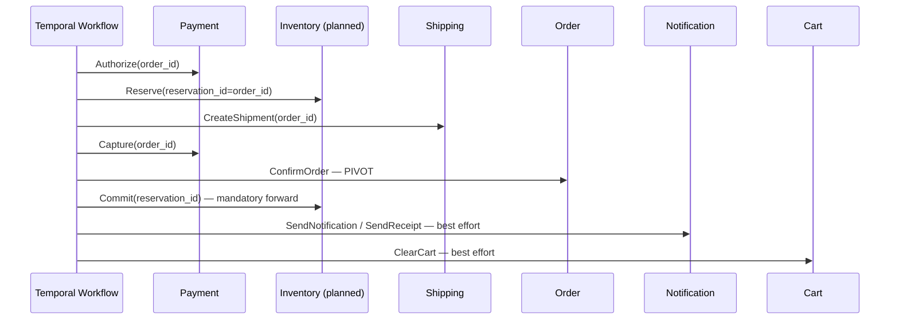
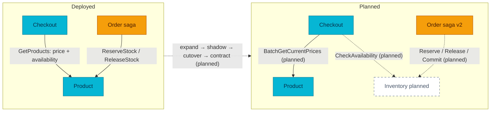

# RFC-0021 — Research: Platform overhaul — inventory extraction, order aggregate, payment hardening

| | |
|---|---|
| **RFC** | RFC-0021 |
| **Status** | researching |
| **Scope** | platform-wide |
| **Created** | 2026-07-23 |
| **Last updated** | 2026-07-23 |

> **Plain-language research.** This file is the audit trail for the largest refactor the
> platform has attempted: extracting a dedicated `inventory-service` out of
> `product-service`, strengthening the `order` aggregate, and hardening the `payment`
> domain. This file frames the problem, records what the code audit proved about the
> as-built platform, and holds the open questions for the research gate. The full target
> design (contracts, data models, phase plan, cutover runbook) lands in `README.md`
> after the gate.
>
> **Supersession notice.** This RFC proposes to **supersede
> [RFC-0003](../RFC-0003/README.md)** (*Inventory ownership and stock semantics*,
> provisional), which ratified product-service as the inventory owner. RFC-0003 itself
> names the escape hatch this RFC takes: its Drawbacks section says the mitigation for the
> shared catalog/stock blast radius is *"escalation path is Alternative (b)"* — a
> dedicated inventory-service.

---

## Table of contents

1. [Problem statement](#problem-statement)
2. [Reading path](#reading-path)
3. [What the overhaul is](#what-the-overhaul-is)
4. [Core components](#core-components)
5. [Core mechanism](#core-mechanism)
6. [Glossary](#glossary)
7. [vs platform as-built](#vs-platform-as-built)
8. [Integration paths](#integration-paths)
9. [Alternatives](#alternatives)
10. [Open questions](#open-questions)
11. [FAQ](#faq)
12. [References](#references)
13. [Context7 audit log](#context7-audit-log)
14. [Research review gate](#research-review-gate)

---

## Problem statement

### Real-world trigger

| | |
|---|---|
| **Situation** | Checkout/fulfillment growth pressure on a service that owns two bounded contexts: `product-service` serves read-heavy catalog traffic *and* the write/concurrency-heavy stock path (`ReserveStock` decrements `stock_quantity` in place). Order state is a two-transition enum with no optimistic concurrency, no status history, and no durable workflow-start record. Payment is strong but has known production gaps (no provider-unknown state, full-scan reconciliation, no discrepancy alert). |
| **Who feels it** | On-call (stuck reservations are invisible outside the Temporal UI; a confirmed order with an un-committed reservation has no alert), design review (every stock-adjacent PR re-litigates ownership), platform (catalog cache and money-path stock share one DB and one blast radius). |
| **Why now** | RFC-0003 ratified the status quo *"at homelab scale"* and explicitly deferred extraction until "a concrete pressure appears". The pressure is now a learning goal made explicit: run the same expand→migrate→contract bounded-context extraction, saga re-versioning, and money-path hardening that a production team would, on a platform that mirrors production. |
| **If we do nothing** | Stock stays a product attribute: no reservation expiry story, no movement ledger with physical/reserved separation, no warehouse model; order status stays too thin to support cancellation/manual-review; payment ambiguity (provider timeout ≠ decline) stays unmodeled; the platform never exercises Temporal workflow versioning, which any long-lived saga eventually needs. |

> **In plain terms:** three refactors in one program — move stock out of the catalog
> service safely, make Order a real aggregate, and make Payment operable under ambiguity —
> executed with the same migration discipline (contracts first, shadow reads, versioned
> workflows, controlled cutover) a production team would use.

### What homelab practice proves

- Can we extract a bounded context (stock) from a live service without breaking
  in-flight Temporal workflows — using additive `inventory.v1` contracts, shadow reads,
  `workflow.GetVersion`, and a controlled write cutover?
- Can the platform express "mandatory forward after pivot" (CommitReservation) with
  long-running retries, alerts, and a reconciler — instead of best-effort semantics?
- Can Order/Payment adopt production state models (optimistic concurrency, status
  history, provider-unknown handling, windowed reconciliation) additively?

---

## Reading path

1. [Problem statement](#problem-statement) → [What the overhaul is](#what-the-overhaul-is)
2. [vs platform as-built](#vs-platform-as-built) → [Alternatives](#alternatives)
3. [Open questions](#open-questions) → [Research review gate](#research-review-gate)

---

## What the overhaul is

One umbrella program (owner decision, 2026-07-23) covering three tracks over eight
phases (0–7):

| Track | Phases | Essence |
|-------|--------|---------|
| **Inventory extraction** | 0–4 | New `inventory-service` (warehouse, balance, reservation FSM, movement ledger) becomes the sole stock authority; Product keeps catalog + price; Checkout splits price and availability reads; the order saga moves from `Product.ReserveStock/ReleaseStock` to `Inventory.Reserve/Release/Commit` with `Commit` as a **mandatory forward** step after the pivot. |
| **Order strengthening** | 5 | Order becomes an aggregate: domain transition methods, optimistic concurrency (version CAS), status history, workflow-start outbox + dispatcher, explicit cancellation/manual-review lifecycle. `orders.status` stays commercial-only (no `PAID`/`SHIPPING`). |
| **Payment hardening** | 6 | Keep the shipped FSM/ledger/outbox/webhook mechanisms; add provider-unknown (`PROCESSING`) handling, payment attempts, saga-path refund request IDs, windowed reconciliation with alerts, and background-role deployment split. Absorbs the reserved backlog item **RFC-0016** (async payment confirmation). |
| **Production hardening** | 7 | SLOs, alert catalog, runbooks, chaos scenarios, deprecation cleanup (legacy order create route, Product stock RPCs) across all tracks. |

> **In plain terms:** phase 0 writes contracts and guardrails; phases 1–4 move stock;
> phase 5 hardens Order; phase 6 hardens Payment; phase 7 makes it operable. Tracks 2 and
> 3 are largely independent of track 1 and can interleave once phase 3 lands.

---

## Core components

| Component | Role |
|-----------|------|
| `inventory-service` *(new)* | Sole authority for warehouse, balance (`on_hand`/`reserved`/`safety_stock`), reservation FSM (`RESERVED → COMMITTED\|RELEASED\|EXPIRED`), movement ledger, allocation. |
| `inventory.v1` proto *(new, additive)* | `BatchGetAvailability`, `CheckAvailability`, `Reserve`, `Release`, `Commit`, `GetReservation` in `pkg/proto/inventory/v1`. |
| `product-service` *(shrinks)* | Catalog, price, publish lifecycle; loses `stock_quantity`, `stock_reservations`, `ReserveStock`/`ReleaseStock` after usage-zero (expand→contract). |
| `checkout-service` *(rewires reads)* | Splits one `GetProducts` call into `Product.BatchGetCurrentPrices` + `Inventory.CheckAvailability`, behind enum feature flags with a shadow-read stage. |
| `order-service` *(strengthens)* | Versioned saga (`workflow.GetVersion`), `CommitInventory` mandatory-forward activity, aggregate/CAS/status-history, workflow-start outbox. |
| `payment-service` *(hardens)* | `PROCESSING`/unknown outcome class, payment attempts, saga refund request IDs, windowed reconciliation + alerts, deployment role split. |
| Platform (homelab) | inventory namespace/RSIP/NetworkPolicy/DB triplet, dashboards + alert catalog + runbooks, Temporal search-attribute registration. |

---

## Core mechanism

**Target fulfillment flow — where the saga changes** (current flow reserves via Product
and has no post-pivot inventory step):

> **In plain terms:** everything before ConfirmOrder can be compensated (void, release,
> cancel). After the pivot the order is confirmed and money is captured, so the inventory
> commit must *converge forward* — retry until it succeeds, alert if it lags — never
> release the goods or roll the order back because of a transient failure.

The full mechanism catalogue (reservation FSM, balance formula, backfill mapping, shadow
reads, workflow versioning, payment attempt model) is specified in `README.md` at the
RFC phase.

---

## Glossary

| Term | In plain English |
|------|------------------|
| Bounded context | A domain area with its own model and data that one service owns end to end. |
| ATP (`available_to_promise`) | Stock you can still promise: `on_hand − reserved − safety_stock`, floored at 0. |
| Pivot | The saga step after which the system stops compensating backward and only moves forward (here: `ConfirmOrder`). |
| Mandatory forward | A post-pivot step that must eventually succeed (long retries + alert + reconciler), never skipped. |
| Expand → migrate → contract | Add the new surface, move callers over, only then remove the old surface. |
| Shadow read | Call the new source alongside the old one, compare results, serve the old answer. |
| `workflow.GetVersion` | Temporal's mechanism to branch workflow code so already-running histories replay the old path deterministically. |

---

## vs platform as-built

Every claim below was verified against the service repositories (fresh `main`,
2026-07-23) and the GitOps manifests — this is the code audit that grounds the program.

### Product / stock (source: `product-service`)

| Aspect | Platform today (deployed) | Overhaul target (planned) |
|--------|---------------------------|---------------------------|
| Stock storage | `products.stock_quantity` (CHECK ≥ 0) + `stock_reservations` (PK `(reservation_id, product_id)`, status `reserved\|released`) | `inventory_balances` + reservation/movement tables in a new inventory DB |
| Reserve semantics | Guarded decrement of `stock_quantity` in one all-or-nothing tx + reservation rows (`postgres_product_repository.go:290-403`) | `reserved` counter increments; `on_hand` unchanged until Commit |
| **Backfill mapping** | — | **`on_hand = stock_quantity + SUM(active reserved)`** — required because reserve already decrements the column |
| Reservation expiry | None (rows live until released) | v1 keeps explicit-only; `expires_at` observability + reconciler |
| SKU/variant model | None — `products.id` SERIAL int surfaced as string | `sku_id = product_id` initial identity; variants are future work, **not** part of the extraction |
| Cache | Stock inside cached detail payload; reserve busts detail key only; checkout read path bypasses cache (DB truth) | Stock leaves the catalog cache; availability fetched fresh |

### Checkout (source: `checkout-service`)

| Aspect | Platform today | Overhaul target |
|--------|----------------|-----------------|
| Price + availability | One `GetProducts` gRPC call for both, at create and confirm (`logic/v1/service.go:148`, `confirm.go:356-390`) | Split: `BatchGetCurrentPrices` (Product) + `CheckAvailability` (Inventory) |
| Confirm safety | Idempotency-Key required, `pkg/idempotency` claim/checkpoint/finish, price/stock revalidation, gRPC `CreateOrder` handoff | Unchanged (kept mechanisms) |
| Feature flags | **No flag registry exists** — only env-enum validation precedent and nil-dependency toggles | New startup-validated enum flags (`CHECKOUT_AVAILABILITY_SOURCE=product\|shadow\|inventory`, …) via a small `pkg` helper |

### Order / saga (source: `order-service`)

| Aspect | Platform today | Overhaul target |
|--------|----------------|-----------------|
| Worker topology | `worker` **subcommand** of the order-service binary, in-process repository writes (no gRPC commands) | Same topology; domain-layer transition guards shared by handler + worker (no new pkg command RPCs needed) |
| Order status | `pending → confirmed\|failed`, unconditional `UpdateStatus`; no version column, no history table | Aggregate methods + version CAS + `order_status_history`; `CANCELLING/CANCELLED/MANUAL_REVIEW/COMPLETED` additions |
| Workflow start | Start-after-commit; healing = gRPC status gate + `REJECT_DUPLICATE` retry; web path uses AllowDuplicate (asymmetry to record); **no outbox** | `fulfillment_start_requests` outbox + dispatcher as authoritative safety net |
| Saga steps | Authorize → ReserveStock → CreateShipment → Capture → ConfirmOrder → SendNotification → **SendReceipt** → ClearCart; ConfirmOrder-fail compensation also emits **SendRefundNotification** | Same shape with Inventory activities + `CommitInventory` mandatory forward; compensation matrix must include both notification steps |
| Versioning | **No `workflow.GetVersion`, build IDs, or search attributes anywhere**; one shared retry policy (30s/5 attempts); workflow ID `order-fulfillment-<id>` | First platform use of workflow versioning (GetVersion patching vs Worker Versioning — see Open questions); replay-test harness required from zero; per-class retry policies; search attributes registered in Temporal namespace `mop` via GitOps |

### Payment (source: `payment-service`)

| Aspect | Platform today | Overhaul target |
|--------|----------------|-----------------|
| FSM / ledger / outbox / webhook | Strong and shipped: 7-state FSM + DB CAS, append-only double-entry ledger (UPDATE/DELETE/TRUNCATE-blocking triggers), transactional outbox, webhook HMAC + dedupe (deliberately not state-driving) | Kept as-is (harden, don't rewrite) |
| Provider-unknown | **No `PROCESSING` state**; timeout paths cannot express "outcome unknown" | `PROCESSING`/`MANUAL_REVIEW` + outcome classes |
| Attempts | **No `payment_attempts` table** | Additive attempt model, one-captured-attempt invariant |
| Refund idempotency | HTTP path **already has** refund request IDs (Idempotency-Key + unique index); only the saga gRPC path is order-keyed (`refund:order:<id>`) | Plumb request IDs through the saga path (additive proto field) — a narrower change than a full refund-model rework |
| Outbox relay | **Already `FOR UPDATE SKIP LOCKED`** (multi-replica-safe); the single-replica manifest comment is stale — the real constraints are the per-instance reconciliation ticker and migration `000007` | Fix manifest premise; lease/leader-election for the reconciler; role split |
| Provider idempotency keys | Charge/Refund send keys; **Capture/Void do not** (rely on provider-id) | Operation-specific keys for all four |
| Reconciliation | Detect-only + one auto-heal class behind `RECON_HEAL_ENABLED` (ADR-012); **full scan, no `discrepancies>0` alert** | Windowed cursor scan + alert catalog entries |

### Platform / governance (source: `homelab`, `pkg`)

| Aspect | Platform today | Overhaul target |
|--------|----------------|-----------------|
| Design record | **RFC-0003 (provisional) ratifies product-service as inventory owner** and closes the extraction as won't-do; `docs/api/product.md` lists known gaps "None", TOCTOU accepted | RFC-0021 supersedes RFC-0003 (precedent: RFC-0002 → RFC-0020/0006); `product.md` revised at implementation time |
| Contracts | `pkg/proto/<svc>/v1` ×7, Buf v2 + CI breaking check vs `main`; stock RPCs live in `product.v1` | Additive `inventory.v1`; deprecate-then-remove product stock surface |
| gRPC error reasons | **No machine-readable convention** (stable codes exist only in `pkg/httpx`) | New pkg workstream — prerequisite for the inventory error taxonomy |
| GitOps add-a-service | RSIP + domain label (`identity/catalog/checkout/comms`), DB triplet on an existing CNPG cluster (`product-db` natural; pg_hba first-match ordering), pod-scoped gRPC NetworkPolicy template, local-stack migrate/seed/worker patterns | Reuse all patterns; domain label for inventory is an open question |
| Notification | **No delivery-key idempotency** — saga retries create duplicate rows | `delivery_key` unique-send PR (independent quick win, no RFC needed) |
| Shipping | `UNIQUE(order_id)`, local-pending-only CreateShipment (no carrier) | Kept; rename semantics only when a real carrier lands (phase 7) |

---

## Integration paths

Rollout order is governed by the Flux `dependsOn` chain and the phase gates:
contracts (pkg) → inventory foundation → read path (shadow) → write path (versioned
workflow) → contract removal → order/payment tracks → hardening.

---

## Alternatives

| Option | Pros | Cons |
|--------|------|------|
| **(a) Status quo — keep RFC-0003** | Zero cost; shipped saga contract untouched | The learning goals (bounded-context extraction, workflow versioning, mandatory-forward semantics) are never exercised; catalog/stock blast radius and no-expiry reservations stay accepted forever |
| **(b) Extract inventory-service** *(this RFC)* | Clean bounded context; independent scaling; RFC-0003's own named escalation path; forces production-grade migration discipline the platform is built to practice | New repo/chart/DB/Kyverno/NetworkPolicy surface; new east-west hop; cross-service data migration with a cutover window; program spans months |
| **(c) Hybrid read-model** (product keeps writes; inventory projection serves reads) | Smaller step; decouples read scaling | Adds a staleness boundary without solving write-path ownership; RFC-0003 already judged it premature — and it teaches less |
| **Record structure: umbrella vs split RFCs** | Umbrella (chosen): one registry entry, one narrative, tracks cross-reference freely | Split (rejected by owner 2026-07-23): smaller review units, independent gates; cost accepted — mitigation is the three-track structure of this file and phase-gated PRs |

---

## Open questions

- [ ] **Domain label** for inventory in GitOps: new `fulfillment` domain (matches the
      target architecture's Fulfillment grouping and could host shipping later) vs
      joining `checkout` (money path) — owner call when manifests are written.
- [ ] **`sku_id` wire type** in `inventory.v1`: opaque string (recommended — survives a
      future variant model) vs int64 (matches `products.id` SERIAL) — decide before the
      proto PR.
- [ ] **gRPC error-reason convention**: `google.rpc.ErrorInfo` via `errdetails` vs a
      platform reason field convention — new pkg workstream, needed for
      `INSUFFICIENT_STOCK`/`IDEMPOTENCY_CONFLICT` taxonomy.
- [ ] **Feature-flag helper location**: `pkg/flagx` (proposed) vs per-service copies —
      spawns ADR when it ships.
- [ ] **RFC-0016 disposition**: backlog row annotated as absorbed into this RFC's
      phase 6 (owner chose umbrella); confirm the reserved number is retired rather than
      backfilled later.
- [ ] **Temporal versioning mechanism** *(Context7-audited 2026-07-23)*: official docs
      now recommend **Worker Versioning** (Worker Deployment Versions / Build IDs,
      `worker.Options.DeploymentOptions{UseVersioning: true, …}`) for production rollouts,
      with **Patching (`workflow.GetVersion`)** as the sanctioned fallback where versioned
      worker deployments aren't adopted. Platform constraints favor the fallback for the
      first migration: self-hosted server, a single worker deployment per queue, and
      `pkg/temporalx.NewWorker` passing empty `worker.Options` (no deployment plumbing).
      Final call at phase 3 — adopting Worker Versioning would also mean building the
      deployment-version rollout machinery (GitOps-managed build IDs) first.

---

## FAQ

**Why supersede RFC-0003 instead of amending it?**
RFC-0003's decision is the opposite of this program (product owns stock; extraction is
won't-do). The registry pattern for a reversed decision is supersession with a pointer
(RFC-0002 → RFC-0020/0006), keeping the old rationale readable.

**Why is `CommitReservation` new? Doesn't the saga already handle stock?**
Today "sold" is implicit: reserve already decremented `stock_quantity`, so confirming an
order needs no further stock action. Once inventory separates `on_hand` from `reserved`,
a confirmed order must explicitly convert the reservation into a sale — that step happens
after the pivot, so it must converge forward.

**Does the umbrella RFC block quick wins?**
No — notification `delivery_key` idempotency and the payment manifest-comment fix ship as
focused PRs without waiting for the research gate.

---

## References

- [RFC-0003](../RFC-0003/README.md) — decision being superseded; its Alternatives table defines options (a)/(b)/(c) reused above.
- [RFC-0001](../RFC-0001/) (saga), [RFC-0010](../RFC-0010/) + ADR-007..012 (payment), [RFC-0015](../RFC-0015/) + ADR-018/019/020 (checkout), [RFC-0020](../RFC-0020/) (internal TLS — a phase 7 dependency for east-west mTLS).
- [`docs/api/product.md`](../../../api/product.md), [`order.md`](../../../api/order.md), [`payments.md`](../../../api/payments.md), [`checkout.md`](../../../api/checkout.md), [`temporal-order-fulfillment.md`](../../../api/temporal-order-fulfillment.md) — as-built contracts the audit cross-checked.
- Temporal docs — *Versioning (Go SDK)* and *Worker Versioning* (worker deployments): patching via `workflow.GetVersion` vs deployment-version pinning.
- Buf docs — *Breaking rules* (`FIELD_NO_DELETE`/`RPC_NO_DELETE` guidance: deprecate instead of delete) and `buf source edit deprecate`.

---

## Context7 audit log

| Claim / section | Source checked | Result |
|-----------------|----------------|--------|
| As-built facts (all "Platform today" columns) | Direct code audit of service repos + homelab manifests, 2026-07-23 (fresh `main`) | confirmed |
| Workflow versioning mechanism for the running SDK (`go.temporal.io/sdk` v1.44.1 order / v1.45.0 checkout) | Temporal docs (develop/go/workflows/versioning + worker-deployments/worker-versioning) via Context7, 2026-07-23 | **corrected** — Worker Versioning (deployment versions/Build IDs) is the recommended production approach; `workflow.GetVersion` patching is the sanctioned fallback where versioned deployments aren't adopted. Both available in the running SDK; choice recorded as an open question for phase 3 |
| Buf `[deprecated = true]` field/method support in current toolchain (buf CLI 1.70.0, buf.yaml v2 `breaking: FILE`) | Buf docs (breaking/rules, cli/buf/source/edit/deprecate) via Context7, 2026-07-23 | **confirmed** — field `[deprecated = true]` and RPC `option deprecated = true;` are first-class; breaking rules prescribe deprecate-instead-of-delete (`FIELD_NO_DELETE`, `RPC_NO_DELETE`, `ENUM_VALUE_NO_DELETE`); `buf source edit deprecate --prefix` automates marking. Resolves the draft's "method-level deprecation depends on tooling" caveat |
| CNPG triplet + pg_hba ordering for a new database on `product-db` | RFC-0012 / ADR-013..015, RFC-0018 | confirmed (records) |

---

## Research review gate

- [ ] Answers a **real-world problem** you'd recognize at work (on-call, design review,
      incident, scale, compliance) — not generic vendor marketing
- [x] **Problem statement** names situation, who feels it, and cost of doing nothing
- [x] At least **two alternatives** documented with tradeoffs
- [x] **Platform as-built** section filled from manifests/docs (not boilerplate — code audit 2026-07-23)
- [x] Primary use-case direction stated (extraction per Alternative (b); umbrella program)
- [x] **Context7 audit** complete; footer date updated
- [x] At least **one Mermaid** diagram; labels match deployed vs **planned** reality
- [x] No Kubernetes manifest changes smuggled into this research file
- [ ] Owner sign-off: **ready for RFC**

---

_Last verified: 2026-07-23 (code audit on fresh `main` of all service repos + homelab manifests; Context7 audit of Temporal versioning + Buf deprecation complete)._
