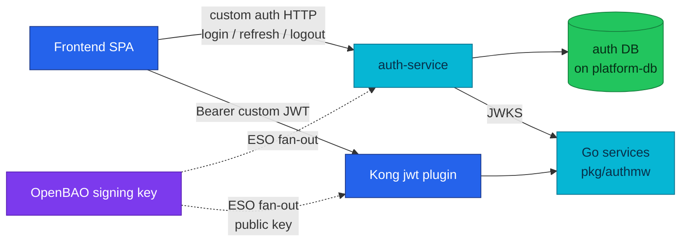
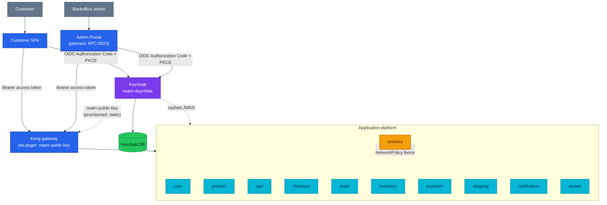

# RFC-0022 Adopt Keycloak as the platform identity provider and retire auth-service

| Status | Scope | Research | Created | Last updated |
|--------|-------|----------|---------|--------------|
| Accepted | platform-wide | [./research.md](./research.md) — gate passed with the RFC-0024 review, 2026-08-11 | 2026-08-09 | 2026-08-11 |

> **⚠ Implementation absorbed into [RFC-0024](../RFC-0024/README.md)** (owner
> decision 2026-08-10): this RFC remains the platform's **identity design record** —
> realm, clients, claims, TTLs, string-`user_id` migration, bootstrap handover,
> auth-service retirement — but it does **not** run as a standalone implementation.
> Its rollout executes as phases P1/P3/P5 of RFC-0024's combined greenfield cutover,
> where the new edge trusts the Keycloak realm from first deployment.

> **Every decision is a tradeoff.** This RFC removes a custom authentication service
> and delegates credential, session, token, role, and signing-key management to
> Keycloak. We give up direct ownership of the authentication implementation and add
> a stateful platform dependency (a JVM identity server plus its database). In
> exchange, the platform stops maintaining its own identity provider and gains
> standard OIDC browser flows, mature session management, realm keys, roles, and an
> admin console. The costs are made explicit in **Design Details → Drawbacks** and
> **Rollout & rollback**.

## Prerequisites

- [research.md](./research.md) merged; [research review gate](./research.md#research-review-gate) ticked
- Context7 audit complete (see research [audit log](./research.md#context7-audit-log))
- Owner approved **ready for RFC**
- Mechanism deep-dive lives in [./research.md](./research.md) — this file decides, it does not re-teach
- When Status → **`Accepted`**: expected ADRs under [`docs/proposals/adr/`](../../adr/) are listed in
  [Resulting decisions](#resulting-decisions); expected [`docs/api/`](../../../api/README.md) files to
  touch: `auth.md` (retire), `user.md`, `api.md`, `cart.md`, `checkout.md`, `order.md`, `review.md`,
  `notification.md`, `microservices.md`, plus a new `docs/platform/keycloak.md`

## Summary

Replace the custom `auth-service` introduced by [RFC-0009](../RFC-0009/README.md) with
**Keycloak** as the platform identity provider: one realm (`duynhlab`), two public OIDC
browser clients (`customer-spa`, `admin-portal`) on Authorization Code + PKCE S256, two
initial realm roles (`customer`, `backoffice_admin`), and the OIDC `sub` claim as the
canonical application `user_id` (persisted as a string under a single-issuer
constraint). The custom issuer — login/register/refresh/logout endpoints, refresh-token
families, RS256 signer, JWKS endpoint, the `auth` database, and the OpenBAO signing-key
distribution — retires completely. Everything RFC-0009 got right about verification is
kept: signed access tokens, local service-side verification with cached JWKS, Kong as a
coarse edge filter, services as the authoritative verifier, and no identity-provider
call on the hot path. This is a **greenfield rebuild** (local databases re-seeded from
zero); no production data migration or compatibility window exists or is needed.

This RFC **supersedes the custom-issuer and custom-session portions of RFC-0009**
(Phases 2 and 5). RFC-0009's edge-filter, local-verification, shared-rate-limit, and
resilience decisions — including [ADR-006](../../adr/ADR-006-rs256-jwt-kong-edge-auth/) —
remain in force.

## Motivation

RFC-0009 moved the platform to signed RS256 JWTs, cached JWKS verification, Kong edge
filtering, and service-authoritative validation — and in doing so made this project the
operator of its own identity provider: credential storage and hashing, registration and
login behavior, refresh-token family rotation and reuse detection, signing-key custody
and a three-system rotation drill, JWT claim design, JWKS publication, and every future
identity feature (roles, MFA, account recovery) as custom security-critical Go code.
Those concerns were worth building once to learn; they are not the domain a commerce
platform should keep maintaining. The full problem framing and the audited as-built
inventory are in [./research.md](./research.md#problem-statement).

The timing is deliberately opportunistic: no stable customer frontend contract must be
preserved, the Backoffice portal ([RFC-0023](../RFC-0023/)) is not built yet, no production identities need
migration, and local-stack already rebuilds and seeds the complete environment.

### Goals

- Make Keycloak the only platform issuer for human access tokens.
- Remove `auth-service`, its `auth` database, and its Kong routes completely.
- Use standard OIDC browser redirects; no password ever reaches an application API.
- Support a future Customer SPA and a separate Backoffice portal ([RFC-0023](../RFC-0023/)) as distinct public
  clients in one realm.
- Keep local, offline token verification in Kong and in the Go services.
- Keep services authoritative for issuer, audience, expiry, subject, role, ownership,
  and business-rule checks.
- Use one application identifier: `user_id = token.sub` (string).
- Keep profile data in `user-service`; Keycloak owns credentials and identity claims.
- Preserve the internal gRPC topology: NetworkPolicy fencing, explicit `user_id` in
  RPC payloads, no end-user tokens east-west or in Temporal history.
- Deterministic realm/client/role/demo-user seeding; a clean rebuild proves the flow.

### Non-Goals

- Backoffice pages, navigation, business APIs, or operator workflows ([RFC-0023](../RFC-0023/)).
- An `admin-service`, identity facade, or BFF in front of Keycloak.
- OAuth Client Credentials for normal internal gRPC calls.
- East-west mTLS or a service mesh ([RFC-0020](../RFC-0020/) / [RFC-0006](../RFC-0006/) territory).
- Multiple realms/issuers, social login, LDAP, tenant identity, or account linking.
- A separate `customer_id` or identity-link table (single issuer; revisit by ADR if
  multi-issuer ever lands).
- Migrating existing users, passwords, refresh tokens, or application data.
- Preserving the custom `/auth/v1/public/...` API contract.
- Fine-grained authorization policy in Keycloak (services keep domain authorization).
- A production HA Keycloak topology in the first implementation.

## Proposal

### Before → after

| Concern | Before (deployed) | After this RFC |
|---------|-------------------|----------------|
| Identity issuer | Custom `auth-service` | Keycloak realm `duynhlab` |
| Credentials | `users` table + bcrypt | Keycloak user store |
| Browser login/registration | `POST /auth/v1/public/auth/{login,register}` | OIDC redirect to Keycloak (registration when enabled) |
| Access token | Custom RS256 JWT, 1 h | Keycloak-signed OIDC access token (TTL tuned at implementation) |
| Refresh/session | Custom opaque rotating family, reuse ⇒ family revoked | Keycloak session + refresh token, **rotation/reuse-revocation explicitly enabled** to keep today's guarantee |
| Logout | Custom family-revocation endpoint | OIDC/Keycloak logout |
| JWKS / signing keys | Custom JWKS endpoint; key in OpenBAO, ESO fan-out to auth + Kong | Keycloak realm key management + realm JWKS |
| Service verification | `pkg/authmw` against auth JWKS | Same `pkg/authmw`, retargeted to the realm issuer/JWKS (+ audience/roles adaptation) |
| Edge verification | Kong OSS `jwt` plugin, static auth public key | Same plugin, static **realm** public key (Kong OSS cannot fetch JWKS; `openid-connect` plugin is Enterprise-only) |
| User identifier | Numeric `users.id` (integer fleet-wide) | Opaque Keycloak `sub` string |
| Profile | `user-service` | `user-service` (unchanged owner) |
| Internal gRPC | NetworkPolicy; explicit `user_id`; no user JWT | Unchanged |

### Ownership after the refactor

| Component | Owns | Does not own |
|-----------|------|--------------|
| Keycloak | Credentials, password policy, login/registration UI, sessions, access/refresh tokens, logout, realm keys, roles, OIDC endpoints | Carts, orders, payments, profiles, business authorization |
| Kong | Routing, rate limiting, coarse token rejection at the edge | Final identity/ownership/business authorization |
| Go services | Full token validation, owner scoping, role gates, domain invariants | Passwords, login screens, refresh-token storage, signing keys |
| `user-service` | Name, phone, address, application profile fields | Passwords, username uniqueness, sessions, token issuance |
| Backoffice ([RFC-0023](../RFC-0023/)) | Protected business workflows and UI | Keycloak realm administration |

### Realm, clients, and roles

```text
Realm:  duynhlab
Issuer: https://<identity-host>/realms/duynhlab   (immutable per environment)
```

| Client | Type | Flow | Purpose |
|--------|------|------|---------|
| `customer-spa` | Public OIDC client | Authorization Code + PKCE S256 | Customer browser application |
| `admin-portal` | Public OIDC client | Authorization Code + PKCE S256 | Backoffice browser application ([RFC-0023](../RFC-0023/)) |

Browser clients have no secret; Direct Access Grants (password grant) is disabled;
redirect URIs and web origins are exact per environment — wildcards are forbidden in
production.

| Role | Meaning |
|------|---------|
| `customer` | May access private customer APIs; still subject to owner scoping by `sub` |
| `backoffice_admin` | May access `protected` business APIs defined by [RFC-0023](../RFC-0023/) |

The role model intentionally starts minimal; [RFC-0023](../RFC-0023/) may later split
`backoffice_admin`. `protected` is the existing-but-unused route class in
[`docs/api/api.md`](../../../api/api.md) — this RFC gives it its first real user.

### Token and application-principal contract

Services trust these claims only after full local verification:

| Claim | Use |
|-------|-----|
| `iss` | Must equal the configured realm issuer exactly |
| `sub` | Canonical opaque application `user_id` (non-empty required) |
| `aud` | Must contain the platform API audience (added via an audience mapper; may be an array) |
| `exp`, `nbf`, `iat` | Lifetime checks |
| `preferred_username`, `email` | Display/identity claims — never database ownership keys |
| roles | Keycloak nests roles (`realm_access.roles` / `resource_access.<client>.roles`); the shared verifier normalizes the selected roles into a stable `[]string` so handlers never parse raw token maps |

Customer handlers use the subject as `user_id`; protected handlers use it as the
acting identity and additionally require the role gate.

### Application user identifier

`user_id = token.sub`, persisted as a string (`VARCHAR(255)`). The identity model is
logically `(iss, sub)`; storage collapses to `sub` because exactly one issuer is
accepted and every service validates it before trusting the value. No separate
`customer_id` is introduced; a future ADR revisits this only if multi-issuer, account
linking, or tenancy ever arrive. The full blast radius of the integer→string change
(5 `INTEGER` columns, 2 numeric protos, the shared idempotency module, 9 numeric-parse
call sites, Temporal inputs) is audited in
[research → Identity data](./research.md#identity-data--the-real-blast-radius).

### Alternatives

Audited in [research → Alternatives](./research.md#alternatives): keep the custom
`auth-service` (rejected — the platform keeps operating an IdP and the RBAC/MFA road
stays custom); a Go identity facade preserving the old API (rejected — recreates
auth-service with an extra hop); per-request token introspection (rejected — puts the
IdP back on the hot path RFC-0009 cleared); Client Credentials for east-west gRPC
(rejected — workload trust stays NetworkPolicy now, mTLS later per RFC-0020); lighter
IdPs (Ory/Zitadel/Authentik — more assembly or younger ecosystems for the same
migration cost); email/username as `user_id` (rejected — mutable, reusable).

## Architecture & Diagrams

### Current state (deployed)



### Target state (planned)



End-user bearer tokens are not forwarded through the gRPC call graph or stored in
Temporal workflow history; business user context is the explicit string `user_id` in
the RPC/command, exactly as today.

## Design Details

### Keycloak deployment boundary

Keycloak is a platform component, not a Go domain service:

```text
identity namespace / compose group
├── keycloak                (quay.io/keycloak/keycloak 26.5.x, pinned by digest)
├── keycloak database       (database `keycloak` + role on CNPG platform-db, declarative CRs)
├── realm import bootstrap  (deterministic duynhlab-realm.json, fixed demo-user UUIDs)
└── identity secrets        (OpenBAO + ESO, like every platform secret)
```

Keycloak connects **direct to `platform-db-rw`**, not through the PgDog pooler — its
Agroal pool relies on long-lived connections and server-side prepared statements,
which a transaction-mode pooler breaks. Local-stack adds a `keycloak` database to the
shared Postgres container.

It must satisfy the same admission bar as everything else (Kyverno: pinned image,
resource requests/limits, probes, PSS) and slots into the Flux chain where the
identity workload sits today (databases → identity → apps).

### Retiring the `auth` database is not a plain drop

As-built, the `auth` role and `platform-db-secret` **double as the CNPG
`bootstrap.initdb` credentials** for the whole `platform-db` cluster
([`kubernetes/infra/configs/databases/clusters/platform-db/services/auth.yaml`](../../../../kubernetes/infra/configs/databases/clusters/platform-db/services/auth.yaml)).
Before the `auth` database and role retire, the bootstrap contract must move to a new
owner — a required, explicit step in the implementation plan. **Decision:** re-point
`bootstrap.initdb` to a neutral `platform_owner` role + secret owned by the databases
layer, coupled to no service. Bootstrap never re-runs on a live cluster, so the change
is exercised only by a disaster-recovery rebuild — validate with a Kind rebuild and
update the RFC-0007 DR runbook.

### Hostnames and issuer discipline

```text
id.<domain>       Keycloak          app.<domain>    Customer SPA
api.<domain>      Kong/APIs         admin.<domain>  Backoffice portal (future)
```

The issuer inside tokens must equal the URL clients and verifiers use. Keycloak's
hostname options (`--hostname <public-url>`, strict in production,
`--hostname-backchannel-dynamic true` for internal callers) prevent the classic
internal-vs-external issuer mismatch. Production issuer:
`https://id.duynh.me/realms/duynhlab`; local-stack runs Keycloak on
`http://localhost:8081` with the matching issuer. Redirect and post-logout URIs are
exact in production; `http://localhost:3001/*` is allowed in development only.

### Client security

Public clients only; Authorization Code + PKCE S256 required; Direct Access Grants
disabled; exact redirect/post-logout URIs and web origins per environment; no
client secrets in browser code; tokens managed by the OIDC client integration (the
frontend's custom `localStorage` + silent-refresh + cross-tab-lock layer is deleted,
not ported). Self-registration stays **off** in the first release (deterministic demo
users only); forgot-password and email verification are a planned follow-up gated on
an email stack (Mailpit locally, real SMTP later) and land together with registration.

### Token lifetimes and refresh semantics (explicit, not inherited)

Keycloak's defaults differ from today's deployed behavior and are configured
deliberately rather than accepted silently:

| Setting | Today | Keycloak default | Decision |
|---------|-------|------------------|----------|
| Access-token TTL | 1 h | 5 min | **15 min**, both clients (silent OIDC refresh removes the UX cost that justified 1 h) |
| Refresh reuse | reuse ⇒ whole family revoked | **rotation/reuse-revocation off** | enable `Revoke Refresh Token` + `refreshTokenMaxReuse: 0` — keeps the guarantee; OAuth 2.1 direction for public clients |
| Session bounds | none (stateless refresh family) | SSO idle 30 min / max 10 h | `customer-spa`: SSO idle **14 d** / max **30 d** with Remember Me (matches today's 30 d refresh); `admin-portal`: client-session idle **30 min** / max **10 h** (stricter backoffice posture) |

### Kong and service verification

The RFC-0009 defense-in-depth shape is unchanged: Kong = coarse edge rejection
(signature + time claims), services = authoritative verifier and authorizer. The Kong
OSS `jwt` plugin keeps a **static** realm public key (it cannot fetch JWKS, and the
`openid-connect` plugin is Enterprise-only). Because the edge credential is looked up
by `iss`, only one key per issuer is active at the edge at a time. **Rotation runbook
(decided):** add the new realm key at higher priority (the old key stays enabled for
verification) and update Kong's declarative credential in the same change; old tokens
may be rejected at the edge for at most one access-token lifetime (15 min), which the
SPA's OIDC client absorbs with a silent refresh. Services refresh the realm JWKS
automatically via `pkg/authmw`.

**Distribution note (2026-08-10):** Kong OSS itself became a frozen 3.9 maintenance
line in 2025 (no OSS 3.10+ exists; the unlicensed Enterprise image is unusable for
this platform's KIC DB-less flow). **Later the same day the owner activated the exit
trigger proactively: the platform edge migrates to Envoy Gateway per
[RFC-0024](../RFC-0024/README.md).** Consequence for this section: the static realm
public key at the edge and the two-step rotation runbook described above are **not
built** — the RFC-0024 edge verifies via SecurityPolicy `remoteJWKS` (automatic key
refresh), so only the realm-side key procedure remains. The Kong-specific analysis is
kept above as the decision record.

`pkg/authmw` evolves from auth-service-defaults to a generic OIDC verifier
configuration:

```text
OIDC_ISSUER                     required, exact match
OIDC_AUDIENCE                   required; must handle array `aud`
OIDC_JWKS_URL                   optional override (default: derived from issuer)
OIDC_REQUIRED_ALGORITHM         RS256 initially
OIDC_JWKS_CACHE_TTL             bounded cache + single-flight unknown-kid refresh
```

plus role normalization and a non-empty `sub` requirement. Roles are read from
Keycloak's standard `realm_access.roles` claim via a configurable claim path — no
custom flattening mapper to maintain in the realm. Array `aud` needs no code change:
jwt/v5's audience check is a containment test (verified at source, v5.3.1); the
platform audience `duynhlab-platform` is added by an `oidc-audience-mapper` on a
shared `platform-api` client scope assigned to both clients. Behavior stays: fail
closed, sanitized errors, never introspect per request.

### Failure behavior

| Failure | Expected behavior |
|---------|-------------------|
| Keycloak down at login/refresh | New logins/refreshes fail; issued tokens verify against cached keys until expiry |
| Unknown `kid`, Keycloak down | Bounded single-flight refresh attempt, then fail closed (401/503 per authmw contract) |
| Kong key stale after rotation | Edge may reject new tokens; update the declarative credential before finishing rotation |
| Missing/wrong audience | Service 401 even if Kong accepted the signature |
| Missing `customer` role on customer route / `backoffice_admin` on protected route | 403 |
| Empty `sub` | 401 |
| Missing profile row | Private profile returns claim-based fallback; `PUT` upserts (as-built behavior, kept) |

### Components removed

```text
auth-service runtime (deployment, compose service, Kong routes, seeds, NetworkPolicy)
auth database + role on platform-db (after the bootstrap.initdb handover)
custom login/register/refresh/logout endpoints and the /auth/v1/public prefix
custom RS256 signer + refresh-token family logic + custom JWKS endpoint
JWT_PRIVATE_KEY_PEM and the auth-jwt-signing / auth-issuer-jwt ExternalSecrets
frontend custom token storage + silent-refresh + cross-tab lock layer
the orphaned POST /user/v1/internal/users provisioning route (JIT upsert stays)
docs/api/auth.md as a live contract (archived, not deleted from history)
```

The repository may be archived as learning material; it is no longer built, deployed,
routed, seeded, or documented as live.

### Greenfield rebuild contract

This is a coordinated breaking change, not a zero-downtime migration. Acceptance
starts from a clean rebuild (`docker compose down -v && build && up`, or the Make
equivalents), which must: start databases and Keycloak → import the realm (clients,
roles, demo users with **fixed declared UUID subjects** — the import preserves an
explicit `id`) → initialize service schemas with string `user_id`
columns → seed domain data using the Keycloak subjects → start Kong and services →
pass authentication and ownership smoke tests. There is no dual issuer, dual column,
backfill job, or compatibility fallback.

### Drawbacks (the cost side, stated plainly)

- A stateful JVM platform component with its own database, memory footprint, upgrade
  cadence, and CVE stream joins the critical path for logins.
- Session/token semantics change (server-side sessions, different TTL defaults) and
  must be tuned; today's behavior is not the default.
- The fleet-wide `user_id` type change touches 5 schemas, 2 protos, a shared module,
  and every seed — cheap only because of the greenfield rebuild window.
- Kong edge rotation keeps a manual step (static key, one credential per issuer).
- Identity debugging moves from "our Go code" to "Keycloak configuration" — a skill
  and runbook shift.

## Security considerations

- Keycloak is internet-facing and uses TLS outside local development; the admin
  console is restricted to identity administrators and is not the Backoffice.
- Bootstrap admin credentials and DB credentials live in OpenBAO via ESO; dev
  passwords are local-only realm-import placeholders, never committed values.
- Services validate exact issuer and audience, allowlist algorithms, require
  non-empty `sub`, and verify even when Kong already accepted the token.
- Unknown `kid` triggers a bounded, single-flight JWKS refresh — no fetch storms.
- Public routes never accept identity from a merely-present bearer token; private
  routes scope rows by verified `sub`; protected routes add the role gate plus
  domain authorization.
- Passwords, codes, tokens, cookies, and client secrets never appear in logs or
  telemetry; end-user tokens never enter Temporal history.
- Admin identities are never publicly self-registered.
- Kyverno/PSS: the Keycloak workload meets the same admission bar as app namespaces;
  any exception follows the PolicyException + catalog process.

## Observability & SLO impact

Required signals (catalogued at implementation, per the alert-catalog process):
Keycloak login success/failure rate, token-endpoint latency/errors, readiness,
restart/saturation; realm key events; Kong + service auth rejection counts by bounded
reason; JWKS refresh success/failure and unknown-`kid` count; token-validation
latency. Do not use `sub`, username, email, tokens, or session IDs as metric labels
(existing observability data policy). Availability model: Keycloak is required for
new logins and refreshes only — already-issued tokens keep verifying locally, so it
does not join the hot path of authenticated requests. Alert catalog and a Keycloak
runbook ship with the implementation (operability is part of the change).

## Rollout & rollback

Rollout is a coordinated breaking change over the clean-rebuild contract:

1. Add the Keycloak runtime + deterministic realm bootstrap (local-stack first).
2. Evolve `pkg/authmw` to the generic OIDC verifier (audience array, role
   normalization, required `sub`); single coordinated version bump (all consumers
   are on one pkg version today).
3. Move all domain `user_id` schemas/contracts/seeds to string subjects
   (incl. `pkg/idempotency`, notification/payment protos).
4. Hand over the `platform-db` `bootstrap.initdb` contract; then remove auth
   routes, database, secrets, manifests, and topology edges.
5. Re-point Kong's edge credential at the realm public key; wire `protected` routes.
6. Rebuild from empty volumes; run customer, admin-role, ownership, workflow, and
   restart tests.
7. Update docs/api and platform docs to the as-built target.

Sequencing respects the Flux chain (infra → databases → identity → apps). Detailed
repository tasks belong to the implementation plan, not this RFC.

**Rollback** is source-level: revert the coordinated change set, remove volumes,
rebuild the RFC-0009 topology and seeds. No mixed custom-auth/Keycloak runtime is
supported at any point.

## Testing / verification

- **Keycloak config:** realm imports cleanly on an empty environment; both clients
  are Code+PKCE public clients; non-allowlisted redirect URIs/origins rejected; demo
  users carry correct roles; self-registration (if enabled) cannot mint admin roles;
  logout terminates the session.
- **Token verification:** valid customer/admin tokens reach private/protected routes;
  customer token forbidden on protected; wrong issuer/audience, expired/nbf,
  unsupported alg, missing sub all rejected; unknown `kid` triggers one single-flight
  JWKS refresh; cached-key verification survives a Keycloak outage; services reject a
  token a misconfigured Kong passed.
- **Ownership & schema:** private queries scope by verified `sub`; request payloads
  cannot override `user_id`; cross-user access is impossible; string subjects
  round-trip HTTP → gRPC → DB → Temporal; uniqueness/idempotency constraints hold.
- **Internal calls:** checkout/order pass string `user_id`; no workflow history
  contains tokens; no Client Credentials east-west; NetworkPolicy still fences.
- **Clean rebuild:** one command produces Keycloak + DBs + Kong + services +
  deterministic users; seeds are idempotent; auth-service is not built, routed,
  deployed, health-checked, or documented as live.
- Full [local-stack E2E release audit](../../../../local-stack/docs/e2e-audit.md)
  gates the tags that ship this.

## Resulting decisions

| Decision | ADR | Status |
|----------|-----|--------|
| Adopt Keycloak as the platform identity provider; retire the custom auth-service | [ADR-041](../../adr/ADR-041-keycloak-platform-idp/) | Accepted |
| Use the single-issuer OIDC subject (`sub`) as the application `user_id` (string, fleet-wide) | [ADR-042](../../adr/ADR-042-oidc-sub-as-user-id/) | Accepted |
| Browser identity via OIDC; east-west trust stays workload-level (no Client Credentials) | [ADR-043](../../adr/ADR-043-oidc-browser-workload-trust/) | Accepted |

*(Numbering note 2026-08-11: the reserved 039–040 were consumed by unrelated
decisions — local-stack Temporal and the Tempo chart — so these landed as
041–043 at acceptance.)*

The subject-as-`user_id` decision stays a separate ADR deliberately — it reshapes
every domain schema and outlives the choice of IdP.

## Implementation History

- 2026-08-09 — Research ([./research.md](./research.md)) and provisional RFC created
  from the owner's draft, corrected against a fleet-wide as-built audit (freshly
  pulled service repos + manifests) and a Context7 documentation audit.
- 2026-08-10 — Kong OSS distribution risk recorded (OSS frozen at the 3.9 LTS line;
  direction: pin `kong:3.9.3`, release-radar watch, explicit exit trigger, gateway-
  strategy backlog row; Enterprise license evaluated and rejected — see
  [research → Gateway distribution risk](./research.md#gateway-distribution-risk-kong-oss--added-2026-08-10)).
  Backoffice references updated to [RFC-0023](../RFC-0023/), which now exists.
- 2026-08-10 — **Exit trigger activated by the owner**: the edge migrates to Envoy
  Gateway per [RFC-0024](../RFC-0024/README.md). The static-key ExternalSecret and
  the Kong rotation runbook step (Open questions #9) are superseded before ever
  being built; the token design is unchanged.
- 2026-08-10 — **Implementation absorbed into RFC-0024** (owner decision): no
  standalone RFC-0022 rollout — Keycloak deployment, the fleet identity cutover, and
  auth-service retirement run as RFC-0024 phases P1/P3/P5. This document stays the
  identity design record; its proposed ADRs (039–041) flip Accepted with RFC-0024's
  review.
- 2026-08-11 — **Status → Accepted with the RFC-0024 review.** Identity ADRs
  created at Accepted as [ADR-041](../../adr/ADR-041-keycloak-platform-idp/)/[042](../../adr/ADR-042-oidc-sub-as-user-id/)/[043](../../adr/ADR-043-oidc-browser-workload-trust/)
  (renumbered — 039/040 were consumed by unrelated decisions). **As-built
  correction:** the `platform_owner` bootstrap-handover step (Open questions #5)
  is already moot — `platform-db`'s `bootstrap.initdb` rests on
  `user`/`platform-db-user-secret` today (`clusters/platform-db/instance.yaml`),
  not on `auth`; the stale claim lives only in `services/auth.yaml`'s header
  comment. Retiring the `auth` triplet needs comment hygiene plus a Kind
  DR-rebuild validation, not a new neutral role.
- 2026-08-09 — All 13 open questions resolved with owner-approved directions
  ([research → Open questions](./research.md#open-questions)): 15-min access tokens
  with per-client session bounds, refresh rotation/reuse-revocation on, `platform-api`
  audience scope, `realm_access.roles` read directly, `platform_owner` bootstrap
  handover, Keycloak DB direct on `platform-db`, two-step Kong rotation runbook,
  fixed-UUID demo subjects, registration/email flows deferred to the email stack,
  JIT profile provisioning kept and the orphaned internal route retired.

When Status → implemented, confirm:
- [ ] Linked ADR(s) Adoption → Complete (or Partial with note)
- [ ] docs/api/ synced — `auth.md` retired/archived; `user.md`, `api.md`, per-service
      contracts and rollup updated; Design records links added
- [ ] Runbooks updated (Keycloak ops, key-rotation incl. the Kong edge step)
- [ ] Resulting decisions table reflects final ADR status

## Related

- [./research.md](./research.md) — plain-language research and Context7 audit trail
- [RFC-0024 — Replatform edge and identity](../RFC-0024/README.md) — **executes this design record** (absorbed 2026-08-10); supersedes the Kong static-key/rotation portions here
- [RFC-0023 — Basic Backoffice portal + first protected APIs](../RFC-0023/README.md) — hard-depends on this RFC's `admin-portal` client and `backoffice_admin` role
- [RFC-0009 — Production-grade API gateway: signed JWT + Kong edge auth](../RFC-0009/README.md) — superseded in part by this RFC
- [ADR-006 — RS256 JWT + Kong edge auth](../../adr/ADR-006-rs256-jwt-kong-edge-auth/) — preserved
- [RFC-0020 — Internal TLS everywhere](../RFC-0020/) — owns east-west transport trust
- [`docs/api/auth.md`](../../../api/auth.md) — current contract, to be retired
- [`docs/api/user.md`](../../../api/user.md) · [`docs/api/api.md`](../../../api/api.md)
- [`docs/platform/kong-gateway.md`](../../../platform/kong-gateway.md) · [`docs/secrets/openbao.md`](../../../secrets/openbao.md)

---
_Last updated: 2026-08-11_
