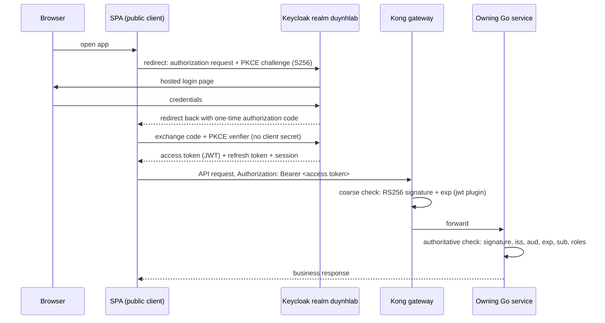
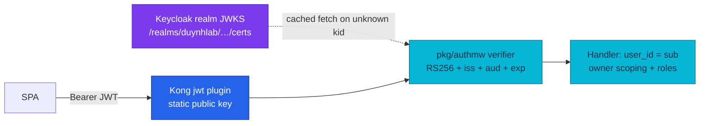
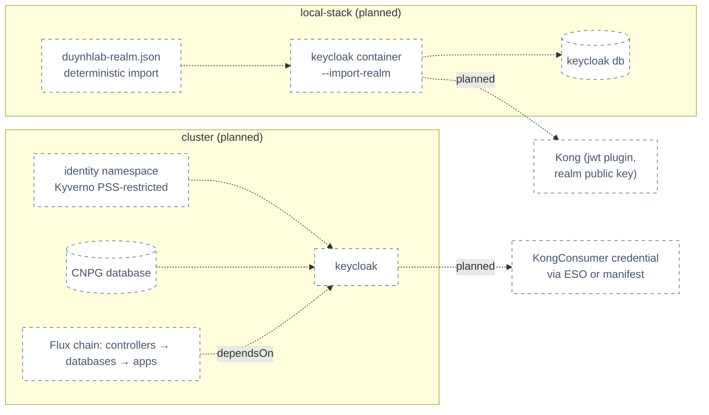

# RFC-0022 — Research: Keycloak as the platform identity provider

| | |
|---|---|
| **RFC** | RFC-0022 |
| **Status** | researching |
| **Scope** | platform-wide |
| **Created** | 2026-08-09 |
| **Last updated** | 2026-08-10 |

> **Plain-language research.** This file is the audit trail for replacing the custom
> `auth-service` (built and hardened by [RFC-0009](../RFC-0009/README.md)) with
> **Keycloak**, an off-the-shelf OpenID Connect identity provider. It frames the
> problem, explains how Keycloak's pieces map onto what the platform already runs,
> records what a fleet-wide code audit proved about the as-built system, and holds
> the open questions for the research gate. The target design (realm, clients,
> rollout) lands in `README.md` after the gate.
>
> **Supersession notice.** The RFC built on this research proposes to supersede the
> **custom-issuer and custom-session portions** of RFC-0009 (its Phases 2 and 5:
> token minting, refresh-token families, JWKS publication, signing-key ownership).
> RFC-0009's edge-filter, local-verification, shared-rate-limit, and resilience
> decisions — including [ADR-006](../../adr/ADR-006-rs256-jwt-kong-edge-auth/) —
> remain valid and are deliberately preserved.

---

## Table of contents

1. [Problem statement](#problem-statement)
2. [Reading path](#reading-path)
3. [What Keycloak is](#what-keycloak-is)
4. [Core components](#core-components)
5. [Core mechanism](#core-mechanism)
6. [Glossary](#glossary)
7. [Worked examples](#worked-examples)
8. [vs platform as-built](#vs-platform-as-built)
9. [Integration paths](#integration-paths)
10. [Alternatives](#alternatives)
11. [Open questions](#open-questions)
12. [FAQ](#faq)
13. [References](#references)
14. [Context7 audit log](#context7-audit-log)
15. [Research review gate](#research-review-gate)

---

## Problem statement

### Real-world trigger

| | |
|---|---|
| **Situation** | RFC-0009 shipped a production-grade token architecture — but it made this project the **operator of its own identity provider**: credential storage, bcrypt policy, refresh-token family rotation and reuse detection, RS256 key custody and rotation, JWKS publication, and (future) MFA, account recovery, and role administration are all custom Go code we maintain. |
| **Who feels it** | Platform (key rotation is a manual OpenBAO + Kong + restart procedure); security (every auth bug is ours); product (the RBAC/ABAC backlog row and the Backoffice portal — now designed as [RFC-0023](../RFC-0023/) — both stall on identity features `auth-service` does not have). |
| **Why now** | The timing window is uniquely cheap: no stable frontend contract to preserve, the Backoffice portal ([RFC-0023](../RFC-0023/)) is not built yet, no production identities to migrate, and local-stack already rebuilds the whole environment from zero. Every quarter of delay adds more schemas, seeds, and tests keyed to the custom issuer. |
| **If we do nothing** | The RBAC row ([RFC-0009 O1](../RFC-0009/README.md)) forces us to design a custom role model; MFA/account-recovery/social login each become bespoke security-critical projects; the `roles: []` placeholder stays dead weight in every token; key rotation stays a three-system manual drill ([`docs/secrets/openbao.md` § JWT signing key](../../../secrets/openbao.md#jwt-signing-key-auth--kong)). |

> **In plain terms:** we built a small bank vault to learn how vaults work — now we
> keep guarding it every day. The commerce domain is carts and orders, not password
> hashing. An industry-standard identity server can own logins while our services
> keep owning authorization and business rules.

**Example triggers:**

- **Design review:** the Backoffice portal ([RFC-0023](../RFC-0023/)) needs an `admin`
  login with roles. Without this RFC that means designing claim population, admin
  credential storage, and an admin UI from scratch inside `auth-service`.
- **Toil / ops:** rotating the signing key touches OpenBAO, two ExternalSecrets, a
  Kong consumer credential, and an auth-service restart — and the edge half is easy
  to forget because services auto-refresh JWKS but Kong does not.
- **On-call thought experiment:** a refresh-token reuse bug in our custom family
  logic would be a credential-compromise incident that no upstream project patches
  for us.

### What homelab practice proves

- Can Keycloak run under the platform's admission rules (Kyverno PSS-restricted app
  namespaces, pinned images, probes, resource limits) and the Flux `dependsOn` chain?
- Can a **deterministic realm import** (clients, roles, demo users with stable
  subjects) make `docker compose down -v && up` produce a working login every time —
  the property local-stack relies on today with `auth-seed`?
- Can `pkg/authmw` verify Keycloak tokens **unchanged in shape** (issuer/audience/JWKS
  env swap), and what exactly breaks: the `aud` claim shape, the nested role claims,
  and the string `sub` hitting integer `user_id` columns?
- Does the Kong OSS `jwt` plugin constraint (static public key, no JWKS discovery)
  still allow a sane key-rotation story when the realm owns the keys?

---

## Reading path

1. [What Keycloak is](#what-keycloak-is) → [Core mechanism](#core-mechanism)
2. [vs platform as-built](#vs-platform-as-built) → [Alternatives](#alternatives)
3. [FAQ](#faq) → [Research review gate](#research-review-gate)

---

## What Keycloak is

Keycloak is an open-source identity and access management server (a CNCF-adjacent,
Red Hat-stewarded project; current release line 26.x). It implements OpenID Connect,
OAuth 2.0, and SAML, and ships the parts RFC-0009 taught us to build by hand: a user
store with password policy, hosted login/registration pages, session management,
token issuance and rotation, realm signing keys with a JWKS endpoint, roles, and an
admin console plus admin REST API.

> **In plain terms:** Keycloak is a dedicated "login department" you run as a
> container. Applications redirect users to it for sign-in and get back signed
> tokens; they never see passwords. Our Go services keep doing exactly what they do
> today — verify a signed token locally and enforce business rules — they just trust
> a different issuer.

---

## Core components

| Component | Role |
|-----------|------|
| **Realm** | Isolated identity domain (users, clients, roles, keys, sessions). The plan is one realm, `duynhlab`; its issuer URL becomes the platform's `iss`. |
| **Client** | An application registered in the realm. Browser SPAs are **public clients** (no secret) using Authorization Code + PKCE. Planned: `customer-spa`, `admin-portal`. |
| **Realm / client roles** | Named grants attached to users. Realm roles appear in the `realm_access.roles` claim, client roles under `resource_access.<client>.roles`. Planned: `customer`, `backoffice_admin`. |
| **Realm keys** | Rotating signing keys (RSA et al.) managed per realm; published at `/realms/<realm>/protocol/openid-connect/certs` (JWKS). Replaces the OpenBAO-held `JWT_PRIVATE_KEY_PEM`. |
| **Protocol mappers** | Per-client claim shapers — e.g. the audience mapper that puts `duynhlab-platform` into `aud`, or a mapper flattening roles into a custom claim. |
| **Keycloak database** | Keycloak's own PostgreSQL schema (users, credentials, sessions, config). Replaces the `auth` database. |
| **Admin console / admin REST API** | Identity administration (create roles, reset passwords, revoke sessions). Not a commerce Backoffice. |

---

## Core mechanism

### Browser login — Authorization Code flow with PKCE

Mechanism — how a browser obtains a token without any password touching our services:



> **In plain terms:** the SPA never posts a password to our API. It bounces the user
> to Keycloak's login page, gets a short-lived one-time code, and swaps that code for
> tokens over a direct back-channel call. PKCE pins the exchange to the browser that
> started it, so a stolen code is useless. From Kong onward, nothing changes
> architecturally versus today: bearer token in, local verification at the service.

### Token verification — same shape as today



> **In plain terms:** verification stays offline and local. Services keep a cached
> copy of the realm's public keys and check every token themselves; Keycloak is only
> called when a token arrives signed by a key the cache has never seen. Keycloak
> being down does not break already-issued tokens.

### Key rotation — realm-managed instead of a three-system drill

In Keycloak, rotation is: create a new realm key with **higher priority** → new
tokens are signed with it while the old key stays enabled ("passive") for
verification → retire the old key after the last old token expires. The JWKS
endpoint serves all enabled keys with their `kid`s, so `pkg/authmw` picks up the new
key automatically. The one exception is the Kong OSS `jwt` plugin, which holds a
static copy of the public key (see [vs platform as-built](#vs-platform-as-built)).

---

## Glossary

| Term | In plain English |
|------|------------------|
| OIDC (OpenID Connect) | A standard login protocol on top of OAuth 2.0 — defines how apps redirect to an identity provider and what the returned tokens mean. |
| Authorization Code + PKCE | The browser-safe OIDC flow: a one-time code is exchanged for tokens, cryptographically pinned to the requesting app instance (no client secret needed). |
| Public client | An app that cannot keep a secret (SPA in a browser). Gets no client secret; PKCE + exact redirect URIs are its protections. |
| Realm | One self-contained identity universe inside Keycloak (users, keys, clients, roles). |
| `sub` | The token's subject — Keycloak's permanent, opaque user ID (a UUID string). Candidate replacement for the numeric `user_id`. |
| `aud` | Who the token is for. Services must check it so a token minted for another API can't be replayed here. May be a JSON string **or array**. |
| JWKS | The published set of public keys (JSON Web Key Set) verifiers use to check token signatures. |
| Protocol mapper | Keycloak per-client config that adds/reshapes claims in issued tokens. |
| Realm import | Starting Keycloak with a JSON file that declaratively creates the realm, clients, roles, and users — the seed mechanism. |

---

## Worked examples

> **Not deployed** — syntax and mechanism only; homelab does not run Keycloak yet.

**Claim contract, today vs candidate** (today's claims from
[`auth-service/internal/core/jwt/signer.go:112-135`](https://github.com/duynhlab/auth-service)
as documented in [`docs/api/auth.md`](../../../api/auth.md)):

| Claim | Today (`auth-service`) | Keycloak (candidate) |
|-------|------------------------|----------------------|
| `iss` | `https://gateway.duynh.me` (env `JWT_ISSUER`) | `https://<identity-host>/realms/duynhlab` — fixed by hostname config |
| `sub` | stringified integer `users.id` (`"1"`) | opaque UUID string |
| `aud` | single string `duynhlab-platform` | `account` by default — needs an **audience mapper** to add `duynhlab-platform`; may serialize as an array |
| `roles` | hardcoded `[]` (never read) | realm roles in `realm_access.roles`, client roles in `resource_access.<client>.roles` |
| `username` / `email` | flat custom claims | `preferred_username` / `email` (standard OIDC claims) |
| `exp` / TTL | 1 h (`JWT_ACCESS_TTL`) | realm default **5 min** (`accessTokenLifespan: 300`) — must be tuned deliberately |

**Deterministic realm import (mechanism sketch):** start the container with
`--import-realm` and a `duynhlab-realm.json` in `data/import/`. Import runs only when
the realm does not exist yet (safe for `down -v && up`, no destructive re-import),
and `keycloak.import.replace-placeholders=true` lets the JSON reference environment
variables so dev passwords stay out of the file:

```json
{
  "realm": "duynhlab",
  "clients": [
    { "clientId": "customer-spa", "publicClient": true,
      "standardFlowEnabled": true, "directAccessGrantsEnabled": false,
      "attributes": { "pkce.code.challenge.method": "S256" },
      "redirectUris": ["http://localhost:3001/*"] }
  ],
  "roles": { "realm": [ { "name": "customer" }, { "name": "backoffice_admin" } ] },
  "users": [
    { "id": "10000000-0000-4000-8000-000000000001",
      "username": "alice", "email": "alice@example.com", "enabled": true,
      "credentials": [ { "type": "password", "value": "${ALICE_DEV_PASSWORD}" } ],
      "realmRoles": ["customer"] }
  ]
}
```

Imported users keep an explicitly declared `id` (Keycloak only generates one when it
is absent — verified at source), so fixed UUIDs in the import file give the
domain-service seeds stable subjects to reference (Open questions #10).

---

## vs platform as-built

Everything in the "Platform today" column was verified against manifests and the
freshly pulled service repos (2026-08-09). This is the section that turns the draft's
assumptions into audited facts.

### Issuer, tokens, keys

| Aspect | Platform today (deployed) | Keycloak (candidate) |
|--------|---------------------------|----------------------|
| Issuer | Custom `auth-service` 1.4.2, HTTP-only, ns `auth`, domain `identity` ([`kubernetes/apps/services/auth.yaml`](../../../../kubernetes/apps/services/auth.yaml)) | Keycloak realm `duynhlab` (planned) |
| Endpoints | `/auth/v1/public/auth/{login,register,refresh,logout,jwks}` + deprecated flat aliases ([`docs/api/auth.md`](../../../api/auth.md)) | Standard OIDC endpoints under `/realms/duynhlab/protocol/openid-connect/` |
| Access token | RS256, 1 h, claims above; `kid` = hash of public key | RS256 realm key; default 5 min lifespan — decided: **15 min** (see Open questions #1) |
| Refresh token | Opaque 32-byte, SHA-256-hashed at rest, **family rotation with reuse detection**: replay ⇒ whole family deleted (`auth-service/internal/logic/v1/service.go:283-433`) | JWT refresh token tied to the SSO session. **`revokeRefreshToken` defaults to `false`** — rotation/reuse-revocation must be switched on (`Revoke Refresh Token` + `refreshTokenMaxReuse: 0`) to keep today's guarantee |
| Session model | None beyond the refresh family (stateless by design, RFC-0009 Phase 5 dropped `sessions`) | Server-side SSO session (idle 30 min / max 10 h defaults) — a new stateful concept to configure deliberately |
| Signing key custody | OpenBAO `secret/local/auth/jwt-signing`, ESO fan-out to auth (`JWT_PRIVATE_KEY_PEM`) and Kong (consumer credential) ([`kubernetes/infra/configs/secrets/auth-jwt-external-secrets.yaml`](../../../../kubernetes/infra/configs/secrets/auth-jwt-external-secrets.yaml)) | Realm-managed key providers; rotation = add higher-priority key, old stays passive; JWKS serves all enabled keys |
| Rotation procedure | Manual, three systems, documented in [`docs/secrets/openbao.md`](../../../secrets/openbao.md#jwt-signing-key-auth--kong) — JWKS refresh covers services **but not Kong** | Realm console/API for issuer keys; the Kong static-key step **remains** (below) |

### Verification path

| Aspect | Platform today (deployed) | Keycloak (candidate) |
|--------|---------------------------|----------------------|
| Service middleware | [`pkg/authmw`](https://github.com/duynhlab/pkg) v0.36.1 in 7 services — **already issuer-neutral**: `NewVerifier(jwksURL, issuer, audience)`, keyfunc/v3 cached JWKS, RS256 pinned, validates `iss`/`aud`/`exp`, puts `user_id`(=`sub`)/`username`/`email` in context | Same package, retargeted by env (`AUTH_JWKS_URL`, `JWT_ISSUER`, `JWT_AUDIENCE`). Gaps: `aud` may arrive as an **array** (jwt/v5 `WithAudience` handles arrays — verify in a spike); `preferred_username` vs today's `username` claim; **roles are nested**, and authmw reads no roles at all today |
| Roles | `roles: []` hardcoded in the signer, never read by any consumer — there is **no authorization model to port**; Keycloak roles are net-new capability | `realm_access.roles` / `resource_access.<client>.roles`; needs a normalization decision in authmw (flatten to `[]string`) |
| Edge | Kong OSS `jwt` plugin `jwt-edge`: `key_claim_name: iss`, `claims_to_verify: [exp]`, static `rsa_public_key` on `KongConsumer auth-issuer` ([`kubernetes/infra/configs/kong/plugins.yaml`](../../../../kubernetes/infra/configs/kong/plugins.yaml), mirrored in [`local-stack/gateway/kong.yml`](../../../../local-stack/gateway/kong.yml)) | Same plugin, key material becomes the realm public key. Kong OSS `jwt` does **no JWKS discovery**, and the `openid-connect` plugin is **Enterprise-tier only** (verified 2026-08-09) — so the edge keeps a static-copy constraint; because the credential is looked up by `iss`, only **one key per issuer** can be active at the edge at a time, which shapes the rotation runbook. **Note (2026-08-10): Kong OSS itself is now a frozen 3.9 maintenance line — see [Gateway distribution risk](#gateway-distribution-risk-kong-oss--added-2026-08-10)** |
| Route classes | `public`/`private`/`protected`/`internal` ([`docs/api/api.md`](../../../api/api.md)); `protected` is defined but **unused** — reserved for exactly the role-gated routes this work enables | unchanged vocabulary; `backoffice_admin` becomes the first real `protected` gate — the routes themselves are designed in [RFC-0023](../RFC-0023/) |

### Gateway distribution risk (Kong OSS) — added 2026-08-10

The edge design above assumes Kong OSS. In 2025 Kong changed how the OSS edition is
distributed, and the facts were re-verified directly on 2026-08-10:

| Fact | Evidence |
|------|----------|
| **No Kong OSS 3.10+ exists** — no source tags, no images, no packages | `git ls-remote` on Kong/kong shows the newest OSS tags are 3.9.x; [discussion #14405](https://github.com/Kong/kong/discussions/14405) |
| **"Free mode" is gone**: `kong/kong-gateway:3.10+` without a license behaves as an **expired Enterprise license**, and the current changelog makes the Admin API **read-only** without a license | [discussion #14628](https://github.com/Kong/kong/discussions/14628); [Kong Gateway changelog](https://developer.konghq.com/gateway/changelog/) — fatal for this platform's KIC **DB-less** flow, which pushes declarative config through the Admin API |
| **The 3.9 LTS line is still alive**: patches and prebuilt images continue | Docker Hub API: `kong:3.9.2` pushed 2026-06, **`kong:3.9.3` pushed 2026-08-04** — this corrects vendor-blog claims that 3.9.x gets "no more security updates" |
| **The real risk is the unannounced EOL** of the 3.9 maintenance line, not a missing patch today | no published end-of-support date for OSS 3.9 |

Platform exposure: local-stack floats `kong:3.9` (unpinned patch) and the cluster runs
chart 3.2.0 → OSS 3.9.

**Direction (owner-approved 2026-08-10, Open questions #14):** the Keycloak edge design
in this research is **unchanged** — the OSS `jwt` plugin with a provisioned realm
public key remains correct on 3.9. Follow-ups (separate manifest PR, not this docs
change): pin `kong:3.9.3` in local-stack and the chart values; add Kong to the
`release-radar` watch list; record the **exit trigger** — *the 3.9 line stops
receiving patches, or a critical CVE lands unpatched* — which activates a
gateway-strategy RFC (backlog row added). A Kong Enterprise license was evaluated and
rejected: for this design it buys only edge JWKS automation (the `openid-connect`
plugin), at enterprise pricing, while the role gate stays in-service regardless.

> **In plain terms:** our gateway brand stopped selling the free model we use; the
> spare-parts supply for our current one continues, but nobody says for how long. We
> keep driving it, pin the exact part number, subscribe to the recall bulletin, and
> keep a shortlist of replacement models (Envoy Gateway, APISIX — both verify Keycloak
> tokens against live JWKS for free, which would also dissolve this design's one
> manual rotation step). Nothing in the Keycloak decision locks us to Kong.

### Identity data — the real blast radius

The auth protocol swap is cheap; the **identifier type** is not. Keycloak's `sub` is
an opaque UUID string, while today's identity is the integer `auth.users.id`:

| Where | Today | Impact of string `sub` |
|-------|-------|------------------------|
| `user_profiles.user_id`, `cart_items.user_id`, `orders.user_id`, `reviews.user_id`, `notifications.user_id` | `INTEGER NOT NULL` (each service's `db/migrations/sql/000001_init_schema.up.sql`) | column-type migration in 5 services |
| `checkout_sessions.user_id`, `promo_redemptions.user_id` | already `TEXT` | none — checkout led the way |
| `idempotency_keys.user_id` (checkout) + `pkg/idempotency` | `BIGINT` / `UserID int64` in the shared module | schema + shared-module type change |
| gRPC contracts | cart/order/review already `string user_id`; **notification `int32`**, **payment `int64`** | proto field-type change in 2 services |
| `strconv.Atoi(sub)` call sites | 9 across user, review, notification, order (saga), checkout, payment | all must go; review even swallows the error (`review_repo.go:82`) |
| Temporal workflow inputs | order-service `OrderFulfillmentInput`/`NotifyInput`/`CancellationInput{UserID string}` — but `activities.go:155` does `strconv.Atoi` and raises a **non-retryable** error | a UUID sub hard-fails any in-flight saga; a greenfield rebuild (empty Temporal history) sidesteps this, which is why the no-migration stance matters |
| Uniqueness constraints | `UNIQUE(user_id, product_id)`, `UNIQUE(user_id, idempotency_key)`, `UNIQUE(user_id)` | semantics survive a type change unchanged |

### Seeds, frontend, and the profile boundary

| Aspect | Platform today (deployed) | Keycloak (candidate) |
|--------|---------------------------|----------------------|
| Demo identities | `auth-service seed`: alice…eve = ids 1–5, `password123`, prod-guarded; domain seeds reference those integer ids | realm-import users with **fixed declared UUIDs** (import preserves an explicit `id` — verified); domain seeds reference the same constants |
| Frontend auth | Custom: `POST …/login`, tokens in `localStorage`, silent 401-refresh with in-tab shared promise + cross-tab `navigator.locks` — built specifically around family reuse detection (`frontend/src/api/client.ts`) | standard OIDC client (e.g. `keycloak-js`, PKCE S256 default since KC 24) replaces the entire custom token layer; `getStoredUser()` already coerces `id` to string |
| Profile ownership | `user-service` owns name/phone/address; username/email come from **verified JWT claims**, not DB joins ([`docs/api/user.md`](../../../api/user.md)) | unchanged — this boundary was designed for exactly this swap |
| Registration → profile | `POST /user/v1/internal/users` is documented as "called by auth-service" but is **orphaned** — auth-service makes zero outbound calls; private profile reads tolerate a missing row and `PUT` upserts | the tolerant-read + upsert behavior already makes Keycloak self-registration work with no provisioning hook; the orphaned route should be retired or repurposed |
| Auth DB | Database `auth` on CNPG `platform-db`; **its role/secret double as the cluster's `bootstrap.initdb` credentials** ([`…/databases/clusters/platform-db/services/auth.yaml`](../../../../kubernetes/infra/configs/databases/clusters/platform-db/services/auth.yaml)) | retiring `auth` is **not** a plain DB drop — the bootstrap contract moves to a neutral `platform_owner` role first (Open questions #5); Keycloak's own database lands on `platform-db`, connected direct, not via the transaction-mode pooler (#8) |

---

## Integration paths

All **planned** — no manifests exist yet.



Integration constraints already known from the platform:

- **Kyverno admission** ([`docs/security/policy-catalog.md`](../../../security/policy-catalog.md)):
  pinned non-`latest` image, resource requests/limits, probes, PSS. Keycloak is a
  JVM/Quarkus workload — probe endpoints (`/health/ready` on the management port) and
  memory sizing need explicit values.
- **Flux chain**: Keycloak must be ready before `apps-local` (services fetch JWKS at
  startup readiness) — it slots naturally where auth-service sits today
  (databases → identity workload → apps).
- **Hostname/issuer**: the `iss` inside tokens must equal what browsers and verifiers
  use. Keycloak's answer is `--hostname <public-url>` (strict in production) plus
  `--hostname-backchannel-dynamic true` so in-cluster/in-compose callers can reach it
  on an internal address while the issuer string stays the public one — this removes
  the classic internal-vs-external issuer mismatch failure.
- **Secrets**: bootstrap admin credentials and the DB password go through OpenBAO +
  ESO like every other platform secret; realm-import placeholders keep dev fixtures
  out of committed JSON.

---

## Alternatives

| Option | Pros | Cons |
|--------|------|------|
| **Keep custom `auth-service`** | Zero new runtime; code exists and works; maximum learning artifact | We keep operating an IdP: MFA, recovery, roles, session admin, browser OIDC all remain custom security-critical work; RBAC backlog stays blocked on custom design |
| **Keycloak** (candidate) | Standard OIDC; hosted login/registration; realm keys + JWKS; roles out of the box; admin console; deterministic realm import fits the rebuild-from-zero model; huge community | New stateful JVM platform component (DB, memory, upgrades); token/session defaults differ from today (5 min TTL, reuse-revocation off) and must be tuned; `aud`/role claim shapes need adapter work in `pkg/authmw` |
| **Lighter self-hosted IdPs** (Ory stack, Zitadel, Authentik) | Ory: API-first, Go, composable; Zitadel: Go, multi-tenant, gRPC-native; Authentik: Python, batteries-included UI | Ory is a *kit* (Kratos+Hydra+Oathkeeper) — more assembly than Keycloak for the same outcome; Zitadel/Authentik are younger ecosystems with fewer battle-tested runbooks; none removes the schema/claim migration cost, which dominates |
| **Identity facade in front of Keycloak** (keep `/auth/v1/…` API) | Preserves the current frontend contract | Recreates `auth-service` under a new name; extra hop; duplicated session semantics — rejected by the draft and nothing in the audit argues otherwise |
| **Token introspection per request** | Central revocation | Puts the IdP back on the hot path of every private request — exactly what RFC-0009 Phase 3 removed |

The primary direction (Keycloak, direct OIDC, no facade) is stated in the draft;
formally it stays **undecided until the RFC review**, but no audited fact contradicts it.

---

## Open questions

All items below now carry **owner-approved directions** (2026-08-09), researched
against Keycloak/Kong documentation and common enterprise practice. They stay listed
so the RFC review can still overturn any of them; implementation may refine exact
values, not the direction, without coming back here.

| # | Question | Approved direction |
|---|----------|--------------------|
| 1 | Token/session TTLs | Access token **15 min** (both clients — short-lived access is current BCP; silent OIDC refresh removes the UX cost that justified today's 1 h). `customer-spa`: SSO idle 14 d / max 30 d with Remember Me (consumer-commerce norm, matches today's 30 d refresh). `admin-portal`: client-session idle 30 min / max 10 h (stricter backoffice posture, standard internal-tool policy). |
| 2 | Refresh semantics | Enable `revokeRefreshToken: true` + `refreshTokenMaxReuse: 0` — keeps today's reuse ⇒ revoke guarantee; rotation for public clients is the OAuth 2.1 / IETF browser-app BCP direction. |
| 3 | Audience | Keep `duynhlab-platform`, added via a shared client scope `platform-api` carrying an `oidc-audience-mapper`, assigned to both clients. **No authmw change needed for array `aud`** — jwt/v5 `verifyAudience` is a containment check (verified at source, v5.3.1). Trim unused built-in scopes for lean tokens. |
| 4 | Role claim shape | authmw reads Keycloak's standard `realm_access.roles` directly via a configurable claim path (default `realm_access.roles`) — the pattern every mainstream integration uses; no custom flattening mapper to maintain in the realm. |
| 5 | `bootstrap.initdb` handover | Re-point to a neutral `platform_owner` role + secret owned by the databases layer, coupled to no service. Bootstrap never re-runs on a live cluster, so this is exercised only by a DR rebuild — validate with a Kind rebuild and update the RFC-0007 DR runbook. |
| 6 | Keycloak version | Pin `quay.io/keycloak/keycloak` 26.5.x by digest at implementation; upgrade per minor with the upstream guide (the community distribution has no LTS). |
| 7 | Hostnames / URIs | Prod: `https://id.duynh.me` (`--hostname`, strict, `--hostname-backchannel-dynamic true`); local-stack: `http://localhost:8081`. Redirect/post-logout URIs exact in prod; `http://localhost:3001/*` allowed in dev only. |
| 8 | Keycloak DB placement | Database `keycloak` + role on CNPG `platform-db` (declarative CRs, RFC-0012 pattern), connected **direct to `platform-db-rw`** — Keycloak's Agroal pool relies on long-lived connections and server-side prepared statements, which a transaction-mode pooler (PgDog) breaks. Local-stack: `keycloak` database in the shared Postgres container. |
| 9 | Kong rotation runbook | Keep the edge check (ADR-006). Two-step rotation: add the new realm key at higher priority (old stays enabled for verification) → update Kong's declarative credential in the same change. Old tokens may fail at the edge for ≤ one access-token lifetime (15 min); the SPA's OIDC client absorbs it with a silent refresh. |
| 10 | Deterministic seed subjects | Declare **fixed UUIDs** in the realm import — Keycloak preserves an explicitly set user `id` on import (verified at source); domain seeds reference the same constants. No export-after-import step. |
| 11 | Self-registration | Off in the first release (deterministic demo users only); enable together with the email stack. |
| 12 | Forgot-password / email verification | Out of scope for the first release (no SMTP in homelab). Planned follow-up: Mailpit (local) + real SMTP, then registration + verification + reset land together. |
| 13 | `POST /user/v1/internal/users` | Retire the route. The claim-fallback read + upsert behavior **is** JIT provisioning — the standard pattern with an external IdP; no event listener/webhook. |
| 14 | Gateway distribution risk (added 2026-08-10) | Kong OSS is a frozen 3.9 maintenance line (no 3.10+ exists; unlicensed `kong-gateway` is unusable for KIC DB-less — see [Gateway distribution risk](#gateway-distribution-risk-kong-oss--added-2026-08-10)). **Owner-approved direction:** stay on 3.9 LTS with the design unchanged; pin `kong:3.9.3` (follow-up manifest PR); watch via release-radar; exit trigger = 3.9 stops receiving patches or an unpatched critical CVE → activate the gateway-strategy backlog RFC (Envoy Gateway / APISIX — free JWKS support dissolves the manual edge-rotation step). Kong Enterprise rejected: buys only edge JWKS automation at enterprise pricing while the role gate stays in-service. |

---

## FAQ

**Does this throw away what RFC-0009 built?**

No. RFC-0009's lasting value is the verification architecture — signed tokens, local
JWKS-cached verification, Kong as a coarse filter, services authoritative, fail
closed. All of that survives verbatim. What retires is the part RFC-0009 itself
flagged as heavyweight: being the issuer.

**Why is `user_id` the hard part and not OIDC?**

Because `pkg/authmw` is already issuer-neutral — pointing it at a different issuer is
an env change. But five services persist `user_id` as `INTEGER`, two protos say
`int32`/`int64`, the shared idempotency module says `int64`, and nine call sites
parse the subject as a number. Keycloak's `sub` is a UUID string. The greenfield
rebuild (no data migration) is what makes this tractable.

**Does Keycloak get called on every API request?**

No. Same as today: services verify signatures locally against cached keys. Keycloak
is on the path only for login, token refresh, and unknown-`kid` JWKS refreshes.

**Why not wait until the Backoffice portal forces the issue?**

The Backoffice ([RFC-0023](../RFC-0023/), which hard-depends on this RFC) needs roles
and an admin login on day one. Building those into `auth-service` first means doing
the custom-IdP work this research argues to stop doing — and then migrating anyway.

**Is the Kong edge check still worth it if it can't do JWKS?**

Yes — decided to keep it (ADR-006 defense-in-depth). With realm-managed rotation it
acquires one declarative step: update Kong's credential in the same change that adds
the new realm key. With 15-minute access tokens the worst case is a short
edge-rejection window that the SPA absorbs with a silent refresh. Separately, Kong
OSS itself became a frozen maintenance line in 2025 — see
[Gateway distribution risk](#gateway-distribution-risk-kong-oss--added-2026-08-10);
the design holds on 3.9 LTS, and any future JWKS-capable edge removes this step
entirely.

---

## References

- Keycloak documentation — https://www.keycloak.org/documentation
- Keycloak server administration guide (realms, keys, sessions, roles) — https://www.keycloak.org/docs/latest/server_admin/
- Keycloak realm import/export guide — https://www.keycloak.org/server/importExport
- Keycloak hostname configuration — https://www.keycloak.org/server/hostname
- Kong `jwt` plugin — https://developer.konghq.com/plugins/jwt/
- Kong `openid-connect` plugin (Enterprise tier) — https://developer.konghq.com/plugins/openid-connect/
- Kong Gateway changelog — https://developer.konghq.com/gateway/changelog/
- Kong OSS 3.10 image discussion — https://github.com/Kong/kong/discussions/14405
- Kong Enterprise-without-license discussion — https://github.com/Kong/kong/discussions/14628

---

## Context7 audit log

| Claim / section | Source checked | Result |
|-----------------|----------------|--------|
| `--import-realm` imports `.json` from `data/import`, **skips existing realms** (safe for clean rebuild, no destructive re-import) | Context7 `/keycloak/keycloak` — importExport guide | confirmed |
| Realm-import placeholders resolve environment variables (`keycloak.import.replace-placeholders=true`; Operator CR `spec.placeholders`) | Context7 `/keycloak/keycloak` — import provider source + operator guide | confirmed |
| Default `aud` does not include a custom API audience; `oidc-audience-mapper` (`included.client.audience` / `included.custom.audience`) adds it; `aud` may be an array | Context7 `/keycloak/keycloak` — audience docs + token examples | confirmed |
| Realm roles → `realm_access.roles`, client roles → `resource_access.<client>.roles`, via built-in `roles` client scope | Context7 `/keycloak/keycloak` — token role mappings | confirmed |
| `revokeRefreshToken` defaults **false**, `refreshTokenMaxReuse` 0; access-token lifespan default **300 s**; SSO idle 1800 s / max 36000 s | Context7 `/keycloak/keycloak` — realm defaults source + timeouts doc | confirmed (corrected the draft's implicit assumption that rotation semantics carry over) |
| Key rotation = new provider with higher priority, old key passive; JWKS endpoint `/realms/<realm>/protocol/openid-connect/certs` serves all enabled keys | Context7 `/keycloak/keycloak` — realm keys + admin CLI | confirmed |
| `--hostname <url>` + `--hostname-backchannel-dynamic true` keeps one public issuer while allowing internal callers | Context7 `/keycloak/keycloak` — hostname guide | confirmed |
| Public client + PKCE: `publicClient: true`, `standardFlowEnabled: true`, `directAccessGrantsEnabled: false`, `attributes["pkce.code.challenge.method"]="S256"`; keycloak-js defaults S256 since KC 24 | Context7 `/keycloak/keycloak` — client representation + JS adapter | confirmed |
| Kong OSS `jwt` plugin: credential looked up by `key_claim_name` (`iss`), static `rsa_public_key`, no JWKS discovery | Context7 `/kong/developer.konghq.com` — jwt plugin | confirmed |
| Kong `openid-connect` plugin is Enterprise-tier | Kong plugin page (`tier: enterprise`), fetched 2026-08-09 | confirmed |
| jwt/v5 `WithAudience` handles array `aud` (containment check → no authmw change) | golang-jwt/jwt v5.3.1 `validator.go` `verifyAudience` — source read | confirmed |
| Realm import preserves an explicitly declared user `id` (fixed-UUID seeds viable) | Context7 `/keycloak/keycloak` — `UsersPartialImport.create` | confirmed |
| Keycloak needs long-lived DB connections + server-side prepared statements → connect direct, not via a transaction-mode pooler | Context7 `/keycloak/keycloak` — HA database-connections guide | confirmed |
| No Kong OSS 3.10+ exists (no source tags beyond 3.9.x) | `git ls-remote --tags` on Kong/kong, 2026-08-10 | confirmed |
| Kong OSS 3.9 LTS still ships prebuilt images (`kong:3.9.2` 2026-06, `kong:3.9.3` 2026-08-04) | Docker Hub API (`library/kong` tags), 2026-08-10 | confirmed — **corrected** the vendor-blog claim that 3.9.x gets no security updates |
| Unlicensed `kong-gateway:3.10+` = expired-license behavior; current changelog: Admin API **read-only** without a license (breaks KIC DB-less config push) | Kong discussion #14628 + Kong Gateway changelog, 2026-08-10 | confirmed |

---

## Research review gate

- [ ] Answers a **real-world problem** you'd recognize at work (on-call, design review,
      incident, scale, compliance) — not generic vendor marketing
- [ ] **Problem statement** names situation, who feels it, and cost of doing nothing
- [ ] At least **two alternatives** documented with tradeoffs
- [ ] **Platform as-built** section filled from manifests/docs (not boilerplate)
- [ ] Primary use-case direction stated (may remain "undecided")
- [ ] **Context7 audit** complete; footer date updated
- [ ] At least **one Mermaid** diagram; labels match deployed vs **planned** reality
- [ ] No Kubernetes manifest changes smuggled into this research file
- [ ] Owner sign-off: **ready for RFC**

---

_Last verified: 2026-08-10 (Context7 + manifest + service-repo cross-check; Kong OSS distribution facts re-verified against Docker Hub, git tags, and Kong discussions)._
