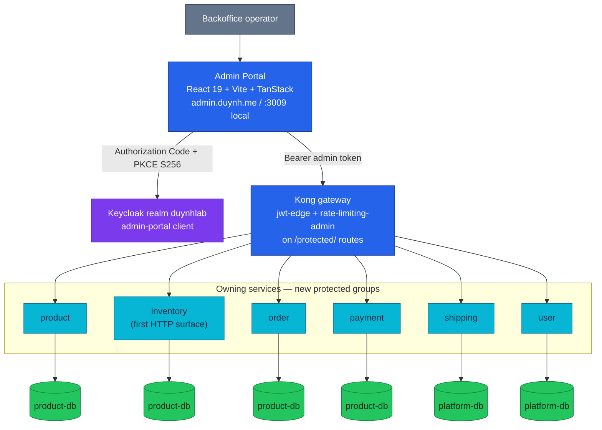

# RFC-0023 Basic Backoffice portal and the first protected business APIs

| Status | Scope | Research | Created | Last updated |
|--------|-------|----------|---------|--------------|
| implemented | platform-wide | [./research.md](./research.md) | 2026-08-10 | 2026-08-25 |

> **Every decision is a tradeoff.** This RFC creates a second browser application that
> calls owning services directly through Kong on a new `/protected/` audience. We accept
> frontend fan-out, a second SPA convention set (TanStack), and repeated protected-route
> work per service in exchange for keeping the MVP small, avoiding a premature admin
> BFF, and preserving domain ownership. Dangerous financial and fulfillment commands are
> deferred until audit, permissions, and operator workflows justify them. Costs are
> stated in **Design Details → Drawbacks**.

## Prerequisites

- [research.md](./research.md) merged; [research review gate](./research.md#research-review-gate) ticked
- Context7 audit complete (see research [audit log](./research.md#context7-audit-log))
- Owner approved **ready for RFC**
- **Hard dependency: the [RFC-0022](../RFC-0022/README.md) identity design record,
  delivered by [RFC-0024](../RFC-0024/README.md)'s program** — the `admin-portal`
  OIDC client, the `backoffice_admin` realm role, role claims in tokens
  (`realm_access.roles`), and `pkg/authmw` role normalization; this RFC's
  implementation cannot start before RFC-0024's identity phases land
- Mechanism deep-dive and the as-built gap audit live in [./research.md](./research.md)
- When Status → **`Accepted`**: expected ADRs listed in
  [Resulting decisions](#resulting-decisions); expected [`docs/api/`](../../../api/README.md)
  files to touch: `api.md` (protected conventions), `product.md`, `inventory.md`,
  `order.md`, `payments.md`, `shipping.md`, `user.md`, `microservices.md`, plus a new
  `docs/frontend/admin-portal/` area

## Summary

Introduce a separate **Backoffice SPA ("Admin Portal")** — React 19 + TypeScript + Vite
with TanStack Router/Query/Table/Form, Tailwind CSS v4 and shadcn/ui — and, with it,
make the `protected` route audience real: new role-gated `/{service}/v1/protected/…`
APIs on the owning services, exposed through Kong, verified in-service by `pkg/authmw`
plus a net-new role gate requiring `backoffice_admin`.

The first version is deliberately narrow, and its writes ship in two slices ordered by
what already exists (owner direction, 2026-08-10): **Slice A (MVP core)** — inventory
receipt/adjustment (wiring inventory's already-built, idempotent, actor-aware stock
commands to their first caller) plus **all** read-only views: cross-customer orders,
payments (including attempts and reconciliation discrepancies), shipments, customer
profiles, and the dashboard. **Slice B (this RFC, shipped second)** — product/catalog
writes: create, edit, publish/archive on a net-new lifecycle, and categories. No
admin **backend** service, no admin database, no BFF, no SSR — the `admin-service`
repository (owner-chosen name) contains only the static Admin Portal SPA, not a Go
service. Refunds, forced order or shipment
transitions, payment-state mutation, and bulk actions are explicitly deferred; the
order `manual_review` resolution — today a raw-SQL runbook — is named the flagship
follow-up command once the protected conventions exist.

Authentication is the Keycloak `admin-portal` public client (Authorization Code + PKCE
S256) with the `backoffice_admin` role from RFC-0022. Every protected write requires
idempotency, a validated domain command, and a durable audit record written by the
owning service.

## Motivation

The platform has no business-operations interface, and real operator needs are already
being served outside every guardrail: releasing an order from `manual_review` is a
raw-SQL runbook; fixing a missing inventory balance is documented as "a manual fix"
while the fixing commands sit implemented with zero callers; payment reconciliation
writes a report surface no endpoint can read; product mutation is seed-only. The full
inventory of these pains — and the audited endpoint gap table showing how much of the
needed API surface is genuinely missing — is in
[./research.md](./research.md#vs-platform-as-built).

Keycloak Admin Console manages identities, not commerce:

```text
Keycloak Admin Console → identity, credentials, roles, sessions, clients
Backoffice Portal      → commerce business data and operator workflows
```

The Backoffice also forces privileged API contracts to become explicit rather than
letting `internal` routes drift into accidental admin endpoints.

### Goals

- One usable Backoffice for a single project operator, authenticated through Keycloak
  and authorized with `backoffice_admin`.
- Establish `/protected/` as the browser-facing privileged audience, with its
  conventions (role gate, `actor_sub`, audit, idempotency, pagination) added to
  [`docs/api/api.md`](../../../api/api.md).
- Preserve service ownership: Product changes Product; Inventory changes Inventory; the
  Backoffice owns no domain data.
- A conventional static React SPA — easy to run in Docker Compose and deploy beside the
  existing customer SPA (same mop chart, nginx, build-arg config patterns).
- TanStack Router as URL/navigation-state authority; TanStack Query as remote
  server-state authority; TanStack Table for server-paginated tables; TanStack Form
  (validated with zod) for command forms; Tailwind v4 + shadcn/ui primitives.
- Basic catalog and stock operations; read-only inspection of orders, payments,
  shipments, customers.
- Durable audit for every protected write, recorded by the owning service.
- Deterministic local rebuild and seed, extending the RFC-0022 identity seeds.
- Clear extension points for fine-grained roles, risky commands, charts, virtualized
  views, real-time updates, and a future read BFF — without committing the MVP to them.

### Non-Goals

- Replacing Keycloak Admin Console; identity lifecycle stays there.
- An admin **backend** service, shared admin database, or BFF in the first release
  (note: `admin-service` is the SPA repository's name, not a Go service — no domain
  logic or database lives there).
- Next.js, React Server Components, TanStack Start, SSR, SEO, or edge deployment.
- Calling `/internal/` routes from a browser; direct DB or ClickHouse access from the
  frontend (no analytics client in the browser).
- Refunds, payment repair, forced order/shipment transitions, bulk actions,
  maker-checker/four-eyes, fine-grained operator roles, real-time updates, bulk
  import/export, analytics/BI — all future expansion.
- A variants/SKU model (no model exists in product-service; needs its own refactor).
- A shipping status FSM (none exists as-built; transitions are blocked on one).
- TanStack Store (no state left over for it) and TanStack Virtual / Recharts before
  their documented triggers fire.
- A mobile Backoffice.

## Proposal

### Actors and boundaries

| Actor/component | Responsibility |
|-----------------|----------------|
| Backoffice operator | Uses business screens; holds Keycloak `backoffice_admin` |
| Admin Portal SPA | Route guards, URL state, query cache, tables, forms, API calls — view state only |
| Keycloak | Login, session, tokens, operator role (`admin-portal` client) |
| Kong | Edge routing, TLS, rate limiting, coarse token validation (no role checks — OSS `jwt` plugin) |
| Owning service | Full token + role validation, domain rules, persistence, audit |
| Keycloak Admin Console | Identity administration only |

### Frontend stack

| Concern | Technology | Note vs as-built customer SPA |
|---------|------------|-------------------------------|
| UI runtime / build | React 19 + TypeScript, Vite | same |
| Styling / UI kit | Tailwind CSS v4, shadcn/ui | same kit (customer SPA proves React 19 + TW4 compatibility); admin adds table/dialog/tabs/popover/command primitives |
| Routing | TanStack Router (file-based, `validateSearch`, `_authenticated` layout guard) | customer SPA uses react-router 7 — divergence accepted, see Alternatives |
| Server state | TanStack Query (key factories, targeted invalidation, AbortSignal) | customer SPA uses SWR |
| Tables | TanStack Table (`manualPagination` + `rowCount`, manual sort/filter) | net-new either way — no table lib exists anywhere |
| Forms | TanStack Form + **zod** (Standard Schema — no adapter; zod 4 is already the platform validation language) | customer SPA uses react-hook-form + zod |
| Auth | **keycloak-js**: PKCE S256 (default since KC 24), in-memory tokens, `updateToken()` refresh | replaces, not ports, the customer SPA's localStorage + custom-refresh layer |
| Serving / config | nginx:alpine on :80 with `/health`; `VITE_*` build args | same patterns as `frontend/Dockerfile` |
| Tests | Playwright (+ axe, agent-browser), no unit runner | same conventions |

Exact package versions are pinned in `package.json`/lockfile at implementation; the RFC
pins responsibilities and boundaries.

**State ownership** (one authority per state; remote records are never copied into a
client store):

| State | Authority |
|-------|-----------|
| Route, page, filter, sort, pagination | TanStack Router (URL) |
| Remote records + request status | TanStack Query |
| Table presentation | TanStack Table |
| Form drafts + client validation | TanStack Form (zod) |
| Dialog/sidebar ephemera | React component state |
| Session/token lifecycle | keycloak-js adapter |
| Business truth | Owning Go service |

### Why `/protected/`, not `/internal/`

| Audience | Caller | Trust |
|----------|--------|-------|
| `/public/` | Anonymous browser/provider | None or route credential |
| `/private/` | Signed-in customer | Customer token + owner scoping |
| `/protected/` | Privileged operator browser | Admin token + role + audit |
| `/internal/` | Cluster workload only | NetworkPolicy now; workload identity later |

A Backoffice browser is privileged but **outside the cluster trust boundary**:
`Admin Portal → Kong → /protected/`, never `→ /internal/`. Existing seed-only or
no-caller internal routes are not promoted; they are replaced by deliberate protected
contracts or deleted (user's orphaned route is already removed by RFC-0022; shipping's
dead HTTP twin is flagged for cleanup). This RFC also supersedes RFC-0010's older
"signed-webhook" reading of the `protected` class — webhooks stay `public` + HMAC.

### No admin BFF in the MVP

The portal calls owning services directly through Kong. MVP screens are single-domain;
no new backend or database is needed; commands stay visibly owned by the right service.
A future `admin-api` may aggregate **reads** (global search, dashboards, case views) —
it would own no business data and implement no domain invariants. The revisit trigger:
dashboard/global-search fan-out becomes operationally unreasonable.

### Basic scope

Navigation: Dashboard · Catalog (Products, Categories) · Inventory (Balances, Receipts,
Adjustments, Movements, Reservations) · Orders · Payments · Shipments · Customers.

| Area | Basic release | Mutability | As-built note |
|------|---------------|------------|---------------|
| Login/logout | Keycloak redirect/session | identity only | RFC-0022 client |
| Dashboard | Attention cards, partial-data tolerant | read-only | only cards with owning endpoints (low/out-of-stock, `manual_review`/`cancelling` backlogs, payment UNKNOWN attempts + recon discrepancies, recent orders) |
| Products | List, create, edit, publish, archive | read/write — **slice B** | lifecycle (`DRAFT/ACTIVE/ARCHIVED`) is **net-new** — see § Product lifecycle |
| Categories | List, create, edit (no delete) | read/write — **slice B** | table exists; endpoints net-new |
| Variants/SKUs | — | — | **out of scope** (no model exists) |
| Inventory balances | Filter by SKU/warehouse; low/out-of-stock views | read-only | shows all four numbers: on_hand, reserved, safety_stock, derived ATP |
| Inventory receipts / adjustments | Receive stock; adjust with mandatory reason | write — **slice A** | wires the existing idempotent `StockCommand`s (`command_id`, actor from token) |
| Movements / Reservations | Append-only history; reservation inspection | read-only | tables exist; readers net-new |
| Orders | Cross-customer list + case detail + `manual_review` resolve | read/write — **train 7** | unscoped repo path net-new; the resolve shipped after its own safety review ([ADR-051](../../adr/ADR-051-trusted-operator-resolution/)), and the case view grew the external truths + transition history that decision requires |
| Payments | Cross-customer list, detail incl. attempts + ledger summary + recon discrepancies | read-only | unscoped `Get(id, 0)` path already exists; attempts/ledger/recon readers net-new |
| Shipments | Cross-customer list + detail | read-only | list net-new; status shows **as-built vocabulary** (`pending`/`cancelled`; seed-only values labelled) — no FSM exists, transitions deferred |
| Customers | Search + operator-safe detail | read-only | search by name/phone/user_id only — **email/username columns do not exist** in user-service (identity lives in Keycloak) |

### Protected API conventions (added to `docs/api/api.md` by this RFC)

All `/{service}/v1/protected/…` routes: pass through Kong; valid token from the
configured issuer/audience; require `backoffice_admin` (MVP); use the verified `sub` as
`actor_sub` — never from the request body; shared error envelope (`403 FORBIDDEN` for
role misses); standard `page`/`page_size` pagination with allowlisted sort fields;
idempotency for retryable commands (header style for payment-lineage services,
body `command_id` for inventory — both documented); optimistic concurrency/version
where edits can overwrite; a mandatory `reason` for stock-changing commands; a durable
audit record in the same transaction as the command; bounded metrics and structured
logs with no subject IDs as labels.

### Target protected contracts (surface, not schemas — schemas land in the owning `docs/api/{service}.md`)

| Service | MVP routes | Future |
|---------|-----------|--------|
| product | `GET/POST /products`, `GET/PUT /products/:id`, `POST /products/:id/publish`, `POST /products/:id/archive`, `GET/POST/PUT /categories…` | variants after a Product refactor |
| inventory | `GET /balances`, `GET /balances/:skuId`, `GET /movements`, `GET /reservations`, `POST /receipts`, `POST /adjustments` | safety-stock command exposure |
| order | `GET /orders`, `GET /orders/:id` (case view) | `POST /orders/:id/resolve-manual-review` (flagship), cancellations |
| payment | `GET /payments`, `GET /payments/:id` (attempts + ledger summary), `GET /reconciliations/runs`, `GET /reconciliations/runs/:id` | refunds, recon triggers (stay `internal` meanwhile) |
| shipping | `GET /shipments`, `GET /shipments/:id` | transitions — blocked on an FSM RFC |
| user | `GET /users` (name/phone search), `GET /users/:userId` | — |

The seed-only `POST /product/v1/internal/products` is **not** reused as the browser
contract; it remains the seed path until the protected create replaces it.

### Audit contract

Every protected write records at minimum: action; target type + ID; `actor_sub`;
reason code (+ optional note); idempotency key/command ID; before/after version or
changed fields where practical; request/trace correlation ID; timestamp; outcome.
Ownership is per service: inventory's movement ledger (already actor-aware) **is** the
stock audit; product adds a `product_status_history`/revision table modeled on
order-service's proven `order_status_history` (same-transaction append). A central
audit explorer is future work.

## Architecture & Diagrams

### Target topology (planned)



(Databases shown per the RFC-0018 as-built split: CNPG `product-db` hosts
product/inventory/order/payment/cart/checkout databases; `platform-db` hosts
user/shipping/review/notification and platform databases.)

### Page-to-service ownership and the future read BFF

The portal fans out per domain (catalog pages → product, stock pages → inventory,
etc.); each dashboard card has its own query key, loading/error state, and retry — one
failed domain read never blanks the page and never fabricates `PAID`/`OUT_OF_STOCK`/
`DELIVERED`. A future read-only `admin-api` (dotted-line, not MVP) would aggregate
reads only and own no business data.

## Design Details

### Frontend architecture

Repository **`admin-service`** (owner-chosen, 2026-08-10 — the name denotes the Admin
Portal SPA; despite the `-service` suffix it is a static frontend, not a Go domain
service), mirroring the customer
SPA's proven build/serve/test patterns:

```text
src/routes/            __root.tsx · login.tsx · auth.callback.tsx · _authenticated/…
src/features/          auth · dashboard · products · inventory · orders · payments · shipments · customers
src/components/        ui/ (shadcn) · app-shell · data-table · status-badge · command-dialog
src/lib/               api · auth · query · errors · format
tests/                 Playwright (+ axe), same e2e conventions as the customer SPA
```

- **Router**: file-based; `_authenticated` pathless layout owns the shell, checks
  session + `backoffice_admin` in `beforeLoad` (UX only — services re-check); list
  search params validated with zod via `validateSearch`; back/forward restores views.
- **Query**: one key factory per domain; keys include the validated search object;
  fetchers accept `AbortSignal`; 401 → one controlled re-auth path (keycloak-js
  `updateToken` → `login()`), 403 → permission-denied page, never a login loop;
  mutations invalidate only affected keys; no speculative optimistic updates for
  commands.
- **Table**: `manualPagination`/`manualSorting`/`manualFiltering` + server `rowCount`;
  a reusable `DataTable` owns headers/toolbar/pagination/skeleton/empty/error states;
  domain pages own columns and actions. No unbounded client-side datasets.
- **Form**: TanStack Form with zod schemas (direct Standard Schema); server errors
  mapped to field + summary; submit disabled in flight; idempotency key retained for
  uncertain retries; version conflicts reload current state; stock-changing forms
  require a reason and preview the balance impact; confirmation dialogs show
  target/effect/current/requested/reason (no `window.confirm`).
- **API client**: targets Kong only; attaches the active access token, request-ID and
  idempotency headers; parses the shared error envelope; carries both idempotency
  styles (header vs body `command_id`); never logs tokens or sensitive bodies.
- **Auth**: **keycloak-js** — chosen over the standards-portable `oidc-client-ts`
  (+`react-oidc-context`) after comparison: keycloak-js holds tokens **in memory** by
  default and speaks Keycloak's session features natively, while `oidc-client-ts`
  defaults its user store to `sessionStorage` (web storage) and only matches the
  in-memory posture with extra configuration; the platform is committed to Keycloak
  (RFC-0022), so vendor alignment costs nothing. PKCE S256, no client secret, no
  custom refresh code (`updateToken` + login fallback); an explicit improvement over
  the customer SPA's documented localStorage trade-off. `oidc-client-ts` is the named
  swap if multi-IdP portability ever matters.
- **UI design authority**: the owner's **`product-design` skill** — a design contract
  (semantic tokens in OKLCH, restrained neutral palette, shadcn primitives kept
  pristine with call-site customization, centralized DataTable/skeleton/empty/error
  patterns, dense operational typography, no decorative AI styling) whose preferred
  stack is exactly this RFC's (TanStack Router/Query/Table, Tailwind v4, shadcn/ui).
  Implementation sessions load the skill when building or reviewing portal UI.

### Backend deltas (the bigger half — audited in research)

1. **`pkg/authmw`**: net-new `MiddlewareRequireRole(role)` on top of RFC-0022's role
   normalization; 403 `FORBIDDEN` envelope on miss. One coordinated version bump.
2. **Per-service protected groups**: mirror payment's `RegisterRoutes/mount` split;
   product, inventory, and shipping get their first authmw wiring.
3. **inventory**: first HTTP web layer (handlers + error translation + routes) wiring
   the existing `StockCommander`; first Kong route ever for inventory (cluster Ingress
   + local-stack service/upstream) + NetworkPolicy amendment.
4. **product** (slice B — see § Product lifecycle, categories, and audit below):
   `status` lifecycle column + transition commands + `ACTIVE` filter on public reads;
   category endpoints; update path (repository methods exist, logic and handlers are
   new); `admin_action_audit` table; protected lists use standard `page`/`page_size`
   (public `limit` divergence stays documented).
5. **order/payment/shipping/user**: unscoped, role-gated list/read paths (order needs a
   new repo method — owner scope is baked into SQL today; payment reuses its unscoped
   `Get`); payment attempts/ledger-summary/reconciliation readers; shipping list; user
   name/phone search (seq-scan acceptable at homelab scale; index note recorded).
6. **Kong**: amend the "only public and private" exposure policy; add
   `api-<svc>-protected` Ingresses (`jwt-edge` + `rate-limiting-admin`); **split
   local-stack's bare-prefix product/order routes by audience first** — today a
   `/product/v1/protected/…` request would match the bare `/product/` route **without
   any JWT check** (the trap is closed before any protected route ships).
7. **CORS + client config**: add the admin origin to both twinned Kong CORS configs in
   the same PR and to the `admin-portal` client's redirect URIs/origins.

### Product lifecycle, categories, and audit (slice B — detailed proposal)

**Lifecycle.** Net-new column on `products`:

```sql
ALTER TABLE products
  ADD COLUMN status VARCHAR(16) NOT NULL DEFAULT 'ACTIVE'
  CHECK (status IN ('DRAFT','ACTIVE','ARCHIVED'));
ALTER TABLE products ADD COLUMN version BIGINT NOT NULL DEFAULT 1;
CREATE INDEX idx_products_status ON products (status);
```

- `DEFAULT 'ACTIVE'` makes the migration **backfill-free**: every existing/seeded row
  stays publicly visible. Products created via the protected route default to `DRAFT`.
- Three transition **commands** (no generic status setter — order-service discipline):
  `publish` (DRAFT→ACTIVE), `archive` (DRAFT|ACTIVE→ARCHIVED), `restore`
  (ARCHIVED→ACTIVE). Invalid edges → 409 `INVALID_TRANSITION`.
- Edits use optimistic concurrency: the update carries the expected `version`; a
  mismatch returns the conflict for the operator to reconcile.
- Public catalog reads (`ListProducts`, `GetProduct`, `/details`) filter
  `status = 'ACTIVE'`. **gRPC price reads stay status-blind** (`BatchGetCurrentPrices`
  keeps resolving ARCHIVED products) so an existing cart holding a just-archived
  product still prices correctly — checkout's price re-validation remains the guard;
  the product page 404s. This asymmetry is deliberate and documented in
  `docs/api/product.md` when implemented.

**Categories.** MVP endpoints: `GET /categories` (paginated), `POST /categories`,
`PUT /categories/:id`. **No delete**: `products.category_id` references categories
`ON DELETE SET NULL`, and silently uncategorizing products is a decision that deserves
its own review; archiving-a-category is future work. No hierarchy (the table is flat).

**Audit.** One table in product's schema covering products and categories, modeled on
order's proven same-transaction `order_status_history` append:

```sql
CREATE TABLE admin_action_audit (
  id             BIGSERIAL PRIMARY KEY,
  target_type    VARCHAR(16)  NOT NULL CHECK (target_type IN ('product','category')),
  target_id      INTEGER      NOT NULL,
  action         VARCHAR(32)  NOT NULL,  -- CREATE / UPDATE / PUBLISH / ARCHIVE / RESTORE
  actor_sub      VARCHAR(255) NOT NULL,  -- verified token subject
  reason         VARCHAR(64),
  changed_fields JSONB,                  -- before/after for UPDATE
  version_before BIGINT,
  version_after  BIGINT,
  request_id     VARCHAR(64),
  created_at     TIMESTAMPTZ NOT NULL DEFAULT now()
);
CREATE INDEX idx_admin_audit_target ON admin_action_audit (target_type, target_id, created_at DESC);
```

The audit row commits **in the same transaction** as the write; a failed audit insert
fails the command (matching the draft SLO: no successful protected write without its
audit record). Inventory needs none of this — its movement ledger already is the audit.

### Local-stack and seed

```text
Development:  Vite dev server on :3009        (3002 is Grafana; 3001 is the customer SPA)
Container:    static build → nginx :80, published 3009:80
Cluster:      ResourceSet mirroring frontend-rs.yaml — including the mop-chart
              `service.http.port: 80` gotcha (top-level port keys are silently ignored)
Host:         admin.duynh.me (covered by the existing *.duynh.me wildcard cert)
```

Seeds extend RFC-0022's deterministic identities (the `admin` demo user with
`backoffice_admin`; never the Keycloak bootstrap admin) plus: products/categories across
lifecycle states, warehouse balances with low/out-of-stock cases, orders across states
(including `manual_review`), payments across outcomes (including an UNKNOWN attempt and
a reconciliation discrepancy), shipments, profiles, and protected-write audit examples.
The portal receives only public runtime config (Keycloak issuer/client ID, Kong base
URL) via build args.

### Error handling

| Error | UX |
|-------|----|
| 401 | keycloak-js re-auth (`updateToken` → `login()`); no loops |
| 403 `FORBIDDEN` | permission-denied page; not retried |
| 404 | resource gone/not visible; return to list |
| 409 `INVALID_TRANSITION` | reload current state, explain conflict |
| 409 `IDEMPOTENCY_CONFLICT` | keep the key unless the command changed |
| 412 / version conflict | show newer resource; operator reconciles |
| 400/422 `VALIDATION_ERROR` | field + summary errors |
| 503 | retry idempotent command / degraded read panel |
| unknown command outcome | query resource state before resubmitting |

### Accessibility

Keyboard-navigable shell/tables/dialogs/forms; visible focus; semantic labels; status
never color-only; desktop-first, usable at tablet widths; destructive confirmations
screen-reader accessible. Same axe-in-Playwright gate as the customer SPA.

### Drawbacks (the cost side, stated plainly)

- **Two frontend convention sets** (react-router/SWR/RHF vs TanStack) in one platform —
  accepted for the admin workload fit and shadcn's TanStack-Table-based data-table, but
  it is a real maintenance tax; the reuse alternative stays recorded.
- The SPA is the smaller half: **most "Required" backend surface is net-new** (see the
  research gap table), including a product lifecycle that touches public reads and a
  whole HTTP layer + first Kong exposure for inventory.
- More edge surface: new Ingresses, CORS origins, and a policy amendment widen the
  attack/config surface Kong carries.
- Per-domain frontend fan-out on dashboards until (if ever) a read BFF is justified.
- One coarse role means every operator is superuser-shaped until the role split.

## Security considerations

- Separate Keycloak client from the customer SPA; no client secret in browser code;
  PKCE S256; in-memory tokens (no localStorage).
- `protected` ≠ `private` ≠ `internal`: customer routes stay owner-scoped; internal
  routes stay off the gateway; the local bare-prefix JWT trap is closed **before** any
  protected route ships.
- Services independently validate issuer, audience, lifetime, `sub`, and the
  `backoffice_admin` role; Kong is coarse-only (cannot check roles).
- `actor_sub` comes from the verified token, never from JSON.
- Sensitive fields excluded from list pages by default; customer private data appears
  only behind explicit protected contracts.
- Protected writes require idempotency + same-transaction audit.
- CORS allowlisted for the admin origin in both twinned configs; CSP and standard
  security headers at the edge/frontend as per the customer SPA's nginx baseline.
- The demo `admin` account is not the Keycloak bootstrap admin; admin identities are
  never publicly self-registered (RFC-0022).
- Future refund/cancel/transition commands each require their own domain safety review.

## Observability & SLO impact

**Frontend**: route-load success/latency, JS error rate, OIDC login/logout failures,
protected API request rate/error/latency (bounded labels), build version — wrapped at
the shared Router/Query/API boundaries, not per-page; no tokens, subjects, emails, or
free-text reasons in labels (platform data policy).

**Backend**: protected request count by service/route-template/method/status; 403 count
by bounded reason; admin command outcomes by bounded command/outcome; inventory
receipt/adjustment outcomes; product lifecycle-transition outcomes; audit-write
failures; dashboard dependency failures. Alert catalog rows + a runbook ship with the
implementation (operability is part of the change). Existing gauges
(`order_manual_review_backlog`, `order_cancelling_backlog`) feed dashboard cards.

**Draft SLOs** (targets to ratify at implementation): login→usable shell 99% (excluding
bad credentials); protected reads inherit the owning service's SLO; no duplicate effect
for the same idempotency key; **no successful protected write without its audit
record**; one failed dashboard card never blanks the others.

## Rollout & rollback

### Adoption sequence (dependency order, not a project plan)

1. **RFC-0022 prerequisites land** (client, role, claims, authmw normalization).
2. Protected conventions in `docs/api/api.md` + `pkg/authmw` role gate (one version bump).
3. Local-stack Kong audience split (closes the bare-prefix trap) + CORS/redirect-URI
   updates for the admin origin.
4. SPA foundation: Vite/TanStack/shadcn shell, keycloak-js login, `_authenticated`
   guard, DataTable/Form conventions (UI per the `product-design` skill).
5. **Slice A** — Inventory: HTTP layer + first Kong exposure + protected
   reads/commands → stock pages; read-only Order/Payment/Shipping/Customer pages
   (+ their net-new unscoped reads); dashboard.
6. **Slice B** — Product: lifecycle + protected catalog commands + categories +
   `admin_action_audit` → catalog pages.
7. Seeds, audit verification, accessibility pass, E2E, documentation
   (docs/api contracts + `docs/frontend/admin-portal/`).

Slice A alone is a complete, useful Backoffice (it retires both live operator pains'
read paths and the inventory manual fix); slice B follows behind the same conventions.

### Rollback

The portal is removable without touching customer APIs: delete the frontend deployment
and the protected Ingresses (Kong), or disable per-service protected groups. Product's
lifecycle column and audit tables ship with reversible migrations; inventory's commands
pre-exist this RFC. Source revert + clean rebuild covers local-stack. No portal-owned
schema exists anywhere.

## Testing / verification

- **AuthN/Z**: anonymous → Keycloak redirect; `backoffice_admin` reaches the shell;
  customer token → 403 on protected APIs; wrong issuer/audience rejected; frontend
  guard never substitutes for the service gate; expired session re-auths cleanly; no
  browser path reaches `/internal/`; **local bare-prefix trap regression test** —
  `/product/v1/protected/…` without a token must be rejected at the edge.
- **Protected contract**: canonical paths; role required; `actor_sub` from token only;
  sanitized stable errors; idempotent retries (both styles) don't duplicate effects;
  changed payload under the same key → 409; concurrency conflicts visible; every route
  documented in the owning `docs/api/{service}.md`.
- **Product**: lifecycle transition tests (invalid transitions rejected); public reads
  hide non-`ACTIVE`; category rules; concurrent edits; audit row committed with write;
  product cannot mutate inventory balances.
- **Inventory**: receive/adjust idempotency by `command_id`; negative balances
  impossible (`reserved ≤ on_hand`, `on_hand ≥ 0` CHECKs); ATP stays derived (all four
  numbers displayed); reason + actor recorded; movements append-only; reservations not
  manually corruptible.
- **Reads**: cross-customer lists only on protected routes; customer `private` scoping
  regression-tested; pagination/filtering; partial enrichment failure → panel error,
  never fabricated state; sensitive fields absent by default.
- **Frontend**: URL round-trip for list state; back/forward restoration; stale request
  cancellation; 401 vs 403 behaviors; targeted invalidation; server-provided totals
  only; form error mapping; unsaved-change guard; keyboard/focus; axe checks; no tokens
  in logs/reports.
- **Clean rebuild**: one command brings up Keycloak, services, Kong, seeds, and both
  SPAs; the admin demo account works end-to-end; no admin **backend**/BFF or admin
  database exists (the `admin-service` repo ships static assets only); full
  [local-stack E2E release audit](../../../../local-stack/docs/e2e-audit.md) gates the
  tags.

## Resulting decisions

| Decision | ADR | Status |
|----------|-----|--------|
| Backoffice commands go through role-gated `/protected/` APIs on owning services — never `/internal/`, never a DB | [ADR-047](../../adr/ADR-047-protected-apis-on-owning-services/) *(renumbered 2026-08-11: the identity ADRs took 041–043 and RFC-0024's edge ADRs took 044–046 at acceptance)* | Accepted |
| The Admin Portal calls owning services directly; an admin BFF is deferred to a read-aggregation trigger | [ADR-048](../../adr/ADR-048-admin-portal-no-bff/) | Accepted |
| The Admin Portal is a separate React+Vite SPA on the TanStack stack (Router/Query/Table/Form) with Tailwind v4 + shadcn/ui — owner-selected | [ADR-049](../../adr/ADR-049-admin-portal-tanstack-spa/) | Accepted |

The MVP write-scope cut (product/inventory only) stays an RFC scope decision, not an ADR.

## Implementation History

- 2026-08-10 — Research ([./research.md](./research.md)) and provisional RFC created
  from the owner's draft, corrected against a fleet-wide as-built audit (freshly pulled
  service repos + manifests) and a Context7 audit. Notable corrections: product
  lifecycle/categories labeled net-new, inventory identified as the largest infra delta
  (first HTTP surface + first Kong route), shipping transitions blocked on a
  nonexistent FSM, customer search limited by the absence of email/username columns,
  the local bare-prefix JWT trap, and the order `manual_review` runbook named as the
  flagship future command.
- 2026-08-10 — Owner decisions recorded: TanStack stack selected (ADR-049, renumbered from 044); MVP writes
  sliced inventory-first (slice A) with product/catalog writes as slice B; local port
  **:3009**; ADR numbers 042–044 confirmed; priority P2 sequenced after RFC-0022;
  keycloak-js and zod confirmed after researched comparisons vs `oidc-client-ts` and
  valibot; detailed product lifecycle/categories/audit proposal added; the
  `product-design` skill named the portal's UI design authority.
- 2026-08-13 — **Identity amendment ([ADR-050](../../adr/ADR-050-separate-staff-identity-realm/))**:
  the operator population moves to a dedicated `duynhlab-staff` realm (owner
  decision after meeting the alice dual-role test seed in practice). The
  `/protected/` audience verifies the staff issuer end to end; a customer
  token now fails at the edge as wrong-issuer before any role logic. The
  role-gate conventions of this RFC are unchanged.
- 2026-08-13 — **Status → Accepted**; ADR-047/048/049 created at Accepted (Adoption:
  Not started). **Edge translation note:** this RFC's text predates RFC-0024's edge
  cutover — every Kong-specific mechanism reads as its Envoy Gateway equivalent
  per [ADR-044](../../adr/ADR-044-envoy-gateway-platform-edge/): `api-<svc>-protected`
  Ingress → `HTTPRoute` (audience-scoped `PathPrefix`, both config sets), `jwt-edge`
  plugin → `jwt-edge` SecurityPolicy (`remoteJWKS`), `rate-limiting-admin` plugin →
  BackendTrafficPolicy local rate limit, twinned CORS configs → the `cors-policy`
  SecurityPolicy + realm client origins. The local bare-prefix JWT trap is already
  closed as-built: local EG routes match by audience segment (`/{svc}/v1/{audience}`),
  so the pre-work item "split local routes by audience" is done. Identity
  prerequisites are live in both realm twins (`backoffice_admin`, `admin-portal`
  client, PKCE S256, alice as test operator); the client's dev origin moved from
  the `:3002` placeholder to the owner-picked `:3009` with this acceptance.
- 2026-08-10 — Final open items closed: `manual_review` resolve stays a **Future**
  command outside the MVP slices (own safety review); the SPA repository is named
  **`admin-service`** (a static frontend despite the suffix — no admin backend, BFF,
  or database exists; RFC wording adjusted to keep the non-goal unambiguous).

- 2026-08-14 — **Slice A is built.** Five services carry role-gated `/protected/`
  reads behind the staff issuer (inventory balances/movements/reservations +
  receipt and adjustment commands; order, payment, shipping, user reads; the
  payment attempt worklist and the reconciliation records' first reader). The
  portal ships every screen the scope table names except the catalog pair:
  dashboard attention cards, five list screens, five case views, and the two
  inventory commands — all reading the live edge, never a mock. Verified by two
  full compose E2E audits (rows **A17**/**A18** added for the protected surface)
  and the portal's own Playwright suite. Deployment path merged: namespace
  `backoffice`, `rs-backoffice`, and `backoffice.duynh.me` — unverified until
  the Kind gate, which is why the four ADRs read **Partial**, not Complete.
  Two defects surfaced and were fixed on the way: the released portal image
  baked local dev origins (no CI build args), and route-level SecurityPolicies
  silently replace the gateway CORS baseline without `mergeType: StrategicMerge`.
  Still open for slice B: product lifecycle + categories, and the `manual_review`
  resolve command (still Future).

- 2026-08-14 — **Slice B is built: the catalog is the sixth protected service.**
  `products` gains a three-state lifecycle (`DRAFT`/`ACTIVE`/`ARCHIVED`, arriving
  `DEFAULT 'ACTIVE'` so the migration is backfill-free) and a `version`
  concurrency token; `admin_action_audit` records who changed what, committed in
  the same transaction as the change. Eleven protected routes: the operator
  catalog in every state, create (DRAFT), edit under optimistic concurrency,
  three transition commands, the per-product audit read, and the category
  endpoints the table had been waiting for since it was created. The portal's
  last stub becomes a real screen, offering only the transitions the current
  state allows and turning both conflicts into sentences. The deliberate
  asymmetry is documented as-built: an archived product's page 404s while its
  gRPC price read still resolves, because a cart holding it must still price
  correctly. Product's seed-only unauthenticated create is deleted (ADR-047's
  boundary rule), verified callerless first. Audit row **A19** covers the
  lifecycle end to end; **ADR-047 Adoption → Complete**.
  Four defects surfaced and were fixed in the same round, three of them the kind
  a green CI hides: a JSONB parameter passed as `[]byte` failed only under the
  service's simple-protocol pool while the test's extended-protocol pool passed;
  a duplicate product name answered 500 instead of 409; a 500 from those handlers
  logged nothing at all; and two reconciliation reads compared the database's
  clock against the process's, so the reaper deleted nothing and the open-doubt
  gauge could report a negative age. Three audit rows also stopped asserting on
  luck (cart contamination vs mockpay's decline-by-amount-suffix, a fixed
  idempotency key, a fixed sleep for an async saga).
  Still open: `manual_review` resolve remains a Future command, the portal does
  not yet surface the audit history the API now returns, and the cluster is
  unverified until the Kind gate.
- 2026-08-19 — **The slice-B stock gap is decided.** Slice B shipped catalog
  create with no initial-stock step, which turned the recorded "manual fix"
  (research.md: receipts implemented "with zero callers") into a daily hazard —
  the portal could manufacture unbuyable ACTIVE products, and its Receive
  dialog, being row-scoped, could not reach a SKU with no balance row.
  [ADR-053](../../adr/ADR-053-untracked-sku-operator-data-not-outage/) decides
  it: the operator owns balance bootstrap through the receipts command, the
  portal must expose it for untracked SKUs and warn at publish (no gate — the
  product/inventory write boundary this RFC set stays intact), and checkout's
  untracked-SKU answer moves from a retryable 503 to `409 ITEM_NOT_ORDERABLE`.
  Shipped 2026-08-19: admin-service 0.4.0, checkout-service 0.9.0, frontend 3.2.0 (compose gate, audit row A21).
- 2026-08-14 — **The flagship Future command shipped.** The safety review this
  RFC deferred on 2026-08-10 is decided in
  [ADR-051](../../adr/ADR-051-trusted-operator-resolution/): the operator is
  trusted, and the audit trail is the control. `POST
  /order/v1/protected/orders/:id/resolve` replaces the runbook's raw-SQL block,
  which survives only as documented break-glass. Rejected in the review:
  reading payment/inventory/shipping to **veto** a target (unavailable during
  exactly the incidents that fill this queue, and only ever partial — a refund
  issued in a provider console reads as a contradiction), and maker-checker
  (needs a second staff-realm role; with one operator the second signature is
  the same human).
  Three things landed with it because the decision requires all three: a bounded
  resolution reason vocabulary so the trail distinguishes recovering the money
  from writing it off; the echoed version enforced as a precondition under the
  row lock, which it previously was not — the guarded update used the version
  read under the lock, so a version the order was not at would simply apply; and
  the case view carrying the external truths plus the transition history, since
  a control nobody can see is not a control. Audit row **A20** drives it through
  the edge against an order parked by a real declined refund. This also closes
  the "portal does not surface the audit history" item above for orders.
  Still open: the cluster remains unverified until the Kind gate.

When Status → implemented, confirm:
- [x] Linked ADR(s) Adoption → Complete — ADR-047/048/049/050/053 on the 2026-08-25 Kind gate
- [ ] docs/api/ synced — api.md protected conventions; per-service contracts; rollup;
      Design records links; `docs/frontend/admin-portal/` created and indexed
- [ ] Runbooks updated (protected-API ops; OrderManualReviewBacklog runbook points to
      the portal path when the command ships)
- [ ] Resulting decisions table reflects final ADR status

## Related

- [./research.md](./research.md) — plain-language research, gap audit, Context7 log
- [RFC-0022 — Keycloak as platform IdP](../RFC-0022/README.md) — hard dependency
- [RFC-0021 — Platform overhaul](../RFC-0021/README.md) — inventory extraction this RFC builds on
- [RFC-0009](../RFC-0009/README.md) / [ADR-006](../../adr/ADR-006-rs256-jwt-kong-edge-auth/) — edge/service verification split inherited by protected routes
- [`docs/api/api.md`](../../../api/api.md) · [`docs/api/product.md`](../../../api/product.md) · [`docs/api/inventory.md`](../../../api/inventory.md) · [`docs/api/order.md`](../../../api/order.md) · [`docs/api/payments.md`](../../../api/payments.md) · [`docs/api/shipping.md`](../../../api/shipping.md) · [`docs/api/user.md`](../../../api/user.md)
- [ADR-051](../../adr/ADR-051-trusted-operator-resolution/) — the safety review behind the `manual_review` resolve
- [OrderManualReviewBacklog runbook](../../../observability/runbooks/microservices/OrderManualReviewBacklog.md) — the raw-SQL path this RFC retired to break-glass

---
_Last updated: 2026-08-25 — Status → `implemented`: the Kind gate passed, verifying the portal against the cluster edge (K4.7) and the realm fence (K4.8). ADR-048/049/050/053 all reached `Complete`._
