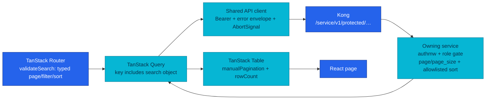
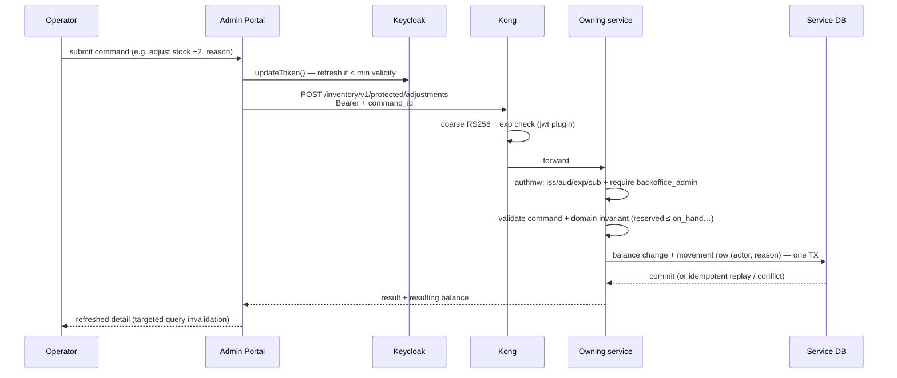
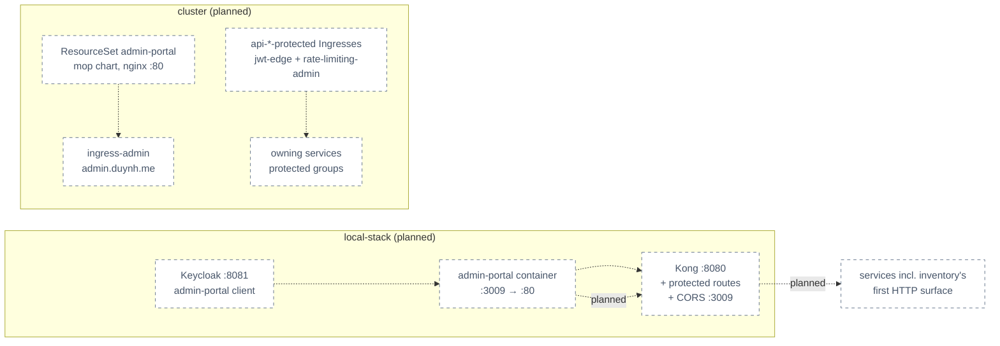

# RFC-0023 — Research: a basic Backoffice portal and the first `protected` APIs

| | |
|---|---|
| **RFC** | RFC-0023 |
| **Status** | researching |
| **Scope** | platform-wide |
| **Created** | 2026-08-10 |
| **Last updated** | 2026-08-10 |

> **Plain-language research.** This file is the audit trail for giving the platform its
> first business-operations interface: a separate Backoffice SPA (React + the TanStack
> libraries) that talks to **new `/protected/` routes** on the owning services through
> Kong, authenticated by the Keycloak `admin-portal` client and the `backoffice_admin`
> role that [RFC-0022](../RFC-0022/README.md) defined. It frames the operator problem,
> audits what actually exists in the fleet today (very little of the needed API surface
> does), and records proposed directions for every open item. The target design lands in
> `README.md` after the gate.
>
> **Dependency notice.** This RFC hard-depends on RFC-0022 (provisional): the role claim
> in tokens (`realm_access.roles`) and its normalization in `pkg/authmw` are RFC-0022
> deliverables. RFC-0022's rollout step 5 explicitly leaves the hook this RFC fills:
> *"wire `protected` routes."*

---

## Table of contents

1. [Problem statement](#problem-statement)
2. [Reading path](#reading-path)
3. [What the Backoffice is](#what-the-backoffice-is)
4. [Core components](#core-components)
5. [Core mechanism](#core-mechanism)
6. [Glossary](#glossary)
7. [Worked examples](#worked-examples)
8. [vs platform as-built](#vs-platform-as-built)
9. [Integration paths](#integration-paths)
10. [Alternatives](#alternatives)
11. [Open questions](#open-questions)
12. [FAQ](#faq)
13. [References](#references)
14. [Context7 audit log](#context7-audit-log)
15. [Research review gate](#research-review-gate)

---

## Problem statement

### Real-world trigger

| | |
|---|---|
| **Situation** | The platform has customer APIs and cluster-internal APIs but **no business-operations surface**. Real operator needs already exist and are served by ad-hoc means: an order stuck in `manual_review` is released by **hand-written SQL** per the [OrderManualReviewBacklog runbook](../../../observability/runbooks/microservices/OrderManualReviewBacklog.md); a catalog SKU with a missing inventory balance is documented as a **"manual fix"** in [`docs/api/inventory.md`](../../../api/inventory.md) — while the fixing commands (`ReceiveStock`/`AdjustOnHand`) are fully implemented in inventory-service **with zero callers**; payment reconciliation writes a "record + report surface" that **no endpoint can read**; products can only be created by the seed's internal route, and `Update`/`Delete` exist on the repository interface but are unreachable. |
| **Who feels it** | The operator (today: the owner running SQL and seeds by hand); platform (every ad-hoc fix bypasses validation, audit, and metrics); security (internal routes get treated as accidental admin endpoints). |
| **Why now** | RFC-0022 just created everything identity-side that a Backoffice needs — the `admin-portal` OIDC client, the `backoffice_admin` role, role claims in tokens, authmw role normalization — and the `protected` route class has sat **defined but unused** in [`docs/api/api.md`](../../../api/api.md) since RFC-0009. |
| **If we do nothing** | Operator actions keep bypassing domain invariants and leave no audit trail; the `protected` class stays theoretical; every new domain feature (refunds, cancellations, stock ops) keeps shipping without an operator surface, deepening the SQL-runbook habit. |

> **In plain terms:** the shop has a warehouse, a till, and a ledger — but no back
> office. Today the owner walks into the database with a screwdriver. This research is
> about giving them a door with a badge reader and a logbook instead.

**Example triggers:**

- **On-call:** `order_manual_review_backlog` fires; the runbook's fix is a raw SQL
  `UPDATE` that must remember actor discipline and history-append by hand.
- **Design review:** RFC-0021 shipped an append-only inventory movement ledger with an
  `actor` column *specifically* for admin commands — then no admin command surface was
  ever built.
- **Toil:** changing a product's price means editing seed SQL and re-seeding, because
  no update endpoint exists.

### What homelab practice proves

- Can the `protected` audience be made real end-to-end — Kong Ingress → service role
  gate → audited write — without weakening the `private`/`internal` fences?
- Can a second SPA (different stack: TanStack Router/Query/Table/Form) live beside the
  customer SPA on the same platform conventions (Kong pass-through, build-arg config,
  nginx serving, Kyverno admission)?
- Do the already-built inventory stock commands survive first contact with a real
  caller (idempotency by `command_id`, actor from a verified token)?
- How much backend surface is genuinely missing (spoiler: most of it — see the
  [endpoint gap table](#b-endpoint-gap-table)) and what is the honest MVP cut?

---

## Reading path

1. [What the Backoffice is](#what-the-backoffice-is) → [Core mechanism](#core-mechanism)
2. [vs platform as-built](#vs-platform-as-built) → [Alternatives](#alternatives)
3. [Open questions](#open-questions) → [Research review gate](#research-review-gate)

---

## What the Backoffice is

A separate, client-rendered **React 19 + TypeScript SPA** ("Admin Portal") for business
operations: catalog and stock management plus read-only operational views over orders,
payments, shipments, and customer profiles. It is built with Vite, styled with Tailwind
CSS v4 + shadcn/ui (the platform's existing UI kit), and uses the TanStack libraries —
Router (typed URL state), Query (server state), Table (server-paginated tables), Form
(command forms). It authenticates against Keycloak (`admin-portal` client, Authorization
Code + PKCE) and calls owning services **directly through Kong** on a new `/protected/`
audience; it owns no domain data, no database, and no business rules.

> **In plain terms:** a second, smaller website just for the operator. It never talks
> to databases and never invents business logic — every button is an API call to the
> service that owns that data, carrying an admin token, and every risky call is
> idempotent and audited by the service.

---

## Core components

| Component | Role |
|-----------|------|
| **Admin Portal SPA** | Route guards, URL/list state, query cache, tables, forms, API calls. View state only — never a data owner. |
| **Keycloak `admin-portal` client** | OIDC login, session, tokens, `backoffice_admin` role (from RFC-0022). |
| **Kong** | Edge routing for new `/protected/` paths, TLS, rate limiting, coarse JWT check. Cannot enforce roles (OSS `jwt` plugin). |
| **`pkg/authmw` role gate** | Net-new `MiddlewareRequireRole` on top of RFC-0022's role normalization — the authoritative check, in every owning service. |
| **Owning services** | New `protected` route groups: full token+role validation, domain invariants, idempotency, durable audit, persistence. |
| **`/protected/` audience** | The reserved-but-unused route class in `api.md` — this RFC defines its conventions (role, audit, pagination, idempotency) and ships its first routes. |

---

## Core mechanism

### Data-list flow — how a table page works



> **In plain terms:** the URL is the source of truth for "which page, which filter".
> The query cache fetches exactly that slice from the server; the table only renders
> what the server returned plus the server's total count. Nothing downloads "all rows"
> to filter in the browser, and stale navigations get cancelled.

### Protected command — how a write works



> **In plain terms:** the service is the judge. The portal's role check is UX; the
> service re-checks the token, the role, and the business rule, then writes the change
> and its audit record in one transaction. Retrying the same command id replays the
> stored answer instead of double-applying.

---

## Glossary

| Term | In plain English |
|------|------------------|
| `protected` audience | The route class for privileged browser operators: admin token + role + audit. Distinct from `private` (customer, owner-scoped) and `internal` (cluster-only). |
| `backoffice_admin` | The single coarse operator role of the MVP (RFC-0022 realm role). |
| `actor_sub` | The verified token subject used as "who did this" on protected writes — never taken from the request body. |
| Headless table | A library (TanStack Table) that computes table state but renders nothing — the project owns the markup (shadcn's own data-table pattern). |
| `validateSearch` | TanStack Router hook that parses/validates URL query params into a typed object — makes list state shareable and back-button-safe. |
| Manual pagination | Table mode where the server does the paging and the table just displays `rows + rowCount` — the opposite of loading everything client-side. |
| `command_id` | Inventory's body-carried idempotency key: a movement row is claimed by unique insert; a replay returns the stored outcome. |
| JIT provisioning | Creating dependent records lazily on first authenticated use (how user profiles already work — kept by RFC-0022). |
| BFF | Backend-for-frontend; an aggregation API for one UI. Explicitly deferred here. |

---

## Worked examples

> **Not deployed** — syntax and mechanism only.

**Typed list state (Router → Query → Table)** — the URL is the state authority:

```ts
// routes/_authenticated/orders/index.tsx
export const Route = createFileRoute('/_authenticated/orders/')({
  validateSearch: zodValidator(orderSearchSchema), // zod IS a Standard Schema — no adapter
})

const orderKeys = {
  all: ['orders'] as const,
  list: (s: OrderSearch) => [...orderKeys.all, 'list', s] as const,
  detail: (id: string) => [...orderKeys.all, 'detail', id] as const,
}

useQuery({
  queryKey: orderKeys.list(search),
  queryFn: ({ signal }) => api.get('/order/v1/protected/orders', { params: search, signal }),
})
```

**Inventory adjustment — request vs the already-built domain command.** The service
domain type `StockCommand` (`inventory-service/internal/core/domain/inventory.go`)
already validates `CommandID` (≤255), `SKUID` (≤64), `WarehouseID > 0`, `Actor` (≤64);
the HTTP layer only maps and injects the actor from the token:

```json
POST /inventory/v1/protected/adjustments
{
  "command_id": "adj_9f2c…",          // client-minted idempotency key (body, not header)
  "sku_id": "1",
  "warehouse_id": 1,
  "quantity_delta": -2,
  "reason": "physical_count_correction"
}
```

`actor` = verified `sub` from the token — the field does not exist in the request body.
The movement insert and balance update commit in one transaction; a replayed
`command_id` with identical payload returns `applied: false`, a changed payload is a
409 conflict (`stock_commands.go` claim-by-insert + field comparison).

**Two idempotency styles the portal must speak:** payment uses a mandatory
`Idempotency-Key` **header** (Brandur-style `idempotency_keys` table); inventory uses a
body-carried **`command_id`**. The shared API client owns both shapes.

---

## vs platform as-built

Everything below was verified against the freshly pulled `main` of homelab and the
service repos (2026-08-10). This is the draft-versus-reality section.

### (a) Frontend stack — customer SPA vs proposed Admin Portal

| Concern | Customer SPA (deployed — `frontend/package.json`) | Admin Portal (proposed) | Delta |
|---------|---------------------------------------------------|--------------------------|-------|
| UI runtime | React 19 + TypeScript | React 19 + TypeScript | same |
| Build | Vite 8 | Vite | same |
| Styling | Tailwind CSS v4 (`@tailwindcss/vite`) | Tailwind CSS v4 | same |
| UI kit | shadcn/ui (style `base-nova` on `@base-ui/react`, 19 primitives in-repo) | shadcn/ui | same kit; admin needs primitives the customer SPA lacks (table, dialog, tabs, popover, command, checkbox) |
| Routing | **react-router-dom 7** | **TanStack Router** | different |
| Server state | **SWR** | **TanStack Query** | different |
| Tables | none (no table primitive exists) | **TanStack Table** | net-new |
| Forms | **react-hook-form + zod 4** | **TanStack Form + zod** | different lib, same validation language (zod is a Standard Schema — works in TanStack Form with no adapter) |
| HTTP | axios, single instance, custom silent-refresh + cross-tab lock | fetch/axios + keycloak-js `updateToken` | the custom refresh layer is RFC-0022 legacy — the admin portal never builds one |
| Config | `VITE_API_BASE_URL` Docker **build arg** (`??` semantics: empty string = same-origin) | same mechanism + Keycloak issuer/client ID | pattern reused |
| Serving | nginx:alpine on :80, `/health`, SPA fallback, immutable asset cache | same Dockerfile shape | pattern reused |
| Tests | **Playwright only** (3 configs, axe, agent-browser); no unit runner | Playwright + same conventions | pattern reused |

Honest cost: the TanStack choice means **four routing/data/table/form libraries that the
customer SPA does not use** — two convention sets in one platform. The counterweights:
tables and typed URL list state are the admin portal's core workload (the customer SPA
has no table at all); shadcn's **official data-table pattern is itself built on TanStack
Table**; and zod stays the single validation language across both SPAs. The
"reuse customer stack" option is kept as a serious alternative below.

### (b) Endpoint gap table

The draft marks most routes "Required". Against the code, the picture is:

| Capability | Owning service | As-built (verified) | Gap class |
|------------|----------------|---------------------|-----------|
| Role/permission model | Keycloak (post-RFC-0022) | `roles: []` hardcoded today; RFC-0022 delivers `backoffice_admin` in `realm_access.roles` + authmw normalization | owned by RFC-0022 |
| Role middleware (`MiddlewareRequireRole`) | `pkg/authmw` | **missing** — authmw is authN-only (sub/username/email) | **net-new (this RFC)** |
| Any `/protected/` route | all | **zero exist** (class defined in api.md, never implemented) | net-new |
| Product list/detail (operator) | product | public reads exist (`limit` param divergence, **no MaxPageSize cap**) | partial — protected variants net-new |
| Product create | product | exists at `internal` (seed-only, unauthenticated, NetworkPolicy-fenced) | promote-by-new-route |
| Product update/delete | product | repository methods exist but **unreachable** (no logic/handler/route) | mostly net-new |
| Product lifecycle (publish/archive) | product | **no status column at all** — no DRAFT/ACTIVE/ARCHIVED, no lifecycle predicate on public reads | **net-new domain modelling** |
| Category CRUD | product | table exists (4 rows seeded in migration, flat, no hierarchy) — **no endpoints** | net-new endpoints |
| Variants / SKU model | product | **no model** (`sku_id` ≡ product id by convention) | out of MVP — needs a Product refactor first |
| Product audit trail | product | **none** (order's `order_status_history` is the pattern to copy) | net-new |
| Inventory HTTP surface | inventory | **no web layer at all** (`/health` + `/ready` only; gRPC-only service; no Kong route, no Ingress) | **largest infra delta** |
| Receive / adjust / safety stock | inventory | **implemented, idempotent, actor-aware, one-TX — zero callers** (`stock_commands.go`) | wire-up ("free win") |
| Balances / movements / reservations reads | inventory | tables + indexes exist; no reader on any transport | net-new endpoints |
| Cross-customer order list | order | owner-scope baked into SQL (`FindByUserID`); no unscoped path | net-new repo+logic+handler |
| Order `manual_review` resolution | order | FSM state, actor discipline, `OPERATOR_RESOLVED` reason, `ResolveManualReview` (requires note), history table — **all exist; no surface** (raw-SQL runbook) | flagship *Future* command |
| Cross-customer payment list | payment | owner-scoped; **but unscoped `Get(ctx, id, userID=0)` already exists** (used by internal refund) | partial |
| Payment attempts / ledger / reconciliation reads | payment | tables exist (append-only ledger with triggers; recon runs every 5 min **"detect-only — record + report surface"**) — **no reader on any transport** | net-new endpoints; discrepancy triage = highest value per line of code |
| Refund / reconciliation commands | payment | live `internal` routes (cluster-only operator paths) | Future — stays internal in MVP |
| Shipments list | shipping | **no list endpoint at any audience** (track by number, lookup by order) | net-new |
| Shipment status FSM | shipping | **no FSM**: open `VARCHAR(50)`, code writes only `pending`/`cancelled`; `in_transit`/`delivered` exist **only in dev seed** | read-only view must show as-built vocabulary; transitions blocked on an FSM |
| Customer search | user | no list/search; **no email/username columns** (identity claims live in Keycloak post-RFC-0022) | net-new, limited to name/phone/user_id |
| Pagination | `pkg/httpx` | `page`/`page_size` standard (default 20, max 100, `items: []`) everywhere except product's `limit` | protected routes adopt the standard |

### (c) The role chain — four links, split across two RFCs

| # | Link | Owner | Status |
|---|------|-------|--------|
| 1 | Role exists in the identity store (`backoffice_admin` realm role) | RFC-0022 | decided, provisional |
| 2 | Role arrives in tokens (`realm_access.roles`) and authmw normalizes it to `[]string` | RFC-0022 | decided, provisional |
| 3 | `MiddlewareRequireRole("backoffice_admin")` in `pkg/authmw` — 403 `FORBIDDEN` on miss | **this RFC** | net-new |
| 4 | Per-service `protected` route groups + Kong exposure | **this RFC** | net-new |

Payment's `RegisterRoutes`/`mount` split (`payment-service/internal/web/v1/router.go:50-69`)
is the cleanest as-built template for adding a second, differently-guarded group;
order's private group is the canonical shape. Three services (product, inventory,
shipping) don't import authmw at all today — the protected group brings their first
verifier wiring.

### (d) Edge and platform deltas

| Aspect | As-built | Delta for this RFC |
|--------|----------|--------------------|
| Kong exposure policy | `ingress-api.yaml` header: **"Only `public` and `private` audiences are exposed on the gateway"** | amend policy + add per-service `api-<svc>-protected` Ingresses (mirror `api-user-private` shape) |
| Edge plugins for protected | `jwt-edge` (RS256+exp only — Kong OSS cannot check roles); `rate-limiting-admin` (1200/min) exists for infra UIs | attach `jwt-edge` + likely `rate-limiting-admin`; role gate stays 100% in-service |
| **Local-stack JWT trap** | local Kong routes product and order on **bare prefixes** (`/product/`, `/order/`) — a `/product/v1/protected/…` request would match **without any JWT plugin** | split local routes by audience before any protected product/order path ships |
| CORS | twinned configs (cluster `plugins.yaml` + local `kong.yml`), origins incl. `localhost:3001` | add the admin origin to **both files in one PR** + to `admin-portal` redirect URIs (RFC-0022 allowlists only `:3001` in dev) |
| Inventory reachability | no Kong route, no Ingress, NetworkPolicy allows only in-cluster gRPC callers | first-ever inventory Ingress + local Kong service/upstream + NetworkPolicy amendment |
| SPA deployment | `frontend-rs.yaml` ResourceSet, mop chart, **`service.http.port: 80` gotcha** (old top-level port keys silently ignored → chart default 8080 breaks nginx SPA) | second ResourceSet mirrors it, gotcha and all |
| SPA host | `local.duynh.me` via `ingress-frontend.yaml`; wildcard `*.duynh.me` cert | `admin.duynh.me` — covered by the existing wildcard cert |
| **Local dev port** | `:3001` SPA, **`:3002` Grafana**, `:8081` reserved by RFC-0022 for Keycloak | draft's `:3002` collides — owner picked **`:3009`** |
| `protected` in older docs | RFC-0010 once read `protected` as a *signed-webhook* class | superseded by RFC-0022's role-gate reading — reconcile explicitly in api.md |

---

## Integration paths

All **planned** — no manifests exist yet.



Constraints already known from the platform: Kyverno admission (pinned image, resources,
probes, PSS) applies to the portal container like any workload; the portal receives only
public runtime config (Keycloak issuer/client id, Kong base URL) via the established
build-arg mechanism; protected route contracts are documented in the owning
`docs/api/{service}.md` files (Document Ownership rule) while the portal gets a
`docs/frontend/admin-portal/` area doc — `docs/frontend/` does not exist yet and this
RFC creates it.

---

## Alternatives

| Option | Pros | Cons |
|--------|------|------|
| **React + Vite + TanStack** (draft direction) | Typed URL list state, first-class server-state/table/form libs for a data-heavy admin UI; shadcn's official data-table is built on TanStack Table; static SPA keeps the browser→Kong model | Four libraries the customer SPA doesn't use — a second convention set to maintain |
| **Reuse the customer SPA stack** (react-router 7 + SWR + RHF/zod) | One platform convention; team already knows it; proven with the existing Playwright/e2e toolchain | No table library exists anyway (net-new either way); SWR lacks Query's mutation/invalidation and cancellation ergonomics for command-heavy screens; react-router search params are untyped by default |
| **Next.js App Router** | Mature full-stack framework | The portal needs no SSR/SEO; route handlers would become an accidental BFF and a second data-fetching model |
| **TanStack Start** | Integrated full-stack TanStack runtime | Needs a static SPA, not a server runtime; adds deployment decisions without removing any need |
| **Admin framework (e.g. Refine)** | CRUD scaffolding for free | Generic data-provider abstractions fight the platform's command-shaped APIs (idempotency keys, reasons, FSM commands); another meta-framework to learn |
| **Keycloak Admin Console as Backoffice** | Exists already | Manages identity, not commerce; extending it blurs the exact boundary RFC-0022 drew |
| **Reuse the customer SPA app** | One deployment | Mixed navigation/permissions/release cadence; risk of leaking operator UI into customer UX |
| **Admin BFF first** | One endpoint for the UI; simple dashboards | Another service/deployment/failure mode before any screen exists; MVP screens are single-domain; revisit trigger stays documented |
| **Expose `/internal/` to the browser** | Less backend work | Internal routes lack browser auth, roles, audit, stable schemas; violates the api.md fence rule |

**Owner decision (2026-08-10): the TanStack stack is selected.** The
"reuse customer stack" tradeoff above stays recorded as the road not taken; the RFC
review ratifies rather than reopens it. Two supporting facts: shadcn's official
data-table pattern is built on TanStack Table, and the owner's `product-design` skill
(the portal's UI design authority — see the RFC) names this exact stack (TanStack
Router/Query/Table, Tailwind v4, shadcn/ui) as its preferred foundation.

---

## Open questions

Each item carries a **proposed direction** (owner reviews in the PR; the RFC review can
overturn any of them). Draft items are consolidated; new items surfaced by this audit
are marked ★.

| # | Question | Proposed direction |
|---|----------|--------------------|
| 1 | RFC / ADR numbers | RFC-0023; ADRs **ADR-042..044** — **owner-approved 2026-08-10** (numbers keep counting up past RFC-0022's reserved 039–041) |
| 2 | Admin portal hostname + local port | `admin.duynh.me` (wildcard cert covers it); local dev/container **:3009** (owner pick, 2026-08-10) — draft's :3002 is Grafana ★ |
| 3 | Package versions | Pin in `package.json`/lockfile at implementation; the RFC pins responsibilities, not versions (per draft) |
| 4 | OIDC adapter + token storage | **keycloak-js** (comparison researched, see below): PKCE S256 default since KC 24, tokens held **in memory** on the instance, `updateToken(minValidity)` refresh, Keycloak-native session/SSO features, zero custom refresh code. The standards-portable alternative, `oidc-client-ts` (+`react-oidc-context` hooks), defaults its `userStore` to **`sessionStorage`** — tokens in web storage unless overridden to its `InMemoryWebStorage`, at which point its UX equals keycloak-js with more configuration. Since RFC-0022 commits the platform to Keycloak, the vendor adapter wins on posture (in-memory by default — stricter than the customer SPA's localStorage) and simplicity; `oidc-client-ts` stays the named swap if multi-IdP portability ever matters |
| 5 | Form validation library | **zod** (comparison researched): zod 4 is already the platform's validation language (customer SPA), and it is a Standard Schema — TanStack Form consumes it **directly, no adapter** (verified). **valibot** is the bundle-size alternative (~1.4 kB vs ~17.7 kB for the same login schema; Zod Mini ~6.9 kB) — a real ~90% saving that does not matter for an internal admin portal, and not worth a second validation language across the two SPAs. Recorded as the swap if bundle size ever becomes a constraint |
| 6 | Product lifecycle vocabulary | `DRAFT / ACTIVE / ARCHIVED` as a net-new `status` column — detailed proposal in the RFC (§ Product lifecycle): `DEFAULT 'ACTIVE'` so existing rows need no backfill; protected creates default `DRAFT`; three transition commands (`publish` DRAFT→ACTIVE, `archive` DRAFT/ACTIVE→ARCHIVED, `restore` ARCHIVED→ACTIVE) — no generic status setter (order-service discipline); public catalog reads filter `ACTIVE`; **gRPC price reads stay status-blind** so existing carts holding a just-archived product still resolve (checkout's price re-validation is the guard); `version` column for optimistic concurrency on edits |
| 7 | Inventory protected schemas | Derive 1:1 from the existing `StockCommand` domain type (`command_id`, `sku_id`, `warehouse_id`, delta, `reason`; `actor` from token) — the commands are already built and idempotent |
| 8 | Categories and variants in slice 1? | **Categories yes** — table exists; MVP endpoints are `GET/POST /categories` + `PUT /categories/:id` only (**no delete**: products reference categories `ON DELETE SET NULL` and deletion semantics deserve their own decision); no hierarchy. **Variants no** — no model exists; defer to a Product refactor RFC |
| 9 | Product audit model | One `admin_action_audit` table in product's schema covering products **and** categories (`target_type` + `target_id`, `action`, `actor_sub`, `reason`, `changed_fields JSONB`, `version_before/after`, `request_id`, `created_at`) — same-transaction append, modeled on order's proven `order_status_history`; detailed sketch in the RFC |
| 10 | Dashboard cards | Only cards whose endpoints exist in the MVP: low/out-of-stock count (inventory balances), `manual_review` + `cancelling` backlog (gauges already exported), payment UNKNOWN-attempts + recon discrepancies (new reads), recent orders. No card without an owning endpoint |
| 11 | Customer fields safe for operators | `user_id`, first/last name, phone — **email/username cannot be searched: the columns don't exist in user-service** (identity claims live in Keycloak); Keycloak Admin Console stays the identity lookup ★ |
| 12 | Pagination/filter/sort defaults | Platform standard `page`/`page_size` (20/100 cap) + allowlisted sort fields per list; protected product routes use the standard and do **not** inherit the public `limit` divergence |
| 13 | System-health page | Links only (Grafana, Temporal UI, Keycloak console) — no custom health page |
| 14 | Recharts trigger | Unchanged from draft: an aggregate endpoint exists AND a chart answers a defined operator question |
| 15 | Read-BFF trigger | Unchanged from draft: dashboard/global-search fan-out becomes operationally unreasonable |
| 16★ | Shipping status views | Read-only list/detail shows the **as-built** vocabulary (`pending`/`cancelled` from code; seed-only values labelled); transitions stay Future, gated on a shipping-FSM effort — the draft's transition endpoint cannot exist before an FSM does |
| 17★ | Order `manual_review` resolve | Named the **flagship Future command** — **owner-confirmed 2026-08-10: stays Future, separate from the MVP slices**. Everything exists server-side (`ResolveManualReview`, actor discipline, history) except the surface; MVP ships the read/case view, the command follows under the protected conventions with its own safety review |
| 18★ | api.md protected conventions | This RFC amends `docs/api/api.md` with the protected ruleset (role, actor_sub, audit, idempotency, pagination) and reconciles RFC-0010's old webhook-class reading |
| 19★ | MVP write-scope slicing | **Owner direction (2026-08-10): keep it simple — inventory first.** Slice A (MVP core) = inventory writes (receive/adjust — the commands already exist) + **all** read-only views + dashboard: the thinnest useful Backoffice, fixing the live operator pains with near-zero domain modelling. Slice B (still in this RFC's scope, shipped second) = product catalog writes (lifecycle + categories + audit — the net-new modelling). The draft's "product and inventory writes together" ordering is replaced by this sequencing |

---

## FAQ

**Why a whole second SPA for one operator?**

Because the alternative is what happens today: SQL with a screwdriver. The portal's
value is not the pixels — it is forcing privileged operations through validated,
audited, idempotent API contracts. A separate app keeps operator UI, permissions, and
release cadence out of the customer SPA.

**Isn't most of the backend missing?**

Yes — that is the honest finding. Of the draft's "Required" endpoints, only inventory's
write commands exist (unwired), and payment has a reusable unscoped read path. The gap
table is the real scope estimate: the SPA is the smaller half of this RFC.

**Why TanStack when the customer SPA uses different libraries?**

The admin portal's workload is tables, typed list URLs, and command forms — exactly what
TanStack Router/Query/Table are built for, and shadcn's own data-table pattern assumes
TanStack Table. The cost (two convention sets) is recorded, and "reuse the customer
stack" is a standing alternative if the review weighs consistency higher.

**Why not let Kong check the role?**

Kong OSS's `jwt` plugin verifies signature and time claims only. The role gate lives in
`pkg/authmw` inside every service — the same defense-in-depth split RFC-0009/ADR-006
established: edge = coarse filter, service = authority.

**Does this expose customer data more widely?**

Protected reads are new, explicit, role-gated contracts — customer `private` routes stay
owner-scoped and untouched. The operator sees cross-customer lists only through routes
that require `backoffice_admin` and log the actor.

---

## References

- TanStack Router — https://tanstack.com/router/latest
- TanStack Query — https://tanstack.com/query/latest
- TanStack Table — https://tanstack.com/table/latest
- TanStack Form — https://tanstack.com/form/latest
- shadcn/ui — https://ui.shadcn.com/
- Tailwind CSS — https://tailwindcss.com/
- Keycloak securing-apps (keycloak-js) — https://www.keycloak.org/securing-apps/javascript-adapter
- Vite — https://vite.dev/

---

## Context7 audit log

| Claim / section | Source checked | Result |
|-----------------|----------------|--------|
| Router: pathless `_authenticated` layout + `beforeLoad` redirect is the guard pattern; `validateSearch` types URL search params; router context carries auth + queryClient | Context7 `/tanstack/router` | confirmed |
| Query: key-factory pattern; mutations invalidate targeted keys via `invalidateQueries({queryKey})`; every `queryFn` receives an auto-aborting `AbortSignal` | Context7 `/tanstack/query` | confirmed |
| Table: `manualPagination: true` + `rowCount` (or `pageCount`) is the server-side mode; `manualSorting`/`manualFiltering` analogous | Context7 `/tanstack/table` | confirmed |
| Form: **zod schemas work directly as Standard Schema validators — no adapter package** (form- and field-level) | Context7 `/tanstack/form` (incl. `standardSchemaValidator` test) | confirmed — corrected older zod-adapter assumption |
| shadcn/ui's official Data Table doc is built on TanStack Table (`columnHelper`, `DataTable`, `DataTablePagination`) | Context7 `/shadcn-ui/ui` | confirmed |
| keycloak-js: PKCE S256 **default since Keycloak 24**; tokens held on the instance (in-memory); `updateToken(minValidity)` + login() fallback is the refresh pattern | Context7 `/keycloak/keycloak` (JS adapter + release notes) | confirmed |
| shadcn/ui on React 19 + Tailwind v4 works in this platform | as-built evidence: `frontend/package.json` + `components.json` (style `base-nova`, 19 primitives) | confirmed |
| oidc-client-ts defaults `userStore` to `sessionStorage` (web storage); in-memory requires opting into `InMemoryWebStorage`; silent renew via `automaticSilentRenew` | Context7 `/authts/oidc-client-ts` (UserManagerSettings source) | confirmed — informs the keycloak-js recommendation |
| valibot vs zod bundle: ~1.4 kB vs ~17.7 kB (Zod Mini ~6.9 kB) for the same login schema; both are Standard Schemas | Context7 valibot comparison guide | confirmed — zod kept for platform consistency |

---

## Research review gate

- [ ] Answers a **real-world problem** you'd recognize at work (on-call, design review,
      incident, scale, compliance) — not generic vendor marketing
- [ ] **Problem statement** names situation, who feels it, and cost of doing nothing
- [ ] At least **two alternatives** documented with tradeoffs
- [ ] **Platform as-built** section filled from manifests/docs (not boilerplate)
- [ ] Primary use-case direction stated (may remain "undecided")
- [ ] **Context7 audit** complete; footer date updated
- [ ] At least **one Mermaid** diagram; labels match deployed vs **planned** reality
- [ ] No Kubernetes manifest changes smuggled into this research file
- [ ] Owner sign-off: **ready for RFC**

---

_Last verified: 2026-08-10 (Context7 + manifest + service-repo cross-check on freshly pulled `main` branches)._
