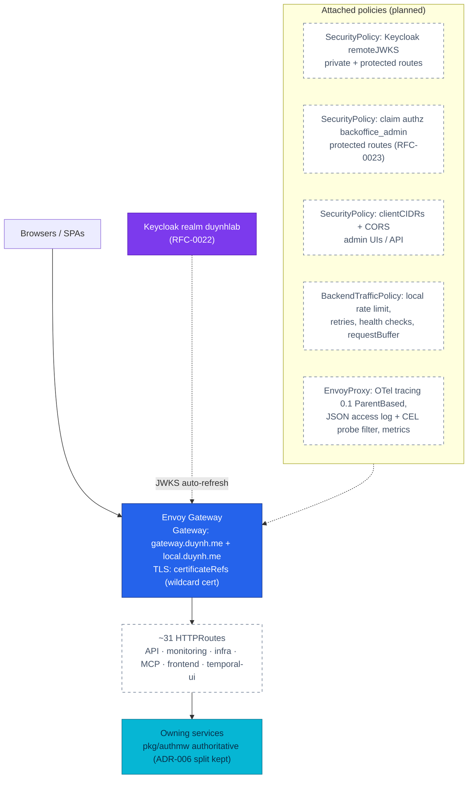

# RFC-0024 Replatform edge and identity: Envoy Gateway + Keycloak, one greenfield cutover

| Status | Scope | Research | Created | Last updated |
|--------|-------|----------|---------|--------------|
| implemented | platform-wide | [./research.md](./research.md) — gate passed, owner signed off 2026-08-11 | 2026-08-10 | 2026-08-25 |

> **Every decision is a tradeoff.** This RFC replaces a mature, working edge (Kong OSS
> 3.9) with Envoy Gateway **and, in the same greenfield program, executes the Keycloak
> adoption designed by [RFC-0022](../RFC-0022/README.md)** — retiring `auth-service`
> and its database (owner decision 2026-08-10: RFC-0022 does not run as a separate
> implementation). We take on one large coordinated rebuild (~150 Kong-touching files;
> 32 alert/recording expressions die with the `kong_*` metrics; the RFC-0022 fleet-wide
> string-`user_id` migration rides the same rebuild) and a quarterly upgrade duty, in
> exchange for a CNCF-governed edge whose free JWKS/OIDC/claim-authorization means the
> Keycloak integration is built exactly once — the edge never trusts `auth-service`
> at all. Costs are itemized in **Design Details → Drawbacks**.

## Prerequisites

- [research.md](./research.md) merged; [research review gate](./research.md#research-review-gate) ticked
- Context7 audit complete (see research [audit log](./research.md#context7-audit-log))
- Owner approved **ready for RFC** (direction chosen by owner 2026-08-10 — this RFC
  formalizes an activated exit trigger, see
  [RFC-0022 → Gateway distribution risk](../RFC-0022/research.md#gateway-distribution-risk-kong-oss--added-2026-08-10))
- **[RFC-0022](../RFC-0022/README.md) is the identity design record and is absorbed
  here for execution** (owner decision 2026-08-10): its realm/clients/claims/TTLs,
  string-`user_id` blast radius, `bootstrap.initdb` handover, and auth-service
  retirement plan are **inputs executed as phases of this RFC** — no standalone
  RFC-0022 implementation exists. Design questions stay answered there; this RFC
  answers only "how it ships".
- [RFC-0023](../RFC-0023/README.md) receives its identity prerequisites (client,
  role, claims, authmw normalization) from this RFC's program; its `protected` route
  class additionally gains an edge role gate (JWT claim authorization) as a second
  defense-in-depth layer.
- Mechanism deep-dive, criteria matrix, and blast-radius inventory live in
  [./research.md](./research.md) — this file decides.
- When Status → **`Accepted`**: expected ADRs in [Resulting decisions](#resulting-decisions);
  `docs/api/` impact is limited to `api.md` edge-exposure prose (routes/payloads
  unchanged); platform docs gain `docs/platform/envoy-gateway.md` and
  `docs/platform/kong-gateway.md` is **archived read-only**.

## Summary

Replace Kong OSS with **Envoy Gateway** (EG) as the platform's only edge: standard
Gateway API routing (Gateway + HTTPRoutes for all 31 ingress surfaces), SecurityPolicy
for edge security (Keycloak `remoteJWKS` verification with automatic key refresh, JWT
claim authorization on `protected` routes, CIDR fencing for admin UIs, CORS),
BackendTrafficPolicy for resilience and **local-first rate limiting** (no RLS/Redis at
the edge), and EnvoyProxy telemetry (OTel tracing with the fleet's ParentBased
sampling model, JSON access logs with CEL probe filtering, Prometheus + control-plane
metrics). The cutover is **greenfield** — no parallel-run: Kind environments rebuild
constantly and the production cluster contains no Kong.

The same program **deploys Keycloak and retires `auth-service`** exactly as RFC-0022
designed it (realm `duynhlab`, two PKCE clients, `customer`/`backoffice_admin` roles,
`sub` as string `user_id` fleet-wide, JIT profile provisioning, `platform_owner`
bootstrap handover) — the edge trusts the Keycloak realm from its first deployment via
`remoteJWKS`, so the Kong-era static-key ExternalSecret, the edge rotation runbook,
and any auth-service↔EG wiring are never built.

Kong is then **decommissioned completely**: HelmRelease, all 10 KongClusterPlugins,
the consumer and its static-key ExternalSecret, 32 Kong-metric alert/recording
expressions, the Kong dashboard, the OTTL deprecation filter, the Kyverno
`NET_BIND_SERVICE` exception, and the local-stack `kong.yml`. **Kong documentation is
kept and archived read-only** (banner, no rewrite) as platform history.

Motivation, the full criteria comparison (EG 14 / tie 4 / Kong 1 across 24 criteria),
the observability and rate-limiting deep-dives, and the ~150-file blast-radius
inventory are in [./research.md](./research.md).

## Motivation

Kong Inc. froze the OSS line in 2025: no 3.10+ exists in any form, the unlicensed
Enterprise image is unusable for this platform's GitOps flow (read-only Admin API),
and the 3.9 maintenance line has no published end date. RFC-0022 recorded the risk,
pinned `kong:3.9.3`, and defined an exit trigger; after a verified comparison the
owner activated that trigger **proactively** — moving before RFC-0022/0023 implement
means the Keycloak edge is built once on the surviving gateway, and the two artifacts
that exist only because of Kong's static-key limitation (the `auth-issuer-jwt` ESO
fan-out and the manual edge rotation step) are never built at all.

### Goals

- One edge, standard config: Gateway API resources for every route the platform
  exposes today (API, monitoring, infra, MCP, frontend, temporal-ui).
- Keycloak deployed and `auth-service` (+ its database) retired **in this program**,
  per the RFC-0022 design record — one identity, one edge, one rebuild.
- Keycloak verified at the edge via `remoteJWKS` — zero provisioned key material,
  rotation-transparent; services stay the authoritative verifier (ADR-006's split
  survives, re-homed by ADR-044).
- `protected` routes ([RFC-0023](../RFC-0023/README.md)) gain an edge role gate
  (`realm_access.roles` ∋ `backoffice_admin`).
- Local-first rate limiting with no new stateful components; admin-UI CIDR fence and
  CORS re-expressed as SecurityPolicy.
- Edge telemetry parity or better: ParentBased sampling at 0.1 (model unchanged —
  research-verified), standard JSON access logs with probe filtering at source
  (audit F-2), `envoy_*` metrics + first-party dashboards, control-plane metrics.
- Complete Kong decommission (configs + monitoring); docs archived read-only.
- local-stack keeps a one-command bring-up: EG standalone mode, with the
  owner-approved fallback of moving the E2E release-audit gate to Kind.

### Non-Goals

- Changing any service API, route path, host name, or the audience vocabulary —
  `/{service}/v1/{audience}/…` and `gateway.duynh.me`/`local.duynh.me` survive as-is.
- Re-deciding RFC-0022's identity design (realm, claims, TTLs, authmw, user_id
  migration shape) — that design record stands; this RFC only executes it.
- OIDC-at-edge for the SPAs (keycloak-js stays per RFC-0022/0023; EG's OIDC filter is
  recorded capability, not adopted).
- Global rate limiting / RLS in the MVP (explicit escape hatch with a trigger).
- Service mesh, east-west mTLS ([RFC-0020](../RFC-0020/)/[RFC-0006](../RFC-0006/)
  territory), ext_authz/OPA adoption.
- Rewriting archived Kong docs or CHANGELOG history.

## Proposal

### Before → after

| Concern | Before (Kong OSS 3.9, deployed) | After (Envoy Gateway) |
|---------|--------------------------------|------------------------|
| Routing | 31 Ingresses, `ingressClassName: kong`, `konghq.com/*` annotations | Gateway (per host class) + ~31 HTTPRoutes, standard Gateway API |
| Edge JWT (RFC-0022) | `jwt-edge` plugin + `KongConsumer auth-issuer` + static realm key via ESO | SecurityPolicy `jwt.providers[].remoteJWKS` → realm JWKS; **no secret, no rotation step** |
| Protected routes (RFC-0023) | signature+exp only | + JWT claim authz: `backoffice_admin` in `realm_access.roles` (edge 403), service still authoritative |
| Admin-UI fence | `ip-restriction-internal` + `rate-limiting-admin` | SecurityPolicy `clientCIDRs` + BTP local rate limit |
| CORS | `cors-policy` (twin cluster/local configs) | SecurityPolicy `cors` (same YAML both environments) |
| Rate limiting | `rate-limiting` redis policy → Valkey db 1, per-client-IP, fail-open | **BTP local** token bucket per route (numbers halved for 2 replicas); X-RateLimit draft-03 headers; global+RLS = documented escape hatch |
| Request size | `request-size-limiting-api` 10 MB | BTP `requestBuffer: 10Mi` (413) |
| Security headers / request ID | `response-transformer` + `correlation-id` plugins | HTTPRoute `ResponseHeaderModifier` + Envoy native `x-request-id` |
| Resilience | 5× KongUpstreamPolicy + 25 Service annotations | BTP retries/timeouts/active+passive health checks |
| TLS | wildcard cert mounted via `secretVolumes`/`ssl_cert` | Gateway `certificateRefs` (same cert-manager Certificate) |
| Edge tracing | OTel plugin, 0.1 sampling, W3C inject | EnvoyProxy OTel tracing, `samplingRate: 0.1`, **ParentBased default** (model identical), `customTags` |
| Access logs | bespoke `kong_json` (11 fields), unfilterable | Envoy default JSON (richer) + **CEL filter drops probe logs at source** |
| Metrics | `kong_*` + `job="kong"` relabel, out-of-tree dashboard | `envoy_*` + control-plane metrics + 4 first-party dashboards |
| Local gateway | `kong:3.9` + 283-line `kong.yml` dialect | EG **standalone** container reading the same Gateway API YAML (spike; fallback: E2E gate → Kind) |
| Distribution | frozen line, unannounced EOL | quarterly minors, live patch streams, CNCF governance |

### Resource mapping (implementation checklist)

| Kong resource (today) | Envoy Gateway target |
|-----------------------|----------------------|
| `KongClusterPlugin jwt-edge` + `KongConsumer` + `ExternalSecret auth-issuer-jwt` | SecurityPolicy `jwt` (remoteJWKS) on private/protected HTTPRoutes — **secret deleted** |
| `cors-policy` (global) | SecurityPolicy `cors` on the API Gateway |
| `ip-restriction-internal` | SecurityPolicy `authorization.clientCIDRs` on admin/monitoring/MCP routes |
| `rate-limiting-api` / `rate-limiting-admin` | BTP `rateLimit.local` (halved numbers; per-route buckets — semantics change recorded in research) |
| `request-size-limiting-api` | BTP `requestBuffer` |
| `correlation-id` | Envoy native `x-request-id` (present in default access log) |
| `security-headers` (response-transformer) | HTTPRoute `ResponseHeaderModifier` filter |
| `prometheus-metrics` | EnvoyProxy metrics (Prometheus endpoint) + ServiceMonitor |
| `opentelemetry-tracing` | EnvoyProxy `telemetry.tracing` (OTLP gRPC 4317, samplingRate 0.1, customTags) + access-log OTel sink where useful |
| 5× `KongUpstreamPolicy` + `konghq.com/{connect,read,write}-timeout/retries` Service annotations | BTP `retry`/timeouts/`healthCheck` per domain ResourceSet template |
| 31 Ingresses (incl. `configs/temporal/ingress.yaml`) | Gateway + HTTPRoutes, grouped: `gateway.duynh.me` (API), `local.duynh.me` (SPA), admin hosts |
| `helmrelease.yaml` (chart kong 3.2.0) + HelmRepository | `gateway-crds-helm` (Gateway API standard channel) + `gateway-helm` (OCI) HelmReleases; Flux edges `cert-manager → gateway-api-crds → envoy-gateway → envoy-gateway-config` |
| 11 NetworkPolicies (`metadata.name: kong`) | re-pointed at the EG namespace — swept with a checklist (silent-blackhole risk) |
| Kyverno `PolicyException kong-openbao` (NET_BIND_SERVICE) | expected **droppable** for EG (verify at implementation) |
| `local-stack/gateway/kong.yml` + `gateway` compose service | EG standalone container + Gateway API resource files (spike outcome decides; fallback approved) |

### Keycloak integration (the RFC-0022 join point)

The realm issuer and JWKS URI from RFC-0022 plug directly into SecurityPolicy;
an in-cluster Keycloak with the platform CA uses the `Backend` + `BackendTLSPolicy`
pattern (per the official Backend/BackendTLSPolicy docs). RFC-0022's rollout step 5
("re-point Kong's edge credential at the realm public key") is **replaced** by "attach
the SecurityPolicy JWT provider"; its rotation runbook keeps only the realm-side key
procedure. `pkg/authmw` and all service-side behavior are untouched.

## Architecture & Diagrams

### Target edge topology (planned)

### Cutover phases (greenfield — dependency order, not a project plan)

```mermaid
flowchart LR
    P0["P0 PoC Kind:<br/>CRDs + EG + scratch Keycloak<br/>remoteJWKS + claim-authz spike"] --> P1["P1 Identity foundation:<br/>Keycloak deploy + realm import<br/>+ platform-db + bootstrap handover"]
    P1 --> P2["P2 Edge core:<br/>Gateway + HTTPRoutes + policies<br/>trusting the realm from day one"]
    P2 --> P3["P3 Fleet identity cutover:<br/>authmw retarget + string user_id<br/>+ keycloak-js + seeds"]
    P3 --> P4["P4 Telemetry cutover:<br/>envoy_* rules + dashboards<br/>+ Vector schema + sampling"]
    P4 --> P5["P5 Decommission:<br/>Kong (configs+monitoring)<br/>+ auth-service (+auth DB)"]
    P5 --> P6["P6 local-stack + docs:<br/>standalone spike or E2E→Kind;<br/>envoy-gateway.md, archives"]

    classDef planned fill:#fff,color:#475569,stroke:#64748b,stroke-dasharray:5 5;
    class P0,P1,P2,P3,P4,P5,P6 planned;
```

Each phase is one PR train; P1/P3 execute the RFC-0022 design record (its rollout
steps map 1:1 onto these phases); P4 ships **with** the P2/P3 cutovers per area so no
route runs without its alerts (the operability-is-part-of-the-change rule).

## Design Details

### Rate limiting — local-first (decided)

Local token buckets per route replace the Valkey-backed per-client counters. The
semantic change is stated plainly: no per-IP fairness (local mode has no `Distinct`
matching), and per-instance buckets mean the effective ceiling ≈ configured × replica
count — so configured numbers are halved for `replicaCount: 2`. For this platform's
traffic (a handful of clients behind one NAT) per-IP fairness was decorative; the edge
loses its last Redis dependency and the RLS component is never deployed. **Escape
hatch:** adopt global rate limiting (EnvoyGateway `rateLimit.backend: Redis` → Valkey
db 1 + RLS) if a demonstrated multi-client fairness need appears; the trigger is a
real abuse incident from distinct sources, not speculation. `X-RateLimit` draft-03
headers replace Kong's `RateLimit-*` in the CORS expose list; the E2E audit's request
pacing re-derives from the new numbers.

### Observability cutover

The 13 alerts + 20 recording rules on `kong_*` are rewritten on `envoy_*` equivalents
in the same PR train as the route cutover, using EG's four first-party Grafana
dashboards as the reference for expression shapes; the alert catalog §2 is rewritten.
Vector's `kong_json` parsing maps once onto the Envoy default JSON schema (richer:
`response_flags`, `upstream_cluster`, `route_name`); a CEL `matches` filter drops
successful probe access logs at source (closing audit F-2's biggest volume). Tracing:
`samplingRate: 0.1` cluster / 1.0 local with the confirmed ParentBased default — the
fleet's sampling model is unchanged (F-7); span semconv modernizes (F-8);
trace queries pinned to `service.name="kong"` update with the cutover. The
`filter/kong_redis_deprecation` OTTL processor is deleted.

### local-stack and the E2E gate (decided fallback)

Spike EG **standalone mode** as the compose gateway: one container
(`envoyproxy/gateway:<pin>`, file provider + host infrastructure) reading the same
Gateway API YAML as the cluster — killing today's second config dialect. Spike
exit criteria: all local routes + JWT verification + local rate limit + JSON access
logs function under compose with healthchecks the `depends_on` graph can consume.
**If the spike fails** (feature gaps in standalone mode): per owner decision, the
**E2E release-audit gate moves to Kind** (`local-stack/docs/e2e-audit.md` re-scoped;
compose keeps services + a minimal pass-through for developer convenience). Either
way `kong:3.9`, `kong.yml`, and the `kong health` healthcheck are removed.

### Identity cutover — executing the RFC-0022 design record (P1/P3)

Nothing is re-designed here: Keycloak deployment (realm import with fixed demo UUIDs,
database on `platform-db` connected direct, `platform_owner` bootstrap handover,
Kyverno-conformant workload), the `pkg/authmw` retarget (issuer/JWKS env swap,
`realm_access.roles` normalization), the fleet-wide string-`user_id` migration
(5 INTEGER columns, 2 numeric protos, `pkg/idempotency`, 9 strconv sites, Temporal
inputs — greenfield rebuild sidesteps in-flight history), the frontend `keycloak-js`
swap, and JIT profile provisioning all follow
[RFC-0022](../RFC-0022/README.md)/[its research](../RFC-0022/research.md) verbatim.
What changes versus RFC-0022's original rollout: its step 5 ("re-point Kong's edge
credential") **does not exist** — the P2 edge trusts the realm from first deployment —
and its removal list gains nothing new; `auth-service` and its database retire in P5
alongside Kong.

### Kong + auth-service decommission and docs archive (decided)

Deleted outright: `controllers/kong/` HelmRelease + HelmRepository, all
`configs/kong/` CRs, the consumer's ExternalSecret, the 32 metric expressions +
`prometheusrules/kong/`, the Kong Grafana dashboard CR, the OTTL Kong filter, the
Kyverno exception, `local-stack/gateway/kong.yml`, and the `job="kong"` relabel —
**plus the entire auth-service surface per RFC-0022's removal list** (deployment,
compose service, routes, seeds, NetworkPolicy, `auth` database + role after the
bootstrap handover, `JWT_PRIVATE_KEY_PEM` ESO paths).
Re-pointed: 11 NetworkPolicies, `flux-ui.sh` port-forward, MCP RBAC namespace list,
CORS origins (unchanged values, new home). **Archived read-only, never rewritten:**
`docs/platform/kong-gateway.md` (banner: *"Archived (RFC-0024) — describes the
retired Kong OSS edge, kept as history"*), `docs/api/auth.md` (archived per
RFC-0022), ADR-003/ADR-006 (superseded-by links), RFC-0009 (one more
superseded-in-part note), CHANGELOG history (append-only as always).

### Drawbacks (the cost side, stated plainly)

- A real migration across ~150 files with one L-sized risk area (observability
  rewiring) — sequenced, but not small.
- Quarterly upgrade duty (~2 lines/year) replaces "pin and forget" (owner: accepted).
- Per-client rate-limit fairness is lost in local mode (documented escape hatch).
- Standalone mode is young; the local-stack story may end up split (compose for
  services, Kind for the E2E gate) — accepted in advance.
- Team knowledge resets: Kong plugin intuition → Gateway API + Envoy semantics
  (response_flags literacy, xDS debugging).

## Security considerations

- The ADR-006 defense-in-depth split is preserved and strengthened: edge does
  signature/iss/aud/exp via live JWKS (better than signature+exp today) plus role
  claims on `protected`; services remain authoritative (`pkg/authmw` untouched).
- Static key material leaves the edge entirely — one fewer secret, one fewer ESO
  path, no Kong-shaped credential Secret.
- Admin-UI exposure keeps the CIDR fence semantics (same ranges), now with
  `defaultAction: Deny` explicitness.
- Kyverno/PSS: EG workloads meet the standard admission bar; the Kong
  `NET_BIND_SERVICE` PolicyException is expected to drop (verify, then delete +
  update the exceptions catalog).
- NetworkPolicy re-pointing is the highest-silence risk (traffic blackholes) — the
  11-file sweep is a named implementation checklist item with a Kind verification.
- Local rate limiting cannot fail open or closed (in-process) — removes the
  fail-open Redis dependency the edge has today.

## Observability & SLO impact

Covered in Design Details → Observability cutover: 32 expressions rewritten, alert
catalog §2 replaced, dashboards swapped to first-party + control-plane metrics added,
Vector schema re-mapped once, F-2/F-7/F-8 all improved or preserved. During each
cutover PR train the affected area's alerts land in the same PR — no route runs
unwatched. Post-migration signals to keep: edge 4xx/5xx and latency percentiles
(envoy histograms), per-route 429 counts, JWKS fetch failures (new — worth an alert),
control-plane reconcile errors.

## Rollout & rollback

Greenfield cutover in seven PR trains (diagram above): P0 PoC (Kind: CRDs + EG +
scratch Keycloak + remoteJWKS/claim-authz spike) → P1 identity foundation (Keycloak
per the RFC-0022 design: realm import, platform-db, bootstrap handover) → P2 edge
core (Gateway, all HTTPRoutes, SecurityPolicies trusting the realm, BTP — Kong
deleted from the cluster chain in the same train) → P3 fleet identity cutover
(authmw retarget, string user_id, keycloak-js, seeds) → P4 telemetry
(same-PR-per-area with P2/P3 slices) → P5 decommission sweep (Kong + auth-service:
secrets, NetworkPolicies, exceptions, scripts, auth DB after handover) → P6
local-stack + docs (spike outcome or E2E-gate move; envoy-gateway.md; archives).
**Rollback** is source-level per train: revert the PR train and rebuild (`make up` /
compose rebuild) — the same greenfield property that makes the cutover cheap makes
reverts cheap; no dual-gateway or dual-issuer state ever exists.

## Testing / verification

- **PoC/spike gates (P0/P6):** Keycloak JWT verify + claim authz demonstrated on
  Kind; standalone spike against explicit exit criteria.
- **Route parity:** scripted diff of every host/path/audience pair before/after
  (31 ingress surfaces incl. temporal-ui); 404/401/403 behavior per audience class
  re-asserted; the local bare-prefix trap class of bug checked by test, not eyeball.
- **Auth:** valid/invalid/expired Keycloak tokens at edge + service (both layers);
  `protected` role gate 403s without `backoffice_admin`; realm key rotation with no
  edge action.
- **Rate limit:** halved numbers verified per instance; 429 + X-RateLimit headers;
  E2E pacing re-derived.
- **Telemetry:** every rewritten alert fired synthetically or by injection where the
  platform already has drills; trace continuity SPA→edge→service (ParentBased);
  access-log pipeline end-to-end into VictoriaLogs/ClickHouse; probe-filter CEL
  proven by volume delta.
- **NetworkPolicy sweep:** scripted connectivity matrix from the EG namespace
  (reuse the `db-isolation-sweep` pattern).
- **Identity (RFC-0022's test plan executes here):** realm import determinism on
  clean rebuild; refresh rotation/reuse-revocation; ownership scoping with string
  subjects end-to-end (HTTP → gRPC → DB → Temporal); JIT profile fallback/upsert;
  auth-service absent from build/route/deploy/health/docs.
- **E2E:** full local-stack release audit (or its Kind successor per P6) — all
  A/B/C rows pass before any tag.

## Resulting decisions

| Decision | ADR | Status |
|----------|-----|--------|
| Envoy Gateway is the platform edge; Gateway API is the routing config model (supersedes ADR-006's Kong binding — the edge-coarse/service-authoritative split survives) | [ADR-044](../../adr/ADR-044-envoy-gateway-platform-edge/) | Accepted |
| Edge rate limiting is local-first (no RLS/Redis); global is an escape hatch behind a recorded trigger | [ADR-045](../../adr/ADR-045-local-first-edge-rate-limiting/) | Accepted |
| The E2E release-audit gate moves to Kind if compose cannot carry the edge (standalone spike fails) | [ADR-046](../../adr/ADR-046-e2e-gate-kind-fallback/) | Accepted |

Numbering note (2026-08-11): the RFC text originally reserved 045–047 on the
assumption that RFC-0022 held 039–041 and RFC-0023 would take 042–044. ADR-039
(local-stack Temporal) and ADR-040 (Tempo chart) were consumed by unrelated
decisions in the meantime, so at acceptance the identity ADRs took
[041](../../adr/ADR-041-keycloak-platform-idp/)–[043](../../adr/ADR-043-oidc-browser-workload-trust/)
(owned by the RFC-0022 design record, Accepted with this review) and this RFC's
edge ADRs took 044–046; RFC-0023's future ADRs shift to 047–049.

## Implementation History

- 2026-08-10 — Research + provisional RFC created. Direction pre-decided by owner
  (activating the RFC-0022 gateway-risk exit trigger proactively): Envoy Gateway,
  greenfield cutover, local-first rate limiting, standards-first access-log schema,
  full Kong config/monitoring decommission with docs archived read-only, E2E-gate
  fallback to Kind. The owner's working reading material stays outside git by
  design.
- 2026-08-10 — **Scope expanded by owner decision: RFC-0022 is absorbed for
  execution.** Keycloak deployment and auth-service retirement run as phases P1/P3/P5
  of this program (RFC-0022 stays the identity design record); the edge never trusts
  auth-service — it is born trusting the Keycloak realm.
- 2026-08-11 — **Research gate passed; Status → Accepted.** ADRs created at
  Accepted with this review: identity [ADR-041](../../adr/ADR-041-keycloak-platform-idp/)/[042](../../adr/ADR-042-oidc-sub-as-user-id/)/[043](../../adr/ADR-043-oidc-browser-workload-trust/)
  (RFC-0022's design record) and edge [ADR-044](../../adr/ADR-044-envoy-gateway-platform-edge/)/[045](../../adr/ADR-045-local-first-edge-rate-limiting/)/[046](../../adr/ADR-046-e2e-gate-kind-fallback/)
  (renumbered from the reserved 039–041/045–047 — see Resulting decisions).
  Repo-verified corrections folded in: the `kong_*` rule set is 13 alerts +
  **20** recording rules, and the `platform-db` `bootstrap.initdb` contract
  already rests on `user`/`platform-db-user-secret` (see RFC-0022 history).
- 2026-08-12 — **P1 identity foundation** (#750). Keycloak as a raw Deployment in
  the new `identity` namespace, realm imported from a ConfigMap, `keycloak`
  database as a declarative CNPG triplet on `platform-db` connected **direct to
  `platform-db-rw`** (Agroal needs long-lived connections + server-side prepared
  statements, so the pooler is bypassed — RFC-0022 OQ#8). ServiceMonitor plus
  `KeycloakDown`/`KeycloakRestartLoop`; `keycloak-local` joins the Flux chain.
- 2026-08-12 — **P2 additive edge** (#751). Envoy Gateway stood up *alongside*
  Kong in namespace `envoy-gateway`, so the two edges coexisted for exactly one
  train.
- 2026-08-12 — **P3 compose arm + P6 arm A** (#752). The compose edge became
  Envoy Gateway in **standalone** mode and carried the full release audit, so
  [ADR-046](../../adr/ADR-046-e2e-gate-kind-fallback/)'s standalone-spike arm was
  taken, the Kind-fallback arm was never needed, and the 283-line `kong.yml`
  second dialect is gone. Keycloak joined compose in the same train.
- 2026-08-13 — **P2.3 Kong decommission** (#753). Envoy Gateway became the only
  edge: Kong's Flux Kustomizations, HelmRelease/HelmRepository, every
  `configs/kong/` CR, the `kong` Namespace, `kong-proxy-tls`, the
  `auth-issuer-jwt` ExternalSecret and the `temporal-ui` Ingress all deleted;
  11 NetworkPolicies re-pointed.
- 2026-08-13 — **P3 fleet identity cutover** (#756). Coordinated `pkg` wave:
  `authmw` retargeted to the realm via `OIDC_*`, and `user_id` = the token `sub`
  as a string end to end — five INTEGER columns, the notification and payment
  protos, `pkg/idempotency`, and Temporal workflow inputs.
- 2026-08-13 — **P5 decommission** (#760). `auth-service`'s entire cluster
  surface deleted: app manifest, `auth` namespace, the `auth` database triplet,
  the `auth-jwt-signing` ExternalSecret, its NetworkPolicy, and the
  `api-auth-public` HTTPRoute. The realm is the only issuer.
- 2026-08-13 — Adoption recorded (#757): five ADRs `Partial`, ADR-046
  `Complete`.
- 2026-08-14 — **Design amended after acceptance:
  [ADR-050](../../adr/ADR-050-separate-staff-identity-realm/) splits the
  workforce into its own realm** (#767). This RFC was written around a single
  realm; the as-built edge trusts **two** (`duynhlab` for `/private/`,
  `duynhlab-staff` for `/protected/`), which is why there are 13 JWT
  SecurityPolicies and not 7. Recorded here because the RFC body still reads
  single-realm.
- 2026-08-14 — **P4 telemetry cutover** completes: the local-stack edge is
  monitored natively (#772) and the edge alerts get the 10 runbooks they had
  shipped without (#780). `envoy_*` rules and dashboards replaced the `kong_*`
  set wholesale; alert-catalog §2 was rewritten.
- 2026-08-17 → 08-18 — **Post-acceptance ADR-044 amendments, both from running
  the edge on Kind.** #791 moved CRD delivery from Helm to vendored manifests +
  server-side apply (the release Secret measured ~2.06 MB against a 1 MiB
  ceiling) and fixed data-plane placement; #792 corrected rate-limit policies
  that were making every targeted route answer 500; #798/#799 purged the last
  Kong residue and bumped Envoy Gateway to v1.9.0 / Gateway API v1.6.1.
- 2026-08-25 — **Kind gate passed: ELIGIBLE.** Both gates ran on the pinned tags —
  the full compose A/B/C audit first, then K0–K6. All six linked ADRs reached
  `Adoption: Complete`, and RFC-0023 reached `implemented` on the same run. The
  gate also produced five findings, each fixed in the same PR: `make e2e` ran
  smoke before saga (C6/K5.2 fails on any from-scratch stack), compose C13
  queried a Vector stream ADR-060 had emptied, compose A15 was never runnable,
  the `AGENTS.md` Kustomization count was stale, and K4.6/K4.7 were blocked by
  an undocumented keychain step.
- 2026-08-24 — **Docs obligations closed.**
  [`docs/platform/keycloak.md`](../../../platform/keycloak.md) created (the
  deliverable named by ADR-041 and RFC-0022) and
  [`docs/api/identity.md`](../../../api/identity.md) added as the identity
  contract `docs/api/` never had. `envoy-gateway.md` gained the ADR-044/045/046
  links its validation row required. Recorded while writing them: the edge
  verifies issuer and signature but **not** the audience — no SecurityPolicy
  declares `audiences`, deliberately, and `api.md` had claimed otherwise.

**The Kind gate passed 2026-08-25 — Status → `implemented`.** A cluster built
from zero reported 23/23 Kustomizations, 101 pods, seed 8/8 and 13 images matching
their pins; every K0–K5 row is green (49/49 assertions). Three rows ran for the
first time: **K4.6/K4.7** (blocked since 2026-08-17 on an undocumented
System-keychain trust step, now documented), **the ADR-045 rate-limit row**, and
**SG.4**. `make down` was deliberately deferred — the owner kept the cluster up.
The last open box — the RFC-0022/0023 Kong cross-references — closed on
2026-08-25. It closed by **annotation rather than rewriting**: 851 Kong
references survive across `docs/proposals/`, and they were accurate on the day
each record was written. Rewriting them inside accepted records would be a
rewrite of the record, not a correction. What changed is the frame — a
supersession banner on the records whose *decision* named Kong, an edge
translation note where the design survives and only the vehicle moved, and a
corrected lead-in on the three diagrams whose surrounding text claimed the
present tense.

When Status → implemented, confirm:
- [x] Linked ADR(s) Adoption → Complete — all six on the 2026-08-25 Kind gate pass
- [x] `docs/api/api.md` edge-exposure prose updated; `docs/platform/envoy-gateway.md`
      created; `docs/platform/kong-gateway.md` archived banner in place
- [x] Runbooks: edge runbook replaced; alert catalog §2 rewritten; rotation runbook
      edge step deleted from `docs/secrets/openbao.md`
- [x] RFC-0022/0023 cross-references updated to the as-built edge — closed
      2026-08-25 by annotation, not rewriting: RFC-0022's banner now says its
      Current-state diagrams are the 2026-08-09 baseline, and RFC-0023 surfaces
      the edge-translation note it already carried in its own History. The audit
      that closed this box found the same staleness in eight more records and
      annotated all of them

## Related

- [./research.md](./research.md) — problem framing, criteria matrix, deep-dives, blast radius, Context7 audit
- [RFC-0022 — Keycloak as platform IdP](../RFC-0022/README.md) — the identity **design record**, absorbed here for execution (owner decision 2026-08-10)
- [RFC-0023 — Backoffice + protected APIs](../RFC-0023/README.md) — receives its identity prerequisites from this program; `protected` routes gain the edge role gate
- [RFC-0009](../RFC-0009/README.md) / [ADR-006](../../adr/ADR-006-rs256-jwt-kong-edge-auth/) — the Kong edge design being superseded in its vehicle, preserved in its principle
- [`docs/platform/kong-gateway.md`](../../../platform/kong-gateway.md) — archived read-only (2026-08-12)
- [`docs/platform/envoy-gateway.md`](../../../platform/envoy-gateway.md) · [`docs/platform/keycloak.md`](../../../platform/keycloak.md) · [`docs/api/identity.md`](../../../api/identity.md) — the as-built platform and contract docs

---
_Last updated: 2026-08-25 — Status → `implemented` on the Kind gate pass; all six ADRs Complete; the last open box (RFC-0022/0023 Kong cross-references) closed by annotation the same day._
