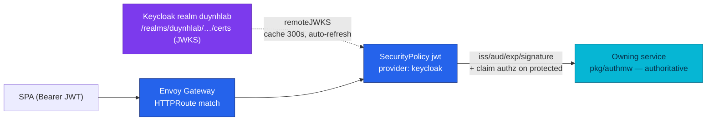
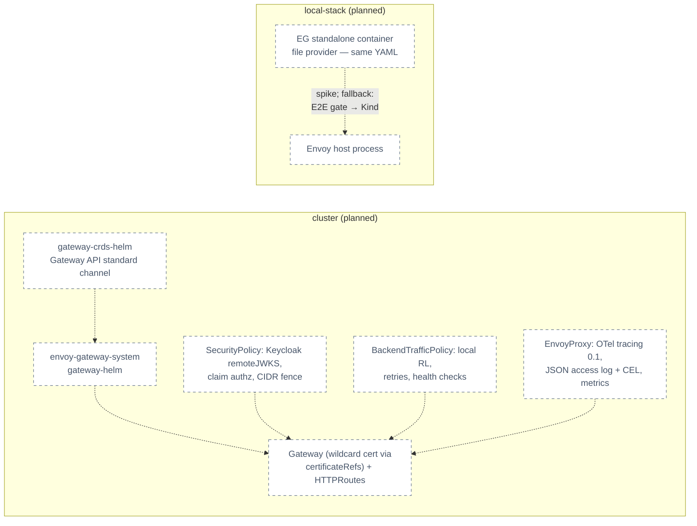

# RFC-0024 — Research: Envoy Gateway as the platform edge (Kong OSS exit)

| | |
|---|---|
| **RFC** | RFC-0024 |
| **Status** | researching |
| **Scope** | platform-wide |
| **Created** | 2026-08-10 |
| **Last updated** | 2026-08-10 |

> **Plain-language research.** This file is the audit trail for replacing Kong OSS with
> **Envoy Gateway** (EG) as the platform's edge — and, per the owner's 2026-08-10
> decision, for executing the **Keycloak adoption + auth-service retirement** designed
> by [RFC-0022](../RFC-0022/README.md) **inside the same greenfield program** (RFC-0022
> stays the identity design record; it does not run as a separate implementation). It exists because the exit trigger recorded in
> [RFC-0022 → Gateway distribution risk](../RFC-0022/research.md#gateway-distribution-risk-kong-oss--added-2026-08-10)
> was **activated proactively by the owner on 2026-08-10** after reviewing the
> comparison report. Every Envoy Gateway fact below is verified against official
> docs/Context7 or maintainer statements; every Kong fact against this repo's audited
> as-built state.
>
> This research is the committed record of the comparison; the owner's working
> reading material stays outside git by design. Every claim below carries its own
> official source (see References and the Context7 audit log).

---

## Table of contents

1. [Problem statement](#problem-statement)
2. [Reading path](#reading-path)
3. [What Envoy Gateway is](#what-envoy-gateway-is)
4. [Core components](#core-components)
5. [Core mechanism](#core-mechanism)
6. [Glossary](#glossary)
7. [Worked examples](#worked-examples)
8. [vs platform as-built](#vs-platform-as-built)
9. [Integration paths](#integration-paths)
10. [Alternatives](#alternatives)
11. [Open questions](#open-questions)
12. [FAQ](#faq)
13. [References](#references)
14. [Context7 audit log](#context7-audit-log)
15. [Research review gate](#research-review-gate)

---

## Problem statement

### Real-world trigger

| | |
|---|---|
| **Situation** | The platform's edge runs **Kong OSS 3.9** — a product line its vendor froze in 2025: no OSS 3.10+ exists (no source tags, images, or packages), "free mode" of the Enterprise image was removed (unlicensed `kong-gateway` runs with a **read-only Admin API**, which breaks this platform's KIC DB-less config push), and the 3.9 maintenance line has **no published end-of-support date**. Meanwhile [RFC-0022](../RFC-0022/README.md) moves identity to Keycloak, and Kong OSS's `jwt` plugin cannot fetch JWKS — leaving a permanent manual key-rotation step at the edge and a static-key ESO fan-out. |
| **Who feels it** | Platform (every Kong-edge decision is now built on a dead-ended distribution; the RFC-0022 rotation runbook exists *only because* of Kong OSS's static-key limitation); security (patch supply can stop without notice); the RFC-0023 Backoffice (its `protected` routes get signature+exp checks at the edge but no role awareness). |
| **Why now** | The owner reviewed the verified comparison (this folder's report) and **activated the exit trigger proactively** rather than waiting for the 3.9 line to die: migrating before RFC-0022/0023 implement means the Keycloak edge integration is built **once, on the survivor** — no throwaway Kong credential wiring, no rotation runbook that gets deleted a quarter later. |
| **If we do nothing** | Every RFC-0022/0023 edge artifact (static realm key ESO fan-out, Kong rotation runbook, jwt-edge plugin config, protected-route Ingresses) is built on Kong and rebuilt later anyway; the 32 Kong-metric alert/recording expressions keep accruing; and the platform stays one unpatched CVE away from a forced, unplanned migration. |

> **In plain terms:** our gateway brand stopped selling the free model we drive. The
> spare parts still come, but nobody says for how long — and we're about to install a
> new engine (Keycloak). Better to move the engine into the new car now than bolt it
> into the discontinued one and move both later.

**Example triggers:**

- **Design review:** RFC-0022's rotation runbook has a Kong-only manual edge step;
  under any JWKS-capable edge that entire section deletes itself.
- **Vendor risk:** Kong's 2025 distribution change ([discussion #14405](https://github.com/Kong/kong/discussions/14405),
  [#14628](https://github.com/Kong/kong/discussions/14628)) arrived unannounced —
  the next change could too.
- **Ops:** the edge is the fleet's tracing sampling authority and access-log source;
  its telemetry stack (pre-1.21 semconv spans — audit F-8; unfilterable probe access
  logs — F-2) is frozen with 3.9.

### What homelab practice proves

- Can Gateway API resources (Gateway/HTTPRoute) + EG policy CRDs express the entire
  Kong surface this platform actually uses (31 Ingresses, 10 cluster plugins, 5
  upstream policies) — with no Enterprise features and no Lua?
- Does EG's SecurityPolicy verify **Keycloak** tokens with `remoteJWKS` end-to-end
  (auto key refresh, claim-based role authz for RFC-0023's `protected` class)?
- Does the **ParentBased** default sampler keep the fleet's tracing model (edge =
  sampling authority at 0.1, services parent-based) without redesign?
- Can EG **standalone mode** (file provider) carry the local-stack compose gateway —
  and if not, does moving the E2E release-audit gate to Kind hold?

---

## Reading path

1. [What Envoy Gateway is](#what-envoy-gateway-is) → [Core mechanism](#core-mechanism)
2. [vs platform as-built](#vs-platform-as-built) (criteria matrix → observability →
   rate limiting → blast radius) → [Alternatives](#alternatives)
3. [Open questions](#open-questions) → [Research review gate](#research-review-gate)

---

## What Envoy Gateway is

Envoy Gateway is the Envoy project's official way to run **Envoy Proxy as an
application gateway**, configured through the Kubernetes **Gateway API**
(GatewayClass/Gateway/HTTPRoute) plus a set of policy-attachment CRDs for everything
the standard API doesn't cover (SecurityPolicy, BackendTrafficPolicy,
ClientTrafficPolicy, EnvoyProxy, Backend). It is CNCF-governed (Envoy is a graduated
project), maintained by multiple vendors (Tetrate, Docker, …), releases quarterly with
live patch streams (v1.7.0→1.7.5, v1.8.0→1.8.3), and also supports a **standalone
mode** (file provider + host infrastructure) for running outside Kubernetes.

> **In plain terms:** Envoy is the engine half the cloud already runs at the data
> plane; Envoy Gateway is the official steering wheel for using it as a front door.
> Routes and policies are plain Kubernetes YAML in the standard Gateway API dialect —
> if we ever changed gateways again, the routes themselves would come with us.

---

## Core components

| Component | Role |
|-----------|------|
| **GatewayClass / Gateway** | The edge instance: listeners, TLS `certificateRefs` (replaces Kong's `secretVolumes` + `ssl_cert` mount of `kong-proxy-tls`). |
| **HTTPRoute / GRPCRoute** | Standard routing (replaces 31 `ingressClassName: kong` Ingresses + `konghq.com/*` annotations). |
| **SecurityPolicy** | Edge security per Gateway or per route: JWT (`remoteJWKS`, `claimToHeaders`), OIDC, API key/Basic auth, CORS, authorization rules (JWT claims/scopes, client CIDRs), ext_authz (replaces `jwt-edge`, `cors-policy`, `ip-restriction-internal`). |
| **BackendTrafficPolicy** | Retries, timeouts, active+passive health checks, **rate limiting (local/global)**, request buffer limit (replaces 5× KongUpstreamPolicy + 25 Service annotations + `rate-limiting-*` + `request-size-limiting-api`). |
| **ClientTrafficPolicy** | Downstream connection behavior, buffer limits, header options. |
| **EnvoyProxy** | Data-plane telemetry and infra: Prometheus/OTel metrics, access-log formats/sinks/CEL filters, OTel tracing (`samplingRate`, `customTags`), replicas/resources (replaces the Kong HelmRelease telemetry env block + `opentelemetry-tracing` + `prometheus-metrics` plugins). |
| **Backend + BackendTLSPolicy** | Non-Service backends and upstream TLS/CA config — the documented pattern for pointing `remoteJWKS`/OIDC at an in-cluster Keycloak with a private CA (official docs). |
| **Envoy RLS** (optional) | The global rate-limit service (Redis-backed) — only deployed if global rate limiting is adopted; **not in the MVP** (see rate-limit deep-dive). |

---

## Core mechanism

### Keycloak token verification at the edge — the RFC-0022 integration



> **In plain terms:** the edge fetches Keycloak's public keys the same way the Go
> services already do — automatically, with a cache. Realm key rotation becomes
> invisible to the edge. The two artifacts RFC-0022 had to design *around* Kong — the
> static-key `ExternalSecret auth-issuer-jwt` and the two-step rotation runbook —
> stop existing. Services remain the authoritative verifier (ADR-006's
> defense-in-depth split survives; only the vehicle changes).

On RFC-0023's `protected` routes, the same SecurityPolicy adds an authorization rule:
`principal.jwt.claims: [{name: realm_access.roles, valueType: StringArray, values:
[backoffice_admin]}]` — the edge becomes role-aware (403 before the request enters the
cluster), while the in-service `MiddlewareRequireRole` stays the authority.

### Config model — how the pieces attach

Gateway API resources describe *where traffic goes*; EG policies attach to a Gateway
(fleet-wide, like today's `global: "true"` Kong plugins) or to individual routes (like
today's per-Ingress `konghq.com/plugins` annotation) via `targetRefs`/`targetSelectors`.
The same YAML dialect drives the cluster (Kubernetes provider) and — in standalone
mode — a Docker container reading the resources from files, which is the candidate
replacement for `local-stack/gateway/kong.yml`'s bespoke declarative format.

---

## Glossary

| Term | In plain English |
|------|------------------|
| Gateway API | The Kubernetes-standard successor to Ingress: typed routes, explicit Gateway objects, portable across implementations. |
| Policy attachment | EG's pattern for extras: a policy CR points at a Gateway or route via `targetRefs` instead of annotations. |
| `remoteJWKS` | The edge fetches and caches the IdP's public keys from a URL (default 300 s cache) — no provisioned static key. |
| `claimToHeaders` | Copy a JWT claim (nested paths supported) into a request header for upstreams or routing. |
| ext_authz | Envoy's hook to delegate allow/deny to an external service (gRPC or HTTP; OPA is the canonical example). |
| Local rate limit | A token bucket **inside each Envoy instance** — no shared state, no extra component. |
| Global rate limit | Counters shared across instances via the Envoy RLS service + Redis — exact, supports per-client `Distinct` buckets. |
| ParentBased sampler | Tracing: respect the caller's sampling decision if one exists; apply the ratio only for new (root) traces — the fleet's current model with Kong as root. |
| Standalone mode | EG outside Kubernetes: Gateway API resources from files, Envoy as a host process — Docker-runnable. |
| RLS | Rate Limit Service — the separate Envoy component that global rate limiting requires. |

---

## Worked examples

> **Not deployed** — syntax and mechanism only.

**The `jwt-edge` replacement** (Kong: `KongClusterPlugin jwt` + `KongConsumer` +
static-key `ExternalSecret`; EG: one policy, zero secrets):

```yaml
apiVersion: gateway.envoyproxy.io/v1alpha1
kind: SecurityPolicy
metadata:
  name: private-routes-jwt
spec:
  targetRefs:                      # attach per-route, like konghq.com/plugins today
    - group: gateway.networking.k8s.io
      kind: HTTPRoute
      name: api-cart
  jwt:
    providers:
      - name: keycloak
        issuer: https://id.duynh.me/realms/duynhlab
        remoteJWKS:
          uri: https://id.duynh.me/realms/duynhlab/protocol/openid-connect/certs
          # in-cluster/private-CA variant: backendRefs + BackendTLSPolicy
```

**The `protected`-class upgrade for RFC-0023** (edge role gate — impossible on Kong OSS):

```yaml
  authorization:
    defaultAction: Deny
    rules:
      - action: Allow
        principal:
          jwt:
            provider: keycloak
            claims:
              - name: realm_access.roles
                valueType: StringArray
                values: [backoffice_admin]
```

**The admin-UI fence** (`ip-restriction-internal` + `rate-limiting-admin` today):

```yaml
  authorization:
    defaultAction: Deny
    rules:
      - action: Allow
        principal:
          clientCIDRs: [10.0.0.0/8, 172.16.0.0/12, 192.168.0.0/16, 127.0.0.1/32, "fc00::/7"]
---
apiVersion: gateway.envoyproxy.io/v1alpha1
kind: BackendTrafficPolicy
spec:
  rateLimit:
    local:
      rules:
        - limit: { requests: 1200, unit: Minute }
```

---

## vs platform as-built

The Kong column is the audited as-built state (manifests + `local-stack/gateway/kong.yml`
+ the 2026-08-07 telemetry audit); the EG column is official-docs-verified (2026-08-10).
The full 24-criteria matrix with per-cell sources was reviewed in the owner's
untracked Vietnamese report; this section keeps the decision-relevant rows and adds
the two deep-dives.

### Criteria matrix (condensed — 24 criteria scored in the review: EG 14 / tie 4 / Kong 1)

| Criterion | Kong OSS 3.9 (as-built) | Envoy Gateway v1.8 |
|-----------|--------------------------|---------------------|
| Distribution / CVE | 3.9 maintenance line only; `kong:3.9.3` (2026-08) ships but **no 3.10+ exists, EOL unannounced** | Live patch streams (v1.7.0→.5, v1.8.0→.3); quarterly minors, each line supported ~6 months — **upgrade duty ~2×/year (owner: accepted)** |
| Governance | Kong Inc. (proved it can withdraw OSS) | CNCF / Envoy project, multi-vendor maintainers |
| JWT + JWKS | Static `rsa_public_key` credential per issuer; no JWKS fetch | `remoteJWKS` auto-refresh (300 s cache), `backendRefs` + BackendTLSPolicy for in-cluster IdP, multi-provider, `extractFrom` cookies/headers |
| OIDC at edge | Enterprise-only | Free: full code flow, encrypted cookie session, auto refresh, logout + end-session discovery |
| Claim → header / claim authz | None | `claimToHeaders` (nested), authorization rules on claims (StringArray) + scopes |
| ext_authz | None | gRPC + HTTP, failOpen configurable (default closed), OPA-documented |
| IP / method / header authz | `ip-restriction` plugin only | `clientCIDRs` + header/method principals + GeoIP |
| Rate limiting | `rate-limiting` plugin, redis policy → Valkey db1 (per-client-IP counters, shared across 2 replicas, fail-open) | Local (in-process token bucket) + Global (RLS+Redis) — **see deep-dive below; semantics differ** |
| Config model | Ingress + vendor annotations + 10 KongClusterPlugin CRs; local = bespoke `kong.yml` | Standard Gateway API + policy CRDs; standalone mode reads the **same YAML** from files |
| Traffic policy | 5× KongUpstreamPolicy + 25 Service annotations | BackendTrafficPolicy: retries (backoff/retryOn), timeouts, active+passive health checks |
| Observability | `kong_*` metrics, `kong_json` nginx log, OTel plugin (frozen semconv — F-8) | Native Prometheus/OTel metrics + control-plane metrics, JSON access logs + **CEL filters** + OTel/ALS sinks, OTel tracing with ParentBased sampler — **see deep-dive below** |
| Non-K8s mode | Kong DB-less in compose (mature) | Standalone mode (file provider, Docker-runnable) — **new; spike required** |
| Dev portal / monetization | Neither has it at the free tier — not a differentiator | same |

### Observability / telemetry deep-dive

The edge is the fleet's tracing root and access-log source, so this was researched to
maintainer-statement depth:

| Aspect | Kong 3.9 as-built | Envoy Gateway v1.8 |
|--------|-------------------|---------------------|
| Span export | `opentelemetry` plugin → OTLP **HTTP 4318** | Envoy OTel tracer → OTLP **gRPC 4317** via `backendRefs` (the platform collector listens on both) |
| **Sampling model** | `tracing_sampling_rate: 0.1` (cluster) / 1.0 (local); Kong is the **fleet's root sampling authority** (audit F-7), services run ParentBased behind it | `samplingRate` with default sampler **`ParentBased(root=TraceIdRatioBased)`** — maintainer-confirmed in [discussion #8436](https://github.com/envoyproxy/gateway/discussions/8436): incoming `traceparent` flags are always respected. **Identical model — F-7 re-homing is a number copy, not a redesign** |
| Sampler options | One number | [Issue #8476](https://github.com/envoyproxy/gateway/issues/8476) **closed via PR #8529**: `telemetry.tracing.sampler` enum (AlwaysOn/AlwaysOff/ParentBased/TraceIdRatioBased) — verify the carrying release at adoption (> v1.8.3). Envoy layer additionally ships AlwaysOn/**CEL**/Dynatrace/ParentBased/TraceIdRatioBased samplers (WIP-marked) |
| Propagation | extract `[w3c, b3, jaeger, ot]`, inject `[w3c]` | W3C `traceparent` native; legacy B3/jaeger extraction not exposed — **non-issue for this fleet (everything is W3C)**, recorded for completeness |
| Semconv | Pre-1.21 on Kong spans (audit **F-8**), frozen forever with 3.9 | Actively maintained tracer — F-8 resolves by migration |
| Metrics | `kong_*` via prometheus plugin; **13 alerts + 19 recording rules keyed `job="kong"`** | `envoy_*` Prometheus pull (or OTel push); `ProxyMetrics` toggles; **control-plane metrics** (new capability); RateLimit observability page; **4 first-party Grafana dashboards** ship in `gateway-addons-helm` (today's Kong dashboard JSON lives in an out-of-tree repo) |
| Access logs | Bespoke `kong_json` (11 nginx-var fields; no route/service name — version-gated); no filtering (audit **F-2**: 96.2 % of exported log records were successful probe access logs) | Default JSON is richer (`response_flags`, `response_code_details`, `upstream_cluster`, `route_name`…); Text/JSON custom formats; **CEL `matches` filter at source** (solves F-2 where it starts); sinks: File / **OpenTelemetry** / ALS |
| Migration cost | — | The **32 rule expressions must be rewritten on `envoy_*`** and the Vector/VictoriaLogs/ClickHouse pipeline re-mapped to the Envoy JSON schema (owner: schema change accepted — standard formats preferred); the `filter/kong_redis_deprecation` OTTL processor becomes dead code and is deleted |

Three audit findings resolve by migration: **F-7 keeps its model** (ParentBased
default), **F-8 disappears** (live tracer), **F-2 gains a root-cause tool** (CEL match).

### Rate limiting deep-dive — local vs global (owner direction: local-first)

What the platform actually runs today: Kong `rate-limiting` with `policy: redis` —
**per-client counters** (identifier defaults to IP on anonymous routes) shared across
the 2 proxy replicas in Valkey db 1, `fault_tolerant: true` (fails open), 5 r/s / 100
r/min / 2 500 r/h on API routes and 1 200 r/min on admin UIs.

| Aspect | EG **Local** rate limit | EG **Global** rate limit |
|--------|--------------------------|---------------------------|
| Mechanism | Token bucket **inside each Envoy instance** | Envoy RLS service + Redis (Valkey reusable), shared descriptors |
| Extra components | **None** | +1 Deployment (RLS) + Redis dependency at the edge |
| Counter scope | Per route, **per instance** — with `replicaCount: 2` the effective ceiling is ≈ 2× the configured number (load-balancing dependent) | Exact, shared across all instances |
| **Per-client buckets** | `clientSelectors` match on path/headers, but **`Distinct` matching is NOT supported** — one bucket per route, not per IP/user (official docs) | `Distinct` header/CIDR selectors — per-client buckets like Kong today |
| Failure mode | Cannot fail — in-process | RLS down → configurable behavior; another failure mode to operate |
| Extras | `shared` cross-route buckets, `cost`, X-RateLimit draft-03 headers (per-rule toggle) | Same + `shadowMode` (dry-run) |
| Fit for this platform | The honest trade: today's per-IP fairness semantics are **not preserved** — a route gets one aggregate bucket. In practice the homelab edge sees single-digit clients behind one NAT, so per-IP fairness buys ~nothing; halving the configured numbers compensates the ×2 replica effect | Reserved as the **escape hatch**: adopt only when a real multi-client fairness need appears (trigger recorded in the RFC) |

**Direction (owner-approved):** local-only in the MVP — no RLS, no Redis coupling at
the edge (Valkey db 1's second consumer disappears); configured limits halved to
account for 2 replicas; `X-RateLimit` draft-03 headers replace Kong's `RateLimit-*`
in the CORS expose list; the E2E audit's 0.25 s pacing rule re-derives from the new
numbers.

### Kong footprint — migration blast radius (inventory 2026-08-10, ~150 files)

| Area | Scope | Size |
|------|-------|------|
| Controller/Flux | `controllers/kong/helmrelease.yaml` (153 L) → EG Helm (`oci://docker.io/envoyproxy/gateway-helm` + separate `gateway-crds-helm` for Gateway API CRDs, standard channel); HelmRepository swap; Flux edges `cert-manager → kong → kong-config` rebuilt; ns swap | M |
| Routing | **31 Ingresses** (13 API + 11 monitoring + 3 infra + 3 MCP + 1 frontend — plus the easy-to-miss `configs/temporal/ingress.yaml`) → Gateway + HTTPRoutes | M |
| Policies | 10 KongClusterPlugin → SecurityPolicy/BTP/CTP/EnvoyProxy/route filters; 5 KongUpstreamPolicy + 25 `konghq.com/*` Service annotations → BTP | M |
| Secrets | `ExternalSecret auth-issuer-jwt` (KIC-shaped) **deleted**; OpenBAO JWT fan-out halves | S ✅ |
| NetworkPolicies | **11 files** keyed `kubernetes.io/metadata.name: kong` re-pointed — silent-blackhole risk if missed | S ⚠️ |
| Observability | 13 alerts + 19 recording rules on `kong_*` rewritten; dashboards (out-of-tree JSON) → EG first-party set; Vector `kong_json` → Envoy JSON; OTTL kong filter deleted; sampling number copied | **L** (riskiest) |
| local-stack | `gateway` service (`kong:3.9`, 283-line `kong.yml`, 11 `service_healthy` deps, frontend gate) → EG standalone spike; **fallback (owner-approved): move the E2E release-audit gate to Kind** | M/L |
| Docs | `docs/platform/kong-gateway.md` (1 121 L) + ~80 referencing docs; ADR-003/ADR-006 need a superseding ADR; **owner direction: Kong docs stay, marked Archived/read-only** | L (spreadable) |
| Scripts/e2e | `flux-ui.sh` port-forward target; e2e pacing + edge-behavior assertions re-baselined | S |
| Other | Kyverno `NET_BIND_SERVICE` exception likely droppable ✅; MCP RBAC ns list; Valkey db 1 edge coupling removed (local-first RL) | S |

---

## Integration paths

All **planned** — no manifests exist yet.



Known constraints: Kyverno admission applies to EG workloads (pinned images, probes,
resources, PSS — the Kong `NET_BIND_SERVICE` exception is expected to drop);
cert-manager keeps issuing `*.duynh.me` (the Certificate CR survives; the mount
mechanism changes to `certificateRefs`); the Flux chain gains
`gateway-api-crds → envoy-gateway → envoy-gateway-config` edges mirroring today's
shape; greenfield cutover per the owner (Kind clusters are rebuilt constantly; the
production cluster has zero Kong today).

---

## Alternatives

| Option | Pros | Cons |
|--------|------|------|
| **Envoy Gateway** (selected direction) | Everything in the criteria matrix: JWKS/OIDC/claim-authz free, standard Gateway API, live patch streams, ParentBased sampler matching the fleet model, first-party dashboards, standalone mode candidate for compose | Quarterly upgrade duty (owner: accepted); standalone mode maturity unproven (spike; fallback approved); 32 observability expressions + Vector schema rework |
| **Stay on Kong OSS 3.9 pinned** | Zero work now; patches still flowing (3.9.3) | Frozen feature line, unannounced EOL, permanent static-key edge for Keycloak, RFC-0022/0023 edge artifacts built twice; the exit trigger owner already activated |
| **Kong Gateway Enterprise** | `openid-connect` plugin (JWKS at edge), vendor support | Enterprise pricing for one feature this design needs; unlicensed image is unusable for KIC DB-less (read-only Admin API); rejected in [RFC-0022 research](../RFC-0022/research.md#gateway-distribution-risk-kong-oss--added-2026-08-10) and re-confirmed here |
| **APISIX** | Apache-governed, free openid-connect plugin, active | Second config dialect (not Gateway API-native to the same depth), etcd default control plane (or standalone YAML), smaller k8s-Gateway-API story; loses the "standard YAML everywhere" prize that motivates the move |
| **Drop the edge JWT check entirely** | No edge auth to migrate | Gateway still needed for routing/rate-limit/TLS; discards ADR-006 defense-in-depth for ~zero savings once remoteJWKS exists |

**Owner decision (2026-08-10): Envoy Gateway, greenfield cutover.** The gate review
ratifies rather than reopens; APISIX stays recorded as the fallback vendor if EG ever
dead-ends the same way Kong did (the Gateway API routes would largely survive such a
move — that portability is itself part of this decision).

---

## Open questions

Owner-approved directions (2026-08-10) recorded per platform convention; the review
gate can still overturn any of them.

| # | Question | Direction |
|---|----------|-----------|
| 1 | Migration style | **Greenfield cutover, owner-approved** — no parallel-run: Kind rebuilds constantly, prod is Kong-free; one PR train per phase. **Combined program (owner, 2026-08-10): the RFC-0022 identity work executes here** — Keycloak foundation and fleet identity cutover are phases of this RFC, and `auth-service` retires alongside Kong |
| 2 | EG release line | Pin the newest supported minor at implementation (≥ v1.8.3, or the line carrying PR #8529's sampler config); accept quarterly upgrade duty (**owner: not a concern**); Renovate watches the chart pins |
| 3 | Rate limiting | **Local-only (owner-approved)** — no RLS/Redis at the edge; halve configured numbers for `replicaCount: 2`; X-RateLimit draft-03 headers; **global escape-hatch trigger**: a demonstrated multi-client fairness need (per-IP abuse from distinct sources) |
| 4 | local-stack gateway | Spike EG **standalone mode** (file provider — same Gateway API YAML as the cluster). **Owner-approved fallback: move the E2E release-audit gate to Kind** and let compose keep a thinner gateway story (`local-stack/docs/e2e-audit.md` scope updated at implementation) |
| 5 | Access-log schema | Adopt Envoy default JSON (richer, standard) — **owner: change freely, standards-first**; Vector/CH mappings updated once; add a CEL `matches` filter to drop probe access logs at source (F-2) |
| 6 | Kong decommission scope | **Delete all Kong configs and monitoring** (helmrelease, plugins, consumer, ESO secret, 32 rule expressions, dashboard CR, OTTL filter, Kyverno exception, HelmRepository, local `kong.yml`); NetworkPolicies re-pointed. **Docs are kept, marked Archived/read-only** — `docs/platform/kong-gateway.md` gets an archive banner, not a rewrite |
| 7 | ADR numbering | ADR-045 (EG as platform edge — supersedes ADR-006's Kong binding, keeps the defense-in-depth split), ADR-046 (local-first edge rate limiting), ADR-047 (E2E gate placement when compose can't carry the edge) — counting up past RFC-0023's 042–044 |
| 8 | Keycloak integration point | **RFC-0022 absorbed for execution (owner, 2026-08-10)**: the edge is born trusting the Keycloak realm via remoteJWKS — no static-key ESO, no Kong rotation runbook, and no auth-service↔EG wiring ever exists; auth-service + `auth` DB retire in this program's decommission phase |
| 9 | Sampling | Copy the model: EG `samplingRate` 0.1 cluster / 1.0 local, ParentBased default confirmed; adopt `sampler` enum config when the carrying release ships |
| 10 | Edge spans/semconv | Accept the newer semconv (F-8 fix); trace-dashboard queries referencing `service.name="kong"` update to the EG service identity in the same PR as the tracing cutover |

---

## FAQ

**What happens to RFC-0022?**

It becomes the identity **design record** and stops being a separate implementation:
the owner decided (2026-08-10) to execute Keycloak adoption + auth-service retirement
inside this RFC's greenfield program. Its design (realm, claims, TTLs, authmw,
string-`user_id` migration, bootstrap handover) is followed verbatim; the two
artifacts that existed solely because of Kong's static-key limitation (the
`auth-issuer-jwt` ExternalSecret and the edge rotation runbook step) are never built,
and the edge never trusts `auth-service` at all. RFC-0022's research already recorded
the enabling fact: *"nothing in the Keycloak decision locks us to Kong."*

**Why greenfield instead of a parallel migration?**

Because the platform's environments make parallel-run cost pure waste: Kind clusters
are torn down and rebuilt continuously, the production cluster contains no Kong at
all, and local-stack rebuilds from zero by design. The blast radius is managed by
sequencing PR trains per area, not by running two gateways.

**Do we lose per-client rate limiting?**

Technically yes (local mode has one bucket per route, no `Distinct`); practically the
homelab edge sees a handful of clients behind one NAT, so per-IP fairness was
decorative. The global RLS path is documented with an explicit activation trigger.

**What happens to the 1 121-line Kong doc and the Kong ADRs?**

Kept. The owner's direction is archive-not-delete for documentation: the Kong platform
doc gets an "Archived (RFC-0024)" banner and stays read-only history; ADR-003/ADR-006
get superseded-by links from ADR-045; RFC-0009 gains one more superseded-in-part note.
Configs and monitoring, by contrast, are deleted outright.

**Is the Envoy Gateway of today mature enough for the one thing Kong does well here (compose)?**

Unproven — that is the single honest unknown, and it has an owner-approved fallback:
if the standalone spike disappoints, the E2E release-audit gate moves to Kind, where
EG runs in its first-class environment.

---

## References

- Envoy Gateway: [docs](https://gateway.envoyproxy.io/docs/) · [SecurityPolicy concepts](https://gateway.envoyproxy.io/latest/concepts/gateway_api_extensions/security-policy/) · [security tasks](https://gateway.envoyproxy.io/docs/tasks/security/) · [observability tasks](https://gateway.envoyproxy.io/docs/tasks/observability/) · [rate limiting concepts](https://gateway.envoyproxy.io/docs/concepts/rate-limiting) · [standalone mode](https://gateway.envoyproxy.io/docs/tasks/operations/standalone-deployment-mode) · [release matrix](https://gateway.envoyproxy.io/news/releases/matrix/) · [Helm install](https://gateway.envoyproxy.io/docs/install/install-helm)
- Sampling: [discussion #8436](https://github.com/envoyproxy/gateway/discussions/8436) · [issue #8476 / PR #8529](https://github.com/envoyproxy/gateway/issues/8476) · [Envoy OTel samplers](https://www.envoyproxy.io/docs/envoy/latest/api-v3/config/trace/opentelemetry/samplers)
- Kong OSS status: [discussion #14405](https://github.com/Kong/kong/discussions/14405) · [#14628](https://github.com/Kong/kong/discussions/14628) · [Kong Gateway changelog](https://developer.konghq.com/gateway/changelog/)

---

## Context7 audit log

| Claim / section | Source checked | Result |
|-----------------|----------------|--------|
| SecurityPolicy JWT: `remoteJWKS` (300 s default cache, `backendRefs`, BackendTLSPolicy for private CA), `claimToHeaders` (nested), `recomputeRoute` | Context7 `/websites/gateway_envoyproxy_io` — API extension types + tasks | confirmed |
| OIDC filter: refresh default true, encrypted cookies default, logout/end-session discovery, `denyRedirect`, `passThroughAuthHeader` | Context7 — OIDC task + API types | confirmed |
| Authorization: JWT claims (`StringArray`) + scopes, `clientCIDRs`, header/method, GeoIP; `defaultAction` | Context7 — jwt-claim-authorization + restrict-ip tasks | confirmed |
| ext_authz gRPC+HTTP, `failOpen` default false, `statusOnError` | Context7 — ext-auth task + API types | confirmed |
| **Local rate limit does NOT support `Distinct` matching** (per-client buckets need global); per-route counters; `shared`/`cost`/X-RateLimit draft-03 options | Context7 — local-rate-limit task + RateLimitRule API | confirmed — drives the local-first trade-off wording |
| Global rate limit: EnvoyGateway config `rateLimit.backend.type: Redis` + RLS; `Distinct` selectors; `shadowMode` global-only | Context7 — global-rate-limit task + concepts | confirmed |
| Default tracing sampler = `ParentBased(root=TraceIdRatioBased)`; parent `traceparent` flags always respected | EG discussion #8436 (maintainer), fetched 2026-08-10 | confirmed |
| `telemetry.tracing.sampler` enum merged (AlwaysOn/AlwaysOff/ParentBased/TraceIdRatioBased) | EG issue #8476 → PR #8529 (closed), fetched 2026-08-10 | confirmed — carrying release to verify at adoption |
| Envoy-layer OTel samplers: AlwaysOn, CEL, Dynatrace, ParentBased, TraceIdRatioBased (WIP-marked) | envoyproxy.io OTel samplers page, fetched 2026-08-10 | confirmed |
| Access logs: File/OpenTelemetry/ALS sinks, Text/JSON custom formats, **CEL `matches`**, disable option; default JSON field set | Context7 — proxy-accesslog task + API types | confirmed |
| Metrics: Prometheus pull default + OTel sinks; `ProxyMetrics` toggles; control-plane metrics pages; 4 first-party Grafana dashboards in `gateway-addons-helm` | Context7 — proxy-metric + grafana-integration | confirmed |
| BackendTrafficPolicy: retry (backoff/retryOn), passive+active health checks, `requestBuffer` (413) | Context7 — retry/failover/CTP tasks | confirmed |
| Standalone mode: file provider + host infra, Docker-runnable (`envoyproxy/gateway:v1.8.2 server --config-path`) | Context7 — standalone-deployment-mode task | confirmed — maturity unproven, spike required |
| Install: `gateway-helm` + separate `gateway-crds-helm` (Gateway API standard channel), `--skip-crds` pattern | Context7 — install-helm/install-yaml | confirmed |
| Release cadence + support window (~6 months/line; v1.7 EOL 2026-08-05, v1.8 EOL 2026-11-08); patch streams v1.7.0–.5, v1.8.0–.3 | Release matrix page + `git ls-remote` tags, 2026-08-10 | confirmed |
| Kong OSS frozen at 3.9 (no 3.10+ tags/images); unlicensed kong-gateway = expired license, read-only Admin API | Re-used from RFC-0022 research audit rows (2026-08-10) | confirmed there |

---

## Research review gate

- [ ] Answers a **real-world problem** you'd recognize at work (on-call, design review,
      incident, scale, compliance) — not generic vendor marketing
- [ ] **Problem statement** names situation, who feels it, and cost of doing nothing
- [ ] At least **two alternatives** documented with tradeoffs
- [ ] **Platform as-built** section filled from manifests/docs (not boilerplate)
- [ ] Primary use-case direction stated (may remain "undecided")
- [ ] **Context7 audit** complete; footer date updated
- [ ] At least **one Mermaid** diagram; labels match deployed vs **planned** reality
- [ ] No Kubernetes manifest changes smuggled into this research file
- [ ] Owner sign-off: **ready for RFC**

---

_Last verified: 2026-08-10 (Context7 + official Envoy Gateway docs + GitHub threads + Docker Hub/git tags; Kong as-built from the 2026-08-10 repo inventory)._
