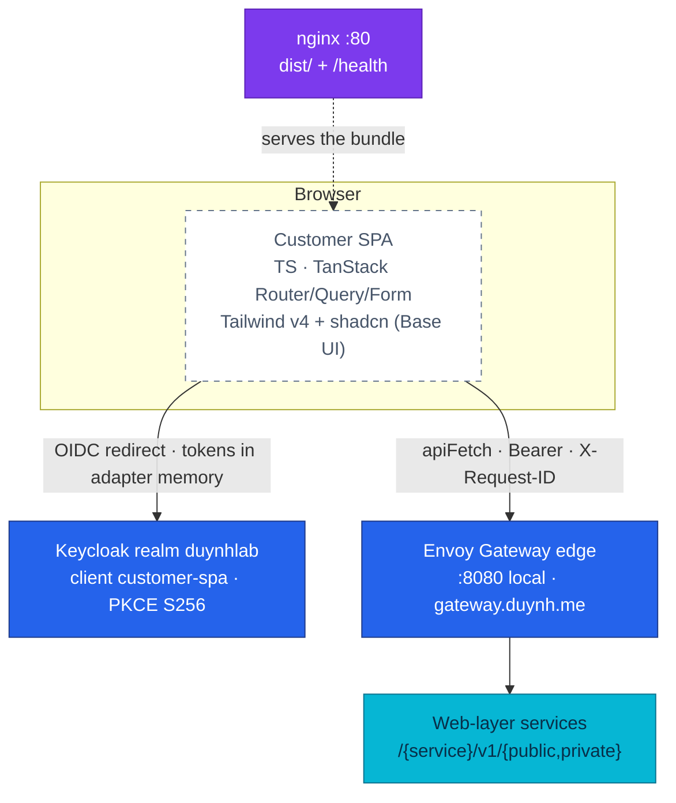

# RFC-0025 Converge the customer SPA on the Admin Portal's stack

| Status | Scope | Research | Created | Last updated |
|--------|-------|----------|---------|--------------|
| provisional | service:frontend | [./research.md](./research.md) — gate passed 2026-08-15 | 2026-08-15 | 2026-08-15 |

> **Every decision is a tradeoff.** This one buys a single frontend convention set
> and pays for it by rewriting every screen of the storefront at once, with no unit
> tests underneath and a redesign layered on top. The costs are stated in
> [Design Details → drawbacks](#drawbacks) and [Rollout & rollback](#rollout--rollback).

## Prerequisites

- [research.md](./research.md) merged; [research review gate](./research.md#research-review-gate) ticked
- Context7 audit complete (see research footer)
- Owner approved **ready for RFC**
- Mechanism deep dive stays in `./research.md` — this file decides and schedules
- Expected ADR: [`ADR-052`](../../adr/ADR-052-converge-the-customer-spa-on-the-portal-stack/).
  Expected `docs/api/` touch: [`microservices.md`](../../../api/microservices.md)
  § frontend only (a correction, not a contract change) — the platform's routes,
  payloads and envelopes are untouched by this RFC.

## Summary

Rewrite the customer SPA (`frontend`) onto the stack the Admin Portal already runs:
TypeScript strict, TanStack Router (file-based) + Query + Table + Form with zod,
Tailwind v4 + shadcn `base-nova` on Base UI, `lucide-react`, and Playwright + axe
against the real compose stack. React Router, SWR, axios, `react-hot-toast`, plain
CSS, JavaScript and **both mock layers** are removed. keycloak-js, the serving model
(Vite → `dist/` → nginx :80 with `/health`), the four build ARGs and every backend
contract stay exactly as they are. The storefront is **redesigned** on the shared
token system rather than re-skinned. One branch, one merge, one rollback point.

## Motivation

[ADR-049](../../adr/ADR-049-admin-portal-tanstack-spa/) chose the portal's stack and
recorded the resulting divergence as a knowingly accepted debt — "two frontend
convention sets in the platform **until/unless the customer SPA converges**" — with
an explicit revisit trigger for paying it back. The portal has since shipped its
RFC-0023 scope. This RFC exercises that trigger.

The tax is not theoretical. Every platform convention the backend trains introduced
— the shared error envelope, idempotent commands, protected-route conventions,
URL-as-state — now has two frontend implementations to write, review and verify. And
the storefront's two mock layers have already drifted from the contract in a way
that shipped: the E2E `/details` handler still returns the retired `stock` block
while the application moved to `availability`, so that suite has been exercising a
branch the real API no longer serves.

### Goals

1. One convention set for both SPAs: router owns URL state, Query owns server state,
   Form owns drafts, keycloak-js owns the session, one `ApiError` envelope.
2. The storefront gains what the portal already has: strict typing, request
   cancellation, validated search params, a real design system, light + dark.
3. "Green" means one thing in both repositories — Playwright against the live edge.
4. No change to any backend contract, the edge, the realm, or the deploy shape.

### Non-Goals

- Auth redesign. [ADR-043](../../adr/ADR-043-oidc-browser-workload-trust/) stands;
  keycloak-js, PKCE S256, in-memory tokens and the `customer-spa` client are kept.
- SSR / Next.js, runtime config injection for nginx, Storybook, i18n, MSW.
- Backend or `docs/api/` contract changes.
- Touching `admin-service`. The conventions flow one way.

## Proposal

Cut over in one branch with checkpoint commits per screen, merged once.

| Train | Content |
|---|---|
| **R0** | This RFC + ADR-052 (docs-only PR) |
| **R1** | Design direction: sitemap/IA, oklch token set, wireframes for the three spine screens — **owner-approved before any UI code** |
| **R2** | Foundation: tsconfig ×3, `vite.config.ts` with the router plugin, `src/lib/{api,query,auth,command-error,format}`, `shadcn init base-nova`, oxlint |
| **R3** | Shell + Home + Products + Product detail |
| **R4** | Cart + header badges |
| **R5** | Checkout (RFC-0015 four-step funnel) |
| **R6** | Orders + Notifications + Profile + Login, then delete the old stack |
| **R7** | homelab: rewrite audit Phase B, fix doc drift, pin the new tag after the gate |

### User Stories

- *As a customer*, the storefront looks and behaves like a shop rather than an API
  test harness, works in light or dark, and does not lose my place when a request
  is slow.
- *As the engineer maintaining both frontends*, I answer "where does this state
  live?" once, not twice.
- *As the reviewer of a platform convention change*, I read one implementation.

### Alternatives

Full analysis in [research.md § Alternatives](./research.md#alternatives). The one
worth arguing with is **B — UI layer only**, which is the owner's own 30/07 draft:
TypeScript + Tailwind + shadcn while keeping react-router, SWR and axios. It is
cheaper and not wrong; it simply buys the visible half. The divergence that costs
review time lives *inside* the layers it keeps, so a reviewer moving between the two
repositories would still meet two routers, two cache models and two form idioms.

## Other solutions considered

| Option | Shape | Why not chosen |
|--------|-------|----------------|
| Strangler migration | Old and new routers serve different paths side by side | Two routers cannot share one browser history in one bundle, so the seam would have to be two nginx containers behind edge path rules with a duplicated shell — more moving parts than the thing being replaced |
| New repository, new SPA | Greenfield storefront beside the old one, cut DNS when ready | Loses the history and the build/deploy contract that already works; two deploy targets during the overlap; the storefront's real behaviour is only documented *in* the code being discarded |
| Keep the mock layer for local dev | `VITE_USE_MOCK` retained, Playwright goes real | Two sources of truth is exactly the condition that let the E2E `stock`/`availability` drift ship; the compose stack is one command away |
| Adopt the portal stack in `admin-service` only and freeze the storefront | Storefront enters maintenance | It is the product customers use; freezing it is a decision to stop improving the shop, which nobody proposed |

## Architecture & Diagrams

Only the dashed node changes. The edge, the realm, the services and the serving
container are the same before and after — which is what keeps the blast radius
inside `frontend/src` and `frontend/e2e`.

## Design Details

**How it is enabled.** By merging the branch and pinning the resulting tag. There is
no flag: the old stack is deleted in the same branch, so half-migrated states never
reach `main`.

**Does it change default behaviour?** For the customer, yes — the storefront is
redesigned. For the platform, no: same origins, same routes, same envelopes, same
idempotency contract, same token model.

**Can it be disabled again?** Yes, and cleanly, because the deploy contract does not
move: revert `kubernetes/apps/frontend-rs.yaml` to the previous tag. The image is a
static bundle behind nginx; there is no state to unwind.

**How does an operator tell it is in use?** The bundle changes (asset names and
sizes), the audit's Phase B runs the rewritten rows, and the pinned tag in
`frontend-rs.yaml` moves. There is no new runtime signal because there is no new
runtime component.

### What carries over from the axios interceptor stack

The interceptor is not just plumbing; it holds behaviour that must survive:
pre-emptive `updateToken(30)` before every request, 401 → `login()`, 429 shaped from
`Retry-After`, 503 with a retry hint, and the checkout requote's nested
`{error:{code,message}, session}` envelope. These move into `apiFetch` +
`auth.getToken()` + the shared error-copy helper, with the checkout envelope kept as
a checkout-specific parse because its shape is a backend contract, not a client
choice. Two behaviours are *gained*: request cancellation (there is no
`AbortController` anywhere in `src/` today) and one provider-level query config
(there is no `<SWRConfig>` today — every consumer repeats its options).

### Drawbacks

- Every screen is rewritten at once, and the repository has **no unit tests** — the
  only safety net is Playwright against compose, so the trains must stay small and
  the suite must grow with them.
- The redesign removes the visual before/after comparison a re-skin would have kept;
  reviewers judge screens against the R1 direction, not against the old UI.
- Audit Phase B must be rewritten because it asserts on SPA internals (nav labels,
  `/login?returnTo=`, the sign-in button's text, and a comment naming
  `src/api/client.js`). A stale Phase B blocks the release gate.
- Local development now needs the compose stack running, because there is no mock
  mode to fall back on. Already true for the Admin Portal.

### Shape decisions taken with the owner before writing this RFC

| Decision | Chosen | Why |
|---|---|---|
| Toast | shadcn's **Base UI** toast (`@/components/ui/toast`, `toast.add`) | Not a trade-off in the end: Sonner is shadcn's Radix/React Aria path; Base UI projects get their own toast, so the "no Sonner" constraint is satisfiable natively |
| Checkout URL | one `/checkout` route; `?step=` carries **intent**, `session.status` stays the truth | Putting the step in the path makes the URL a second claim about the session and forces a `beforeLoad` redirect on four routes; `?step=` also fixes a live bug — the override is `useState` today, so a reload mid-edit loses your place |
| Home | `/` becomes the catalog; `/products` redirects | Today's `/` is a 43-line hero whose only job is a button to the catalog |
| Ports | `:3000` dev (Playwright), `:3001` container (audit Phase B) | The two numbers test two different artifacts — the portal does the same with `:3009`; both origins are already allowed by the realm and the edge CORS |
| Theme | light + dark, following `prefers-color-scheme` | Tokens defined once in the portal's shape; the dark-only look today is an accident of the SPA's origins, not a product choice |

## Security considerations

No trust boundary moves. Tokens stay in keycloak-js memory and never reach web
storage — the property Phase B asserts and the one the storefront already satisfies
since the RFC-0024 cutover. The realm client, its redirect URIs and the edge CORS
allowlist are unchanged. Removing the mock keycloak adapter is a small security
improvement in itself: today `src/auth/keycloak.js` imports `DEMO_USER` from the mock
seed **unconditionally**, so seed identity data is compiled into the production
bundle. Kyverno, NetworkPolicy and PSS are untouched — this is a static bundle
behind the same nginx image.

## Observability & SLO impact

None at the platform level: no new services, metrics, alerts or dashboards. The
`frontend` container remains Phase C's witness for infrastructure log collection
(`_stream:{service="frontend"}`), which does not depend on what the bundle contains.
Bundle size before/after is recorded in the cutover PR as a one-off measurement, not
an ongoing SLO.

## Rollout & rollback

**Rollout.** R0 → R1 (owner-approved design) → R2 foundation → R3–R6 screens, each
train verified on the live compose stack → R7 homelab docs + Phase B → full E2E
audit on the merged code → tag → pin.

**Blast radius.** One repository, one container image, one pinned tag. No database,
no migration, no workflow definition, no shared library.

**Rollback.** Revert the pin in `kubernetes/apps/frontend-rs.yaml` to the previous
tag; Flux redeploys the old bundle. Locally, the branch is simply not merged.
Because the cutover is atomic, there is exactly one rollback point and no
half-migrated state to reason about.

**The one-way door.** Deleting the mock layer is not reversible in practice — once
the screens are written against the real contract, restoring an in-app mock store
means writing a new one. That is the intent, and it is stated here so it is chosen
rather than discovered.

## Testing / verification

- **Per train:** `oxlint` with zero warnings, `tsc --noEmit`, `vite build`, plus that
  train's Playwright specs against a live compose stack.
- **Cutover gate (once, before merge):** the full compose E2E release audit —
  Phase A A1–A20 unchanged (no row drives the SPA), **Phase B B1–B4 rewritten**, and
  Phase C 0 FAIL. Plus the whole Playwright suite with no mocks, and axe with no
  serious or critical violations across Home, Products, Product detail, Cart,
  Checkout and Orders.
- **Recorded in the PR:** the evidence table, and the `dist/assets` size comparison.

## Resulting decisions

| Decision | ADR | Status |
|----------|-----|--------|
| Converge the customer SPA on the Admin Portal's stack, in one cutover, with no mock layer | [ADR-052](../../adr/ADR-052-converge-the-customer-spa-on-the-portal-stack/) | Proposed |

## Implementation History

- 2026-08-15 — Research written and gated; RFC opened `provisional` with ADR-052 at
  `Proposed`. Owner decisions recorded up front: full stack (not UI-only), no mocks,
  redesign rather than re-skin, and design direction approved before UI code.
- 2026-08-15 — All five open questions closed before implementation started (see
  [research § Open questions](./research.md#open-questions) for the reasoning and
  § Shape decisions above for the summary). One of them dissolved rather than being
  decided: shadcn ships a Base UI toast, so the "no Sonner" constraint never
  conflicted with the preset.

## Related

- [./research.md](./research.md) — plain-language research and Context7 audit trail
- [ADR-052](../../adr/ADR-052-converge-the-customer-spa-on-the-portal-stack/) — the decision
- [ADR-049](../../adr/ADR-049-admin-portal-tanstack-spa/) — the portal stack and the revisit trigger this RFC exercises
- [ADR-043](../../adr/ADR-043-oidc-browser-workload-trust/) — the browser auth model kept unchanged
- [RFC-0015](../RFC-0015/README.md) — the checkout funnel the storefront implements
- [`local-stack/docs/e2e-audit.md`](../../../../local-stack/docs/e2e-audit.md) — Phase B rows to rewrite

---
_Last updated: 2026-08-15_
