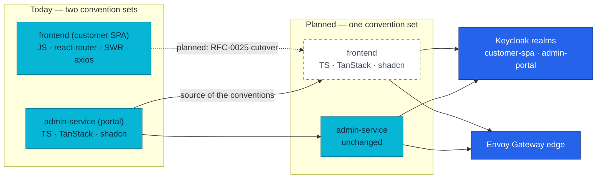

# RFC-0025 — Research: converging the customer SPA on the Admin Portal's stack

| | |
|---|---|
| **RFC** | RFC-0025 |
| **Status** | researching |
| **Scope** | service:frontend |
| **Created** | 2026-08-15 |
| **Last updated** | 2026-08-15 |

> **Plain-language research.** This file is the deep dive: what the two frontends
> actually are today, what a convergence costs, and what the migration looks like
> before any decision is written down. The decision itself lives in
> [ADR-052](../../adr/ADR-052-converge-the-customer-spa-on-the-portal-stack/).

---

## Table of contents

1. [Problem statement](#problem-statement)
2. [Reading path](#reading-path)
3. [What convergence means here](#what-convergence-means-here)
4. [The two stacks, side by side](#the-two-stacks-side-by-side)
5. [Core mechanism — what actually changes](#core-mechanism--what-actually-changes)
6. [Glossary](#glossary)
7. [Worked example — one screen, both ways](#worked-example--one-screen-both-ways)
8. [vs platform as-built](#vs-platform-as-built)
9. [Integration paths](#integration-paths)
10. [Alternatives](#alternatives)
11. [Open questions](#open-questions)
12. [FAQ](#faq)
13. [References](#references)
14. [Context7 audit log](#context7-audit-log)
15. [Research review gate](#research-review-gate)

---

## Problem statement

### Real-world trigger

| | |
|---|---|
| **Situation** | The platform ships two React SPAs whose conventions overlap in purpose and disagree in every detail: routing, server state, forms, styling, error handling, and what "the tests are green" means |
| **Who feels it** | Anyone changing either frontend — every context switch re-learns a different way to do the same four things |
| **Why now** | The Admin Portal reached feature parity with its RFC (RFC-0023 slice A+B shipped). Its ADR recorded the divergence as a knowingly accepted debt **with an explicit trigger for paying it back** |
| **If we do nothing** | The tax compounds. Every new platform convention (error envelope, idempotency, protected routes) gets implemented twice, drifts, and is verified twice — and the customer SPA keeps a mock layer that lets its tests pass while the real contract is broken |

> **In plain terms:** we learned how we want to build frontends while building the
> Backoffice. The storefront predates that and never got the lesson.

[ADR-049](../../adr/ADR-049-admin-portal-tanstack-spa/) wrote the debt down when it
chose the Admin Portal's stack:

> "Two frontend convention sets in the platform **until/unless the customer SPA
> converges** — a real maintenance and review tax, accepted knowingly."

and named the condition for closing it:

> "The customer SPA completes a migration onto an overlapping stack — **then
> converge conventions deliberately**."

### What homelab practice proves

- Whether a **full-stack** frontend migration (router + data layer + language +
  styling) can be gated by the same compose E2E audit the backend trains use,
  rather than by unit tests the repository does not have.
- Whether removing the mock layer entirely is survivable for a storefront — the
  Admin Portal has run mock-free since day one, but it never had a mock to remove.
- Whether one `apiFetch` + TanStack Query can replace an axios interceptor stack
  that currently carries pre-emptive token refresh, 401 re-login, 429/503 shaping
  and a checkout-specific error envelope.

---

## Reading path

1. [The two stacks, side by side](#the-two-stacks-side-by-side) → [Core mechanism](#core-mechanism--what-actually-changes)
2. [vs platform as-built](#vs-platform-as-built) → [Alternatives](#alternatives)
3. [Open questions](#open-questions) → [Research review gate](#research-review-gate)

---

## What convergence means here

Convergence is **not** "make the storefront look like the Backoffice". The two
products are different: one is a shop, the other is a worklist. What converges is
the set of answers to questions every frontend has to answer anyway.

| Question | One answer, both apps |
|---|---|
| Where does URL state live? | The router, validated by zod (`validateSearch`) |
| Where does server data live? | TanStack Query — never copied into component state |
| Where do drafts live? | TanStack Form |
| Where does the session live? | keycloak-js, in adapter memory |
| What does an error look like? | `ApiError { status, code, message }` from one `apiFetch` |
| What does "green" mean? | Playwright against the real compose stack, no mocks |

> **In plain terms:** same grammar, different sentences.

---

## The two stacks, side by side

Surveyed 2026-08-15 from both repositories.

| Layer | `frontend` (customer) | `admin-service` (portal) |
|---|---|---|
| Language | JavaScript/JSX, **no tsconfig** | TypeScript 6.0, `strict` + `noUncheckedIndexedAccess` |
| Router | `react-router-dom` 7.18, declarative `<Routes>` in `App.jsx` | `@tanstack/react-router` 1.170, file-based + `@tanstack/router-plugin` |
| Server state | SWR 2.4 over axios 1.18 | `@tanstack/react-query` 5.101 over a `fetch` wrapper |
| Tables | hand-written | `@tanstack/react-table` 9.1 |
| Forms | controlled `useState`, **no library, no schema** | `@tanstack/react-form` 1.33 + zod 4.4 |
| Styling | 1 205-line `src/index.css`, dark-only, 13px, self-described "API Test Harness" | Tailwind 4.3 + shadcn 4.17 preset `base-nova`, Base UI 1.7, oklch tokens, light + dark |
| Icons | emoji literals in JSX | `lucide-react` |
| Toasts | `react-hot-toast` 2.6 | *(none yet — the portal never needed one)* |
| Lint | ESLint 9 flat, two `react-hooks` rules downgraded to `warn` | `oxlint`, zero warnings required |
| Tests | Playwright 1.61, **two mock layers** | Playwright 1.62 + axe, **no mocks at all** |
| Auth | keycloak-js 26.2.4 | keycloak-js 26.2.4 |

**Size of the thing being moved:** 68 files and 6 662 lines under `src/`
(4 736 JS/JSX + 1 850 CSS), 10 routes, 9 pages, 14 components, 13 API modules,
5 E2E specs totalling 75 lines. Seven files exceed 200 lines; the four biggest are
`src/index.css` (1 205), `src/api/mock/index.js` (401), `OrdersPage.jsx` (387) and
`CheckoutFlowPage.jsx` (356).

The one row that already agrees is the important one: **both apps authenticate the
same way**. keycloak-js, PKCE S256, `check-sso`, tokens in adapter memory, silent
SSO iframe. [ADR-043](../../adr/ADR-043-oidc-browser-workload-trust/) is untouched
by this work.

---

## Core mechanism — what actually changes

### Routing: declarative tree → file-based, typed

Today every route is a `<Route>` element inside `App.jsx`, with a `ProtectedRoute`
wrapper component and `?page` read through `useSearchParams`. There is no layout
route — the header and footer are hand-written JSX in `App.jsx`.

TanStack Router inverts this: the file tree *is* the route tree, the guard is a
`beforeLoad` on a pathless layout route, and search params are parsed and typed by
a zod schema so a malformed URL degrades instead of throwing.

> **In plain terms:** the router stops being a component you render and becomes a
> description the build reads.

TanStack Router ships a documented migration path from React Router — a checklist
page plus an agent skill — and the mechanical parts are exactly the ones this
codebase has: `useParams` gains a `from` (`useParams({ from: '/orders/$orderId' })`),
`useNavigate` changes import and takes `to`/`params`, and each route object becomes
a `createFileRoute(...)({ component })`.

### Server state: SWR + axios interceptors → Query + one fetch wrapper

The current axios instance carries real behaviour that must survive the move:

| Behaviour today | Where it goes |
|---|---|
| `await updateToken(30)` before every request | `apiFetch` calls `auth.getToken()`, which refreshes at <60s validity (the portal's existing shape) |
| 401 → `login()` redirect | same, inside `auth.getToken()`'s catch |
| 429 → `error.isRateLimit`, message rewritten from `Retry-After` | `ApiError.code`, surfaced by the error-copy helper |
| 503 → `error.isUnavailable`, `retryAfterMs` | same |
| checkout requote 409 with a **nested** `{error:{code,message}, session}` | kept as a checkout-specific parse; the envelope shape is a backend contract, not a client choice |
| `skipAuthRefresh` on the two badge pollers | disappears — polling becomes `refetchInterval` on a query whose `queryFn` shares the one token path |
| 10s timeout | `AbortSignal.timeout` in `apiFetch` |

Two things the current stack does **not** do and the new one gets for free:
request cancellation (`AbortController`/`signal` appear zero times in `src/` today;
every TanStack Query `queryFn` receives a `signal`) and a single provider-level
config (there is no `<SWRConfig>` anywhere — every consumer repeats its options).

### Language, styling, tests

TypeScript strict across `src/` and the E2E suite; Tailwind v4 + shadcn `base-nova`
with the token file structured exactly like the portal's `src/index.css`; Playwright
against the live compose stack with `@axe-core/playwright`.

The mock layer goes entirely: `src/api/mock/**` (401 lines + seed + store), the
`VITE_USE_MOCK` branch inside all 11 API modules, the keycloak mock adapter, and the
`page.route()` handlers in `e2e/mocks/`. That last one matters more than it looks —
the E2E product-details mock currently returns the **retired** `stock` shape while
the app has moved to `availability`, so the suite has been exercising a branch the
real API no longer serves.

---

## Glossary

| Term | Meaning here |
|---|---|
| **File-based routing** | The route tree is generated from the file layout under `src/routes`; `routeTree.gen.ts` is generated by the Vite plugin and committed |
| **Pathless layout route** | A route whose file name starts with `_` — it wraps children (shell, guard) without adding a URL segment |
| **`validateSearch`** | Route-level parser for query params; with zod `.catch()` a bad value falls back instead of throwing |
| **`queryOptions`** | A branded query definition (key + fn) shared between components, route loaders and prefetches |
| **Base UI** | The primitive library shadcn's current default builds on; composition uses a `render` prop, not Radix's `asChild` |
| **base-nova** | The shadcn style preset the Admin Portal locked in `components.json` |

---

## Worked example — one screen, both ways

The product list, paginated by `?page`.

**Today** (`ProductListPage.jsx`, 81 lines): `useSearchParams()` → `Number(sp.get('page')) || 1`
→ `useProducts(page, 24)` → `useSWR(['products', {page, page_size}])` → render, with
`useTransition` for the page flip and a hand-rolled `Math.ceil(total/pageSize)` fallback.

**After**: a `validateSearch` zod schema owns `page` (`.catch(1)`), the query key is
built from the validated object so the URL *is* the cache key, and the queryFn gets
its `signal` from Query so an abandoned page flip cancels.

```ts
const searchSchema = z.object({ page: z.coerce.number().int().min(1).catch(1) })

export const Route = createFileRoute('/products')({
  validateSearch: searchSchema,
  component: ProductListPage,
})

const productsQuery = (q: { page: number }) =>
  queryOptions({
    queryKey: [...catalogKeys.all, 'list', q] as const,
    queryFn: ({ signal }) => listProducts(q, signal),
  })
```

> **In plain terms:** the same screen, minus the two places it could disagree with
> itself about what page you are on.

---

## vs platform as-built

| Aspect | Platform today (deployed) | After convergence (**planned**) |
|---|---|---|
| Frontend convention sets | Two | One |
| Customer SPA language | JavaScript, no typecheck in CI | TypeScript strict, `tsc -b` in the build |
| Customer SPA test truth | Playwright with `page.route()` mocks; an in-app mock store behind `VITE_USE_MOCK` | Playwright against the live compose edge, no mocks |
| Edge / CORS | `localhost:3001` + `https://local.duynh.me` allowlisted, `allowCredentials: true` | unchanged |
| Realm client | `customer-spa`, public, PKCE S256, redirect `http://localhost:3001/*` | unchanged |
| Build contract | 4 build ARGs → `VITE_*`, baked; nginx serves `dist/` on :80 with `/health` | unchanged |
| Cluster shape | `rs-frontend` ResourceSet in `default`, HelmRelease into ns `frontend`, tag `2.0.0` | unchanged except the pinned tag |
| E2E audit Phase B | Asserts SPA internals: nav labels, `/login?returnTo=`, "Sign in with Keycloak", and a comment naming `src/api/client.js` | Rewritten for the new shell; the three identity assertions survive verbatim |

Nothing in `kubernetes/` changes except a tag. That is the point of keeping the
serving model, the build-arg contract and the auth adapter fixed.

---

## Integration paths



**Why a single cutover rather than a strangler.** The strangler pattern needs old
and new to serve traffic side by side. Two routers cannot own the same browser
history in one bundle, so the seam would have to be the *server* — two nginx
containers behind path rules at the edge, with a shared session and a duplicated
shell. That is more moving parts than the thing being replaced. The branch can
still carry checkpoint commits per screen; what is atomic is the **merge**, not the
work.

---

## Alternatives

| Option | Pros | Cons |
|---|---|---|
| **A — Full convergence (this RFC)** | One convention set; the storefront gains typing, cancellation, URL-as-state and a real design system; the mock layer dies | Largest change; every screen is rewritten; Phase B of the audit must be rewritten |
| **B — UI layer only** (the owner's 30/07 draft: TS + Tailwind + shadcn, keep react-router/SWR/axios) | Much smaller; keeps the interceptor stack that already works | The two apps still disagree about routing, server state and forms — the tax is mostly *inside* those layers, so it survives |
| **C — Leave it** | Zero cost today | ADR-049's accepted debt keeps compounding; every platform convention is implemented and verified twice |
| **D — New repo, new SPA** | Clean slate; no migration mechanics | Loses history and the build/deploy contract that already works; two deploy targets during the overlap; the storefront's behaviour is only documented *in* the code being discarded |

Option B is the one worth arguing with, because it is the owner's own earlier plan
and it is not wrong — it just buys the visible half. The layers it keeps are where
the divergence actually lives: a reviewer moving between repos still meets two
routers, two cache models and two form idioms.

---

## Open questions

- [ ] **Toast primitive.** The 30/07 draft rules out Sonner explicitly. The current
      shadcn registry may only ship a Sonner-backed toast under `base-nova`. If so,
      the choice is: accept Sonner, hand-write a small toast on Base UI, or drop
      toasts and use inline status regions. **Owner decision, not an implementation
      detail.**
- [ ] **Storefront IA.** Keep all 10 routes, or restructure? Specifically whether
      the 4-step checkout stays one route with an internal FSM (356 lines today) or
      becomes nested routes with the step in the URL.
- [ ] **Dev port.** The repo's Vite dev server is `:3000` while compose publishes
      the container on `:3001` and Playwright targets `:3000`. The realm allows both
      as redirect origins. Pick one and make all three agree.
- [ ] **Dark mode.** The storefront is dark-only today by accident of its
      "API Test Harness" origins. The portal supports both. Does the redesigned
      storefront ship light + dark, or commit to one?

---

## FAQ

**Does this change how customers log in?**

No. keycloak-js, the `customer-spa` realm client, PKCE S256 and in-memory tokens all
stay exactly as they are. ADR-043 is not reopened, and the three identity assertions
in audit Phase B survive the rewrite unchanged.

**Does the backend change?**

No. Same edge, same routes, same envelopes, same idempotency contract. The
`docs/api/` surface is untouched — except for one line that is *already* wrong and
gets corrected in passing (`microservices.md` still says the SPA keeps a JWT in
`localStorage.authToken`, which stopped being true at the RFC-0024 identity cutover).

**Why remove the mocks instead of keeping them for local development?**

Because two of them exist and neither is the truth. The in-app store (`VITE_USE_MOCK`)
and the Playwright `page.route()` handlers have already drifted from the real
contract in a way that shipped: the E2E details mock still returns the retired
`stock` block. A suite that passes against a fiction it maintains itself is not a
gate. The Admin Portal has run this way since it was created and the compose stack
is a `docker compose up` away.

**Is a rewrite really cheaper than incremental work?**

The rewrite is ~4 700 lines of JS/JSX and ~1 850 lines of CSS, most of it screens
whose behaviour is defined by an API the platform documents. The incremental path
costs the same rewrite plus the cost of running two of everything while it happens.

---

## References

- TanStack Router — *Migrate from React Router* (installation guide + how-to)
- TanStack Router — file-based routing, `validateSearch`, `createRootRouteWithContext`
- TanStack Query — `queryOptions`, router integration and prefetching
- shadcn/ui — style presets, `components.json`, Base UI primitives
- [ADR-049](../../adr/ADR-049-admin-portal-tanstack-spa/) — the portal's stack and the revisit trigger this RFC exercises
- [ADR-043](../../adr/ADR-043-oidc-browser-workload-trust/) — the browser auth model kept unchanged
- [`local-stack/docs/e2e-audit.md`](../../../../local-stack/docs/e2e-audit.md) — Phase B, the rows that must be rewritten

---

## Context7 audit log

| Claim / section | Source checked | Result |
|---|---|---|
| React Router → TanStack Router has an official, mechanical migration path | Context7 `/tanstack/router` — *migrate-from-react-router* checklist + skill | confirmed: `useParams({from})`, `useNavigate` import/`to`, route config → `createFileRoute` |
| Query integrates with the router via shared query definitions rather than a bespoke loader cache | Context7 `/tanstack/query` — `queryOptions`, router prefetching guide | confirmed: `queryOptions` is the shared unit; loaders may prefetch blocking or non-blocking |
| shadcn's current default primitives are Base UI, composed with `render` | Context7 `/shadcn-ui/ui` + the portal's installed tree | confirmed against `admin-service` (`@base-ui/react` 1.7, zero `asChild` occurrences) |
| Portal dependency versions quoted in this file | `admin-service/package.json` + `package-lock.json` | confirmed (locked versions, not ranges) |
| Customer SPA inventory (files, lines, routes, mock surface) | `frontend/` working tree, 2026-08-15 | confirmed |
| Edge/realm/compose facts said to be unchanged | `local-stack/compose.yaml`, `gateway/eg/securitypolicy.yaml`, realm twins, `kubernetes/apps/frontend-rs.yaml` | confirmed |

---

## Research review gate

- [x] Answers a real-world problem — a debt ADR-049 recorded with an explicit trigger
- [x] Problem statement names situation, who feels it, and cost of doing nothing
- [x] Four alternatives documented with tradeoffs (including the owner's own earlier plan)
- [x] Platform as-built section filled from both repositories and the manifests
- [x] Primary direction stated: full convergence, single cutover
- [x] Context7 audit complete; footer date updated
- [x] One Mermaid diagram; the migrated SPA is labelled **planned**
- [x] No Kubernetes manifest changes in this file
- [ ] Owner sign-off: **ready for RFC**

---

_Last verified: 2026-08-15 (Context7 + repository and manifest cross-check)._
