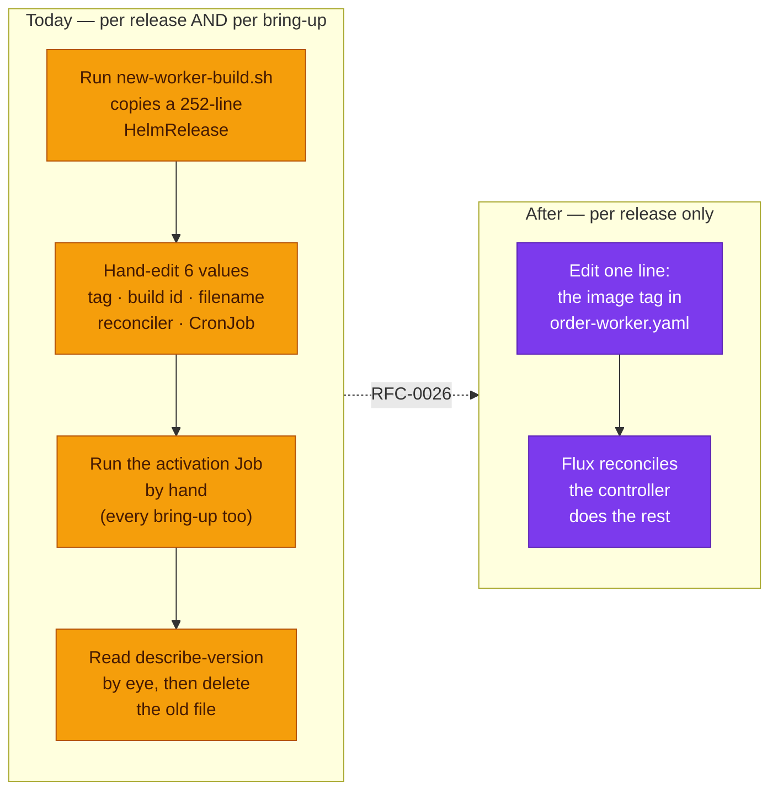
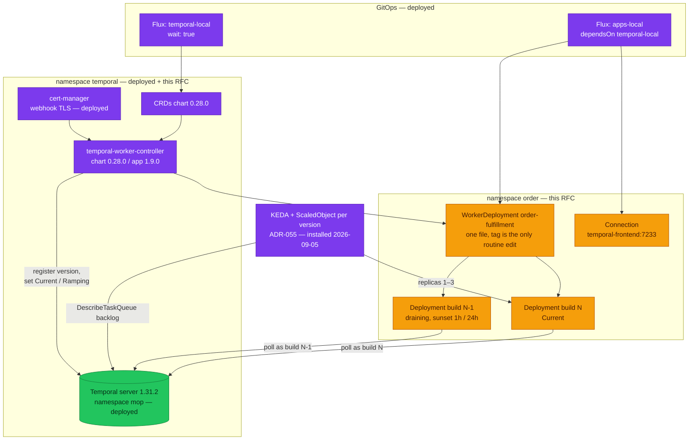

# RFC-0026 Adopt the Temporal Worker Controller for versioned workers

| Status | Scope | Research | Created | Last updated |
|--------|-------|----------|---------|--------------|
| implemented | platform-wide | [./research.md](./research.md) — gate passed 2026-08-21 | 2026-08-21 | 2026-08-21 |

> **Don't forget: every decision is a tradeoff.** This one buys away a hand-run
> activation step and a 252-line file per build, and pays for it by giving up the
> `mop` chart for the worker, accepting a third-party controller in the Flux chain,
> and losing the ability to set env per worker version.

## Prerequisites

- [research.md](./research.md) merged; [research review gate](./research.md#research-review-gate) ticked
- Context7 audit complete (see research footer)
- Owner approved **ready for RFC** — 2026-08-21, with the clean-slate direction
- Mechanism deep-dive is **not** repeated here — see [`./research.md`](./research.md)
- ADR folders: [`ADR-054`](../../adr/ADR-054-temporal-worker-controller/) (controller),
  [`ADR-055`](../../adr/ADR-055-keda-worker-autoscaling/) (KEDA — `Accepted`, installed 2026-09-05)
- `docs/api/` files to touch: [`temporal.md`](../../../api/temporal.md) § Worker Deployment
  Versioning — the as-built section describes the env contract and the per-build file layout,
  both of which change

## Summary

Replace the hand-operated half of [ADR-030](../../adr/ADR-030-temporal-workflow-versioning/)
with Temporal's own Kubernetes controller. The order worker stops being one HelmRelease per
build id activated by a human and becomes **one `WorkerDeployment` custom resource whose
only routine edit is the image tag**. The controller derives the build id, creates a
Deployment per version, moves Current/Ramping through the Temporal API, and deletes a
version once the server reports it drained. `pkg/temporalx` moves onto Temporal's own
environment-variable names, which is what makes the worker readable by the controller at all.

KEDA task-queue autoscaling is designed here and recorded as ADR-055, but **not installed**
in this RFC — it landed later in ADR-055's own change (2026-09-05).

## Motivation

Three facts from the research, each measured against this repository:

1. **The platform can see worker starvation and cannot act on it.**
   [`alert-catalog.md:622`](../../../observability/alerting/alert-catalog.md) already says
   backlog and schedule-to-start latency are *"the best leading indicators that workers are
   under-provisioned"* and that both are **visualized** while *"the alerts on them are still
   missing"*. There is nothing to alert *toward*: **15 of 15** application workloads pin
   `replicaCount: 1`, and the repository contains **0** HorizontalPodAutoscalers and **0**
   ScaledObjects — so `KubeHPAMaxedOut` is an alert with nothing that can fire it.

2. **A fresh cluster is born broken and only a human fixes it.** ADR-030 records it as
   follow-up 3 and `kind-e2e-audit.md` as **K1.7**: with no Current version, new workflows
   route to unversioned workers, of which there are none. Orders sit `pending` with every pod
   `Ready` and every gauge green.

3. **The retirement gate is machine-checkable and nothing checks it.** ADR-030 follow-up 2:
   `DrainageStatus` answers "is this build empty" directly, and *"nothing in `scripts/`
   checks it today"*.

ADR-030 already named the destination and the condition for taking it — *"it needs its own
RFC and an owner-approved number, and its CRD must be read from the chart rather than from
documentation"*. Both are now satisfied.

### Goals

- Delete the per-bring-up activation step. Success: `make down && make up`, run **no** Job,
  drive one checkout, and the saga reaches `completed`. K1.7 disappears from the audit.
- A worker release is **one line** — the image tag in one file that never gets copied.
- Version retirement is declarative: scale-down and delete driven by the server's own
  drainage report, not by a human reading `describe-version`.
- Ramping becomes usable instead of merely available (ADR-030 follow-up 4).
- `pkg/temporalx` reads Temporal's variable names, so a worker image is portable to the
  controller without manifest glue.

### Non-Goals

- **KEDA is not installed here.** ADR-055 stayed `Proposed` at this RFC; it needed `ScaledObject` added to
  `workerResourceTemplate.allowedResources` plus a `WorkerResourceTemplate` — both landed 2026-09-05
  (ADR-055 § As-built).
- **`checkout-worker` is not versioned here.** It is unversioned today and turning it on
  before the controller owns activation would add a *second* hand-run step per bring-up.
- **The three unbuilt Temporal alerts** (`TemporalScheduleToStartLatencyHigh`,
  `TemporalTaskQueueBacklogGrowing`, `TemporalSyncMatchRateLow`) ship with ADR-055, when
  something can act on them.
- Moving the inventory reconciler and outbox dispatchers out of the worker — see
  § Design Details, recorded as a consequence, fixed in a service-repo change.

## Proposal

Install the controller's two charts (`0.28.0`, appVersion `1.9.0`, from
`docker.io/temporalio`) into the existing `temporal` namespace, inside the existing
`temporal-local` Flux Kustomization. Because `apps-local` already `dependsOn:
temporal-local` with `wait: true`, the CRDs and controller are Ready before any
`WorkerDeployment` is applied — no new Kustomization and no new ordering rule.

Replace `kubernetes/apps/order-worker-2-4-0.yaml` with
`kubernetes/apps/order-worker.yaml` holding a `Connection` and a `WorkerDeployment`. The
pod template is a straight transplant of what the `mop` chart rendered — verified by
`helm template`, which emits **only** a Deployment for this release, no ServiceAccount and
no securityContext — minus the two versioning env vars, which the controller now injects.

Delete what the controller replaces: the suspended activation CronJob, the staging script,
and the `flux-validate.sh` assertions that existed to keep three hand-maintained copies of
one build id in agreement.

### Alternatives

Full plain-language analysis in [research § Alternatives](./research.md#alternatives).
Decision-level summary:

| Path | Why not |
|---|---|
| Keep CronJob + `new-worker-build.sh` | Costs are measured, not theoretical: 252-line file per build, a hand-run Job on every release **and every bring-up**, `DrainageStatus` read by eye, ramping unavailable in practice |
| Controller with `strategy: Manual` | Preserves ADR-030's "activation is a decision" philosophy but the docs are explicit that `Manual` *"requires manual intervention to promote versions"* — **K1.7 survives**, which is the highest-value item on the list |
| `unsafeCustomBuildID` pinned to the image tag | Keeps build id ≡ image tag, but then a release edits the tag **and** the build id — the "one line" goal dies for an invariant whose only consumer was a human correlating a filename with a server version. `kubectl get wd` prints Current/Target build id directly |

## Other solutions considered

| Option | Shape | Why not chosen |
|--------|-------|----------------|
| Worker ResourceSet | Flux ResourceSet templating the per-build HelmRelease | Already rejected in `new-worker-build.sh:15-18`: needs a render step in `flux-validate` because kustomize does not expand ResourceSets, *"and the Temporal Worker Controller would replace all of it"*. An argument **for** this RFC, not for the ResourceSet |
| HPA + external-metrics adapter | `prometheus-adapter` in front of VictoriaMetrics, per-version metric selectors | Upstream's own recipe is built on **Temporal Cloud's** OpenMetrics endpoint (`temporal_cloud_v1_approximate_backlog_count`), which a self-hosted server does not publish. Would mean standing up an adapter this platform does not run, and still cannot scale from zero |
| KEDA without the controller | `ScaledObject` on the existing single Deployment | No per-version template, so every rollover leaves the old `ScaledObject` pointing at a dead Deployment and the new Deployment unscaled — the exact failure `WorkerResourceTemplate` exists to prevent. Would be redone once the controller lands |
| Drop versioning, use SDK patching | `GetVersion`/`patched` branches in workflow code | Upstream sanctions it *only* as a fallback *"if your infrastructure does not yet support blue-green or rainbow deployment models"*. Ours does — that is precisely what this RFC automates |

## Architecture & Diagrams

**What a release becomes.** The point of the change in one picture: the left column is what
a build bump costs today, the right column is what it costs after.



> **In plain terms:** three of the four steps on the left are a person. None of them
> encode a judgement a machine cannot make — "is this version empty" has an exact answer in
> the server's own status, and "should the new build take traffic" is what a rollout policy
> is for.

**Target topology.** Everything solid already runs; the controller and its custom resources
are what this RFC adds. KEDA was dashed at acceptance because ADR-055 was `Proposed` only; it
is drawn solid since 2026-09-05, when ADR-055 installed it.



Legend: purple = platform/control plane · orange = the worker and its versions · green =
data plane · dashed = **planned**, not installed by this RFC.

## Design Details

**Enabling it.** Two HelmReleases and one `Kustomization` entry. The CRDs chart installs
first (`dependsOn`), matching the `gateway-api-crds` → `envoy-gateway` shape already in the
chain. `certmanager.install: false` — cert-manager is deployed and issues from the
`homelab-ca` root.

**Build id is derived, not pinned.** `ComputeBuildID` uses the image prefix plus a hash of
the pod template, so **any** template edit mints a version — stricter than today, where only
an image tag change does. That is the correct semantics for determinism and it is what makes
a release one line. Consequence, stated plainly: a resources bump also creates a version and
therefore a rollout. Acceptable for a worker that carries `VersioningBehaviorPinned` anyway.

**`service.version` is read from the pod label**, not hard-coded, or the "one line" claim
would be false:

```yaml
- name: OTEL_RESOURCE_ATTRIBUTES
  value: "service.namespace=$(POD_NAMESPACE),service.instance.id=$(POD_NAME),service.version=$(BUILD_ID)"
- name: BUILD_ID
  valueFrom:
    fieldRef:
      fieldPath: metadata.labels['temporal.io/build-id']
```

**Rollout policy.** `Progressive`, two steps at `rampPercentage` 10 then 50, `pauseDuration:
30s` each — 30 s is the CEL-enforced minimum. Total under two minutes, comfortably inside
`apps-local`'s `timeout: 10m` with `wait: true`, which a longer schedule would breach because
`WorkerDeployment` reports a standard `Ready` condition that Flux's kstatus waits on. No
`gate.workflowType`: a gate workflow is service-repo work and out of scope.

**Disabling it again.** Reversible but not free. `WorkerDeployment` is deleted, the
per-version Deployments go with it, and the pre-RFC file is restored from git. Anything
pinned to a live version must drain first — on a cluster rebuilt from zero the drain set is
empty, which is the same condition ADR-030 relied on when it deleted `1-13-2` outright.

**Operator visibility.** `kubectl get wd -n order` prints Current, Target and Ramp % as
printer columns. `status.deprecatedVersions[].drainedSince` and `.eligibleForDeletion`
replace the human reading `describe-version`.

**Drawbacks, all real.**

- **The `mop` chart is gone for this workload.** `spec.template` is a raw PodSpec, so ~30 env
  vars, probes and resources are hand-written. The file lands at **276 lines** (measured after the fact; the RFC estimated ~180, which understated the cost of losing the chart by a third). It is *one*
  file forever and a bump is one line, but the first authoring is not cheap and nothing
  keeps it in step with the chart's future defaults.
- **Per-version env is impossible.** One template serves every live version, so
  `ORDER_RECONCILER_ENABLED` and `ORDER_START_DISPATCHERS_ENABLED` can no longer differ
  between the Current and a draining build. Correctness holds — the dispatchers claim with
  `FOR UPDATE SKIP LOCKED` (*"extra instances stay correct — just unnecessary"*) and the
  reconciler is *"SAFE but noisy"*, costing a duplicated repair counter, not a wrong action.
  The clean fix is to move both out of the worker into their own unversioned Deployment,
  since neither is workflow code; that is a service-repo change and a Non-Goal here.
- **A third-party controller joins the critical path.** `apps-local` cannot go Ready without
  it. Mitigated by `wait: true` on `temporal-local` and by the controller having no state of
  its own — the source of truth is the Temporal server.
- **`v1alpha1` API group.** Not a stability signal: the project is Generally Available with
  *"stable APIs"*, and the CRD rename completed at app v1.7.0, two minors before the chart
  we install. Recorded because the version string invites the wrong inference.

## Security considerations

- **Kyverno.** No PolicyException needed, verified against the policies rather than assumed.
  `disallow-latest-tag` applies to every namespace except `kube-system`/`flux-system`/`kyverno`
  and requires a tag while forbidding `:latest`; it does **not** require a `ghcr.io` prefix,
  so the `docker.io/temporalio` controller image is admissible once pinned.
  `require-resources` and `require-probes` match the ten app namespaces — **including
  `order`** — so the pod template the controller renders must carry
  `resources.requests.{cpu,memory}`, `resources.limits.{cpu,memory}` and both probes. It
  does; they are transplanted from the chart's rendered output.
- **NetworkPolicy.** No change. `configs/network-policies/order.yaml` uses `podSelector: {}`
  with `policyTypes: [Ingress]` only, so the policies are label-independent and apply to
  controller-created pods exactly as they do to chart-created ones. There are no egress
  policies to update.
- **RBAC.** The controller takes cluster-wide watch plus create/update on Deployments in the
  namespaces holding `WorkerDeployment` resources. `rbac.restrictWatchNamespaces` can narrow
  this to `order` and should be considered at review — it converts the ClusterRole into a
  per-namespace Role.
  **Considered and deferred (2026-08-22):** it is **not** set, so the controller
  watches cluster-wide. Deferred rather than dropped — narrowing it to `order` now
  would have to be widened the moment a second namespace carries a
  `WorkerDeployment`, which `checkout` will once its service opts in. Revisit
  trigger: **the second `WorkerDeployment` landing**, when the list is known and
  stable.
- **Webhook.** `WorkerResourceTemplate` requires a validating webhook, hence cert-manager.
  The webhook performs SubjectAccessReview against **both** the applying identity and the
  controller's service account, which means Flux's service account needs the same
  permissions as the embedded resource kind — relevant when ADR-055 adds `ScaledObject`.
- **Secrets.** Unchanged: the DB password still arrives via `secretKeyRef` on
  `product-db-order-secret`. The `Connection` resource carries no credential — the in-cluster
  frontend is plaintext east-west, as today.

## Observability & SLO impact

- **No signal is lost.** The worker keeps OTLP push for metrics, logs and traces, and keeps
  `platform.duynhlab.dev/otlp-logs: "true"` so Vector still skips it — dropping that label
  would double-ingest every worker log line.
- **A signal is gained**: `service.version` now tracks the controller's build id
  automatically, so during a drain the two versions stay distinguishable in every signal
  rather than only by pod name.
- **New objects to watch**: the controller's own Deployment, and `WorkerDeployment`
  conditions. No alert is added by this RFC; the controller is covered by the existing
  `KubeDeploymentReplicasMismatch` family, and a stuck rollout surfaces as a Flux
  Kustomization not Ready.
- **SLOs unchanged.** No user-facing path moves. The order saga's own alert,
  `OrderSagaNotCompleting`, remains the backstop for the failure mode this RFC removes.
- **ADR-055** is where the backlog and schedule-to-start alerts belong, because that is when
  something can act on them.
- **Domain doc (2026-09-05):** the operating side of all this is distilled into
  [`docs/platform/worker-autoscaling.md`](../../../platform/worker-autoscaling.md) — the
  spin-off this RFC's research earns under the Proposals mechanism. It carries what a
  reader needs to *run* the thing (add a scaler, tune the numbers, pause safely, upgrade
  KEDA) plus the mechanics the Kind drill exposed that neither this RFC nor the ADR
  predicted.

## Rollout & rollback

The train order is forced by one fact: the deployed `order-service:2.4.0` binary reads the
old environment-variable name. Manifest and image must move together, and homelab moves last.

| Phase | Repo | Change | Gate |
|---|---|---|---|
| 1 | `duynhlab/pkg` | `temporalx` reads `TEMPORAL_DEPLOYMENT_NAME`; retires three uncalled helpers | CI + unit (96.5% coverage). A library tag deploys nothing |
| 2 | `order-service` | `go get temporalx@v0.37.0` — `go.mod`/`go.sum` only, no code change | **local-stack E2E**: Phase A/B/C **plus A15**, the worker-versioning drill, which is CONDITIONAL *"when a change touches worker versioning"* and therefore mandatory here. Then tag `v2.5.0` |
| 3 | `homelab` | Controller charts, `Connection` + `WorkerDeployment`, deletions, docs | `make validate`, then **Kind E2E** — the only place a Kubernetes controller can be gated, since local-stack is Docker Compose with no Kubernetes |

**Rollback.** Phase 3 reverts by restoring `order-worker-2-4-0.yaml`, the CronJob and the
script from git, and pinning the image back to `2.4.0` — the old binary reads the old
variable name, so the pair is self-consistent. Phase 2 reverts by pinning `temporalx@v0.36.1`.
Blast radius throughout is the order saga only; no edge, identity or data-plane object moves.

**Flag day, stated once.** Between phase 2's tag and phase 3's merge, the manifest in `main`
names an env var the new image does not read. The failure mode is loud —
`MustVersioningFromEnv` exits 1 — not silent, which is why the two phases can be sequenced
rather than atomically coupled.

## Testing / verification

| Check | How | Pass |
|---|---|---|
| A15 versioning drill | `docker compose run -e TEMPORAL_DEPLOYMENT_NAME=order-fulfillment -e TEMPORAL_WORKER_BUILD_ID=v1 …` then `worker deployment list` | `order-fulfillment` v1 listed. If `temporalx` still read the old name the worker would exit 1 and this row fails first |
| A15 drain | Stand up v2, `set-current-version v2`, `describe` | v1 reports `draining` while it holds a pinned execution |
| Manifests | `make validate` | Green, including after `validate_worker_build_id()` is deleted |
| Controller landed | `kubectl -n temporal get deploy,po` | Running, image tag pinned, not `:latest` |
| CRDs | `kubectl get crd \| grep temporal.io` | `workerdeployments`, `connections`, `workerresourcetemplates` |
| Admission | `kubectl get events -n order \| grep -i kyverno` | No deny |
| **K1.7 is gone** | `make down && make up`, run **no** Job, drive one checkout | Saga reaches `completed` |
| Rollout | Bump the tag, `kubectl get wd order-fulfillment -w` | Ramp % advances through the steps, Current flips, no human step |
| Sunset | `kubectl get wd -o yaml \| yq .status.deprecatedVersions` | `drainedSince` set; old Deployment scales to 0 then is deleted |
| Flux chain | `make flux-status` | All Kustomizations Ready; none timed out on a rollout pause |
| Logs | VictoriaLogs, worker container | One `temporalx: worker versioning on` line; no double-ingest |

## Resulting decisions

| Decision | ADR | Status |
|----------|-----|--------|
| Adopt the Temporal Worker Controller as the owner of the versioned-worker lifecycle, retiring the per-build manifest and the hand-run activation Job | [`../../adr/ADR-054-temporal-worker-controller/`](../../adr/ADR-054-temporal-worker-controller/) | Proposed |
| Scale versioned workers from task-queue backlog with KEDA's `temporal` scaler, attached per version via `WorkerResourceTemplate` | [`../../adr/ADR-055-keda-worker-autoscaling/`](../../adr/ADR-055-keda-worker-autoscaling/) | Proposed |

ADR-055 depends on ADR-054 in one direction only: the controller stands without KEDA, but
KEDA without the controller has no per-version template to attach to.

## Implementation History

| Date | Milestone |
|------|-----------|
| 2026-08-21 | Research gate passed; RFC Accepted; ADR-054 and ADR-055 created at `Proposed` |
| 2026-08-21 | Implementation merged: #866 (controller + design record), #867 (`docs/api` staleness), #868 (diagrams + `AGENTS.md` diagram rules), #869 (the JWKS NetworkPolicy fix and the K4.10 row) |
| 2026-08-22 | **Kind-verified.** `CURRENT` set with no human step (K1.7); a saga completing `Pinned` on `order/order-fulfillment` (K4.10, a row this RFC added because none existed); a `Progressive` rollout walking 10 → 50 → promoted from a pod-template change alone; a rollback re-promoting the previous build id rather than minting a new one; `service_version` carrying the derived build id (K5.4). ADR-054 Adoption → Complete |
| 2026-09-05 | **ADR-055 installed (#996).** KEDA 2.20.2 as wave `keda-local`; `ScaledObject` in the controller allow-list; one `WorkerResourceTemplate` per worker (`order-fulfillment`, `checkout-abandon`; min 1 / max 3 / target 5 / poll 15 s); `TemporalScheduleToStartLatencyHigh` + `TemporalTaskQueueBacklogGrowing` with runbooks. ADR-055 → Accepted / Partial; Kind audit on the Ubuntu machine flips it to Complete |

- [x] ADR-054 Adoption → Complete
- [x] ADR-055 Adoption → decided: **installed** 2026-09-05, #996 (Accepted / Partial; Kind verification pending)
- [x] `docs/api/temporal.md` § Worker Deployment Versioning synced to the as-built env
      contract and the single-file layout
- [x] `kind-e2e-audit.md` K1.7 **repurposed** rather than removed — it now proves no
      activation step is needed, which is stronger than deleting the row;
      `local-stack/docs/e2e-audit.md` A15 env names updated
- [x] ADR-030 amended: rollout mechanism superseded, original decision left standing

**Not observed, and not claimed:** the `sunset.scaledownDelay` scale-to-zero needs an
hour; `drainedSince` was observed, the scale-down was not. And no order was caught
landing on the outgoing build *during* the ~1-minute ramp window — the ramp steps were
observed at the `WorkerDeployment`, and the pinning guarantee separately (an order
started before the rollout completed on the old build).

## Related

- [./research.md](./research.md) — plain-language research and Context7 audit trail
- [ADR-030](../../adr/ADR-030-temporal-workflow-versioning/) — the decision this supersedes
  the rollout mechanism of; its Worker Versioning choice stands
- [ADR-039](../../adr/ADR-039-local-stack-temporal-server-postgres/) — local-stack Temporal
  topology; records that no compose worker sets the versioning variables
- [`docs/api/temporal.md`](../../../api/temporal.md) — as-built workflows and versioning
- [`docs/platform/kind-e2e-audit.md`](../../../platform/kind-e2e-audit.md) — K1.7
- [`local-stack/docs/e2e-audit.md`](../../../../local-stack/docs/e2e-audit.md) — A15
- [`temporalio/temporal-worker-controller`](https://github.com/temporalio/temporal-worker-controller)
- [Temporal — Kubernetes controller](https://docs.temporal.io/production-deployment/worker-deployments/kubernetes-controller)

---
_Last updated: 2026-09-05 — ADR-055 installed; KEDA drawn solid; Implementation History row added_
