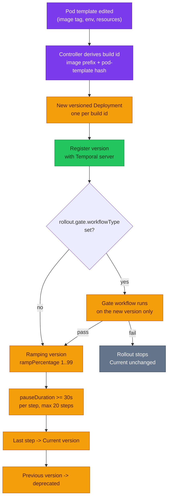
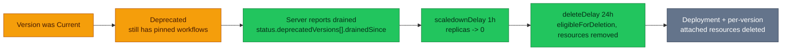
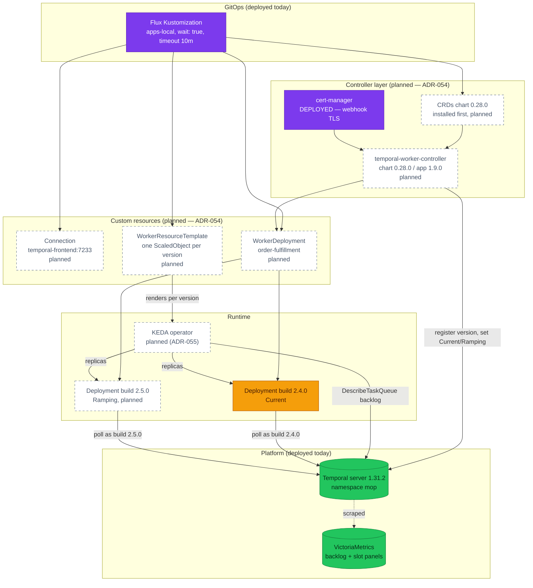

# RFC-0026 — Research: Temporal Worker Controller and KEDA task-queue autoscaling

| | |
|---|---|
| **RFC** | RFC-0026 |
| **Status** | frozen — research gate passed 2026-08-21; kept as the audit trail (see [`./README.md`](./README.md) for the decision) |
| **Scope** | platform-wide |
| **Created** | 2026-08-21 |
| **Last updated** | 2026-08-21 |

> **Plain-language research.** This file is the audit trail for the destination
> [ADR-030](../../adr/ADR-030-temporal-workflow-versioning/) already named but did not
> take: the **Temporal Worker Controller**, a Kubernetes controller that owns the
> versioned-worker lifecycle, plus **KEDA** to size those workers from the task-queue
> backlog the platform already graphs. It frames the problem, reads the CRDs from
> chart source rather than from documentation, records what the as-built manifests
> actually do, and holds the open questions for the research gate. The target design
> and rollout land in `README.md` after the gate.
>
> **Relationship to ADR-030.** ADR-030's decision — Worker Deployment Versioning with
> one manifest per build, activation as a deliberate step — is not in dispute here and
> was correct for the tooling available when it was made. This research examines
> whether the controller now closes the three follow-ups ADR-030 recorded against
> itself (machine-checkable retirement, per-bring-up activation, unused ramping) at an
> acceptable cost.

---

## Table of contents

1. [Problem statement](#problem-statement)
2. [Reading path](#reading-path)
3. [What the Worker Controller is](#what-the-worker-controller-is)
4. [Core components](#core-components)
5. [Core mechanism](#core-mechanism)
6. [Glossary](#glossary)
7. [Worked examples](#worked-examples)
8. [vs platform as-built](#vs-platform-as-built)
9. [Integration paths](#integration-paths)
10. [Alternatives](#alternatives)
11. [Open questions](#open-questions)
12. [FAQ](#faq)
13. [References](#references)
14. [Context7 audit log](#context7-audit-log)
15. [Research review gate](#research-review-gate)

---

## Problem statement

### Real-world trigger

| | |
|---|---|
| **Situation** | The platform can **see** that its Temporal workers are under-provisioned and can neither **alert** on it nor **act** on it. [`alert-catalog.md`](../../../observability/alerting/alert-catalog.md) names schedule-to-start latency and task-queue backlog as *"the best leading indicators that workers are under-provisioned"*, records that *"both signals are now **visualized**"*, and states plainly that *"the alerts on them are still missing"*. The only response available today is a human editing `replicaCount: 1` in a HelmRelease. |
| **Who feels it** | On-call (a backlog builds with no page; `TemporalWorkerTaskSlotsExhausted` fires only once slots are already at zero); platform (every worker build is a hand-staged manifest plus a hand-run activation Job); whoever rebuilds a cluster (a fresh cluster starts with **no Current version at all**, so the saga silently does nothing — [`kind-e2e-audit.md`](../../../platform/kind-e2e-audit.md) K1.7). |
| **Why now** | Three independent pressures converged. The controller reached **Generally Available** with *"stable APIs"*, so the tool ADR-030 deferred to now exists in a form worth committing to. `checkout-worker` has accumulated **four hand-written replay-safety arguments** in its manifest comments — the exact work Worker Versioning exists to remove. And the fleet runs **15 workloads at `replicaCount: 1` with zero HPAs and zero ScaledObjects**, so `KubeHPAMaxedOut` is an alert with nothing that can ever fire it. |
| **If we do nothing** | Each worker release keeps costing a 252-line file copy, a hand-typed activation Job, and a human reading `DrainageStatus` by eye — with the recorded failure mode of `ORDER_RECONCILER_ENABLED` left `true` on three builds at once. Each new cluster keeps being born broken until someone remembers K1.7. And the three named-but-unbuilt Temporal alerts stay unbuilt, because an alert nobody can act on is not worth paging for. |

> **In plain terms:** we already built the hard half. The server pins each workflow to
> the worker build that started it, and the manifests get that right. What is missing
> is the boring half — the thing that creates the next build, moves traffic onto it,
> notices when the old one is empty, deletes it, and adds a pod when the queue grows.
> That half is currently a person with a shell.

**Example triggers:**

- **Toil / ops.** Bringing up a cluster requires `kubectl -n temporal create job
  order-set-current-$(date +%s) --from=cronjob/temporal-worker-set-current-version`
  — a step no manifest declares and no health check catches. Forget it and orders sit
  `pending` with every pod `Ready` and every gauge green.
- **Design review.** `checkout-worker` is *not* versioned
  ([`checkout-worker.yaml:45`](../../../../kubernetes/apps/checkout-worker.yaml)), so
  every tag bump carries a hand-written proof that `internal/workflow/` did not change.
  That argument is correct today and unfalsifiable by CI — a reviewer either re-derives
  it or trusts it.
- **Scale / cost.** A Black-Friday-shaped burst on the `order-fulfillment` queue has
  exactly one absorber: whatever `replicaCount` a human last typed. The signal that
  would drive a scaler (`approximate_backlog_count`) is already scraped and graphed.

### What homelab practice proves

- Can a controller-owned `WorkerDeployment` live inside the Flux `dependsOn` chain
  without deadlocking it — given that `apps-local` runs `wait: true` with a **10-minute
  timeout**, and a `Progressive` rollout deliberately pauses for minutes at a time?
- Can the platform satisfy admission for a third-party controller under the existing
  Kyverno rules (pinned images, probes, requests + memory limits, explicit namespace),
  and does its `WorkerResourceTemplate` webhook work on the `homelab-ca` cert-manager
  already deployed?
- Does the controller's **derived** build id survive the platform's own invariant that
  build id = image tag — an equality two assertions in
  [`flux-validate.sh`](../../../../scripts/flux-validate.sh) currently enforce?
- Can KEDA scale a versioned worker on a **self-hosted** Temporal server, where the
  upstream HPA recipe (Temporal Cloud OpenMetrics + `prometheus-adapter`) has no
  equivalent, and what happens to a **draining** version if a scaler is allowed to take
  it to zero pollers?

---

## Reading path

1. [What the Worker Controller is](#what-the-worker-controller-is) → [Core mechanism](#core-mechanism)
2. [vs platform as-built](#vs-platform-as-built) → [Integration paths](#integration-paths) → [Alternatives](#alternatives)
3. [Open questions](#open-questions) → [FAQ](#faq) → [Research review gate](#research-review-gate)

---

## What the Worker Controller is

A Kubernetes controller that turns "one Temporal worker build per YAML file, activated
by hand" into "one custom resource, reconciled". You declare a `WorkerDeployment` with
a pod template and a rollout strategy; the controller derives a build id, creates a
**separate** Kubernetes `Deployment` per build id, registers that build as a Worker
Deployment Version with the Temporal server, moves the Current/Ramping pointers through
the Temporal API, watches each retired version for drainage, and deletes its resources
once empty.

Temporal's own documentation calls it *"the recommended tool for handling rollouts and
autoscaling"*, and the project README declares it **Generally Available**: *"Core
functionality is complete with stable APIs."* The API group is still
`temporal.io/v1alpha1` — that is the Kubernetes API-version string, not the project's
release stage, and inferring instability from it is a mistake this research made once
and corrected.

It ships as **two Helm charts, both `0.28.0` (appVersion `1.9.0`)**, published on
`docker.io/temporalio` — the CRDs chart installs first, the controller chart second, so
CRDs can be upgraded independently. Prerequisites that matter here: a Temporal server
**≥ 1.29.1** (the platform runs **1.31.2**, and the HelmRelease comment already says
so) and **cert-manager** for the validating webhook that `WorkerResourceTemplate`
requires.

> **In plain terms:** it is a `Deployment` controller that knows Temporal's rule —
> *never take away the pollers a running workflow is pinned to* — and does the
> bookkeeping that rule implies.

---

## Core components

| Piece | Kind / project | What it owns |
|---|---|---|
| **`WorkerDeployment`** | `temporal.io/v1alpha1`, short names `wd`/`wdeployment` | The desired worker: `template`, `replicas`, `rollout`, `sunset`, `workerOptions`. Status carries `currentVersion`, `targetVersion`, `deprecatedVersions[]`, `versionCount`. |
| **`Connection`** | `temporal.io/v1alpha1` | How to reach Temporal: `hostPort` (regex-validated `host:port`), optional `tls.serverName`, and **at most one** of `mutualTLSSecretRef` / `apiKeySecretRef`. |
| **`WorkerResourceTemplate`** | `temporal.io/v1alpha1`, short name `wrt` | A per-version resource template. `spec.template` is free-form; the controller renders one copy **per build id that has a running Deployment**, injects `scaleTargetRef`, pod-selector labels and metric identity labels, and deletes each copy with its version. |
| **The controller** | chart `temporal-worker-controller` 0.28.0 (app 1.9.0) | Reconciles the above; requires cert-manager for the `WorkerResourceTemplate` webhook. |
| **KEDA + the `temporal` scaler** | KEDA `ScaledObject` (`keda.sh/v1alpha1`) | Polls the Temporal API for task-queue backlog and drives replica count — including from zero. Version-aware via `workerDeploymentName` + `workerDeploymentBuildId`. |
| *(deprecated, still shipped)* | `TemporalWorkerDeployment`, `TemporalConnection` | The pre-rename kinds. Both CRDs are still in the 0.28.0 CRDs chart for migration; the rename completed at app **v1.7.0**, deliberately before GA. |

---

## Core mechanism

Three mechanisms matter, and each answers a different question. The first two are the
lifecycle the platform runs by hand today; the third is the one it cannot run at all.

### Rollout mechanics

`spec.rollout.strategy` is a required enum of exactly three values — `Manual`,
`AllAtOnce`, `Progressive`. `Progressive` additionally requires `steps` (a CEL rule
enforces it), each step carrying a `rampPercentage` between **1 and 99** and a
`pauseDuration` of **at least 30 s** (also CEL-enforced), up to 20 steps. An optional
`gate.workflowType` runs a workflow against the new version *before* any real traffic
reaches it.



*Mechanism — how a new build earns traffic without a human promoting it. Written while
no `WorkerDeployment` existed in this repository; committed to in
[`./README.md`](./README.md).*

> **In plain terms:** the ramp is **not** a share of pods. Temporal decides per
> workflow execution, on the server, from the Workflow ID — the docs define the Target
> version as *"determined by the Current and Ramping configurations and the Workflow
> ID"*. So a 10 % ramp on a **single replica** is meaningful: one in ten new workflows
> starts on the new build and stays pinned there. An earlier draft of this research
> claimed the opposite and was wrong.

### Retirement mechanics

`spec.sunset` has two fields, both with defaults: `scaledownDelay: 1h` and
`deleteDelay: 24h`. Status carries the machine-readable gate ADR-030 asked for —
`status.deprecatedVersions[]` with `drainedSince` and `eligibleForDeletion` per build id.



*Mechanism — how a retired build stops costing pods without stranding a pinned
workflow. Described here before adoption; committed to in [`./README.md`](./README.md).*

> **In plain terms:** today a human reads `describe-version`, decides "drained", and
> deletes a file. The controller reads the same field, waits an hour with the pods at
> zero in case it was wrong, and waits another day before removing anything. The
> decision is the same; the difference is that it is written down as a duration
> instead of remembered.

### Autoscaling mechanics

The controller does not scale anything itself. It provides the hook:
`WorkerResourceTemplate` renders one attached resource **per running version** and
injects the identity of that version into it. For a KEDA `ScaledObject` the controller
fills `spec.triggers[*].metadata.workerDeploymentName`, `.workerDeploymentBuildId` and
`.namespace` for any trigger of `type: temporal`, and rejects a template that hardcodes
them. The `taskQueue` stays the author's to supply.

This matters because the alternative path does not exist on this platform. Upstream's
own recommendation table routes *"continuous traffic"* to **HPA + prometheus-adapter**
reading `temporal_cloud_v1_approximate_backlog_count` from **Temporal Cloud's**
OpenMetrics endpoint — a metric a self-hosted server does not publish, through an
external-metrics adapter this platform does not run. The same table routes *"needs
scale-from-zero"* and *"reactivity under ~60 s"* to the **KEDA Temporal scaler**, which
*"calls `DescribeTaskQueue(stats=true)` … which loads the queue synchronously and
returns the backlog directly"*.

> **In plain terms:** on Temporal Cloud you can scale from a metrics pipeline. Here
> there is no such pipeline for backlog, and building one would mean adding an
> external-metrics adapter in front of VictoriaMetrics. KEDA asks Temporal directly, so
> for a self-hosted server it is the shorter path — and the only one that can start
> from zero pollers.

---

## Glossary

| Term | Meaning here |
|---|---|
| **Build id** | The identity of a specific release of worker code. Today: the image tag, asserted equal to it. Under the controller: derived from the image prefix **plus a hash of the pod template**, unless `workerOptions.unsafeCustomBuildID` overrides it. |
| **Worker Deployment Version** | Server-side pairing of a deployment name and a build id. New workflows start on one; pinned workflows stay on theirs. |
| **Current version** | Where new workflows start, absent a ramp. Nil Current on a fresh cluster is the K1.7 failure. |
| **Ramping version** | A version receiving a percentage of *new workflow executions*, split by Workflow ID on the server. |
| **Target version** | What a given workflow will next upgrade to, derived from Current + Ramping + its Workflow ID. |
| **Pinned / AutoUpgrade** | Per-workflow versioning behaviour registered by the SDK. The order saga registers `VersioningBehaviorPinned` because it holds money and stock. |
| **Drained** | No open workflows remain on a deprecated version. Reported by the CLI as `DrainageStatus`, and by the controller as `status.deprecatedVersions[].drainedSince`. |
| **Sunset** | The controller's retirement policy: `scaledownDelay` then `deleteDelay`. |
| **Rainbow deployment** | Many versions coexisting while old ones drain — the model this platform already implements by hand, and the only one compatible with Worker Versioning. |
| **Backlog** | `approximate_backlog_count`: pending tasks waiting for a poller. A **server** metric — the SDK does not emit it. |
| **Slot** | A worker's concurrency unit. `temporal_worker_task_slots_available` hitting 0 is saturation, and fires `TemporalWorkerTaskSlotsExhausted` today. |

---

## Worked examples

> **Written before adoption** — syntax and mechanism only. At the time of writing no
> `WorkerDeployment`, `Connection`, `WorkerResourceTemplate` or `ScaledObject` existed
> anywhere in `kubernetes/`; the shapes the RFC commits to are in
> [`./README.md`](./README.md). Field names, enums and defaults below were read from the
> 0.28.0 CRDs chart, not from prose.

**1 — the connection, once per cluster.** `hostPort` is the only required field; the
platform's frontend Service name is stable across the RFC-0021 re-platform.

```yaml
apiVersion: temporal.io/v1alpha1
kind: Connection
metadata:
  name: temporal-mop
  namespace: order
spec:
  hostPort: temporal-frontend.temporal.svc.cluster.local:7233
```

**2 — the worker, one resource instead of one file per build.** `workerOptions`
requires both `connectionRef` and `temporalNamespace`. `unsafeCustomBuildID` (max 63
chars) is the escape hatch that keeps build id equal to the image tag.

```yaml
apiVersion: temporal.io/v1alpha1
kind: WorkerDeployment
metadata:
  name: order-fulfillment
  namespace: order
spec:
  replicas: 1
  workerOptions:
    connectionRef:
      name: temporal-mop
    temporalNamespace: mop
    unsafeCustomBuildID: "2.4.0"        # keeps build id == image tag
  rollout:
    strategy: Progressive
    gate:
      workflowType: OrderFulfillmentSmokeWorkflow
    steps:
      - rampPercentage: 10
        pauseDuration: 5m
      - rampPercentage: 50
        pauseDuration: 5m
  sunset:
    scaledownDelay: 1h                  # default
    deleteDelay: 24h                    # default
  template:
    spec:
      containers:
        - name: worker
          image: ghcr.io/duynhlab/order-service/order-service:2.4.0
          args: ["worker"]
```

The three strategies differ only in who decides: `Manual` registers the version and
waits for a human to promote it; `AllAtOnce` promotes immediately; `Progressive` walks
the steps above.

**3 — per-version autoscaling.** The `{}` values are the controller's explicit opt-in
sentinel: omit the field and nothing is injected, set it non-empty and the webhook
rejects the resource.

```yaml
apiVersion: temporal.io/v1alpha1
kind: WorkerResourceTemplate
metadata:
  name: order-fulfillment-scaler
  namespace: order
spec:
  workerDeploymentRef:
    name: order-fulfillment
  template:
    apiVersion: keda.sh/v1alpha1
    kind: ScaledObject
    spec:
      scaleTargetRef: {}                # controller injects the versioned Deployment
      minReplicaCount: 1
      maxReplicaCount: 5
      pollingInterval: 15
      triggers:
        - type: temporal
          metadata:
            endpoint: temporal-frontend.temporal.svc.cluster.local:7233
            taskQueue: order-fulfillment
            targetQueueSize: "5"
            # workerDeploymentName / workerDeploymentBuildId / namespace:
            # controller-owned, injected per version
```

Two constraints that are easy to miss. The chart's `workerResourceTemplate.allowedResources`
defaults to **`HorizontalPodAutoscaler` only** — it drives both the webhook allow-list
and the controller's RBAC, so `ScaledObject` must be added explicitly. And the webhook
runs SubjectAccessReview against **both** the applying identity and the controller's
service account, so Flux's service account needs the same permissions.

---

## vs platform as-built

Everything in the "Platform today" column was read from the manifests and scripts in
this repository on 2026-08-21; everything in the "Candidate" column from the 0.28.0
CRDs chart, the controller's own docs, and the KEDA scaler reference. This is the
section that decides whether adoption is a swap or a rebuild.

### Versioning mechanics

| Aspect | Platform today (deployed) | Candidate |
|---|---|---|
| Build id source | The **image tag**, by construction. `kubernetes/apps/order-worker-2-4-0.yaml` (retired by ADR-054) carries `TEMPORAL_WORKER_BUILD_ID: "2.4.0"` next to `tag: "2.4.0"` | **Derived**: image prefix + a hash of the whole pod template. Any env, resource or probe edit mints a new version |
| Enforcement *(retired by ADR-054)* | Two assertions in [`flux-validate.sh`](../../../../scripts/flux-validate.sh): build id must equal `image.tag`, and the **filename** must equal `order-worker-<tag with dots as dashes>.yaml` | None applicable — there is no second copy of the build id to disagree with. Both assertions become dead code |
| Keeping the current model | — | `workerOptions.unsafeCustomBuildID` (≤ 63 chars) pins it back to the tag. Named "unsafe" because two different images under one id is exactly the non-determinism versioning prevents |
| Server-side deployment name | Plain `order-fulfillment` (the env value the worker registers) | `<k8s-namespace>/<resource-name>` — e.g. `order/order-fulfillment`. **Not the same name**, so existing server-side version history does not carry over under it |
| Registration | The worker registers itself from env at startup | The controller registers versions through the Temporal API |
| One build = one file | Yes, deliberately: a **252-line** HelmRelease per build, staged by `scripts/new-worker-build.sh` (retired by ADR-054) | One resource; the controller creates the per-version `Deployment` |

Adoption here is a **replacement, not an addition**: the tag-equals-build-id invariant,
the filename convention, the staging script and both validation assertions are all
premised on a model the controller does not use.

### Activation and retirement

| Aspect | Platform today (deployed) | Candidate |
|---|---|---|
| Making a version Current | A **suspended CronJob** used as a run-on-demand template — `schedule: "0 0 31 2 *"` (a date that does not exist) with `suspend: true`, instantiated by hand with `kubectl create job --from=cronjob/…` (`worker-set-current-version-cronjob.yaml` (retired by ADR-054)) | `rollout.strategy` — `AllAtOnce` or `Progressive` promote without a human; `Manual` does not |
| Fresh cluster | No Current version at all until the Job is run; documented as K1.7 because it fails **silently** — orders `pending`, pods `Ready`, gauges green | Reconciled from git, so a rebuilt cluster converges on its own — unless `Manual` is chosen |
| Why it is not reconciled today | Two stated reasons, both still valid on their own terms: it is *"a DECISION, not a desired state"*, and from `controllers/temporal` with `wait: true` it would **deadlock** — the CLI needs a poller that `apps-local` deploys, and `apps-local` dependsOn `temporal-local` | The controller sits outside that chain: it watches CRs and calls the API, so the ordering constraint disappears rather than being worked around |
| Retirement gate | `temporal worker deployment describe-version` reports `DrainageStatus`; ADR-030 records that **nothing in `scripts/` checks it** | `status.deprecatedVersions[].drainedSince` + `eligibleForDeletion`, then `sunset` timers |
| Deleting a drained build | A human deletes the file. ADR-030 records one deliberate deviation (deleting `1-13-2` while a drain set was provably empty) with an explicit "do not copy this forward" | Controller scales to 0 after `scaledownDelay`, deletes after `deleteDelay` |
| Ramping | `set-ramping-version` exists and is **unused** — ADR-030 item 4, *"recorded as available, not adopted"* | First-class: `steps[].rampPercentage` 1–99, `pauseDuration` ≥ 30 s, ≤ 20 steps |

### Scaling and the signals we already have

| Signal | As-built | Gap |
|---|---|---|
| Task-queue backlog | `approximate_backlog_count` + `approximate_backlog_age_seconds` scraped from the server and graphed on the Temporal dashboard (metric names verified against a live 1.31.2 server, 2026-08-18) | No alert; **no consumer** — nothing reads it to make a decision |
| Schedule-to-start latency | p95/p99 panels on `temporal_workflow_task_schedule_to_start_latency_seconds_bucket` and the activity equivalent | `TemporalScheduleToStartLatencyHigh` named in the gap list, not built |
| Slot saturation | `temporal_worker_task_slots_available`; `TemporalWorkerTaskSlotsExhausted` fires at `min(...) == 0` for 10 m | Fires at saturation, not before it — a lagging indicator by construction |
| Pollers | `temporal_num_pollers` graphed by poller type | No alert; a version with zero pollers is exactly the silent K1.7 failure |
| Replica count | **15 of 15** application workloads pin `replicaCount: 1`; **0** HorizontalPodAutoscalers and **0** ScaledObjects exist in `kubernetes/` | `KubeHPAMaxedOut` is an alert with no HPA that could ever fire it |
| Scaling path | None. Capacity changes are a HelmRelease edit, a PR and a reconcile | KEDA `temporal` trigger, one `ScaledObject` per running version via `WorkerResourceTemplate` |

The upstream HPA recipe does not transfer: it is built on Temporal **Cloud**'s
OpenMetrics endpoint plus `prometheus-adapter`, and this platform runs a self-hosted
server behind VictoriaMetrics with no external-metrics adapter. KEDA's scaler queries
the Temporal API directly, which is why it is the path that fits here — at the cost of
API calls against a per-namespace budget (`FrontendGlobalWorkerDeploymentReadRPS = 50`;
irrelevant at two task queues, decisive at hundreds).

### The service-side contract — the one hard blocker

The controller does not just create Deployments; it **appends its own env vars** to
every container in the pod template (`internal/k8s/deployments.go:351-372`). That is how
a pod learns which version it is. The names only half-match what `pkg/temporalx` reads,
and the half that misses is the fatal one:

| Controller injects | `temporalx` reads | Match |
|---|---|---|
| `TEMPORAL_WORKER_BUILD_ID` | `TEMPORAL_WORKER_BUILD_ID` | **yes** |
| `TEMPORAL_DEPLOYMENT_NAME` | `TEMPORAL_WORKER_DEPLOYMENT_NAME` | **no** — missing `WORKER_` |
| `TEMPORAL_ADDRESS` | services read `TEMPORAL_HOSTPORT` | no, but harmless — the pod template still sets `TEMPORAL_HOSTPORT` |
| `TEMPORAL_NAMESPACE` | `TEMPORAL_NAMESPACE` | yes |

`VersioningFromEnv` treats *presence*, not emptiness, as the signal and demands both or
neither. Under the controller exactly one arrives, so it returns an error — and
`MustVersioningFromEnv` answers an error with `os.Exit(1)`. **Point the controller at
today's order image and the worker crash-loops.** Measured, not reasoned, by running
`VersioningFromEnv` against `temporalx` at `pkg/temporalx/v0.36.2`:

| Env present | Result |
|---|---|
| both (today's manifests) | option returned, no error |
| neither (today's checkout) | no-op option, no error — versioning off |
| **only `TEMPORAL_WORKER_BUILD_ID` (the controller)** | **error:** *"deployment name is empty … set both or neither"* → `os.Exit(1)` |
| both, with the name hand-set to `order/order-fulfillment` | option returned, no error |

So there are two ways forward, and the last row proves the cheaper one works:

1. **Hand-set the name in the pod template.** `spec.template` is ours, so add
   `TEMPORAL_WORKER_DEPLOYMENT_NAME: order/order-fulfillment` and let the controller
   supply the build id. Zero service-repo change. The cost is that the
   `<k8s-namespace>/<resource-name>` convention is now duplicated by hand in a manifest,
   and a mismatch is the silent-hang failure class, not a startup error.
2. **Read Temporal's own name in `temporalx`.** This is the standard-conforming option,
   not merely the tidier one: `TEMPORAL_DEPLOYMENT_NAME` is what Temporal's **reference
   worker** reads, so the platform's `TEMPORAL_WORKER_DEPLOYMENT_NAME` was an invented
   synonym — against `pkg/AGENTS.md`'s own rule to *"read standard environment variables
   rather than inventing names"*.

Direction 2 is chosen (Open question 12) and done in `pkg/temporalx` as a **clean
replacement**, not an alias: `EnvDeploymentName` now *is* `TEMPORAL_DEPLOYMENT_NAME`, and
the invented spelling is gone. The owner authorised the breaking change explicitly
(2026-08-21, *"đang quá trình develop"*), which `pkg/AGENTS.md` otherwise forbids; the
same exception retired `Versioning`, `MustVersioning` and `WithDefaultVersioningBehavior`,
which a fleet-wide grep proved no service calls. Net **−153 lines** in `pkg`, coverage
96.5%, and the behaviours those helpers were tested through — trimming, dotted build ids,
`Pinned` as the resolved default, the raw-option escape hatches — moved onto the env
table rather than being dropped with them.

The cost is a **flag day**: the deployed `order-service:2.4.0` binary reads the old name,
so the manifest and the image must move together. Sequence is `pkg` tag →
service bump → homelab manifest, and homelab must go last.

> **In plain terms:** the controller and our library both believe they own the same two
> facts, and they spell one of them differently. Nothing detects that at review time —
> the pod either starts or it does not.

### Per-version env is impossible, and two roles depend on it

The controller renders **one pod template per version**, so every live version gets
**identical env**. Two order-worker roles are switched by env today and cannot be
differentiated any more:

| Role | Env switch | What the code actually says about N instances |
|---|---|---|
| Outbox dispatchers (fulfillment + cancellation) | `ORDER_START_DISPATCHERS_ENABLED` | Claiming is **lease-based with `FOR UPDATE SKIP LOCKED`** — *"extra instances stay correct — just unnecessary"* (`order-service/cmd/main.go:405-412`) |
| Inventory reconciler | `ORDER_RECONCILER_ENABLED` | No lease, so two replicas scan the same rows — *"That is **SAFE but noisy**"*: inventory serializes on the reservation row and short-circuits on status, so the second repair is a no-op RPC; the cost is a duplicated repair counter (`cmd/main.go:461-470`) |

Two corrections to what this repo currently records, both read at source:

- The manifest calls the reconciler *"single-judge"* and the past incident *"three judges
  shared one scan"*. The service's own comment is weaker and more precise: concurrent
  scans are **safe**, and the damage is metric noise. `flux-validate.sh`'s exactly-one
  assertion is therefore hygiene, not a correctness gate.
- The manifest says of the dispatchers *"Every build runs them and there is **no flag**
  … Tracked as the P4 follow-up (needs an order-service flag)."* **That flag shipped on
  2026-08-04**, order-service #172, *"Keep the outbox dispatchers on the current build"*,
  and is present well before `v2.3.0` — so it is in the deployed `2.4.0`. Homelab simply
  never wired it, so it defaults on for every build. Fixing that is independent of this
  RFC and should not wait for it.

Neither role breaks correctness under the controller. But losing both switches points at
the cleaner shape anyway: **the reconciler and the dispatchers are not workflow code**
— they hold no history and need no pinning — so they belong in their own unversioned
Deployment rather than riding whichever worker versions happen to be alive. That is a
service-repo refactor, and it is the piece that makes the target diagram honest.

### Scope: two workers, two starting points

| Aspect | `order-worker` | `checkout-worker` |
|---|---|---|
| Versioned today | **Yes** — deployment `order-fulfillment`, build `2.4.0`, `VersioningBehaviorPinned` registered in the SDK | **No** — the manifest states it *"is NOT under ADR-030 versioning"*; [`temporal.md`](../../../api/temporal.md) lists `AbandonedCheckoutWorkflow` as **not versioned** |
| Env | `TEMPORAL_WORKER_DEPLOYMENT_NAME` + `TEMPORAL_WORKER_BUILD_ID` | Neither variable present |
| How replay safety is established | The replay corpus: `testdata/gen3` recorded from the code the previous build ran, replayed green against the new one | **Prose in the manifest.** Four separate hand-written arguments (0.6.3, 0.8.0, 0.9.0, and the earlier 0.3.1→0.6.0 jump), each of the form *"`internal/workflow/` changed by ZERO lines"* |
| Blocker to adoption | None in this repo — the change is which object declares the worker | **One argument in `cmd/main.go`.** `pkg/temporalx` already carries the whole mechanism and `checkout-service/go.mod` already pins `temporalx v0.36.1` — the service simply never asks for it: order passes `temporalx.MustVersioningFromEnv()` to `NewWorker` (`order-service/cmd/main.go:373`), checkout does not (`checkout-service/cmd/main.go:349`). `grep -r Versioning` over checkout-service returns **zero** hits. Service-repo work per [`AGENTS.md`](../../../../AGENTS.md) routing, but the diff is one line, not a feature |
| Default versioning behaviour once on | `VersioningBehaviorPinned`, registered explicitly by order-service | **Also `Pinned`** — `temporalx.normalizeVersioning` resolves an unset behaviour to `Pinned`, and `AbandonedCheckoutWorkflow` registers none of its own |
| Drain window | Unbounded in principle — a fulfillment saga runs as long as it runs | **Bounded by the 30-minute abandonment timer**, so a retired checkout build empties in ~30 min. Cheaper to practise a rainbow rollout on than the order saga |
| Knock-on in homelab | `validate_worker_build_id` globs `order-worker-*.yaml` and hard-codes the `order-worker-` filename prefix — it must generalise or be retired | Also picks up whatever the checkout equivalent is called |

> **In plain terms:** order is ready to move and checkout is not, and the reason is one
> missing argument in a constructor call — not a missing feature. Bringing checkout
> under versioning is that one line in the checkout service, a release tag, then the
> manifest here. The order matters, and doing the manifest first buys nothing.

**Why "just add the two env vars in homelab" does not work, and is worse than a no-op.**
`TEMPORAL_WORKER_DEPLOYMENT_NAME` / `TEMPORAL_WORKER_BUILD_ID` are read by exactly one
function, `temporalx.VersioningFromEnv()`, and it only runs if the caller passes it into
`NewWorker`. `normalizeVersioning` then runs unconditionally — which is why the
checkout worker logs `temporalx: worker versioning off` **even though no env var is
involved in that decision**. That log line means *"the caller never asked"*, not
*"asked and switched off"*, so it cannot be flipped from a manifest. And the failure is
silent in the dangerous direction: `temporalx/versioning.go`'s own header documents it —
set a Current version server-side while the worker still polls unversioned, and new
workflows are *"accepted by the frontend and then dispatched to unversioned workers — of
which there are none. Nothing crashes, no error is logged, pods stay Ready, and the task
queue backlogs silently."* Exactly the K1.7 shape, on the checkout queue.

---

## Integration paths

Written while the direction was still open, so the diagram below labels the candidate
pieces **planned** — the RFC that followed this file ([`./README.md`](./README.md))
commits to them, so `planned` rather than `reference` is now the accurate word.



Legend: purple = deployed platform component · orange = running worker · green =
deployed data plane · dashed = **planned**. Dotted edge = existing scrape path.

> **In plain terms:** everything solid already runs. The dashed boxes are the proposal,
> and they slot in without moving anything that exists — the frontend Service name, the
> namespace, the scrape path and cert-manager all stay as they are.

Three sequencing facts shape any rollout:

1. **CRDs chart first, controller chart second** — separate charts precisely so CRDs
   upgrade independently. In Flux terms that is two HelmReleases with `dependsOn`, the
   pattern already used for `gateway-api-crds` → `envoy-gateway`.
2. **`WorkerDeployment` emits a standard `Ready` condition**, so Flux's kstatus treats
   it as a health-checkable object and `healthChecks` can wait on it. That is a
   feature and a hazard: `apps-local` runs `wait: true` with `timeout: 10m`, and a
   `Progressive` rollout of two 5-minute steps plus a gate workflow **exceeds** it.
   Either the timeout grows, or the worker leaves `apps-local`.
3. **cert-manager is already deployed** and issues from the `homelab-ca` root, so the
   webhook prerequisite is satisfied without the chart's bundled cert-manager subchart
   (`certmanager.install` stays `false`).

---

## Alternatives

1. **Keep the CronJob + `new-worker-build.sh`** (status quo). Costs, all measured: a
   252-line file per build, a hand-run activation Job on every release **and every
   cluster bring-up**, `DrainageStatus` read by eye, ramping unavailable in practice,
   and no scaling story at all. Benefit: zero new components, and every failure mode is
   already documented.
2. **Template the duplication with a ResourceSet.** Already considered and rejected in
   `new-worker-build.sh` itself: it needs a render step in `flux-validate` because
   kustomize does not expand ResourceSets, and *"the Temporal Worker Controller would
   replace all of it, so that work is deliberately deferred rather than built twice."*
   That reasoning holds — and it is an argument for this RFC, not for the ResourceSet.
3. **Controller with `strategy: Manual`.** Keeps ADR-030's "activation is a decision"
   philosophy and still buys automatic per-version Deployments and sunset. But the docs
   are explicit that `Manual` *"requires manual intervention to promote versions"*, so
   **K1.7 survives** — the highest-value item on the list stays open. Worth recording
   as a phase-0 posture, not as the destination.
4. **KEDA without the controller.** Possible for a single unversioned worker
   (`checkout-worker` today), and it would deliver scaling sooner. But there is no
   per-version template, so every version rollover leaves the old `ScaledObject`
   pointing at a dead Deployment and the new Deployment unscaled — the exact failure the
   `WorkerResourceTemplate` doc opens by describing. It also has to be redone once the
   controller lands.
5. **HPA + an external-metrics adapter.** The upstream recommendation for continuous
   traffic — but it assumes Temporal Cloud's OpenMetrics endpoint. Self-hosted, it means
   standing up an external-metrics adapter in front of VictoriaMetrics and re-deriving
   per-version metric selectors, and it still cannot scale from zero.

---

## Open questions

| # | Question | Proposed direction |
|---|---|---|
| 1 | ~~One ADR or two?~~ **Settled: two ADRs** (owner, 2026-08-21). | One ADR per decision, per [`AGENTS.md`](../../../../AGENTS.md): **ADR-054 — adopt the Temporal Worker Controller** and **ADR-055 — KEDA task-queue autoscaling for versioned workers**. They are independently rejectable in one direction only: the controller stands without KEDA, but KEDA without the controller has no per-version template to attach to (see [Alternatives](#alternatives) 4), so ADR-055 depends on ADR-054. Numbers are indicative until the RFC is written. |
| 2 | Build id: keep `unsafeCustomBuildID` = image tag, or accept the derived id? | Start with `unsafeCustomBuildID` — it preserves the tag↔build-id equality the whole repo reasons in, and makes the first cutover a like-for-like comparison. Revisit once the controller owns the lifecycle. |
| 3 | The server-side deployment name changes to `<namespace>/<name>`. Is that a fresh deployment name on the server, and does anything depend on the old one? | Treat it as a **new** deployment name and cut over on an empty drain set, the way ADR-030's `1-13-2` deletion was justified. Needs verification against a live server. |
| 4 | What replaces `validate_worker_build_id` once build id is not a filename? | Assert CR shape instead: `workerOptions.connectionRef`/`temporalNamespace` present, and — while direction 2 holds — `unsafeCustomBuildID` equal to the container image tag. |
| 5 | Progressive rollout vs `apps-local` `wait: true, timeout: 10m`. | Decide in the RFC: raise the timeout to exceed the longest configured rollout, or move the worker into its own Kustomization. Do not leave a rollout that can time out the app wave. |
| 6 | `minReplicaCount: 0` — allowed? A **draining** version scaled to zero has no pollers, which is the silent-hang shape this platform has already been bitten by. | Floor draining versions at 1 until proven otherwise; scale-from-zero only for a version with no pinned workflows. Verify what the controller does to a deprecated version's attached `ScaledObject`. |
| 7 | Gate workflow: write one, or reuse an existing smoke path? | Prefer a purpose-built gate workflow in the service repo over overloading a business workflow. Service-repo work, so it gates phase ordering. |
| 8 | Do the three unbuilt Temporal alerts (`TemporalScheduleToStartLatencyHigh`, `TemporalTaskQueueBacklogGrowing`, `TemporalSyncMatchRateLow`) belong to this RFC? | Yes for the first two — they are the signals KEDA acts on, and shipping a scaler without them means autoscaling with no alarm. `TemporalSyncMatchRateLow` can stay in the catalog backlog. |
| 9 | Which cluster first, and does `clusters/production/` need it at all today? | Local only. `clusters/production/` is a bootstrap skeleton with no apps, so a second cluster is not a phase. |
| 10 | ADR-030 records the chart as *"an OCI Helm chart at 1.0.0"* — the real chart is `0.28.0` (appVersion `1.9.0`), on `docker.io/temporalio`. | Doc drift only; the decision is unaffected. Correct it in the RFC's as-built reading rather than amending ADR-030 again. |
| 12 | ~~Env-name mismatch~~ **Settled and implemented: `temporalx` reads Temporal's own name.** | `TEMPORAL_DEPLOYMENT_NAME` is not a controller quirk — it is what Temporal's **reference worker** reads (`internal/demo/util/worker.go`), so `TEMPORAL_WORKER_DEPLOYMENT_NAME` was an invented synonym, against `pkg/AGENTS.md`'s own *"read standard environment variables rather than inventing names"*. Replaced outright rather than aliased (owner-authorised breaking change), together with the three uncalled exported helpers. **Not yet tagged**, and it is a flag day: manifest and image move together, homelab last. |
| 13 | Where do the inventory reconciler and the two outbox dispatchers live once per-version env is impossible? | Their own **unversioned** Deployment. They are background bookkeeping, not workflow code, so pinning buys nothing and riding the versioned worker is what created both env switches. Service-repo refactor; sequence it before the controller cutover. |
| 11 | Should `checkout-service` pin `Pinned` **explicitly** like order does, or inherit `temporalx`'s default? | Explicitly. Order's in-comment reason (*"holds money and stock"*) does not apply to `AbandonedCheckoutWorkflow`, which only marks a session expired — but "the behaviour is whatever the library defaults to" is a fact a reader has to leave the repo to discover. Costs one more line in the same diff. |

---

## FAQ

**Does adopting the controller mean giving up the "activation is a deliberate decision"
principle from ADR-030?**
Partly, and deliberately. The principle exists because a reconciler that re-asserts
"current = X" would fight an operator mid-ramp. The controller resolves that by making
the ramp itself declarative: the desired state is not "X is current" but "walk to X
through these steps". What survives is the ability to choose `Manual` and keep the human
in the loop — at the price of keeping K1.7.

**If the controller derives its own build id, do we lose the determinism guarantee?**
No — the guarantee is Temporal's, not ours: a workflow stays pinned to the version that
started it. What changes is *what counts as a new version*. Today only an image tag
change makes one; under the derived id, a resource-limit edit does too. That is stricter,
not weaker, and it is also noisier — which is why direction 2 keeps the tag.

**Can KEDA scale a worker to zero and lose a workflow?**
It cannot lose one — a task with no poller waits, it does not fail. But waiting is the
whole problem: `schedule_to_start` latency climbs, and if the version has pinned
workflows, they simply stall. Hence Open question 6.

**Why not just add the two missing alerts and skip all of this?**
That is worth doing regardless, and it is the cheapest item here. But an alert whose only
runbook is "edit `replicaCount` and open a PR" is a page with a 20-minute manual
remediation. The alerts are the observability half; the scaler is the actuator.

**Is `v1alpha1` a reason to wait?**
No, and this research got it wrong once. `v1alpha1` is the Kubernetes API-version
string; the project's release stage is stated separately as **Generally Available** with
*"stable APIs"*. The CRD rename (`TemporalWorkerDeployment` → `WorkerDeployment`)
completed at app **v1.7.0**, two minors before the version in the current chart, and
both CRDs still ship for migration.

**What does this cost in cluster resources?**
One controller Deployment, plus KEDA's operator and metrics adapter if that half is
accepted — against a platform that has just spent several PRs reclaiming CPU on a Kind
node. Sizing is an RFC concern, but "one more controller" is not free and should be
stated as a cost, not assumed away.

---

## References

- Temporal Worker Controller — https://github.com/temporalio/temporal-worker-controller
- Temporal — Kubernetes controller for Worker Deployments — https://docs.temporal.io/production-deployment/worker-deployments/kubernetes-controller
- Temporal — Worker Versioning — https://docs.temporal.io/production-deployment/worker-deployments/worker-versioning
- Temporal — Worker Versioning encyclopedia entry (Current / Ramping / Target) — https://docs.temporal.io/production-deployment/worker-deployments/worker-versioning#worker-deployment-versions
- Temporal — unversioned-to-versioned migration — https://docs.temporal.io/production-deployment/worker-deployments/unversioned-to-versioned-migration
- Temporal — release stages — https://docs.temporal.io/evaluate/development-production-features/release-stages
- Temporal — worker performance and slot suppliers — https://docs.temporal.io/develop/worker-performance
- KEDA — Temporal scaler — https://keda.sh/docs/latest/scalers/temporal/
- KEDA — ScaledObject specification — https://keda.sh/docs/latest/reference/scaledobject-spec/

---

## Context7 audit log

| Claim / section | Source checked | Result |
|---|---|---|
| Worker Versioning (build-id based) is the sanctioned method; the pre-2025 experimental one is removed from the server in March 2026 | Context7 `/temporalio/documentation` — Go versioning guide | confirmed |
| Three deployment strategies: rolling / blue-green / rainbow; rolling is *"incompatible with Worker Versioning"*; rainbow is what the controller automates | Context7 `/temporalio/documentation` — worker-versioning index | confirmed — this platform already runs rainbow by hand |
| The controller is *"the recommended tool for handling rollouts and autoscaling"* | Context7 `/temporalio/documentation` — kubernetes-controller page | confirmed |
| Ramp is split per **workflow execution** by Workflow ID on the server, not per replica | Context7 `/temporalio/documentation` — worker-versioning encyclopedia: Target version *"determined by the Current and Ramping configurations and the Workflow ID"* | **corrected** — an earlier draft claimed a 1 % ramp on one replica was meaningless |
| Full CRD field spec (enums, defaults, CEL rules) | Temporal documentation | **not present in docs** → read from chart source instead |
| CRD kinds and API version | `helm/temporal-worker-controller-crds/templates/*.yaml` @ `temporalio/temporal-worker-controller` `main` (7316aee, 2026-08-20) | confirmed — `WorkerDeployment`, `Connection`, `WorkerResourceTemplate`, all `temporal.io/v1alpha1`; deprecated `TemporalWorkerDeployment`/`TemporalConnection` still shipped |
| `rollout.strategy` enum `Manual`/`AllAtOnce`/`Progressive`; `steps` required for Progressive (CEL); `rampPercentage` 1–99; `pauseDuration` ≥ 30 s (CEL); ≤ 20 steps; `gate.workflowType` required when `gate` set | CRD schema, read directly | confirmed |
| `sunset` defaults `scaledownDelay: 1h`, `deleteDelay: 24h`; `status.deprecatedVersions[]` carries `drainedSince` + `eligibleForDeletion` | CRD schema, read directly | confirmed — closes ADR-030 follow-up 2 |
| `workerOptions` requires `connectionRef` + `temporalNamespace`; `unsafeCustomBuildID` ≤ 63 chars | CRD schema, read directly | confirmed |
| Default build id = image prefix + pod-template hash; server-side deployment name = `<k8s-namespace>/<resource-name>` | `internal/k8s/deployments.go` (`ComputeBuildID`, `computeWorkerDeploymentName`, separator `/`) | confirmed — a **new** finding: the deployment name is not the plain string the platform registers today |
| `strategy: Manual` still needs a human to promote → K1.7 would survive | controller docs + CRD semantics | confirmed |
| Project is **Generally Available** with *"stable APIs"*, despite the `v1alpha1` API group | project `README.md` | **corrected** — an earlier draft inferred instability from the API-version string |
| CRD rename completed at app **v1.7.0**, deliberately before GA | `docs/migration-crd-rename.md` + both CRDs present in 0.28.0 | **corrected** — an earlier draft called it an in-flight migration |
| Chart version and distribution | `Chart.yaml` (both charts `0.28.0`, controller `appVersion 1.9.0`); README install commands use `oci://docker.io/temporalio/…` | **corrected** — ADR-030 records "an OCI Helm chart at 1.0.0"; also not on ghcr.io, where a pull returns 403 |
| Prerequisites: Temporal server ≥ 1.29.1 and cert-manager for the `WorkerResourceTemplate` webhook | project `README.md` | confirmed — platform runs 1.31.2 and already deploys cert-manager |
| KEDA `temporal` scaler metadata: `endpoint`, `namespace`, `taskQueue`, `targetQueueSize`, `activationTargetQueueSize`; per-version via `workerDeploymentName` + `workerDeploymentBuildId` | Context7 `/websites/keda_sh` — Temporal scaler (2.17–2.21) | confirmed — per-version metadata documented from 2.21 |
| Controller injects KEDA trigger metadata for `type: temporal`, and the webhook rejects hardcoded values | `internal/k8s/workerresourcetemplates.go` + `api/v1alpha1/workerresourcetemplate_webhook.go` | confirmed |
| `workerResourceTemplate.allowedResources` defaults to `HorizontalPodAutoscaler` only and also drives controller RBAC | `docs/worker-resource-templates.md` | confirmed — `ScaledObject` must be added explicitly |
| No `ScaledObject` example in the controller's own docs | grep across `docs/` in the controller repo | **not present** — the KEDA path is described in prose and code, not in a worked example |
| Upstream HPA recipe depends on Temporal **Cloud** OpenMetrics + `prometheus-adapter`; KEDA calls `DescribeTaskQueue(stats=true)` and can scale from zero; KEDA is subject to `FrontendGlobalWorkerDeploymentReadRPS = 50` per namespace | `docs/scaling-recommendations.md` | confirmed — the HPA path has no self-hosted equivalent on this platform |
| `WorkerDeployment` emits a standard `Ready` condition, so Flux kstatus/`healthChecks` can wait on it; upstream advises a timeout exceeding the rollout | `docs/cd-rollouts.md` § Flux | confirmed — and `apps-local` is `wait: true, timeout: 10m` |
| Platform as-built: 0 HPAs, 0 ScaledObjects, no KEDA anywhere, 15/15 app workloads at `replicaCount: 1` | grep across `kubernetes/` | confirmed |
| Platform as-built: activation CronJob `schedule: "0 0 31 2 *"` with `suspend: true`; `order-worker` manifest is 252 lines | manifests read directly | confirmed |
| `checkout-service` cannot be versioned from homelab: the env vars are read only by `temporalx.VersioningFromEnv()`, which the caller must pass to `NewWorker`; order passes it (`cmd/main.go:373`), checkout does not (`cmd/main.go:349`) | `duynhlab/pkg` `temporalx/{temporalx,versioning}.go` + both services' `cmd/main.go`, read at source | confirmed — the fix is **one argument**, and `temporalx v0.36.1` is already in checkout's `go.mod` |
| The log line `temporalx: worker versioning off` means the option was never passed, **not** that an env var disabled it — `normalizeVersioning` logs it unconditionally when `UseVersioning` is false | `temporalx/versioning.go` `normalizeVersioning` | **corrected** — an earlier reading treated the line as config-driven, which would have implied a manifest-only fix |
| With versioning on and no behaviour registered, `temporalx` resolves the default to `Pinned` | `temporalx/versioning.go` `normalizeVersioning` | confirmed |
| order-service pins **explicitly**, not by inheriting that default — `RegisterWorkflowWithOptions(..., VersioningBehavior: Pinned)` for both `OrderFulfillmentWorkflow` and `CancellationWorkflow`, reasoned in-comment as *"this saga holds money and stock, so a workflow must never be moved onto a new build mid-flight"* | `order-service/cmd/main.go:501-519`, read at source | confirmed |
| Scope really is two workers: a sweep of every `*-service` repo for `temporalx.NewWorker` returns exactly two call sites (order, checkout) — no third worker exists anywhere in the fleet | local checkouts of all 10 service repos | confirmed |
| The controller appends `TEMPORAL_ADDRESS`, `TEMPORAL_NAMESPACE`, `TEMPORAL_DEPLOYMENT_NAME`, `TEMPORAL_WORKER_BUILD_ID` to every container | `internal/k8s/deployments.go:351-372`, read at source | confirmed — `TEMPORAL_DEPLOYMENT_NAME` ≠ `temporalx`'s `TEMPORAL_WORKER_DEPLOYMENT_NAME` |
| `TEMPORAL_DEPLOYMENT_NAME` is Temporal's canonical spelling, not a controller-only quirk: their reference worker reads it plus `TEMPORAL_WORKER_BUILD_ID` and hard-codes `DefaultVersioningBehavior: Pinned` | `internal/demo/util/worker.go` in the controller repo; Go SDK versioned-worker example via Context7 `/temporalio/documentation` | confirmed — and `temporalx`'s existing default (`Pinned`) already matches upstream's reference |
| Under the controller, `MustVersioningFromEnv` exits 1 — one of the two vars arrives, and the function demands both or neither | **executed** `VersioningFromEnv` against `pkg/temporalx@v0.36.2` across four env combinations | confirmed by running, not by reading — and the hand-set-name workaround validates (`/` is allowed; only `.` is rejected) |
| Reconciler concurrency is *"SAFE but noisy"* — inventory serializes on the reservation row, the second repair is a no-op RPC | `order-service/cmd/main.go:461-470` | **corrects** this repo's *"single-judge"* / *"three judges shared one scan"* framing: the cost is a duplicated counter, not a wrong action |
| `ORDER_START_DISPATCHERS_ENABLED` exists and dispatchers claim with `FOR UPDATE SKIP LOCKED` | `config/config.go:234`, `cmd/main.go:405-428`; shipped 2026-08-04 in order-service #172 *"Keep the outbox dispatchers on the current build"*, present before `v2.3.0` | **corrects** the order-worker manifest's *"there is no flag … needs an order-service flag"* — homelab never wired a flag that has shipped |
| `Versioning`, `MustVersioning`, `WithDefaultVersioningBehavior` are called by **no** service — only `pkg`'s own tests | fleet-wide grep of `temporalx.<Exported>` | confirmed — dead API surface, deletable in the same change |

---

## Research review gate

- [x] Answers a **real-world problem** you'd recognize at work (on-call, design review,
      incident, scale, compliance) — not generic vendor marketing
- [x] **Problem statement** names situation, who feels it, and cost of doing nothing
- [x] At least **two alternatives** documented with tradeoffs
- [x] **Platform as-built** section filled from manifests/docs (not boilerplate)
- [x] Primary use-case direction stated (may remain "undecided")
- [x] **Context7 audit** complete; footer date updated
- [x] At least **one Mermaid** diagram; labels match deployed vs **planned** reality
- [x] No Kubernetes manifest changes smuggled into this research file
- [x] Owner sign-off: **ready for RFC** — 2026-08-21, with the clean-slate direction
      (no compatibility path, controller adopted rather than trialled)

> **Gate passed 2026-08-21.** This file freezes as the audit trail. The target
> architecture, the rollout and the decisions it feeds are in
> [`./README.md`](./README.md); ADR-054 (controller) and ADR-055 (KEDA) carry the
> decisions themselves.

---

_Last verified: 2026-08-21 (Context7 + CRD schema, controller docs and Go source read directly from `temporalio/temporal-worker-controller@7316aee` + manifest cross-check)._
