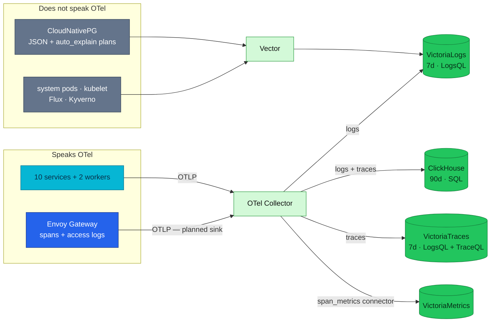
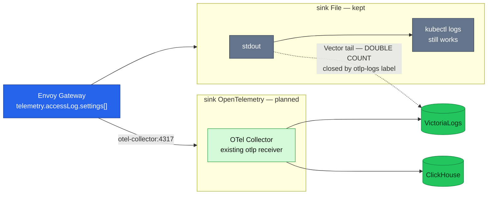

# RFC-0027 Retire Tempo and Jaeger, keeping VictoriaTraces and ClickHouse

| Status | Scope | Research | Created | Last updated |
|--------|-------|----------|---------|--------------|
| implemented | platform-wide | [./research.md](./research.md) — gate passed 2026-08-23 | 2026-08-24 | 2026-08-24 |

> **Don't forget: every decision is a tradeoff.** This one buys back three of five trace
> sinks, two RustFS writers and an undecided ADR lineage. It pays by making a **pre-GA**
> store (`v0.11.0`) the only fast trace path, by leaning on an **experimental** Tempo-compatible
> API for TraceQL, and by giving up Grafana's richest trace correlation surface.

## Prerequisites

- [research.md](./research.md) merged (#877); [research review gate](./research.md#research-review-gate) ticked
- Context7 audit complete (see research footer)
- Owner approved **ready for RFC** — 2026-08-24, with the three-store shape
- Mechanism deep-dive is **not** repeated here — see [`./research.md`](./research.md)
- ADR folders (all `Accepted` 2026-08-24): [`ADR-057`](../../adr/ADR-057-span-metrics-in-collector/),
  [`ADR-058`](../../adr/ADR-058-retire-jaeger/), [`ADR-059`](../../adr/ADR-059-retire-tempo/),
  [`ADR-060`](../../adr/ADR-060-envoy-access-log-transport/)
- `docs/api/` files to touch: **N/A — infra-only.** No route, RPC or payload changes; the
  observability pages under [`docs/observability/`](../../../observability/README.md) carry the
  as-built description instead

## Summary

Cut the trace tier from **five sinks to two** — keep **VictoriaTraces** (7d, fast lookup) and
**ClickHouse** (90d, SQL) — by retiring both Tempo installs and Jaeger. **The log tier does not
change**: application logs keep landing in both VictoriaLogs and ClickHouse, deliberately.
Envoy access logs gain an OpenTelemetry sink so the edge reaches both stores over one path
instead of only the Vector road — shipped in P6, the phase this table originally forgot to
schedule.

Nothing about the application changes. Every service exports to one collector endpoint, so this
is an exporter-list change — the principle [ADR-023](../../adr/ADR-023-clickhouse-observability-olap/)
states as *"a new backend is a collector-exporter change, not an app change"*, applied in the
removal direction.

## Motivation

**Three of the five trace sinks answer the same question over the same window.** Two of them
are the same software deployed twice; a third keeps traces in a memory ring that empties on
restart. That is not a tiering story, it is duplication.

**There is an open decision blocking the topology.** [ADR-040](../../adr/ADR-040-tempo-community-helm-chart/)
is still `Proposed` with `Decision date: —`, and [ADR-032](../../adr/ADR-032-tempo-operator-monolithic/)
was `Withdrawn` *in favour of* it. Tempo has absorbed two records and neither landed. Any change
here has to close that lineage rather than extend it a third time.

**The cost is already visible in two places.** RustFS takes writes from four producers — two of
them the duplicate Tempo pair — while restarting under its own liveness probe. And #874 and
#875 had to correct 17 documentation files whose only fault was describing the fan-out
inaccurately; a smaller fan-out is less to get wrong.

### Goals

- Trace sinks 5 → 2, **without losing a question the platform can answer today**: single-trace
  lookup, shape search, and long-window aggregation all survive
- The two E2E gates measure the same platform — compose already runs the three-store shape
- Close the ADR-032 → ADR-040 lineage with a decision instead of another proposal
- RustFS writers 4 → 2, on the component currently flapping

### Non-Goals

- **Not changing the number of log stores.** Application logs stay in VictoriaLogs *and*
  ClickHouse. Keeping that is a decision recorded here, not an accident.
- **Not** deciding ClickHouse's `create_schema` / self-managed schema question — bounded,
  reversible, and independent of which backends survive; it belongs in its own ADR
- **Not** making ClickHouse the only trace store (research option C) — that removes the fast
  7-day path
- **Not** measuring our own compression or volume figures; that stays an open question

## Proposal

Three stores, **tiered rather than mutually exclusive**:

| Tier | Store | Holds | Answers |
|------|-------|-------|---------|
| Full record, 90d | ClickHouse | everything that speaks OTel — application logs, spans, and Envoy access logs once the sink lands | analytics, aggregation, `otel_logs` ↔ `otel_traces` JOIN on `trace_id` |
| Fast path, 7d | VictoriaLogs | a parallel copy of application logs **plus every non-OTel source** | daily log search, on-call |
| Fast path, 7d | VictoriaTraces | spans | opening one trace mid-investigation |

The dividing line for the log side is **schema fit, not protocol** — the collector has
receivers for most non-OTel sources, so what matters is whether the OpenTelemetry log record can
represent the data without destroying it. PostgreSQL `auto_explain` plan trees cannot survive
that flattening, which is why Vector already routes them to their own VictoriaLogs stream. Full
reasoning in [`./research.md`](./research.md#the-seam-question--and-why-otel-vs-non-otel-is-the-wrong-line).

### Alternatives

Short form; [`./research.md`](./research.md#alternatives) carries the full analysis.

| Option | Why not |
|--------|---------|
| **B — keep the Tempo chart install** | Keeps the RustFS dependency on the flapping component, keeps compose and Kind measuring different platforms, and commits to ADR-040 rather than resolving it |
| **C — ClickHouse only** | Removes the fast 7-day trace path entirely; heaviest single workload |
| **Baseline — keep all five** | Pays five times for one signal and leaves ADR-040 undecided indefinitely |

## Other solutions considered

| Option | Shape | Why not chosen |
|--------|-------|----------------|
| Tempo via the Tempo Operator | Operator-managed monolithic Tempo | Already tried and abandoned — [ADR-032](../../adr/ADR-032-tempo-operator-monolithic/) is `Withdrawn`; reviving it re-opens a closed question |
| Keep exactly one Tempo instead of two | Delete the raw install, keep the chart | Halves the duplication but keeps every Tempo cost, and creates the `TempoDown` zero-series trap described below |
| Keep Jaeger for its UI only | Jaeger as a query frontend over another store | Its store is `memory: max_traces: 100000`, lost on restart; and VictoriaTraces already serves the Jaeger query API, so the UI need is met without the deployment |
| Route span metrics over the existing OTLP metrics path | Reuse `otlp_http/victoriametrics` | The OTLP→Prometheus name translation is an untestable variable while Kind is down; remote-write to vmagent is the path Tempo's generator already proved |

## Architecture & Diagrams

Target state. Labels reflect deployed reality except where marked.

Envoy's two sinks, and the double-count trap the label guard closes:

## Design Details

**How it is enabled.** By deletion, mostly. The collector's `traces` pipeline drops three
exporters; the Tempo and Jaeger workloads, their datasources, dashboard, alert, ServiceMonitor,
ExternalSecret, edge route and RustFS buckets are removed. **23 files carry Tempo in live
configuration** (9 of them retired outright, the rest edited); a further 15 mention it only in
comments that become wrong on removal.

**Manifests are retired, not deleted.** The house pattern renames the file to `*.yaml.bak` and
drops its entry from `kustomization.yaml`, leaving a comment that names the ADR. The reason is
written into the repository already, in
`kubernetes/infra/controllers/temporal/kustomization.yaml`, where the Temporal operator was
retired the same way: the `.bak` suffix *"keeps it out of here and out of `make validate` without
commenting the file into unreadability."* Documentation follows the matching convention —
**archived, not deleted** — as `docs/platform/kong-gateway.md` has done since RFC-0024. Counted with `tempo(?!ral|rar)` — a plain `grep -rli tempo`
returns 94 because it matches inside *Tempo**ral*** and *"**tempo**rarily"*.

**No file under `kubernetes/apps/` is touched.** No service redeploys and no `pkg` bump.

**What changes for a person querying.** Add a **Tempo-type** Grafana datasource pointing at
VictoriaTraces' `…:10428/select/tempo` to keep TraceQL. The existing **`type: jaeger`**
datasource **stays** — VictoriaTraces is queried through the Jaeger query API at
`/select/jaeger`, so removing the Jaeger *deployment* must not remove the Jaeger *datasource
type*. That distinction is the easiest thing to get wrong here.

**Can it be disabled again?** Per phase, yes — see [Rollout & rollback](#rollout--rollback).
Traces already written to a removed store are gone with it, which is why each phase runs after
the 7-day window of the store it replaces, not before.

**How an operator sees it in use.** `service.pipelines.traces.exporters` in the collector
HelmRelease lists exactly the live sinks; that file is the only authoritative answer to "how
many backends are there".

**Drawbacks.** VictoriaTraces is `v0.11.0`, pre-GA, and its Tempo-compatible API is
**experimental** — upstream says *"certain TraceQL functions and drilldown panels may not be
fully supported."* Grafana's richest trace correlation (serviceMap, tracesToMetrics,
tracesToProfiles on the Tempo datasource) is not reproduced. And VictoriaLogs has **no object
storage** — S3/GCS/Minio are on its roadmap — so the 7-day tier cannot grow into a long-term one.

## Security considerations

Net reduction in exposed surface. Removed: the `tempo.duynh.me` HTTPRoute and its two admin
policies, and the `tempo-rustfs-credentials` ExternalSecret with the RustFS key pair it
projects. No new secret is introduced.

The Envoy access-log OpenTelemetry sink adds a destination inside the same namespace as the
collector, over the OTLP port the collector already listens on, so it opens no new trust
boundary and needs no NetworkPolicy change. No Kyverno or PSS impact: nothing gains a
capability, a host mount or a privileged context.

## Observability & SLO impact

**Span metrics are already handled.** The prerequisite landed in #878: the collector's
`span_metrics` connector produces the RED series the SLO and Apdex maths consume, so they no
longer depend on Tempo's lifetime. That change went in **ahead of this RFC's gate** — the reason
and the rollback condition are recorded in
[`./research.md`](./research.md#integration-paths).

Three things to watch, all recorded rather than assumed:

- **`spanmetrics_*` has no consumer on the cluster yet.** Producing a signal nobody reads is
  the exact criticism this RFC makes of Tempo. local-stack already ships
  `red-spanmetrics.json`; porting it needs the cluster VictoriaMetrics datasource uid, so it
  waits for a live cluster rather than risking the dangling reference K5.7 exists to catch.
- **Service graphs are replaced, not lost — decided in [ADR-059](../../adr/ADR-059-retire-tempo/).**
  Tempo runs both `service-graphs` and `span-metrics` processors, and `servicegraph` is a
  separate connector neither environment runs. Rather than adopt it, topology comes from
  **VictoriaTraces' Jaeger dependency API** (`/select/jaeger/api/dependencies`, behind
  `-servicegraph.enableTask`), which Grafana's existing `jaeger` datasource renders natively with
  its **Dependency graph** query type. That is a capability *gain*: the cluster has no service map
  today. What it does not give is per-edge failure and latency — for those, the spans are in
  ClickHouse for 90 days and a documented self-join recovers them. The `service_graph` connector
  stays a revisit trigger for the one case neither covers: PromQL-alertable per-edge health.
- **`TempoDown` must go with *both* installs, not one.** It alerts on
  `up{job=~".*tempo.*"}`, and the only scrape producing that label selects `app: tempo` — the
  raw install alone. Removing the raw install while keeping the chart leaves the alert with
  **zero series**: it loads cleanly, never fires, and reads as healthy forever.

K5.1 — the only assertion proving trace context survives across services — is SQL on
ClickHouse and is unaffected, because ClickHouse stays.

## Rollout & rollback

Phased, each phase independently revertible. Blast radius is the observability read path only;
no application traffic depends on any of it.

| Phase | Action | Rollback |
|-------|--------|----------|
| **P0 — done (#878)** | `span_metrics` connector in the collector, parallel to Tempo's generator | Remove the connector, its pipeline and the remote-write exporter — one file |
| **P1** | Add a Tempo-type datasource at `/select/tempo` **beside** the Jaeger-type one; run the real TraceQL queries and record what fails | Delete the datasource; nothing else changed |
| **P2** | Remove Jaeger — the cheapest removal in the tree: no alert, dashboard, scrape, secret, PVC, bucket, NetworkPolicy or `dependsOn`. Keep the `type: jaeger` datasource | Re-add one HelmRelease |
| **P3** | Decide service graphs: add the `servicegraph` connector, or accept the loss in writing | Connector out, or the decision reversed |
| **P4** | Retire both Tempo installs to `*.yaml.bak`, drop them from their kustomizations, and delete both RustFS buckets, `TempoDown`, the ServiceMonitor, the ExternalSecret and the edge route | Rename the `.bak` files back and restore the kustomization entries; traces inside the 7-day window are not recoverable |
| **P5** | Correct the 15 comment-only mentions, the hardcoded audit counts, and the observability docs. The archived records — [`tracing/tempo.md`](../../../observability/tracing/tempo.md) and [`tracing/jaeger.md`](../../../observability/tracing/jaeger.md) — are written *before* P4, not after | Docs only |
| **P6** | [ADR-060](../../adr/ADR-060-envoy-access-log-transport/): add the `OpenTelemetry` access-log sink beside `File`, and label the Envoy pods so Vector stops tailing them. **This phase was missing from the table until 2026-08-24** — the decision was `Accepted` with no phase to carry it, while this RFC's own summary described the sink as though it existed | Remove the sink and the label — one file; Vector resumes tailing on the next reconcile |

P1 gates P4: if TraceQL parity is unacceptable, this RFC's chosen option fails and option B
returns to the table.

## Testing / verification

- `make validate` on every phase — Kustomize build plus the Kyverno policy tests
- **The P1 experiment was the deciding input**: a Tempo-type datasource against `/select/tempo`,
  exercised with the TraceQL queries actually used. **Run 2026-08-24**; the result and the
  silent-failure cost it exposed are recorded in
  [ADR-059](../../adr/ADR-059-retire-tempo/).
- A PromQL check that the connector's series exist and carry the service label:
  `count(spanmetrics_calls_total)` and `count by (service_name) (spanmetrics_calls_total)`
- The compose gate stays the reference: it already runs the three-store shape end to end
- Kind gate rows re-derived after P4: **K5.5** now passes (the spanmetrics leg is live on the
  cluster per ADR-057, not compose-only as the runbook claimed) and **K5.7** passes. **K5.3** had
  to be retargeted in P6: its Vector leg asserted *"the Vector leg has edge access logs"*, which
  ADR-060 makes permanently false. C17 / C18 / C21 are **compose** rows and are re-derived on the
  next compose gate

## Resulting decisions

Four independent decisions, all created at `Proposed` during architecture review per the flow
in [`../README.md`](../README.md). All four are `Accepted` as of 2026-08-24, on the evidence of
the P1 experiment. Three are `Adoption: Complete`; ADR-057 stays `Partial` on purpose — the
series exist and nothing reads them yet.

| Decision | ADR | Status |
|----------|-----|--------|
| Retire both Tempo installs, resolving the ADR-032 → ADR-040 lineage rather than extending it; service graphs come from VictoriaTraces' dependency API | [`ADR-059`](../../adr/ADR-059-retire-tempo/) | Accepted · Adoption `Complete` — and [ADR-040](../../adr/ADR-040-tempo-community-helm-chart/) is now `Withdrawn`, the obligation P4 missed |
| Retire Jaeger while keeping the Jaeger **datasource type** that VictoriaTraces is queried through | [`ADR-058`](../../adr/ADR-058-retire-jaeger/) | Accepted · Adoption `Complete` |
| Derive RED span metrics in the collector rather than inside a trace backend — **already implemented** in #878, ahead of this gate | [`ADR-057`](../../adr/ADR-057-span-metrics-in-collector/) | Accepted · Adoption `Partial` |
| Send Envoy access logs over an OpenTelemetry sink in addition to stdout, with the `otlp-logs` label closing the double count | [`ADR-060`](../../adr/ADR-060-envoy-access-log-transport/) | Accepted · Adoption `Complete` (P6) |

The first depends on the third: retiring Tempo without a span-metrics producer removes series
the SLO maths consumes. The other two stand alone.

## Implementation History

- **2026-08-23** — theme registered in the RFC backlog (#876)
- **2026-08-23** — `research.md` opened at `researching`; number reserved (#877)
- **2026-08-24** — P0 groundwork landed ahead of the gate: the `span_metrics` connector (#878),
  with the reason and rollback condition recorded in the research
- **2026-08-24** — this README; Status `provisional`, under architecture review
- **2026-08-24** — P1 TraceQL experiment run on Kind; span-metrics verified at 421 series. RFC → `Accepted`, ADR-057..060 → `Accepted`
- **2026-08-24** — P2 + P3 + P4 (#881): Jaeger and both Tempo installs retired to `*.yaml.bak`,
  service graphs taken from VictoriaTraces' dependency task. Verified on a cluster rebuilt from
  scratch — 22/22 Kustomizations Ready, **0** Tempo/Jaeger workloads, RustFS writers 4 → 2, and
  the replacement graph at **31 edges** including database and edge-originated dependencies
- **2026-08-24** — P5 (#882): 40 documents and **10 runbooks** corrected. The audit found two
  defects that were not documentation: `OtelCollectorDown` had shared a file with `TempoDown` and
  was deleted with it (**critical**, restored in its own file), and `tracesToProfiles` turned out
  to be a Tempo-datasource-only Grafana option, so the span→profile pivot is a **recorded gap**
  rather than something that could be moved
- **2026-08-24** — P6 (#886): ADR-060 implemented — the phase this RFC had never scheduled.
  Edge rows in `otel.otel_logs` **0 → 30** for 30 requests, Vector path to **0**, no double
  count. A `op: add` patch on the pod object was silently eating the guard label; the compose
  exclusion list had drifted from the anchor that enables OTLP logs. RFC → `implemented`

## Related

- [./research.md](./research.md) — plain-language research and Context7 audit trail
- [ADR-023](../../adr/ADR-023-clickhouse-observability-olap/) — ClickHouse as the OLAP tier
- [ADR-032](../../adr/ADR-032-tempo-operator-monolithic/) · [ADR-040](../../adr/ADR-040-tempo-community-helm-chart/) — the Tempo lineage this RFC closes
- [RFC-0014](../RFC-0014/) — full OpenTelemetry adoption · [RFC-0019](../RFC-0019/) — ClickHouse for OTel logs and traces
- [`docs/observability/README.md`](../../../observability/README.md) — as-built observability hub

---
_Last updated: 2026-08-24_
