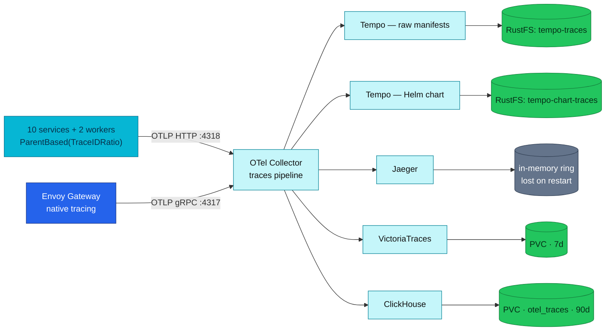
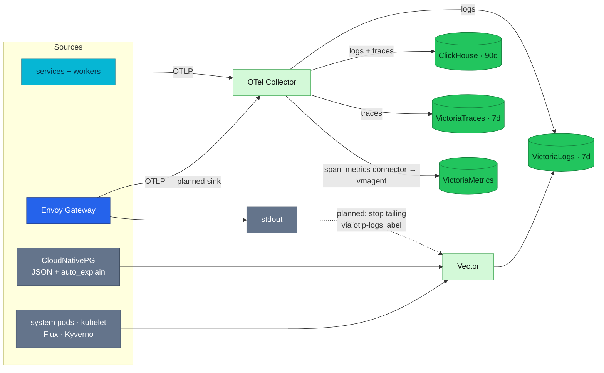

# RFC-0027 — Research: consolidating the trace and log backends

| | |
|---|---|
| **RFC** | RFC-0027 |
| **Status** | researching |
| **Scope** | platform-wide |
| **Created** | 2026-08-23 |
| **Last updated** | 2026-08-24 |

> **Plain-language research.** Written to explain the problem to ourselves before deciding
> anything. No decision is taken in this file, and no manifest changes belong here.

---

## Table of contents

1. [Problem statement](#problem-statement)
2. [Reading path](#reading-path)
3. [What backend consolidation is](#what-backend-consolidation-is)
4. [Core components](#core-components)
5. [Core mechanism](#core-mechanism)
6. [Glossary](#glossary)
7. [Worked examples](#worked-examples)
8. [vs platform as-built](#vs-platform-as-built)
9. [Integration paths](#integration-paths)
10. [Alternatives](#alternatives)
11. [Open questions](#open-questions)
12. [FAQ](#faq)
13. [References](#references)
14. [Context7 audit log](#context7-audit-log)
15. [Research review gate](#research-review-gate)

---

## Problem statement

### Real-world trigger

| | |
|---|---|
| **Situation** | One signal — traces — is written to **five** backends at once. Two of them are the same software (Tempo) deployed twice, and a third (Jaeger) keeps its traces in a memory ring that empties on restart. Logs are written to two. |
| **Who feels it** | On-call first (which store do I open, and does it still have the window I need?), then whoever writes documentation — 17 files had to be corrected in #874 and #875 purely to describe the fan-out that exists. |
| **Why now** | The accuracy work made the shape visible. It also surfaced that Tempo has absorbed **two** decision records and neither landed: [ADR-032](../../adr/ADR-032-tempo-operator-monolithic/) is `Withdrawn` in favour of [ADR-040](../../adr/ADR-040-tempo-community-helm-chart/), which is still `Proposed` with `Decision date: —`. |
| **If we do nothing** | ADR-040 stays undecided indefinitely; RustFS keeps taking writes from four producers, two of which are the duplicate Tempo pair, while it is already restarting under its own liveness probe; and every new observability document has to describe five sinks correctly or join the drift. |

> **In plain terms:** we are paying to store the same traces five times, nobody has decided
> which copies are load-bearing, and the cost shows up as confusion during incidents and as
> churn in the docs.

**The trigger that makes this worth learning rather than just tidying:** most platforms in the
real world are *brownfield*. A large part of what they must observe does not speak OTLP and
never will — legacy applications, vendor appliances, databases, network gear, somebody's cron
job. A design that only works when everything emits OpenTelemetry is a greenfield design. This
platform already has both kinds of source, so it is a fair place to work out where the dividing
line actually belongs.

### What homelab practice proves

Everything in this section was read from manifests, not from documentation, because at the time
of writing the documentation disagreed with the manifests.

- **The fan-out is a collector concern, not an application concern.** Every service exports to
  one endpoint (`OTEL_COLLECTOR_ENDPOINT`, default the collector on `:4318` —
  `pkg/obsx/setup.go:123`). No service names Tempo, Jaeger, VictoriaTraces or ClickHouse.
  [ADR-023](../../adr/ADR-023-clickhouse-observability-olap/) states the principle directly:
  *"a new backend is a collector-exporter change, not an app change."* Removing one is the same
  kind of change.
- **A duplicated component is not necessarily a duplicate.** The two Tempo installs differ in
  the one way that matters — see [Core mechanism](#core-mechanism).
- **Removal cost can be measured before committing.** The blast radius is countable from the
  tree, and it turns out to touch no application manifest at all.
- **The non-OTel side already exists and already needed custom work.** Vector carries
  PostgreSQL-specific transforms and its own VictoriaLogs stream — the platform hit the
  "OTel schema does not fit this" problem before anyone framed it.

---

## Reading path

Suggested order through this file:

1. [Core components](#core-components) → [Core mechanism](#core-mechanism) — what runs, and the
   one difference that makes the Tempo pair not a pair
2. [vs platform as-built](#vs-platform-as-built) — the five blockers, each with the evidence
3. [Alternatives](#alternatives) → [Open questions](#open-questions) — what is still undecided
4. [Research review gate](#research-review-gate)

---

## What backend consolidation is

Consolidation here means reducing the number of *stores* a signal is written to, without
reducing the number of *questions* the platform can answer. Those are different things, and the
whole difficulty sits in the gap between them.

A trace store answers roughly four questions: show me this one trace; find traces matching a
shape; what is the service topology; and what are the aggregate rates and latencies. Different
stores answer those with different query languages and different retention. Two stores holding
the same spans for the same seven days answer nothing extra. Two stores where one keeps 7 days
for fast lookup and the other keeps 90 days for SQL analysis answer strictly more.

> **In plain terms:** the goal is not "fewer things running" for its own sake — it is removing
> copies that answer no question the remaining copies cannot.

---

## Core components

Read from `kubernetes/infra/` at `1a6d471e`. Retention and resource figures are quoted from the
manifests, not observed.

| Component | Signal | Retention | Requests → limits | Role as recorded today |
|-----------|--------|-----------|-------------------|------------------------|
| VictoriaLogs | logs | 7d | 50m / 192Mi → 500m / 768Mi | operational primary for logs |
| VictoriaTraces | traces | 7d | 50m / 128Mi → 250m / 512Mi | pilot, pre-GA `v0.11.0` |
| Tempo (hand-written manifests) | traces | 7d | 100m / 128Mi → 256Mi | operational primary |
| Tempo (community Helm chart) | traces | 7d | 100m / 128Mi → 256Mi | parallel run under ADR-040 (`Proposed`) |
| Jaeger | traces | none — `memory: max_traces: 100000` | not declared | secondary UI, in-memory |
| ClickHouse | logs + traces | 90d (`ttl: 2160h`) | 200m / 1Gi → 2Gi | analytics tier, ADR-023 `Accepted` |
| Vector | logs (transport) | — | — | collects from sources that do not emit OTLP |

Two things stand out from the table alone. **Two** components are recorded as "operational
primary" for traces, plus a parallel run, plus a pilot. And Jaeger's store is a ring buffer that
empties whenever the pod restarts, while still occupying an exporter slot on the hot path.

---

## Core mechanism

### One pipeline, five exporters

`service.pipelines` in `kubernetes/infra/controllers/tracing/otel-collector/otel-collector.yaml`
is the only file that answers "how many backends are there", which is why the documentation
drifted from it:

| Pipeline | Exporters |
|----------|-----------|
| `traces` | `otlp/tempo`, `otlp/tempo-chart`, `otlp/jaeger`, `otlp_http/victoriatraces`, `clickhouse` |
| `logs` | `otlp_http/victorialogs`, `clickhouse` |
| `metrics` | `otlp_http/victoriametrics` |

Eight exporters are defined; seven are wired. Only `debug` is unwired.



> **In plain terms:** one span arriving at the collector is written five times, to five
> different places, with five different retention and query stories.

### Where span metrics are made — the one difference that matters

The two Tempo installs look interchangeable and are not. Both declare a
`metrics_generator`; only one of them is switched on.

| | Tempo (raw manifests) | Tempo (Helm chart) |
|---|---|---|
| Bucket | `tempo-traces` | `tempo-chart-traces` |
| `metrics_generator` | configured but **inert** (`remote_write: []`) | **enabled** → vmagent, `send_exemplars: true` |
| Processors | — | `service-graphs` + `span-metrics` |
| Scraped by | `ServiceMonitor/tempo`, selector `app: tempo` | `serviceMonitor.enabled: false` |

So the chart install is the **only live producer of RED span metrics on the cluster**. That is
the hard prerequisite for everything else in this research: those series feed the SLO and Apdex
maths, and removing their only producer removes them.

local-stack already solves this a different way. Its collector runs the `span_metrics`
**connector**, and the compose comment says so explicitly — it *"stands in for Tempo's
metrics-generator (which produces span_metrics in-cluster)"*. A vendor-neutral replacement is
therefore already written and already covered by the compose gate.

**Update 2026-08-24 — the span-metrics half is now deployed on the cluster too.** The
`span_metrics` connector runs in the cluster collector, ported from local-stack so both gates
emit the same series (`namespace: spanmetrics` → `spanmetrics_calls_total`,
`spanmetrics_duration_*`), remote-writing to the same vmagent endpoint Tempo's generator uses.
Tempo still produces its own `traces_spanmetrics_*` in parallel; the names differ, so the two
producers do not collide and nothing was removed.

**But the service-graph half has no counterpart, and an earlier draft of this file glossed
over that.** The cluster's Tempo runs *both* processors — `overrides.defaults
.metrics_generator.processors: [service-graphs, span-metrics]` — while the collector's
`span_metrics` connector produces span metrics only. Service graphs are a **separate**
connector, and local-stack does not run one either. So removing Tempo today would still drop
`traces_service_graph_*`. That is a decision to take, not a detail: nothing consumes those
series now, so the options are to add the `servicegraph` connector or to accept the loss
explicitly.

> **In plain terms:** the RED-metrics prerequisite is discharged; the service-graph one is
> still open, and calling the whole move "a port, not a design" was too generous.

### Two log roads, and the guard that keeps them apart

Logs reach VictoriaLogs by two independent paths, and the separation is deliberate:

- **OTLP road** — instrumented services tee their zap output through otelzap to the collector.
- **Vector road** — a DaemonSet tails container stdout for everything else: Envoy Gateway,
  CloudNativePG, the SPAs, system pods.

The guard is a label selector on Vector's `kubernetes_logs` source,
`extra_label_selector: "platform.duynhlab.dev/otlp-logs!=true"`. All five domain ResourceSets
stamp that label with a default of `"true"`, and the two workers carry it explicitly, so Vector
skips exactly the pods that ship their own logs. Double ingestion of application logs — the
failure everyone expects — does not happen.

The duplication that *does* exist is inside the OTLP road: the `logs` pipeline exports to both
VictoriaLogs and ClickHouse, so every application log line is stored twice, once for seven days
of LogsQL and once for ninety days of SQL.

---

## Glossary

| Term | In plain English |
|------|------------------|
| Span metrics / RED metrics | Rate, errors, duration counters derived *from* traces, so dashboards need not read traces |
| metrics-generator | The Tempo component that derives those counters inside Tempo |
| `span_metrics` connector | The collector component that derives the same counters before storage, independent of any backend |
| Exemplar | A sample trace ID attached to a metric bucket, so a chart can jump to one representative trace |
| TraceQL | Tempo's trace query language |
| LogsQL | VictoriaLogs' query language; VictoriaTraces also accepts it over spans |
| ALS | Envoy's gRPC Access Log Service — access logs pushed to a remote service instead of a file |
| Schema fit | Whether the OpenTelemetry log record can represent a piece of data without losing its structure |

---

## Worked examples

> **Not deployed** — mechanism and syntax only.

**Pointing a Tempo-type datasource at VictoriaTraces.** The Tempo-compatible surface lives under
a separate prefix, so it can be added *beside* the existing Jaeger-type datasource rather than
replacing it:

```
# existing, keeps working
http://vtsingle-victoria-traces.monitoring.svc.cluster.local:10428/select/jaeger

# Tempo-compatible surface, enables TraceQL
http://vtsingle-victoria-traces.monitoring.svc.cluster.local:10428/select/tempo
```

**Envoy access logs to both destinations.** `telemetry.accessLog.settings[]` and each entry's
`sinks[]` are lists, so a File sink and an OpenTelemetry sink can coexist:

```yaml
telemetry:
  accessLog:
    settings:
      - sinks:
          - type: File          # keeps `kubectl logs` useful
            # ...
          - type: OpenTelemetry # OTLP straight to the running collector
            openTelemetry:
              host: otel-collector.monitoring.svc.cluster.local
              port: 4317
```

---

## vs platform as-built

| Aspect | Platform today (deployed) | Candidate shape |
|--------|---------------------------|-----------------|
| Trace stores | 5 | 2 — VictoriaTraces + ClickHouse |
| Log stores | 2 | 2 — unchanged |
| Metric stores | 1 | 1 — unchanged |
| Span metrics produced by | Tempo chart metrics-generator **and** the collector `span_metrics` connector (both, since 2026-08-24) | connector only |
| Service graphs produced by | Tempo chart metrics-generator only | **undecided** — needs a `servicegraph` connector or an accepted loss |
| Trace query languages | TraceQL (Tempo), Jaeger-style (VictoriaTraces), SQL (ClickHouse) | TraceQL + LogsQL (VictoriaTraces), SQL (ClickHouse) |
| Object storage dependency | RustFS — 4 writers | RustFS — 2 writers |
| Envoy access logs | stdout → Vector → VictoriaLogs | additionally OTLP → collector → both stores |

Below, each blocker with the evidence. These are the parts that decide whether the candidate
shape is reachable, and in what order.

### Blocker 1 — span metrics have exactly one live producer

Covered in [Core mechanism](#core-mechanism). Tempo cannot be removed before the
`span_metrics` connector is carrying those series on the cluster. Two supporting observations,
both of which cut in favour of moving rather than preserving:

- **Nothing currently consumes them.** `grep -rE "traces_spanmetrics|traces_service_graph"
  kubernetes/` returns nothing — no dashboard, alert or recording rule reads what the live
  generator emits.
- **The audit already records the gap.** The Kind gate's K5.5 row marks the spanmetrics leg
  *N/A on the cluster*, because the cluster has no such connector.

### Blocker 2 — TraceQL is not lost, but the datasource has to change

The repository currently records that VictoriaTraces cannot serve TraceQL, on the grounds that
its Grafana datasource is `type: jaeger`. That was true of the datasource and is no longer true
of the product.

VictoriaTraces serves a Tempo-compatible HTTP API under `/select/tempo`: TraceQL search,
attribute name and value lookups for autocomplete, fetch-by-trace-ID, and TraceQL metrics
queries. Upstream states the requirement as **v0.9.4 or higher**; the repository pins
**`v0.11.0`** (`vtsingle.yaml:25`), so the capability is present in the running version.

Two caveats belong in the same breath. Upstream labels the Tempo API **experimental**, and says
plainly that *"certain TraceQL functions and drilldown panels may not be fully supported."*

> **In plain terms:** the biggest argument against dropping Tempo turns out to be testable
> rather than fatal — and the test can be run while Tempo is still installed.

This converts an open-ended worry into one experiment: add a second, Tempo-type datasource
pointing at `/select/tempo`, run the TraceQL queries that actually get used, and record what
does not work. Nothing has to be removed to find out.

### Blocker 3 — removing Jaeger must not remove the Jaeger datasource type

Fifteen files mention Jaeger, but they are not all the same kind of mention.
`datasource-victoriatraces.yaml` and `vtsingle.yaml` name Jaeger because **VictoriaTraces is
queried through the Jaeger query API** at `/select/jaeger`. Deleting the Jaeger *deployment*
must leave the Jaeger *datasource type* in place, or the surviving trace store loses its
existing query path.

### Blocker 4 — the assertion that proves traces propagate is SQL on ClickHouse

The Kind gate's K5.1 row is the only assertion in the repository that demonstrates trace context
survives across service boundaries, and it is a SQL query against ClickHouse. This does not
block removing Tempo or Jaeger, but it does mean ClickHouse cannot be treated as the optional
member of the pair without writing a replacement assertion first.

### Blocker 5 — three constants drift silently

- **`TempoDown` becomes meaningless if only one Tempo is removed.** It alerts on
  `up{job=~".*tempo.*"}`, and the only scrape producing that label is `ServiceMonitor/tempo`,
  which selects `app: tempo` — the raw install alone. Remove the raw install and keep the chart
  and the alert has zero series: it loads cleanly, never fires, and reads as healthy forever.
  Removing *both* makes deleting the alert correct; removing *one* is the dangerous case.
- **Hardcoded counts in the E2E audit** — C17 asserts exactly five datasources, C18 exactly 18
  dashboards, C21 exactly 18 alerting rules. These are constants in a document, not derived.
- **Three `tracesToLogsV2` links** — configured on the Tempo, Jaeger and VictoriaTraces
  datasources, all pointing at VictoriaLogs. Removing a datasource leaves the others' links
  intact but the removed one's configuration dead.

### The seam question — and why "OTel vs non-OTel" is the wrong line

The obvious way to divide the two sides is "does the source speak OTLP". That line is wrong,
because the collector already has receivers for most things that do not: `filelog`, `syslog`,
and an `envoyalsreceiver`. Protocol is not the constraint.

The constraint is whether the OpenTelemetry log record can carry the data without destroying
what makes it useful:

| Tier | On this platform | Convertible? | Belongs |
|------|------------------|--------------|---------|
| Convertible, and worth it | Envoy Gateway access logs | Yes — first-class `OpenTelemetry` sink, no new component | either or both |
| Convertible, but it only moves the parsing | system pods, kubelet, Flux and Kyverno controllers | Yes, but `filelog` delivers the *line*; the semantics stay free text | Vector → VictoriaLogs |
| Not convertible into anything meaningful | **PostgreSQL `auto_explain` execution plans** | The value is a nested JSON plan tree; flattening it into `Body` plus a `LogAttributes` map discards the structure | VictoriaLogs, its own stream |

The third tier is not hypothetical, and the platform answered it before anyone asked the
question. Vector already carries `parse_pg_json` → `filter_pg_auto_explain` →
`parse_pg_auto_explain` and routes the result to a **separate** VictoriaLogs sink,
`victorialogs_pg_plans`, distinct from `victorialogs_all`. VictoriaLogs describes itself as
schema-free, which is the property that tier needs.

> **In plain terms:** draw the line by whether the OTel schema fits the data, not by which
> protocol the source happens to speak.

### Envoy — the one source where the seam is a choice

Envoy Gateway supports three access-log sink types: **ALS**, **File** and **OpenTelemetry**.
The OpenTelemetry sink pushes OTLP directly to a host and port, which means the collector's
existing `otlp` receiver serves it — **no new component**, and no need for the alpha
`envoyalsreceiver`. On Kubernetes, Envoy Gateway also attaches pod and namespace metadata
automatically, which the Vector road currently reproduces with a `remap` transform.

There is a trap. Adding the OTel sink does not stop Vector tailing Envoy's stdout, so
VictoriaLogs would hold Envoy access logs twice. The fix is the mechanism already protecting
application logs: label the Envoy pods `platform.duynhlab.dev/otlp-logs=true` and Vector skips
them. Keeping the File sink alongside preserves `kubectl logs`, because Vector stops *tailing*
while stdout is still written.

---

## Integration paths

All **planned** — no manifests exist for any of this.



> **In plain terms:** the collector keeps being the only place that fans out, so each step here
> is an exporter or a sink change rather than an application change.

**Removal surface, counted from the tree.** A caution first, because it bit this research three
times: `grep -rli tempo kubernetes/` returns **94** files, but "tempo" matches inside both
*Tempo**ral*** and *"**tempo**rarily"*. Excluding both leaves **38**.

Of those 38, **15 mention Tempo only in comments** — not work required to remove it, but
comments that become wrong the moment it goes. The remaining **23** carry Tempo in live
configuration:

| Kind of work | Files | What |
|--------------|-------|------|
| Delete outright | 9 | `tempo/{deployment,configmap,service}.yaml`, `tempo-chart/helmrelease.yaml`, `tempo-rustfs.yaml`, `datasource-tempo.yaml`, `servicemonitors/tempo.yaml`, `tempo-alerts.yaml`, the Tempo dashboard |
| Kustomization lists | 6 | tracing · grafana · dashboards · metrics · prometheusrules/observability · cluster-external-secrets |
| Edge | 3 | the `tempo.duynh.me` route and two admin policies |
| RustFS bucket lists | 2 | `job-setup-buckets.yaml` and `helmrelease-cronjobs.yaml` — the two copies its own comment says to *"keep in step"* |
| Collector | 1 | drop two exporters and their pipeline entries |
| Flux + namespaces | 2 | `clusters/local/tracing.yaml` health checks, `namespaces.yaml` |

**No file under `kubernetes/apps/` appears in that list.** ADR-023's principle holds in the
removal direction too: no service redeploys, no `pkg` bump.

---

## Alternatives

| Option | Pros | Cons |
|--------|------|------|
| **Keep all five** (baseline) | No work, no risk of losing a query path | Pays five times for one signal; ADR-040 stays undecided; RustFS keeps four writers; documentation keeps drifting |
| **A — VictoriaTraces + ClickHouse** *(the shape being explored)* | Cluster matches local-stack; same operator family as VictoriaMetrics and VictoriaLogs; RustFS writers 4 → 2; TraceQL reachable via `/select/tempo`; LogsQL over spans as a second language | VictoriaTraces is pre-GA `v0.11.0` and its Tempo API is experimental; requires the span-metrics move first |
| **B — Tempo (chart) + ClickHouse** | GA product, native TraceQL, richest Grafana correlation; keeps the live span-metrics generator, so no prerequisite | Keeps the RustFS dependency on the component that is currently flapping; compose still has no Tempo, so the two gates keep measuring different platforms; commits to ADR-040 |
| **C — ClickHouse only** | One engine, SQL, and a JOIN between `otel_logs` and `otel_traces` on `trace_id`; K5.1 already lives here | Loses the fast 7-day lookup path for traces entirely; heaviest single workload (1Gi → 2Gi) |

All four remain open. This file does not choose.

---

## Open questions

- [ ] **Run the TraceQL experiment.** Add a Tempo-type datasource against `/select/tempo` and
      record which real queries and drilldown panels work on `v0.11.0`. Not yet run — the Kind
      cluster is down. This is the single most decision-relevant unknown.
- [ ] **Measure RustFS writes per producer.** The hypothesis that the Tempo pair is roughly half
      the trace PUT volume follows from the topology but has not been measured.
- [ ] **Measure our own compression and volume.** No figure in this research is ours; a
      `system.parts` query over `otel_logs` and `otel_traces` would give real bytes and real
      ratios.
- [ ] **Decide the service-graph question** — add the `servicegraph` connector, or accept
      losing `traces_service_graph_*` when Tempo goes. Nothing consumes them today.
- [ ] **Give the new series a consumer.** The cluster now produces `spanmetrics_*` and no
      cluster dashboard reads them — the same producer-without-consumer shape this research
      criticises Tempo for. local-stack already has `red-spanmetrics.json`; porting it needs the
      cluster VictoriaMetrics datasource uid, so it is deliberately left out until Kind is up.
- [ ] **Confirm the log topology stays dual on purpose.** Application logs are stored twice
      today. Keeping that is a decision worth recording rather than leaving as an accident.
- [ ] **Decide the Envoy access-log transport** — File only, OTel only, or both — and whether
      the double-count fix is the label or dropping the File sink.
- [ ] **Owner input:** does removing both Tempo installs resolve ADR-040 by withdrawal or by
      supersession?

---

## FAQ

**If Jaeger's data is lost on every restart, why is removing it not trivial?**

It nearly is — of all the backends it has the smallest surface: no alert, no dashboard, no
scrape, no secret, no PVC, no bucket, no NetworkPolicy, no `dependsOn`, no compose counterpart.
The only care needed is [Blocker 3](#blocker-3--removing-jaeger-must-not-remove-the-jaeger-datasource-type):
the datasource *type* has to survive.

**Does consolidating traces reduce what we can ask?**

That is exactly what the TraceQL experiment is for. On paper the candidate shape keeps
fast lookup (VictoriaTraces, 7d), a query language for shapes (TraceQL, experimental), a second
language over the same spans (LogsQL), and long-window analysis (ClickHouse SQL, 90d). Whether
the experimental TraceQL surface covers real use is unverified.

**Why keep two log stores while cutting trace stores to two?**

Because the two log stores answer different questions — seven days of fast text search versus
ninety days of SQL and JOINs — whereas three of the five trace stores answer the same question
over the same window. Same-question copies are what this research proposes examining.

**Is VictoriaLogs a long-term store?**

Not today. Object storage (S3, GCS, Minio) is on its published roadmap, not in the product;
retention is disk-based via `-retentionPeriod` and the disk-usage flags. Worth knowing
operationally: at 100% disk VictoriaLogs goes read-only and **cannot** drop data to recover, so
upstream advises keeping at least 20% free.

---

## References

- OpenTelemetry Collector — ClickHouse exporter, `filelog`, `syslog` and Envoy ALS receivers
- VictoriaTraces — querying (Jaeger and Tempo HTTP APIs), common flags
- VictoriaLogs — data ingestion, retention, FAQ, roadmap
- Envoy Gateway — proxy access log tasks and `ProxyAccessLogSinkType`
- Grafana Tempo — metrics-generator and TraceQL
- In-repo: [ADR-023](../../adr/ADR-023-clickhouse-observability-olap/),
  [ADR-032](../../adr/ADR-032-tempo-operator-monolithic/),
  [ADR-040](../../adr/ADR-040-tempo-community-helm-chart/),
  [RFC-0014](../RFC-0014/), [RFC-0019](../RFC-0019/)

---

## Context7 audit log

| Claim / section | Source checked | Result |
|-----------------|----------------|--------|
| VictoriaTraces cannot serve TraceQL | VictoriaTraces querying docs | **corrected** — Tempo API under `/select/tempo`, requires ≥ `v0.9.4`, experimental |
| VictoriaTraces is queryable only Jaeger-style | same | **corrected** — LogsQL also queries spans |
| VictoriaLogs can hold long-term data | VictoriaLogs README, FAQ, roadmap | **confirmed absent** — object storage is roadmap; plus the read-only-at-100%-disk behaviour |
| Envoy access logs need the alpha `envoy_als` receiver to reach OTel | Envoy Gateway access-log task + extension types | **corrected** — a first-class `OpenTelemetry` sink exists; `settings[]` and `sinks[]` are lists |
| Sources that do not speak OTLP cannot enter an OTel pipeline | collector-contrib receivers | **corrected** — `filelog`, `syslog`, `envoyalsreceiver` exist; the real constraint is schema fit |
| Exporter counts and retention | `otel-collector.yaml` `service.pipelines` | **confirmed** from manifest — 5 / 2 / 1, eight defined and seven wired |
| Tempo removal surface | `kubernetes/` tree | **corrected** — 94 raw grep hits collapse to 38 once *Temporal* and *temporarily* are excluded |

---

## Research review gate

- [x] Answers a **real-world problem** you'd recognize at work — brownfield sources that do not
      emit OTLP, plus an undecided record blocking a topology change
- [x] **Problem statement** names situation, who feels it, and cost of doing nothing
- [x] At least **two alternatives** documented with tradeoffs — baseline plus three shapes
- [x] **Platform as-built** section filled from manifests/docs (not boilerplate)
- [x] Primary use-case direction stated — remains **undecided** pending the TraceQL experiment
- [x] **Context7 audit** complete; footer date updated
- [x] At least **one Mermaid** diagram; labels match deployed vs **planned** reality
- [x] No Kubernetes manifest changes smuggled into this research file
- [ ] Owner sign-off: **ready for RFC**

---

_Last verified: 2026-08-24 (Context7 + manifest cross-check; the `span_metrics` connector
landed on the cluster after the first revision). The
`/select/tempo` TraceQL experiment has **not** been run — the Kind cluster is down — and no
volume or compression figure in this file was measured on this platform._
