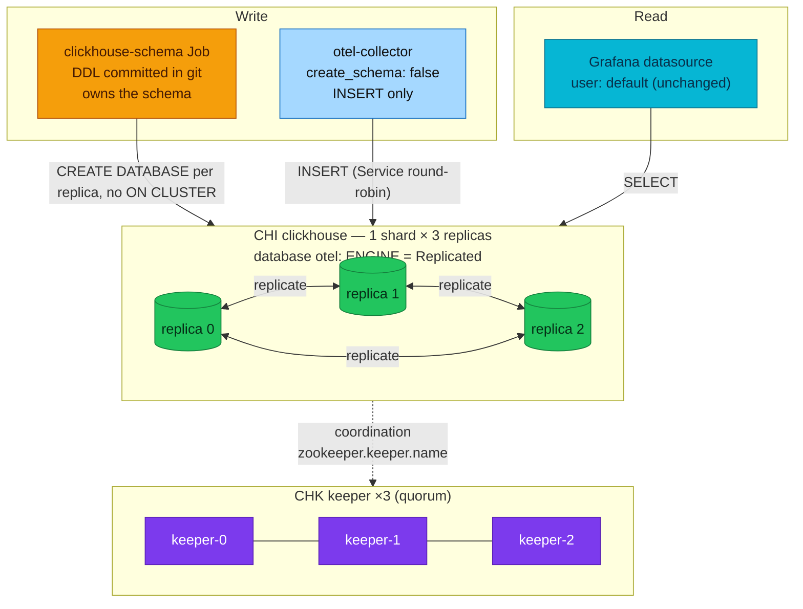

# RFC-0028 Replicate the ClickHouse observability store

| Status | Scope | Research | Created | Last updated |
|--------|-------|----------|---------|--------------|
| Accepted | infra | [./research.md](./research.md) — gate passed 2026-08-28 | 2026-08-28 | 2026-08-28 |

> **Don't forget: every decision is a tradeoff.** The two costs of the chosen
> schema path are named below as revisit triggers, not hidden.

## Prerequisites

- [x] [./research.md](./research.md) merged (#947, amendments #948/#949); [research review gate](./research.md#research-review-gate) ticked 2026-08-28
- [x] Context7 audit complete (see research § Context7 audit log)
- [x] Owner approved **ready for RFC** (2026-08-28, in-session)
- Mechanism deep-dive lives in [./research.md](./research.md) — this file only decides
- Status → **`Accepted`** 2026-08-28. ADR: [`ADR-065`](../../adr/ADR-065-clickhouse-replicated-topology/) — created at `Accepted` with this review. Its one decision is the 1×3 + CHK topology with a **Job-owned** replicated schema; the exporter-owned variant this RFC originally proposed was reversed at implementation (see History). `docs/api/`: N/A — no service contract touches ClickHouse. **Platform docs that MUST move at implementation** (infra-only ≠ docs-free):
  - `docs/observability/clickhouse/README.md` — quick-facts row ("MergeTree, single shard × single replica"), deployment inventory, and the DDL section (engine becomes `ReplicatedMergeTree`)
  - `docs/observability/tracing/architecture.md` — the accepted-gap line "ClickHouse is a single shard … lost volume is lost traces" is retired for the ClickHouse half (VictoriaTraces stays single-node by design)
  - `docs/platform/setup.md` — the `clickhouse-local` wave description gains the CHK
  - `docs/observability/alerting/alert-catalog.md` — `ClickHouseZooKeeperExceptions` re-enabled + per-replica reachability
  - CHANGELOG, as always

## Summary

The ClickHouse observability store moves from 1×1 (one replica, one PVC, the
recorded *lost volume = lost traces* gap) to **1 shard × 3 replicas
coordinated by a 3-node ClickHouse Keeper quorum**, with the schema recreated
from scratch as `ReplicatedMergeTree` in a **`Replicated` database owned by a
bootstrap Job**, its DDL committed to git; the otel-collector runs
`create_schema: false` and only INSERTs. Sharding/Distributed stays a
documented reference (research § trigger signals), and the least-privilege
user model stays an optional side-rung.

Owner decisions binding this RFC: recreate from scratch · straight to 3+3 ·
default `{uuid}` replica path · keep default access. The fifth — exporter-owned
schema (Option B) — was **reversed at implementation** after it was measured
producing a schema on 1 of 3 and then 2 of 3 replicas; see
[Implementation History](#implementation-history). The gate's reasoning for it
is preserved below rather than rewritten.

## Motivation

One bad disk currently erases 90 days of edge access logs (ClickHouse-only
per ADR-061) and all long-retention traces. Replication converts that from
unrecoverable data loss into a failover. Everything this needs is already
deployed except the topology itself: operator 0.27.3 (CHK CR, macros,
generated `remote_servers` with `internal_replication: true`), and the schema
the exporter had already built is the schema the bootstrap Job now commits.

### Goals

- Survive the loss of any single ClickHouse pod/PVC with no data loss and no
  read/write outage (Grafana keeps answering; the collector keeps inserting).
- Keep the delta small: no new repos, and reuse the operator's own mechanisms —
  one CHK resource, three numbers, and the schema in git. (As proposed this goal
  read "no new schema owner, no new waves"; implementation had to spend both, and
  why is in the History.)
- Leave a written trail for the two futures deliberately not built: sharding
  (trigger table in research) and the user model (optional rung).

### Non-Goals

- **Sharding / Distributed tables** — researched to know the trigger signals;
  explicitly not built (owner: "docs để biết, nếu tương lai hệ thống thật bự").
- **Least-privilege user model** — optional side-rung; `default` user stays.
- Preserving the current 90-day dataset — **fresh tables by owner decision**
  (nothing here is a real deployment yet).
- Backups (clickhouse-backup → RustFS) — complementary, separate follow-up.

## Proposal

1. **Keeper**: a `ClickHouseKeeperInstallation` (`keeper`, 3 replicas, small
   PVCs) lands in `kubernetes/infra/configs/clickhouse/` — same directory,
   same `clickhouse-local` wave; the operator already handles both CRs.
2. **CHI**: `replicasCount: 1 → 3`, plus `zookeeper.keeper.name: keeper`
   (the by-name reference, added in operator 0.27.0; 0.27.3 is deployed) and
   pod anti-affinity on
   `kubernetes.io/hostname` (Kind has no zones). The operator keeps
   auto-creating the PDB; macros and `remote_servers` regenerate themselves.
3. **Schema — REVISED AT IMPLEMENTATION (see History).** The RFC proposed
   Option B: the exporter gains `cluster_name` + `table_engine` and keeps
   creating the schema. That was measured and does not work at three replicas.
   As built: a **bootstrap Job owns the DDL** (`configs/clickhouse-schema`), the
   `otel` database uses **`ENGINE = Replicated`**, tables are created without
   `ON CLUSTER`, and the collector runs **`create_schema: false`**. Old plain
   -MergeTree tables are still **dropped deliberately** (fresh start).
4. **Alerts**: re-enable the commented `ClickHouseZooKeeperExceptions` alert
   (it exists for exactly this topology) and extend the unreachable-server
   alert to per-replica.
5. **local-stack**: compose stays 1×1 single-node (no keeper in compose —
   the twin divergence is recorded, same as it already is for scrape ports
   pre-quick-win). local-stack keeps `create_schema: true`: one node has no
   `ON CLUSTER` and therefore no race to avoid.

### Alternatives

Decision-level tradeoffs live in [research § Integration paths](./research.md#integration-paths)
and [§ Alternatives](./research.md#alternatives); the schema-ownership analysis
(the RFC's central choice) is the Option A/B table there.

## Other solutions considered

| Option | Shape | Why not chosen |
|--------|-------|----------------|
| Migration Job owns DDL (Option A) | Job + SQL in git, `create_schema: false` | **Chosen at implementation, reversing the gate.** The gate preferred B for zero new parts; implementation measured B producing a schema on 1 of 3 then 2 of 3 replicas, and found the exporter's README recommends `create_schema: false` for production precisely to "prevent race conditions during startup". See History |
| Frugal 2+1 first | 2 replicas + 1 keeper (+2 pods) | Owner chose straight 3+3; the RAM ceiling (~7.5Gi limits) is accepted and will be observed after landing |
| Convert existing tables | `ATTACH ... AS REPLICATED` | Nothing is a real deployment yet — fresh tables skip the ceremony; the technique stays documented in research for the day a real deployment needs it |
| Stay 1×1 + backups | clickhouse-backup to RustFS | Restores lose the tail and take hours; doesn't teach replication; backups remain a complementary follow-up |

## Decision outcome

**Chosen option at the research gate:** Option B — exporter-owned replicated
schema, on a 1×3 + CHK topology. **Superseded at implementation by Option A**
(bootstrap Job owns the DDL, `otel` database `ENGINE = Replicated`) — the
reasoning below is preserved as the gate recorded it, and what overturned it is
in [Implementation History](#implementation-history).

**Rationale:** satisfies the Goals with the smallest possible delta — no new
schema owner, no new wave, no data migration — because the other gate
decisions (fresh tables, `{uuid}` default path) remove exactly the risks that
made a Job attractive. Runner-up was Option A (migration Job); the deciding
factor was zero-new-parts vs a Job whose two benefits (ALTER lifecycle,
startup decoupling) are not yet needed and are now standing revisit triggers.

**Decided:** 2026-08-28, owner, at the research review gate (in-session).

## Architecture & Diagrams

As-built topology (mechanism diagrams live in research):



## Design Details

- **Enable/disable**: declarative — the CHK resource, three CHI fields
  (`replicasCount`, `zookeeper.keeper.name`, anti-affinity), the schema Job and
  its DDL, and `create_schema: false` on the collector. Disabling means reverting
  those *and* dropping the database (see Rollout & rollback — the asymmetry is
  the part that gets skipped).
- **Ordering**: the CHK must be Ready before the CHI reconciles replicas (the CHI
  references it by name); both live in the `clickhouse-local` wave. That wave
  deliberately carries **no `wait: true`** — `wait` and `healthChecks` are
  mutually exclusive in Flux and `wait` wins, and since the overlay applies only
  custom resources kstatus cannot assess, `wait` made it report Ready in 371 ms
  with zero pods. Six explicit StatefulSet health checks gate it instead. The
  schema Job then gets its own wave, `clickhouse-schema-local` with `wait: true`
  (a Job *is* something kstatus assesses), and `tracing-local` depends on that
  rather than on the store.
- **Default replica path**: one implementation check —
  `SELECT * FROM system.server_settings WHERE name LIKE 'default_replica%'`
  — to confirm `/clickhouse/tables/{uuid}/{shard}` + `{replica}` on our build.
- **TTL**: 90 days, and it now lives in the committed DDL
  (`TTL … + toIntervalDay(90)` plus `ttl_only_drop_parts`) rather than in the
  exporter's `ttl:` option, which no longer applies once the exporter creates
  nothing. System-table TTLs arrive via the independent quick-win PR.
- **Operator determines in-use**: `kubectl get chk,chi -n monitoring`;
  `SELECT * FROM system.replicas` shows three entries per table;
  `system.zookeeper_connection` names the keeper; `system.databases` must show
  `engine = Replicated` for `otel`.
- **Drawbacks (recorded, accepted)**: (1) a new moving part — a Job, its SQL and
  a wave, and Jobs are immutable so changing the DDL needs a delete plus a
  reconcile; (2) the committed schema must track the exporter's INSERT contract,
  so a collector image bump means re-checking upstream `logs_insert.sql` /
  `traces_insert.sql`, and a mismatch fails at insert time under traffic rather
  than at apply time; (3) memory limits triple (~7.5Gi ceiling in `monitoring`).
  The two drawbacks this RFC originally accepted — DDL in the collector's
  `start()`, and an exporter that never `ALTER`s — are **gone**, which is most of
  why the reversal was worth its cost.

## Security considerations

None new: same namespace, same single `default` user (owner-declared
acceptable; hardening documented as the optional rung in research), operator
-created PDB, PSS-baseline pod specs unchanged. `networks/ip` fencing arrives
only if the optional rung is ever taken.

## Observability & SLO impact

- Re-enable `ClickHouseZooKeeperExceptions` (currently commented out) — it
  was written for this day.
- Keeper metrics: chart value `keeperMetrics.enabled` currently `false` —
  flip with this rollout so the quorum is visible.
- Watch during rollout: `system.replication_queue` depth,
  `ClickHouseMetrics_ReadonlyReplica` (a replica stuck read-only means it
  lost Keeper), the DiskAlmostFull pair (data ×3).
- The per-pod native `:9363` scrape ships in the quick-win PR and is what
  makes per-replica dashboards meaningful.

## Rollout & rollback

**Rollout is fresh-only, and that is a policy, not an omission.** The owner
chose fresh tables at the gate — nothing here is a real deployment and the demo
data is disposable — so there is no in-place migration and none is offered.

The reason it cannot be in-place: `CREATE DATABASE IF NOT EXISTS otel ENGINE =
Replicated` does **not** convert an existing `Atomic` database. On a cluster that
already carries the old `otel`, the statement is a no-op, the schema Job's own
verify then fails on `engine != Replicated`, `clickhouse-schema-local` never goes
Ready, and `tracing-local` is never released. The Job now detects that state in a
preflight and fails immediately with the procedure below, rather than after
running half its DDL.

**Preferred path — a fresh cluster.** `make down && make up`. Nothing to do.

**On a cluster that already has `otel`** (destructive, discards the data):

```bash
# 1. the store must be up first; the schema wave gates on it
flux -n flux-system reconcile kustomization clickhouse-local --with-source

# 2. drop the old database on EVERY replica. Per replica, not ON CLUSTER:
#    the new design never uses the distributed-DDL queue, and a partial drop
#    leaves exactly the split-brain schema this RFC exists to prevent.
PW=$(kubectl -n monitoring get secret clickhouse-credentials -o jsonpath='{.data.password}' | base64 -d)
for p in $(kubectl -n monitoring get po -l clickhouse.altinity.com/chi=clickhouse -o name); do
  kubectl -n monitoring exec "${p#pod/}" -c clickhouse -- \
    clickhouse-client --password "$PW" -q "DROP DATABASE IF EXISTS otel SYNC"
done

# 3. let the Job build the replicated schema, then release the collector
kubectl -n monitoring delete job clickhouse-schema --ignore-not-found
flux -n flux-system reconcile kustomization clickhouse-schema-local --with-source
flux -n flux-system reconcile kustomization tracing-local --with-source
```

Order matters and is the same order the waves enforce: `clickhouse-local` →
drop → `clickhouse-schema-local` → `tracing-local`.

**Blast radius**: `monitoring` namespace; Grafana ClickHouse panels are blank
between the drop and the first new inserts; VictoriaMetrics-side dashboards
unaffected. The collector keeps running — it owns no DDL, so it does not
crash-loop while the schema is absent; its ClickHouse sink backpressures and
drops until the tables exist.

**Rollback**: `replicasCount: 3 → 1` and optionally remove the CHK. Note the
asymmetry: a lone replica without a quorum holds `ReplicatedMergeTree` tables
that are readable but **read-only for writes**, so a real rollback also means
dropping the database and letting the Job recreate it — the same destructive
step as above, in reverse. Write that down before starting, because it is the
part most likely to be skipped under pressure.

## Testing / verification

1. Fresh `make up`: 26/26 Kustomizations (the schema wave is the 26th), `chk` +
   6 ClickHouse-family pods Ready, the `clickhouse-schema` Job Complete, and
   `system.replicas` listing 3 replicas per `otel` table **on all three pods**.
2. Drive gate traffic (`make e2e GATE=kind` — existing SG/K rows); confirm
   inserts land and `system.replication_queue` drains to 0 on all replicas.
3. **Kill drill**: delete one replica pod mid-traffic — Grafana keeps
   answering, the collector keeps inserting (Service routes around), the pod
   returns and catches up (`replication_queue` drains again).
4. Keeper drill: delete one keeper pod — quorum holds (2/3), writes continue.
5. `make validate` + the standard Kind gate as the release gate.

## Resulting decisions

| Decision | ADR | Status |
|----------|-----|--------|
| 1×3 replicated ClickHouse with CHK quorum, **Job-owned** replicated schema in a `Replicated` database (fresh start, default replica path) | [ADR-065](../../adr/ADR-065-clickhouse-replicated-topology/) | Accepted 2026-08-28 · amended same day, exporter-owned → Job-owned |

## Implementation History

- 2026-08-28 — **Status → `Accepted`.** [ADR-065](../../adr/ADR-065-clickhouse-replicated-topology/)
  created at `Accepted` with this review, carrying the one decision this RFC
  frames. Implementation runs in the same pull request, so the gate that proves
  it is also the gate that closes the ADR's adoption.

  Three repo facts found while planning it, none of them in this RFC's own text,
  each of which would have produced green-but-false evidence:
  `clickhouse-local` health-checked **one** StatefulSet, so `wait: true` would
  have reported Ready on one replica of three and released `tracing-local`
  early; the CHK **CRD was not health-checked** at all, so the wave could race
  the CRD it needs; and `make validate` **never built** the ClickHouse overlay
  (absent from `flux-validate.sh`), so a malformed CHK would have passed
  validation and failed on the cluster. All three are fixed here.

  Two scope calls made at implementation. The **`:9363` per-pod scrape is folded
  in** — this RFC deferred it to a "quick-win PR" that turned out never to have
  been created, which left `ClickHouseMetrics_ReadonlyReplica`, named in this
  RFC's own rollout watch list, with no series at all. And
  `ClickHouseServerUnreachable` is **re-graded**: at 1×1 one unreachable host was
  the store being down, so it paged; with three replicas it is a degraded member,
  and a new `ClickHouseAllReplicasUnreachable` carries the page instead.

- 2026-08-28 — **The first Kind bring-up produced a half-created schema, and
  finding out why invalidated this RFC's ordering assumption.** Every check
  passed except one: six pods `Running`, all three tables `ReplicatedMergeTree`
  on replica 0 — and `system.replicas` reporting `total_replicas=1`. The `otel`
  database existed on replica 0 alone. `system.distributed_ddl_queue` showed the
  exporter's six `CREATE` statements with a status row for host `0` only: the
  collector had run its DDL before replicas 1 and 2 joined the distributed-DDL
  queue, and **a host that joins later skips earlier entries** while
  `IF NOT EXISTS` makes every retry a no-op. Only inserting on one replica and
  reading from another exposed it.

  The cause was upstream of ClickHouse. `clickhouse-local` carried both
  `wait: true` and `healthChecks`, which are **mutually exclusive in Flux with
  `wait` winning** — so `wait` waited for the health of what the overlay applies,
  two custom resources whose status kstatus cannot assess and therefore calls
  Current immediately. Measured: the wave reconciled in **371 ms** and reported
  success while zero StatefulSets existed; the operator created the first one a
  minute later, and `tracing-local` applied on that green light. The single
  health check this wave carried before this RFC was inert for the same reason —
  it had never gated on anything. Dropping `wait` is what makes health checks on
  operator-created StatefulSets evaluate at all.

  Recorded in [ADR-065](../../adr/ADR-065-clickhouse-replicated-topology/) as a
  negative consequence and a revisit trigger, because the sharp edge belongs to
  exporter-owned schema (Option B), not to the wave: a migration Job owns its DDL
  explicitly and can be re-run against replicas that arrived in any order.

- 2026-08-28 — **The second bring-up settled it: schema ownership moves to a Job,
  reversing this RFC's central decision before it shipped.** With the ordering
  fixed the wave reconciled in 3m25s and the collector was created after all
  three StatefulSets — correct by every measure this RFC named — and the schema
  still landed on only **2 of 3** replicas. `system.distributed_ddl_queue` again
  showed the exporter's six `CREATE` statements with status rows for hosts `0`
  and `1` only. "Pod Ready" is not "joined the DDL queue", so ordering cannot
  close this gap; `IF NOT EXISTS` guarantees no retry closes it either.

  Then the exporter's own README, which the research never quoted:

  > **Schema management** — "While the exporter can automatically create
  > databases and tables, it is recommended for production environments to
  > manage schemas manually by setting `create_schema` to false. This approach
  > prevents race conditions during startup and simplifies future upgrades.
  > When manual schema management is enabled, the exporter only executes INSERT
  > statements, allowing users to customize indexes, TTL, and partitioning as
  > needed."

  Upstream names our exact failure and recommends against Option B for
  production. The gate chose B on parts-count and schema-evolution; it was never
  shown that sentence.

  **As built instead:** a bootstrap Job (`configs/clickhouse-schema`, its own
  `clickhouse-schema-local` wave with `wait: true`) creates the `otel` database
  with **`ENGINE = Replicated`** on **each replica individually** — no
  `ON CLUSTER`, so the cluster-wide DDL queue is never touched — then creates the
  tables **once** and lets the database's own Keeper log propagate them. The
  collector runs `create_schema: false` and only INSERTs; `cluster_name`,
  `table_engine`, `ttl` and the `distributed_ddl_task_timeout` DSN parameter are
  gone, because all four only ever fed the DDL path.

  Measured before committing, on the live cluster: `0` DDL-queue entries for the
  bootstrap; database `Replicated` on all three replicas; tables applied once
  reaching **`total_replicas=3 active_replicas=3 is_readonly=0`** everywhere; the
  exporter's exact INSERT column lists accepted; the materialized view firing and
  its target replicating; and the `__otel_materialized_*` columns computing.

  This also closes both revisit triggers this RFC recorded — `ALTER` ownership
  and startup decoupling — so the "Option A is ready if either fires" line came
  due in the same week it was written.

## Related

- [./research.md](./research.md) — plain-language research and Context7 audit trail (gate passed 2026-08-28)
- [ADR-023](../../adr/ADR-023-clickhouse-observability-olap/) — why ClickHouse exists here; [ADR-061](../../adr/ADR-061-edge-log-routing/) — edge logs are ClickHouse-only
- [RFC-0019](../RFC-0019/) — the observability OLAP program this extends
- Quick-win train (system-table TTLs, image pin, PVC Retain) — independent of this RFC's gate; the `:9363` scrape was pulled out of it and shipped here instead

---
_Last updated: 2026-08-28 — schema ownership **reversed to Option A** at implementation: a bootstrap Job owns the DDL and the `otel` database is `ENGINE = Replicated`, after exporter-owned `ON CLUSTER` DDL was measured reaching 1 of 3 then 2 of 3 replicas and the exporter's README was found to recommend `create_schema: false` for production. Earlier: Status → `Accepted`; ADR-065 created at `Accepted`, implementation opened in the same PR, `:9363` scrape folded in. Earlier still: owner review — the bare “docs/api: N/A” hid the real docs impact._
