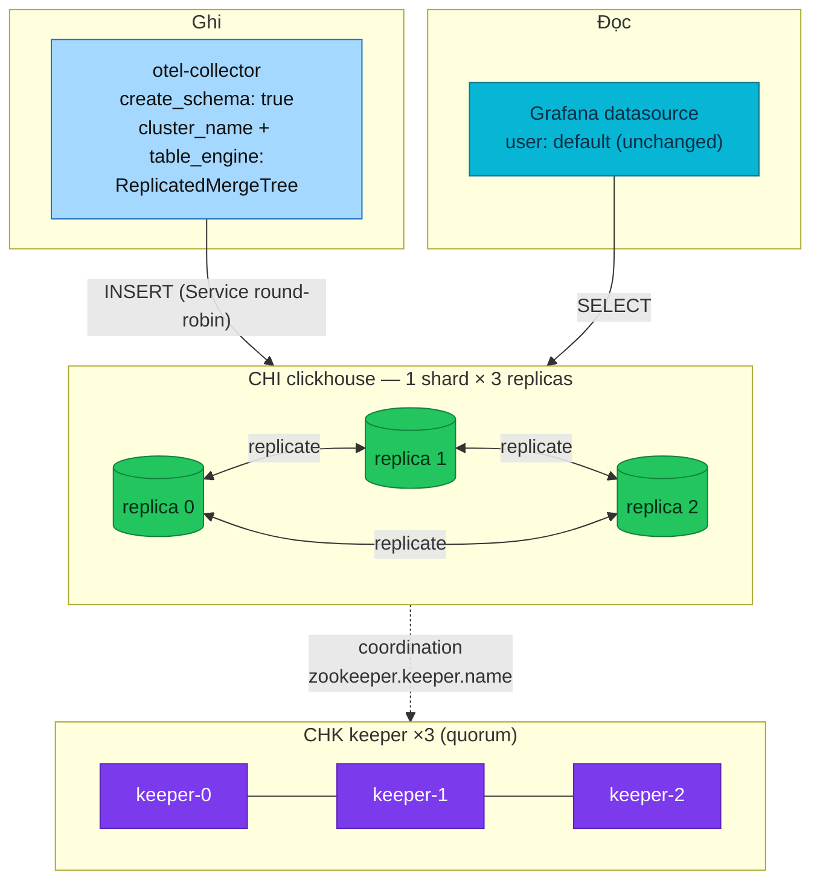

# RFC-0028 Replicate the ClickHouse observability store

| Status | Scope | Research | Created | Last updated |
|--------|-------|----------|---------|--------------|
| provisional | infra | [./research.md](./research.md) — gate passed 2026-08-28 | 2026-08-28 | 2026-08-28 |

> **Don't forget: every decision is a tradeoff.** The two costs of the chosen
> schema path are named below as revisit triggers, not hidden.

## Prerequisites

- [x] [./research.md](./research.md) merged (#947, amendments #948/#949); [research review gate](./research.md#research-review-gate) ticked 2026-08-28
- [x] Context7 audit complete (see research § Context7 audit log)
- [x] Owner approved **ready for RFC** (2026-08-28, in-session)
- Mechanism deep-dive lives in [./research.md](./research.md) — this file only decides
- When Status → **`Accepted`**: expected ADR — `ADR-NNN-clickhouse-replicated-topology/` (one decision: 1×3 + CHK with exporter-owned replicated schema). `docs/api/`: N/A — infra-only

## Summary

The ClickHouse observability store moves from 1×1 (one replica, one PVC, the
recorded *lost volume = lost traces* gap) to **1 shard × 3 replicas
coordinated by a 3-node ClickHouse Keeper quorum**, with the schema recreated
from scratch as `ReplicatedMergeTree` **by the otel-collector exporter
itself** (`create_schema: true` + `cluster_name` + `table_engine`) — zero new
components beyond the Keeper. Sharding/Distributed stays a documented
reference (research § trigger signals), and the least-privilege user model
stays an optional side-rung. Owner decisions binding this RFC: recreate from
scratch · straight to 3+3 · default `{uuid}` replica path · keep default
access · exporter-owned schema (Option B).

## Motivation

One bad disk currently erases 90 days of edge access logs (ClickHouse-only
per ADR-061) and all long-retention traces. Replication converts that from
unrecoverable data loss into a failover. Everything this needs is already
deployed except the topology itself: operator 0.27.3 (CHK CR, macros,
generated `remote_servers` with `internal_replication: true`) and a collector
whose exporter templates carry `ON CLUSTER` + `ENGINE` slots on every table.

### Goals

- Survive the loss of any single ClickHouse pod/PVC with no data loss and no
  read/write outage (Grafana keeps answering; the collector keeps inserting).
- Keep the delta small: no new schema owner, no new waves, no new repos —
  one CHK resource, three numbers, one exporter config block.
- Leave a written trail for the two futures deliberately not built: sharding
  (trigger table in research) and the user model (optional rung).

### Non-Goals

- **Sharding / Distributed tables** — researched to know the trigger signals;
  explicitly not built (owner: "docs để biết, nếu tương lai hệ thống thật bự").
- **Least-privilege user model** — optional side-rung; `default` user stays.
- Preserving the current 90-day dataset — **fresh tables by owner decision**
  (nothing here is a real deployment yet).
- Backups (clickhouse-backup → RustFS) — complementary, separate follow-up.

## Proposal

1. **Keeper**: a `ClickHouseKeeperInstallation` (`keeper`, 3 replicas, small
   PVCs) lands in `kubernetes/infra/configs/clickhouse/` — same directory,
   same `clickhouse-local` wave; the operator already handles both CRs.
2. **CHI**: `replicasCount: 1 → 3`, plus `zookeeper.keeper.name: keeper`
   (the 0.27.0 by-name reference) and pod anti-affinity on
   `kubernetes.io/hostname` (Kind has no zones). The operator keeps
   auto-creating the PDB; macros and `remote_servers` regenerate themselves.
3. **Schema (Option B)**: the collector's clickhouse exporter gains
   `cluster_name: otel` and `table_engine: {name: ReplicatedMergeTree}`
   (argument-free → the server-default `{uuid}` replica path). Old plain
   -MergeTree tables are **dropped deliberately** (fresh start); on next
   collector boot the exporter creates the replicated schema `ON CLUSTER`.
4. **Alerts**: re-enable the commented `ClickHouseZooKeeperExceptions` alert
   (it exists for exactly this topology) and extend the unreachable-server
   alert to per-replica.
5. **local-stack**: compose stays 1×1 single-node (no keeper in compose —
   the twin divergence is recorded, same as it already is for scrape ports
   pre-quick-win); the exporter options are cluster-only values.

### Alternatives

Decision-level tradeoffs live in [research § Integration paths](./research.md#integration-paths)
and [§ Alternatives](./research.md#alternatives); the schema-ownership analysis
(the RFC's central choice) is the Option A/B table there.

## Other solutions considered

| Option | Shape | Why not chosen |
|--------|-------|----------------|
| Migration Job owns DDL (Option A) | Job + SQL in git, `create_schema: false` | Owner call at the gate: B is the coherent set with recreate-from-scratch + default replica path, at zero new parts. A's two advantages are recorded as **revisit triggers** (first ALTER; a real startup-coupling incident) — the Job design is ready if either fires |
| Frugal 2+1 first | 2 replicas + 1 keeper (+2 pods) | Owner chose straight 3+3; the RAM ceiling (~7.5Gi limits) is accepted and will be observed after landing |
| Convert existing tables | `ATTACH ... AS REPLICATED` | Nothing is a real deployment yet — fresh tables skip the ceremony; the technique stays documented in research for the day a real deployment needs it |
| Stay 1×1 + backups | clickhouse-backup to RustFS | Restores lose the tail and take hours; doesn't teach replication; backups remain a complementary follow-up |

## Decision outcome

**Chosen option:** Option B — exporter-owned replicated schema, on a 1×3 + CHK topology.

**Rationale:** satisfies the Goals with the smallest possible delta — no new
schema owner, no new wave, no data migration — because the other gate
decisions (fresh tables, `{uuid}` default path) remove exactly the risks that
made a Job attractive. Runner-up was Option A (migration Job); the deciding
factor was zero-new-parts vs a Job whose two benefits (ALTER lifecycle,
startup decoupling) are not yet needed and are now standing revisit triggers.

**Decided:** 2026-08-28, owner, at the research review gate (in-session).

## Architecture & Diagrams

Target state (mechanism diagrams live in research — this is the as-proposed
topology):

## Design Details

- **Enable/disable**: entirely declarative — the CHK resource, three CHI
  fields (`replicasCount`, `zookeeper.keeper.name`, anti-affinity), one
  exporter config block. Disabling = reverting those (see Rollout & rollback).
- **Ordering**: the CHK must be Ready before the CHI reconciles replicas
  (the CHI references it by name). Both live in one wave; the operator
  retries the CHI until Keeper answers, and the wave's `wait: true` plus the
  existing StatefulSet healthCheck gate downstream (`tracing-local` already
  dependsOn `clickhouse-local`).
- **Default replica path**: one implementation check —
  `SELECT * FROM system.server_settings WHERE name LIKE 'default_replica%'`
  — to confirm `/clickhouse/tables/{uuid}/{shard}` + `{replica}` on our build.
- **TTL**: unchanged (`ttl: 2160h` in the exporter). System-table TTLs arrive
  via the independent quick-win PR.
- **Operator determines in-use**: `kubectl get chk,chi -n monitoring`;
  `SELECT * FROM system.replicas` shows three entries per table;
  `system.zookeeper_connection` names the keeper.
- **Drawbacks (recorded, accepted)**: (1) DDL still runs in collector
  `start()` — a collector restart during a ClickHouse outage stalls all its
  sinks until ClickHouse returns (revisit trigger → Option A); (2) the
  exporter never ALTERs — the first real schema change re-opens the Job
  question; (3) memory limits triple (~7.5Gi ceiling in `monitoring`).

## Security considerations

None new: same namespace, same single `default` user (owner-declared
acceptable; hardening documented as the optional rung in research), operator
-created PDB, PSS-baseline pod specs unchanged. `networks/ip` fencing arrives
only if the optional rung is ever taken.

## Observability & SLO impact

- Re-enable `ClickHouseZooKeeperExceptions` (currently commented out) — it
  was written for this day.
- Keeper metrics: chart value `keeperMetrics.enabled` currently `false` —
  flip with this rollout so the quorum is visible.
- Watch during rollout: `system.replication_queue` depth,
  `ClickHouseMetrics_ReadonlyReplica` (a replica stuck read-only means it
  lost Keeper), the DiskAlmostFull pair (data ×3).
- The per-pod native `:9363` scrape ships in the quick-win PR and is what
  makes per-replica dashboards meaningful.

## Rollout & rollback

**Rollout** (one homelab PR): CHK + CHI changes + collector exporter block +
alert re-enable, then either a fresh `make up` or, on the live cluster:
reconcile, **deliberately drop the old plain-MergeTree tables** (owner
decision — this discards current demo data), restart the collector so the
exporter recreates the schema replicated.

**Blast radius**: `monitoring` namespace; Grafana ClickHouse panels are blank
between the drop and the first new inserts; VictoriaMetrics-side dashboards
unaffected.

**Rollback**: `replicasCount: 3 → 1`, remove the exporter's two options,
optionally remove the CHK. Replicated tables remain readable single-replica
(a lone replica without Keeper goes read-only for writes — so a full rollback
also recreates plain tables, which is the same fresh-start move in reverse).

## Testing / verification

1. Fresh `make up`: 25/25 Kustomizations, `chk` + 6 ClickHouse-family pods
   Ready, `system.replicas` lists 3 replicas per `otel` table.
2. Drive gate traffic (`make e2e GATE=kind` — existing SG/K rows); confirm
   inserts land and `system.replication_queue` drains to 0 on all replicas.
3. **Kill drill**: delete one replica pod mid-traffic — Grafana keeps
   answering, the collector keeps inserting (Service routes around), the pod
   returns and catches up (`replication_queue` drains again).
4. Keeper drill: delete one keeper pod — quorum holds (2/3), writes continue.
5. `make validate` + the standard Kind gate as the release gate.

## Resulting decisions

| Decision | ADR | Status |
|----------|-----|--------|
| 1×3 replicated ClickHouse with CHK quorum, exporter-owned replicated schema (fresh start, default replica path) | `../../adr/ADR-NNN-clickhouse-replicated-topology/` — create at architecture review | pending review |

## Implementation History

*(empty — fills at implementation; the checklist in the template comment
applies when Status → implemented)*

## Related

- [./research.md](./research.md) — plain-language research and Context7 audit trail (gate passed 2026-08-28)
- [ADR-023](../../adr/ADR-023-clickhouse-observability-olap/) — why ClickHouse exists here; [ADR-061](../../adr/ADR-061-edge-log-routing/) — edge logs are ClickHouse-only
- [RFC-0019](../RFC-0019/) — the observability OLAP program this extends
- Quick-win PR (system-table TTLs, `:9363`, image pin, PVC Retain) — independent of this RFC's gate

---
_Last updated: 2026-08-28_
