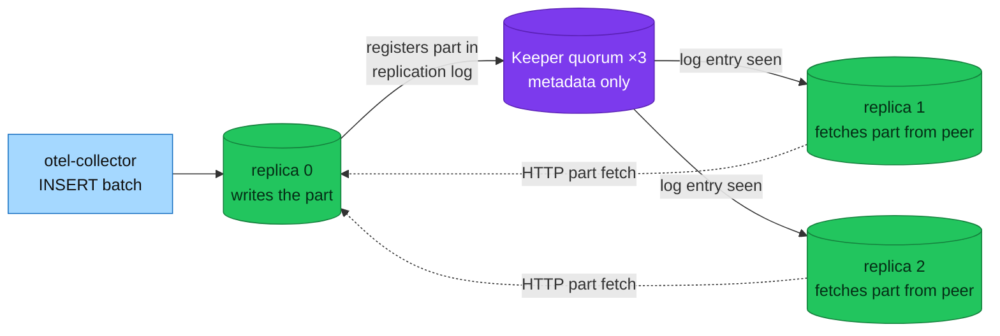
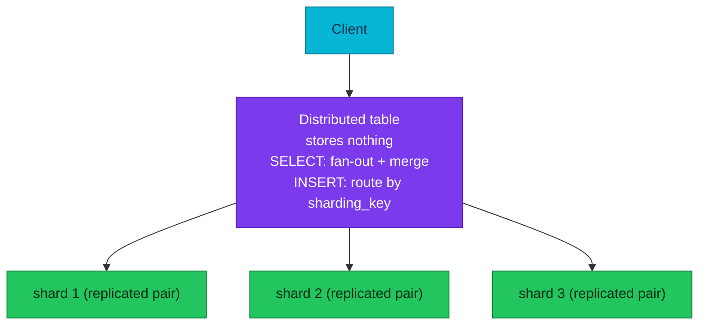
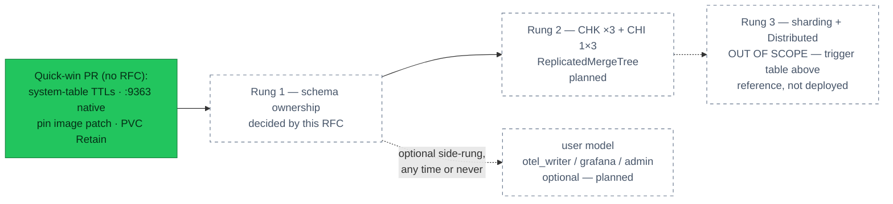

# RFC-0028 — Research: ClickHouse replication (optional least-privilege hardening; scouted path to sharding)

| | |
|---|---|
| **RFC** | RFC-0028 |
| **Status** | researching |
| **Scope** | infra |
| **Created** | 2026-08-28 |
| **Last updated** | 2026-08-28 |

> **Plain-language research.** This is the learn-before-deciding half of RFC-0028.
> A condensed Vietnamese reading companion (`research.vi.md`) exists locally
> for the owner — `*.vi.md` is gitignored by design; this file is the source
> of truth.
>
> **Scope fence, stated up front:** this research covers the current
> single-node deployment, the replicated deployment we intend to propose, and
> **sharding + the Distributed engine, researched only to know when we would
> need it — explicitly NOT proposed for building.** The least-privilege user
> model is an **optional side-rung** (owner call, 2026-08-28): documented,
> costed, required by nothing.

---

## Table of contents

1. [Problem statement](#problem-statement)
2. [Reading path](#reading-path)
3. [What replication and sharding are](#what-replication-and-sharding-are)
4. [Core components](#core-components)
5. [Core mechanism](#core-mechanism)
6. [Glossary](#glossary)
7. [Worked examples](#worked-examples)
8. [vs platform as-built](#vs-platform-as-built)
9. [Integration paths](#integration-paths)
10. [Alternatives](#alternatives)
11. [Open questions](#open-questions)
12. [FAQ](#faq)
13. [References](#references)
14. [Context7 audit log](#context7-audit-log)
15. [Research review gate](#research-review-gate)

---

## Problem statement

### Real-world trigger

| | |
|---|---|
| **Situation** | The platform's long-retention log/trace store (ClickHouse, ADR-023) runs as ONE replica on ONE PVC. `docs/observability/tracing/architecture.md` already records the consequence plainly: *lost volume = lost traces* — 90 days of edge access logs and every trace older than VictoriaTraces' window, gone with one bad disk. A secondary observation, recorded but NOT a driver: access control is a single `default` user open to `0.0.0.0/0` — acceptable for a lab, and addressed here only as an optional hardening rung. |
| **Who feels it** | On-call (a ClickHouse incident becomes unrecoverable data loss instead of a failover); platform. (The shared-credential observation would additionally concern an auditor — relevant only if the optional hardening rung is taken.) |
| **Why now** | The owner's own EKS-shaped research (2026-08-27) already designed the target: 1 shard × 3 replicas, Keeper, a layered user model. This research validates that design against current upstream docs and against what the homelab actually runs, and scouts the next rung (sharding) far enough to know its trigger conditions — **without** proposing to build it. |

> **In plain terms:** today the log warehouse is one building with one key
> taped to the door. We want three synchronized buildings and named keys —
> and we want to understand, but not yet buy, the fourth building.

### What this research must answer

1. How ClickHouse replication actually works (Keeper, replicated engines,
   part fetching) and what it costs on this cluster (+pods, +RAM, +disk).
2. Who should own the schema once tables must be `ReplicatedMergeTree` —
   a migration Job, or the otel-collector exporter itself (it CAN do it —
   verified against its SQL templates; the question is *should* it).
3. What an OPTIONAL least-privilege user model would look like at homelab
   scale — a side-rung, not a condition for anything else.
4. **When sharding + Distributed would become necessary** — concrete trigger
   signals readable from our own metrics — so the day one fires, the decision
   is a lookup, not a research project. (Out of scope to build.)

---

## Reading path

| If you have | Read |
|---|---|
| 5 minutes | [Problem statement](#problem-statement), [Worked examples](#worked-examples), the trigger-signal table in [Core mechanism](#when-would-sharding--distributed-become-necessary-research-only) |
| 20 minutes | Everything above plus [Core mechanism](#core-mechanism) and [Integration paths](#integration-paths) |
| Background | The owner-facing comparison page ("Một Shard, Ba Replica?", session artifact 2026-08-27/28) carries the live-measured inventory this file condenses |

---

## What replication and sharding are

ClickHouse scales along two independent axes, and they answer different pains:

- **Replication** — every replica holds a **full copy** of the same data.
  Buys: high availability (one replica dies, the others serve) and read QPS
  (queries spread across replicas). Does **not** buy write throughput — every
  replica still ingests everything (sometimes replication overhead makes
  writes slightly *slower*).
- **Sharding** — the dataset is **split** across shards (think `key % N`).
  Buys: total storage, write throughput, and parallel scan for heavy queries.
  Requires a router — the **Distributed** engine — because no single node
  holds the whole dataset anymore.

> **In plain terms:** replicas are photocopies of the whole book; shards are
> chapters split across shelves. Photocopies protect you from fire; splitting
> chapters lets more people write at once — but then you need a librarian
> (Distributed) who knows which shelf holds which chapter.

Rule of thumb (synthesized from an operator who ran ClickHouse at large
consumer-scale platforms, cross-checked against the official scaling guides):

| Need | Add | Price |
|---|---|---|
| HA / read QPS | **replica** | storage × N, replication network (billed cross-AZ on cloud; free intra-VM here) |
| Write throughput / total storage / heavy parallel scans | **shard** | a Distributed routing layer, and the gotcha below |
| One query surface over shards | **Distributed table** | one more moving part; only worth it at shards > 1 |

The gotcha worth memorizing now: **adding a shard does not rebalance existing
data**. Only new inserts follow the new key space; old data stays where it
was until TTL rolls it off. For a TTL'd log workload that is usually fine —
plan for it, don't fight it.

---

## Core components

| Component | What it is | Here |
|---|---|---|
| `ReplicatedMergeTree` | MergeTree that registers every part in a shared ledger so peers can copy it | The engine the `otel` tables must move to (they are plain `MergeTree` today) |
| **ClickHouse Keeper** | The ledger: a Raft-consensus store for replication logs and DDL queues. ZooKeeper-compatible, holds metadata only — never row data | Not deployed today. The Altinity operator ships a first-class CR for it: `ClickHouseKeeperInstallation` (CHK), and since operator 0.27.0 a CHI references it by name (`zookeeper.keeper.name`) |
| `Distributed` engine | A table that stores nothing: `Distributed(cluster, db, table[, sharding_key])` — SELECT fans out and merges, INSERT routes rows by sharding key | **Research-only.** Not needed at 1 shard |
| Altinity operator 0.27.3 | Already deployed. Generates `remote_servers` (with `internal_replication: true`) and the `{installation}/{cluster}/{shard}/{replica}` macros from the CHI layout — no hand-wiring per pod | Verified live: this is the version running |
| otel-collector clickhouse exporter | Owns today's schema (`create_schema: true`). Its DDL templates parameterize both `ON CLUSTER` and `ENGINE` on every table (verified file-by-file in `internal/sqltemplates`), so it CAN create replicated tables via `cluster_name` + `table_engine` — the create-database-on-cluster bug was fixed in contrib v0.131.0 (we run 0.159.0) | One of the two schema-ownership options below |

---

## Core mechanism

### How a replicated insert travels



An INSERT lands on **one** replica, which writes the part locally and appends
an entry to the replication log in Keeper. The other replicas watch that log
and fetch the part from a peer. Keeper never carries row data — which is why
three small pods (~512Mi each) suffice as its quorum.

DDL follows the same pattern through the distributed-DDL queue: a statement
with `ON CLUSTER '{cluster}'` runs once and propagates to every replica.

The engine declaration itself can be spelled two ways, both current:

```sql
-- explicit path (Altinity operator supplies every macro from the CHI layout)
ENGINE = ReplicatedMergeTree(
  '/clickhouse/{installation}/{cluster}/tables/{shard}/{database}/{table}',
  '{replica}')

-- argument-free: server defaults resolve the path
-- default_replica_path = /clickhouse/tables/{uuid}/{shard}
-- default_replica_name = {replica}
ENGINE = ReplicatedMergeTree
```

Existing data does not have to be discarded: a plain MergeTree table converts
via `ATTACH TABLE ... AS REPLICATED` (on a detached table) or a flag file in
the table's data directory plus a restart; once one replica holds the
converted table, the others clone through Keeper.

### When would sharding + Distributed become necessary? (research-only)

The Distributed engine is the router you add when one shard can no longer
carry the write or storage load:



With the operator's generated `internal_replication: true`, an INSERT through
Distributed is sent to **one** replica per shard and `ReplicatedMergeTree`
handles the copies — the correct combination (sending to all replicas is the
legacy non-replicated pattern). Inserts queue asynchronously per shard unless
`distributed_foreground_insert` is set.

**Trigger signals** — the concrete "you now need a shard" symptoms, each
readable from the native `:9363` endpoint this RFC's quick-win train enables:

| Signal | What it looks like | Metric to watch |
|---|---|---|
| Merges can't keep up | parts per partition climbing toward the delay/throw thresholds; inserts start stalling | `ClickHouseMetrics_PartsActive` per table trending up; the existing `ClickHouseTooManyParts` alert (>300) firing chronically rather than transiently |
| Disk ceiling | data + system tables approaching PVC capacity even after TTL | `ClickHouseAsyncMetrics_DiskUsed_default` vs `DiskTotal_default` (the existing DiskAlmostFull/Critical alerts) |
| Write throughput ceiling | ingest rate flat while producers back up (collector queue growth) | `ClickHouseProfileEvents_InsertedRows` rate plateau + otel-collector `exporter_queue_size` climbing |
| Heavy scans too slow | dashboard queries reading months of data hit `max_execution_time` even with sane filters | `query_log` (once its TTL train lands) — p95 `query_duration_ms` for the Grafana user |

None of these are anywhere near firing at homelab load — which is exactly why
sharding stays out of scope. When one fires chronically, the play is: add a
shard, add a Distributed table over `otel.*`, accept that old data stays on
old shards, and revisit the sharding key (for logs, `rand()` or
`cityHash64(ServiceName)` are the usual starting points — a decision for that
future RFC, not this one).

One relevant footnote from the current schema: the exporter's tables are
`PARTITION BY toDate(Timestamp)` — daily partitions. That is already the
recommended shape for TTL'd log data (monthly partitions make TTL and merges
coarse and painful), so the partition axis needs no change on any rung.

---

## Glossary

| Term | Meaning |
|---|---|
| Part | An immutable sorted chunk of rows MergeTree writes per insert batch; merges combine parts in the background |
| Replica | A full copy of a shard's data on another server |
| Shard | A horizontal slice of the dataset (rows split by key) |
| Keeper | ClickHouse's Raft consensus service (ZooKeeper-compatible) storing replication logs and DDL queues — metadata only |
| CHK / CHI | `ClickHouseKeeperInstallation` / `ClickHouseInstallation` — the Altinity operator's CRs |
| Macro | Server-side placeholder (`{shard}`, `{replica}`, …) the operator derives from the CHI layout |
| DDL / DML | Schema statements (CREATE/ALTER/DROP) vs data statements (INSERT/SELECT) |
| Distributed table | Engine that stores nothing and routes queries/inserts across shards |
| `internal_replication` | Cluster flag: Distributed sends each insert to one replica per shard and lets the replicated engine copy it |

---

## Worked examples

**Cost of the replicated rung at homelab scale** (measured against the live
cluster, 2026-08-28):

| | Today | 1×3 + CHK | Delta |
|---|---|---|---|
| Pods | 1 | 6 (3 CH + 3 keeper) | **+5** |
| PVCs | 1 × 10Gi | 3 × 10Gi + 3 × ~2Gi | ~×3 real data, +6 volumes |
| RAM requests / limits | 1Gi / 2Gi | ~3.75Gi / ~7.5Gi | becomes the largest consumer in `monitoring` |

A frugal learning rung exists: **2 replicas + 1 keeper = +2 pods** — the
replication mechanics are 100% real (insert one side, watch the part fetch),
only Keeper itself loses HA (a 1-node "quorum"). On a cluster that is rebuilt
routinely, that teaches ~90% of the lesson at ~40% of the price, and moving to
3+3 later is a two-number change in the CRs.

**The failure the OPTIONAL user model would prevent** (context for the side-rung, not a requirement): today a leaked Grafana datasource
credential IS the ingest credential IS the admin credential. With the layered
model, the blast radius of any single leak is one verb in one database — and
because Kind's CNI (kindnet) enforces no NetworkPolicies, the users' own
`networks/ip` restriction (pod CIDR) is currently the only network fence that
actually holds.

---

## vs platform as-built

Live-measured inventory (kubectl + repo, 2026-08-27/28):

| Aspect | As-built | Target rung |
|---|---|---|
| Topology | CHI `clickhouse` (ns `monitoring`), 1 shard × 1 replica, no Keeper | 1 × 3 + CHK ×3 |
| Engine | plain `MergeTree` (exporter default) | `ReplicatedMergeTree` |
| Schema owner | otel-collector exporter, `create_schema: true`, DDL runs in `start()` | one of two options — see Integration paths |
| Users | one: `default`, networks `0.0.0.0/0`, shared by collector + Grafana | unchanged by default; OPTIONAL hardening rung: `otel_writer` / `grafana` (readonly=2) / `admin` with pod-CIDR `networks/ip` — passwords via the existing OpenBAO→ClusterExternalSecret path |
| Image | `clickhouse/clickhouse-server:26.7` — floating minor tag | pinned patch (the 25.8.10→.15 K8s-only DDL regression, CH#89693, is the cautionary tale; fixed in CH#92339 / Altinity Stable 25.8.16.10001 — 26.x unaffected) |
| Operator | Altinity 0.27.3 — every 0.27 feature this research relies on is already deployed; **it auto-creates the PDB** (verified live, ownerRef on the CHI) | unchanged |
| Metrics | operator exporter `:8888` only; local-stack twin already scrapes native `:9363` | native `:9363` on both (quick-win train) |
| System tables | no TTLs — `query_log` et al. grow unbounded on the 10Gi PVC | 3–7 day DELETE TTLs (quick-win train) |
| Safety rails | no `reconciling.cleanup`, no `storageManagement` | PVC `Retain` everywhere + `provisioner: Operator` (online resize) (quick-win train) |

---

## Integration paths

The rungs, in order, with the quick wins deliberately OUTSIDE the RFC (no
design decision in them):



**Rung 1 — schema ownership, the RFC's central decision.** Two current,
verified options:

| | Option A — migration Job owns DDL | Option B — exporter owns DDL (`create_schema: true` + `cluster_name` + `table_engine: ReplicatedMergeTree`) |
|---|---|---|
| Replicated tables | Yes — DDL written by us | Yes — verified template-by-template (`internal/sqltemplates`: every table has `ON CLUSTER` + `ENGINE` slots; the trace-id MV is `TO`-style and needs no engine; its target lookup table has both slots) |
| Startup coupling | Gone — collector never runs DDL; ClickHouse downtime costs only the ClickHouse sink (its queue+retry already isolate runtime) | Stays — DDL runs in collector `start()`; any collector restart during a ClickHouse incident takes down ALL telemetry sinks, and telemetry config can't be deployed until ClickHouse heals |
| Schema evolution | ALTERs (new column, TTL change, index) live in git next to the CREATE | Exporter only ever `CREATE IF NOT EXISTS` — every post-v1 change needs out-of-band DDL anyway |
| Cost | One Job + SQL files + Flux ordering (dependsOn already models it) | Zero new parts |
| Residual check | — | Argument-free `ReplicatedMergeTree()` relies on `default_replica_path/name` + macros; macros are operator-provided, one live confirm needed |

Proposed direction: **Option A**, because both of its advantages are exactly
the failure classes this platform has already paid for elsewhere (startup
coupling; config-not-in-git), and the owner's original design chose it too.
Option B is documented as the legitimate lighter path, one `values` block away.

**Optional side-rung — user model (owner-declared not required).** If taken,
three users rather than the EKS design's six: no Vector writes ClickHouse
here, `analyst` folds into the owner's use of `grafana`/`admin`, `migrator`
exists only if Option A wins. Profiles carry the ingest/readonly split; quotas
make a leaked credential loud. Nothing on the replication path depends on
this rung — it can land any time, or never.

**Rung 2 — replication.** CHK ×3 (or the frugal 1) + `replicasCount: 3`,
convert-or-recreate per the Open questions, pod anti-affinity by
`kubernetes.io/hostname` (Kind has no zones).

**Rung 3 — sharding + Distributed: not built.** The deliverable is the
trigger-signal table above plus this recorded play, so the future decision is
a lookup.

---

## Alternatives

| Alternative | Why not |
|---|---|
| Stay 1×1 and accept the loss window | Cheapest, and honest for a lab — but it leaves the recorded "lost volume = lost traces" gap permanent, teaches nothing, and keeps the one-credential model |
| Rely on the VictoriaMetrics stack only, drop ClickHouse | Contradicts ADR-023's reason to exist (long-retention SQL over logs+traces; edge access logs are ClickHouse-only per ADR-061) |
| Backups instead of replicas (e.g. clickhouse-backup to RustFS) | Complementary, not equivalent — restores lose the tail and take hours; worth its own follow-up either way |
| Managed ClickHouse (Cloud) | Defeats the purpose of the homelab as a learning platform |

---

## Open questions

Each with a proposed direction (owner decides at the RFC):

1. **Convert or recreate the existing 90-day tables?** Proposed: convert
   (`ATTACH ... AS REPLICATED` path) on the first replica, let peers clone —
   rehearse on local-stack first; fall back to fresh tables if the rehearsal
   bites (greenfield contract allows it).
2. **Full 3+3 or frugal 2+1 first?** Proposed: 2+1 as the first landing
   (teaches the mechanics, +2 pods), 3+3 as the follow-up flip once the RAM
   picture on the 16GB VM is observed for a few days.
3. **Does the operator set `default_replica_path`, or do we pass explicit
   engine args?** Proposed: use the explicit macro path in our DDL (Option A
   makes this trivial) so nothing depends on server defaults; confirm the
   defaults anyway with one `SELECT * FROM system.server_settings` during
   implementation.
4. **(Only if the optional user-model rung is taken)** Grafana `readonly=2`
   compatibility with the current datasource plugin version — one login test.
5. **Do the operator-generated `remote_servers` need anything for a future
   Distributed table** (cluster name reuse, `internal_replication`)?
   Proposed: no action now; note that the generated cluster is already
   correctly shaped (verified in operator docs), which is what makes Rung 4 a
   config change rather than a migration when its day comes.

---

## FAQ

**Q: Does replication triple our ingest cost?**
A: It triples *storage* and adds intra-cluster fetch traffic (free on one VM,
billed cross-AZ on clouds — a real invoice line at scale). CPU-wise each
replica ingests everything, so plan capacity per-replica, not per-cluster.

**Q: Why not add a Distributed table now "to be ready"?**
A: It stores nothing and routes nothing useful at 1 shard — the operator's
Service already spreads connections across replicas. It would be a moving
part with no job.

**Q: Doesn't Flux `dependsOn` already solve the schema-startup problem?**
A: It solves apply ordering (and the repo uses it correctly). It cannot order
pod restarts — kubelet doesn't read `dependsOn` — so the runtime coupling
only disappears when DDL leaves the collector's `start()`.

**Q: The exporter really can create replicated tables?**
A: Yes — owner-verified and then confirmed against the exporter's own SQL
templates and the v0.131.0 fix. This research's first draft claimed
otherwise; the claim is corrected here and the correction is part of why
Option B is on the table at all.

---

## References

- ClickHouse docs: Data replication (`engines/table-engines/mergetree-family/replication`), Distributed engine (`engines/table-engines/special/distributed`), Keeper deployment guide, `default_replica_path`/`default_replica_name` server settings, `ATTACH TABLE ... AS [NOT] REPLICATED`
- Altinity operator docs: `replication_setup.md` (macros), `custom_resource_explained.md` (`remote_servers`, `internal_replication`), release notes 0.27.0–0.27.3
- opentelemetry-collector-contrib: clickhouse exporter README (`cluster_name`, `table_engine`), `internal/sqltemplates/*` (read verbatim), issue #36540 + PR #38829 (fix in v0.131.0)
- ClickHouse/ClickHouse#89693 → #92339 (the 25.8.10–.15 K8s DDL regression; Altinity Stable 25.8.16.10001 backport)
- In-repo: ADR-023, RFC-0019, `docs/observability/clickhouse/README.md`, ADR-061 (edge logs are ClickHouse-only), the CHI/collector/alerts manifests cited in § vs platform as-built

---

## Context7 audit log

| Date | Source queried | What it confirmed |
|---|---|---|
| 2026-08-28 | ClickHouse docs (`/websites/clickhouse`) — replication | ReplicatedMergeTree znode-path + `{replica}` args; macros; `ON CLUSTER` distributed DDL; MergeTree→Replicated conversion via `ATTACH ... AS REPLICATED` or flag file |
| 2026-08-28 | ClickHouse docs — Distributed + defaults | `Distributed(cluster, db, table[, sharding_key])`; async per-shard insert queue (`distributed_foreground_insert` for sync); `internal_replication` semantics; argument-free `ENGINE = ReplicatedMergeTree` valid with `default_replica_path=/clickhouse/tables/{uuid}/{shard}`, `default_replica_name={replica}` |
| 2026-08-28 | Altinity operator docs (`/altinity/clickhouse-operator`) | Operator supplies `{installation}/{cluster}/{shard}/{replica}` macros and generates `remote_servers` with `internal_replication: true` from the CHI layout |
| 2026-08-27 | Altinity operator release notes (web) | 0.27.0: CHK-by-name (`zookeeper.keeper.name`), metrics `tablesRegexp`/exclude, pre/post hooks; 0.27.1: FIPS-140 |
| 2026-08-28 | contrib exporter README + `internal/sqltemplates` (verbatim) + issue #36540 / PR #38829 | `cluster_name` + `table_engine` documented; every table template carries `ON CLUSTER` + `ENGINE` slots (MV is `TO`-style); cluster DB-creation fixed in v0.131.0 (platform runs 0.159.0) |
| 2026-08-27 | Live cluster (kubectl) | CHI 1×1, no CHK, image `26.7` floating, operator 0.27.3, operator-created PDB, metrics via `:8888` only |

---

## Research review gate

- [ ] Owner has read the problem statement and the two schema-ownership options
- [ ] Scope fence accepted: replication in, sharding/Distributed research-only
- [ ] Open questions' proposed directions accepted or amended
- [ ] Quick-win PR (TTLs, `:9363`, pin, Retain) may ship independently of this gate
- [ ] On pass: copy `RFC-0000/README.md` → `RFC-0028/README.md` (proposed architecture + rollout), index status `researching` → per lifecycle

_Last updated: 2026-08-28_
