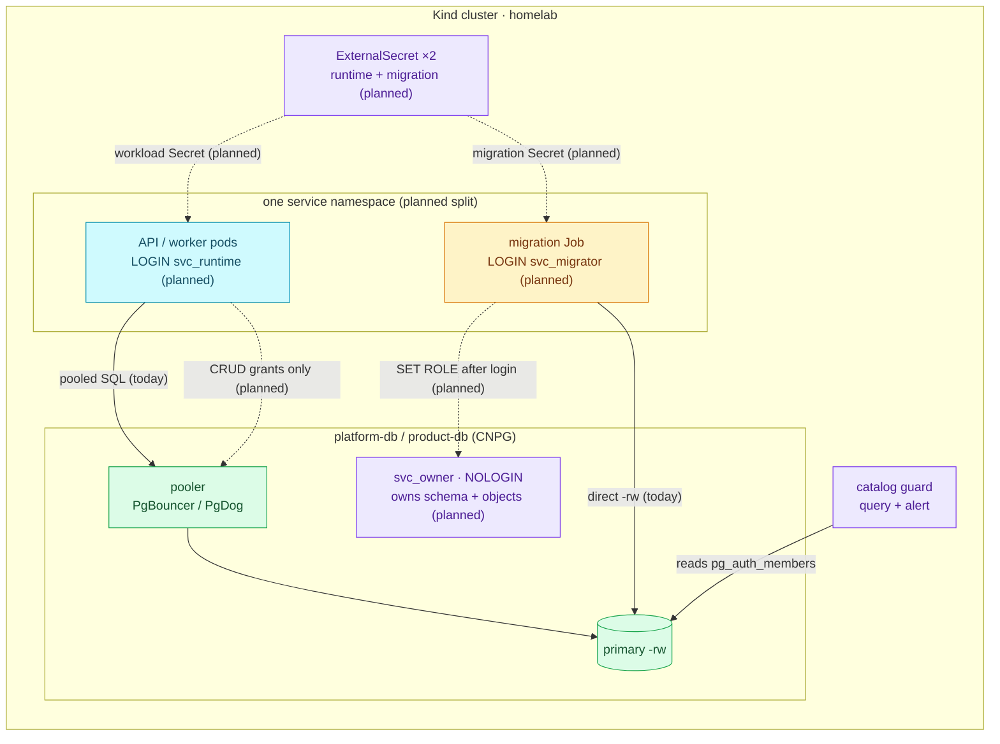
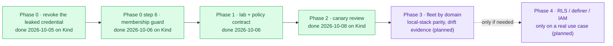

# RFC-0029 PostgreSQL authorization and access governance

| Status | Scope | Research | Created | Last updated |
|--------|-------|----------|---------|--------------|
| Accepted | platform-wide | [./research.md](./research.md) — gate passed 2026-10-06 | 2026-10-06 | 2026-10-06 |

> **Don't forget: every decision is a tradeoff.** The cost of the leading
> direction is more Secrets, more HBA pairs and a coordinated consumer cutover
> per service; § Design Details → drawbacks and § Rollout & rollback spell it out.

## Prerequisites

- [x] [`research.md`](./research.md) merged; [research review gate](./research.md#research-review-gate) passed (11/11)
- [x] Context7 audit complete; the source-tree, live-CRD and pgroles checks are in the research log
- [x] Owner approved **ready for RFC** on 2026-10-06
- [x] This RFC summarizes the target and links the mechanism deep dive instead of repeating it
- [x] Status **`Accepted`** 2026-10-06: ADR-084, ADR-085 and ADR-086 created (§ Resulting decisions). `docs/api/` is N/A: no service route or RPC changes; service repos gain migrations only

## Summary

Split every application database's single login/owner role into three
identities — a NOLOGIN **owner** that holds the objects, a **migrator** login
that only reaches ownership through `SET ROLE`, and a **runtime** login that
owns nothing — and make each service's own migrations carry its object ACLs and
default privileges. CNPG `DatabaseRole` keeps owning identity,
passwords and membership names; a catalog query plus alert guards the PG18
membership options CNPG cannot express. Roll out to one canary service before
any fleet change. Phase 0 (revoking the leaked `vault_rotator` credential) is
already done on the Kind cluster.

## Motivation

Facts from the research (as-built audit 2026-09-04, re-check 2026-10-05):

- **Runtime and migration share one authority.** Each service ResourceSet hands
  the same `db_secret` and role to the API and the migration Job; that login
  owns 147/147 audited application tables. A runtime compromise (SQL injection,
  leaked pod env) is therefore a schema and ownership compromise.
- **Nothing declares object privileges.** `pg_default_acl` is empty in every
  audited database, so new functions are executable by PUBLIC (PG-05) and any
  future split would leave legacy tables without runtime grants (PG-06).
- **CNPG stops at identity.** `DatabaseRole` cannot express object ACLs,
  default privileges or the PG18 `ADMIN`/`INHERIT`/`SET` membership options, and
  it does not poll for drift (CNPG-04, CNPG-06).
- **The gap has already cost us.** `vault_rotator`'s password was committed and
  its membership was `t/t/t`; Phase 0 fixed both on 2026-10-05, but the edge is
  correct only because a human re-ran a `GRANT`, and nothing alerts if it drifts.

### Goals

1. On the canary service, the runtime login owns no object and every negative
   invariant in research § High-value negative invariants holds (no DDL, no
   grant, no `SET ROLE` to owner/migrator), proven by a negative test in the
   Kind gate.
2. A table, sequence or function created by a migration after cutover gets the
   runtime ACL with no extra `GRANT` in that migration (creator-scoped default
   privileges, PG-03). Each service is cut over on a fresh cluster, so there are
   no legacy objects to backfill (PG-06 stays as the reference for a cluster
   with data).
3. `PUBLIC` loses default `EXECUTE` on new functions through a **global**
   default-privilege revoke (PG-05 showed the per-schema form is a no-op).
4. A drifted membership option on a guarded edge raises an alert within one
   scrape interval; `vault_rotator → notification` is the first guarded edge.
5. The pattern is written down well enough that a second service adopts it by
   following a runbook, not by reverse-engineering the canary.

### Non-Goals

- Row-level security and `SECURITY DEFINER` functions: Phase 4, only for a real
  shared-table or limited-operation use case (research § RLS and SECURITY
  DEFINER scope).
- Cloud IAM, certificate mapping or dynamic per-session database credentials —
  those are authentication mechanisms; they reuse this capability model in a
  later, cloud-specific RFC.
- A human-access system (issuing, expiring and auditing people's logins). The
  capability-role shape is designed for it; the workflow is not part of v1.
- Converting Keycloak and Temporal: they run their own schema tooling and need
  separate integration experiments before adopting or diverging.
- Replacing ADR-015's `pg_hba` isolation or revoking `PUBLIC CONNECT` as a
  second fence.

## Proposal

| Role | LOGIN | Owns | Reaches | Credential |
|---|---:|---|---|---|
| `<svc>_owner` | no | database, application schema, objects | — | none in Kubernetes |
| `<svc>_migrator` | yes | nothing | `<svc>_owner` via `SET ROLE` (membership `INHERIT FALSE, SET TRUE, ADMIN FALSE`) | short-lived migration Job Secret, primary endpoint |
| `<svc>_runtime` | yes | nothing | object grants only | workload Secret, pooler endpoint |

`<svc>_runtime` is a new login and a consumer cutover from today's `<svc>`
login, not an in-place rename: `DatabaseRole.spec.name` is immutable.

**Who owns what** (research § Responsibility split):

| Layer | Source of truth |
|---|---|
| Role existence, attributes, password, membership names | CNPG `DatabaseRole` (one per role) |
| Database owner | CNPG `Database` → `<svc>_owner` |
| HBA admission | `Cluster.spec.postgresql.pg_hba`, exact runtime/migrator pairs (ADR-015) |
| Object ownership, ACLs, default privileges | the service's versioned migrations, run after `SET ROLE <svc>_owner` |
| Membership options CNPG cannot express | bootstrap/runbook SQL + a catalog guard (query + alert) |
| Migration vs runtime Secret wiring | domain ResourceSet values (`duynh` chart): today the workload `env` and the `migrate` init container both read `inputs.db_secret`; Phase 2 adds separate inputs so each names its own Secret |

### User Stories

- *As an on-call engineer*, when the notification API leaks its credential, I
  rotate one runtime login and know the attacker could not have altered or
  dropped tables.
- *As a service developer*, I add a table in a migration and the API can read
  it on the next deploy without a hand-written `GRANT`.
- *As a platform engineer*, a membership option changed by a restore or a
  hotfix pages me instead of silently breaking password rotation.

### Alternatives

Two independent choices (full analysis: research § Alternatives):

| Choice | Leading option | Main alternative and its cost |
|---|---|---|
| Identity topology | **Three service roles** (owner/migrator/runtime) | Capability roles + separate logins — composable for people, but more membership edges whose options CNPG cannot express |
| Object-authorization vehicle | **Service-owned authorization migrations** | Declarative policy controller (pgroles) — converges default privileges and polls drift, but cannot manage membership `SET`, is `v1alpha1`, and adds a privileged executor and a second controller on CNPG's roles |

## Other solutions considered

| Option | Shape | Why not chosen |
|--------|-------|----------------|
| Keep one owner/login per service | Today's ADR-013 triplet | Fails the least-privilege goal: runtime compromise stays schema compromise |
| Central platform authorization Job | One homelab Job applies every service's ACL | Couples homelab to every service schema; ordering and rollback duplicate the service's own migrations |
| pgroles as the authorization controller | `PostgresPolicy` per database, operator in `apply` mode | Cannot own `SET FALSE` edges; `v1alpha1`; needs its own CREATEROLE executor; kept as a candidate **read-only drift reviewer** (`diff --review-out`) instead |
| OpenBAO dynamic/static credentials for every service | Extend the ADR-025 notification pilot | An authentication change, not an authorization model; the owner kept the pilot at one service |
| Revoke `PUBLIC CONNECT` instead of separate roles | SQL fence per database | ADR-015 chose `pg_hba` as the single fence; does nothing about ownership |

## Decision outcome

**Chosen option:** **three service roles** (owner/migrator/runtime) with
**service-owned authorization migrations**, and membership options guarded by a
**CNPG monitoring query plus alert**. Capability roles are kept for people, not
services.

**Rationale:** it is the only combination that meets Goals 1–3 without a second
schema-migration system, and Goal 4 without a controller that cannot see the
`SET` option or a new privileged credential. The runner-up for authorization was
a declarative controller (pgroles); it lost on the membership options it cannot
manage and the executor it needs.

**Decided:** 2026-10-06, owner — canary `review`; local-stack mirrors the three
roles; existing data moves to the owner role once per service by an operator
runbook, while new clusters are born correct.

## Architecture & Diagrams

This diagram answers who connects as which identity for one service once the
split is in place. Everything inside the service frame is **planned**; the
cluster, poolers and OpenBAO path exist today.

This one answers the order of work. Phases 0–2 are done; the rest is
**planned**.

## Design Details

- **Enable per service:** add `<svc>_owner`, `<svc>_migrator` and
  `<svc>_runtime` `DatabaseRole`s (full specs — adoption resets omitted fields,
  CNPG-01), two ExternalSecrets, and HBA pairs for runtime and migrator *before*
  either login is used; point `Database.spec.owner` at `<svc>_owner`.
- **Greenfield cutover:** each service is converted on a fresh cluster, so its
  objects are created by `<svc>_owner` from the first migration and no ownership
  transfer runs. A cluster that already holds data would need a one-time,
  operator-run transfer; it is described in
  [`docs/databases/authorization.md`](../../../databases/authorization.md#rollback-and-existing-data)
  for reference and **not exercised here**.
- **Authorization SQL** ships in the service repo as a normal migration after
  `SET ROLE <svc>_owner`: `ALTER DEFAULT PRIVILEGES` for runtime on tables and
  sequences and a **global** `REVOKE EXECUTE … FROM PUBLIC` default. The
  migration reaches the owner through `migratex.WithSetRole`
  (`DB_MIGRATION_ROLE`), which fails the run when `SET ROLE` is denied.
- **Cutover:** the service's manifests, migration and local-stack change in one
  release; the legacy `<svc>` login is never created. There is no
  compatibility window.
- **Default behaviour** of other services does not change; a service is opted in
  by its own manifests and migration.
- **Disable / roll back:** `git revert` of the cutover plus a fresh `make up`.
  No legacy login exists to repoint to.
- **Is it in use?** Catalog queries: owner of every table is `<svc>_owner`;
  runtime has the ACL; `pg_default_acl` has the owner's rows; the migrator's
  membership in the owner is `ADMIN FALSE, INHERIT FALSE, SET TRUE`.
- **Drawbacks:** three roles, two Secrets and two HBA pairs per service instead
  of one each; a ResourceSet interface change; a coordinated cutover per service; one more
  privileged procedure (ownership transfer); local-stack must follow or the
  release gate stops exercising the same failure modes.

## Security considerations

- Trust boundaries are unchanged in kind and narrower in effect: Git → Flux →
  CNPG for identity, OpenBAO → ESO for credentials, migrations for object
  authority (research § Trust boundaries and assets).
- `vault_rotator` remains standing privileged infrastructure: `ADMIN` on
  `notification` still lets it set that role's password. This is containment,
  not non-impersonation; `pg_hba`, Secret RBAC and audit logging stay the fence.
- The ownership-transfer executor is the most privileged new actor and must be
  time-boxed and removed.
- `PUBLIC CONNECT` stays as ADR-015 decided; `pg_hba` remains the only
  connection fence.

## Observability & SLO impact

- **New:** a CNPG custom query (`platform-db/configmaps/monitoring-queries.yaml`)
  exposing the options of each guarded membership edge, and an alert when they
  differ from the specified shape. `pg_auth_members` is readable by PUBLIC, so
  the exporter needs no new grant.
- **During a cutover:** connection counts per login, authentication failures in
  the PostgreSQL log, and the service's own error-rate SLO; a cutover that moves
  the error budget is rolled back.
- No SLO definition changes.

## Rollout & rollback

| Phase | Content | Exit |
|---|---|---|
| 0 | Revoke the leaked `vault_rotator` credential | **Done 2026-10-05** (research § Phase 0 execution record); step 6 guard done 2026-10-06 (ADR-086) |
| 1 | Harness as a repeatable gate; catalog queries; naming/Secret/HBA conventions; local-stack decision; `migratex.WithSetRole` | owner review of the conventions ([`authorization.md`](../../../databases/authorization.md)) |
| 2 | One canary (`review`) | **Done 2026-10-08**: goals 1–3 proven on a fresh Kind cluster, K3.8–K3.9 in the gate, local-stack A23 |
| 3 | Fleet by domain, never all databases at once | every service passes positive and negative tests |
| 4 | RLS / definer / IAM | only with a real use case and its own review |

Rollback is per service: revert its cutover and bring the cluster up again. A
compromised or rotated-away credential is never a rollback target.

## Testing / verification

- Re-run the 14 PG18/CNPG experiments on every CNPG minor or major upgrade
  (CNPG-04 in particular).
- Per service: positive CRUD and migration tests, negative privilege tests
  (runtime `CREATE`/`ALTER`/`DROP`/`GRANT`/`SET ROLE` must fail).
- Kind E2E gate rows for the canary; local-stack mirrors the three roles, so the
  compose gate exercises the same failures.
- Catalog evidence (owner, ACL, default ACL, membership options) recorded in the
  PR that cuts each service over.

## Open questions

Resolved 2026-10-06:

- ~~Canary~~ — `review`.
- ~~Drift collector~~ — CNPG monitoring query plus alert (ADR-086).
- ~~Ownership transfer~~ — new clusters need none; existing data moves once per
  service by an operator runbook (ADR-084).
- ~~Local-stack~~ — mirrors the three roles for every converted service.
- ~~Chart Secret inputs~~ — no chart change needed since the services moved to
  the `duynh` chart: the `migrate` init container is declared in the domain
  ResourceSets, so a separate migrator Secret needs new ResourceSet inputs,
  not a chart change.

Resolved in Phase 1 (2026-10-06, owner):

- ~~Compatibility window~~ — none. Greenfield: the legacy login is never
  created, rollback is `git revert` + a fresh `make up`.
- ~~How migrations reach `SET ROLE`~~ — `migratex.WithSetRole` in
  `duynhlab/pkg`, fed by `DB_MIGRATION_ROLE`; fails hard when denied or empty.
  Rejected: a catalog `ALTER ROLE … SET role` default (invisible in Git, not
  modeled by CNPG) and pgroles (cannot act inside the migration session).
- ~~Alert vs gate~~ — both: `CNPGRoleMembershipDrift` pages, and the Kind gate
  asserts `drift == 0` plus negative rows run as the real logins.
- ~~PUBLIC `CONNECT`~~ — kept on the cluster (ADR-015, `pg_hba` is the fence);
  local-stack keeps revoking it because it has no other fence. A deliberate
  difference, recorded in `authorization.md`.

## Resulting decisions

| Decision | ADR | Status |
|----------|-----|--------|
| Three service roles (owner/migrator/runtime) replace the single login/owner role; amends ADR-013 | [`ADR-084`](../../adr/ADR-084-split-service-database-roles/) | Accepted |
| Object ACLs and default privileges are owned by service migrations after `SET ROLE <svc>_owner` | [`ADR-085`](../../adr/ADR-085-service-migrations-own-authorization/) | Accepted |
| PG18 membership options are guarded by a CNPG monitoring query and alert | [`ADR-086`](../../adr/ADR-086-guard-membership-options/) | Accepted |

## Implementation History

- 2026-09-03 — research opened (`researching`).
- 2026-10-05 — Phase 0 remediation merged (#989) and executed on Kind; research
  refreshed (#1227) and the run recorded (#1228).
- 2026-10-06 — owner approved **ready for RFC**; this README authored at
  `provisional` (#1229).
- 2026-10-06 — **Accepted**; ADR-084, ADR-085 and ADR-086 created at
  `Accepted`, Adoption `Not started`.
- 2026-10-06 — Phase 0 step 6: the membership guard for `vault_rotator →
  notification` shipped and was exercised on Kind (flip and revoke both fired
  and resolved); ADR-086 Adoption `Partial`.
- 2026-10-06 — Phase 1 conventions authored
  ([`authorization.md`](../../../databases/authorization.md)); the open questions
  resolved as greenfield, `migratex.WithSetRole`, alert plus gate.
- 2026-10-08 — Phase 2: `review` converted (homelab #1245, review-service
  `v2.5.0`). Fresh Kind: sweep 84/84, K3.7 2/2, K3.8–K3.9 10/10, `make e2e`
  146/146, drift drill on the new edge; local-stack audit A1–A23, B1–B10,
  C0–C22 PASS.

## Related

- [./research.md](./research.md) — mechanism deep dive, experiments, as-built audit, Phase 0 record
- [Rotate the `vault_rotator` credential](../../../databases/runbooks/rotate-vault-rotator-credential.md)
- [ADR-013](../../adr/ADR-013-per-service-db-triplet/), [ADR-014](../../adr/ADR-014-pooler-credentials-valuesfrom/), [ADR-015](../../adr/ADR-015-pg-hba-connection-isolation/), [ADR-025](../../adr/ADR-025-pgdog-passthrough-dynamic-db-creds/) — records this RFC extends or partly supersedes
- [RFC-0020](../RFC-0020/) — internal TLS (an authentication concern, kept separate)
