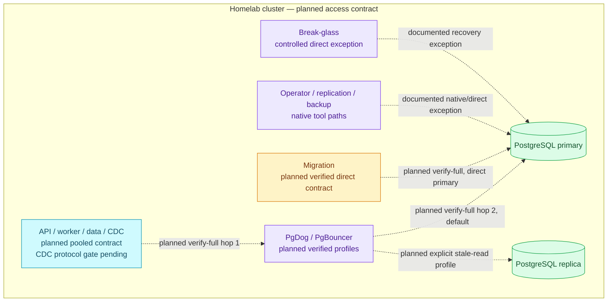

# RFC-0029 PostgreSQL authorization and access governance

| Status | Scope | Research | Created | Last updated |
|--------|-------|----------|---------|--------------|
| Accepted | platform-wide | [./research.md](./research.md) — gate passed 2026-10-06 | 2026-10-06 | 2026-10-15 |

> **Don't forget: every decision is a tradeoff.** The cost of the leading
> direction is more Secrets, more HBA pairs and a coordinated consumer cutover
> per service; § Design Details → drawbacks and § Rollout & rollback spell it out.

## Prerequisites

- [x] [`research.md`](./research.md) merged; [research review gate](./research.md#research-review-gate) passed (11/11)
- [x] Context7 audit complete; the source-tree, live-CRD and pgroles checks are in the research log
- [x] Owner approved **ready for RFC** on 2026-10-06
- [x] This RFC summarizes the target and links the mechanism deep dive instead of repeating it
- [x] Status **`Accepted`** 2026-10-06: ADR-084, ADR-085 and ADR-086 created (§ Resulting decisions). `docs/api/` is N/A: no service route or RPC changes; service code does not manage authorization

## Summary

Implementation tracking: [issue #1269](https://github.com/duynhlab/homelab/issues/1269).
Merging the documentation refactor does not complete the rollout checklist.

The platform owns database roles, memberships and object grants. Applications
receive a stable connection contract: endpoint, database, fixed username,
password delivery, TLS trust and `application_name`. Schema migrations remain
service-owned; authorization does not belong in those migrations.

[ADR-088](../../adr/ADR-088-platform-owns-database-authorization/) supersedes the
original service-owned authorization design. Its catalog Job creates owner and
migrator roles and sets owner-at-login; the Job or pgroles applies grants, with
one controller per concern. Services call `migratex.Run` without role options.

**Adoption:** D1 (`review`) and D2 (`user`, `shipping`, `notification`) have
recorded evidence on `platform-db`; see Implementation History. The expanded
access contract below is **planned**, accepted in direction on 2026-10-15.
Documentation review is not evidence that TLS, attribution or new consumer
profiles have been deployed. Remaining fleet adoption stays pending.

## Motivation

The original audit found runtime logins owning 147/147 application tables and
no declared object privileges. Splitting identities prevents runtime access
from carrying schema ownership. Moving grants to the platform removes role
knowledge from service code and gives each authorization object one owner.

The next boundary is connection management: services should not discover
primaries, configure pooler internals or coordinate independent password
writers. A connection contract must also state which paths bypass pooling,
what TLS verifies and when a read can be stale.

Historical measurements and experiments remain in [research.md](./research.md).
They describe their recorded environment, not a fresh audit of the whole fleet.

### Goals

1. Runtime owns no objects and cannot acquire owner/migrator privileges.
2. Migrations create objects as the NOLOGIN owner; platform default privileges
   and grants make those objects usable without service-authored authorization SQL.
3. The platform reconciles roles/grants and monitors membership-option drift.
4. Consumers receive a stable contract, verified TLS and workload attribution.
5. Adoption is gated per service with positive and negative evidence.

### Non-Goals

- Deploying the access changes as part of this documentation refactor.
- Replacing either PgDog or PgBouncer, or moving to the EC2 reference topology.
- A complete human-access system, cloud IAM or dynamic per-session credentials.
- RLS or SECURITY DEFINER patterns without a concrete use case.
- Claiming Keycloak, Temporal, payment or CDC already satisfy the target paths;
  existing direct consumers need integration work before cutover.
- A broad rotation audit or approval of specific rotation cadences.

## Decision outcome

Owner decisions recorded 2026-10-15:

| Topic | Decision | Adoption / remaining work |
|---|---|---|
| Authorization | Platform-owned; retain owner/migrator/runtime split | ADR-088, D1/D2 evidence; remaining services pending |
| Migration | Direct primary endpoint, bypass pooler | Preserve direct access; verify owner-at-login and locks |
| Other consumers | Runtime, data, CDC and other SQL consumers use poolers | Planned; select compatible profiles before cutover |
| Internal operations | Operator, node replication and backup/recovery retain native/direct paths | Preserve tool requirements; do not force through app pools |
| Break-glass | Controlled direct access for recovery | Explicit exception, scoped access and revocation procedure |
| Pooler implementation | Keep PgDog and PgBouncer | Compatibility verified per deployed version and profile |
| TLS | Applications support TLS; verify-full on both pooled hops | Planned; direct migration verifies its single hop |
| User/password | Fixed usernames; both automatic and manual password policies | Per-role policy/cadence remains proposed |
| Role model | NOLOGIN owner; separate migration/runtime; data/CDC/monitoring/platform templates | Templates below; new consumers not yet provisioned |
| Attribution | application_name is required | Naming proposal below; implementation and telemetry gate pending |
| Consistency/retry | Primary by default; replica reads explicit; no blind replay of ambiguous writes | Apply these rules in implementation contracts |

## Proposal

### App/platform contract

| Application receives / implements | Platform owns |
|---|---|
| Logical endpoint, port, database and connection profile | Primary discovery, failover, pooler configuration and capacity |
| Fixed login and password delivery/reload contract | Roles, grants, secret storage, rotation writer and distribution |
| TLS verification, trusted CA bundle and expected hostname | Certificate issuance/renewal, SANs and CA lifecycle |
| Stable application_name on every new connection | Naming inventory and config injection |
| Transaction boundaries, timeouts, safe retry and consistency intent | Routing profile, connection budgets and observability |

No password, CA private key or full credential-bearing DSN belongs in Git,
logs or issue evidence. Endpoint abstraction does not hide consistency semantics
or remove application responsibility for safe transaction retry.

### Connection matrix

All target changes below are **planned** unless backed by the existing adoption
record. Native/direct does not mean unencrypted or unauthenticated.

| Consumer | Target route | Constraint |
|---|---|---|
| API / workers | Pooler → primary by default | Runtime identity; explicit replica profile only when stale reads are acceptable |
| Migration | Direct primary (`-rw`), no pooler | Migrator identity; owner-at-login; stable backend during lock lifetime |
| Data robot / reporting | Pooler → primary or explicit replica profile | Dataset-scoped SELECT; timeout and connection budget |
| CDC | Replication-compatible pooler → source primary | Snapshot, replication protocol, reconnect and slot recovery must pass before adoption |
| Monitoring / platform SQL jobs | Compatible pooler profile | Preserve required session settings and permissions; not automatically transaction mode |
| CNPG operator / node replication | Native/operator path | Operator-managed lifecycle; not an application-pool migration |
| Backup / recovery | Tool-native path, including object storage | Do not reinterpret restore/WAL transfer as pooled application SQL |
| Break-glass | Controlled direct path | Recovery when access layer fails; scoped credentials, record use, revoke afterwards |

CDC is not authorized to silently bypass pooling if its gate fails: keep rollout
blocked for that consumer and bring a proposed exception back to the owner.
Existing direct integrations remain current reality until their gated cutover.

### Roles and ownership

| Role template | Login / authority | Connection / lifecycle |
|---|---|---|
| `<svc>_owner` | NOLOGIN; owns database, schema and objects | No password or workload Secret |
| `<svc>_migrator` | LOGIN; owner membership INHERIT FALSE, SET TRUE, ADMIN FALSE | Direct primary; platform sets owner-at-login; separate migration Secret |
| `<svc>_runtime` | LOGIN; no ownership or privileged membership; object grants | Pooled API/worker access |
| `<svc>_reader_data` | Separate robot login; SELECT on approved datasets/views | Pooled; no blanket PII access; one accountable consumer |
| `<svc>_cdc_<consumer>` | Separate login; snapshot/replication rights required by connector | Pooled after compatibility gate; separate from data reader |
| Monitoring | Minimum observation privileges needed by exporter | Pooled compatible profile; no business DML |
| Platform authz / rotation | Separate functional identities, narrowly scoped elevated rights | One writer per role/grant/password concern; recovery procedure |
| Support / break-glass | Individual, scoped access; no shared application login | Human-access implementation deferred; controlled direct recovery exception |

Templates specify intended privileges, not ready-to-apply SQL. CDC grants,
curated datasets and human issuance need their own consumer-specific review.

| Managed concern | Authority |
|---|---|
| Owner/migrator creation, membership options, owner-at-login and migrator password | ADR-088 role catalog Job/CronJob |
| Object grants/default privileges | Catalog Job or pgroles, exactly one per database |
| Runtime identity, Database owner, HBA and db_authz | CNPG objects; password ownership must respect the engine pilot exception |
| Notification runtime password pilot | OpenBAO database engine; no competing CNPG passwordSecret writer |
| Secrets distribution | OpenBAO / ESO and consumer reload/rollout |
| Schema changes | Service migrations only; no service GRANT/SET ROLE plumbing |

The executor remains privileged infrastructure, not a superuser exemption.
D2's pgroles wildcard limitation for `schema_migrations` remains an explicitly
accepted exception in the evidence; this refactor does not claim it was removed.

## Architecture & Diagrams

This diagram answers which target consumer paths are pooled and which are direct.
It shows the **planned access contract**, not a new deployment measurement.
Authorization ownership is explained in ADR-088 rather than duplicated here.

```mermaid
flowchart TB
    subgraph cluster["Homelab cluster — planned access contract"]
        app["API / worker / data / CDC<br/>planned pooled contract<br/>CDC protocol gate pending"]:::service
        mig["Migration<br/>planned verified direct contract"]:::worker
        pool["PgDog / PgBouncer<br/>planned verified profiles"]:::platform
        primary[("PostgreSQL primary")]:::data
        replica[("PostgreSQL replica")]:::data
        ops["Operator / replication / backup<br/>native tool paths"]:::platform
        emergency["Break-glass<br/>controlled direct exception"]:::platform
        app -. "planned verify-full hop 1" .-> pool
        pool -. "planned verify-full hop 2, default" .-> primary
        pool -. "planned explicit stale-read profile" .-> replica
        mig -. "planned verify-full, direct primary" .-> primary
        ops -. "documented native/direct exception" .-> primary
        emergency -. "documented recovery exception" .-> primary
    end
    classDef service fill:#cffafe,color:#164e63,stroke:#0891b2;
    classDef worker fill:#fef3c7,color:#78350f,stroke:#d97706;
    classDef platform fill:#ede9fe,color:#4c1d95,stroke:#7c3aed;
    classDef data fill:#dcfce7,color:#14532d,stroke:#16a34a;
```

Legend: cyan = consumer, amber = migration work, purple = platform,
green = data. Dotted paths explicitly name planned behavior or an exception.
Backup object-storage flows are outside this connection-routing question; see
[database architecture](../../../databases/architecture.md).

## Design Details

### Direct migration and session locks

The runner logs into the primary as the migrator; the platform-configured role
setting makes its effective role the owner. Service code does not call
`WithSetRole` or ship authorization SQL. This is ADR-088's chosen mechanism.

Session advisory locks belong to a PostgreSQL backend session, not a username.
Transaction pooling can move successive statements between backends; an unlock
on a different backend does not release the original lock. The selected direct
path removes that pooler-affinity problem. The runner must still hold the same
connection for lock/work/unlock. COMMIT does not release a session lock.

Test concurrent runners and cleanup after success, failure and process death.
On failover, abort and inspect migration version/dirty state before recovery;
do not blindly replay DDL. Session pooling was considered but is not the chosen
migration route. See [PostgreSQL advisory locks](https://www.postgresql.org/docs/18/explicit-locking.html#ADVISORY-LOCKS).

### TLS and CA lifecycle

**Accepted target:** client → pooler and pooler → PostgreSQL each verify the
peer certificate chain and expected hostname (`verify-full` semantics). Direct
migration verifies the primary endpoint in one hop. Keeping TLS on one hop
does not secure the other. Configure the equivalent behavior for each pooler;
do not assume both products expose the same setting names.

**Proposed delivery:** platform issues certificates with endpoint SANs and
supplies trust bundles. For CA replacement, distribute a bundle trusting old
and new CAs first, reload clients/poolers, switch server certificates, verify
new connections, then remove old trust after the agreed overlap. Workloads
must actually reload trust; updating a mounted file alone is insufficient.
No fallback to plaintext or disabled hostname verification on failure.

The CA overlap duration, renewal thresholds, component reload mechanisms and
rollout error budget remain open. Reuse [RFC-0020](../RFC-0020/) for internal
TLS ownership; this RFC defines the database consumer boundary.

### application_name and telemetry

**Required:** every consumer sets `application_name`. **Proposed naming:**
`<workload>@<environment>`, retaining existing workload names:
`order@local`, `order-worker@local`, `checkout-worker@local` and
`order-migrate@local`. Do not rename `order` to the note's illustrative
`orders-api`. Platform injects the complete value; the shared client maps it
to the PostgreSQL startup parameter on every connection.

Use the existing telemetry environment source (`DEPLOYMENT_ENVIRONMENT`);
Compose currently sets `local`. Keep `OTEL_SERVICE_NAME` unchanged. Proposed
validation is lowercase ASCII letters/digits/hyphens per component, one `@`,
and at most 63 bytes for a standard PostgreSQL build; reject rather than
silently truncate. No pod UID, release SHA, request ID or secret in this label.
The label is client-supplied observability metadata, never authorization.

Repository inspection on 2026-10-15 found the workload names in Compose/domain
ResourceSets but no explicit PostgreSQL `application_name`/`PGAPPNAME` wiring
in the searched service/shared-client configuration. This is not runtime proof.

[Query telemetry](../../../observability/metrics/postgresql/query-telemetry.md)
already maps `pg_stat_ch.app` to `application_name`; that mapping stays.
After implementation, verify client → pooler → PostgreSQL → ClickHouse →
dashboard, then update guide examples, dashboard filters and
[DBClientQueryP95High](../../../observability/runbooks/microservices/DBClientQueryP95High.md).
Client metric `app=order` need not equal server event `app=order@local`:
explicitly map workload and environment. Preserve interpretation of historical
empty/old names; do not invent attribution for old records.

### Password rotation and delivery

Fixed username does not mean fixed password. Automatic and operator-triggered
rotation share the same delivery problem: PostgreSQL, pooler authentication
and the consuming process must agree on the credential version. ESO refresh
is distribution, not rotation; an updated Secret does not refresh an existing
process environment. Existing sessions succeeding does not prove new login works.

Exactly one writer changes a role's password. The notification static-role
pilot declares `720h` in the repository; other roles do not inherit that policy
by implication. Do not let CNPG/catalog overwrite an engine-managed password.
An OpenBAO static-role creation can rotate immediately; manual rotate-role
invocation does not disable its automatic schedule. See
[OpenBAO database API](https://openbao.org/docs/api/secret/databases/).

The following is a **proposal, not an approved schedule**:

| Role category | Proposed trigger / cadence | Adoption condition |
|---|---|---|
| NOLOGIN owner | None | No password exists |
| Runtime / data robots | Automatic, 30 days | Fresh authentication and consumer reload proven |
| Migrator | Manual workflow, 30 days | No concurrent migration; separate delivery/recovery |
| CDC | Manual, 90 days initially; review monthly | Temporary exception until reconnect/slot/offset recovery permits automatic 30 days |
| Monitoring | Automatic, 90 days | Minimum privileges; shorten if sensitive/wide access |
| Authz / rotation management / pooler lookup | Manual workflow, 30 days | Scoped identity and independent recovery path |
| Break-glass | After use; access review every 90 days | Review frequency is not a password rotation schedule |
| Operator-managed internals / humans | Separate lifecycle | Do not impose application machine-password policy |

These are homelab starting points, not universal security requirements or
GitLab.com's verified internal cadence. Suspected compromise or revocation
requires immediate handling regardless of a periodic schedule.

**Minimum delivery gate, not a broad audit:** inventory writer and consumers;
prepare versioned secret/recovery; coordinate the actual DB writer, pooler
refresh and workload reload; test a new client and a newly authenticated
backend; confirm recovery on mismatch. Record version metadata and outcome,
never secret values. The two delivery branches are not atomic, so establish
an acceptable error window before enabling unattended rotation. Do not count
an incomplete consumer rollout as successful rotation.

If a write times out, inspect state before retrying. Do not roll back to a
compromised credential. Changing a password alone does not terminate already
authenticated sessions; incident revocation must consider those sessions too.
Manual means a person triggers a repeatable workflow, not ad-hoc SQL competing
with a reconciler.

### Consistency and retry

- Default reads and writes to primary. Replica access is explicit per flow,
  with a lag tolerance; it is not an automatic optimization for every SELECT.
- Read-after-write stays on primary for the relevant workflow. Existing
  transaction/snapshot semantics still apply; primary routing is not a promise
  of a globally fresh snapshot inside an older transaction.
- Bound retry by deadline/backoff and operation semantics. Retry a whole
  transaction only for classified transient failures and replay-safe work.
- Unknown commit outcome requires reconciliation or an idempotency mechanism;
  never blindly reissue a write or duplicate external side effects.
- Migration and CDC recovery follow their own state/version/offset procedures.

### Alternatives and tradeoffs

The three-role model is retained. Service-owned authorization (ADR-085) was
superseded by ADR-088; pgroles is adopted for selected in-database grants, not
for role ownership. Forcing migration or native recovery through an application
pool would add compatibility and failure dependencies; those paths remain direct.
Keeping both poolers costs a per-version compatibility matrix but avoids an
unjustified replacement. Verified TLS and fixed-user rotation require coordinated
reloads; neither is declared zero-downtime without evidence.

## Security considerations

The platform executor, rotation writer and auth lookup credentials are privileged
infrastructure and require scoped rights and recovery. Runtime may not inherit
those powers. Retain ADR-015 HBA isolation and the existing PUBLIC CONNECT
choice; this refactor does not silently change admission policy. TLS secures
transport; it does not replace SQL authorization or secret revocation.

## Observability & SLO impact

Retain membership drift alerts and existing authorization gate evidence. For
access rollout, observe authentication failures, new-connection recovery,
consumer errors/backlog and CDC lag. Attribution must be validated through the
pooler before updating dashboard/runbook claims. Rotation needs outcome and
last-success visibility, not secret values in logs or unbounded metric labels.
No new numerical SLO or mandatory fleet-wide rotation audit is approved here.

## Rollout & rollback

| Stage | Status / exit |
|---|---|
| Phase 0–2, ADR-088 redesign, D1/D2 | Historical evidence below; do not reclassify as new access-contract validation |
| Access-contract documentation | Record accepted decisions and explicit remaining proposals; no runtime mutation |
| Implementation planning | Set profile compatibility, naming, CA/reload/error budget and per-role password ownership |
| Canary access contract | Migration direct, runtime pooled; TLS negatives, attribution and minimum rotation delivery gate |
| Remaining fleet / data / CDC | Consumer-by-consumer evidence; local-stack parity and Linux/Kind gates before qualified rollout |

Preserve data during access changes: restore a known-good endpoint/config and
compatible trust/credential state, then verify new connections. Recreating a
cluster was the historical disposable-lab cutover approach, not a rollback
procedure for a populated database. Existing-data ownership transfer remains
operator-run and was not exercised by the greenfield evidence; see
[authorization guide](../../../databases/authorization.md#rollback-and-existing-data).
Never restore a compromised or revoked password as a rollback target.

## Testing / verification

- Documentation PR: render diagrams, check links/fences and run `make validate`.
- Runtime implementation: positive CRUD/migration, negative DDL/grants/SET ROLE,
  catalog ownership/default ACLs/membership options; retain D2 exceptions explicitly.
- Two direct migrators: serialization, same backend per lock lifetime, cleanup
  after success/failure/death; failover recovery checks migration state.
- TLS: correct CA/hostname passes; wrong CA/hostname and prohibited plaintext
  fail on each hop independently, including direct migration.
- Attribution: interleave clients through the actual pooler/version; verify
  PostgreSQL application_name and ClickHouse/dashboard values are not misassigned.
- Rotation: correct writer, fresh client/backend authentication, consumer
  reload and controlled recovery from mismatch. No exhaustive audit required.
- CDC: snapshot/streaming, reconnect, offsets/slots and retained-WAL impact;
  do not delete slots as a password-recovery shortcut.
- Consistency: explicit replica flow tolerance, primary read-after-write and
  no duplicated effects under retry/ambiguous commit.

## Open questions

Accepted directions are in Decision outcome; these details remain **open**:

| Detail | Recommended direction | Needed before implementation |
|---|---|---|
| application_name naming | Existing workload + @environment | Approve inventory/validation and shared-client mapping |
| CA lifecycle | Trust overlap → cert switch → verified reload → remove old trust | Durations, component reload support and failure budget |
| Rotation policy | Proposed table above | Per-role trigger/cadence, writer, owner and recovery |
| Pooler profiles | Keep both products; compatible profile per consumer | Versioned TLS/session/replication matrix, particularly CDC and platform jobs |
| Replica reads | Opt-in only | Per-flow lag tolerance and fallback behavior |

The former service `WithSetRole` decision is superseded by ADR-088, not an open
choice. Capability templates are accepted in shape; exact data/CDC grants must
be scoped to their datasets and connector requirements before provisioning.

## Resulting decisions

| Decision | Record | Status |
|---|---|---|
| Three-role identity split | [ADR-084](../../adr/ADR-084-split-service-database-roles/) | Accepted; implementation ownership amended by ADR-088 |
| Service-owned authorization | [ADR-085](../../adr/ADR-085-service-migrations-own-authorization/) | Historical; superseded by ADR-088 |
| Membership-option guard | [ADR-086](../../adr/ADR-086-guard-membership-options/) | Accepted |
| Platform-owned authorization | [ADR-088](../../adr/ADR-088-platform-owns-database-authorization/) | Accepted; partial adoption |
| Access paths, verified TLS and required attribution | This RFC, Decision outcome, owner decision 2026-10-15 | Accepted direction; planned rollout; named implementation details open |

## Implementation History

- 2026-09-03 — research opened (`researching`).
- 2026-10-05 — Phase 0 remediation merged (#989) and executed on Kind; research
  refreshed (#1227) and the run recorded (#1228).
- 2026-10-06 — owner approved **ready for RFC**; this README authored at
  `provisional` (#1229).
- 2026-10-06 — **Accepted**; ADR-084, ADR-085 and ADR-086 created at
  `Accepted`, Adoption `Not started`.
- 2026-10-06 — Phase 0 step 6: the membership guard for `vault_rotator →
  notification` shipped and was exercised on Kind (flip and revoke both fired
  and resolved); ADR-086 Adoption `Partial`.
- 2026-10-06 — Phase 1 conventions authored
  ([`authorization.md`](../../../databases/authorization.md)); the open questions
  resolved as greenfield, `migratex.WithSetRole`, alert plus gate.
- 2026-10-08 — Phase 2: `review` converted (homelab #1245, review-service
  `v2.5.0`). Fresh Kind: sweep 84/84, K3.7 2/2, K3.8–K3.9 10/10, `make e2e`
  146/146, drift drill on the new edge; local-stack audit A1–A23, B1–B10,
  C0–C22 PASS.
- 2026-10-09 — Phase 3 wave 1 paused by the owner before merge (user, shipping,
  notification PRs closed later): role knowledge does not belong in services.
- 2026-10-12 — Redesign accepted after a Kind lab (pgroles 0.13.0, CNPG 1.30.1):
  ADR-088 supersedes ADR-085. pkg `migratex/v0.39.0` removes `WithSetRole`;
  review-service #208 drops `DB_MIGRATION_ROLE` and `000004_authorization`.
- 2026-10-14 — D1 opened: `authz_admin` + `db_authz` executor (CNPG creates a
  role with `IN ROLE`, so one CNPG-managed executor would deadlock a new
  cluster), role catalog Job + CronJob, review moved onto it, guard extended.
- 2026-10-15 — D1 merged (#1267): review `2.6.0` tagged after a full
  local-stack audit; fresh Kind K3.4 99/99, K3.7–K3.10 green, drift drill. The
  first bring-up failed K3.8, so the Job now creates `schema_migrations`.
- 2026-10-15 — D2: user, shipping and notification on the catalog Job plus
  pgroles policies. PGR-10: pgroles cannot leave `schema_migrations` out of a
  table wildcard; the owner accepted that those runtimes hold it. Fresh
  Kind: K3.4 105/105, K3.8 48/48, three policies Ready, drift drill green.

## Related

- [Research](./research.md) — experiments and historical evidence, including superseded designs
- [Authorization guide](../../../databases/authorization.md) — current ownership and operational evidence
- [Database architecture](../../../databases/architecture.md) — as-built paths, including existing direct consumers
- [RFC-0020](../RFC-0020/) — internal TLS ownership
- [RFC-0030](../RFC-0030/) — CDC/analytics integration and downstream contract
- [Rotate vault_rotator](../../../databases/runbooks/rotate-vault-rotator-credential.md)
- [ADR-013](../../adr/ADR-013-per-service-db-triplet/), [ADR-014](../../adr/ADR-014-pooler-credentials-valuesfrom/), [ADR-015](../../adr/ADR-015-pg-hba-connection-isolation/), [ADR-025](../../adr/ADR-025-pgdog-passthrough-dynamic-db-creds/) — related identity, admission and credential records
