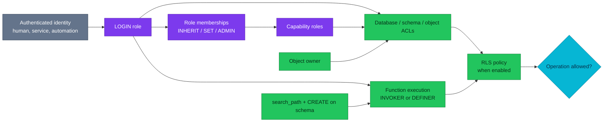
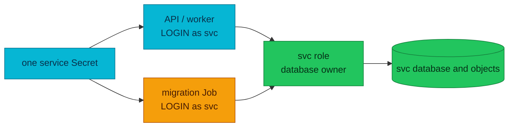

# RFC-0029 — Research: PostgreSQL authorization and access governance

| | |
|---|---|
| **RFC** | RFC-0029 |
| **Status** | researching |
| **Scope** | platform-wide |
| **Created** | 2026-09-03 |
| **Last updated** | 2026-09-05 |

> **Plain-language research.** This is the evidence and teaching record before
> an authorization architecture is proposed. It covers self-managed PostgreSQL
> 18.1 on CloudNativePG 1.30. Cloud database IAM is reference material only and
> is not a v1 rollout target.
>
> **Scope fence:** the companion Vietnamese deep dive and the RFC proposal do
> not exist yet. Repository process requires this research to pass its source,
> experiment, and owner gates first.

---

## Table of contents

1. [Problem statement](#problem-statement)
2. [Reading path](#reading-path)
3. [Executive findings](#executive-findings)
4. [Evidence model](#evidence-model)
5. [Authorization model](#authorization-model)
6. [Ten-layer learning model](#ten-layer-learning-model)
7. [Glossary](#glossary)
8. [Deep dive: ownership and default privileges](#deep-dive-ownership-and-default-privileges)
9. [Worked examples](#worked-examples)
10. [CloudNativePG DatabaseRole 1.30](#cloudnativepg-databaserole-130)
11. [Homelab as-built audit](#homelab-as-built-audit)
12. [Candidate target architecture](#candidate-target-architecture)
13. [Production scenario corpus](#production-scenario-corpus)
14. [Security and failure analysis](#security-and-failure-analysis)
15. [Experiment plan and evidence](#experiment-plan-and-evidence)
16. [Integration paths](#integration-paths)
17. [Alternatives](#alternatives)
18. [Rollout shape](#rollout-shape)
19. [Open questions](#open-questions)
20. [FAQ](#faq)
21. [References](#references)
22. [Context7 audit log](#context7-audit-log)
23. [Research review gate](#research-review-gate)

---

## Problem statement

### Real-world trigger

| | |
|---|---|
| **Situation** | A Platform Engineer joins two companies and inherits incompatible PostgreSQL access models: direct user grants, shared service owners, manual incident accounts, and migrations running with the same credential as the application. The task is to unify authorization without turning every deploy into a database superuser event. |
| **Who feels it** | Platform, application teams, data teams, security reviewers, and on-call engineers. |
| **Why now** | Homelab already declares databases and login roles through CNPG, but the declaration stops at role attributes. It does not model schema/object privileges, default ACLs, RLS, function security, or access-review evidence. |
| **If we do nothing** | Runtime compromise can become schema compromise; new tables can silently miss required grants; temporary access becomes permanent; access reviews cannot answer who can do what; and GitOps can report green while catalog authorization has drifted. |

> **In plain terms:** today one key often opens the application, migration room,
> and ownership cabinet. The goal is separate keys, predictable grants for new
> objects, and a repeatable way to prove the doors are still correct.

### What homelab practice must prove

1. A service can migrate from one owner/login role to separate owner,
   migrator, and runtime roles without losing object ownership or availability.
2. Future tables, sequences, and functions receive the intended privileges
   because default privileges are configured for the role that actually creates
   them.
3. CNPG `DatabaseRole` owns the part it can express, while SQL migrations or a
   narrow reconciliation mechanism own object ACLs and membership options that
   the CRD cannot express.
4. Break/fix exercises detect privilege escalation, `search_path` attacks,
   RLS bypass, permission drift, and stale temporary access.
5. The design can later map human authentication from EKS/cloud identity onto
   the same PostgreSQL capability roles without making cloud IAM a v1 dependency.

## Reading path

1. Start with [Authorization model](#authorization-model) and the
   [ten-layer learning model](#ten-layer-learning-model) for the PostgreSQL
   mental model.
2. Read [Deep dive: ownership and default privileges](#deep-dive-ownership-and-default-privileges)
   before evaluating role names or YAML. It explains why the identity that
   creates an object determines future access.
3. Compare [CloudNativePG DatabaseRole 1.30](#cloudnativepg-databaserole-130)
   with the [homelab as-built audit](#homelab-as-built-audit) to separate CRD
   guarantees from catalog state.
4. Use the [scenario corpus](#production-scenario-corpus),
   [experiments](#experiment-plan-and-evidence), and
   [research gate](#research-review-gate) as the implementation checklist.

## Executive findings

1. **Authentication and authorization are different systems.** Password, TLS,
   or IAM proves who connected. PostgreSQL roles, memberships, ownership, ACLs,
   RLS, and function execution decide what that identity can do.
2. **Ownership is stronger than a grant.** An owner can alter/drop the object
   and normally bypass its row-security policies. A runtime role should own no
   application object.
3. **Default privileges are creator-scoped, not database defaults.** They affect
   future objects created by one role; inherited membership does not make a
   session use another role's defaults. The migration session must `SET ROLE`
   to the intended owner before creating objects.
4. **`DatabaseRole` is identity lifecycle, not a complete authorization
   controller.** It manages role attributes, passwords, and membership names.
   It does not manage database/schema/table/sequence/function ACLs, default
   privileges, RLS policies, `SECURITY DEFINER` safety, or PG18 membership
   options.
5. **The current homelab conflates migration and runtime authority.** Every
   service ResourceSet passes the same `db_secret` and default role name to the
   API and migration Job, differing only by direct-primary versus pooled
   endpoint. The live audit measured 147/147 application tables across 11
   audited application databases owned by that same service login.
6. **The first security fix is operational, not educational.** A committed
   `vault_rotator` password is removed by the current working-tree manifests and
   replaced with a per-cluster OpenBAO value. The 2026-09-04 audit ran the prior
   committed tree and measured `INHERIT`, membership `INHERIT`, and `SET` all
   true; Phase 0 changes those targets to false. No existing cluster is fixed
   until these manifests land and the live rotation runbook rejects the old
   credential.

## Evidence model

Every claim in the future deep dive must carry one of these evidence classes:

| Class | Meaning | Example |
|---|---|---|
| **PostgreSQL contract** | PostgreSQL 18 official documentation or catalog behavior | Owners can grant privileges; default ACLs apply to future objects |
| **CNPG contract** | CNPG 1.30 documentation/API | Standalone `DatabaseRole` is recommended; Secret and Cluster are same-namespace |
| **Source inspection** | CNPG release-1.30 source proves behavior not stated by docs | `inRoles` stores strings; membership diff ignores ADMIN/INHERIT/SET options |
| **Manifest evidence** | Repository declares the state | Service DB role is also `Database.spec.owner` |
| **Catalog evidence** | Query against a running PostgreSQL catalog | `pg_auth_members.admin_option=true` |
| **Experiment** | Reproducible disposable PG/CNPG test | New table inherits expected runtime ACL |
| **Planned** | Accepted direction not deployed | owner/migrator/runtime split after an accepted RFC |
| **Reference** | Educational future option | RDS IAM authentication |

Documentation must not promote manifest intent to catalog fact. A
`DatabaseRole.status.applied=true` proves its modeled fields were applied; it
does not prove object ACLs, RLS, function definitions, or unmodeled membership
options.

## Authorization model

PostgreSQL authorization is the result of several independent mechanisms. A
useful access-review question is therefore not “what grants does Alice have?”
but “what effective path lets this session perform this operation?”



The diagram answers one question: which paths contribute to the effective
authorization decision. It does not imply that a single controller owns every
path.

### A practical evaluation order

1. Can the identity authenticate and does HBA admit this role/database/source?
2. Does it have `CONNECT` on the database?
3. Does it have `USAGE` on the target schema?
4. Is it the owner, directly granted, a member of a granted role, or executing
   through a function?
5. Does the object privilege cover this operation and dependent objects such as
   sequences?
6. If RLS is enabled, does a policy admit the existing and proposed row?
7. If a definer function is involved, is its owner and `search_path` safe?

## Ten-layer learning model

Each layer in the future `vi.md` follows the same four-part path: **Concept →
SQL → Production Use Cases → Break/Fix & Security Exercises**. The layers are
ordered so later mechanisms do not hide missing fundamentals.

| Layer | Concept boundary | SQL proof | Production focus | Break/fix focus |
|---:|---|---|---|---|
| 01 | Database, schema, and object privileges | `GRANT`, `REVOKE`, `has_*_privilege` | One database with one or many schemas | `CONNECT` succeeds but schema/table use fails |
| 02 | Roles and users (`LOGIN` is an attribute) | `CREATE ROLE`, `ALTER ROLE` | Human vs service vs automation identities | Shared login and orphan role detection |
| 03 | Membership and inheritance | `GRANT role TO role`, `SET ROLE`, `pg_auth_members` | 20-person dev/data teams through group roles | Membership chain, ADMIN/SET escalation |
| 04 | Ownership and default privileges | `ALTER OWNER`, `REASSIGN OWNED`, `ALTER DEFAULT PRIVILEGES` | Migration vs runtime; new objects inherit ACL | Wrong creator, global/per-schema ACL traps |
| 05 | Least-privilege architecture | capability roles + separate logins | owner/migrator/runtime separation | Runtime DDL and cross-service access attempts |
| 06 | Row-level security | `ENABLE/FORCE ROW LEVEL SECURITY`, policies | Shared-table multi-tenancy | Owner/BYPASSRLS bypass and missing `WITH CHECK` |
| 07 | `SECURITY DEFINER` / `INVOKER` | function attributes and EXECUTE ACL | Expose one constrained operation | Definer owner compromise and PUBLIC EXECUTE |
| 08 | `search_path` escalation | schema ACLs and qualified names | Safe shared utility functions | Object shadowing in writable schemas/`pg_temp` |
| 09 | Authentication integration | HBA, TLS/cert, passwords, future IAM | EKS workload and human identity mapping | Authenticated identity mapped to wrong capability |
| 10 | Production authorization architecture | catalog queries + policy-as-code | reviews, drift, break-glass, GitOps rollout | detect, contain, revoke, and prove recovery |

### Layer 03: a 20-person team

Twenty people should not produce twenty independent table-grant sets. Model a
NOLOGIN capability role such as `data_readonly`, grant object access to it, and
grant/revoke membership as people join or leave. Human login creation remains an
identity-system concern; PostgreSQL membership is the database capability edge.

PG18 records three membership options separately:

- `INHERIT` — whether privileges flow automatically;
- `SET` — whether the member may become the granted role with `SET ROLE`;
- `ADMIN` — whether the member may grant/revoke membership to others.

These options are security properties, not decoration. A role can be allowed to
`SET ROLE` for an audited migration without receiving the owner's privileges in
every session. `ADMIN OPTION` is delegation power and must be rare.

```sql
CREATE ROLE data_readonly NOLOGIN;
GRANT CONNECT ON DATABASE app TO data_readonly;
GRANT USAGE ON SCHEMA reporting TO data_readonly;
GRANT SELECT ON ALL TABLES IN SCHEMA reporting TO data_readonly;

-- PG18 makes the membership semantics explicit.
GRANT data_readonly TO analyst_alice
  WITH INHERIT TRUE, SET TRUE, ADMIN FALSE;
```

CNPG 1.30 can represent `inRoles: [data_readonly]`, but not those three option
values. SQL/catalog policy must own and audit any non-default option.

## Glossary

| Term | In plain English |
|---|---|
| Login role | A PostgreSQL role with `LOGIN`; it is an authenticating identity, not a separate “user” object type |
| Capability role | Usually a `NOLOGIN` role that bundles permissions such as read-only or migration authority |
| Membership | An edge that lets one role inherit or explicitly assume another role's capabilities |
| Owner | The role with control-plane authority over a database, schema, or object; stronger than an ACL grant |
| ACL | Explicit privileges such as `SELECT`, `INSERT`, `USAGE`, or `EXECUTE` on an existing object |
| Default privilege | A creator-scoped rule that changes ACLs on future objects; it does not repair existing objects |
| Effective access | Everything a session can do through direct grants, memberships, ownership, `PUBLIC`, RLS, and functions |
| RLS | Row-level security: policy checks applied after ordinary object privileges permit the statement |
| `SECURITY DEFINER` | A function that runs with its owner's authority and therefore needs a hardened path and narrow execute ACL |
| HBA | PostgreSQL's connection-admission rules; HBA decides who may connect, not what SQL they may perform afterward |

## Deep dive: ownership and default privileges

This is the load-bearing layer. Most authorization designs fail here while the
GRANT statements themselves look correct.

### Ownership is control-plane authority

The owner is not simply another grantee. The owner has implicit privileges to
alter or drop the object, can grant its privileges to others, and controls many
security-relevant properties. For tables, ownership also normally bypasses RLS.

Consequences:

- A service runtime that owns its tables is not least privilege even if its ACL
  shows only `SELECT/INSERT/UPDATE/DELETE`.
- Revoking a privilege from an owner does not remove ownership powers.
- Database ownership, schema ownership, and table ownership are separate.
- `REASSIGN OWNED` is database-scoped and must be run in every database where
  the old owner owns objects.
- `DROP OWNED` is destructive and is not a normal cleanup shortcut.

### The creator identity selects the default ACL

`ALTER DEFAULT PRIVILEGES` changes privileges for objects created **later** by
one role. It does not rewrite existing objects. At object creation, PostgreSQL
consults the defaults of the current creating role only; privileges inherited
from another role do not cause that other role's defaults to apply.

Correct migration contract:

```sql
-- Bootstrap once, executed with authority to create roles and schema.
CREATE ROLE orders_owner NOLOGIN;
CREATE ROLE orders_migrator LOGIN NOINHERIT;
CREATE ROLE orders_runtime LOGIN;

GRANT orders_owner TO orders_migrator
  WITH INHERIT FALSE, SET TRUE, ADMIN FALSE;
ALTER DATABASE orders OWNER TO orders_owner;
REVOKE CONNECT, TEMPORARY ON DATABASE orders FROM PUBLIC;
GRANT CONNECT ON DATABASE orders TO orders_migrator, orders_runtime;

-- Migration connection authenticates as orders_migrator, then becomes owner.
SET ROLE orders_owner;
CREATE SCHEMA IF NOT EXISTS app AUTHORIZATION orders_owner;
REVOKE ALL ON SCHEMA app FROM PUBLIC;

ALTER DEFAULT PRIVILEGES FOR ROLE orders_owner IN SCHEMA app
  GRANT SELECT, INSERT, UPDATE, DELETE ON TABLES TO orders_runtime;
ALTER DEFAULT PRIVILEGES FOR ROLE orders_owner IN SCHEMA app
  GRANT USAGE, SELECT ON SEQUENCES TO orders_runtime;
-- PUBLIC EXECUTE is a global default. Revoke it globally; a per-schema
-- REVOKE FROM PUBLIC stores no per-schema override and is therefore a no-op.
ALTER DEFAULT PRIVILEGES FOR ROLE orders_owner
  REVOKE EXECUTE ON FUNCTIONS FROM PUBLIC;
ALTER DEFAULT PRIVILEGES FOR ROLE orders_owner IN SCHEMA app
  GRANT EXECUTE ON FUNCTIONS TO orders_runtime;

-- Backfill existing objects: default privileges never do this.
GRANT USAGE ON SCHEMA app TO orders_runtime;
GRANT SELECT, INSERT, UPDATE, DELETE ON ALL TABLES IN SCHEMA app TO orders_runtime;
GRANT USAGE, SELECT ON ALL SEQUENCES IN SCHEMA app TO orders_runtime;
REVOKE EXECUTE ON ALL FUNCTIONS IN SCHEMA app FROM PUBLIC;
GRANT EXECUTE ON ALL FUNCTIONS IN SCHEMA app TO orders_runtime;
RESET ROLE;
```

The migrator has no direct CREATE privilege on the application schema and its
owner membership is `INHERIT FALSE`. Forgetting `SET ROLE`, opening a new
connection without it, or using a migration tool that drops session state must
fail closed instead of creating migrator-owned objects. The canary must test
that negative path before rollout.

The sequence grant is intentional: an insert into a table can still fail when
the runtime cannot use the sequence backing an identity/serial column. Function
defaults are intentional too: PostgreSQL grants `EXECUTE` on new functions to
`PUBLIC` by default unless the owner changes that policy.

### Existing objects and future objects are two tests

Every authorization migration requires both:

| Test | Proves |
|---|---|
| Backfill ACL test on current tables/sequences/functions | Existing workload continues after runtime loses ownership |
| Create a new canary table as the owner, then inspect ACL | Default privileges prevent future drift |

Testing only existing tables validates the backfill but says nothing about the
next deployment. Testing only a new table leaves old objects inconsistent.

### Global and per-schema defaults are additive

Per-schema default privileges add to global defaults. In PG-05, a per-schema
`REVOKE EXECUTE ON FUNCTIONS FROM PUBLIC` wrote zero `pg_default_acl` rows: it
was a complete no-op, not a negative override. Only the global revoke produced
an ACL and removed the built-in PUBLIC execute privilege. Therefore the
architecture must revoke that function default globally for the creator and
then add schema-specific positive grants for application capabilities.

### Ownership migration sequence

For one service database, the safe candidate sequence is:

1. Inventory database, schema, table, sequence, function, type, and large-object
   ownership plus explicit ACLs.
2. Create `<svc>_owner` (NOLOGIN), `<svc>_migrator`, and `<svc>_runtime` without
   changing consumers.
3. Grant owner membership to migrator with no delegation power.
4. Set default privileges as `<svc>_owner`.
5. Backfill runtime ACLs and revoke unsafe `PUBLIC` privileges.
6. Change ownership with `ALTER ... OWNER` or `REASSIGN OWNED` in that database.
7. Run positive runtime CRUD and negative DDL/cross-schema tests.
8. Point the workload at `<svc>_runtime`; point migration Jobs at
   `<svc>_migrator`.
9. Remove the legacy `<svc>` login only after connection telemetry and catalog
   checks show zero use.

The chosen naming direction is a real cutover, not an in-place rename. GitOps
creates a new `<svc>_runtime` role and `DatabaseRole`, cuts workload consumers
over, then retires the legacy `<svc>` CR and retained PostgreSQL role after zero
use is proven. `DatabaseRole.spec.name` is immutable, so `ALTER ROLE ... RENAME`
would disconnect Kubernetes identity from desired state and is not the rollout
mechanism.

### Break/fix exercises for layer 04

1. Create a table without `SET ROLE`; prove creation fails at schema `USAGE` or
   `CREATE` before table ACL evaluation and that no migrator-owned object appears
   in `pg_class`.
2. Repair existing ACLs and then create another table; show why backfill alone
   did not fix the default.
3. Leave function `EXECUTE` at its built-in PUBLIC default, attempt to revoke it
   per schema, and prove the revoke stores zero default-ACL rows and changes
   nothing; then apply the global revoke and retest.
4. Reassign objects in one database only; prove the old owner still cannot be
   dropped because it owns objects elsewhere.
5. Make runtime the table owner and enable RLS; prove owner bypass, then apply
   `FORCE ROW LEVEL SECURITY` and retest.
6. Delete a `DatabaseRole` with reclaim policy `delete` while it owns objects;
   observe the finalizer retry rather than object deletion.

## Worked examples

> **Not deployed** — these examples define the lab contract; the experiment
> table below remains the source of truth for completion status.

| Example | Positive proof | Negative proof | Catalog evidence |
|---|---|---|---|
| Owner defaults for a new table | owner creates a canary after `SET ROLE`; runtime can perform intended CRUD | runtime cannot alter or drop the canary | `pg_class.relowner`, `aclexplode(relacl)` |
| Data-team read role | a named analyst reads an approved schema through one capability membership | the analyst cannot write or delegate membership | `pg_auth_members`, `has_table_privilege` |
| Hardened definer function | runtime invokes one approved operation | object shadowing and direct table write fail | `pg_proc.prosecdef`, `proconfig`, function ACL |
| Tenant RLS | tenant reads and writes only its tenant key | cross-tenant read and `WITH CHECK` write fail | `pg_policy`, table owner and `relforcerowsecurity` |

Every worked example must run as the actual login under test. Running only as
`postgres` and asking privilege-inspection functions is useful evidence, but it
does not exercise authentication, HBA, session settings, or function context.

## CloudNativePG DatabaseRole 1.30

### What it owns well

- Kubernetes-native standalone role lifecycle; this is the recommended GitOps
  form in CNPG 1.30.
- Role attributes including LOGIN, SUPERUSER, CREATEDB, CREATEROLE, INHERIT,
  REPLICATION, BYPASSRLS, connection limit, comment, and validity.
- Password updates from a same-namespace `kubernetes.io/basic-auth` Secret.
- Membership **names** through `inRoles`.
- Safe role retention by default; optional delete behavior with ownership-aware
  finalization.
- Per-resource status including applied state and observed password Secret
  resource version.

### Contract details that matter in production

1. `DatabaseRole`, referenced `Cluster`, and `passwordSecret` must share a
   namespace.
2. The Secret username must match `spec.name`; `cnpg.io/reload: "true"` causes
   prompt password application.
3. Adoption is authoritative: omitted attributes return to defaults and
   memberships omitted from `inRoles` are revoked.
4. Standalone roles reconcile on spec or Secret change, not through periodic
   catalog comparison. Manual drift can survive until the next trigger.
5. Inline `Cluster.spec.managed.roles` wins if the same PostgreSQL role is also
   declared by a standalone resource.
6. `retain` preserves the PostgreSQL role if the Kubernetes resource disappears;
   it does not preserve a generated client-certificate Secret.
7. Role name and Cluster reference are immutable in the 1.30 API.

### What it does not own

| Concern | `DatabaseRole` 1.30 | Required owner |
|---|---|---|
| Database/schema/table/sequence/function grants | Not modeled | SQL migration or policy reconciler |
| Object ownership and reassignment | Not modeled | Migration/runbook |
| Default privileges | Not modeled | Owner-context SQL |
| RLS policies | Not modeled | Schema migration |
| Function body, owner, INVOKER/DEFINER, safe `search_path` | Not modeled | Schema migration + review policy |
| HBA admission | Cluster `pg_hba`, not DatabaseRole | Platform GitOps |
| Membership `ADMIN`, `INHERIT`, `SET` options | Not modeled by `inRoles` | SQL plus catalog audit |
| Continuous catalog drift correction | Event-triggered only | Scheduled audit or controlled reconcile trigger |

### Source-inspected membership limitation

The release-1.30 API defines `InRoles []string`. Its catalog query aggregates
only parent role names, and its diff emits plain `GRANT parent TO member` or
`REVOKE`. It neither reads nor writes PG18's membership option columns. Two
important effects follow:

- An existing membership with `ADMIN OPTION` is considered equal by name and
  is left untouched. This is how the `vault_rotator` bootstrap grant survives.
- If the membership is missing and CNPG recreates it, only PostgreSQL's default
  membership options are applied. CNPG cannot enforce `admin_option=true`.

CNPG-04 reproduced both effects on CNPG 1.30.0: an existing `t/t/t` membership
was left untouched, but after manual revoke the controller recreated it as
`admin_option=f, inherit_option=t, set_option=t`. The behavior is now source
and runtime evidence, not a promised public API contract. The production
guardrail must query `pg_auth_members`, and an upgrade test must repeat this
experiment for every CNPG minor/major change.

## Homelab as-built audit

### Inventory

| Item | Manifest and catalog evidence as of 2026-09-04 |
|---|---|
| PostgreSQL | 18.1 on operational `platform-db` and `product-db` |
| CNPG | 1.30.0 |
| Service databases | 13 (`temporal` and `temporal_visibility` share one role) |
| Standalone DatabaseRoles | Live committed-tree audit: 12 applied service/platform roles. Current working-tree target: 13 after adding the standalone `vault_rotator` role |
| Service role membership | Twelve service/platform role manifests declare `inRoles: []`; the working-tree `vault_rotator` target declares membership by name and repairs its PG18 options with SQL |
| Database ownership | Each application database is owned by the same login role used by the service; Temporal owns two databases |
| Workload credential split | None: each ResourceSet feeds the same `db_secret` and role name to runtime and migrations |
| Local-stack parity | None: all application and migration connections use PostgreSQL superuser `postgres` |
| Object/default ACL declaration | No deployed platform manifest; live `pg_default_acl` is empty in every audited database |
| RLS/security-definer policy | Zero RLS tables; only pgaudit-owned definer functions, no application definer function |
| Default database ACL | `datacl IS NULL` on all 15 databases, so PostgreSQL's built-in PUBLIC CONNECT and TEMPORARY defaults apply |
| `public` schema | `pg_database_owner` owns it; PUBLIC has USAGE but not CREATE, matching PostgreSQL 15+ defaults |
| Table ownership | 147/147 application tables across 11 audited application databases are owned by the service login; zero conform to the candidate split |
| HBA | Exact role/database pairs plus a final reject; isolation sweep passed 13 allowed and 59 rejected pairs |

The 2026-09-04 verification run supplies the catalog evidence summarized here.
It used the committed tree at `b6659b04`, not these Phase 0 manifests; that
distinction prevents a target state from being mislabeled as deployed.

### Existing decisions this work would extend or supersede

Research does not change these records. A later RFC must state the relationship
explicitly and create one ADR per accepted replacement decision.

| Record | Current accepted contract | Effect of the candidate direction |
|---|---|---|
| [ADR-013](../../adr/ADR-013-per-service-db-triplet/) | One ExternalSecret + one DatabaseRole login/owner + one Database per service | Preserve the platform-owned triplet boundary, but supersede the single login/owner role with owner, migrator, and runtime identities |
| [ADR-014](../../adr/ADR-014-pooler-credentials-valuesfrom/) | PgDog user passwords come from the service Secret through positional `valuesFrom` | Runtime rename and a separate migration Secret require an audited user-list/Secret remap; the no-password-in-Git rule remains |
| [ADR-015](../../adr/ADR-015-pg-hba-connection-isolation/) | Exact role/database HBA pairs plus trailing reject; SQL `REVOKE CONNECT` was rejected as a second mechanism | Preserve exact HBA isolation with new runtime/migrator pairs; reconsider `PUBLIC CONNECT` only as explicit defense-in-depth, not as an undocumented reversal |
| [ADR-025](../../adr/ADR-025-pgdog-passthrough-dynamic-db-creds/) | OpenBAO rotates the fixed notification role through `vault_rotator` | Preserve the pilot; harden its administrator credential and membership options |
| [RFC-0020](../RFC-0020/) | Planned internal TLS on `homelab-ca` | Authorization must not silently widen today's `host` rules; TLS rollout stays a separate transport decision |

CNPG-managed extension objects and the `public` schema's `pg_database_owner`
relationship are ownership exceptions to inventory, not objects to bulk
`REASSIGN OWNED` without inspection.

### Current authority path



Compromise of a runtime credential therefore inherits the powers needed by
migrations and ownership. NetworkPolicy and exact HBA reduce which source can
connect, but they do not reduce authority after a permitted workload connects.

### Immediate credential remediation

The 2026-09-04 live audit measured the pre-remediation committed state:
`vault_rotator` was `NO SUPERUSER`, `CREATEROLE`, `INHERIT`, and held
`notification` membership with `ADMIN`, `INHERIT`, and `SET` all true. Because
the exact HBA pair admits it to the `notification` database and that login owns
the database objects, the leaked credential was also a direct notification-data
authority, not only password-rotation authority.

The current working tree is the Phase 0 target and now:

- removes the committed `vault_rotator` password from CNPG bootstrap SQL and the
  OpenBAO configurator Job;
- generates a random value per fresh cluster in OpenBAO bootstrap and sends it
  to the CLI through stdin rather than a process argument;
- projects it as `platform-db-vault-rotator-secret` with ESO;
- declares the role through a full standalone `DatabaseRole` spec;
- feeds the same Secret to CNPG and the OpenBAO database configurator without
  placing the password in the `bao` process argument list;
- documents the pre-seed and live rotation procedure.

It also changes the role to `NOINHERIT` and the grant to `INHERIT FALSE, SET
FALSE, ADMIN TRUE`. This is not live proof. The credential remains compromised
on any already running cluster until the working tree lands, the runbook repairs
the existing membership options, and the old password is rejected.

## Candidate target architecture

The direction selected for detailed design is three roles per service:

| Role | LOGIN | Owns objects | Purpose |
|---|---:|---:|---|
| `<svc>_owner` | no | database, application schema, application objects | Stable ownership anchor; never placed in a workload Secret |
| `<svc>_migrator` | yes | no; may `SET ROLE <svc>_owner` | Schema migration only; separate short-lived Job credential |
| `<svc>_runtime` | yes | no | CRUD/EXECUTE required by the running API/worker |

`<svc>_runtime` is a deliberate rename and consumer cutover from the current
`<svc>` login. A compatibility alias may exist only during a bounded migration
window and must have a removal condition.

The pattern is a starting hypothesis for the ten application databases, not a
blind fleet substitution. Keycloak performs its own startup schema work, while
Temporal uses separate schema tooling and one role across `temporal` plus
`temporal_visibility`; each needs an explicit integration experiment before it
can adopt or deliberately diverge from the pattern.

### Responsibility split

| Layer | Candidate source of truth |
|---|---|
| Role existence/attributes/password/membership names | CNPG `DatabaseRole` |
| Database owner | CNPG `Database` referencing `<svc>_owner` |
| HBA admission | CNPG `Cluster.spec.postgresql.pg_hba` |
| Schema/object ownership, ACL backfill, default ACL, RLS, functions | Versioned SQL migrations executed after `SET ROLE <svc>_owner` |
| Workload vs migration Secret wiring | ResourceSet/chart interface, separate inputs |
| Human/team membership | Identity workflow plus PostgreSQL capability-role membership |
| Unmodeled membership options and effective-access evidence | Catalog audit |
| Temporary/break-glass access | Time-bound workflow with issue/approver/expiry and explicit revoke |

The split follows ownership boundaries: the platform creates identities and
connection guardrails; the repository that owns a schema versions the SQL that
changes that schema. A central platform Job executing every service's object ACL
would become a second schema-migration system.

The initial ownership transfer is a privileged bootstrap exception. A service
migrator cannot transfer objects it does not yet own or establish its own owner
membership. The RFC must choose and time-box either an operator procedure using
the CNPG local peer-authenticated `postgres` path or a narrowly scoped bootstrap
Job, record every transferred object, and remove that executor after cutover.

There is also a known control gap around PG18 membership options. If someone
removes a membership that CNPG models only by name, the controller can recreate
it with PostgreSQL defaults rather than the intended `INHERIT`, `SET`, and
`ADMIN` values. Fleet production readiness therefore requires an idempotent
exact-membership reconciler. A scheduled catalog control plus repair runbook is
only the explicitly accepted Phase 0 stopgap; it detects exposure after the
edge has already drifted. `DatabaseRole.status.applied` alone is inadequate.
This is already a running example: `vault_rotator → notification` needs
`ADMIN TRUE, INHERIT FALSE, SET FALSE`, while CNPG-04 proved that a membership
recreated from `inRoles` becomes `ADMIN FALSE, INHERIT TRUE, SET TRUE`.

### RLS and SECURITY DEFINER scope

RLS and definer functions are included as teaching and guardrail mechanisms, not
a fleet rollout in v1:

- RLS becomes relevant only for a shared-table tenant model; database-per-service
  isolation does not need it by default.
- Table owners, superusers, and roles with BYPASSRLS normally bypass policies;
  `FORCE ROW LEVEL SECURITY` changes owner behavior.
- `SECURITY DEFINER` is an exception mechanism for one constrained operation,
  never a shortcut for broad runtime privileges.
- A definer function must set a safe `search_path` with trusted schemas first and
  `pg_temp` last, qualify security-sensitive names, use a non-login/non-superuser
  owner, revoke `PUBLIC` EXECUTE, and grant only intended callers in the same
  transaction as creation.

## Production scenario corpus

Exactly 25 scenarios will run through the learning material and later lab. Each
scenario has a positive proof, a negative proof, catalog evidence, and a
rollback/revoke step.

| # | Production scenario | Primary layer(s) | Required proof |
|---:|---|---|---|
| 01 | Microservice with its own database | 1, 2, 5 | Runtime reaches only its database and required objects |
| 02 | One database with multiple schemas | 1, 4, 5 | Schema USAGE and object privilege remain distinct |
| 03 | Developer read-only production access | 2–5 | SELECT works; write, DDL, and delegation fail |
| 04 | Twenty-person data team reading many databases | 3–5 | Group membership changes access without per-user ACL edits |
| 05 | Migration identity separated from runtime | 4, 5 | Migrator can change schema; runtime cannot |
| 06 | New table automatically receives runtime ACL | 4 | Canary table proves creator-scoped default ACL |
| 07 | Existing objects backfilled during role split | 4, 5 | Old and new objects expose the same intended runtime rights |
| 08 | Sequence privilege behind INSERT | 1, 4 | INSERT succeeds only after required sequence access |
| 09 | Function PUBLIC EXECUTE removed by default | 4, 7 | Untrusted role cannot call a newly created function |
| 10 | Temporary incident read access | 3, 5, 10 | Grant has owner, expiry, evidence, and tested revoke |
| 11 | Break-glass write access | 3, 5, 10 | Approval and audit exist; normal path stays denied |
| 12 | Contractor offboarding | 3, 10 | Membership removal removes effective access across databases |
| 13 | Service credential compromise | 2, 5, 9, 10 | Rotation revokes old authentication; runtime cannot perform DDL |
| 14 | Multi-tenant shared table | 6 | Tenant sees only its rows on SELECT/UPDATE/DELETE |
| 15 | Tenant isolation on INSERT/UPDATE | 6 | `WITH CHECK` blocks writing rows into another tenant |
| 16 | RLS owner-bypass exercise | 6 | Owner bypass is observed; FORCE behavior is understood |
| 17 | Limited operation exposed through a function | 7 | Caller performs one operation without base-table write access |
| 18 | SECURITY DEFINER privilege escalation attempt | 7, 8 | Unsafe owner/PUBLIC EXECUTE is detected and corrected |
| 19 | `search_path` object-shadowing attack | 8 | Writable schema/temporary shadow cannot hijack the hardened function |
| 20 | Password rotation through ESO and DatabaseRole | 9, 10 | Secret version triggers role update; old password fails |
| 21 | EKS workload to self-managed PostgreSQL | 9 | Reference mapping separates pod identity from DB capability |
| 22 | RDS IAM database authentication | 9 | Reference comparison documents token auth limits; not deployed |
| 23 | Audit who can access what | 3, 10 | Direct, membership, ownership, PUBLIC, RLS, and function paths are reported |
| 24 | Permission drift after manual hotfix | 4, 10 | Drift is detected and deliberately reconciled or accepted |
| 25 | RBAC as Code / GitOps access review | 10 | Desired state, catalog state, exception expiry, and reviewer decision reconcile |

## Security and failure analysis

### Trust boundaries and assets

| Boundary | Asset | Main threats | Guardrail |
|---|---|---|---|
| Git → Flux → CNPG | Role desired state | tampering, over-privileged review | protected PR, explicit full specs, validation |
| OpenBAO → ESO → Secret | Login credential | disclosure, stale/mismatched version | no literal in Git, scoped reads, reload label, rotation proof |
| Migration Job → PostgreSQL | Owner authority | credential theft, unintended DDL | separate Secret, short job lifetime, `SET ROLE`, direct primary path |
| Runtime → PostgreSQL | Business data | SQL injection becomes schema takeover | runtime owns nothing; minimum object rights |
| Human identity → capability role | Production access | stale membership, delegation | groups, ADMIN false, expiry and review |
| Function call → definer owner | Elevated operation | object shadowing, PUBLIC execution | safe path, narrow owner, ACL transaction |

### High-value negative invariants

| Invariant | 2026-09-04 evidence |
|---|---|
| Runtime cannot perform DDL, grant, change RLS, or assume owner/migrator | **False today** — runtime login owns all 147 audited application tables; candidate target only |
| Migrator cannot delegate owner membership | **Planned** — no separate migrator identity exists yet |
| No service role has SUPERUSER, CREATEROLE, CREATEDB, REPLICATION, or BYPASSRLS | **Measured true** for all 12 service roles; `streaming_replica` and `vault_rotator` are deliberate platform exceptions |
| Owner is NOLOGIN and has no Kubernetes password Secret | **Planned** — current owner is the service login |
| `public` schema is not writable by untrusted roles | **Measured true** — PUBLIC has USAGE, not CREATE |
| New application functions are not executable by PUBLIC by default | **False today** — `pg_default_acl` is empty; no application definer function currently exists |
| Manual privilege drift is captured or revoked within the incident window | **Planned** — CNPG-06 measured drift surviving at least 600 seconds and repairing only after a trigger |
| Deleting a CR cannot silently drop an object-owning production role | **Measured true** in CNPG-05; `retain` preserves it and `delete` finalization blocks while ownership remains |

## Experiment plan and evidence

### PostgreSQL 18 disposable lab

| ID | Experiment | Pass condition | Current evidence |
|---|---|---|---|
| PG-01 | Database/schema/table/sequence privilege ladder | Every missing layer produces the expected denial | **pass 2026-09-04** — four distinct denials, then insert succeeds |
| PG-02 | INHERIT vs SET vs ADMIN membership | Catalog and effective rights match each option | **pass** — catalog and real sessions match all three options; first missing inherited right fails at schema USAGE |
| PG-03 | Defaults applied by owner after `SET ROLE` | New table/sequence/function ACLs match policy | **pass** — 17 table/sequence ACL rows; PUBLIC absent from function ACL |
| PG-04 | Hardened migration without `SET ROLE` | CREATE is denied and no migrator-owned object appears | **pass** — schema denial and zero migrator-owned objects |
| PG-05 | Global vs per-schema default privilege | Per-schema revoke cannot cancel global grant | **pass** — per-schema revoke stores zero rows; global revoke removes PUBLIC |
| PG-06 | Existing-object backfill | Current objects and canary object converge | **pass** — legacy and canary converge on the same four runtime rights |
| PG-07 | RLS USING/WITH CHECK and FORCE | Cross-tenant operations fail; owner behavior recorded | **pass** — tenant filter/write check, owner bypass, and FORCE all observed |
| PG-08 | Definer `search_path` shadow attack | Vulnerable function is exploited; hardened version resists | **pass** — weak function was hijacked; qualified safe path resisted |

### CNPG 1.30 disposable lab

| ID | Experiment | Pass condition | Current evidence |
|---|---|---|---|
| CNPG-01 | Adopt an existing role with complete and incomplete specs | Omitted fields/memberships reset as documented | **pass 2026-09-04** — thin adoption reset CREATEDB and connection limit |
| CNPG-02 | Secret version rotation with reload label | status/Secret version and SCRAM verifier change | **pass** — resource version and verifier changed; HBA correctly made login an invalid proxy |
| CNPG-03 | Change `spec.name` | API rejects immutable update | **pass** — CRD CEL rejected role name and Cluster reference changes |
| CNPG-04 | Preserve then recreate ADMIN membership | Existing option is invisible; recreated grant uses defaults | **pass** — existing options preserved by ignorance; recreate lost ADMIN |
| CNPG-05 | Delete retained vs deleting role | Retain leaves role; owned delete blocks finalization | **pass** — retain preserved role; owned delete remained finalizer-blocked |
| CNPG-06 | Manual catalog drift | Drift survives until a spec/Secret trigger | **pass** — drift survived 600 seconds and repaired one second after spec touch |

### Repository validation already performed

- `make validate` passes the repository's full manifest, schema, policy, and
  generated-output checks after the Phase 0 manifest changes.
- `kubectl kustomize kubernetes/infra/configs/databases` renders the new
  ExternalSecret, DatabaseRole, and Secret-backed Job environment.
- Search of current database/secret manifests finds no prior `vault_rotator`
  password literal.
- Markdown link checks pass for this research, the new runbook, and their
  indexes; all three research/runbook Mermaid diagrams render and were visually
  checked for clipping and ambiguous flow.
- The live catalog audit and 13-allow/59-reject HBA sweep passed on the Linux
  Kind cluster. Old-password rejection remains pending until the Phase 0
  working-tree manifests land and the live rotation is executed.

## Integration paths

### Service and migration identities

The candidate service path is CNPG `DatabaseRole` for login/owner identities,
exact HBA entries for both runtime and migrator, separate Secrets, and
service-versioned authorization SQL. Runtime may use the pooler; migrations
must use the primary endpoint so DDL is not placed behind transaction pooling.
The chart and ResourceSet contract must expose both Secret references before a
canary can move.

### Human access

Human access should reuse capability roles without sharing a team password:

| Concern | Candidate integration | Evidence required before selection |
|---|---|---|
| Identity | one named or short-lived login per person/session | actor remains attributable in PostgreSQL and audit logs |
| Team authorization | NOLOGIN capability role such as `data_readonly` | join/leave changes one membership edge; `ADMIN FALSE` is proven |
| Connection admission | explicit human-access HBA path through an approved network boundary | direct developer laptop and unintended databases remain denied |
| Expiry | external workflow revokes membership/login at expiry | expired incident access fails a fresh authenticated session |
| Review | desired identity/group state compared with effective catalog access | direct grants, nested membership, ownership, `PUBLIC`, RLS, and functions are included |

Cloud IAM, certificate mapping, and dynamic OpenBAO credentials are possible
authentication mechanisms, not authorization models. They remain reference
options until a cloud-specific RFC selects the identity source, connection
proxy/boundary, audit fields, and revocation SLA.

## Alternatives

Two independent choices must not be collapsed into one comparison.

### Identity topology

| Option | Advantages | Costs / risks |
|---|---|---|
| **Three service roles: owner/migrator/runtime** | Separates runtime compromise from DDL and ownership; maps cleanly to deployment phases | More Secrets, HBA pairs, and coordinated consumer cutovers |
| **Capability roles plus separate logins** | Composable for people and automation that share permissions | More membership edges; CNPG cannot express PG18 membership options |
| **Keep one service owner/login** | Lowest rollout cost | Runtime compromise remains schema/ownership compromise; fails the least-privilege goal |

### Object-authorization reconciliation vehicle

| Option | Advantages | Costs / risks |
|---|---|---|
| **Service-owned authorization migrations** | Authorization changes with schema; no second migration engine; clear schema ownership | Requires cross-repo migration and chart/ResourceSet coordination |
| **Central platform authorization Job** | One policy surface and rollout controller | Homelab couples to every service schema; ordering and rollback duplicate application migrations |

The leading hypothesis is owner/migrator/runtime identities with service-owned
authorization migrations, plus capability roles where multiple identities
genuinely share one permission set. It is not an architecture decision until
the canary integration and verification-gate choices are resolved and the
owner gate passes. The PG18/CNPG experiments now support the mechanism.

## Rollout shape

### Phase 0 — revoke the known credential

1. Pre-seed the new OpenBAO KV path on an existing cluster.
2. Reconcile the manifest change and verify ExternalSecret Ready,
   `DatabaseRole.status.applied=true`, and configurator Job Complete.
3. Verify `vault_rotator` is non-superuser, CREATEROLE, NOINHERIT,
   non-BYPASSRLS, and has notification membership with `admin_option=true`,
   `inherit_option=false`, and `set_option=false`.
4. Force one notification rotation and prove the static credential still flows.
5. Prove the compromised administrator password is rejected.

A fresh Kind cluster can rehearse convergence and the eight-column target, but
it cannot prove revocation of a compromised password that was never seeded.
That final proof must run against the existing cluster after the manifests land.

### Phase 1 — lab and policy contract

- Preserve or rebuild the scratch PG18/CNPG harness as a repeatable gate; the
  first recorded run passed 14/14 experiments.
- Define catalog queries for effective access and drift.
- Define role naming, ownership, Secret, HBA, and reclaim conventions.
- Decide whether local-stack adopts non-superuser owner/migrator/runtime roles
  or authorization remains an explicitly Kind-only release gate.
- Pass research review; then author the RFC and Vietnamese deep dive.

### Phase 2 — one service canary

- Choose a low-blast-radius service after inventorying ownership and migrations.
- Introduce owner/migrator/runtime roles without changing the current consumer.
- Add exact runtime/database and migrator/database HBA entries before either
  new login is used; retain the legacy pair only for the bounded cutover.
- Apply default ACL and existing-object backfill as a service migration.
- Split migration/runtime Secret inputs in the chart/ResourceSet.
- Cut runtime to `<svc>_runtime`; observe connections; retire `<svc>`.

### Phase 3 — fleet rollout

- Roll by domain, never all databases at once.
- Require positive CRUD/migration tests and negative privilege tests per service.
- Make local-stack stop using `postgres` so the release gate exercises the same
  authorization failure modes.
- Add scheduled drift/access-review evidence and expiring exception inventory.

### Phase 4 — advanced mechanisms

- Introduce RLS only for a real shared-table multi-tenant requirement.
- Introduce definer functions only for a reviewed limited-operation use case.
- Evaluate workload/human IAM authentication in a cloud-specific RFC; reuse the
  same PostgreSQL capability model.

## Open questions

- [ ] Which service is the canary after measuring schema/migration complexity?
      Keycloak owns 100 of the 147 audited tables and its migrations are not
      homelab-authored, so it is a poor first canary.
- [ ] Does the shared `mop` chart add separate `runtimeSecretRef` and
      `migrationSecretRef`, or can current values express this without a breaking
      chart interface?
- [ ] What is the maximum compatibility window before the legacy `<svc>` login
      must be removed?
- [ ] Which catalog collector owns periodic drift evidence: a read-only CronJob,
      an existing monitoring path, or an on-demand CI/access-review command?
- [ ] Which PG18 membership options are platform defaults, and how are
      non-default options reconciled outside `DatabaseRole`?
- [ ] Does the initial ownership transfer use an operator runbook or a
      one-shot bootstrap Job, and what proves that privileged executor is gone?
- [ ] Which identity system and network boundary issue, expire, and audit human
      production logins before cloud IAM is considered?
- [x] Context7/source-tree and live-CRD audit completed on 2026-09-04; findings
      are summarized in this research document.
- [x] Live Kind catalog inventory and HBA sweep completed on 2026-09-04; the
      Phase 0 credential rotation itself remains open.
- [ ] Which E2E gate protects authorization while local-stack runs every
      service and migration as superuser `postgres`: add three-role parity or
      declare and automate a Kind-only authorization gate?

## FAQ

**Why not let the runtime role own its tables?**

Ownership includes schema-changing and grant authority. A SQL injection or
leaked runtime credential would therefore become a control-plane compromise,
not only a data-plane compromise.

**Why are grants on all current tables insufficient?**

They are a backfill. The next table is governed by the creating role's default
privileges, so both an existing-object test and a new canary-object test are
required.

**Does `DatabaseRole.status.applied=true` prove authorization is correct?**

No. It covers the fields the CRD models. It does not prove object/default ACLs,
RLS, function hardening, effective nested access, or PG18 membership options.

**Should twenty analysts get one shared PostgreSQL password?**

No. Give each actor an attributable named or short-lived login and attach it to
a NOLOGIN capability role. Team access changes at the membership edge.

**Is RLS the default tenant boundary for every service?**

No. It is appropriate for shared-table tenancy with a real tenant context. It
adds policy and owner-bypass complexity and is unnecessary for ordinary
database-per-service isolation.

**Why is cloud IAM not part of v1?**

IAM changes how a workload or person authenticates. The owner, membership,
ACL, RLS, and function model still needs to be correct. Keeping authentication
integration separate lets the self-managed lab prove that portable core first.

## References

- [PostgreSQL 18 privileges](https://www.postgresql.org/docs/18/ddl-priv.html)
- [PostgreSQL 18 role membership](https://www.postgresql.org/docs/18/role-membership.html)
- [PostgreSQL 18 GRANT](https://www.postgresql.org/docs/18/sql-grant.html)
- [PostgreSQL 18 ALTER ROLE](https://www.postgresql.org/docs/18/sql-alterrole.html)
- [PostgreSQL 18 default privileges](https://www.postgresql.org/docs/18/sql-alterdefaultprivileges.html)
- [PostgreSQL 18 row security policies](https://www.postgresql.org/docs/18/ddl-rowsecurity.html)
- [PostgreSQL 18 CREATE FUNCTION](https://www.postgresql.org/docs/18/sql-createfunction.html)
- [PostgreSQL 18 schemas and `search_path`](https://www.postgresql.org/docs/18/ddl-schemas.html)
- [CloudNativePG 1.30 role management](https://cloudnative-pg.io/docs/1.30/declarative_role_management/)
- [CloudNativePG release-1.30 `DatabaseRole` API source](https://github.com/cloudnative-pg/cloudnative-pg/blob/release-1.30/api/v1/databaserole_types.go)
- [CloudNativePG release-1.30 role catalog/reconciliation source](https://github.com/cloudnative-pg/cloudnative-pg/blob/release-1.30/internal/management/controller/roles/postgres.go)
- In-repo: [Declarative role management](../../../databases/declarative-role-management.md), [Database architecture](../../../databases/architecture.md), [credential rotation runbook](../../../databases/runbooks/rotate-vault-rotator-credential.md), [RFC-0012](../RFC-0012/)

## Context7 audit log

| Claim / section | Source checked | Result |
|---|---|---|
| DatabaseRole lifecycle, adoption, namespace and Secret rules | CNPG 1.30 official documentation | confirmed |
| Owner and object privilege model | PostgreSQL 18 official documentation | confirmed |
| PG18 membership options | PostgreSQL 18 official documentation | confirmed |
| Creator-scoped future-object defaults and global/per-schema behavior | PostgreSQL 18 official documentation | confirmed |
| RLS owner/BYPASS behavior | PostgreSQL 18 official documentation | confirmed |
| SECURITY DEFINER and safe `search_path` rules | PostgreSQL 18 official documentation | confirmed |
| DatabaseRole name immutability | CNPG release-1.30 API source | confirmed |
| `inRoles` membership-option blindness | CNPG release-1.30 source inspection | confirmed; public contract does not promise option preservation |
| Context7 CNPG API, reconciler, and declarative-role docs | Context7 source tree audit, 2026-09-04 | confirmed; versioned docs snippets were incomplete, so source and live CRD are load-bearing |
| Live CRD immutability and reserved-name rules | Kind CNPG 1.30.0 CRD | confirmed |
| Live catalog vs manifests | Kind `platform-db` and `product-db`, PostgreSQL 18.1 | confirmed; measured results are summarized in the as-built audit and experiment tables above |

## Research review gate

**Current result: 9/11.** Only the existing-cluster Phase 0 execution and owner
sign-off remain open.

- [x] Answers a real-world platform/security problem rather than generic vendor marketing
- [x] Problem statement names situation, affected roles, and cost of doing nothing
- [x] At least two alternatives documented with tradeoffs
- [x] Platform as-built section filled from manifests and clearly labeled as manifest evidence
- [x] Primary use-case direction stated as a research conclusion
- [x] PostgreSQL 18 and CNPG 1.30 disposable experiments completed (14/14 pass)
- [ ] Existing-cluster Phase 0 rotation completed; catalog audit is complete,
      but the working-tree remediation has not landed and the old password has
      not been rejected
- [x] Context7/source-tree and live-CRD audit complete
- [x] Mermaid diagrams distinguish the current and conceptual paths
- [x] No fleet authorization rollout is smuggled into this research file
- [ ] Owner sign-off: **ready for RFC**

---
_Last verified: 2026-09-04 (PostgreSQL 18.1 and CNPG 1.30.0 disposable labs,
live Kind catalog/HBA audit, Context7/source-tree and live-CRD audit; Phase 0
live credential rotation and owner gate remain open)._
