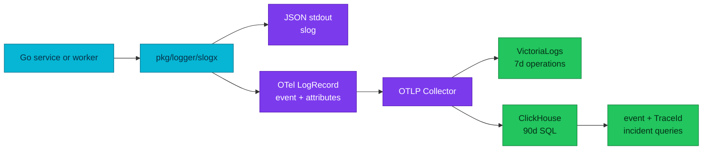

# RFC-0031 — Research: cross-signal telemetry standard and ClickHouse operations

| | |
|---|---|
| **RFC** | RFC-0031 |
| **Status** | researching → gate passed with provisional RFC |
| **Scope** | platform-wide |
| **Created** | 2026-09-16 |
| **Last updated** | 2026-09-17 |

## Problem statement

### Real-world trigger

| | |
|---|---|
| **Situation** | An on-call engineer investigating a failed checkout must infer event type from a human message and query different legacy HTTP and gRPC fields. |
| **Who feels it** | Service owners, on-call engineers, platform engineers, and security reviewers. |
| **Why now** | The ClickHouse store now keeps 90 days of OTLP logs and traces, so an inconsistent application contract has become a long-lived operational cost. |
| **If we do nothing** | Queries, dashboards, retention analysis, redaction, and trace correlation remain service-specific and fragile. |

> **In plain terms:** the fleet has an OTLP transport, but it does not yet have one reliable language for saying what happened.

### What the audit proves

- Application metrics correctly use VictoriaMetrics, but two seconds histograms lack operation-specific boundaries and the fleet pins three obsx versions.
- All ten services and both worker modes enable shared Pyroscope profiling; the contract lacks a release gate for profile coverage, label bounds and runtime overhead.
- The span profile ID is still emitted, but the VictoriaTraces Jaeger datasource cannot provide Grafana's Tempo-only one-click tracesToProfiles link.
- All ten active services pin `zapx v0.36.0`; their `obsx` pins range from `v0.37.0` to `v0.38.0`.
- No active service has a production call site that emits a stable `event` attribute, so ClickHouse has to group business outcomes by parsing `Body`.
- The current access logger emits legacy `path`, `status`, `duration`, `client_ip`, and `user_agent`; the latter two contradict the API data policy.
- Three local-stack dashboards still read legacy `LogAttributes` access fields — and each is tracked twice, because `dashboards/ClickHouse/` is a byte-identical case-duplicate of `dashboards/clickhouse/` and only the lowercase tree is provisioned. No cluster-provisioned dashboard reads `LogAttributes` at all.
- `docs/api/pkg.md` says `httpmw` is not adopted, while current service mains use it. This is a documentation defect that the audit must correct independently of the target standard.
- `obsx` installs W3C propagation only when tracing is enabled, which couples correlation to export configuration.

## The data model we need

OTel distinguishes a general log record from an event. A named record identifies a
stable structure and is appropriate for state transitions, outcomes, checkpoints and
lifecycle moments. A span remains the representation of work with a duration. A
diagnostic message remains an unnamed log record.

How that name is carried in the record is a separate question with its own
migration cost, and it is **out of scope here**: named records keep the deployed
`event` attribute, so this RFC changes who emits a name and which names exist, not
where the name sits on the wire.

### Candidate APIs

| Option | Strength | Cost | Result |
|---|---|---|---|
| `pkg/logger/slogx` facade over `slog` plus direct OTel Logs API | One application API on the standard library, no logging dependency added to services, one redaction boundary | OTel Go Logs API is pre-1.0; all call sites migrate | **Recommended** |
| Zap facade over `logger/zapx` | Much smaller first diff; keeps the adapter every service already pins | Keeps a third-party logging dependency fleet-wide and splits the redaction boundary across adapters | Rejected — the audit recommends it; disagreement carried into the RFC |
| Raw OTel Logs API in every service | Full LogRecord control | Repeats severity, redaction, output and test logic | Rejected |

**The two official bridges produce equivalent records.** `otelzap` maps time,
message, level and fields with the message as `Body`; `otelslog` maps time, message,
level and attributes the same way. Neither gives the other a conformance advantage,
so the choice rests on dependency surface and on having one redaction implementation
rather than one per adapter.

Services receive a stable context-first API. `slogx.Event` sets the stable `event`
attribute; `Debug`/`Info`/`Warn`/`Error` create diagnostic records without pretending
every line is an event.

## Proposed contract to validate in RFC review

| Concern | Target rule |
|---|---|
| Event identity | Lowercase, dot-separated `event` value; no variable values in names. `payment.authorization.failed`, not `payment.failed.123`. |
| Body | Short display message only; no identifiers, secrets, request bodies, or parsing contract. |
| Attributes | Use OTel semantic conventions first. Domain attributes are dot-namespaced, typed, documented, and only added when operationally justified. |
| Access records | Use current pinned OTel HTTP/RPC semantic keys and explicit duration unit; do not emit IP, full User-Agent, raw path, or peer address. |
| Errors | One boundary logs the final decision. Use `error.type`; unexpected errors may carry safe exception data and a bounded stack trace. |
| Resources | Every process has service name/version, environment, namespace and pod where available. Kubernetes enrichment belongs in the platform, not application business code. |
| Redaction | Deny sensitive names recursively before both stdout and OTLP. Redaction is tested, not a convention. |
| Correlation | W3C `traceparent` and baggage are installed independently of exporter switches. Trace and span IDs are native LogRecord fields. |
| Tracing | The edge is the root sampler and its **applied** rate governs the trace (base manifest 50, Kind and local-stack 100); spans are two-part operation classes with one kind per layer and a package-path scope; Error status only for unexpected failure; baggage is default-deny with a security rule; probe routes are filtered before the span starts. |
| Metrics | IDs never become labels; named business histograms require explicit boundaries or an approved View. |
| Profiling | Direct push to Pyroscope, a closed resource-label allowlist, centrally owned runtime sampling and a non-critical failure policy. |

### Tracing: what the as-built contract already requires

The tracing rules in the RFC are not new design; they restate the deployed contract
so the RFC can be implemented from one document. Thirteen requirement areas were
compared against the as-built tracing contract: the sampling model (`ParentBased`
with the edge as root, services honouring a sampled parent), span naming as stable
operation classes, span kind per layer, the attribute-before-event-before-child-span
ladder, span events with stable names and no loops, error recording that keeps
expected rejections out of Error status, W3C propagation with the edge starting the
root span, baggage immutability and its security rule, Temporal replay safety,
automatic instrumentation with no wrapper spans, probe filtering before span start,
service identity from `OTEL_SERVICE_NAME`, and trace-to-log correlation through
middleware order.

Two deployed facts constrain what the RFC may claim. The edge `samplingRate: 50` in
the base manifest is currently applied **nowhere** — the only running cluster
overrides it to 100 and the production overlay is a stub — so the RFC states the
applied rate per environment rather than the base value. And the collector's
span-metrics connector declares `http.method` as a dimension while the pinned
semantic conventions name that attribute `http.request.method`, so the dimension is
expected to be empty for service spans; that is verified live below rather than
assumed.

## Current adoption surface

| Surface | Evidence | Required change |
|---|---|---|
| Logger setup | `pkg/logger/zapx` and `pkg/obsx` use Zap plus `otelzap` | Replace with `slogx`; remove bridge-only context fields. |
| HTTP access | `pkg/httpmw/logging.go` | Emit canonical HTTP attributes; remove client IP and User-Agent. |
| gRPC access | `pkg/grpcx/logging.go` | Emit canonical RPC attributes; remove peer address. |
| Workers | Order saga uses Temporal replay-safe logger; checkout worker emits Zap logs | Introduce replay-safe workflow adapter and context-first activity logger. |
| Dashboards | Local ClickHouse explorers query legacy `path`, `status`, `code`, `duration` | Switch SQL, panels, variables and trace-log views to canonical fields. The platform logging guides also query `LogAttributes['status']`, but those examples filter the **Envoy edge** stream where that key is current — they are out of scope for an application cutover. |
| Contracts | `docs/api/logs.md` defines the `event` attribute this RFC keeps; `docs/api/pkg.md` has stale httpmw adoption state | Rewrite as planned target only after implementation evidence; separately correct current facts. |
| Metrics | VictoriaMetrics receives OTel application metrics; two business seconds histograms rely on generic defaults | Preserve the backend; enforce ownership, unit, bucket, cardinality and replay contracts. |
| Profiling | Shared profiling runs fleet-wide; profile labels depend on uneven service.version, and trace pivot is manual | Preserve Pyroscope; add label, overhead, lifecycle, coverage and correlation gates. |

## Validation plan

1. Unit-test event naming, severity, resource fields, W3C propagation with export disabled, recursive redaction, error metadata, attribute limits and bounded shutdown.
2. Contract-test HTTP, gRPC and Temporal records from source through the Collector into a disposable ClickHouse schema pinned to the Collector version.
3. Prove VictoriaMetrics receives bounded application series and meaningful histogram distributions without replay overcount.
4. Prove Pyroscope receives the expected profile types for every service and worker identity with only approved labels.
5. Prove dashboards query canonical attributes with no reference to legacy access keys.
6. Run full Compose and Kind E2E audit: browser checkout, HTTP, gRPC, Temporal activity, expected business rejection, dependency failure and all supported signal pivots.

## Full-fleet remediation matrix

This matrix is the implementation boundary for the proposed full cutover. It
does not authorize implementation; it makes the review and later acceptance
criteria concrete.

The per-service call-site figures below are `grep`-derived upper bounds from the
first audit pass and could not be reproduced on re-check (order-service: 319 in the
matrix, 147 by counting `logger.<Level>(` including tests). They are kept as a
relative size signal only. The sturdier measure is the number of files that import
`go.uber.org/zap` outside `cmd/` — 17 in order-service, 7 in product, 5 in checkout
and inventory, 2 in user — which shows the migration is concentrated in a few
packages per service, not spread across every file.

| Surface | Audited state | Required change | Evidence before rollout |
|---|---|---|---|
| user-service | 54 logging call sites; no stable event | Replace Zap calls and HTTP access contract with slogx | Event, redaction and HTTP-contract tests |
| product-service | 111 logging call sites; HTTP and gRPC client paths | Replace logger and preserve client trace context | HTTP/gRPC correlation test |
| inventory-service | 56 logging call sites; gRPC entry path | Replace gRPC access record and domain events | RPC-record contract test |
| cart-service | 59 logging call sites; HTTP and gRPC paths | Replace access records and domain events | HTTP/RPC contract test |
| order-service and worker | 319 logging call sites; Temporal workflow logger | Add replay-safe workflow adapter and context-first activity events | Replay, activity and trace-correlation test |
| review-service | 50 logging call sites | Replace HTTP access record and domain events | HTTP-contract test |
| shipping-service | 51 logging call sites | Replace HTTP/gRPC records and domain events | HTTP/RPC contract test |
| notification-service | 60 logging call sites | Replace consumer and domain-event records | Consumer correlation and redaction test |
| payment-service and mockpay | 109 logging call sites | Replace payment outcome records and mock-provider logs | Provider failure and safe-error test |
| checkout-service and worker | 91 logging call sites | Replace checkout records and worker events | Checkout workflow and correlation test |
| pkg/obsx and logger packages | Redaction has no central boundary; propagator installation is conditional | Add slogx, remove bridge, install W3C independently of export | Package unit and integration tests |
| API ResourceSets and worker manifests | API services lack a uniform version source; workers use build metadata | Set a consistent service-version contract | Resource-record assertions |
| ClickHouse, Grafana and documentation | Three local-stack dashboards query legacy access attributes, each tracked twice under a case-duplicated directory | Move SQL, panels, examples and runbooks to canonical attributes, and delete the duplicate `dashboards/ClickHouse/` tree in the same change | Query regression suite and rendered dashboard review |
| VictoriaMetrics and metric catalog | Two seconds histograms use generic defaults; obsx pins differ | Converge shared Views/version and approve boundaries, attributes and replay semantics | Series/cardinality and p50/p95/p99 query tests |
| Pyroscope and profiling clients | Shared helper runs in ten services and both workers; API versions are missing; trace pivot is manual | Enforce four-label allowlist, version identity, runtime-cost ownership and documented pivot | Profile coverage, label and failure-path tests |

## docs/api contract review

The target treats telemetry as one cross-signal application contract. The
following docs/api rules constrain the RFC:

| API source | Rule carried into RFC-0031 |
|---|---|
| README.md | docs/api remains the as-built source; RFC target text moves there only after verified implementation |
| observability.md | One bootstrap, SemConv v1.41.0, shared Views, W3C, probe filtering and boundary-owned errors |
| logs.md | One access summary, structured data safety and final-decision error ownership |
| metrics.md | VictoriaMetrics is the application store; automatic RED/USE is not duplicated; IDs are forbidden labels; replay semantics and explicit business buckets are required |
| tracing.md | ParentBased W3C propagation, meaningful spans/events and replay-safe Temporal instrumentation |
| profiling.md | Shared Pyroscope push, ten profile types, a closed low-cardinality label policy and non-critical failure behavior |
| temporal.md and workflows.md | Deterministic workflow code, idempotent activities, compensation, pinned workers and no telemetry side effects on replay |
| graceful-shutdown.md | Readiness/work drain precedes bounded telemetry and profiler shutdown |

## Alternatives and trade-offs

The selected approach makes the current application logger API a deliberate
platform interface. This is a larger one-time fleet migration than preserving
Zap. It buys a single redaction boundary and one logging API for the fleet, at the
price of migrating every call site.

Keeping legacy fields or dual-writing them would make partial deployment easier,
but would perpetuate two query contracts and hide incomplete migrations. The
owner has selected a full cutover, so deployment is gated on all services,
workers, dashboards, and runbooks being converted together.

### How the wider industry splits events from logs

Three independent bodies of practice were reviewed before fixing the record model.
They agree on the split and disagree about how widely to enforce a schema, which is
what shaped the sizing of the event catalog.

**Wide, canonical records.** Large-scale service operators converged on emitting one
structured record per unit of work, with every field the investigation needs already
attached, rather than several narrow lines joined afterwards on a request ID. The
practice also warns that field names become muscle memory for on-call, so their
stability matters more than their elegance. This is the pattern the access record
follows here.

**Schema enforcement has a cost.** Operators of very large fleets report that
forcing a rigid schema onto ordinary service logs slows developers down and produces
field-name and type collisions, because log shape evolves organically across many
authors. Their workable line is to reserve a strict, reviewed schema for business
events with well-defined structures and leave diagnostic logging loose. That is why
the catalog in this RFC is deliberately small and the diagnostic path is
schema-free.

**Vendor guidance is directional, not normative.** The observability-vendor
comparison that prompted this review recommends events for specific structured
occurrences and logs for broader context, and is explicit that the two complement
each other rather than events replacing logs. It stops at the conceptual level: it
demonstrates span events and an older Events API model, and its examples include
client IP, User-Agent and raw identity attributes that this platform's data policy
forbids. It is therefore
useful as operational rationale and is not the event definition for this RFC.

The normative definition comes from the OTel Logs Data Model and the event semantic
conventions: work with a duration and meaningful boundaries belongs in a span,
properties describing an operation as a whole belong in span attributes,
unstructured diagnostic text belongs in a plain log record, and an event earns a
name when something happens at a point in time — particularly when it can recur
inside one span or needs its own timestamp, severity and attributes.

## References

- [OTel Logs Data Model](https://opentelemetry.io/docs/specs/otel/logs/data-model/)
- [OTel event semantic conventions](https://opentelemetry.io/docs/specs/semconv/general/events/)
- [OTel naming guidance](https://opentelemetry.io/docs/specs/semconv/general/naming/)
- [OTel Metrics Data Model](https://opentelemetry.io/docs/specs/otel/metrics/data-model/)
- [Grafana Pyroscope documentation](https://grafana.com/docs/pyroscope/latest/)
- [OTel Go log API](https://pkg.go.dev/go.opentelemetry.io/otel/log)
- [OTel Go slog bridge](https://pkg.go.dev/go.opentelemetry.io/contrib/bridges/otelslog)
- [OTel Go zap bridge](https://pkg.go.dev/go.opentelemetry.io/contrib/bridges/otelzap)

## Live verification

The manifests say what is *configured*; these tables say what a running stack
*did*. Every row is reproducible from the command shown, and where a measurement
contradicted the RFC, the RFC was changed to match the measurement.

### Local-stack (compose), 2026-09-17

Traffic: 60 GETs to `/product/v1/public/products` and 60 to a non-existent product id
through the edge, then a 60-second wait for the span-metrics flush and the scrape.

| Claim | How it was measured | Observed | Verdict |
|---|---|---|---|
| The span-metrics `http.method` dimension is empty for service spans | `count by (service_name, http_method)(spanmetrics_calls_total)` | `product` 11 series, `keycloak` and `mockpay`: `http_method` absent; edge: 2 series `GET`, 2 absent | **Confirmed** — populated for edge spans only |
| Why: the edge emits pre-stability attribute names | `SELECT arrayJoin(mapKeys(SpanAttributes)) … GROUP BY` per `ServiceName` | edge: `http.method`, `http.status_code`, `http.url`, `user_agent`, `peer.address`, `upstream_cluster`, `component`, `response_flags`; services: `http.request.method`, `http.response.status_code`, `http.route`, `url.path`, `user_agent.original`, `client.address` | **Confirmed** — two convention generations in one trace store |
| `http.route` is populated for service spans | `count by (service_name, http_route)(spanmetrics_calls_total)` | `product`: `/product/v1/public/products`, `/product/v1/public/products/:id`; `keycloak`: `/realms/{realm}/protocol/{protocol}/certs` | Confirmed |
| The edge is the root span and the applied rate is 100 | `countIf(ParentSpanId='')`, `uniqExact(TraceId)` over edge spans | 130 root spans, 130 traces, 237 edge spans | **Confirmed** |
| Profile labels come only from `OTEL_RESOURCE_ATTRIBUTES` | Pyroscope querier `LabelValues` for the four contract labels | `service_name` 13 values; `service_namespace`, `deployment_environment`, `service_version` empty | **Confirmed** as mechanism; compose sets no resource attributes, so the two-of-four claim is measured on Kind below |
| The profile label set is the closed four | Pyroscope querier `LabelNames` | `service_name` plus `hostname`, `pyroscope_spy`, `target`, `service_git_ref`, `service_repository`, `span_name` | **Refuted as as-built** — the contract now states the four as a target and the plan admits or strips each extra label |
| Spans obey the log privacy policy | span attribute keys and sampled values per service | HTTP server spans carry `client.address`, `user_agent.original`, `url.path`; client spans carry `db.statement` and `db.connection_string`. The connection string is scheme, host and port only — 0 of 4,268 values carried a credential. Cache statements (`evalsha … lock:product:<id> …`) embed the business identifier | **Gap recorded** under Security considerations — identifiers, not secrets |
| The compose ClickHouse schema matches the cluster DDL | `system.columns` for `otel.otel_logs` | 24 columns including the seven materialised `k8s.*` columns and `deployment.environment.name` | Confirmed — the Kind query below uses the same shape |

Two things the traffic itself showed, neither a defect of this RFC: a non-existent
product id returns `500 INTERNAL_ERROR` rather than `404` (a product-service defect
already on the owner's list from the earlier telemetry audit), and a burst of sixty
requests tripped the edge's local rate limit of fifty per window, producing 23 `429`s
— which is the policy working. Compose also identifies services differently from the
cluster (`product` and `platform.envoy-gateway-system` here; `product-service` and
`platform.envoy-gateway` there), so a query written for one environment does not run
unchanged on the other.

## Context7 audit log

The first pass recorded Context7 as unavailable and passed the gate on an
official-source fallback. It was rerun on 2026-09-17, and the rerun changed four
normative statements (the gRPC status attribute, the event guidance, the bridge
rationale, the profile-type set), so the earlier note is superseded rather than
merely supplemented.

| Library ID | Query | Result and disposition |
|------------|-------|------------------------|
| `/open-telemetry/semantic-conventions` | RPC attribute names for gRPC server spans | **Changed the contract.** `rpc.response.status_code` is deprecated and replaced by `rpc.status_code`, which is *required* for gRPC server spans; `rpc.service` is deprecated in favour of a fully-qualified `rpc.method`. `rpc.system.name` confirmed correct. The canonical-attributes table was wrong and is fixed. |
| `/open-telemetry/semantic-conventions` | When should something be an event at all? | **Reshaped the record model.** The guidance is narrow: duration plus boundaries means a span, operation-wide properties mean span attributes, unstructured text means a plain log record. A name is earned by a point-in-time occurrence, which is why the catalog here is small and the access record is not in it. |
| `/websites/pkg_go_dev_go_opentelemetry_io_contrib_bridges_otelzap` · `/websites/pkg_go_dev_go_opentelemetry_io_contrib` | Do the Zap and slog bridges differ in what they produce? | **Removed a stated rationale for the migration.** They do not differ: both map time, message, level and attributes with the message as `Body`. `otelzap`'s version constant `0.19.0` matches the fleet pin. The slog case therefore rests on dependency surface, not conformance. |
| `/grafana/pyroscope-go` | Declared profile types; `Stop` semantics | **Changed the profiling contract.** The SDK declares eleven `ProfileType` constants, not ten — `goroutine_leak` is the extra one — so the closed set now states its exclusion explicitly. `Stop()` takes no context at all and always returns nil, which is stricter than "does not honor its context". |
| `/websites/grafana_grafana` | Does a Jaeger-type datasource support `tracesToProfiles`? | Conclusion held. The Jaeger datasource configure reference documents `tracesToLogsV2`, `tracesToMetrics`, `nodeGraph`, `traceIdTimeParams` and `spanBar` and no profiles link, while `tracesToProfiles` is documented under Tempo. Note the trace-integration overview page states the feature is available for Tempo, Jaeger and Zipkin, so a reviewer may meet a contradiction; the datasource reference is the one that matches deployed behaviour. |
| `/websites/opentelemetry_io` | Profiling signal maturity | Confirmed OTLP is stable for traces, metrics and logs while **profiles remain in development** (`/v1development/profiles`). There is therefore no stable OTel profiling convention to conform to, which supports keeping the direct Pyroscope path rather than treating it as debt. |

## Research review gate

- [x] Real problem and affected operators described
- [x] Current manifests, Collector, schema, dashboards, `docs/api`, `pkg`, services and workers inspected
- [x] Alternatives and selected direction record costs as well as benefits
- [x] Authoritative-source audit complete; Context7 rerun 2026-09-17 and logged above
- [x] Full per-service remediation matrix complete
- [x] Owner says **ready for RFC**
