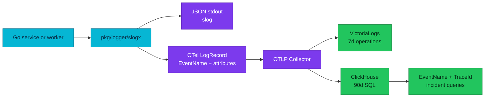

# RFC-0031 — Research: cross-signal telemetry standard and ClickHouse operations

| | |
|---|---|
| **RFC** | RFC-0031 |
| **Status** | researching → gate passed with provisional RFC |
| **Scope** | platform-wide |
| **Created** | 2026-09-16 |
| **Last updated** | 2026-09-17 |

## Problem statement

### Real-world trigger

| | |
|---|---|
| **Situation** | An on-call engineer investigating a failed checkout must infer event type from a human message and query different legacy HTTP and gRPC fields. |
| **Who feels it** | Service owners, on-call engineers, platform engineers, and security reviewers. |
| **Why now** | The ClickHouse store now keeps 90 days of OTLP logs and traces, so an inconsistent application contract has become a long-lived operational cost. |
| **If we do nothing** | Queries, dashboards, retention analysis, redaction, and trace correlation remain service-specific and fragile. |

> **In plain terms:** the fleet has an OTLP transport, but it does not yet have one reliable language for saying what happened.

### What the audit proves

- Application metrics correctly use VictoriaMetrics, but two seconds histograms lack operation-specific boundaries and the fleet pins three obsx versions.
- All ten services and both worker modes enable shared Pyroscope profiling; the contract lacks a release gate for profile coverage, label bounds and runtime overhead.
- The span profile ID is still emitted, but the VictoriaTraces Jaeger datasource cannot provide Grafana's Tempo-only one-click tracesToProfiles link.
- All ten active services pin `zapx v0.36.0`; their `obsx` pins range from `v0.37.0` to `v0.38.0`.
- No active service has a production call site that emits a stable `event` attribute or native OTel `EventName`.
- The current access logger emits legacy `path`, `status`, `duration`, `client_ip`, and `user_agent`; the latter two contradict the API data policy.
- The ClickHouse schema supports native `EventName`, but three local-stack dashboards still read legacy `LogAttributes` access fields — and each is tracked twice, because `dashboards/ClickHouse/` is a byte-identical case-duplicate of `dashboards/clickhouse/` and only the lowercase tree is provisioned. No cluster-provisioned dashboard reads `LogAttributes` at all.
- `docs/api/pkg.md` says `httpmw` is not adopted, while current service mains use it. This is a documentation defect that the audit must correct independently of the target standard.
- `obsx` installs W3C propagation only when tracing is enabled, which couples correlation to export configuration.

## The data model we need

OTel distinguishes a general log record from an event. A non-empty `EventName`
turns a LogRecord into an Event; its name identifies a stable event structure.
It is appropriate for state transitions, outcomes, checkpoints and lifecycle
moments. A span remains the representation of work with a duration. A diagnostic
message remains an unnamed log record.

### Candidate APIs

| Option | Strength | Cost | Result |
|---|---|---|---|
| `pkg/logger/slogx` facade over `slog` plus direct OTel Logs API | One application API on the standard library, no logging dependency added to services, one redaction boundary | OTel Go Logs API is pre-1.0; all call sites migrate | **Recommended** |
| Zap facade over `logger/zapx` plus the same direct OTel Logs API | Much smaller first diff; keeps the adapter every service already pins; reaches EventName by the identical path | Keeps a third-party logging dependency fleet-wide and splits the redaction boundary across adapters | Rejected — the audit recommends it; disagreement carried into the RFC |
| Raw OTel Logs API in every service | Full LogRecord control | Repeats severity, redaction, output and test logic | Rejected |

**Neither official bridge sets EventName.** `otelzap` maps time, message, level and
fields, with the message as `Body`. `otelslog` does the same — time, message, level
and attributes, message as `Body`. So EventName is **not** a differentiator between
Zap and slog; it is reached only by calling the OTel Logs API directly, which either
facade can do. The choice therefore rests on dependency surface and on having one
redaction implementation rather than one per adapter, not on conformance.

The facade isolates the unstable OTel Logs API (`go.opentelemetry.io/otel/log v0.20.0`) inside `pkg`. Services receive a stable context-first API. `slogx.Event` sets native `LogRecord.EventName`; `Debug`/`Info`/`Warn`/`Error` create diagnostic records without pretending every line is an event.

## Proposed contract to validate in RFC review

| Concern | Target rule |
|---|---|
| Event identity | Lowercase, dot-separated `EventName`; no variable values in names. `payment.authorization.failed`, not `payment.failed.123`. |
| Body | Short display message only; no identifiers, secrets, request bodies, or parsing contract. |
| Attributes | Use OTel semantic conventions first. Domain attributes are dot-namespaced, typed, documented, and only added when operationally justified. |
| Access records | Use current pinned OTel HTTP/RPC semantic keys and explicit duration unit; do not emit IP, full User-Agent, raw path, or peer address. |
| Errors | One boundary logs the final decision. Use `error.type`; unexpected errors may carry safe exception data and a bounded stack trace. |
| Resources | Every process has service name/version, environment, namespace and pod where available. Kubernetes enrichment belongs in the platform, not application business code. |
| Redaction | Deny sensitive names recursively before both stdout and OTLP. Redaction is tested, not a convention. |
| Correlation | W3C `traceparent` and baggage are installed independently of exporter switches. Trace and span IDs are native LogRecord fields. |
| Metrics | IDs never become labels; named business histograms require explicit boundaries or an approved View. |
| Profiling | Direct push to Pyroscope, a closed resource-label allowlist, centrally owned runtime sampling and a non-critical failure policy. |

## Current migration surface

| Surface | Evidence | Required migration |
|---|---|---|
| Logger setup | `pkg/logger/zapx` and `pkg/obsx` use Zap plus `otelzap` | Replace with `slogx`; remove bridge-only context fields. |
| HTTP access | `pkg/httpmw/logging.go` | Emit canonical HTTP attributes; remove client IP and User-Agent. |
| gRPC access | `pkg/grpcx/logging.go` | Emit canonical RPC attributes; remove peer address. |
| Workers | Order saga uses Temporal replay-safe logger; checkout worker emits Zap logs | Introduce replay-safe workflow adapter and context-first activity logger. |
| Dashboards | Local ClickHouse explorers query legacy `path`, `status`, `code`, `duration` | Switch SQL, panels, variables and trace-log views to canonical fields and EventName. The platform logging guides also query `LogAttributes['status']`, but those examples filter the **Envoy edge** stream where that key is current — they are out of scope for an application cutover. |
| Contracts | `docs/api/logs.md` names legacy `event`; `docs/api/pkg.md` has stale httpmw adoption state | Rewrite as planned target only after implementation evidence; separately correct current facts. |
| Metrics | VictoriaMetrics receives OTel application metrics; two business seconds histograms rely on generic defaults | Preserve the backend; enforce ownership, unit, bucket, cardinality and replay contracts. |
| Profiling | Shared profiling runs fleet-wide; profile labels depend on uneven service.version, and trace pivot is manual | Preserve Pyroscope; add label, overhead, lifecycle, coverage and correlation gates. |

## Validation plan

1. Unit-test EventName, severity, resource fields, W3C propagation with export disabled, recursive redaction, error metadata, attribute limits and bounded shutdown.
2. Contract-test HTTP, gRPC and Temporal records from source through the Collector into a disposable ClickHouse schema pinned to the Collector version.
3. Prove VictoriaMetrics receives bounded application series and meaningful histogram distributions without replay overcount.
4. Prove Pyroscope receives the expected profile types for every service and worker identity with only approved labels.
5. Prove dashboards query native EventName and canonical attributes with no reference to legacy access keys.
6. Run full Compose and Kind E2E audit: browser checkout, HTTP, gRPC, Temporal activity, expected business rejection, dependency failure and all supported signal pivots.

## Full-fleet remediation matrix

This matrix is the implementation boundary for the proposed full cutover. It
does not authorize implementation; it makes the review and later acceptance
criteria concrete.

| Surface | Audited state | Required change | Evidence before rollout |
|---|---|---|---|
| user-service | 54 logging call sites; no stable event | Replace Zap calls and HTTP access contract with slogx | Event, redaction and HTTP-contract tests |
| product-service | 111 logging call sites; HTTP and gRPC client paths | Replace logger and preserve client trace context | HTTP/gRPC correlation test |
| inventory-service | 56 logging call sites; gRPC entry path | Replace gRPC access record and domain events | RPC-record contract test |
| cart-service | 59 logging call sites; HTTP and gRPC paths | Replace access records and domain events | HTTP/RPC contract test |
| order-service and worker | 319 logging call sites; Temporal workflow logger | Add replay-safe workflow adapter and context-first activity events | Replay, activity and trace-correlation test |
| review-service | 50 logging call sites | Replace HTTP access record and domain events | HTTP-contract test |
| shipping-service | 51 logging call sites | Replace HTTP/gRPC records and domain events | HTTP/RPC contract test |
| notification-service | 60 logging call sites | Replace consumer and domain-event records | Consumer correlation and redaction test |
| payment-service and mockpay | 109 logging call sites | Replace payment outcome records and mock-provider logs | Provider failure and safe-error test |
| checkout-service and worker | 91 logging call sites | Replace checkout records and worker events | Checkout workflow and correlation test |
| pkg/obsx and logger packages | Zap and otelzap cannot set native EventName; propagator installation is conditional | Add slogx, remove bridge, install W3C independently of export | Package unit and integration tests |
| API ResourceSets and worker manifests | API services lack a uniform version source; workers use build metadata | Set a consistent service-version contract | Resource-record assertions |
| ClickHouse, Grafana and documentation | Three local-stack dashboards query legacy access attributes, each tracked twice under a case-duplicated directory | Move SQL, panels, examples and runbooks to EventName and canonical attributes, and delete the duplicate `dashboards/ClickHouse/` tree in the same change | Query regression suite and rendered dashboard review |
| VictoriaMetrics and metric catalog | Two seconds histograms use generic defaults; obsx pins differ | Converge shared Views/version and approve boundaries, attributes and replay semantics | Series/cardinality and p50/p95/p99 query tests |
| Pyroscope and profiling clients | Shared helper runs in ten services and both workers; API versions are missing; trace pivot is manual | Enforce four-label allowlist, version identity, runtime-cost ownership and documented pivot | Profile coverage, label and failure-path tests |

## docs/api contract review

The target treats telemetry as one cross-signal application contract. The
following docs/api rules constrain the RFC:

| API source | Rule carried into RFC-0031 |
|---|---|
| README.md | docs/api remains the as-built source; RFC target text moves there only after verified implementation |
| observability.md | One bootstrap, SemConv v1.41.0, shared Views, W3C, probe filtering and boundary-owned errors |
| logs.md | One access summary, structured data safety and final-decision error ownership |
| metrics.md | VictoriaMetrics is the application store; automatic RED/USE is not duplicated; IDs are forbidden labels; replay semantics and explicit business buckets are required |
| tracing.md | ParentBased W3C propagation, meaningful spans/events and replay-safe Temporal instrumentation |
| profiling.md | Shared Pyroscope push, ten profile types, a closed low-cardinality label policy and non-critical failure behavior |
| temporal.md and workflows.md | Deterministic workflow code, idempotent activities, compensation, pinned workers and no telemetry side effects on replay |
| graceful-shutdown.md | Readiness/work drain precedes bounded telemetry and profiler shutdown |

## Alternatives and trade-offs

The selected approach makes the current application logger API a deliberate
platform interface. This is a larger one-time fleet migration than preserving
Zap, and the OTel Go Logs API has not reached v1.0. It buys a single redaction
boundary and a native EventName that the existing otelzap mapping cannot set.

Keeping legacy fields or dual-writing them would make partial deployment easier,
but would perpetuate two query contracts and hide incomplete migrations. The
owner has selected a full cutover, so deployment is gated on all services,
workers, dashboards, and runbooks being converted together.

### How the wider industry splits events from logs

Three independent bodies of practice were reviewed before fixing the record model.
They agree on the split and disagree about how widely to enforce a schema, which is
what shaped the sizing of the event catalog.

**Wide, canonical records.** Large-scale service operators converged on emitting one
structured record per unit of work, with every field the investigation needs already
attached, rather than several narrow lines joined afterwards on a request ID. The
practice also warns that field names become muscle memory for on-call, so their
stability matters more than their elegance. This is the pattern the access record
follows here.

**Schema enforcement has a cost.** Operators of very large fleets report that
forcing a rigid schema onto ordinary service logs slows developers down and produces
field-name and type collisions, because log shape evolves organically across many
authors. Their workable line is to reserve a strict, reviewed schema for business
events with well-defined structures and leave diagnostic logging loose. That is why
the catalog in this RFC is deliberately small and the diagnostic path is
schema-free.

**Vendor guidance is directional, not normative.** The observability-vendor
comparison that prompted this review recommends events for specific structured
occurrences and logs for broader context, and is explicit that the two complement
each other rather than events replacing logs. It stops at the conceptual level: it
demonstrates span events and an older Events API model, never discusses the current
top-level `LogRecord.EventName`, and its examples include client IP, User-Agent and
raw identity attributes that this platform's data policy forbids. It is therefore
useful as operational rationale and is not the event definition for this RFC.

The normative definition comes from the OTel Logs Data Model and the event semantic
conventions: work with a duration and meaningful boundaries belongs in a span,
properties describing an operation as a whole belong in span attributes,
unstructured diagnostic text belongs in a plain log record, and an event earns a
name when something happens at a point in time — particularly when it can recur
inside one span or needs its own timestamp, severity and attributes.

## References

- [OTel Logs Data Model](https://opentelemetry.io/docs/specs/otel/logs/data-model/)
- [OTel event semantic conventions](https://opentelemetry.io/docs/specs/semconv/general/events/)
- [OTel naming guidance](https://opentelemetry.io/docs/specs/semconv/general/naming/)
- [OTel Metrics Data Model](https://opentelemetry.io/docs/specs/otel/metrics/data-model/)
- [Grafana Pyroscope documentation](https://grafana.com/docs/pyroscope/latest/)
- [OTel Go log API](https://pkg.go.dev/go.opentelemetry.io/otel/log)
- [OTel Go slog bridge](https://pkg.go.dev/go.opentelemetry.io/contrib/bridges/otelslog)
- [OTel Go zap bridge](https://pkg.go.dev/go.opentelemetry.io/contrib/bridges/otelzap)

## Context7 audit log

The first pass recorded Context7 as unavailable and passed the gate on an
official-source fallback. It was rerun on 2026-09-17, and the rerun changed three
normative statements, so the earlier note is superseded rather than merely
supplemented.

| Library ID | Query | Result and disposition |
|------------|-------|------------------------|
| `/open-telemetry/semantic-conventions` | RPC attribute names for gRPC server spans | **Changed the contract.** `rpc.response.status_code` is deprecated and replaced by `rpc.status_code`, which is *required* for gRPC server spans; `rpc.service` is deprecated in favour of a fully-qualified `rpc.method`. `rpc.system.name` confirmed correct. The canonical-attributes table was wrong and is fixed. |
| `/open-telemetry/semantic-conventions` | `event.name` status; when to define an event | **Reshaped the record model.** The `event.name` attribute is deprecated in favour of the `EventName` field, confirming the direction — but the guidance on *when* to name an event is narrow: duration plus boundaries means span, operation-wide properties mean span attributes, unstructured text means a plain log record. |
| `/websites/pkg_go_dev_go_opentelemetry_io_contrib_bridges_otelzap` | Does the Zap bridge set EventName? | Confirmed it does not: time, message as `Body`, level to severity, fields to attributes. Version constant `0.19.0` matches the fleet pin. |
| `/websites/pkg_go_dev_go_opentelemetry_io_contrib` | Does the slog bridge set EventName? | **Removed the stated rationale for the migration.** `otelslog` maps time, message, level and attributes with the message as `Body` — identical to `otelzap`, and it does not set EventName either. |
| `/open-telemetry/opentelemetry-go` | Logs API `EventName` accessors | Confirmed `Record.EventName()` / `Record.SetEventName()` exist, so the field is reachable from the API alone, without the SDK. |
| `/grafana/pyroscope-go` | Declared profile types; `Stop` semantics | **Changed the profiling contract.** The SDK declares eleven `ProfileType` constants, not ten — `goroutine_leak` is the extra one — so the closed set now states its exclusion explicitly. `Stop()` takes no context at all and always returns nil, which is stricter than "does not honor its context". |
| `/websites/grafana_grafana` | Does a Jaeger-type datasource support `tracesToProfiles`? | Conclusion held. The Jaeger datasource configure reference documents `tracesToLogsV2`, `tracesToMetrics`, `nodeGraph`, `traceIdTimeParams` and `spanBar` and no profiles link, while `tracesToProfiles` is documented under Tempo. Note the trace-integration overview page states the feature is available for Tempo, Jaeger and Zipkin, so a reviewer may meet a contradiction; the datasource reference is the one that matches deployed behaviour. |
| `/websites/opentelemetry_io` | Profiling signal maturity | Confirmed OTLP is stable for traces, metrics and logs while **profiles remain in development** (`/v1development/profiles`). There is therefore no stable OTel profiling convention to conform to, which supports keeping the direct Pyroscope path rather than treating it as debt. |

## Research review gate

- [x] Real problem and affected operators described
- [x] Current manifests, Collector, schema, dashboards, `docs/api`, `pkg`, services and workers inspected
- [x] Alternatives and selected direction record costs as well as benefits
- [x] Authoritative-source audit complete; Context7 rerun 2026-09-17 and logged above
- [x] Full per-service remediation matrix complete
- [x] Owner says **ready for RFC**
