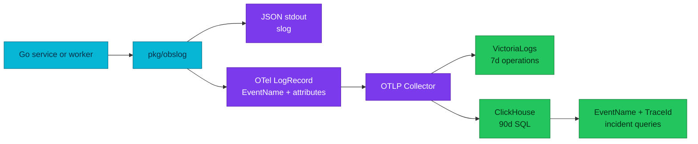

# RFC-0031 — Research: OTel-native telemetry standard and ClickHouse operations

| | |
|---|---|
| **RFC** | RFC-0031 |
| **Status** | researching |
| **Scope** | platform-wide |
| **Created** | 2026-09-16 |
| **Last updated** | 2026-09-16 |

## Problem statement

### Real-world trigger

| | |
|---|---|
| **Situation** | An on-call engineer investigating a failed checkout must infer event type from a human message and query different legacy HTTP and gRPC fields. |
| **Who feels it** | Service owners, on-call engineers, platform engineers, and security reviewers. |
| **Why now** | The ClickHouse store now keeps 90 days of OTLP logs and traces, so an inconsistent application contract has become a long-lived operational cost. |
| **If we do nothing** | Queries, dashboards, retention analysis, redaction, and trace correlation remain service-specific and fragile. |

> **In plain terms:** the fleet has an OTLP transport, but it does not yet have one reliable language for saying what happened.

### What the audit proves

- All ten active services pin `zapx v0.36.0`; their `obsx` pins range from `v0.37.0` to `v0.38.0`.
- No active service has a production call site that emits a stable `event` attribute or native OTel `EventName`.
- The current access logger emits legacy `path`, `status`, `duration`, `client_ip`, and `user_agent`; the latter two contradict the API data policy.
- The ClickHouse schema supports native `EventName`, but six shipped dashboard/document queries still read legacy `LogAttributes` fields.
- `docs/api/pkg.md` says `httpmw` is not adopted, while current service mains use it. This is a documentation defect that the audit must correct independently of the target standard.
- `obsx` installs W3C propagation only when tracing is enabled, which couples correlation to export configuration.

## The data model we need

OTel distinguishes a general log record from an event. A non-empty `EventName`
turns a LogRecord into an Event; its name identifies a stable event structure.
It is appropriate for state transitions, outcomes, checkpoints and lifecycle
moments. A span remains the representation of work with a duration. A diagnostic
message remains an unnamed log record.

### Candidate APIs

| Option | Strength | Cost | Result |
|---|---|---|---|
| `pkg/obslog` facade over `slog` plus direct OTel Logs API | One application API, standard JSON logging, native EventName, one redaction boundary | OTel Go Logs API is pre-1.0; all call sites migrate | **Recommended** |
| Custom Zap facade | Smaller first diff | Still requires a second direct-OTel path for EventName and retains Zap | Rejected |
| Raw OTel Logs API in every service | Full LogRecord control | Repeats severity, redaction, output and test logic | Rejected |

The facade isolates the unstable OTel Logs API (`go.opentelemetry.io/otel/log v0.20.0`) inside `pkg`. Services receive a stable context-first API. `obslog.Event` sets native `LogRecord.EventName`; `Debug`/`Info`/`Warn`/`Error` create diagnostic records without pretending every line is an event.

## Proposed contract to validate in RFC review

| Concern | Target rule |
|---|---|
| Event identity | Lowercase, dot-separated `EventName`; no variable values in names. `payment.authorization.failed`, not `payment.failed.123`. |
| Body | Short display message only; no identifiers, secrets, request bodies, or parsing contract. |
| Attributes | Use OTel semantic conventions first. Domain attributes are dot-namespaced, typed, documented, and only added when operationally justified. |
| Access records | Use current pinned OTel HTTP/RPC semantic keys and explicit duration unit; do not emit IP, full User-Agent, raw path, or peer address. |
| Errors | One boundary logs the final decision. Use `error.type`; unexpected errors may carry safe exception data and a bounded stack trace. |
| Resources | Every process has service name/version, environment, namespace and pod where available. Kubernetes enrichment belongs in the platform, not application business code. |
| Redaction | Deny sensitive names recursively before both stdout and OTLP. Redaction is tested, not a convention. |
| Correlation | W3C `traceparent` and baggage are installed independently of exporter switches. Trace and span IDs are native LogRecord fields. |
| Metrics | IDs never become labels; named business histograms require explicit boundaries or an approved View. |

## Current migration surface

| Surface | Evidence | Required migration |
|---|---|---|
| Logger setup | `pkg/logger/zapx` and `pkg/obsx` use Zap plus `otelzap` | Replace with `obslog`; remove bridge-only context fields. |
| HTTP access | `pkg/httpmw/logging.go` | Emit canonical HTTP attributes; remove client IP and User-Agent. |
| gRPC access | `pkg/grpcx/logging.go` | Emit canonical RPC attributes; remove peer address. |
| Workers | Order saga uses Temporal replay-safe logger; checkout worker emits Zap logs | Introduce replay-safe workflow adapter and context-first activity logger. |
| Dashboards | Local ClickHouse explorers query legacy `path`, `status`, `code`, `duration` | Switch SQL, panels, variables and trace-log views to canonical fields and EventName. |
| Contracts | `docs/api/logs.md` names legacy `event`; `docs/api/pkg.md` has stale httpmw adoption state | Rewrite as planned target only after implementation evidence; separately correct current facts. |

## Validation plan

1. Unit-test EventName, severity, resource fields, W3C propagation with export disabled, recursive redaction, error metadata, attribute limits and bounded shutdown.
2. Contract-test HTTP, gRPC and Temporal records from source through the Collector into a disposable ClickHouse schema pinned to the Collector version.
3. Prove dashboards query native EventName and canonical attributes with no reference to legacy access keys.
4. Run full Compose and Kind E2E audit: browser checkout, HTTP, gRPC, Temporal activity, expected business rejection, dependency failure, trace-to-log query and log-to-trace query.

## Full-fleet remediation matrix

This matrix is the implementation boundary for the proposed full cutover. It
does not authorize implementation; it makes the review and later acceptance
criteria concrete.

| Surface | Audited state | Required change | Evidence before rollout |
|---|---|---|---|
| user-service | 54 logging call sites; no stable event | Replace Zap calls and HTTP access contract with obslog | Event, redaction and HTTP-contract tests |
| product-service | 111 logging call sites; HTTP and gRPC client paths | Replace logger and preserve client trace context | HTTP/gRPC correlation test |
| inventory-service | 56 logging call sites; gRPC entry path | Replace gRPC access record and domain events | RPC-record contract test |
| cart-service | 59 logging call sites; HTTP and gRPC paths | Replace access records and domain events | HTTP/RPC contract test |
| order-service and worker | 319 logging call sites; Temporal workflow logger | Add replay-safe workflow adapter and context-first activity events | Replay, activity and trace-correlation test |
| review-service | 50 logging call sites | Replace HTTP access record and domain events | HTTP-contract test |
| shipping-service | 51 logging call sites | Replace HTTP/gRPC records and domain events | HTTP/RPC contract test |
| notification-service | 60 logging call sites | Replace consumer and domain-event records | Consumer correlation and redaction test |
| payment-service and mockpay | 109 logging call sites | Replace payment outcome records and mock-provider logs | Provider failure and safe-error test |
| checkout-service and worker | 91 logging call sites | Replace checkout records and worker events | Checkout workflow and correlation test |
| pkg/obsx and logger packages | Zap and otelzap cannot set native EventName; propagator installation is conditional | Add obslog, remove bridge, install W3C independently of export | Package unit and integration tests |
| API ResourceSets and worker manifests | API services lack a uniform version source; workers use build metadata | Set a consistent service-version contract | Resource-record assertions |
| ClickHouse, Grafana and documentation | Three dashboards and three documents query legacy access attributes | Move SQL, panels, examples and runbooks to EventName and canonical attributes | Query regression suite and rendered dashboard review |

## Alternatives and trade-offs

The selected approach makes the current application logger API a deliberate
platform interface. This is a larger one-time fleet migration than preserving
Zap, and the OTel Go Logs API has not reached v1.0. It buys a single redaction
boundary and a native EventName that the existing otelzap mapping cannot set.

Keeping legacy fields or dual-writing them would make partial deployment easier,
but would perpetuate two query contracts and hide incomplete migrations. The
owner has selected a full cutover, so deployment is gated on all services,
workers, dashboards, and runbooks being converted together.

## References

- [OTel Logs Data Model](https://opentelemetry.io/docs/specs/otel/logs/data-model/)
- [OTel event semantic conventions](https://opentelemetry.io/docs/specs/semconv/general/events/)
- [OTel naming guidance](https://opentelemetry.io/docs/specs/semconv/general/naming/)
- [OTel Metrics Data Model](https://opentelemetry.io/docs/specs/otel/metrics/data-model/)
- [OTel Go log API](https://pkg.go.dev/go.opentelemetry.io/otel/log)
- [Google: Building Secure and Reliable Systems, logging and tracing](https://google.github.io/building-secure-and-reliable-systems/raw/ch15.html)
- [Datadog: cross-product correlation](https://docs.datadoghq.com/logs/guide/ease-troubleshooting-with-cross-product-correlation/)

## Context7 audit log

Context7 is not available in this session. Per owner direction, the gate uses
the available authoritative fallback: version-pinned local source for otelzap
v0.19.0, official OTel specifications and Go API references, plus the cited
Google and Datadog operational guidance. A later Context7 run remains useful as
a dependency refresh, but is not a blocker for this RFC.

## Research review gate

- [x] Real problem and affected operators described
- [x] Current manifests, Collector, schema, dashboards, `docs/api`, `pkg`, services and workers inspected
- [x] Alternatives and selected direction record costs as well as benefits
- [x] Authoritative-source audit complete; Context7 unavailable, official-source fallback recorded
- [x] Full per-service remediation matrix complete
- [x] Owner says **ready for RFC**
