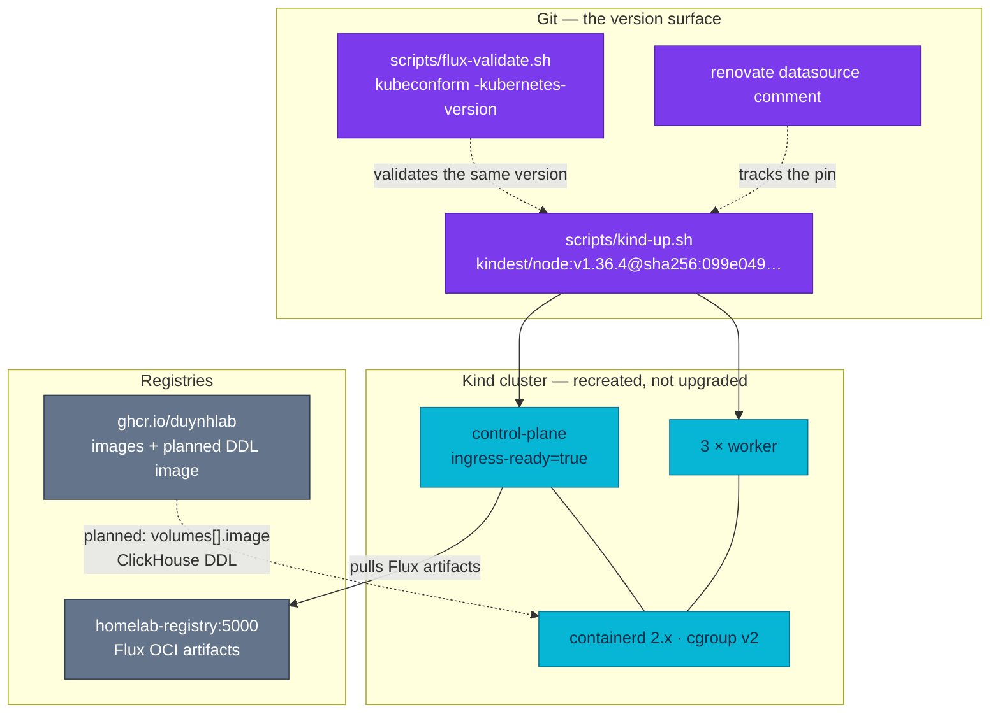

# RFC-0032 Move the Kind baseline to Kubernetes 1.36

| Status | Scope | Research | Created | Last updated |
|--------|-------|----------|---------|--------------|
| provisional | infra | [./research.md](./research.md) — gate passed 2026-09-22 | 2026-09-22 | 2026-09-22 |

> **Don't forget: every decision is a tradeoff.** The cost of this one is named
> in the Summary rather than buried: the platform will run a Kyverno/Kubernetes
> pairing that Kyverno does not test, and the only thing standing in for the
> vendor's matrix is a gate run on a cluster built from scratch.

## Prerequisites

- [x] [./research.md](./research.md) merged; [research review gate](./research.md#research-review-gate) ticked 2026-09-22
- [x] Context7 audit complete (see research § Context7 audit log)
- [x] Owner approved **ready for RFC** (2026-09-22, in-session)
- Mechanism deep-dive lives in [./research.md](./research.md) — this file only decides
- **Prerequisite change, owned outside this RFC:** Kyverno 1.18.2 → 1.19.x on the
  current 1.34 baseline, shipped as its own reversible change. This RFC gates on
  it; it does not deliver it.
- When Status → **`Accepted`**: one ADR is expected, `ADR-077` (image volumes as
  the schema-delivery mechanism), created at `Proposed` with this review.
  `docs/api/`: N/A — no service contract touches the cluster version.
  **Platform docs that MUST move at implementation** (infra-only ≠ docs-free):
  - `docs/platform/kyverno.md` — the two "the cluster runs Kind v1.34.3" lines,
    including the VAP availability note
  - `docs/security/network-policies.md` — four statements plus a Mermaid edge
    label carrying `K8s 1.34.3`
  - `docs/api/caching.md` — the "kindnet (Kind K8s 1.34+)" enforcement note
  - `docs/databases/extensions.md` and
    `docs/observability/metrics/postgresql/custom-metrics.md` — the "needs
    K8s ≥ 1.35" prerequisite becomes satisfied, not hypothetical
  - `docs/databases/reference/zalando/endpoints-to-configmaps.md` — its
    `CLUSTER_VERSION=v1.34.3` upgrade snippet
  - the `# NOTE: kindnet … Kind K8s 1.34+` headers across
    `kubernetes/infra/configs/network-policies/*.yaml`
  - CHANGELOG, as always. Dated audit records and shipped RFC evidence
    (`docs/observability/clickhouse/audits/`, RFC-0010's verification line) stay
    frozen — they record what was true then.

## Summary

The local Kind baseline moves from **Kubernetes 1.34.3 to 1.36.4**, pinned by
digest, as a cluster recreation rather than an upgrade. The move is taken
**before** any Kyverno release lists Kubernetes 1.36: that unsupported pairing
is an explicit, recorded acceptance, justified because the cluster is disposable
and evidenced by the complete Kind release audit rather than by a vendor matrix.
No feature gate is enabled and no new Kubernetes feature is adopted in the
version change itself. A second, separable phase adopts exactly one 1.36
feature — **OCI image volumes** — to deliver the ClickHouse DDL payload, which
also removes the manual `kubectl delete job` step that editing that DDL requires
today. Every other 1.35/1.36 feature is evaluated here and explicitly deferred
or rejected.

## Motivation

Kubernetes 1.34 reaches **end of life on 2026-10-27**, five weeks from this
RFC's date, and the cluster it pins is where the E2E release audit runs
([ADR-046](../../adr/ADR-046-e2e-gate-kind-fallback/)) and where the k6
assertion layer asserts it ([ADR-056](../../adr/ADR-056-k6-e2e-assertion-layer/)).
A gate that runs on an unsupported control plane is worth less than the report
it prints. The installed `kubectl` is already `v1.37.0`, three minors ahead of
the server and outside the supported skew, so the client used to inspect the
cluster is unsupported *today*; at 1.36 it is +1 and supported.

This is deliberately not filed as a dependency bump. The last `kindest/node`
change in this repo shipped as a plain CHANGELOG line, and correctly so — it was
a patch inside a supported minor. This change carries a full cluster rebuild, an
acceptance of an untested policy-engine pairing, a documentation sweep across
roughly fourteen files, and a decision about which parts of two Kubernetes
releases to take. Those need a record.

There is also a return, already written down elsewhere:
[RFC-0030](../RFC-0030/research.md) deferred its ImageVolume delivery path
*because* the baseline is 1.34, and
[`docs/databases/extensions.md`](../../../databases/extensions.md) records
CNPG's declarative extensions as blocked on Kubernetes ≥ 1.35. Both prerequisites
are met at 1.36.

### Goals

- Leave the 1.34 support window **before** 2026-10-27, on a supported release
  (1.36 is supported until 2027-06-28).
- Make the baseline **reproducible**: a digest, not a tag, and a Kind CLI floor
  the tooling actually checks.
- Restore a supported `kubectl` skew.
- Prove the untested Kyverno pairing with evidence that would convince a
  reviewer who did not run it — the full admission surface, not a pod listing.
- Decide, once and in writing, which 1.35/1.36 features this platform takes and
  which it does not, so the question is not reopened per feature.
- Adopt exactly one of them, where it solves an already-documented problem.

### Non-Goals

- **Any in-place control-plane upgrade.** There is none; the cluster is deleted
  and recreated.
- **The Kyverno CEL policy migration.** Kyverno 1.20 removing the legacy APIs is
  what forces that, not Kubernetes. It gets its own record.
- **Enabling any feature gate**, alpha or otherwise, in the version change.
- **Production.** This repository pins no production Kubernetes version, and
  [RFC-0011](../RFC-0011/) (Kind → bare-metal Talos) remains the record that
  would change that. This RFC keeps the disposable cluster current; it neither
  competes with RFC-0011 nor depends on it.
- **Re-pinning the twelve floating Helm ranges.** Named here as a known source
  of confusing gate failures, addressed separately.

## Proposal

### Phase 1 — the baseline (no feature adoption)

1. Replace the version-only variable in `scripts/kind-up.sh` with a full,
   digest-pinned node reference, so the script carries tag **and** digest:

   ```text
   kindest/node:v1.36.4@sha256:099e049362a1526b2db71494e1947aae99bd16290d7c895f2b7ea312e3cbfaed
   ```

2. Document and assert a **Kind CLI floor of `v0.33.0`** — `make prereqs` checks
   that the tool exists, not that it is new enough to handle the node image.
3. Thread the same version into **kubeconform**. `scripts/flux-validate.sh` never
   passes `-kubernetes-version`, so CI validates against the default `master`
   schema set — neither the version the cluster runs today nor the one it will
   run. One variable, two consumers.
4. Add a **Renovate datasource comment** to `scripts/kind-up.sh`. Renovate
   manages `kubernetes/**` but has never seen this file, which is why the pin
   ages silently.
5. Delete and recreate the cluster, then run the gate in
   [Testing / verification](#testing--verification). Adopt **no** new feature.

Sequenced after the Kyverno 1.18.2 → 1.19.x prerequisite so that a red gate has
one plausible cause rather than two.

### Feature evaluation — 1.35 and 1.36

The verdicts below are the decision this RFC is asking for, alongside the bump.
Evidence and maturity sourcing are in
[research § Feature survey](./research.md#feature-survey-135-and-136).

| Feature | Maturity | Verdict |
|---|---|---|
| **OCI image / artifact volumes** | 1.36 stable | **Adopt — Phase 2.** The only feature with an already-written-down problem to solve here |
| In-place Pod CPU/memory resize | 1.35 stable | **Candidate, own record.** Directly relevant — this platform has already spent a gate cycle on a CPU limit that could only be corrected by a rollout — but adopting it means setting `resizePolicy` on the fleet, which is a `mop` chart change |
| PSI metrics on cgroup v2 | 1.36 stable | **Candidate, own record.** `container_pressure_*_seconds_total` appear on `/metrics/cadvisor` with no action; turning them into panels and alerts is the actual work, and it needs the series observed first |
| User namespaces (`hostUsers: false`) | 1.36 stable | **Deferred.** Does not make a root process non-root for PSS, so it does not revive `pss-restricted-apps` on its own; needs idmap-capable node filesystems; and it **cannot be combined with image volumes** on containerd |
| MutatingAdmissionPolicy | 1.36 stable | **Rejected for now.** No deployed Kyverno policy has a `mutate:` rule, so it replaces nothing. Revisit with the Kyverno CEL migration, not here |
| VolumeGroupSnapshot | 1.36 stable | **Rejected.** CloudNativePG 1.30 does not consume the API and Kind has no CSI driver to back it |
| Fine-grained kubelet API authorization | 1.36 stable | **Guardrail, not a migration.** No broad `nodes/proxy` grant exists here |
| Strict IP/CIDR validation | 1.36 beta, on | **Not an adoption — a watch item.** Malformed addresses 1.34 accepted may now be rejected in built-in kinds; custom resources are excluded, which is where most of this platform's addressing lives |
| Node log query · mutable CSI attach limits · external SA token signing · faster SELinux relabeling · mixed-version proxy | 1.36 | **Rejected.** Each solves a problem a single-control-plane, four-node disposable cluster does not have |
| Mutable resources for suspended Jobs · controller staleness mitigation · Pod-level in-place scaling | 1.36 beta, on | **Nothing to do.** Behaviour improvements with no configuration surface |
| HPA scale-to-zero on external metrics · native Prometheus histograms · workload-aware scheduling · manifest-based admission · sharded list/watch | 1.36 alpha | **Rejected.** The first two are genuinely interesting given KEDA and VictoriaMetrics; none is worth widening the blast radius of a change whose value is being boring |

### Phase 2 — image volumes for schema delivery

The ClickHouse DDL is five `.sql` keys in a ConfigMap, mounted read-only at
`/sql` into a run-once Job. The Job is immutable and **the pod template does not
change when the DDL does**, so a schema edit requires
`kubectl delete job clickhouse-schema -n monitoring` followed by a reconcile —
written into the manifest's own header as the operating procedure. The schema
also has no version identity: nothing on the cluster says which DDL revision
ran.

Phase 2 replaces the ConfigMap volume source with an image volume pinned by
digest. The payload becomes a versioned artifact, the pod template changes with
it, and the immutable Job re-creates itself for the right reason. The container,
its verification logic, and the `wait: true` Kustomization are untouched.

Two constraints shape the build, both verified in research:

- The payload must be a **real OCI image**, not an `oras`-style artifact.
  containerd unpacks only standard image layer media types; a custom media type
  mounts an empty directory with no error. `duynhlab/wolfi-images` already
  builds declarative images with apko, cosign signatures and crane-read digests
  — that is the supply chain to reuse, not a new Dockerfile per blob.
- **Never pair an image volume with `hostUsers: false`.** containerd cannot
  identity-map the overlayfs mount; the pod fails to start.

Other candidates were considered and are not proposed: the Keycloak realm JSON
(an image volume versions it but the real pain is one-shot import), the OpenBAO
bootstrap script (plausible, but `defaultMode: 0755` has no equivalent), CNPG
declarative extensions (the genuine second unlock, needing PostgreSQL 18 and its
own design), CNPG monitoring queries and VictoriaMetrics rules (the operator
APIs take a ConfigMap reference, not a volume), the Grafana dashboards (the
operator's own `spec.oci` is the right tool and is already proven in-repo), and
the per-service migrations (`go:embed` already ships SQL and binary as one
version — splitting them would re-introduce the skew that solved).

### Alternatives

Full plain-language analysis in
[research § Alternatives](./research.md#alternatives). The decision-level shape:
going to 1.36 now trades an upstream-tested policy pairing for a single cluster
recreation and a supported runway to 2027-06-28; every other path either pays
for the same work twice, runs past EOL on purpose, or lands on the
least-exercised control plane available.

## Other solutions considered

| Option | Shape | Why not chosen |
|--------|-------|----------------|
| `bridge-1.35` | 1.34 → 1.35.8 now with Kyverno 1.19 (a tested pairing), 1.36 after Kyverno 1.20 | Its safety is smaller than it looks: it still needs the Kyverno 1.19 step first, costs two cluster recreations, and 1.35 is EOL 2027-02-28 — the same work returns within months |
| `wait-for-kyverno-1.20` | Stay on 1.34 until Kyverno 1.20 (est. Nov 2026), then move | Runs past 1.34's EOL by design, and Kyverno 1.20 removes the legacy policy APIs every policy here uses — coupling a Kubernetes move to a full CEL rewrite is the largest change at the worst moment |
| `jump-1.37` | Go straight to 1.37.0, matching Kind 0.33's default image and the installed `kubectl` | Released 2026-08-26, so four weeks of field mileage; equally unsupported by Kyverno; and the controller fleet here is even less likely to have been exercised against it. Recorded as the **next hop**, not the target |
| `stay-on-1.34` | Change nothing | The release gate would run on an EOL control plane with no patch stream, and the `kubectl` skew stays unsupported. Listed so the cost of delay is on the record |
| `oras-artifact-payload` | Ship the DDL as an OCI artifact with a custom media type rather than an image | containerd unpacks only standard image layer media types — the volume mounts **empty**, with no error to debug |
| `keep-configmap-add-hash` | Solve the Job-immutability problem with a `configMapGenerator` name suffix instead of Phase 2 | Would work for re-runs, but changes the ConfigMap name on every edit, gives the schema no portable version identity, and leaves the payload inside the GitOps artifact. Kept as the fallback if Phase 2's gate fails |

## Decision outcome

**Chosen option:** `1.36-now` — move the baseline to `v1.36.4` immediately,
accepting the Kyverno pairing, with `image-volume-clickhouse-ddl` as the single
feature adoption in a separable Phase 2.

**Rationale:** it is the only option that satisfies the first goal — leave 1.34
before 2026-10-27 — in one cluster recreation, and it buys a runway to
2027-06-28 rather than to 2027-02-28. The runner-up is `bridge-1.35`, and the
deciding factor is that its upstream-tested pairing is not free: it still
requires the Kyverno 1.19 upgrade, and then asks for a second full gate cycle
within months for a release that also expires. Since the accepted risk in both
paths is carried by a cluster that can be thrown away and rebuilt from git, the
one that pays for the gate once wins. `wait-for-kyverno-1.20` was rejected for
coupling the Kubernetes move to a rewrite of every policy; `jump-1.37` for
buying runway with the least-tested control plane in the set.

**Decided:** 2026-09-22, owner, in-session — target version, Kyverno risk
acceptance, and the Phase 1/Phase 2 split.

## Architecture & Diagrams

**Target state — what the baseline looks like after Phase 1 and Phase 2.** This
diagram answers one question: which artifacts define the cluster's version and
its bootstrap payloads. The step-by-step recreation sequence is a different
question and lives in
[research § Core mechanism](./research.md#core-mechanism); the Flux dependency
chain is owned by [`docs/platform/setup.md`](../../../platform/setup.md).


Legend: purple = repository artifacts that define the version · cyan = cluster
runtime · grey = registries · dotted edges labelled `planned` = Phase 2, not
built.

## Design Details

**How it is enabled.** By editing one variable in `scripts/kind-up.sh` and
recreating the cluster. There is no runtime toggle: the script skips creation
when a cluster of that name already exists, so a changed pin on a live cluster
does nothing at all. That property is the most common way a version bump reports
success while changing nothing, and the gate's first row exists to catch it.

**Does it change default behaviour?** Yes, in three places worth naming:

- `StrictIPCIDRValidation` is beta and on, so built-in kinds reject malformed IP
  and CIDR values that 1.34 accepted. Custom resources are excluded.
- PSI series appear on `/metrics/cadvisor` without being asked for. They are
  observed during the gate and **not** adopted — no dashboard, no alert, no
  recording rule in this change.
- Twelve Helm references in this repo are ranges rather than pins. A rebuild
  re-resolves them, so a failure after the bump is not automatically the bump's
  fault. `kube-state-metrics` (`>=5.0.0`) is the one that hard-parses API object
  shapes and therefore the first suspect.

**Can it be disabled again?** Rollback is recreation with the previously
recorded 1.34 node image. There is no downgrade of a running control plane or of
etcd state, and none should be attempted.

**How an operator knows it is in use.** Every node reports 1.36.x and a node
image ID matching the recorded digest; `kubectl version` shows a one-minor
client skew instead of three.

**Drawbacks, stated plainly.**

- The platform runs an admission engine on a server version its vendor does not
  test. If Kyverno misbehaves on 1.36, the fallback is a cluster recreation on
  the old image, and the debugging happens with no upstream matrix to appeal to.
- Phase 2 turns a bootstrap payload's availability into a **registry**
  dependency at pod start, where it was an etcd dependency. A pull failure
  blocks container start and is retried with volume backoff.
- Phase 2 also adds a build-and-publish step to a payload that is currently five
  keys in a YAML file. That is the price of the version identity it buys.

## Security considerations

- **Kyverno.** No policy changes and no new `PolicyException`. The admission
  surface must behave identically after the move: six `ClusterPolicy` objects,
  the `ClusterCleanupPolicy`, both `PolicyException`s, the three CLI test
  fixtures, the generated default-deny NetworkPolicies, PolicyReports and the
  alerts over them. Only `disallow-default-namespace` is `Enforce`/`Fail`, so it
  is the one that can block a rebuild outright.
- **CLI drift, present today.** CI pins the Kyverno CLI to `v1.18.2`, matching
  the engine, with the reason written into `flux-validate.sh`: a CLI ahead of the
  engine can agree with itself and disagree with admission. The locally installed
  CLI is already `1.19.1`, so a local `make validate` is not testing what the
  cluster enforces. The Kyverno prerequisite change should close that, not this
  one — but it should not stay unrecorded.
- **An admission blind spot this RFC creates and must close.**
  `disallow-latest-tag` matches `spec.containers[]`, `initContainers` and
  `ephemeralContainers` only. `spec.volumes[].image.reference` is invisible to
  it, so a Phase 2 image volume could legally reference `:latest`. Phase 2 must
  extend that policy and require digest pinning for image-volume references.
- **`pss-baseline` pins `version: latest`.** If a future Pod Security Standards
  revision adds an image-volume control, it lands on this cluster without a
  commit. Left as-is, recorded as known.
- **User namespaces are not a fix for the non-root gap.** `pss-restricted-apps`
  stays disabled until service images ship a non-root `USER` and the `mop` chart
  templates a `securityContext` onto its migrate initContainer.
- **Supply chain.** A Phase 2 payload image is pulled by the kubelet with node
  credentials and the pod's pull secrets — there is no volume-level
  `imagePullSecrets`. It must be a public GHCR package or reachable from
  `homelab-registry`, digest-pinned, and signed on the same path as the other
  images this org builds.

## Observability & SLO impact

No SLO changes and no new alerts in Phase 1. Three things to watch during the
gate:

- **PSI series appear on their own.** Confirm `container_pressure_*` is
  scrapeable, then leave it alone. Turning saturation signals into alerts is its
  own record, and the threshold work needs baseline data this cluster does not
  have yet.
- **API deprecation warnings.** Any warning attributable to a controller this
  repo deploys is a finding, not noise — that is the cheapest early signal that
  a floating chart range resolved badly.
- **Nothing in the existing dashboards should move.** kube-state-metrics is
  unpinned and parses API object shapes; if panels go blank after the rebuild,
  suspect it before suspecting Kubernetes.

Phase 2 adds no metric. Its observable outcome is that the schema Job's pod
template carries a digest, so the running schema version is finally readable off
the cluster.

## Rollout & rollback

Three independently revertible changes, in order:

1. **Kyverno 1.18.2 → 1.19.x** on the current 1.34 baseline (prerequisite, not
   delivered by this RFC). Revert = the previous chart version.
2. **Phase 1 — the baseline.** Digest pin, Kind CLI floor, kubeconform version,
   Renovate comment; cluster deleted and recreated; gate run. Revert = restore
   the recorded 1.34 reference and recreate. Never attempt a downgrade of a
   running control plane.
3. **Phase 2 — image volumes for the ClickHouse DDL.** Revert = restore the
   ConfigMap volume source; the DDL files themselves are unchanged, so the
   fallback is a one-line volume swap plus the usual Job delete.

Blast radius: total for the local cluster, zero elsewhere. This repository pins
no production Kubernetes version, and all local data is disposable by
definition — export any evidence needed before teardown, because there is no
second chance at the pre-upgrade cluster.

## Testing / verification

Phase 1 is ready only when every row passes on a **newly created** cluster.
Counts are re-derived at run time rather than copied from any document.

| Gate | Evidence |
|---|---|
| Static validation | `make validate` passes, now with kubeconform pinned to the target Kubernetes version |
| Cluster is actually new | The named cluster was deleted first; creation was not skipped |
| Version | Every node reports Kubernetes 1.36.x |
| Reproducibility | The node image ID matches the recorded digest on every node |
| Runtime | cgroup v2 on the host and every node; the containerd version is recorded, not assumed |
| Kubeadm conversion | The control-plane node still carries `ingress-ready=true` after Kind translates the unversioned `InitConfiguration` patch |
| Edge plumbing | `extraPortMappings` still reach the pinned NodePorts; local image loading works on the host architecture; `homelab-registry` rejoined the network |
| Flux | Every declared Kustomization reconciles; the dependency chain still gates in the right order — **count them on the cluster**, do not trust a written figure |
| API compatibility | No deprecated-API or validation warning attributable to a controller this repo deploys |
| Policy engine | The selected Kyverno release is recorded together with the explicit acceptance that its matrix does not list 1.36 |
| Admission | Policies, exceptions, CLI tests, generated NetworkPolicies, cleanup, PolicyReports and their alerts all behave as on 1.34; no new rejection |
| Storage | CNPG clusters, PgDog and backup prerequisites healthy |
| Edge | Envoy Gateway, GatewayClass, Gateways, routes and security policies Ready |
| Observability | Metrics, logs, traces, profiles, dashboards and alerts healthy; PSI series observed and left unadopted |
| E2E | The full Kind A/B/C release audit passes, including browser and telemetry phases, with the k6 assertion layer green |

Phase 2 adds: the image resolves and mounts non-empty (the containerd
artifact-vs-image trap fails *silently*, so an explicit "the directory has five
files" assertion is required); the Job completes against a fresh ClickHouse; a
DDL bump changes the pod template and the Job re-creates itself with no manual
delete; and `disallow-latest-tag` rejects an image-volume reference without a
digest once the policy is extended.

## Resulting decisions

| Decision | ADR | Status |
|----------|-----|--------|
| Deliver bootstrap SQL/DDL payloads as digest-pinned OCI image volumes, starting with the ClickHouse schema Job | `ADR-077` — created at architecture review | Proposed |

The Kubernetes version itself is deliberately **not** an ADR: it is a
maintenance position with a support-window expiry, not a durable architectural
choice.

## Implementation History

- 2026-09-22 — opened at `provisional`. Two blockers recorded in earlier local
  research were re-checked and found to be **gone**: Kind `v0.33.0` publishes a
  digest-pinned `v1.36.4` node image (so the "Kind lags the current patch"
  risk is void), and the installed `kubectl v1.37.0` is within skew of a 1.36
  server (so the "use an older client" gate is void). The Kyverno matrix gap is
  the only one that survived re-verification.

## Related

- [./research.md](./research.md) — plain-language research and Context7 audit trail (gate passed 2026-09-22)
- [RFC-0030](../RFC-0030/) — deferred its ImageVolume delivery path because the baseline is 1.34; this RFC removes that blocker
- [RFC-0028](../RFC-0028/) — owns the ClickHouse schema and the Job that Phase 2 changes the volume source of
- [RFC-0011](../RFC-0011/) — Kind → bare-metal Talos; the record that would replace this substrate rather than update it
- [ADR-046](../../adr/ADR-046-e2e-gate-kind-fallback/) — why the Kind cluster is the release gate; [ADR-056](../../adr/ADR-056-k6-e2e-assertion-layer/) — what asserts it
- [`docs/databases/extensions.md`](../../../databases/extensions.md) — CNPG declarative extensions, blocked on Kubernetes ≥ 1.35
- [`docs/platform/setup.md`](../../../platform/setup.md) — the Flux dependency chain the rebuild walks

---
_Last updated: 2026-09-22 — opened at `provisional`: baseline to `kindest/node:v1.36.4` by digest, the Kyverno 1.36 gap accepted explicitly rather than waited out, every 1.35/1.36 feature given a verdict, and OCI image volumes adopted for the ClickHouse DDL as the single Phase 2 deliverable (`ADR-077` at review)._
