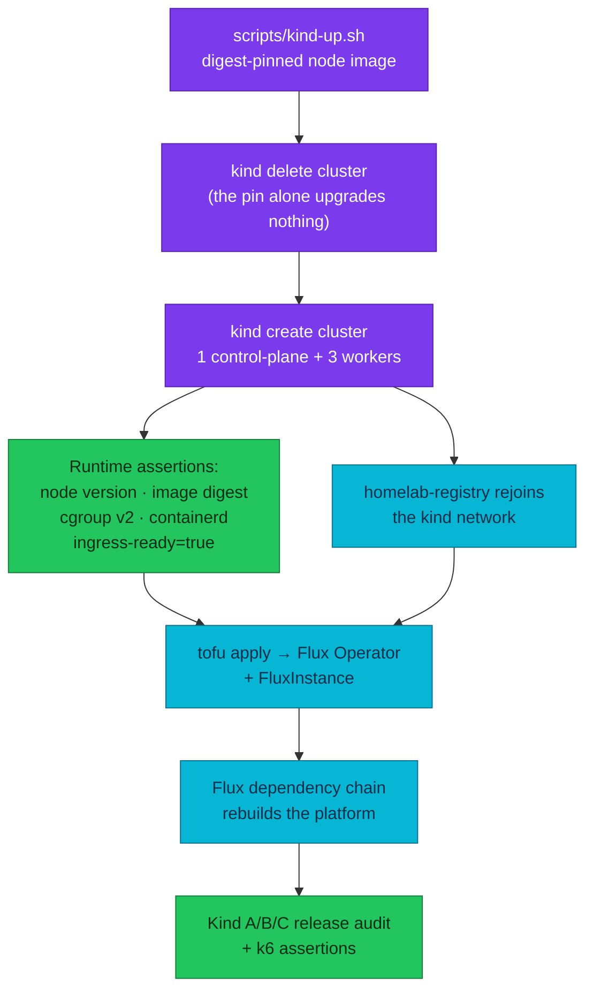
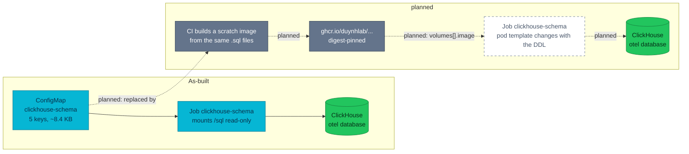

# RFC-0032 — Research: `Kubernetes 1.36 baseline upgrade`

| | |
|---|---|
| **RFC** | RFC-0032 |
| **Status** | researching → gate passed with provisional RFC |
| **Scope** | infra |
| **Created** | 2026-09-22 |
| **Last updated** | 2026-09-22 |

> **Plain-language research.** The subject is unglamorous — one variable in one
> shell script — so the value of this file is not explaining what a version bump
> is. It is separating the three things hiding behind that variable: an expiring
> support window, a policy engine that has not caught up, and a feature surface
> the platform has already deferred work against.
>
> **Start from a real problem.** Kubernetes 1.34 leaves support in five weeks and
> the Kind cluster it pins is the substrate of the release gate. That is an
> on-call-adjacent deadline, not a curiosity.

---

## Table of contents

1. [Problem statement](#problem-statement)
2. [Reading path](#reading-path)
3. [What a Kind baseline upgrade actually is](#what-a-kind-baseline-upgrade-actually-is)
4. [Core components](#core-components)
5. [Core mechanism](#core-mechanism)
6. [Feature survey: 1.35 and 1.36](#feature-survey-135-and-136)
7. [Glossary](#glossary)
8. [Worked examples](#worked-examples)
9. [vs platform as-built](#vs-platform-as-built)
10. [Integration paths](#integration-paths)
11. [Alternatives](#alternatives)
12. [Open questions](#open-questions)
13. [FAQ](#faq)
14. [References](#references)
15. [Context7 audit log](#context7-audit-log)
16. [Research review gate](#research-review-gate)

---

## Problem statement

### Real-world trigger

| | |
|---|---|
| **Situation** | The cluster pin is `v1.34.3` (`scripts/kind-up.sh:6`). Kubernetes 1.34 is in maintenance and reaches end of life on **2026-10-27**. The locally installed `kubectl` is already `v1.37.0` — three minors ahead of the server, outside the supported one-minor skew — so every `kubectl` used against this cluster today is unsupported. |
| **Who feels it** | Platform. The Kind cluster is the E2E release-audit gate ([ADR-046](../../adr/ADR-046-e2e-gate-kind-fallback/)) and the substrate the k6 assertion layer runs against ([ADR-056](../../adr/ADR-056-k6-e2e-assertion-layer/)), so "the gate passed" stops meaning much once the gate runs on an unsupported control plane. |
| **Why now** | A dated support window, not a preference. Five weeks. And the policy engine has *not* caught up: no Kyverno release lists Kubernetes 1.36, so the bump cannot be done quietly as a dependency bump — somebody has to accept a pairing upstream does not test. |
| **If we do nothing** | The gate runs on an EOL control plane with no patch stream; the `kubectl` skew stays unsupported and silently wrong; and every piece of work already deferred *because* the baseline is 1.34 — CNPG declarative extensions ([`docs/databases/extensions.md`](../../../databases/extensions.md)), the ImageVolume delivery path in [RFC-0030](../RFC-0030/research.md) — stays deferred with no date. |

> **In plain terms:** one variable in one script is holding the platform on a
> Kubernetes release that stops getting security patches next month, and the
> thing usually relied on to say "it is safe to move" — the policy engine's
> compatibility matrix — does not cover where we want to go.

### What homelab practice proves

This is the version of the problem every platform team gets once a year, in the
safest possible place to get it: a disposable four-node cluster with no users.
What this exercise is meant to answer:

- **How do you move when the matrix says no?** The interesting question is not
  "is 1.36 good". It is what evidence justifies running a combination no vendor
  tests, and what that evidence has to cover to be worth anything.
- **What in this repo silently assumes a version?** Twelve floating Helm ranges,
  an unversioned kubeadm patch, and a CI validator that does not know the
  cluster's version at all. A bump is a cheap way to find out which of those
  matter.
- **Does a minor bump pay for itself in features?** The platform has already
  written down two pieces of work blocked on ≥ 1.35. Either the bump unblocks
  them and that is part of the return, or it does not and the RFC should say so.

---

## Reading path

1. [What a Kind baseline upgrade actually is](#what-a-kind-baseline-upgrade-actually-is) → [Core mechanism](#core-mechanism)
2. [Feature survey](#feature-survey-135-and-136) → [vs platform as-built](#vs-platform-as-built)
3. [Alternatives](#alternatives) → [Open questions](#open-questions) → [Research review gate](#research-review-gate)

---

## What a Kind baseline upgrade actually is

It is **not** a control-plane upgrade. `scripts/kind-up.sh` creates a cluster
from a node image and **skips creation entirely when a cluster of that name
already exists**, so editing the version variable upgrades nothing by itself.
The real operation is: destroy the cluster, create a new one from a different
node image, bootstrap Flux again, and let the dependency chain rebuild the
platform from git.

Three consequences follow, and all three are what make this larger than a pin:

1. **Rollback is a rebuild, not a downgrade.** There is no etcd state to
   preserve and no downgrade path to attempt. Rolling back means recreating with
   the previously recorded node image.
2. **Everything unpinned gets re-resolved.** Twelve Helm references in this repo
   are ranges (`>=5.0.0`, `2.x`, `*`). A rebuild pulls whatever satisfies them
   *today*, so a red gate after a version bump is not automatically the version
   bump's fault.
3. **The node image, not the repo, decides the runtime.** containerd version,
   cgroup mode, and whether OCI image volumes work at all are properties of
   `kindest/node:<version>`, discoverable only on a running cluster.

> **In plain terms:** the change is one line; the operation is "throw the cluster
> away and build a new one from git", and that is the part that needs evidence.

---

## Core components

| Component | Role |
|-----------|------|
| `scripts/kind-up.sh` | The only Kubernetes version pin in the repo (`:6`), consumed by four `image:` lines (`:17,32,34,36`) — one control plane, three workers |
| `kindest/node:<version>` | Carries kubelet, kubeadm, containerd and the cgroup expectations; the real subject of the upgrade |
| Kind CLI | Must be new enough to publish/handle the chosen node image; `v0.33.0` locally, pinned nowhere in the repo |
| kubeadm config patch | One unversioned `InitConfiguration` setting `node-labels: "ingress-ready=true"`; Kind translates it to the kubeadm API the node image expects |
| `homelab-registry` | A `registry:3` sidecar on `127.0.0.1:5050` (in-cluster `homelab-registry:5000`), joined to the `kind` network and re-created with the cluster |
| Flux Operator + `FluxInstance` | Bootstrapped by OpenTofu (`make flux-up`) after the cluster exists; rebuilds the platform from the OCI artifacts |
| Kyverno 1.18.2 | Admission for every workload; the only component whose *supported* version window collides with the target |

---

## Core mechanism

**Mechanism — what actually happens when the baseline version changes.** This
diagram answers one question: which steps a version change forces, and where the
evidence for it has to come from. The Flux dependency chain itself is owned by
[`docs/platform/setup.md`](../../../platform/setup.md) and is collapsed to a
single node here.



> **In plain terms:** the version number is the first domino. Everything after
> `kind create` is the platform being rebuilt from scratch, which is why the only
> honest evidence is a full gate run, not a `kubectl version`.

---

## Feature survey: 1.35 and 1.36

Upstream reports **70 enhancements in 1.36 — 18 stable, 25 beta, 25 alpha**, and
**60 in 1.35**. Reproducing that ledger is not useful. What follows is the subset
that touches something this platform actually runs, with the deployed fact that
makes it relevant or irrelevant.

Maturity claims marked ✅ were re-verified against the official documentation in
this session (see [Context7 audit log](#context7-audit-log)); the rest come from
the release announcements and are **not** individually re-verified.

### Crossed on the way: what 1.35 changed

| Change | Why it matters here |
|---|---|
| ✅ In-place Pod CPU/memory resize → **stable** | `resources` become patchable through the `pods/resize` subresource with a per-resource `resizePolicy` (`NotRequired` / `RestartContainer`). Nothing in this repo sets `resizePolicy`. Relevant because the platform has already been bitten by a wrong CPU limit that could only be fixed by a rollout. |
| **cgroup v1 support removed** | kubelet will not start on a cgroup v1 host. A hard prerequisite of the whole move, satisfied by the Kind node image *and* the host — verifiable only at runtime. |
| **Last line supporting containerd 1.x** | Anything at 1.36 or later needs containerd 2.x. The Kind node image supplies it; record what it actually reports. |
| Fine-grained supplemental groups, `PreferSameNode` traffic distribution, Pod generation/observed generation, native storage-version migration (beta, on) | No manifest in this repo sets `supplementalGroupsPolicy` or `trafficDistribution`; the rest are control-plane behaviour with nothing to adopt. |

### 1.36

| Maturity | Feature | Platform relevance |
|---|---|---|
| ✅ Stable | **OCI image / artifact volumes** | Mount an OCI object read-only at a path via `volumes[].image.reference`. This is the one feature with a concrete, already-written-down use in this repo (see [Integration paths](#integration-paths)). |
| ✅ Stable | **PSI metrics on cgroup v2** | kubelet exposes CPU/memory/IO stall at node, pod and container level via the Summary API and `/metrics/cadvisor` as `container_pressure_{cpu,memory,io}_{stalled,waiting}_seconds_total`. Needs Linux ≥ 4.20 and cgroup v2. Real saturation signal the platform does not have today. |
| Stable | User namespaces (`hostUsers: false`) | Maps container UIDs to unprivileged host UIDs. Tempting, because `pss-restricted-apps` is disabled precisely because service images have no non-root `USER`. But it does **not** make a root process non-root from PSS's point of view, it needs idmap-capable filesystems on the node, it forbids `hostNetwork`/`hostIPC`/`hostPID` and `volumeDevices`, and it currently **breaks image volumes** on containerd. |
| Stable | MutatingAdmissionPolicy (CEL mutation, GA) | Not a replacement for anything deployed: no Kyverno policy in this repo has a `mutate:` rule. It becomes interesting only alongside the Kyverno CEL migration, not before. |
| Stable | Fine-grained kubelet API authorization | Lets monitoring read kubelet endpoints without blanket `nodes/proxy`. No broad `nodes/proxy` grant was found here, so it is a guardrail to keep, not a migration. |
| Stable | VolumeGroupSnapshot (`groupsnapshot.storage.k8s.io/v1`) | Crash-consistent snapshots across PVCs. CloudNativePG 1.30 does not consume this API, and Kind has no CSI driver that would back it. |
| Stable | Node log query, mutable CSI attach limits, external ServiceAccount token signing, faster SELinux relabeling | Each solves a problem this four-node disposable cluster does not have. |
| Beta (on) | ✅ **Strict IP/CIDR validation** (`StrictIPCIDRValidation`) | Rejects leading zeros in IPv4 octets and IPv4-mapped IPv6 in built-in API kinds. Not an adoption — an upgrade guardrail: malformed addresses that 1.34 accepted can now be rejected. Custom resources are excluded, which matters because most of this platform's addressing lives in CRDs. |
| Beta (on) | Mutable resources for suspended Jobs · controller staleness mitigation · Pod-level in-place vertical scaling | Behavioural improvements with nothing to configure. |
| Beta | Mixed-version proxy | For HA control planes during rolling upgrades. This cluster has one control plane and is recreated, not rolled. |
| Alpha | HPA scale-to-zero on external/object metrics · native Prometheus histograms for core metrics · workload-aware scheduling / PodGroup · manifest-based admission control · sharded list/watch · CRI list streaming | Interesting later (the first two genuinely so, given KEDA and VictoriaMetrics), but every one of them would widen the blast radius of a change whose entire point is to be boring. |

### Deprecations and removals, checked against this repo

| Upstream change | Found here |
|---|---|
| **No served core API version is removed in 1.35 or 1.36** | Confirmed against the deprecation guide. The `kustomize.config.k8s.io/v1beta1` and `*.io/v1alpha1` CRD versions in this repo are **not** core served APIs and must not be swept. |
| `Service.spec.externalIPs` deprecated (warnings in 1.36; kube-proxy support opt-in no earlier than 1.40, removal no earlier than 1.43) | **Zero occurrences** repo-wide. Edge exposure is Envoy Gateway + NodePort. |
| Core `gitRepo` volume permanently disabled | **Zero active uses.** The only real hit is the sloth chart's `commonPlugins.gitRepo` *Helm value* backed by a `git-sync` sidecar, and `commonPlugins.enabled` is `false`. |
| Deprecated API groups generally (`extensions/v1beta1`, `policy/v1beta1`, `autoscaling/v2beta*`, `batch/v1beta1`, …) | **Zero occurrences.** No `PodSecurityPolicy`, no `kind: Endpoints`. |

> **In plain terms:** the removal exposure is nil. The risk in this upgrade is
> not "our YAML stops parsing", it is "a controller we did not write behaves
> differently on a server version nobody tested it against".

---

## Glossary

| Term | In plain English |
|------|------------------|
| Node image | The container image Kind boots as a "node"; it carries kubelet, kubeadm and containerd, so it — not the repo — decides the runtime |
| Version skew | How far apart component versions may be and still be supported. `kubectl` is supported within **one** minor of the API server, in either direction |
| Maintenance mode / EOL | A minor release stops receiving normal patches at EOL; maintenance is the tail before it |
| cgroup v2 | The Linux control-group API kubelet requires from 1.35 onward; a cgroup v1 host simply will not run kubelet |
| kubeadm `v1beta4` | The config API kubeadm uses from 1.31 on. It models `kubeletExtraArgs` as a *list* of name/value pairs, where the older API used a map |
| OCI image volume | A pod volume whose content is an OCI object pulled by the kubelet and mounted read-only |
| OCI artifact | An OCI object whose layers use non-image media types (e.g. pushed with `oras`). **Not** interchangeable with an image for this purpose on containerd |
| PSI | Pressure Stall Information — how much time tasks lost waiting on CPU, memory or IO; a saturation signal, not a utilization one |

---

## Worked examples

> **Not deployed** — syntax and mechanism only; homelab runs none of this yet.

**A digest-pinned node reference.** Kind's own release notes say the digest is
what guarantees the image was built for that Kind release:

```text
kindest/node:v1.36.4@sha256:099e049362a1526b2db71494e1947aae99bd16290d7c895f2b7ea312e3cbfaed
```

**An image volume, the shape the schema Job would take.** The mount is always
read-only, `subPath` selects a directory inside the object, and the digest is
what makes the pod template change when the payload changes:

```yaml
spec:
  containers:
    - name: schema
      image: clickhouse/clickhouse-server:26.7
      volumeMounts:
        - name: sql
          mountPath: /sql
          subPath: sql
  volumes:
    - name: sql
      image:
        reference: ghcr.io/duynhlab/homelab/clickhouse-ddl:v1.0.0@sha256:<digest>
        pullPolicy: IfNotPresent
```

**Three properties that are easy to get wrong:**

- The kubelet resolves the reference with **node credentials and the pod's own
  image pull secrets** — there is no volume-level `imagePullSecrets` field.
- The volume is **always** read-only, and `securityContext.fsGroupChangePolicy`
  has no effect on it, so file modes come from the image layer. A `defaultMode:
  0755` ConfigMap has no direct equivalent — the bit must be set at build time.
- A failure to resolve or pull **blocks container start** and is retried with
  volume backoff, surfacing on the pod's reason/message. It is a startup
  dependency on a registry, where a ConfigMap was a dependency on etcd.

---

## vs platform as-built

| Aspect | Platform today | At a 1.36 baseline (candidate) |
|---|---|---|
| Version pin | `cluster_version="${CLUSTER_VERSION:=v1.34.3}"`, tag only, four `image:` lines | One digest-pinned reference; tag *and* digest recorded |
| Supported until | 2026-10-27 (maintenance now) | 2027-06-28 |
| `kubectl` skew | Local `v1.37.0` vs server 1.34 — **three minors, unsupported** | `v1.37.0` vs 1.36 — one minor, supported |
| Kind CLI | `v0.33.0` installed; floor pinned nowhere; `make prereqs` checks presence only | Floor `v0.33.0` documented and asserted |
| Kyverno | chart 3.8.2 / engine **1.18.2**; CLI pinned `v1.18.2` in CI only — the local CLI is already **1.19.1**, exactly the drift `flux-validate.sh` warns about | Needs 1.19.x, whose published matrix still stops at 1.35 — the one accepted risk |
| Policy API family | Six `kyverno.io/v1 ClusterPolicy` + `kyverno.io/v2` cleanup/exceptions; **zero** CEL policy types | Unchanged by this move; Kyverno 1.20 is what forces that migration, not Kubernetes |
| Admission policies (native) | One `ValidatingAdmissionPolicy`, vendored inside the Gateway API CRD bundle; Envoy Gateway's own copy deliberately disabled. **Zero** `MutatingAdmissionPolicy` | Unchanged — MAP going GA changes nothing without a decision to use it |
| Removed-API exposure | None (see the deprecation table) | None |
| Chart pinning | 12 floating ranges incl. `kube-state-metrics >=5.0.0`, `metrics-server >=3.0.0`, Flux distribution `2.x` | Unchanged, but they are the most likely source of a confusing red gate |
| CI version gate | `kubeconform` runs with no `-kubernetes-version`; it validates against the default `master` schema set, i.e. neither 1.34 nor 1.36 | Thread the same variable into kubeconform so CI validates the version the cluster runs |
| Renovate | Does not watch `scripts/kind-up.sh`; no datasource comment | A `# renovate:` comment makes the node image a tracked dependency |
| Schema/DDL delivery | ClickHouse DDL is a 5-key ConfigMap mounted read-only at `/sql`; editing it does not change the pod template, so the immutable Job must be deleted by hand | An image volume makes the payload part of the pod template and gives the schema a version identity |
| CNPG extensions | Recorded as **not deployed**: needs PG 18, an ImageVolume-capable runtime and K8s ≥ 1.35 | The Kubernetes half of that prerequisite is met |

---

## Integration paths

**Planned — how OCI image volumes would plug into schema delivery.** This
diagram answers one question only: where the DDL payload comes from before and
after. The ClickHouse schema ownership decision itself belongs to
[RFC-0028](../RFC-0028/) and is not restated here.



**The constraint that decides the build method.** On containerd the kubelet
unpacks only standard OCI *image* layer media types. An artifact pushed with a
custom media type (the `oras`-style "artifact" the feature's name suggests) is
silently skipped and **the volume mounts empty**. So the payload must be a real
image — `FROM scratch` with the files copied in, or apko, which this org already
uses in `duynhlab/wolfi-images` to build declarative images with cosign
signatures and crane-read digests.

**The constraint that rules out pairing two new features.** containerd cannot
identity-map an overlayfs image-volume mount, so a pod with `hostUsers: false`
*and* an image volume fails to start with `failed to set MOUNT_ATTR_IDMAP …
invalid argument`. The upstream issue is open. Whatever else is decided, these
two 1.36 features must not be adopted on the same pod.

**Other candidates, ranked honestly:**

| Candidate | Current mechanism | Verdict |
|---|---|---|
| ClickHouse DDL | ConfigMap → `/sql` → run-once Job; DDL edits do not change the pod template, so the Job keeps its old completion and needs `kubectl delete job` + `flux reconcile`; no version identity; DDL/INSERT compatibility is uncaught by CI | **Best fit.** Small, self-contained, and the immutability problem is solved as a side effect |
| Keycloak realm JSON (~15 KB) | ConfigMap → `/opt/keycloak/data/import`, `start --import-realm` | Would version the realm, but the real pain is that import is one-shot — an image volume does not fix that |
| OpenBAO bootstrap script (~30 KB, largest first-party ConfigMap) | ConfigMap with `defaultMode: 0755` → `/scripts` | Plausible; note `defaultMode` has no equivalent, the executable bit must come from the layer |
| CNPG declarative extensions | Not deployed | The genuine second unlock, but it needs PG 18 and its own design — not this RFC |
| CNPG `monitoring-queries`, VictoriaMetrics rules | Operator APIs take a **ConfigMap reference**, not a volume | Blocked upstream; not addressable from here |
| Grafana dashboards (~700 KB across 25 ConfigMaps) | `configMapGenerator` + 11 CRs fetching over HTTP at resync | The right answer is the operator's own `spec.oci`, already proven in-repo — not an image volume |
| Per-service DB migrations | `mop` migrate initContainer running the app image's `migrate` subcommand, SQL compiled in with `go:embed` | **Already optimal.** Splitting the SQL out would re-introduce the version skew embedding removed |
| Gateway API / Envoy Gateway CRDs (3.7 MB) | Vendored + server-side apply, after the Helm release Secret hit the 1 MiB limit | API-server objects, not a pod mount. Wrong tool |

---

## Alternatives

| Option | Pros | Cons |
|--------|------|------|
| **A — Go to 1.36.4 now, accept the untested Kyverno pairing** | One cluster recreation; leaves EOL before it arrives; supported until 2027-06-28; fixes the `kubectl` skew; unlocks image volumes and the CNPG extension prerequisite | No upstream guarantee for Kyverno on 1.36; the acceptance must be written down and evidenced by a full gate, not assumed |
| **B — Bridge to 1.35.8 first, 1.36 after Kyverno 1.20** | Every pairing is upstream-tested; the lowest-surprise path on paper | Two cluster recreations; 1.35 is EOL 2027-02-28 so the same work returns within months; and it still needs Kyverno 1.19 first, so it is not actually free |
| **C — Wait for Kyverno 1.20 (est. Nov 2026), then 1.36** | Never runs an untested pairing | Runs past 1.34's EOL by design; and Kyverno 1.20 removes the legacy policy APIs this repo runs entirely on, so it couples the Kubernetes move to a CEL rewrite of every policy — the largest possible change at the worst possible moment |
| **D — Jump to 1.37.0** | Longest runway (EOL 2027-10-28); matches Kind 0.33's default image and the installed `kubectl` exactly | Released 2026-08-26 — four weeks of field mileage; equally unsupported by Kyverno; and the controller fleet here (CNPG, Envoy Gateway, Flux, KEDA, VictoriaMetrics, ClickHouse) is even less likely to have been exercised against it |
| **E — Do nothing** | Zero effort | The gate keeps running on an EOL control plane and the skew stays wrong. Not a real option, listed so the cost of delay is on the record |

The three arguments that decide between them: **B's tested pairing is worth less
than it looks**, because it still requires the Kyverno 1.19 step and then asks
for the same work again in a few months; **C's safety is bought by coupling two
hard changes**; and **D's runway is bought with the least-tested control plane
in the set**.

---

## Open questions

Each is recorded with a proposed direction rather than left open.

- [x] **Is the untested Kyverno pairing acceptable?** *Proposed and owner-confirmed:*
      yes, on a disposable cluster, provided the acceptance is explicit and the
      evidence is the complete admission gate (policies, exceptions, CLI tests,
      generated NetworkPolicies, cleanup, PolicyReports, alerts), not a
      `kubectl get pods`.
- [x] **1.36 or 1.37?** *Proposed and owner-confirmed:* 1.36.4 — n-1, where the
      features this platform wants are GA, with 1.37 recorded as the next hop
      rather than skipped silently.
- [x] **Does the Kyverno 1.18.2 → 1.19.x step belong to this RFC?** *Proposed:*
      it is a prerequisite this RFC names and gates on, delivered as its own
      change on the 1.34 baseline so the two are independently revertible.
- [ ] **When does the Kyverno CEL migration happen?** *Proposed direction:* its
      own record, driven by Kyverno 1.20's removal of the legacy APIs — not by
      Kubernetes. Six `ClusterPolicy` objects and three CLI test fixtures move
      together; doing it under a version-bump gate would make both unreadable.
- [ ] **Must image volume references be digest-pinned, and who enforces it?**
      *Proposed direction:* yes, and `disallow-latest-tag` should learn about
      `spec.volumes[].image.reference` — today it matches only
      `containers`/`initContainers`/`ephemeralContainers`, so an image volume can
      legally reference `:latest` and nothing complains.
- [ ] **`pss-baseline` pins `version: latest`.** *Proposed direction:* leave it,
      but note it: if a future Pod Security Standards revision adds an
      image-volume control, it lands on this cluster without a commit.

---

## FAQ

**Is this not just a dependency bump?**

The pin is one line; the operation is a cluster rebuild, an explicit acceptance
of an untested policy-engine pairing, a documentation sweep across about
fourteen files, and a decision about which new features to take. The last
`kindest/node` change in this repo *was* shipped as a plain CHANGELOG line — it
was a patch bump within a supported minor, which is the case this is not.

**Why is the policy engine the blocker rather than Kubernetes itself?**

Because nothing else in the repo is exposed. No removed API is in use, no
deprecated field is set, and no feature gate is configured. Kyverno is the only
component whose vendor publishes a Kubernetes compatibility matrix and whose
matrix does not include the target.

**Will the `kubectl` in the gate still work?**

Better than today. `v1.37.0` against a 1.36 server is +1 minor, inside the
supported window; against the current 1.34 server it is +3 and unsupported.

**Does 1.36 fix the non-root image problem?**

No. User namespaces reduce what a root process in a container can do to the
host; they do not make the process non-root in the eyes of the PSS `restricted`
profile. `pss-restricted-apps` stays disabled until the service images ship a
non-root `USER` and the `mop` chart templates a `securityContext` onto its
migrate initContainer.

**Can the ClickHouse DDL image be pushed with `oras`?**

No — or rather, it can be pushed and will then mount empty. containerd unpacks
only standard image layer media types, so the payload has to be built as a real
image.

---

## References

- [Kubernetes releases and support windows](https://kubernetes.io/releases/)
- [Kubernetes version-skew policy](https://kubernetes.io/releases/version-skew-policy/)
- [Kubernetes deprecated API migration guide](https://kubernetes.io/docs/reference/using-api/deprecation-guide/)
- [Kubernetes v1.36 release announcement](https://kubernetes.io/blog/2026/04/22/kubernetes-v1-36-release/)
- [Kubernetes v1.35 release announcement](https://kubernetes.io/blog/2025/12/17/kubernetes-v1-35-release/)
- [Use an image volume with a Pod](https://kubernetes.io/docs/tasks/configure-pod-container/image-volumes)
- [Volumes — `image`](https://kubernetes.io/docs/concepts/storage/volumes)
- [Pod API — `ImageVolumeSource`](https://kubernetes.io/docs/reference/kubernetes-api/core/pod-v1)
- [Understand Pressure Stall Information metrics](https://kubernetes.io/docs/reference/instrumentation/understand-psi-metrics)
- [Resize CPU and memory resources assigned to containers](https://kubernetes.io/docs/tasks/configure-pod-container/resize-pod-resources)
- [User namespaces](https://kubernetes.io/docs/concepts/workloads/pods/user-namespaces)
- [Kubernetes feature gates](https://kubernetes.io/docs/reference/command-line-tools-reference/feature-gates/)
- [`Service.spec.externalIPs` deprecation](https://kubernetes.io/blog/2026/05/14/kubernetes-v1-36-deprecation-and-removal-of-service-externalips/)
- [Kind v0.33.0 release and node-image digests](https://github.com/kubernetes-sigs/kind/releases/tag/v0.33.0)
- [Kind — Kubernetes version configuration](https://kind.sigs.k8s.io/docs/user/configuration/#kubernetes-version)
- [Kyverno release compatibility](https://kyverno.io/docs/installation/releases/)
- [containerd #12812 — image volume source with user namespaces](https://github.com/containerd/containerd/issues/12812)

---

## Context7 audit log

| Claim / section | Source checked | Result |
|-----------------|----------------|--------|
| Image volumes are GA and default-on in 1.36 | Context7 `/websites/kubernetes_io` — image-volumes task page | confirmed — "reached stable status in Kubernetes v1.36 and is enabled by default" |
| Image volume semantics: read-only, `subPath` ≥ 1.33, `pullPolicy`, credentials, no `fsGroupChangePolicy` effect, pull failure blocks start | Context7 `/websites/kubernetes_io` — `ImageVolumeSource` API reference | confirmed |
| `ImageVolumeWithDigest` surfaces the resolved `imageRef` in pod status | Context7 `/websites/kubernetes_io` — Volumes concept page | confirmed |
| PSI metrics available from 1.36; names and endpoint | Context7 `/websites/kubernetes_io` — Understand PSI metrics + system metrics | confirmed — `container_pressure_{cpu,memory,io}_{stalled,waiting}_seconds_total` on `/metrics/cadvisor`, requires kernel ≥ 4.20 + cgroup v2 |
| In-place resize: `pods/resize` subresource, `resizePolicy` values | Context7 `/websites/kubernetes_io` — resize-pod-resources task + `ContainerResizePolicy` | confirmed |
| User namespaces: `hostUsers: false`, idmap requirement, forbids host namespaces and `volumeDevices` | Context7 `/websites/kubernetes_io` — user-namespaces concept + task | confirmed |
| `StrictIPCIDRValidation` scope (built-in kinds only, excludes custom resources) | Context7 `/websites/kubernetes_io` — feature-gate list | confirmed |
| Support windows for 1.34 / 1.35 / 1.36 / 1.37 | kubernetes.io/releases | confirmed — 1.34 EOL 2026-10-27 (maintenance), 1.35 2027-02-28, 1.36 2027-06-28, 1.37 released 2026-08-26 / EOL 2027-10-28 |
| Kind v0.33.0 publishes a digest-pinned 1.36.4 node image | Kind v0.33.0 release notes | **corrected** — the earlier local research assumed the Kind image would lag the current patch. v0.33.0 publishes 1.37.0, 1.36.4, 1.35.8 and 1.34.11, each with a digest |
| Kyverno compatibility with Kubernetes 1.36 | kyverno.io release matrix | confirmed as a gap — 1.19 (Aug 2026) lists Kubernetes 1.33–1.35 only; 1.20 est. Nov 2026; "other versions may work, but are not tested" |
| containerd mounts only standard image layer media types for image volumes | containerd issues #11907 / #10579 discussion | confirmed — a custom-media-type artifact mounts empty; must ship a real image |
| Image volumes fail under user namespaces on containerd | containerd #12812 | confirmed — open as of Jan 2026, `MOUNT_ATTR_IDMAP` failure, no documented workaround |
| 1.36 enhancement counts and the per-feature maturity of features **not** listed above | Kubernetes v1.36 release announcement | partially verified — the counts (70 / 18 stable / 25 beta / 25 alpha) are from the announcement; individual maturities for features without a ✅ were **not** re-verified and are carried from it |
| Repo as-built facts (version pin, Kyverno versions, policy families, floating ranges, CI validator, docs stating 1.34.3) | manifests and scripts in this repo | confirmed by direct read |
| containerd version inside `kindest/node:v1.36.4`; cgroup v2 on the Podman VM; idmap support | — | **not verifiable statically** — runtime gate rows, not claims |

---

## Research review gate

- [x] Answers a **real-world problem** — a dated support window on the cluster that
      backs the release gate, plus a vendor matrix that does not cover the target
- [x] **Problem statement** names situation, who feels it, and the cost of doing nothing
- [x] **Five alternatives** documented with tradeoffs (1.36 now · 1.35 bridge · wait
      for Kyverno 1.20 · 1.37 · do nothing)
- [x] **Platform as-built** section filled from manifests, scripts and CI — not boilerplate
- [x] Primary use-case direction stated (1.36.4 now; image volumes as the one adoption)
- [x] **Context7 audit** complete; unverifiable items marked as runtime gates rather than asserted
- [x] Two Mermaid diagrams; planned paths labelled `planned`
- [x] No Kubernetes manifest changes smuggled into this research file
- [x] Owner sign-off: **ready for RFC** (2026-09-22, in-session)

---

_Last verified: 2026-09-22 (Context7 + manifest cross-check)._
