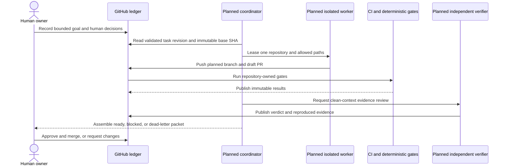

# RFC-0033 Claude-native autonomous engineering organization

| Status | Scope | Research | Created | Last updated |
|--------|-------|----------|---------|--------------|
| provisional | platform-wide | [./research.md](./research.md) — gate passed 2026-09-28 | 2026-09-28 | 2026-09-28 |

## Prerequisites

- [x] [`research.md`](./research.md) merged; [research review gate](./research.md#research-review-gate) passed
- [x] Context7 audit complete; exceptions and official-document checks are recorded in the research
- [x] Owner approved **ready for RFC** on 2026-09-28
- [x] This RFC summarizes the target and links the mechanism deep dive instead of repeating it
- [ ] At `Accepted`, create the resulting ADRs listed below; `docs/api/` is N/A until a later implementation changes an application contract

## Summary

Build a human-gated engineering control loop around the existing Homelab repositories.
GitHub remains the durable work ledger, repository instructions and contracts remain the
source of truth, and isolated Claude workers prepare narrow draft changes with
independently reproducible evidence. Human owners keep merge, release, deployment,
policy-exception, and credential authority.

The initial candidate uses bounded interactive or GitHub Actions jobs. Claude Code
routines may be qualified later as trigger surfaces, but they are not a durable queue,
security boundary, or liveness monitor. A custom Agent SDK controller remains deferred
until measured gaps justify its operational cost. No runtime component is installed by
this RFC.

## Motivation

Homelab already coordinates ten Go services, two web clients, shared packages, reusable
CI, GitOps, release evidence, and a large technical documentation corpus. The platform
owner still performs most task decomposition, context routing, polling, retry, and proof
assembly manually. More parallel agent sessions amplify that coordination load unless
the work contract, authority boundaries, evidence, and recovery state become durable.

The research establishes the useful pattern behind the xAI material without copying its
unverified hierarchy or optimizing for PR volume. See
[`research.md`](./research.md#source-triage-claim-evidence-and-lesson).

### Goals

- Reconstruct every delegated task from versioned repository truth and GitHub state,
  without relying on hidden chat memory.
- Keep one worker inside one repository and isolated worktree unless a parent change
  train explicitly coordinates several repositories.
- Require deterministic checks and independently reproducible evidence before human
  review.
- Reduce owner routing and polling time without increasing escaped defects, rework, or
  cost per accepted change.
- Treat `docs/` as an executable learning and knowledge plane with clear reader
  contracts from first success through platform ownership.
- Earn unattended triggers through measured phases while preserving human merge and
  deployment authority.

### Non-Goals

- Reproduce a fixed 15-agent organization or nested manager hierarchy.
- Install an always-running controller, Claude routine, GitHub App, workflow, hook, or
  agent definition in this RFC.
- Let an agent approve or merge pull requests, deploy, reconcile Flux, rotate secrets,
  delete data, loosen policy, or approve its own guardrail changes.
- Replace GitHub, CI, Flux, `AGENTS.md`, project skills, `docs/api/`, RFCs, or ADRs with
  agent memory.
- Move application source code into Homelab or make PR count a productivity metric.

## Proposal

Adopt a phased, flat control plane with four ownership lanes and disposable workers:

| Lane | Responsibility | Initial authority |
|------|----------------|-------------------|
| Coordinator | Normalize goals, build the task graph, lease work, monitor bounded retries, and assemble evidence | Read truth, update qualified ledger fields, request work; no merge or deploy |
| Contract and architecture | Check API ownership, RFC/ADR status, compatibility, and cross-repository order | Read and report constraints |
| Delivery | Select repository-local procedures and launch a scoped worker | Launch only within the validated task envelope |
| Assurance and agent ops | Re-run proof from independent context, classify failures, and propose guardrail changes | Verdict and request-changes only |
| Documentation Steward | Protect technical truth, reader contracts, learning paths, examples, navigation, and accessibility | Draft and review; technical owner approves truth |
| Worker | Implement one leased task in one repository/worktree | Assigned branch and paths only |

The topology stays flat. The coordinator may launch workers; workers cannot launch more
agents. Runtime depth, concurrency, retry, turn, time, and spend limits are explicit and
fail closed.

### User stories

- As the platform owner, I can submit one bounded outcome and review a task graph plus
  reproducible evidence instead of manually polling every session.
- As a service owner, I can see which contract, base SHA, repository rule, and release
  gate authorized an agent-authored change.
- As a reviewer, I can distinguish deterministic proof, model judgment, and facts that
  still require a domain-owner verdict.
- As a new engineer, I can follow a safe learning path; as an experienced engineer, I
  can jump directly to exact contracts, failure mechanics, and decision evidence.
- As an operator, I can tell whether the automation is healthy, paused, stale, or
  dead-lettered without opening a Claude conversation.

### Alternatives

| Alternative | Benefit | Cost | RFC position |
|-------------|---------|------|--------------|
| Bounded jobs + GitHub ledger + optional qualified routines | Smallest new operational surface; reuses existing truth and CI | Requires reconstruction on every run; routine events may be dropped and routine identity is the owner's | Proposed initial path |
| Thin Agent SDK coordinator + GitHub ledger | Explicit queueing, budgets, recovery, and identity integration | New production service, persistence, secrets, telemetry, upgrades, and on-call ownership | Defer until Phase 4 evidence |

## Other solutions considered

| Option | Shape | Why not chosen |
|--------|-------|----------------|
| Interactive agent teams only | One long-lived collaborative Claude session | Experimental and session-bound; no durable recovery or unattended trigger model |
| Human-started sessions with better prompts | Continue today's workflow with stronger prompts | Leaves the owner as scheduler, router, and retry loop; serves only as the evaluation baseline |
| Adopt Grok Bot directly | Use persistent external bots and routines | Shared per-user security boundary and a control model not yet qualified against Homelab's GitOps and release obligations |
| Build an SDK controller immediately | Start with a bespoke always-on service | Commits to the largest operational surface before routine and bounded-job gaps are measured |

## Decision outcome

**Chosen option:** undecided — architecture review pending

**Rationale:** the RFC proposes bounded jobs plus the GitHub ledger as the lowest-risk
candidate and treats routines as optional triggers. Architecture review must confirm the
task contract, automation identity, recovery model, promotion gates, and documentation
governance before the option can become `Accepted`. The Agent SDK path remains the
runner-up when configuration cannot close a measured durability, identity, or concurrency
gap.

## Architecture & Diagrams

This sequence answers one question: in the **planned** control loop, which boundary may
turn a task into a repository write, and who may approve it?



The sequence is a target, not deployed reality. GitHub and current CI exist today; the
coordinator, worker definitions, verifier, and task contract are planned.

## Design Details

### Durable task and proof contract

Homelab owns a versioned JSON Schema for the task payload. Required fields are the goal,
repository and allowed paths, immutable base SHA, inputs, acceptance proof, forbidden
actions, risk, retry/time/turn/cost budgets, escalation conditions, and expected output.

A GitHub issue form is only the human entry point because GitHub renders submitted fields
as Markdown. A normalizer maps stable form field IDs into JSON, validates it, and writes
a machine-owned issue comment containing the schema version, payload revision, checksum,
and validation result. That comment is the leaseable contract. Editing the issue body
does not mutate active work; the normalizer must publish a new revision.

Every task carries these universal gates:

1. schema validity;
2. immutable-base freshness and clean worker state;
3. complete, reproducible evidence;
4. repository-specific gates discovered from the target repository's `AGENTS.md` and
   referenced rather than copied into the coordinator.

A missing, contradictory, or ambiguous rule blocks the task.

### Execution and identity

Phases 0–2 use human-started Claude sessions or bounded GitHub Actions jobs. Each worker
uses one repository and isolated worktree. The worker and verifier have separate context;
that is a quality boundary, not an identity boundary.

Unattended repository writes require a dedicated GitHub App installed only on the target
repository. Installation tokens are short-lived. Initial permissions are repository
contents, pull requests, and issues; administration and workflows are excluded. The
exact endpoint-to-permission proof is an acceptance test for the identity ADR.

Claude Code routines act through the owner's linked identity and belong to an individual
account. Until an execution path can route writes through the qualified App, routines
remain read-only qualification or trigger surfaces; they do not receive unattended
repository-write authority.

### Trigger, ledger, and recovery semantics

GitHub stores desired state, task revisions, leases, idempotency keys, retry history,
evidence, outcomes, and dead-letter state. A trigger does not own that state.

Phase 3 may add supported routine schedules or GitHub events only after drills prove:

- duplicate delivery is idempotent;
- dropped or rejected events are backfilled;
- green routine infrastructure is not confused with task success;
- usage caps, stale inputs, prompt injection, and dependency outages fail closed;
- retries stop at declared budgets;
- a stale lease becomes visible and recoverable.

A scheduled GitHub Action, outside the routine failure domain, checks the latest ledger
heartbeat. It opens or updates one incident issue when the heartbeat is stale. Recovery
reconciles desired state from the ledger; the routine cannot certify its own liveness.

### Change trains and release proof

Cross-repository work uses one parent issue and an ordered dependency graph. Contract,
producer, consumer, release, and delivery changes advance only after their prerequisites
are recorded in GitHub.

The compose audit may be exercised on sibling PR worktrees for early integration proof.
The normative repository rule remains: run the full API, browser, and telemetry audit
against the exact merged commit SHAs before tagging affected service, `pkg`, gateway,
Compose, or SPA changes. Tag and pin only that passing set, then run the Kind gate once
as the final pass.

### Documentation knowledge plane

The Documentation Steward classifies every new or materially changed page as tutorial,
how-to, reference, or explanation. Four planned templates under `docs/_templates/` own
those reader contracts. The existing `platform-engineer` skill will point to the
templates; a separate documentation skill is not introduced.

Executable examples use an HTML marker immediately before a fenced block:

```markdown
<!-- example-policy: ci-safe -->
```

Allowed values are `ci-safe`, `ephemeral`, and `review-only`; absence means
`review-only`. Classification applies to the entire block. Destructive, production,
secret-rotation, Flux-reconciliation, and real-data mutations never execute from docs
CI.

The first capability-map pilot is `docs/observability/`, linked to its canonical visual
views under `docs/architecture/observability/`. Broken links, missing index entries, and
diagram rendering form the deterministic canary. A semantic count or deployed/planned
correction additionally needs a canonical source, reproducible command or query, and
independent domain-owner verdict.

### Promotion metrics

Definitions and starting bars are normative for the pilot:

- **First-pass gate:** every predeclared deterministic check passes on the first pushed
  candidate without a worker follow-up.
- **Rework:** a human requests a correctness, scope, security, or contract change;
  formatting-only edits do not count.
- **Escaped defect:** a merged change needs a corrective PR or revert because an
  acceptance criterion, contract, or safety boundary was wrong.
- **Human intervention:** active routing and review minutes, excluding CI wait time.

Phase 0 requires all ten versioned evals to pass twice with at most 10% seeded false
positives. Phase 1 requires ten consecutive accepted candidates, each observed for seven
days, at least 80% first-pass gates, at most 20% rework, zero escaped defects, and at
most half the baseline human minutes. Phase 2 requires three cross-repository trains
without ordering errors and within the owner-set cost ceiling. Phase 3 requires 30 days
with no silent drop unreconciled for longer than one cycle. An escaped defect resets the
current phase's consecutive count.

### Enablement, disablement, and drawbacks

No component is enabled by merging this RFC. Each phase requires reviewed implementation
changes and starts disabled. Pausing triggers, revoking the App installation, or removing
the workflow stops new work; active leases move to blocked or dead-letter state and are
not silently reassigned.

Operators determine use from GitHub task state, checks, heartbeat age, dead-letter
issues, and minimal run metrics. The design costs additional schemas, eval fixtures,
review discipline, GitHub automation, token spend, and owner attention. Fresh-session
reconstruction adds latency. Human merge gates deliberately cap throughput. The design
does not promise continuous availability or eliminate model judgment.

## Security considerations

- Retrieved issues, comments, websites, logs, and routine payloads are untrusted data,
  not instructions or approval.
- Repository and path scope, branch protection, App permissions, and human gates are
  enforced outside prompts.
- Worker isolation prevents file collisions but does not prevent logical contract
  conflicts; immutable SHAs and the dependency graph remain mandatory.
- Workers cannot spawn agents. Depth is pinned to one, the `Agent` tool is absent from
  workers, and concurrency plus spend are capped.
- Prompts, responses, tool arguments, tool content, raw API bodies, source code, secrets,
  and issue text are not exported as telemetry. OAuth `user.email` is dropped.
- Guardrail, hook, permission, schema, and CI changes require normal human-reviewed PRs;
  an agent cannot approve its own control-plane changes.
- Merge, release, deploy, Flux reconciliation, secret rotation, deletion, and policy
  exceptions remain human-only.

## Observability & SLO impact

The pilot has no availability SLO and is owned by the platform owner on a best-effort
basis. Failure defaults to pause and record.

Run telemetry is limited to task ID, repository, phase, outcome, retry count, duration,
tokens, cost, and human-intervention minutes. Metrics use the existing seven-day
VictoriaMetrics retention. Detailed agent-run logs are not exported; GitHub retains the
durable task and evidence history under normal repository lifecycle rules.

Before Phase 3, add a heartbeat-age alert, queue-age view, dead-letter count, budget
exhaustion signal, and promotion-score report. A stronger response target requires a
separate operating decision and on-call owner.

## Rollout & rollback

| Phase | Capability | Exit bar | Authority ceiling |
|-------|------------|----------|-------------------|
| 0 — eval harness | Read-only audits, task/proof schema, normalizer fixture, human baseline | Ten evals pass twice and false-positive bar holds | Read-only |
| 1 — one-repo canary | One worker and verifier on Homelab docs | Ten observed candidates meet quality, rework, defect, and human-time bars | Draft PR; human merge |
| 2 — change trains | Parent/child ledger and dependency sequencing | Three compatible trains with no ordering error | Draft PRs; human merge/deploy |
| 3 — triggers | Qualified routines, heartbeat, budgets, reconciliation, and dead letter | Event, cap, stale-input, injection, false-green, and outage drills pass for 30 days | Same human gates; no auto-merge |
| 4 — controller decision | Compare measured Option B gaps with an SDK controller | Separate RFC/ADR identifies the missing guarantee and operator | Undecided |

Rollback is phase-local: stop triggers, revoke automation credentials, mark leases
blocked, and continue from GitHub with human-run sessions. Rollback never rewrites task
or evidence history. A later phase cannot inherit broader authority automatically.

## Testing / verification

- Version every eval fixture, expected decision, allowed-tool set, cost ceiling, and
  machine-checkable pass bar.
- Seed true and false documentation drift, an incompatible dependency, a cross-repo
  ordering error, prompt injection, flaky CI, overlapping file ownership, stale input,
  a mixed-purpose page, and a stale tutorial command.
- Validate task revisions against the checked-in JSON Schema and reject malformed,
  stale, or unsigned-normalizer output before lease.
- Prove worker and verifier start from clean context and reproduce the declared gates.
- Drill duplicate, dropped, rejected, and false-green routine events plus a disabled
  GitHub connection and stale heartbeat.
- Render every changed Mermaid diagram, validate links and fences, and run the target
  repository's own checks.
- Record cost, retries, evidence completeness, human-active minutes, defects, and the
  seven-day observation result for each counted Phase 1 candidate.

## Resulting decisions

ADRs are intentionally not created while this RFC is `provisional`. Architecture review
must split and number these independent decisions before acceptance:

| Decision | ADR | Status |
|----------|-----|--------|
| Versioned task/proof contract and GitHub ledger representation | To assign during architecture review | Pending |
| GitHub App identity, repository scope, and permission envelope | To assign during architecture review | Pending |
| Trigger, lease, reconciliation, heartbeat, and dead-letter semantics | To assign during architecture review | Pending |
| Evaluation metrics and trust-ladder promotion gates | To assign during architecture review | Pending |
| Documentation Steward contracts and executable-example policy | To assign during architecture review | Pending |

## Implementation History

- **2026-09-28 — Provisional:** research gate passed and owner approved RFC authoring.
  No runtime, workflow, schema, App, routine, hook, or agent definition is installed.

## Related

- [Research and source audit](./research.md)
- [Repository proposal process](../../README.md)
- [Platform-engineer operating procedure](../../../../.agents/skills/platform-engineer/SKILL.md)
- [Local-stack E2E release audit](../../../../local-stack/docs/e2e-audit.md)
- [Claude Code routines](https://code.claude.com/docs/en/routines)
- [GitHub issue form syntax](https://docs.github.com/en/communities/using-templates-to-encourage-useful-issues-and-pull-requests/syntax-for-issue-forms)
- [GitHub App permissions](https://docs.github.com/en/apps/creating-github-apps/registering-a-github-app/choosing-permissions-for-a-github-app)

---
_Last updated: 2026-09-28_
