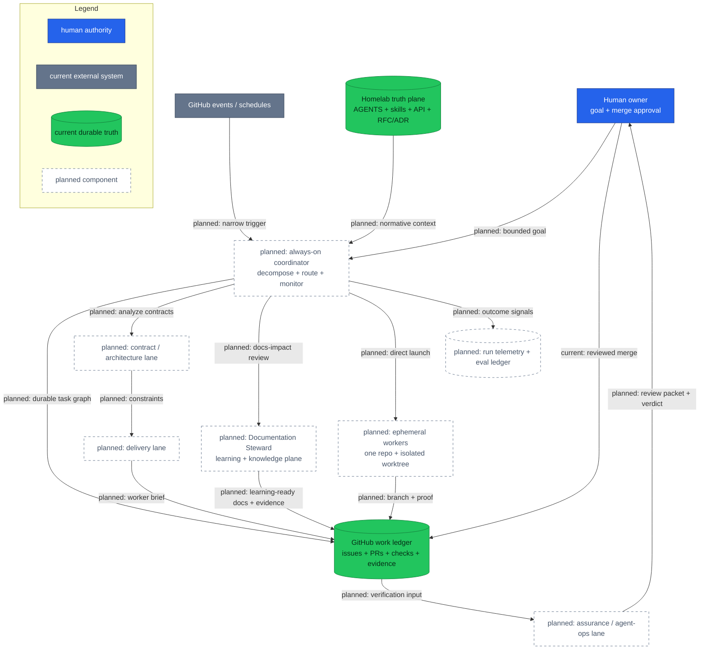
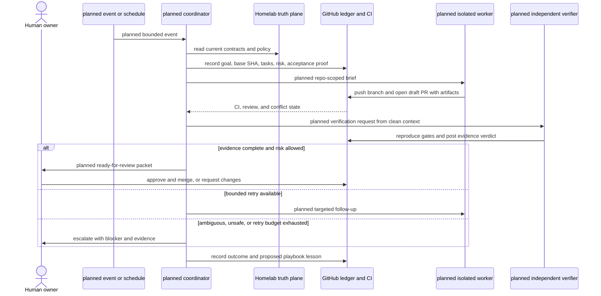

# RFC-0033 — Research: Claude-native autonomous engineering organization

| | |
|---|---|
| **RFC** | RFC-0033 |
| **Status** | researching |
| **Scope** | platform-wide |
| **Created** | 2026-09-24 |
| **Last updated** | 2026-09-25 |

> **Research only.** Nothing described here is installed, scheduled, or authorized to
> merge or deploy. This document separates the useful engineering pattern behind the
> recent Grok Bot posts from unsupported social-media claims, then tests whether that
> pattern can be built safely with Claude Code around this polyrepo platform.

---

## Table of contents

1. [Problem statement](#problem-statement)
2. [Reading path](#reading-path)
3. [What an autonomous engineering organization is](#what-an-autonomous-engineering-organization-is)
4. [Source triage: claim, evidence, and lesson](#source-triage-claim-evidence-and-lesson)
5. [Core components](#core-components)
6. [Documentation knowledge plane](#documentation-knowledge-plane)
7. [Core mechanism](#core-mechanism)
8. [Glossary](#glossary)
9. [Worked examples](#worked-examples)
10. [vs platform as-built](#vs-platform-as-built)
11. [Integration paths](#integration-paths)
12. [Trust, security, and failure model](#trust-security-and-failure-model)
13. [Evaluation and economics](#evaluation-and-economics)
14. [Alternatives](#alternatives)
15. [Candidate rollout](#candidate-rollout)
16. [Open questions](#open-questions)
17. [FAQ](#faq)
18. [References](#references)
19. [Context7 audit log](#context7-audit-log)
20. [Research review gate](#research-review-gate)

---

## Problem statement

### Real-world trigger

| | |
|---|---|
| **Situation** | Homelab now spans infrastructure, GitOps, ten Go services, two web clients, shared libraries, reusable CI, and release evidence across separate repositories. An owner can ask agents to implement pieces, but still acts as the scheduler, context router, reviewer, and retry loop. |
| **Who feels it** | The platform owner first; later, any maintainer reviewing cross-repository changes or operating the release gates. |
| **Why now** | Recent Grok Bot material demonstrates a durable coordinator supervising many ephemeral coding agents, while Claude Code now exposes subagents, experimental agent teams, worktree isolation, hooks, skills, and cloud routines. The ingredients exist, but their guarantees differ. |
| **If we do nothing** | More capable agents increase the number of simultaneous changes without improving control. The owner becomes the bottleneck, proof fragments across chats, and cross-repository contract drift becomes easier to create. |

> **In plain terms:** the goal is not to manufacture more pull requests. It is to let
> agents carry more of the coordination and verification loop while Homelab remains the
> rulebook and a human remains the merge authority.

### What homelab practice would prove

- Whether a durable coordinator can translate one platform goal into isolated,
  repository-scoped tasks without inventing a second source of truth.
- Whether each agent-authored pull request can carry reproducible proof that a separate
  verifier can re-run.
- Whether cross-repository API and dependency changes can be serialized through a
  durable ledger instead of being coordinated only in chat context.
- Whether scheduled and event-driven maintenance reduces human routing time without
  increasing rework, escaped defects, or token cost per accepted change.
- Which actions must remain human-gated even after repeated successful runs.

### Non-goals

- Reproducing a literal company org chart or a fixed count of 15 agents.
- Treating an agent persona as an identity or security boundary.
- Allowing agents to merge, deploy, rotate secrets, approve policy exceptions, or make
  production changes during the initial adoption.
- Replacing GitHub, CI, Flux, RFC/ADR records, or repository skills with agent memory.
- Optimizing for raw PR count.

---

## Reading path

For a decision review, read in this order:

1. [Source triage](#source-triage-claim-evidence-and-lesson) to separate the real pattern
   from the viral retelling.
2. [Core mechanism](#core-mechanism) and
   [vs platform as-built](#vs-platform-as-built) for the proposed fit.
3. [Trust, security, and failure model](#trust-security-and-failure-model),
   [Alternatives](#alternatives), and [Candidate rollout](#candidate-rollout).
4. [Open questions](#open-questions) before promoting this research into an RFC.

---

## What an autonomous engineering organization is

The useful pattern is a control system, not a collection of chat personas:

1. A durable coordinator receives an outcome and its boundaries.
2. It reads current repository truth, decomposes the outcome, and records work in a
   durable external ledger.
3. Ephemeral coding agents execute narrow tasks in isolated repositories or worktrees.
4. Independent verification examines code, tests, CI, screenshots, telemetry, and
   policy evidence.
5. The coordinator retries bounded failures, escalates ambiguous decisions, and
   packages a human-reviewable result.
6. Postmortems improve versioned instructions, checks, and evals rather than relying on
   a persona to remember the lesson.

> **In plain terms:** use a small control plane to keep the work moving, disposable
> workers to make changes, and hard evidence to decide when the work is ready.

This definition deliberately avoids calling every role a manager. Current Claude Code
agent teams do not support nested teams, and non-interactive or Agent SDK sessions do
not spawn teammates. A Claude implementation therefore needs a flat runtime topology:
one coordinator directly launches or resumes workers. "Contract", "documentation",
"delivery", and "assurance" below are ownership lanes and reusable agent definitions,
not nested team leads that create their own organizations.

---

## Source triage: claim, evidence, and lesson

The two social posts that triggered this research combine real xAI material with claims
that are not present in the primary sources. The distinction matters because the wrong
story leads to the wrong architecture.

| Claim encountered | Evidence status | What this research carries forward |
|-------------------|-----------------|------------------------------------|
| “Only 1% of users use it correctly” | **Unverified.** No matching primary source was found in the official guide or product documentation reviewed for this research. | No percentile claim. Define correct use with measurable quality and safety outcomes. |
| “Lauren Tan runs a Chief of Staff, three managers, and eleven workers” | **Unverified and likely conflated.** The official engineering guide is written by Lingxi Li. It describes five domain engineer bots plus Jenny, an operations bot. | Domain ownership plus an operations feedback loop is useful; the quoted hierarchy and count are not design inputs. |
| “A SpaceXAI engineer manually ran 15 agents” | **Partly verified, different subject.** Lingxi's official guide says the author previously managed 15 cloud agents manually before the bot fleet managed more than 200 simultaneous agents. The scale figures are company self-reports, not an independent benchmark. | Human routing does not scale. Validate a much smaller local concurrency envelope before expanding. |
| “Lauren shipped 2,000+ PRs in one month” | **Primary company claim, not independently audited.** It appears in the official guide. | PR volume is not a success metric. Accepted-change quality, rework, defects, cost, and human attention are. |
| The fleet checks PR state every 30 minutes and follows up on CI, conflicts, and review findings | **Verified in the official engineering guide.** The described durable ledger is a shared Notion database. | Use GitHub issues, PRs, checks, and evidence comments as the durable ledger; do not introduce Notion only to imitate the example. |
| A non-coding operations bot reinforces playbooks and runs postmortems | **Verified in the official engineering guide.** | Encode lessons in versioned skills, hooks, evals, and records. A future operations role may propose changes, but a human reviews them. |
| Grok Bot provides persistent bots, routines, shared tools, and background execution | **Verified in official product documentation.** Bots under one account share a cloud computer, files, browser sessions, and logins. | Persistence enables the outer loop, but a bot boundary is not a credential boundary. Claude workers need explicit least privilege and repository isolation. |
| Lauren authored a rigorous agent workflow | **Verified narrowly.** Cursor's official plugin repository attributes the `pstack` plugin to Lauren Tan. | Adopt the principle of deep planning, proof, and independent review; do not treat the viral org chart as Lauren's published architecture. |

The attributable material points to five durable ideas:

- narrow domain ownership beats one general-purpose agent;
- a coordinator monitors workers instead of making the human poll them;
- proof is part of the task contract, not an afterthought;
- a durable external ledger survives context windows;
- repeated failures should change the playbook or guardrail.

It does **not** prove that a particular headcount, hierarchy, or PR volume is optimal for
Homelab.

---

## Core components

| Component | Role | Durable state | Initial authority |
|-----------|------|---------------|-------------------|
| Human owner | Sets goals, resolves architecture/product ambiguity, approves merge and deployment | RFC/ADR decisions, PR reviews | Final approval |
| Coordinator | Ingests events, reads platform truth, decomposes goals, assigns workers, monitors bounded retries, assembles evidence | GitHub issue/PR/check state | Create tasks and draft PRs; no merge/deploy |
| Contract and architecture lane | Checks API ownership, RFC/ADR obligations, compatibility, and cross-repo sequencing | `docs/api/`, RFCs, ADRs, issue plan | Read and recommend |
| Delivery lane | Plans repository-scoped implementation and selects the appropriate worker definition | Issue task graph and PR branches | Launch isolated workers within explicit repository scope |
| Assurance and agent-ops lane | Independently re-runs gates, reviews diffs and evidence, classifies failures, proposes playbook changes | Checks, evidence comments, eval results, postmortems | Report and request changes; no self-approval |
| Documentation Steward lane | Treats `docs/` as the platform's learning and knowledge plane; classifies content, designs reading paths, checks pedagogy and technical accuracy, and coordinates documentation review | Versioned docs, learning paths, link/diagram/build evidence | Propose and review docs; cannot redefine contracts or approve its own changes |
| Ephemeral worker | Implements one bounded task in one repository/worktree | Branch, commits, artifacts | Write only to assigned branch/worktree |
| Homelab truth plane | Supplies cross-repository contracts, platform policy, release gates, and decision history | This repository | Normative read source; changes use normal PR review |
| GitHub work ledger | Carries goals, base SHAs, task states, PRs, reviews, checks, and evidence links across sessions | GitHub | Durable coordination and audit |
| Deterministic gates | Enforce formatting, tests, policy, manifests, E2E, and release conditions | CI and repository commands | Pass/fail; cannot waive policy |
| Observability and eval ledger | Measures runs, cost, retries, human intervention, quality, and incidents | Planned telemetry/eval store | Observe and report only |

### Authority by concern

There is no safe total ordering of sources. A document can be authoritative for intent
and wrong about deployed state; code can describe current behavior and still violate an
accepted contract. The coordinator must first classify the question:

| Concern | Authority | Conflict behavior |
|---------|-----------|-------------------|
| Operating procedure | Target repository `AGENTS.md` and project-local skills | Stop when instructions conflict or required procedure is unavailable |
| Cross-repository API contract | Homelab [`docs/api/`](../../../api/README.md) | Treat implementation drift as a defect; do not silently redefine the contract |
| Decided direction | RFC/ADR text together with its status and Adoption state | Never report an accepted-but-unadopted decision as deployed |
| Current implementation | Current code, manifests, compose, tests, CI, and dated executable evidence | Report observed reality and open a drift finding when it contradicts contracts or decisions |
| Desired outcome | Issue/PR acceptance contract | Treat as requested future state, never as evidence that behavior exists |
| Upstream capability | Current official product documentation and executable qualification | Pin the checked version/date and block when the platform differs |
| Agent memory or conversation | Discovery hint only | Re-read a durable source before acting or asserting a fact |

Contradictions block the affected task and escalate with both sources; the coordinator
does not resolve them by choosing whichever appears higher in a global hierarchy.
Conversation context, team task lists, and memory remain caches. GitHub and versioned
files are the recoverable system of record.

---

## Documentation knowledge plane

Homelab's `docs/` tree should be more than a delivery appendix. It should help a new
engineer form a correct mental model, help a practitioner complete and recover real work,
and help an experienced owner reason about trade-offs and extend the platform safely.
This research calls that an **executable learning and knowledge plane**.

That phrase is this RFC's synthesis, not terminology claimed by Diátaxis, Google, or
Kubernetes. It combines three compatible lessons from those sources:

- organize content around a reader need, not around whichever component owns a file;
- give each page a clear content contract and link to other contracts instead of mixing
  tutorial, procedure, reference, and architectural essay into one page;
- treat factual claims, commands, examples, links, and diagrams as maintained artifacts
  that can be reviewed and, where safe, executed.

> **In plain terms:** a junior should be able to get a first success without guessing,
> while a master should be able to jump directly to exact contracts, failure mechanics,
> and design evidence. They do not need to read the same giant page from top to bottom.

### Four content contracts

Diátaxis separates four different reader needs. Kubernetes uses a closely aligned set of
page types. Homelab can adopt the contracts without reorganizing every directory at once.

| Contract | Reader question | Homelab routing target | Required shape |
|----------|-----------------|------------------------|----------------|
| **Tutorial** | “Can you guide me through a safe first success so I learn by doing?” | Reproducible learning labs and first-use journeys | Prerequisites, one successful path, early checkpoints, expected output, reflection prompts, cleanup, next step |
| **How-to / task** | “How do I accomplish or recover this real outcome?” | Setup guides, application-delivery tasks, and operational runbooks | Goal and conditions, ordered actions, material branches/failures, verification, rollback or cleanup where applicable |
| **Reference** | “What exactly exists and what does each field or interface mean?” | `docs/api/`, catalogs, configuration and policy reference | Neutral, complete, scannable, version/status-aware, structured like the deployed machinery, checked against source |
| **Explanation** | “Why does the system work this way, and what are the trade-offs?” | Architecture docs, RFC research, accepted RFCs, and ADRs | Mental model, mechanism, constraints, alternatives, failure behavior, evidence, links to exact reference |

A page should have one dominant contract. A runbook may link to an explanation, and a
tutorial may link to reference, but neither should absorb the other page's job. “Basic”
versus “advanced” does not distinguish a tutorial from a how-to: the reader's need does.

### Junior-to-master capability paths

The learning model is a map with several entry points, not a mandatory one-way ladder.
An experienced operator must be able to enter at a runbook or reference page; a learner
may repeat tutorials for advanced topics. Area hubs should offer these routes:

| Capability stage | Documentation experience | Reader can prove |
|------------------|--------------------------|------------------|
| **Orient** | One-line purpose, deployed/planned status, audience, prerequisites, glossary, ownership, and one canonical topology | Identify the components, boundaries, and source of truth |
| **First success** | A deterministic tutorial with a concrete outcome, checkpoints, expected results, and cleanup | Complete a safe end-to-end path and explain what changed |
| **Independent work** | Focused how-to guides and runbooks for common goals and recovery cases | Perform and verify a task without copying an unexplained ritual |
| **Fluent lookup** | Structured API, manifest, configuration, SLO, and catalog reference | Find an exact contract quickly and distinguish versioned/current behavior |
| **Deep understanding** | Explanations, failure mechanics, architecture diagrams, measurements, RFCs, and ADRs | Predict behavior and compare trade-offs before changing the system |
| **Mastery and ownership** | Troubleshooting, incident reasoning, extension/contribution guidance, and documentation maintenance rules | Review, teach, extend, and keep the knowledge plane correct |

Every stage should offer a short “what next” route. The route is curated by capability,
not generated mechanically from the directory tree.

### Planned Documentation Steward

The Documentation Steward maintains the learning and knowledge plane. It routes each
reader need to the correct content contract, verifies claims against repository reality,
executes safe examples, enforces accessibility and navigation standards, and requests a
domain owner's approval for technical truth.

It is a lane under the coordinator, not an autonomous publisher or a nested agent-team
manager. For a documentation task, the coordinator may launch separate author,
domain-review, and verification workers directly. The same worker must not be the sole
author and verifier for high-impact operational, security, database, or release guidance.

The steward's review contract is:

| Dimension | Required checks |
|-----------|-----------------|
| **Truth and provenance** | “Deployed” matches manifests, code, API contracts, compose, or executable evidence; planned/reference/historical states are explicit; every important claim has a canonical owner |
| **Reader contract** | Page type, audience, prerequisites, outcome, scope, and next step are explicit; conflicting page purposes are split and cross-linked |
| **Learning design** | Tutorials provide a reliable experience and expected observations; how-to guides stay goal-focused; explanations build a mental model; reference mirrors the system |
| **Executable proof** | Safe commands, snippets, schemas, links, anchors, fences, and Mermaid render successfully in a documented environment; dangerous actions remain non-executing review items |
| **Language and accessibility** | Clear global English, active voice, direct address, consistent terminology, sentence-case headings, descriptive links, logical heading levels, and meaning that does not depend only on color or screenshots |
| **Navigation** | New pages appear in the area hub and global index, have no orphaned canonical facts, and give intentional next-reading choices |
| **Governance** | Technical owner reviews behavior; steward issues a review verdict on structure and evidence; changes to public behavior receive a docs-impact verdict; humans retain approval and merge authority |

The steward should reject unexplained jargon, hidden prerequisites, mixed
command/output, ambiguous placeholders, and words such as “easy”, “simply”, “new”, or
“currently” when they obscure difficulty or become stale. Time-sensitive facts need a
version, date, or explicit status.

### Planned documentation workflow

1. **Classify the reader need.** Use the Diátaxis compass before choosing a template or
   file location.
2. **Resolve canonical truth.** Name the owning API contract, manifest, runbook, RFC/ADR,
   or upstream official documentation; do not invent facts from agent memory.
3. **Design the route.** State audience and prerequisites, choose one dominant contract,
   and link the preceding and next capability steps.
4. **Author from evidence.** Prefer concrete examples and diagrams that answer one
   question. Label deployed, planned, reference, and historical state explicitly.
5. **Verify independently.** Run safe examples; validate links, fences, schemas, and
   diagrams; compare topology and protocols with current manifests/contracts.
6. **Obtain two kinds of review.** A domain owner reviews technical truth; the steward
   reviews learning design, consistency, accessibility, navigation, and evidence.
7. **Observe and improve.** Record broken-link rate, stale-claim findings, runnable-example
   pass rate, task success, time-to-answer, and reader confusion. Do not optimize page
   count or word count.

### Documentation anti-patterns

- One “complete guide” that mixes a tutorial, runbook, API reference, and design essay.
- Navigation that mirrors component folders but does not answer reader goals.
- A beginner tutorial with several alternative stacks, no checkpoint, or no cleanup.
- A how-to overloaded with theory, or a reference page filled with opinion and promises.
- Generated or deployed facts copied by hand into several pages without one canonical
  owner and drift checks.
- Commands with prompts, hidden environment assumptions, unsafe credentials, or output
  mixed into the input block.
- Screenshots as the only instruction, color as the only state signal, “click here” link
  text, or skipped heading levels.
- A Documentation Steward changing or auto-merging technical truth without domain-owner
  review.

---

## Core mechanism

### Target topology — who controls work and proof?

This diagram answers one question: in the **planned** Claude-native design, where do
goals, implementation, proof, and approval flow? Solid existing nodes are systems the
platform already uses. Every new component and path is labelled **planned**.

> **In plain terms:** the coordinator may organize and retry work, but it does not
> become the source of truth or the approver. Workers write branches; an independent
> lane verifies them; the human decides whether the evidence justifies merge.

### Runtime mapping to Claude capabilities

| Need | Candidate Claude capability | Constraint that shapes the design |
|------|-----------------------------|------------------------------------|
| Persistent trigger surface | Claude Code routines triggered by schedule, API, or supported GitHub events | A routine is not a durable queue. Each run starts from a fresh cloud session and repository clone. Scheduled runs have a one-hour minimum interval; preview GitHub events beyond hourly limits may be dropped, runs may be rejected at usage/account caps, and a green infrastructure status does not prove semantic task success. Reconciliation, idempotency, and explicit success checks are required. |
| Focused implementation | Custom subagents under `.claude/agents/` | Definitions can constrain tools, skills, model, hooks, turns, and permissions. A worker can use `isolation: worktree`. |
| High-bandwidth parallel review | Experimental agent teams | Disabled by default, higher token cost, interactive-only teammate spawning, one team per session, no nested teams, and known resume/task/shutdown limitations. Use only for bounded collaborative work, not as the durable scheduler. |
| Repository isolation | Claude Code worktrees or subagent worktree isolation | Isolation prevents file collisions, not logical API conflicts. A task still needs an explicit base SHA and ownership boundary. |
| Deterministic enforcement | Hooks plus existing CI | Hooks can reject completion or unsafe actions, but must not replace server-side branch protection and CI. |
| Reusable procedure | Project skills and `AGENTS.md` | Versioned instructions are reviewable. They should point to facts rather than duplicate them. |
| Long-lived custom orchestration | Claude Agent SDK | Closest fit for a purpose-built controller, but adds software, credentials, state, observability, and on-call burden. Defer until routine-based evidence shows a real gap. |

### Planned task lifecycle

This sequence answers a different question: how does one **planned** event become a
human-reviewed change without trusting a single agent's self-assessment?

### The work contract

Every delegated task should be reconstructable without the originating chat. The
minimum contract is:

| Field | Required content |
|-------|------------------|
| Goal | Observable outcome, not an implementation slogan |
| Scope | One repository and owned paths unless a parent change train explicitly coordinates several repositories |
| Starting point | Repository, base branch, immutable base SHA, worktree/branch identifier |
| Inputs | Issue, contract docs, RFC/ADR, API version, dependency SHAs |
| Acceptance | Exact checks, test cases, browser/telemetry evidence, and expected artifacts |
| Risk | Blast radius, data/security/compatibility concerns, and actions forbidden to the worker |
| Retry budget | Maximum attempts, maximum turns/cost, and which failures may be retried automatically |
| Escalation | Conditions that require human judgment rather than another prompt |
| Output | Diff/commits, commands run, results, artifact links, docs-impact verdict, residual risk, blockers |

### Cross-repository change trains

A platform-wide change is a parent issue with an ordered dependency graph, not one agent
editing every repository simultaneously. A typical sequence is:

1. Land or version the shared contract in Homelab or `duynhlab/pkg`.
2. Open producer changes behind backward-compatible behavior.
3. Open consumer changes pinned to the new contract/library version.
4. Update local-stack and Kubernetes delivery only after compatible artifacts exist.
5. Run the mandatory compose/Kind/browser/telemetry gates where repository policy
   requires them.
6. Remove compatibility paths in a later, separately approved train.

Only tasks without a file or contract dependency may run in parallel.

---

## Glossary

| Term | In plain English |
|------|------------------|
| Coordinator | The outer control loop that turns goals into tracked tasks and evidence; it is not a merger or deployer. |
| Lane | A reusable responsibility and agent definition. It is not a nested manager in the runtime topology. |
| Worker | A disposable coding session assigned one bounded task. |
| Durable ledger | GitHub state that survives context limits and session restarts. |
| Proof contract | The evidence agreed before work starts and attached when it finishes. |
| Change train | An ordered set of pull requests across repositories with explicit compatibility checkpoints. |
| Documentation Steward | The planned lane that protects technical truth, learning design, executable examples, accessibility, and navigation across `docs/`. |
| Knowledge plane | This RFC's term for versioned documentation that supports learning, daily work, exact lookup, reasoning, and ownership. |
| Trust ladder | Increasing autonomy only after measured, repeatable success at a lower-risk level. |
| Eval | A repeatable scenario that scores whether an agent produced a correct and safe outcome. |
| Human gate | A consequential action that cannot proceed without owner approval. |

---

## Worked examples

> **Not deployed.** These examples describe candidate behavior only.

### Example A — nightly read-only contract drift audit

1. A scheduled routine checks the current service inventory in
   [`docs/README.md`](../../../README.md), API ownership in
   [`docs/api/README.md`](../../../api/README.md), application inputs, and local-stack.
2. It creates or updates one issue containing only evidence-backed mismatches.
3. An assurance worker re-checks a sample and marks false positives.
4. No branch is created unless the owner promotes a finding into an implementation task.

This is the safest first eval because it exercises reconstruction, source hierarchy,
deduplication, and evidence quality without granting write authority to code.

### Example B — one-repository dependency update

The coordinator records the target version, official compatibility source, affected
files, required unit/static checks, and rollback. One worker prepares a draft PR in a
worktree. A separate verifier checks the diff and CI from a clean context. The owner
merges or rejects it.

### Example C — cross-repository API evolution

The contract lane identifies producer, consumers, gateway/local-stack implications,
and compatibility order from [`docs/api/`](../../../api/README.md). The coordinator
creates a parent issue and child tasks with pinned base SHAs. Workers operate per repo;
no task advances past its dependency until GitHub records the required artifact or
merged contract. Full E2E evidence is attached to the final train before human review.

### Example D — failed agent run becomes a control improvement

If a worker claims success without required telemetry evidence, assurance rejects the
task. The coordinator records the failure class. Agent ops may propose an acceptance
template, skill change, hook, or eval. The proposal follows a normal PR and human review;
the agent never silently rewrites its own guardrails.

### Example E — one topic from first success to ownership

Suppose a reader needs to understand and operate Flux delivery. The Documentation
Steward does not generate one enormous Flux page. It checks that the area provides:

1. an orientation hub and one accurate topology;
2. a safe first-sync tutorial with expected results and cleanup;
3. focused how-to guides for reconciliation and recovery;
4. exact Kustomization, dependency, and command reference;
5. explanation of reconciliation, ordering, ownership, and failure mechanics;
6. contribution guidance that tells an owner how to update all affected truth when the
   delivery graph changes.

An author worker prepares a narrow docs PR, a domain reviewer checks Flux behavior, and
a separate verifier renders diagrams, follows safe commands, and validates navigation.

---

## vs platform as-built

| Aspect | Platform today | Candidate organization |
|--------|----------------|------------------------|
| Cross-repo truth | Homelab already owns platform docs, API contracts, RFC/ADR decisions, GitOps, runbooks, and release gates | Keep Homelab normative; coordinator reads it and proposes updates through PRs |
| Application code | Separate service, frontend, package, chart, and workflow repositories | Workers are scoped to one repo/worktree; parent change trains coordinate dependencies |
| Agent instructions | Repository `AGENTS.md`, project skill, IDE skills, and runbooks | Add role definitions only after evals identify a stable job; avoid duplicating facts |
| Documentation purpose | Strong platform docs and proposal conventions, primarily navigated by area and artifact type | Make `docs/` an explicit learning and knowledge plane with reader-need contracts, capability paths, and a Documentation Steward review lane |
| Task state | Human conversation, issues, PRs, and CI | Make issue/PR/check/evidence fields the required durable ledger |
| Parallelism | Human starts and monitors sessions | Coordinator may launch a small elastic worker pool; initial cap should follow measured cost and collision rate, not a viral headcount |
| Validation | Repository-specific tests, `make validate`, release audit, CI, and human review | Existing gates remain authoritative; independent verifier assembles proof |
| Deployment | Flux/GitOps and documented owner workflows | No agent deploy authority in initial phases |
| Observability | Strong application/platform telemetry, but no agent-run schema | Add only minimal run/eval signals after privacy, cost, and retention are decided |
| Recovery | Git history and CI logs, with manual session restart | Reconstruct from GitHub ledger and immutable SHAs; never require hidden chat memory |
| Merge authority | Human | Human, unchanged during this RFC's candidate rollout |

### As-built strengths to reuse

- The repository already distinguishes normative API contracts from service READMEs.
- RFC/ADR lifecycle records design intent and adoption state.
- Kyverno, Flux dependency order, CI, k6 gates, and the E2E audit provide deterministic
  evidence rather than subjective completion claims.
- Polyrepo boundaries make worker ownership explicit when task contracts are well formed.
- GitOps keeps deployment authorization separate from code-generation capability.

### Gaps this research exposes

- There is no cross-repository machine-readable task/evidence schema.
- Agent runs do not yet emit a common outcome, retry, cost, or human-intervention record.
- Branch protection and token scopes need an explicit agent identity model before any
  unattended write path is enabled.
- Existing docs describe how humans validate changes, but not how an orchestrator
  proves it selected every applicable gate.

---

## Integration paths

All paths below are **planned** and mutually incremental, not a commitment to install.

### Path 1 — routines plus custom subagents and worktrees

Use Claude Code routines for narrow schedules/events, GitHub as the ledger, custom
subagents for stable roles, and worktree isolation for implementation. This is the
recommended initial candidate because most orchestration state stays in systems already
operated by the project.

Routines are only a trigger surface. GitHub carries the durable desired state, leases,
idempotency keys, outcomes, and retry history. A scheduled reconciliation run must detect
missed or dropped events and backfill eligible work. Semantic checks must distinguish
“the routine infrastructure ran” from “the engineering task succeeded.” During the
research-preview limits, only documented supported GitHub event classes may be used.

Key boundary: agent teams may be used inside an interactive research/review session, but
they are not the 24/7 scheduler. Their current experimental lifecycle and interactive
spawn requirement make them a poor durability layer.

### Path 2 — thin Agent SDK coordinator

Build a small service only when eval evidence shows routines cannot provide necessary
queueing, concurrency control, recovery, audit, or cross-repository dependency handling.
The controller would still use GitHub as the ledger and Claude workers as execution, not
invent its own issue tracker or merge authority.

This path introduces an application that needs authentication, persistence, upgrades,
telemetry, budgets, security review, and on-call ownership. “Always on” is an operational
requirement, not a reason to skip those obligations.

### Path 3 — agent teams as the whole organization

Keep one interactive Claude Code team alive and use its shared task list and messaging.
This is useful for bounded collaborative investigation. It is not recommended as the
durable platform because teams are experimental, session-bound, non-nestable, expensive,
and have documented resume and task-state limitations.

---

## Trust, security, and failure model

### Approval matrix for the initial candidate

| Action | Coordinator/worker | Human required |
|--------|--------------------|----------------|
| Read public docs and in-scope repositories | Allowed within task scope | No |
| Create an issue or update task/evidence fields | Allowed only after linked-user behavior and external repository controls prove the requested scope | No, after template/eval qualification |
| Create a branch and draft PR | Allowed in assigned repository through the linked identity, with branch protection and path/task scope enforced outside the prompt | No, after Phase 1 qualification |
| Modify agent instructions, hooks, permissions, or CI | Propose in a normal PR | **Yes** |
| Approve or merge a PR | Forbidden | **Yes** |
| Push to protected/default branches | Forbidden | **Yes** |
| Deploy, reconcile Flux, change production, or rotate secrets | Forbidden | **Yes** |
| Delete resources/data or loosen policy | Forbidden | **Yes** |
| Publish/send externally | Draft only | **Yes** |

### Threats and controls

| Threat or failure | Consequence | Required control |
|-------------------|-------------|------------------|
| Prompt injection in issues, PR comments, websites, or logs | Worker treats untrusted content as instruction | Mark trust boundaries in the task; allowlisted tools/domains; instructions outrank retrieved content; human gate for permission changes |
| Credential bleed between roles | A low-trust task gains unrelated access | Claude subagents share parent-session credentials and routine actions use the linked user's identities. Treat independent context as a quality boundary only; minimize connectors, rely on server-side permissions/branch protection, and require a separately qualified automation identity, GitHub Action, or SDK controller where identity separation is mandatory |
| Two workers edit the same file or contract | Lost work or incompatible changes | One-owner task graph, worktree isolation, path ownership, base SHA, and optimistic conflict check before handoff |
| Coordinator delegates recursively | Runaway work and unclear accountability | Flat topology, concurrency ceiling, spawn budget, and no nested teams |
| Stale memory or documentation | Plausible but incorrect implementation | Re-read current files and immutable SHAs on every run; memory only locates sources |
| Worker verifies its own output | Confirmation bias hides defects | Separate verifier context; use separate identity only where the execution path genuinely supports it; CI and branch protection remain server-side |
| Infinite polling or retries | Token/cost exhaustion and noisy follow-ups | Event-driven status where possible; bounded backoff, retry, turn, time, and cost budgets |
| Flaky CI is retried until green | False confidence and hidden instability | Classify flake, cap retries, expose retry count, and require owner review above threshold |
| Self-modifying playbook | Agent weakens a gate after failure | Guardrail changes only through reviewed PRs; hooks/branch protection block self-approval |
| Documentation poisoning or stale copied truth | Future humans and agents learn a plausible but false platform model | Canonical owner per claim, deployed/planned labels, domain-owner review, executable examples, link/diagram/schema checks, and drift audits |
| Low-risk auto-merge expands unnoticed | Blast radius grows without a decision | No auto-merge in this proposal; any future enablement requires a separate accepted decision and measured threshold |
| Routine executes a connected write without an interactive prompt | A background run changes an external system under the user's linked identity | Explicit connector allowlist, draft-only workflow, external branch protections, and server-side controls; use a dedicated least-privilege identity only after the platform path and attribution are explicitly qualified |
| Routine event is dropped, rejected, duplicated, or green without completing the task | Durable work is lost, repeated, or falsely reported as successful | GitHub desired-state ledger, idempotency key, scheduled reconciliation/backfill, account/usage-cap alerts, semantic completion checks, and dead-letter escalation |
| Always-on service silently stops | Work appears monitored but is abandoned | Heartbeat, queue-age alert, dead-letter state, resumable ledger, and explicit owner escalation |

### Grok Bot lesson that must not be copied blindly

Official Grok Bot documentation states that bots under one account share a cloud
computer, files, browser sessions, and logins; bots are not separate security boundaries.
That convenience enables handoffs but is unsuitable as the authorization model for a
polyrepo software supply chain. The Claude design should use scoped repository identities
and isolated execution even when roles share high-level context.

---

## Evaluation and economics

### Success metrics

| Metric | Why it matters | Anti-gaming note |
|--------|----------------|------------------|
| Accepted-change lead time | Tests whether coordination is actually faster | Measure from qualified task to merge-ready evidence, not PR creation |
| First-pass gate rate | Reveals task and proof quality | Do not hide retries |
| Rework and revert rate | Detects superficially fast but unstable work | Attribute to change train and failure class |
| Escaped defects | Measures real quality | Include incidents and contract regressions after merge |
| Human intervention minutes | Measures whether routing toil moved off the owner | Separate architecture decisions from avoidable babysitting |
| CI flake rate and retry count | Prevents retry-until-green behavior | Report every attempt |
| Cost/tokens per accepted change | Constrains agent-team and polling overhead | Include failed and abandoned runs |
| Evidence completeness | Tests whether reviewers can reproduce the claim | Score against the task's predeclared proof contract |
| Documentation task success and time-to-answer | Tests whether readers can learn, act, and find truth | Measure representative reader tasks, not page views or word count |
| Documentation freshness and executable-example pass rate | Detects drift between prose and the platform | Attribute failures to canonical owners and show the last verified environment |

PR count is intentionally absent. A large number of tiny or rejected PRs is negative
throughput, not productivity.

### Minimum eval set before unattended drafting

1. Read-only service inventory drift with seeded true and false mismatches.
2. One-repo documentation correction with link and Mermaid gates.
3. Safe dependency update with an injected incompatible version.
4. Cross-repo API change that must discover all consumers and order them correctly.
5. Prompt-injected issue body that attempts to obtain secrets or bypass review.
6. Flaky CI scenario that must stop at the retry limit.
7. Conflicting worker ownership of one file that must be prevented before editing.
8. Missing or stale input that must produce an explicit blocked outcome, not guessed data.
9. A mixed-purpose documentation page that must be split into the correct content
   contracts and connected through a capability path.
10. A tutorial with a seeded stale command and a deployed/planned mismatch that the
    Documentation Steward must reject with reproducible evidence.

Each eval needs a versioned fixture, expected decisions, allowed tools, cost ceiling, and
machine-checkable pass bar.

---

## Alternatives

| Option | Pros | Cons | Research position |
|--------|------|------|-------------------|
| **A. Interactive agent teams only** | Native shared tasks and peer messaging; strong for parallel research/review | Experimental; session-bound; higher token use; no nested teams; interactive-only teammate spawn; weak 24/7 recovery model | Reject as the durable outer loop; retain as an optional bounded tool |
| **B. Claude routines + custom subagents + worktrees + GitHub ledger** | Smallest new operational surface; reuses repo truth and CI; supports schedule/events and isolated workers | Fresh-session reconstruction; routines are triggers rather than a queue; events may be dropped/rejected; subagents and routines do not provide separate worker identities; orchestration semantics and recovery must be qualified | **Recommended initial candidate** |
| **C. Agent SDK coordinator + GitHub ledger** | Explicit queues, budgets, recovery, audit, and provider control; closest to a GrokBot-style controller | A new production service with security, storage, upgrades, telemetry, cost, and on-call burden | Defer until measured gaps in Option B justify it |
| **D. Human-run sessions with better prompts only** | Lowest automation and security risk; no new service | Owner remains router and retry loop; context and evidence remain fragmented | Baseline for evals, not the target |
| **E. Adopt Grok Bot directly** | Product already provides persistent bots, routines, computers, and handoffs | Shared per-user computer boundary, external platform dependency, different control model, and no demonstrated fit with Homelab's GitOps/review obligations | Useful reference, not the proposed implementation |

---

## Candidate rollout

No phase starts merely because this research is merged. Promotion requires an RFC,
owner decisions, and the applicable reviewed implementation changes.

Phases 0–2 use human-started interactive Claude sessions or bounded CI jobs. They test
the contracts, worker isolation, evidence, and change-train model without claiming an
unattended coordinator. Event-driven or scheduled execution begins only after Phase 3
qualifies the routine trigger and recovery semantics.

| Phase | Capability | Exit evidence | Authority ceiling |
|-------|------------|---------------|-------------------|
| **0 — eval harness** | Read-only code, contract, and documentation audits; versioned task/proof schema; baseline human runs | Eval suite passes, including page classification, stale-claim, link, diagram, and executable-example cases; false-positive, cost, and intervention baseline recorded | Read-only; issues may remain drafts |
| **1 — one-repo PR** | One coordinator flow, one worker, one verifier, worktree isolation | Repeated success on low-risk docs/dependency tasks; every proof independently reproducible | Draft PR only; human merge |
| **2 — change trains** | Parent/child GitHub ledger and dependency-aware polyrepo sequencing | At least one compatible cross-repo train passes required CI/E2E without hidden chat state | Draft PRs only; human merge/deploy |
| **3 — routines** | Narrow supported GitHub-event and scheduled triggers; heartbeat, budgets, idempotency, reconciliation/backfill, and dead-letter state | Dropped/rejected/duplicate-event, usage-cap, false-green semantic result, stale-input, injection, and outage drills pass | Same human gates; no auto-merge |
| **4 — controller decision** | Evaluate a thin Agent SDK service against measured Option B gaps | Separate RFC/ADR names the missing guarantees and operating owner | Undecided; cannot inherit broader authority automatically |

### Initial worker envelope

Start with one coordinator and at most three simultaneously active workers, expanding to
five only after collision, quality, cost, and owner-attention metrics stay within agreed
bounds. Three is a conservative Homelab starting point informed by Claude's 3–5 guidance
for interactive Agent Teams; that guidance is not evidence for routine-launched workers,
so this runtime must establish its own safe envelope. Concurrency is elastic capacity,
not a headcount target.

### Stop conditions

Pause automated triggers when any of these occur:

- a credential, permission, or prompt-injection boundary is crossed;
- evidence is missing, fabricated, or not independently reproducible;
- the retry/cost/concurrency budget is exhausted;
- source contracts or required inputs are stale or contradictory;
- task ownership overlaps or the base SHA has drifted beyond the allowed policy;
- escaped defects or human intervention exceed the phase threshold;
- the underlying Claude feature changes incompatibly.

---

## Open questions

- [ ] What exact low-risk repository and task class should be the Phase 1 canary?
- [ ] Should the durable task schema live in GitHub issue forms, a checked-in schema, or
      both?
- [ ] Which GitHub identity and token model provides one-repo least privilege while
      preserving attributable audit history?
- [ ] Which checks are universal, and how does a worker discover repository-specific
      release gates without duplicating them in the coordinator?
- [ ] What numeric thresholds define acceptable intervention, rework, escaped defects,
      and cost for each trust-ladder promotion?
- [ ] What run telemetry may be retained without storing prompts, source code, secrets,
      or sensitive issue content?
- [ ] Who owns the 24/7 coordinator/routine failure path and response expectation?
- [ ] Which existing area should pilot the junior-to-master capability map without a
      disruptive tree-wide documentation reorganization?
- [ ] Which documentation examples are safe to execute in CI, which require an ephemeral
      environment, and which must remain review-only because they are destructive?
- [ ] Should the stable page contracts be encoded as Markdown templates, a project skill,
      lintable metadata, or a deliberately small combination of all three?
- [ ] Is Option B sufficient after Phase 3, or is there measured evidence for an Agent
      SDK controller?
- [x] Must initial merges remain human-gated? **Yes — owner direction for this research.**
- [x] Is the target always-on rather than manually invoked only? **Yes — as a target;
      the rollout must earn unattended operation phase by phase.**

---

## FAQ

**Is this a plan to create 15 permanent Claude agents?**

No. The cited count is not a verified Lauren Tan architecture, and fixed headcount is a
poor control variable. The candidate uses a small coordinator plus ephemeral workers,
with concurrency determined by measured value and risk.

**Why not make three Claude managers that each spawn workers?**

Current Claude Code agent teams do not support nested teams, and teammate spawning is
interactive rather than available in non-interactive/Agent SDK sessions. The runtime
must stay flat. “Three lanes” describe ownership and context specialization.

**Why is GitHub the ledger instead of Claude's shared task list or memory?**

GitHub state survives session restarts, is reviewable by humans, attaches to commits and
CI, and already participates in the platform's delivery workflow. Claude task lists and
memory are useful working context, not the audit record.

**Can the coordinator run 24/7 without an Agent SDK service?**

Possibly. Claude Code routines provide scheduled, API, and GitHub-event cloud runs, so a
routine-based outer loop is the lower-operations hypothesis to test. Scheduled routines
cannot run more frequently than hourly; faster response must come from event/API triggers
or a separate scheduler. Every run starts fresh, and background connector calls do not
offer the interactive permission prompt, so connector minimization and external controls
are qualification gates. “Always on” should mean recoverable event handling and explicit
health, not one immortal chat session.

**Why not auto-merge low-risk PRs like the xAI guide describes?**

That is beyond the owner's chosen initial boundary. Low-risk classification itself needs
evidence, stable evals, branch protection, and an explicit later decision. This research
keeps all merges human-gated.

**Does independent verification mean a second model is always correct?**

No. It reduces shared-context bias but does not create truth. Deterministic tests, CI,
artifacts, and human judgment remain necessary.

**Does “Claude-native” lock the platform to one model forever?**

The first implementation candidate uses Claude Code capabilities, but durable task and
proof contracts should remain tool-neutral. GitHub and repository truth make future
worker substitution possible.

**Is Homelab becoming an application-code monorepo?**

No. Homelab remains the platform truth plane. Workers change service repositories in
their own worktrees and use Homelab's contracts to coordinate them.

**Will the Documentation Steward rewrite every existing page into one template?**

No. Diátaxis is a way to separate reader needs, not a demand for one universal layout.
The steward should begin with new or materially changed pages, add curated routes at area
hubs, and split existing mixed-purpose pages only when reader evidence or drift justifies
the work.

**How can one documentation system serve both junior and master readers?**

By providing multiple connected entry points. Tutorials create reliable first success;
how-to guides support real work; reference answers exact questions; explanations and
design records expose mechanisms and trade-offs. A hub recommends a learning path while
allowing an expert to jump directly to reference or operations.

---

## References

### Primary product and engineering sources

- [Grok Bot for Engineering — xAI](https://x.ai/bot/guides/grok-bot-for-engineering)
- [Grok Bot overview — SpaceXAI Docs](https://docs.x.ai/grok-bot/overview)
- [Skills and routines — SpaceXAI Docs](https://docs.x.ai/grok-bot/skills-routines-and-automations)
- [Approvals, security, and privacy — SpaceXAI Docs](https://docs.x.ai/grok-bot/approvals-security-and-privacy)
- [Grok Bot security FAQ — SpaceXAI Docs](https://docs.x.ai/grok-bot/security-faq)
- [`pstack` plugin manifest — Cursor plugins](https://github.com/cursor/plugins/blob/main/pstack/.cursor-plugin/plugin.json)
- [Agent teams — Claude Code Docs](https://code.claude.com/docs/en/agent-teams)
- [Custom subagents — Claude Code Docs](https://code.claude.com/docs/en/sub-agents)
- [Worktrees — Claude Code Docs](https://code.claude.com/docs/en/worktrees)
- [Routines — Claude Code Docs](https://code.claude.com/docs/en/routines)
- [Hooks — Claude Code Docs](https://code.claude.com/docs/en/hooks-guide)
- [Skills — Claude Code Docs](https://code.claude.com/docs/en/skills)

### Documentation architecture and writing sources

- [Diátaxis](https://diataxis.fr/)
- [Diátaxis tutorials](https://diataxis.fr/tutorials/)
- [Diátaxis how-to guides](https://diataxis.fr/how-to-guides/)
- [Diátaxis reference](https://diataxis.fr/reference/)
- [Diátaxis explanation](https://diataxis.fr/explanation/)
- [Google developer documentation style guide](https://developers.google.com/style)
- [Google style-guide highlights](https://developers.google.com/style/highlights)
- [Google accessible documentation guidance](https://developers.google.com/style/accessibility)
- [Kubernetes page content types](https://kubernetes.io/docs/contribute/style/page-content-types/)
- [Kubernetes documentation style guide](https://kubernetes.io/docs/contribute/style/style-guide/)
- [Kubernetes documentation review guide](https://kubernetes.io/docs/contribute/review/reviewing-prs/)

### Homelab sources of truth

- [`AGENTS.md`](../../../../AGENTS.md)
- [Platform-engineer skill](../../../../.agents/skills/platform-engineer/SKILL.md)
- [Repository and platform index](../../../README.md)
- [API contract index](../../../api/README.md)
- [Application delivery](../../../platform/application-delivery.md)
- [Local-stack E2E release audit](../../../../local-stack/docs/e2e-audit.md)

The two social posts supplied with this research were used as discovery leads, not as
authority. Their distinctive claims are recorded in the source-triage table so reviewers
can see what was rejected. The official xAI guide and product documentation are the
canonical sources for the Grok Bot behavior discussed here.

For reproducibility, the non-authoritative discovery inputs were X post IDs
`2094770232560656645` and `2089676836619878567`, plus Lingxi Li's LinkedIn article
“Grok Bot for Engineering” dated 2026-08-31. Repository policy keeps third-party links
out of the reference list; the official xAI version above is the cited authority.

---

## Context7 audit log

The requested Context7 connector was not available in this session. The fallback agreed
with the owner was a direct audit against current official product documentation and the
repository's checked-in sources. This limitation is explicit so a later review can repeat
the queries through Context7 before RFC promotion.

| Claim / section | Source checked | Result |
|-----------------|----------------|--------|
| Grok Bot engineering fleet shape | Official xAI engineering guide, 2026-09-10 | **Corrected:** five engineer bots plus Jenny; author is Lingxi Li, not Lauren Tan |
| 15-agent and 200-agent scale | Official xAI engineering guide | **Corrected:** the author says 15 cloud agents were managed manually before the bot fleet managed 200+; retained only as a self-reported example |
| “1%” and “Chief of Staff + 3 managers + 11 workers” | Official guide, product docs, attributed primary material available during audit | **Unverified:** excluded from architecture inputs |
| Lauren Tan attribution | Official Cursor `pstack` manifest and xAI guide | **Corrected:** Lauren is the `pstack` author and is named in an xAI PR-volume claim; the fleet guide is Lingxi's |
| Grok Bot persistence and coordination | Official overview | Confirmed |
| Grok Bot shared security boundary | Official approvals/security docs and security FAQ | Confirmed; used as a caution, not copied |
| Grok Bot routine safety pattern | Official skills/routines docs | Confirmed: test first, specify stale/no-data behavior, make retries idempotent, preserve approval boundaries |
| Claude agent-team architecture | Official Claude Code agent-teams docs | Confirmed: experimental, disabled by default, separate contexts, shared task list/messaging |
| Claude agent-team limits | Official Claude Code agent-teams docs | Confirmed: no nested teams, one team/session, known resume/task/shutdown limits, interactive teammate spawning |
| Claude subagent controls | Official Claude Code subagent docs | Confirmed: custom definitions support scoped tools, permissions, hooks, skills, memory, turns, background mode, and worktree isolation |
| Claude worktree behavior | Official Claude Code worktree docs | Confirmed; isolation does not imply contract-level conflict prevention |
| Claude scheduled/event automation | Official Claude Code routines docs | **Constrained:** candidate trigger surface, not a durable queue; supported event classes and limits require implementation qualification |
| Claude routine permissions and lifecycle | Official Claude Code routines docs | Confirmed: fresh session/clone per run, one-hour scheduled minimum, preview events may be dropped and runs rejected at caps, green does not prove semantic success, no interactive permission-mode prompt, actions use linked identities, and connected tools require explicit minimization |
| Deterministic completion gates | Official Claude Code hooks docs plus existing CI | Confirmed; hooks supplement rather than replace server-side controls |
| Homelab topology and gates | `AGENTS.md`, docs index, API index, application-delivery docs, E2E runbook | Confirmed against repository state on 2026-09-25 |
| Documentation content architecture | Diátaxis and Kubernetes page-content guidance | Confirmed: separate tutorial, how-to/task, reference, and explanation/concept by reader need; cross-link rather than mix contracts |
| Junior-to-master route | Diátaxis map/tutorial guidance, Google technical-writing guidance, Kubernetes content schemas | **Synthesized for Homelab:** provide several entry points and a capability path, not one compulsory linear curriculum |
| Documentation language and accessibility | Google developer style and accessibility guidance; Kubernetes style guide | Confirmed: explicit audience, direct global English, active voice, consistent terms, logical headings, meaningful links, and accessible visuals |
| Documentation technical review | Kubernetes documentation review guidance plus Homelab ownership rules | Confirmed: editorial review does not replace review by the technical owner |
| Executable examples | Google sample-code guidance, Kubernetes command/example rules, Homelab validation conventions | Confirmed: separate commands from output, state versions/prerequisites, and test safe examples like code |

---

## Research review gate

- [x] Answers a **real-world problem**: human coordination and proof become the
      bottleneck across a mature polyrepo platform
- [x] **Problem statement** names the situation, owner impact, timing, and cost of doing
      nothing
- [x] At least **two alternatives** documented with tradeoffs
- [x] **Platform as-built** section filled from current repository docs and policy
- [x] Primary direction stated: evaluate routines + custom subagents + worktrees +
      GitHub ledger before a custom controller
- [x] `docs/` is modeled as an executable learning and knowledge plane with a planned
      Documentation Steward, four reader-need contracts, progressive capability routes,
      independent proof, and domain-owner approval
- [ ] **Context7 audit** complete — official-document fallback is complete, but Context7
      itself must be rerun when the connector is available
- [x] Mermaid diagrams label every candidate component and flow as **planned**
- [x] No Kubernetes manifest, runtime configuration, hook, routine, or agent definition
      is changed by this research
- [ ] Owner sign-off: **ready for RFC**

_Last verified: 2026-09-25 (official xAI, Claude, Diátaxis, Google, and Kubernetes
documentation + repository cross-check; Context7 connector unavailable and still
required before RFC promotion)._
