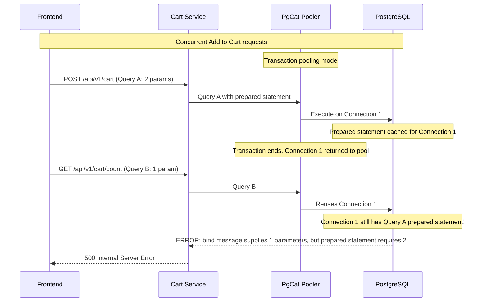

# PgCat Prepared Statement Error - Cart Count 500

## Not This Issue?

If you're seeing a **different error**, check these related docs:

| Error Message | Doc |
|---------------|-----|
| `cannot execute UPDATE in a read-only transaction (SQLSTATE 25006)` | [PgCat Read-Only Transaction Error](PGCAT_READ_ONLY_TRANSACTION_ERROR.md) |
| `Connection refused (os error 111)` / `Shard 0 down or misconfigured: TimedOut` | [PgCat Upstream Connectivity Errors](PGCAT_UPSTREAM_CONNECTIVITY_ERRORS.md) |

---

## Problem

Intermittent 500 errors on `/api/v1/cart/count` when adding items to cart rapidly (>10 consecutive requests).

**Error Message:**

```
error: pq: bind message supplies 1 parameters, but prepared statement "" requires 2
```

**Stacktrace:** `CartHandler.GetCartCount` → `CartService.GetCartCount` → `PostgresCartRepository.GetItemCount`

## Root Cause



**Explanation:**

1. **PgCat transaction mode** returns connections to pool after each transaction
2. **Go `lib/pq` driver** uses server-side prepared statements
3. When connection is **reused** for different query, **old prepared statement** may still be active
4. **Parameter mismatch** causes error

## Solution: Migrate to pgx/v5

**Permanent fix:** Replace `lib/pq` with `github.com/jackc/pgx/v5` which uses client-side prepared statements (simple query protocol by default when used with `pgxpool`).

### Why This Works

| Driver | Prepared Statement Mode | PgCat Compatible |
|--------|------------------------|------------------|
| `lib/pq` | Server-side (cached on PostgreSQL) | ❌ No |
| `lib/pq` + `prefer_simple_protocol=true` | Simple protocol (workaround) | ✅ Yes |
| `pgx/v5` with `pgxpool` (default) | Client-side with statement cache | ⚠️ Partial |
| `pgx/v5` with `QueryExecModeSimpleProtocol` | Simple protocol (no cache) | ✅ Yes |

**IMPORTANT:** Even with `pgx/v5`, you must configure it to use **simple protocol** and **disable statement caching** for full compatibility with transaction-mode poolers:

```go
// Parse DSN into pool config
poolCfg, err := pgxpool.ParseConfig(dsn)
if err != nil {
    return nil, err
}

// Configure for transaction-mode poolers (PgCat/PgBouncer):
// - Use simple protocol to avoid server-side prepared statements
// - Disable statement cache (prepared statements are connection-scoped)
// - Disable description cache
poolCfg.ConnConfig.DefaultQueryExecMode = pgx.QueryExecModeSimpleProtocol
poolCfg.ConnConfig.StatementCacheCapacity = 0
poolCfg.ConnConfig.DescriptionCacheCapacity = 0

// Create pool with configured settings
pool, err := pgxpool.NewWithConfig(ctx, poolCfg)
```

Without this configuration, `pgx/v5` may still use its internal statement cache (`stmtcache_*`) which causes errors like:
```
prepared statement "stmtcache_261f715dc1ec05ba407647df6dcb2cda66737f25b12047d1" does not exist
```

### Migration Applied

All 9 services migrated from `lib/pq` to `pgx/v5 v5.8.0`:

| Service | Database | Pooler | Status |
|---------|----------|--------|--------|
| cart | transaction-db | PgCat | ✅ Migrated |
| order | transaction-db | PgCat | ✅ Migrated |
| product | product-db | PgDog | ✅ Migrated |
| auth | auth-db | PgBouncer | ✅ Migrated |
| user | supporting-db | PgBouncer | ✅ Migrated |
| notification | supporting-db | PgBouncer | ✅ Migrated |
| review | review-db | None | ✅ Migrated |
| shipping | supporting-db | PgBouncer | ✅ Migrated |
| shipping-v2 | supporting-db | PgBouncer | ✅ Migrated |

### Files Changed Per Service

1. **go.mod**: `lib/pq v1.10.9` → `jackc/pgx/v5 v5.8.0`
2. **database.go**: 
   - `sql.DB` → `pgxpool.Pool`
   - `pgxpool.New()` → `pgxpool.ParseConfig()` + `pgxpool.NewWithConfig()`
   - Added `QueryExecModeSimpleProtocol` + disabled statement/description caches
3. **main.go**: `database.Connect()` → `database.Connect(ctx)`
4. **repository** (if exists): `QueryContext/ExecContext` → `Query/Exec`

## Testing

```bash
# Rebuild all services
for svc in cart order product auth user notification review shipping shipping-v2; do
  cd services/$svc && go mod tidy && cd ../..
done

# Deploy to Kubernetes
make flux-push

# Load test: Add to cart 20+ times consecutively
# Verify: No 500 errors, cart count always accurate
```

## Acceptance Criteria

- ✅ Add to cart 20+ times consecutively without 500 errors
- ✅ `/api/v1/cart/count` always returns 200 OK
- ✅ No "bind message supplies X parameters" errors in logs
- ✅ Cart count is accurate and stable

## References

- pgx GitHub: https://github.com/jackc/pgx (13.2k stars, actively maintained)
- lib/pq GitHub: https://github.com/lib/pq (9.8k stars, maintenance mode since 2023)
- PgCat Transaction Pooling: https://github.com/postgresml/pgcat#pool-modes

## Related Issues

- Affected services: All 9 services using PostgreSQL
- Date discovered: 2026-01-21
- Initial fix: Migration from `lib/pq` to `pgx/v5 v5.8.0`
- Additional fix (2026-01-22): Added `QueryExecModeSimpleProtocol` + disabled statement cache to fix `stmtcache_*` errors

## See Also

- [PgCat Read-Only Transaction Error](PGCAT_READ_ONLY_TRANSACTION_ERROR.md) - `SQLSTATE 25006` write-on-replica errors
- [PgCat Upstream Connectivity Errors](PGCAT_UPSTREAM_CONNECTIVITY_ERRORS.md) - Connection refused / shard down errors
