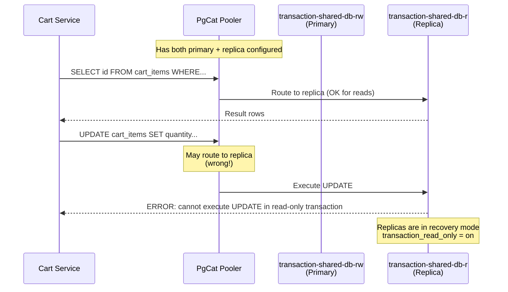

# PgCat Read-Only Transaction Error (SQLSTATE 25006)

## Problem

Intermittent 500 errors on write operations (POST `/api/v1/cart`, etc.) with cart/order services.

**Error Message:**

```
ERROR: cannot execute UPDATE in a read-only transaction (SQLSTATE 25006)
```

**Stacktrace:** `CartHandler.AddToCart` → `CartService.AddToCart` → `PostgresCartRepository.AddItem`

## Symptoms

- Intermittent failures (sometimes 200, sometimes 500)
- Only affects write operations (INSERT, UPDATE, DELETE)
- Read operations (SELECT) work fine
- Error contains `SQLSTATE 25006` or mentions "read-only transaction"

## Root Cause



**Why this happens:**

1. PgCat is configured with both `role = "primary"` and `role = "replica"` servers
2. PgCat does **not automatically parse SQL** to determine read vs write
3. Without explicit read/write enforcement, PgCat may route any query to either server
4. When a write hits the replica, PostgreSQL rejects it (replica is read-only)

## Verification

### 1. Confirm the error is happening on a replica

If you can catch the error in a DB session, run:

```sql
SHOW transaction_read_only;
-- Returns 'on' if connected to replica

SELECT pg_is_in_recovery();
-- Returns 't' (true) if connected to replica
```

### 2. Check PgCat logs for upstream selection

Look for which host PgCat selected when the error occurred:

```bash
kubectl logs -n cart -l app=pgcat-transaction --tail=200 | grep -E "Creating a new server|role:"
```

You'll see entries like:

```
Creating a new server connection Address { ... host: "transaction-shared-db-r.cart.svc.cluster.local", ... role: Replica ...}
```

If writes are going to `transaction-shared-db-r` (Replica), that's the problem.

### 3. Verify current PgCat config

```bash
kubectl get configmap pgcat-transaction-config -n cart -o yaml | grep -A 50 "pgcat.toml"
```

Check if both primary and replica servers are configured without query routing enforcement.

## Current Configuration (Problem)

```toml
# kubernetes/infra/configs/databases/clusters/transaction-shared-db/poolers/configmap.yaml

[[pools.cart.shards.0.servers]]
host = "transaction-shared-db-rw.cart.svc.cluster.local"
role = "primary"

[[pools.cart.shards.0.servers]]
host = "transaction-shared-db-r.cart.svc.cluster.local"
role = "replica"
```

The `role` field alone does **not** enforce routing. PgCat needs additional configuration to route writes to primary only.

## Fix Options

### Option A: Configure PgCat Query Parser (Recommended)

Enable PgCat's query parser to automatically route writes to primary and reads to replicas.

**Add to `[general]` section:**

```toml
[general]
# ... existing settings ...

# Enable query parser for read/write splitting
query_parser_enabled = true

# Route reads to replicas, writes to primary
query_parser_read_write_splitting = true

# Primary handles writes, replica handles reads
primary_reads_enabled = false
```

**Validation after applying:**

```bash
# Restart PgCat to pick up config
kubectl rollout restart deployment pgcat-transaction -n cart

# Test write operation
curl -X POST http://localhost:8080/api/v1/cart -d '{"productId":"1","quantity":1}'

# Should return 200, not 500
# Check PgCat logs - writes should go to transaction-shared-db-rw
```

### Option B: Separate RW/RO PgCat Services

Create two PgCat deployments:

1. **pgcat-rw**: Only `transaction-shared-db-rw` (for all writes)
2. **pgcat-ro**: Only `transaction-shared-db-r` (for read-heavy endpoints)

**Pros:**
- Guaranteed write isolation
- No query parsing overhead
- Clear separation of concerns

**Cons:**
- More infrastructure to manage
- Application must know which endpoint to use

**Implementation:**

```yaml
# pgcat-rw ConfigMap - only primary
[[pools.cart.shards.0.servers]]
host = "transaction-shared-db-rw.cart.svc.cluster.local"
role = "primary"
# NO replica server

# pgcat-ro ConfigMap - only replica
[[pools.cart.shards.0.servers]]
host = "transaction-shared-db-r.cart.svc.cluster.local"
role = "replica"
# NO primary server
```

Then update cart/order Helm values:

```yaml
# For writes
DB_HOST: "pgcat-rw.cart.svc.cluster.local"

# For read-heavy endpoints (optional)
DB_READ_HOST: "pgcat-ro.cart.svc.cluster.local"
```

### Option C: Bypass PgCat (Temporary Isolation Test)

To confirm PgCat routing is the issue, temporarily point cart/order directly to the primary:

**In `kubernetes/apps/cart.yaml` (HelmRelease values):**

```yaml
extraEnv:
  - name: DB_HOST
    value: "transaction-shared-db-rw.cart.svc.cluster.local"  # Direct to primary
  - name: DB_PORT
    value: "5432"
```

**Validation:**

```bash
# Deploy
make flux-push

# Test - should always succeed
curl -X POST http://localhost:8080/api/v1/cart -d '{"productId":"1","quantity":1}'
```

If errors stop, the issue is confirmed as PgCat routing. Then implement Option A or B.

### Option D: Remove Replica from PgCat Config (Quick Fix)

If you don't need read replica routing, simply remove the replica server:

```toml
# Only primary - all queries go here
[[pools.cart.shards.0.servers]]
host = "transaction-shared-db-rw.cart.svc.cluster.local"
role = "primary"

# DELETE or comment out replica server
# [[pools.cart.shards.0.servers]]
# host = "transaction-shared-db-r.cart.svc.cluster.local"
# role = "replica"
```

**Pros:** Simplest fix, guaranteed to work  
**Cons:** Loses read replica load balancing benefits

## Testing After Fix

```bash
# Load test: Add to cart 20+ times consecutively
for i in {1..25}; do
  curl -s -o /dev/null -w "%{http_code}\n" \
    -X POST http://localhost:8080/api/v1/cart \
    -H "Content-Type: application/json" \
    -d '{"productId":"1","quantity":1}'
done

# All responses should be 200 or 201, no 500s
```

## Acceptance Criteria

- No `SQLSTATE 25006` errors in cart/order logs
- All write operations return 200/201
- PgCat logs show writes going to `transaction-shared-db-rw` (Primary)

## Related Issues

- **Affected services:** cart, order (both use PgCat with transaction-shared-db)
- **Date discovered:** 2026-01-22
- **Root cause:** PgCat routing writes to read-only replica without query parsing
- **Chosen fix:** Option A (query parser enabled)

## References

- PgCat GitHub: https://github.com/postgresml/pgcat
- PgCat Configuration: https://github.com/postgresml/pgcat#configuration
- PostgreSQL Read-Only Mode: https://www.postgresql.org/docs/current/runtime-config-client.html#GUC-DEFAULT-TRANSACTION-READ-ONLY

## See Also

- [PgCat Prepared Statement Error](pgcat_prepared_statement_error.md) - Different error: `bind message supplies X parameters`
- [PgCat Upstream Connectivity Errors](pgcat_upstream_connectivity_errors.md) - Connection refused / shard down errors
