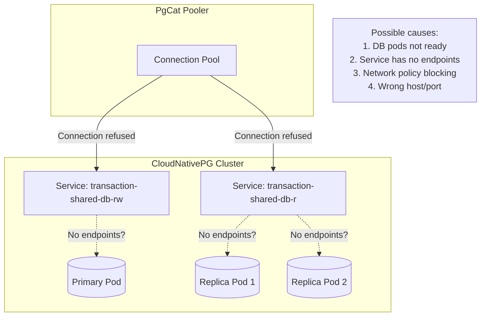

# PgCat Upstream Connectivity Errors

## Problem

PgCat fails to connect to PostgreSQL upstream servers, causing connection pool validation failures and service unavailability.

**Error Messages:**

```
ERROR pgcat::server: Could not connect to server: Connection refused (os error 111)
ERROR pgcat::pool: Shard 0 down or misconfigured: TimedOut
ERROR pgcat::pool: Could not validate connection pool
```

## Symptoms

- PgCat logs show repeated `Connection refused (os error 111)`
- `Shard 0 down or misconfigured: TimedOut` errors
- Pool validation failures at startup or during operation
- Application receives connection errors or timeouts
- Intermittent connectivity (works sometimes, fails other times)

## Root Cause



**Common causes:**

1. **CNPG cluster not ready**: Database pods are starting/initializing
2. **Service has no endpoints**: Kubernetes Service exists but no backing pods are ready
3. **PgCat starts before DB**: Race condition during deployment
4. **Network policy**: Traffic blocked between namespaces
5. **Wrong configuration**: Incorrect host, port, or credentials
6. **DNS resolution failure**: Service name not resolvable

## Verification

### 1. Check if CNPG cluster is ready

```bash
# Check cluster status
kubectl get cluster -n cart transaction-shared-db

# Expected output:
# NAME             AGE   INSTANCES   READY   STATUS
# transaction-shared-db   1h    3           3       Cluster in healthy state

# If READY < INSTANCES, cluster is not fully ready
```

### 2. Check service endpoints

```bash
# Check primary endpoint
kubectl get endpoints -n cart transaction-shared-db-rw
# Should show IP addresses of primary pod

# Check replica endpoints
kubectl get endpoints -n cart transaction-shared-db-r
# Should show IP addresses of replica pods

# If ENDPOINTS column is empty: "<none>", that's the problem
```

### 3. Check pod readiness

```bash
# List all transaction-shared-db pods
kubectl get pods -n cart -l cnpg.io/cluster=transaction-shared-db

# Check if all pods are Running and Ready (1/1 or 2/2)
# If not ready, check pod events:
kubectl describe pod -n cart -l cnpg.io/cluster=transaction-shared-db
```

### 4. Test connectivity from PgCat pod

```bash
# Get PgCat pod name
PGCAT_POD=$(kubectl get pods -n cart -l app=pgcat-transaction -o jsonpath='{.items[0].metadata.name}')

# Test DNS resolution
kubectl exec -n cart $PGCAT_POD -- nslookup transaction-shared-db-rw.cart.svc.cluster.local

# Test TCP connectivity to primary
kubectl exec -n cart $PGCAT_POD -- nc -zv transaction-shared-db-rw.cart.svc.cluster.local 5432

# Test TCP connectivity to replica
kubectl exec -n cart $PGCAT_POD -- nc -zv transaction-shared-db-r.cart.svc.cluster.local 5432
```

### 5. Check PgCat logs for connection attempts

```bash
kubectl logs -n cart -l app=pgcat-transaction --tail=100 | grep -E "Creating a new server|Could not connect|TimedOut|Connection refused"
```

### 6. Verify PgCat config matches actual services

```bash
# Get configured hosts from PgCat config
kubectl get configmap pgcat-transaction-config -n cart -o yaml | grep "host ="

# Compare with actual service names
kubectl get svc -n cart | grep transaction-shared-db
```

## Common Fixes

### Fix 1: Wait for CNPG cluster to be ready

If the cluster is still initializing:

```bash
# Watch cluster status
kubectl get cluster -n cart transaction-shared-db -w

# Wait until STATUS shows "Cluster in healthy state"
# and READY equals INSTANCES (e.g., 3/3)
```

### Fix 2: Restart PgCat after DB is ready

```bash
# Restart PgCat deployment
kubectl rollout restart deployment pgcat-transaction -n cart

# Watch for successful connections in logs
kubectl logs -n cart -l app=pgcat-transaction -f
```

### Fix 3: Add init container to wait for DB

Add an init container to PgCat deployment that waits for DB:

```yaml
# In pgcat deployment
spec:
  template:
    spec:
      initContainers:
        - name: wait-for-db
          image: busybox:1.36
          command: ['sh', '-c']
          args:
            - |
              until nc -z transaction-shared-db-rw.cart.svc.cluster.local 5432; do
                echo "Waiting for transaction-shared-db-rw..."
                sleep 2
              done
              echo "Database is ready"
```

### Fix 4: Configure connection timeouts in PgCat

Add timeout settings to `pgcat.toml`:

```toml
[general]
# ... existing settings ...

# Connection timeout (seconds)
connect_timeout = 10

# Health check interval
healthcheck_delay = 5

# Ban time for unhealthy servers (seconds)
ban_time = 60

# Server lifetime (seconds, 0 = unlimited)
server_lifetime = 3600
```

### Fix 5: Check and fix NetworkPolicy

If using NetworkPolicies, ensure PgCat can reach the database:

```bash
# Check for NetworkPolicies in cart namespace
kubectl get networkpolicy -n cart

# If policies exist, verify they allow:
# - PgCat pods → transaction-shared-db-rw service (port 5432)
# - PgCat pods → transaction-shared-db-r service (port 5432)
```

### Fix 6: Verify credentials

Ensure PgCat credentials match the database:

```bash
# Get credentials from secret
kubectl get secret transaction-shared-db-secret -n cart -o jsonpath='{.data.username}' | base64 -d
kubectl get secret transaction-shared-db-secret -n cart -o jsonpath='{.data.password}' | base64 -d

# Compare with PgCat config
kubectl get configmap pgcat-transaction-config -n cart -o yaml | grep -E "user =|password ="
```

## Startup Ordering (Flux/GitOps)

If using Flux, ensure proper dependency ordering:

```yaml
# In configs.yaml Kustomization
spec:
  dependsOn:
    - name: controllers-local  # Operators must be ready first
  
  healthChecks:
    # Wait for CNPG cluster to be healthy before apps start
    - apiVersion: postgresql.cnpg.io/v1
      kind: Cluster
      name: transaction-shared-db
      namespace: cart
```

**Deployment order should be:**

1. CNPG Operator (controllers)
2. transaction-shared-db Cluster (configs)
3. PgCat pooler (configs, after cluster)
4. Cart/Order services (apps)

## Scaling PgCat: What It Helps vs What It Doesn't

| Scenario | Does scaling to 2+ PgCat pods help? |
|----------|-------------------------------------|
| PgCat pod crash/restart | ✅ Yes - other pod handles traffic |
| Upstream DB not ready | ❌ No - all PgCat pods will fail to connect |
| Network policy blocking | ❌ No - affects all pods equally |
| Wrong credentials | ❌ No - all pods use same config |
| High connection load | ✅ Yes - distributes connections |

**Bottom line:** Scaling PgCat improves **availability** of the pooler itself, but does **not** fix upstream connectivity issues.

## Testing After Fix

```bash
# Watch PgCat logs for successful connections
kubectl logs -n cart -l app=pgcat-transaction -f

# Should see:
# "Creating a new server connection Address { ... role: Primary ... }"
# "Creating a new server connection Address { ... role: Replica ... }"
# WITHOUT "Connection refused" or "TimedOut" errors

# Test application connectivity
curl http://localhost:8080/api/v1/cart
# Should return cart data, not error
```

## Monitoring

### PgCat Prometheus metrics to watch

If PgCat Prometheus exporter is enabled (`enable_prometheus_exporter = true`):

```promql
# Server health (0 = down, 1 = up)
pgcat_servers_health{pool="cart"}

# Connection errors
rate(pgcat_errors_total{pool="cart"}[5m])

# Pool status
pgcat_pools_active_connections{pool="cart"}
pgcat_pools_waiting_clients{pool="cart"}
```

### Alerts to consider

```yaml
# Alert if PgCat cannot reach any backend
- alert: PgCatNoHealthyBackends
  expr: sum(pgcat_servers_health{pool="cart"}) == 0
  for: 1m
  labels:
    severity: critical
  annotations:
    summary: "PgCat has no healthy backends for pool {{ $labels.pool }}"
```

## Related Issues

- **Affected services:** cart, order (both use PgCat)
- **Common trigger:** Fresh cluster deployment, DB restart, network changes
- **Resolution time:** Usually resolves once DB is fully ready

## References

- PgCat GitHub: https://github.com/postgresml/pgcat
- CloudNativePG Services: https://cloudnative-pg.io/documentation/current/service_management/
- Kubernetes Service Endpoints: https://kubernetes.io/docs/concepts/services-networking/service/#endpoints

## See Also

- [PgCat Read-Only Transaction Error](pgcat_read_only_transaction_error.md) - `SQLSTATE 25006` write-on-replica errors
- [PgCat Prepared Statement Error](pgcat_prepared_statement_error.md) - `bind message supplies X parameters` errors
