# Secrets, TLS & Trust — Folder Hub

> Entry point for everything secrets, certificate, and trust-related on the platform.
>
> The platform's secrets pipeline is one chain — pulling them apart loses context:
>
> ```
> OpenBAO  →  ESO  →  K8s Secret  →  cert-manager  →  trust-manager
> ```
>
> All four pieces (and the docs that describe them) live in this folder.

## What's in this folder

| Doc | When to read |
|---|---|
| **This file (`README.md`)** — OpenBAO architecture & operations | OpenBAO internals: HA/Raft, seal/unseal, auth methods, secret engines, lease/policy model, day-2 ops, troubleshooting |
| [`secrets-management.md`](./secrets-management.md) | "How do I add / consume / rotate a secret in this repo?" — ESO patterns, per-namespace ExternalSecret mapping, naming conventions, monitoring |
| [`cert-manager.md`](./cert-manager.md) | cert-manager controller, ClusterIssuers (selfsigned + homelab-ca + Let's Encrypt DNS-01), `kong-proxy-tls` wildcard, deployment runbook, cert/issuer troubleshooting |
| [`trust-distribution.md`](./trust-distribution.md) | trust-manager `homelab-ca-bundle` distribution, two-PKI split, namespace opt-in label, CA rotation runbook |
| [`production-plan.md`](./production-plan.md) | Long-form migration plan from Vault dev → OpenBAO HA on EKS/GKE (auto-unseal, OIDC, dynamic DB creds) |
| [`backlog.md`](./backlog.md) | P1/P2 backlog with industry citations |
| [`vault.md`](./vault.md) | Archived legacy Vault dev-mode docs (kept as historical reference) |

---

# OpenBAO Architecture & Operations Guide

> **Status**: Migration target — replacing HashiCorp Vault (Dev Mode) with OpenBAO HA
>
> **Scope**: Installation, management, operations, and use cases for local Kind + EKS/GKE deployments

---

## 1. What Is OpenBAO?

**OpenBAO** is an open-source fork of HashiCorp Vault, created after the BSL license change in 2023. It is:

- **Apache 2.0 licensed** — truly open-source, no enterprise licensing concerns
- **API-compatible with Vault** — ESO, Kubernetes auth, all existing patterns carry over unchanged
- **CNCF Sandbox project** under the OpenSSF
- **Drop-in replacement** — rename `vault` CLI to `bao`, same REST API paths (`/v1/...`)
- **Actively maintained** — versioned at 2.x (latest stable: 2.5.x as of 2026)

### Why Migrate from Vault Dev Mode

| Problem | Vault Dev Mode | OpenBAO Production |
|---------|---------------|-------------------|
| Data persistence | ❌ In-memory, lost on restart | ✅ Raft PVC, survives reboots |
| Unseal | ❌ Always unsealed with root token | ✅ Auto-unseal via KMS / Transit |
| TLS | ❌ HTTP only | ✅ TLS everywhere |
| High availability | ❌ Single node | ✅ 3-node Raft cluster |
| Root token | ❌ Static `root` in Git | ✅ Revoked after init, operator access via OIDC |
| DB credentials | ❌ Static `postgres/postgres` | ✅ Dynamic, TTL-based, per-service |
| Multi-environment | ❌ One flat namespace | ✅ Namespaces: `local/`, `staging/`, `prod/` |
| License | ❌ BSL (non-OSS) | ✅ Apache 2.0 |

---

## 2. System Architecture

The diagram below summarizes the **logical** HA stack: traffic enters via a load balancer, three Raft peers form the quorum, and each peer persists Raft state to **PVCs**. The following **High-Level Overview** Mermaid diagram adds Kubernetes detail (namespaces, ESO, auth methods, databases).

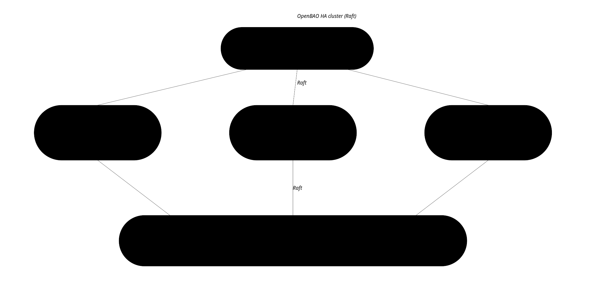

### High-Level Overview

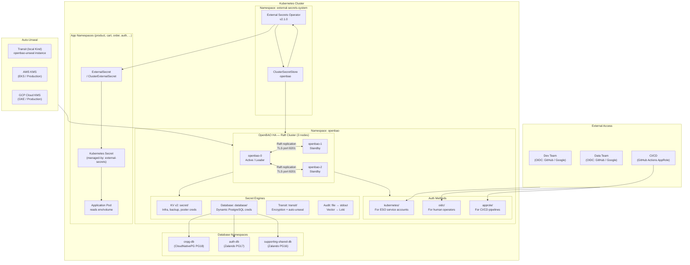

### Raft Cluster Internals

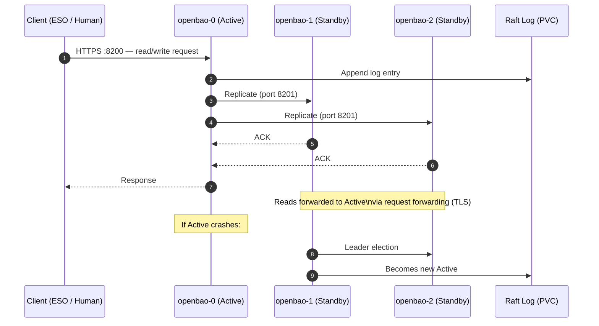

---

## 3. Seal / Unseal Architecture

Unsealing is the process of decrypting the root key so OpenBAO can serve requests. OpenBAO always starts **sealed**.

### Shamir vs Auto-Unseal

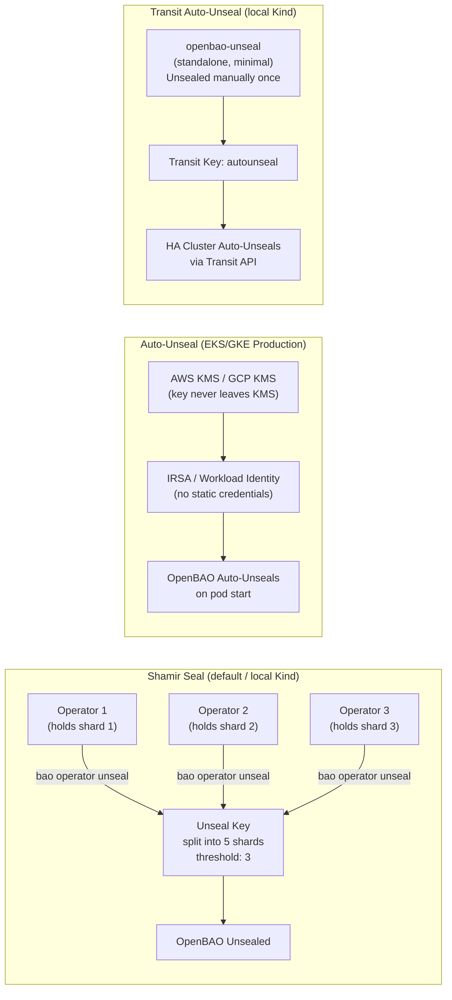

### Unseal Key Management (Init Ceremony)

On first initialization, unseal keys should be split with PGP to prevent any single operator knowing the full key:

```bash
# Production ceremony: 5 shares, threshold 3, each encrypted to a different operator's PGP key
bao operator init \
  -key-shares=5 \
  -key-threshold=3 \
  -pgp-keys="keybase:devops1,keybase:devops2,keybase:devops3,keybase:devops4,keybase:devops5" \
  -root-token-pgp-key="keybase:devops-lead"

# Local Kind (learning): 1 share, 1 threshold, store in 1Password
bao operator init -key-shares=1 -key-threshold=1
```

> **Critical**: After bootstrap is complete, revoke the root token. Operators use OIDC for day-to-day access.

---

## 4. Authentication Methods

### Overview

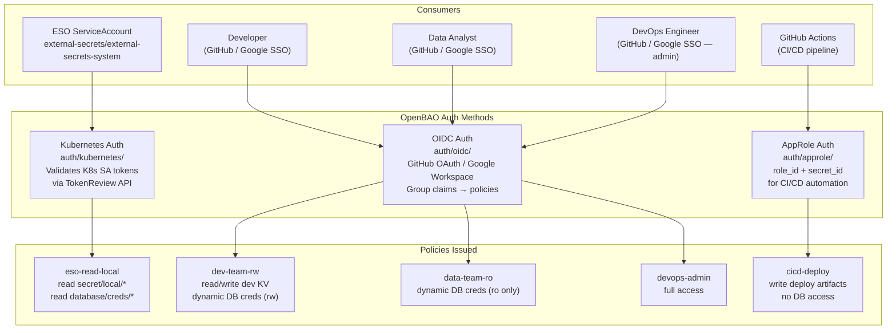

### Kubernetes Auth — ESO Integration

ESO authenticates to OpenBAO using its Kubernetes ServiceAccount token. OpenBAO validates the token against the Kubernetes TokenReview API.

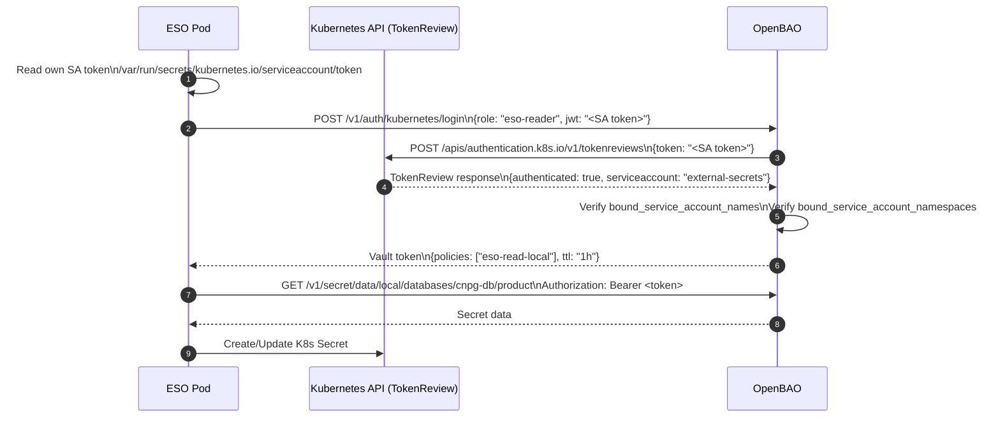

> ⚠️ **Reviewer-JWT pitfall (commit `fb14349`)** — When configuring `auth/kubernetes/config`, **omit** `token_reviewer_jwt` and set `disable_local_ca_jwt=false`. OpenBAO will then call `TokenReview` using its own pod's auto-rotated SA token (long-lived projected token, refreshed by kubelet).
>
> If you instead pass `token_reviewer_jwt=@/var/run/secrets/.../token` from the bootstrap Job's pod, that token is bound by `BoundServiceAccountTokenVolume` to ~1 h. After it expires every login fails with `permission denied` and ESO breaks platform-wide. See [§13 — `Authentication Failing`](#authentication-failing) for the runtime recovery procedure.

### OIDC Auth — Developer / Data Team

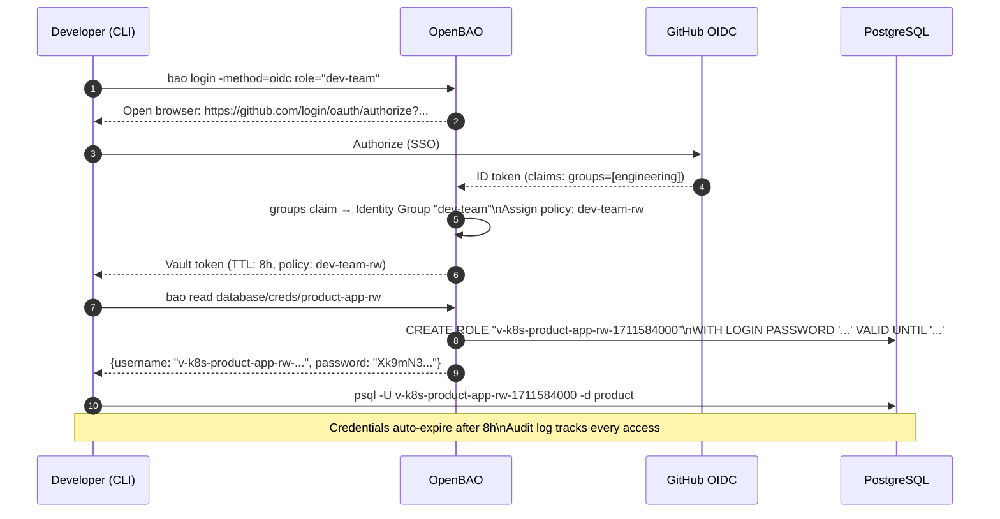

---

## 5. Secret Engines

### 5.1 KV v2 — Static Secrets

Used for infrastructure credentials that cannot be dynamic (S3 backup keys, pooler admin users).

**Path structure** (unchanged from current Vault convention):

```
secret/{environment}/{category}/{service}/{resource}
```

| Environment | Vault Namespace | Use |
|-------------|----------------|-----|
| `local` | `local/` | Kind cluster |
| `staging` | `staging/` | Staging environment |
| `prod` | `prod/` | EKS / GKE production |

**Current KV paths** (seeded at bootstrap):

| Path | Keys | Consumer |
|------|------|---------|
| `secret/local/databases/cnpg-db/product` | `username`, `password` | CNPG bootstrap owner |
| `secret/local/databases/cnpg-db/cart` | `username`, `password` | CNPG cart owner |
| `secret/local/databases/cnpg-db/order` | `username`, `password` | CNPG order owner |
| `secret/local/databases/pgdog-cnpg/credentials` | `username`, `password` | PgDog pooler admin |
| `secret/local/infra/rustfs/backup-zalando` | `access_key_id`, `secret_access_key` | WAL-G S3 (auth, user, review) |
| `secret/local/infra/rustfs/backup-cnpg` | `access_key_id`, `secret_access_key` | Barman S3 (product, cart) |
| `secret/local/infra/cloudflare/api-token` ⚠️ | `api_token` | cert-manager `letsencrypt-{staging,prod}` ClusterIssuers (DNS-01 solver) |

> ⚠️ **Bootstrap-only**: the Cloudflare token is **not** seeded by `openbao-bootstrap` (it is operator-supplied) and **not** in Git. Re-seed after every fresh cluster — see [§12.1 Step 7 — Bootstrap-only Cloudflare token](#step-7--seed-bootstrap-only-cloudflare-token-operator).

### 5.2 Database Secrets Engine — Dynamic Credentials

The **database secrets engine** generates short-lived, unique PostgreSQL credentials on demand. No static passwords exist anywhere.

#### How It Works

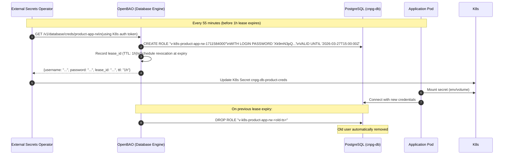

#### Database Connection Configuration

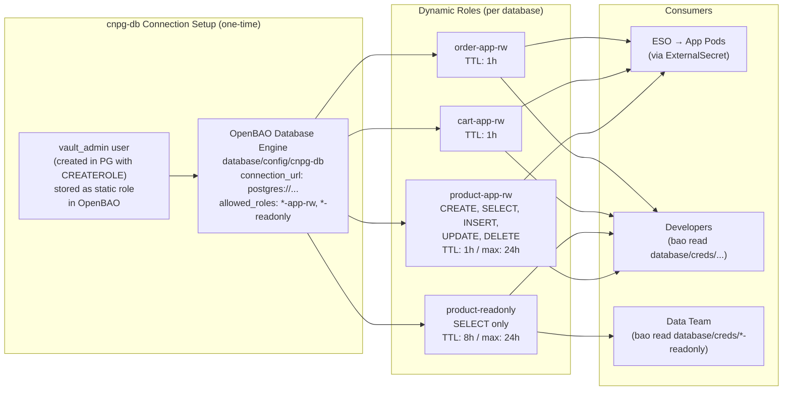

#### Role SQL Templates

**Read-Write role** (application service):
```sql
-- Creation statement (executed by OpenBAO when credential requested)
CREATE ROLE "{{name}}" WITH LOGIN PASSWORD '{{password}}' VALID UNTIL '{{expiration}}';
GRANT CONNECT ON DATABASE product TO "{{name}}";
GRANT USAGE ON SCHEMA public TO "{{name}}";
GRANT SELECT, INSERT, UPDATE, DELETE ON ALL TABLES IN SCHEMA public TO "{{name}}";
ALTER DEFAULT PRIVILEGES IN SCHEMA public
  GRANT SELECT, INSERT, UPDATE, DELETE ON TABLES TO "{{name}}";

-- Revocation statement (executed by OpenBAO on lease expiry)
REVOKE ALL PRIVILEGES ON ALL TABLES IN SCHEMA public FROM "{{name}}";
DROP ROLE IF EXISTS "{{name}}";
```

**Read-only role** (data team / analytics):
```sql
-- Creation statement
CREATE ROLE "{{name}}" WITH LOGIN PASSWORD '{{password}}' VALID UNTIL '{{expiration}}';
GRANT CONNECT ON DATABASE product TO "{{name}}";
GRANT USAGE ON SCHEMA public TO "{{name}}";
GRANT SELECT ON ALL TABLES IN SCHEMA public TO "{{name}}";
ALTER DEFAULT PRIVILEGES IN SCHEMA public GRANT SELECT ON TABLES TO "{{name}}";

-- Revocation statement
REVOKE ALL PRIVILEGES ON ALL TABLES IN SCHEMA public FROM "{{name}}";
DROP ROLE IF EXISTS "{{name}}";
```

---

## 6. Database Credential Workflows

### 6.1 Current State Problems

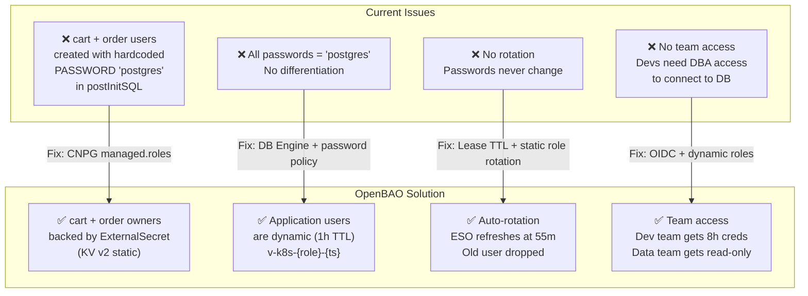

### 6.2 Database User Architecture

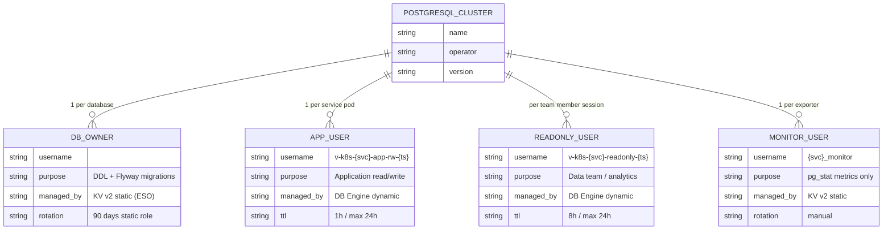

### 6.3 CloudNativePG (cnpg-db) — Credential Flow

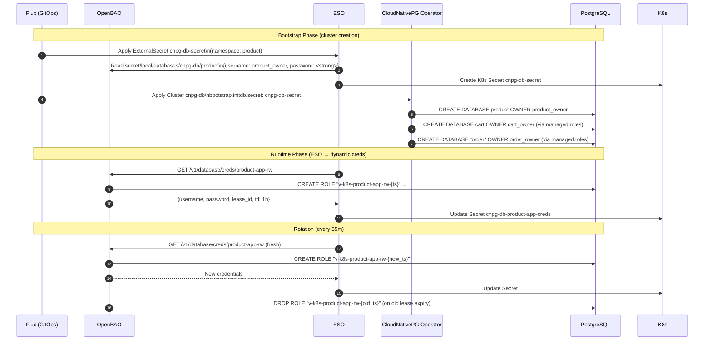

### 6.4 Zalando Operator — Credential Strategy

Zalando manages its own K8s secrets natively (creates `{user}.{cluster}.credentials.postgresql.acid.zalan.do`). The recommended strategy is **additive**: keep Zalando-managed owner secrets, add application users via OpenBAO dynamic engine.

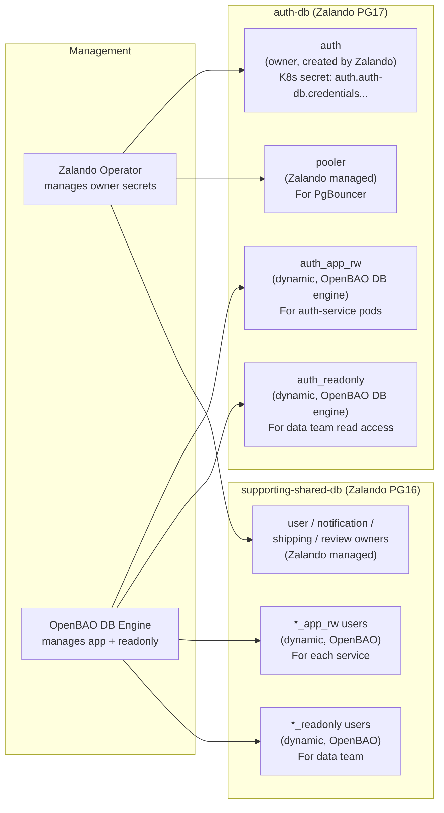

---

## 7. ESO Integration

### ClusterSecretStore (Production)

```yaml
apiVersion: external-secrets.io/v1
kind: ClusterSecretStore
metadata:
  name: openbao
spec:
  provider:
    vault:
      server: "https://openbao.openbao.svc.cluster.local:8200"
      path: "secret"
      version: "v2"
      namespace: "local"           # OpenBAO namespace (multi-env isolation)
      caBundle: <base64-ca-cert>   # cert-manager issued CA
      auth:
        kubernetes:
          mountPath: "kubernetes"
          role: "eso-reader"
          serviceAccountRef:
            name: external-secrets
            namespace: external-secrets-system
```

### ExternalSecret Pattern (Static KV)

```yaml
apiVersion: external-secrets.io/v1
kind: ExternalSecret
metadata:
  name: cnpg-db-secret
  namespace: product
spec:
  refreshInterval: 1h
  secretStoreRef:
    name: openbao
    kind: ClusterSecretStore
  target:
    name: cnpg-db-secret
    creationPolicy: Owner
    deletionPolicy: Retain
    template:
      type: Opaque
      metadata:
        labels:
          cnpg.io/reload: "true"    # Triggers CNPG to reload on rotation
  data:
    - secretKey: username
      remoteRef:
        key: secret/data/local/databases/cnpg-db/product
        property: username
    - secretKey: password
      remoteRef:
        key: secret/data/local/databases/cnpg-db/product
        property: password
```

### ESO Sync Flow

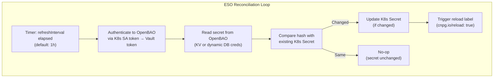

---

## 8. Policies

Policies follow the principle of **least privilege**. No wildcard access in production.

### Policy Hierarchy

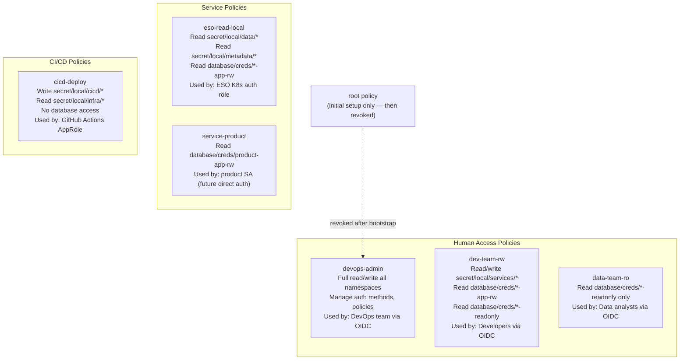

### Policy Syntax Example

```hcl
# eso-read-local: ESO service account policy (scoped paths, not wildcard)
path "secret/data/local/databases/*" {
  capabilities = ["read", "list"]
}
path "secret/metadata/local/databases/*" {
  capabilities = ["read", "list"]
}
path "secret/data/local/infra/*" {
  capabilities = ["read", "list"]
}
path "secret/metadata/local/infra/*" {
  capabilities = ["read", "list"]
}
# Dynamic DB credentials
path "database/creds/*-app-rw" {
  capabilities = ["read"]
}

# dev-team-rw: Developer policy with identity templating
path "secret/data/local/services/{{identity.entity.name}}/*" {
  capabilities = ["create", "read", "update", "delete", "list"]
}
path "database/creds/*-app-rw" {
  capabilities = ["read"]
}
path "database/creds/*-readonly" {
  capabilities = ["read"]
}
```

---

## 9. Namespaces (Multi-Environment)

OpenBAO namespaces provide isolated environments within a single cluster instance. Each namespace has its own secret engines, auth methods, and policies.

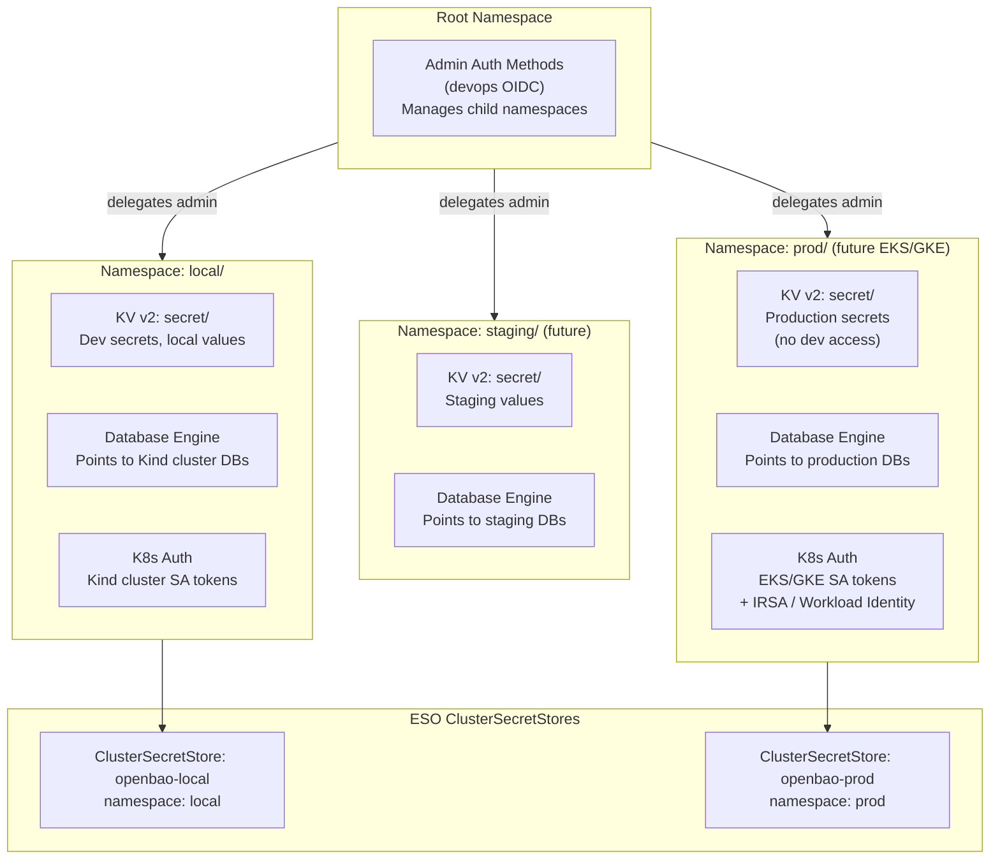

---

## 10. Lease, Renewal, and Revocation

Every dynamic credential in OpenBAO has a **lease** — a time-bounded grant to the secret.

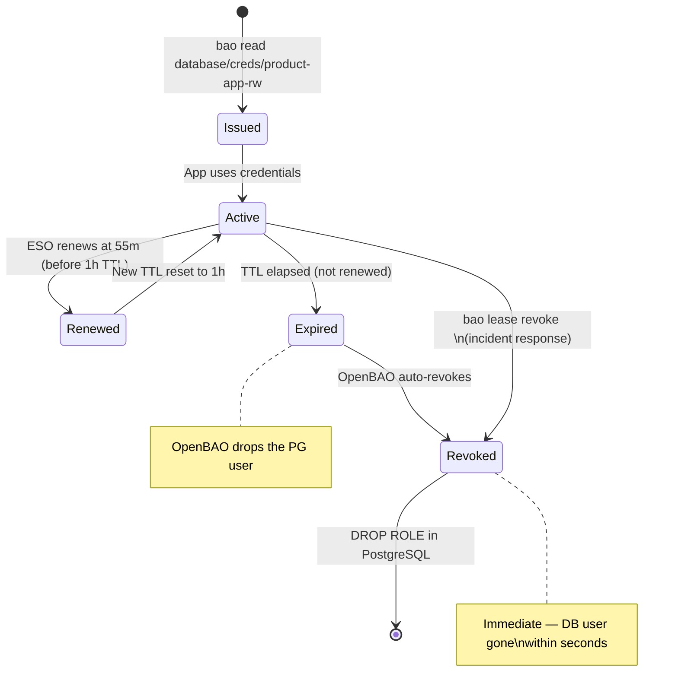

### Lease Commands

```bash
# List all active leases for a role
bao list sys/leases/lookup/database/creds/product-app-rw/

# Inspect a specific lease
bao lease lookup database/creds/product-app-rw/<lease-id>

# Renew a lease manually (normally done by ESO)
bao lease renew database/creds/product-app-rw/<lease-id>

# Revoke a single lease (compromised credential)
bao lease revoke database/creds/product-app-rw/<lease-id>

# Revoke ALL leases for a role (incident response — all apps get new creds on next refresh)
bao lease revoke -prefix database/creds/product-app-rw/
```

---

## 11. Password Policies

Custom password policies enforce strength requirements for all dynamically generated credentials.

```hcl
# Policy: db-strong (applied to all DB engine roles)
length = 32

rule "charset" {
  charset   = "abcdefghijklmnopqrstuvwxyz"
  min-chars = 4
}
rule "charset" {
  charset   = "ABCDEFGHIJKLMNOPQRSTUVWXYZ"
  min-chars = 4
}
rule "charset" {
  charset   = "0123456789"
  min-chars = 4
}
rule "charset" {
  charset   = "!@#%^&*()-_=+"
  min-chars = 2
}
```

Apply to a database role:
```bash
bao write database/roles/product-app-rw \
  db_name=cnpg-db \
  password_policy="db-strong" \
  creation_statements="..." \
  default_ttl="1h" \
  max_ttl="24h"
```

---

## 12. Operations Guide

### 12.1 Initial Setup

```bash
# 1. Check cluster status after deployment
kubectl get pods -n openbao

# 2. Initialize (first time only — saves keys)
kubectl exec -n openbao openbao-0 -- bao operator init \
  -key-shares=1 -key-threshold=1 -format=json > /tmp/openbao-init.json

# 3. Unseal all nodes (Shamir / local Kind)
UNSEAL_KEY=$(cat /tmp/openbao-init.json | jq -r '.unseal_keys_b64[0]')
kubectl exec -n openbao openbao-0 -- bao operator unseal $UNSEAL_KEY
kubectl exec -n openbao openbao-1 -- bao operator unseal $UNSEAL_KEY
kubectl exec -n openbao openbao-2 -- bao operator unseal $UNSEAL_KEY

# 4. Login with root token (one time only)
ROOT_TOKEN=$(cat /tmp/openbao-init.json | jq -r '.root_token')
kubectl exec -n openbao openbao-0 -- bao login $ROOT_TOKEN

# 5. Run bootstrap job (engines, auth, policies, namespaces, DB config)
kubectl create job --from=cronjob/openbao-bootstrap openbao-bootstrap-manual -n openbao

# 6. Revoke root token after bootstrap is verified
kubectl exec -n openbao openbao-0 -- bao token revoke $ROOT_TOKEN
```

### Step 7 — Seed bootstrap-only Cloudflare token (operator)

The Cloudflare API token used by cert-manager DNS-01 is **operator-supplied**: it is **not** in Git and **not** seeded by the bootstrap Job. Re-seed it after every fresh cluster, then trigger downstream reconciles:

```bash
# Re-fetch root token from K8s Secret (kept across pod restarts via PVC)
ROOT=$(kubectl get secret -n openbao openbao-init-keys -o jsonpath='{.data.root_token}' | base64 -d)

kubectl exec -n openbao openbao-0 -- sh -c \
  "BAO_TOKEN=$ROOT bao kv put secret/local/infra/cloudflare/api-token api_token=cfut_..."

# Force ESO to re-sync the per-namespace ExternalSecret in cert-manager
kubectl annotate clustersecretstore openbao force-sync=$(date +%s) --overwrite

# Make Flux re-evaluate cert-manager (will issue letsencrypt-prod cert once the Secret lands)
flux reconcile ks secrets-local --with-source
flux reconcile ks cert-manager-local --with-source
```

Verify: `kubectl get secret cloudflare-api-token -n cert-manager` should exist with key `api-token`. The `kong-proxy-tls` Certificate then transitions to `Ready=True`.

### 12.2 Unseal After Node Restart

```bash
# Check seal status on all nodes
for i in 0 1 2; do
  echo "openbao-$i:"
  kubectl exec -n openbao openbao-$i -- bao status 2>/dev/null | grep -E "Sealed|HA Mode"
done

# Unseal sealed nodes (only needed if auto-unseal is NOT configured)
kubectl exec -n openbao openbao-0 -- bao operator unseal <unseal-key>
```

### 12.3 Raft Snapshot (Backup)

```bash
# Take a snapshot (run before upgrades or on a weekly schedule)
kubectl exec -n openbao openbao-0 -- \
  bao operator raft snapshot save /tmp/openbao-$(date +%Y%m%d).snap

kubectl cp openbao/openbao-0:/tmp/openbao-$(date +%Y%m%d).snap \
  ./openbao-$(date +%Y%m%d).snap

# Restore from snapshot (disaster recovery)
kubectl exec -n openbao openbao-0 -- \
  bao operator raft snapshot restore -force /tmp/openbao-restore.snap
```

### 12.4 Rotate Static Secrets

```bash
# Rotate S3 backup credentials
bao kv put local/secret/infra/rustfs/backup-cnpg \
  access_key_id=<new-key> \
  secret_access_key=<new-secret>

# Force ESO to refresh immediately (instead of waiting for refreshInterval)
kubectl annotate externalsecret pg-backup-rustfs-cnpg -n product \
  force-sync=$(date +%s) --overwrite
```

### 12.5 Revoke Compromised Credential

```bash
# Single credential (known lease ID)
bao lease revoke database/creds/product-app-rw/abc123xyz

# All credentials for a role (incident response)
bao lease revoke -prefix database/creds/product-app-rw/

# Verify the PostgreSQL user was dropped
kubectl exec -n product cnpg-db-1 -- \
  psql -U postgres -c "\du" | grep "v-k8s-product"
```

### 12.6 Add a New Service (Onboarding)

```bash
# 1. Create OpenBAO policy
bao policy write service-newservice - <<EOF
path "database/creds/newservice-app-rw" {
  capabilities = ["read"]
}
EOF

# 2. Create Kubernetes auth role
bao write auth/kubernetes/role/newservice \
  bound_service_account_names=newservice \
  bound_service_account_namespaces=newservice \
  policies=service-newservice \
  ttl=1h

# 3. Configure DB role in OpenBAO database engine
bao write database/roles/newservice-app-rw \
  db_name=cnpg-db \
  creation_statements="CREATE ROLE \"{{name}}\" WITH LOGIN PASSWORD '{{password}}' VALID UNTIL '{{expiration}}'; ..." \
  password_policy=db-strong \
  default_ttl=1h \
  max_ttl=24h

# 4. Create ExternalSecret manifest in kubernetes/infra/configs/databases/clusters/cnpg-db/secrets/
```

### 12.7 Check Status

```bash
# OpenBAO cluster health
kubectl exec -n openbao openbao-0 -- bao status

# Raft peers
kubectl exec -n openbao openbao-0 -- bao operator raft list-peers

# Active leases (count)
kubectl exec -n openbao openbao-0 -- bao list sys/leases/lookup/database/creds/

# ESO sync status
kubectl get externalsecret -A
kubectl get clustersecretstore openbao

# Specific ExternalSecret state
kubectl describe externalsecret cnpg-db-secret -n product
```

---

## 13. Troubleshooting

### ExternalSecret Not Syncing

```bash
# Check ESO pod for errors
kubectl logs -n external-secrets-system deployment/external-secrets | grep ERROR

# Describe the ExternalSecret (shows last sync error)
kubectl describe externalsecret <name> -n <namespace>

# Check ClusterSecretStore connectivity
kubectl get clustersecretstore openbao -o yaml | grep -A10 conditions

# Verify OpenBAO is reachable from ESO namespace
kubectl run -it --rm test --image=curlimages/curl -n external-secrets-system \
  -- curl -sk https://openbao.openbao.svc.cluster.local:8200/v1/sys/health
```

### Authentication Failing

#### `permission denied` ~1 h after bootstrap (reviewer-JWT pitfall, fb14349)

**Symptom**: every ExternalSecret reports `ClusterSecretStore "openbao" is not ready`; ESO logs show `Code: 403 ... permission denied` on `/v1/auth/kubernetes/login`. Often appears 1–2 h after `make up`, not at start.

**Root cause**: legacy bootstrap wrote `auth/kubernetes/config` with `token_reviewer_jwt` set to its own projected SA token (1 h TTL via `BoundServiceAccountTokenVolume`). After expiry, every K8s-auth login fails. Fix in `fb14349`: omit `token_reviewer_jwt` and set `disable_local_ca_jwt=false` so OpenBAO uses its own pod's auto-rotated SA token.

**Verify**:

```bash
ROOT=$(kubectl get secret openbao-init-keys -n openbao -o jsonpath='{.data.root_token}' | base64 -d)
kubectl exec -n openbao openbao-0 -- sh -c "BAO_TOKEN=$ROOT bao read auth/kubernetes/config"
# Expect: token_reviewer_jwt_set=false, disable_local_ca_jwt=false
```

**Runtime fix** (deadlock: `secrets-local` is what installs the fix — break the loop manually):

```bash
kubectl exec -n openbao openbao-0 -- sh -c \
  "BAO_TOKEN=$ROOT bao write auth/kubernetes/config \
    kubernetes_host=https://10.96.0.1:443 \
    kubernetes_ca_cert=@/var/run/secrets/kubernetes.io/serviceaccount/ca.crt \
    disable_local_ca_jwt=false token_reviewer_jwt=''"
kubectl annotate clustersecretstore openbao force-sync=$(date +%s) --overwrite
```

**Persistent fix** (bootstrap script now ships corrected logic):

```bash
kubectl delete job -n openbao openbao-bootstrap
flux reconcile ks secrets-local --with-source
```

#### General K8s auth checks

```bash
# Check Kubernetes auth config in OpenBAO
bao read auth/kubernetes/config

# Test the K8s auth manually
SA_TOKEN=$(kubectl create token external-secrets -n external-secrets-system)
curl -sk https://openbao.openbao.svc.cluster.local:8200/v1/auth/kubernetes/login \
  -d "{\"role\":\"eso-reader\",\"jwt\":\"$SA_TOKEN\"}"

# Check audit log (Vector → Loki) for denied requests
# In Grafana: {namespace="openbao", stream="stdout"} | json | type="response" | error!=""
```

### Dynamic Credentials Not Working

```bash
# Check database engine status
bao read database/config/cnpg-db

# Test connection manually
bao write -f database/rotate-root/cnpg-db  # Tests connectivity (rotates root creds)

# Check database role definition
bao read database/roles/product-app-rw

# Manually request credentials (debug)
bao read database/creds/product-app-rw
```

### OpenBAO Node Sealed

```bash
# Check all nodes
kubectl get pods -n openbao -o wide

# Check seal status
kubectl exec -n openbao openbao-0 -- bao status | grep Sealed

# Unseal (if auto-unseal not configured)
kubectl exec -n openbao openbao-0 -- bao operator unseal <key>

# Check auto-unseal connectivity (Transit)
kubectl logs -n openbao openbao-0 | grep -i "unseal\|transit\|seal"
```

### Flux `secrets-local` stuck / `ClusterSecretStore` 503 / Job hangs

**Symptoms:** `flux get ks` shows `secrets-local` Unknown or HealthCheckFailed; `ClusterSecretStore` events show **503 Vault is sealed**; Job `openbao/openbao-bootstrap` log stops at **Waiting for sealed:false on openbao-0** / **Waiting for service…** or runs for hours.

**Cause (common):** OpenBAO **Raft nodes are sealed** after restart, or the bootstrap script used a **health URL without `sealedcode=200`**, so `wget` got **503** with no JSON and the wait loop never matched `sealed:false` (fixed in GitOps bootstrap script).

**Cause (cold start / script):** After unseal, all nodes can be unsealed while the **ClusterIP Service** still has **no Ready endpoints** for a short time (readinessProbe). The bootstrap script now **waits for `sealed:false` on `openbao-0` first** (same DNS as Phase 1), uses a **grep** that allows JSON whitespace around `sealed`, then **optionally** confirms the Service URL; on Service timeout it logs a **warning** and truncated health (Phase 4 uses `$BAO_ADDR` — check `kubectl get endpoints -n openbao openbao` if login fails).

**Recover (operations):**

1. **Confirm seal state**

   ```bash
   kubectl exec -n openbao openbao-0 -- bao status
   ```

2. **Unseal** using the key stored in Secret `openbao/openbao-init-keys` (keys `unseal_key`, `root_token` — base64 in the Secret; decode for the unseal key). Run on **each** node if needed:

   ```bash
   UNSEAL_KEY='<plaintext-unseal-key>'
   for i in 0 1 2; do
     kubectl exec -n openbao openbao-$i -- env BAO_ADDR="http://127.0.0.1:8200" bao operator unseal "$UNSEAL_KEY"
   done
   kubectl exec -n openbao openbao-0 -- bao status
   ```

3. **Delete the stuck Job** so a new pod can run the updated script (after GitOps push) or finish Phase 4:

   ```bash
   kubectl delete job openbao-bootstrap -n openbao
   ```

4. **Reconcile Flux** (order matters for `dependsOn`):

   ```bash
   flux reconcile kustomization secrets-local -n flux-system --with-source
   flux reconcile kustomization databases-local -n flux-system --with-source
   flux reconcile kustomization apps-local -n flux-system --with-source
   ```

5. **Verify** `kubectl get clustersecretstore openbao` → Ready=True; `flux get ks -A` → `secrets-local` True.

**Homelab only:** plaintext unseal key in Kubernetes Secret — do not use this pattern in production without KMS auto-unseal.

---

## 14. Use Cases

### Use Case 1: Application Database Access (Hourly Rotation)

Microservice `product-service` never stores a database password. Each pod gets fresh credentials every hour via ESO.

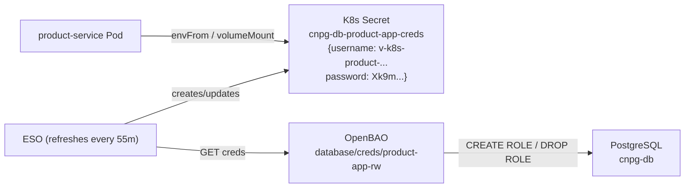

### Use Case 2: 90-Day Compliance Rotation (EKS/GKE)

For static owner users required by Flyway migrations — scheduled automatic rotation every 90 days:

```bash
# Create static role with automatic rotation
bao write database/static-roles/product-owner \
  db_name=cnpg-db \
  username=product_owner \
  rotation_statements=["ALTER USER \"{{name}}\" WITH PASSWORD '{{password}}';"] \
  rotation_period=2160h   # 90 days

# ESO pulls the rotated password at next refreshInterval
# Flyway migration pods read from this secret before running
```

### Use Case 3: Developer Database Access (On-Demand)

```bash
# Developer login via OIDC (one command — browser opens)
bao login -method=oidc role="dev-team"

# Request temporary credentials for any database
bao read database/creds/product-app-rw     # 8h TTL
bao read database/creds/cart-app-rw
bao read database/creds/order-readonly

# Connect directly
psql -h cnpg-db-rw.product.svc.cluster.local \
     -U $(bao read -field=username database/creds/product-app-rw) \
     -d product
```

### Use Case 4: Data Team Analytics Access (Read-Only)

```bash
# Data analyst authenticates
bao login -method=oidc role="data-team"

# Request read-only creds for BI tool (Metabase, Superset)
bao read database/creds/product-readonly  # SELECT only, 8h TTL
bao read database/creds/order-readonly

# Configure Metabase data source with these credentials
# When TTL expires, re-request — data team policy enforces read-only always
```

### Use Case 5: CI/CD Pipeline Secret Access

```bash
# GitHub Actions workflow — AppRole auth
VAULT_TOKEN=$(curl -sk https://openbao.openbao.svc.cluster.local:8200/v1/auth/approle/login \
  -d "{\"role_id\":\"$VAULT_ROLE_ID\",\"secret_id\":\"$VAULT_SECRET_ID\"}" \
  | jq -r '.auth.client_token')

# Read deploy config (1h token, non-renewable, limited to cicd-deploy policy)
DB_MIGRATION_PASSWORD=$(curl -sk \
  -H "X-Vault-Token: $VAULT_TOKEN" \
  https://openbao.openbao.svc.cluster.local:8200/v1/secret/data/local/cicd/flyway-config \
  | jq -r '.data.data.password')
```

### Use Case 6: Incident Response — Credential Compromise

```bash
# A developer's laptop was compromised. Revoke all their leases immediately.
# 1. Find their entity in OpenBAO
bao list identity/entity/name/

# 2. Revoke their token (if known)
bao token revoke <token>

# 3. Revoke all dynamic DB credentials they held
bao lease revoke -prefix database/creds/

# 4. Audit log shows exactly what they accessed (Grafana Loki query):
# {namespace="openbao"} | json | auth_display_name="john.doe@company.com"

# 5. Create new OIDC session next time with MFA enforced
```

---

## 15. Rotation Schedule Summary

| Credential | Type | TTL | Rotation Mechanism |
|-----------|------|-----|-------------------|
| App service DB creds (`*-app-rw`) | Dynamic | 1h / max 24h | ESO refreshInterval: 55m |
| Developer DB creds | Dynamic | 8h / max 16h | OIDC session expiry |
| Data team DB creds (`*-readonly`) | Dynamic | 8h / max 24h | OIDC session expiry |
| Owner/DDL creds (Flyway) | Static role | 90 days | OpenBAO `rotation_period` |
| ESO Vault token | Service token | 1h, renewable | Kubernetes auth TTL |
| S3 backup creds (KV) | Static | N/A | Manual (`bao kv put`) |
| PgDog pooler admin (KV) | Static | N/A | Manual |
| OIDC developer sessions | Token | 8h, non-renewable | Session expiry |
| CI/CD AppRole tokens | Batch token | 1h, non-renewable | Per pipeline run |

---

## 16. File Reference

### Infrastructure Files

| File | Purpose |
|------|---------|
| `kubernetes/infra/controllers/secrets/openbao/helmrelease.yaml` | OpenBAO HA Helm chart |
| `kubernetes/infra/controllers/secrets/external-secrets/helmrelease.yaml` | ESO HelmRelease |
| `kubernetes/infra/configs/secrets/openbao-bootstrap/` | Init scripts (phased) |
| `kubernetes/infra/configs/secrets/cluster-secret-store.yaml` | ClusterSecretStore (openbao) |
| `kubernetes/infra/configs/secrets/cluster-external-secrets/` | ClusterExternalSecret definitions |
| `kubernetes/infra/configs/secrets/cluster-external-secrets/cloudflare.yaml` | `ExternalSecret` (per-namespace) for cert-manager DNS-01 — file lives in CES dir but is `kind: ExternalSecret` since cert-manager only needs the Secret in one namespace |
| `kubernetes/infra/configs/databases/clusters/*/secrets/` | Per-cluster ExternalSecret definitions |

### Helm Sources

| File | Purpose |
|------|---------|
| `kubernetes/clusters/local/sources/helm/openbao.yaml` | OpenBAO Helm repository |
| `kubernetes/clusters/local/sources/helm/external-secrets.yaml` | ESO Helm repository |

---

## 17. Migration from Vault Dev Mode

### Phase Checklist

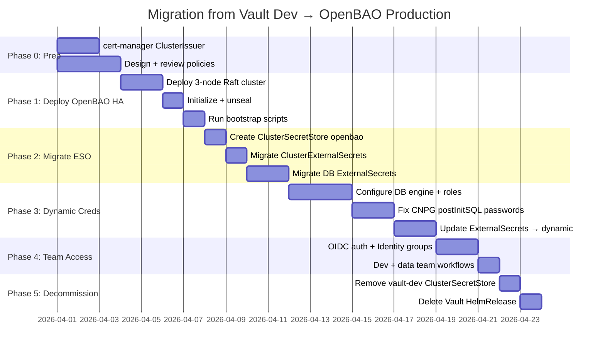

---

## 18. Related Documentation

- [Production Plan](./production-plan.md) — Feature selection matrix and architecture decisions
- [Secrets Management Guide](./secrets-management.md) — ESO patterns, path conventions, operations
- [cert-manager](./cert-manager.md) — Certificate issuers and `kong-proxy-tls` wildcard pipeline
- [Trust Distribution](./trust-distribution.md) — trust-manager `homelab-ca-bundle` distribution
- [Vault Architecture & Bootstrap](./vault.md) — Archived Vault dev-mode docs
- [Secrets Backlog](./backlog.md) — Pending improvements
- [OpenBAO Documentation](https://openbao.org/docs)
- [OpenBAO Helm Chart](https://openbao.org/docs/platform/k8s/helm)
- [External Secrets Operator](https://external-secrets.io/)
- [CloudNativePG External Secrets Integration](https://cloudnative-pg.io/docs/1.28/cncf-projects/external-secrets)
