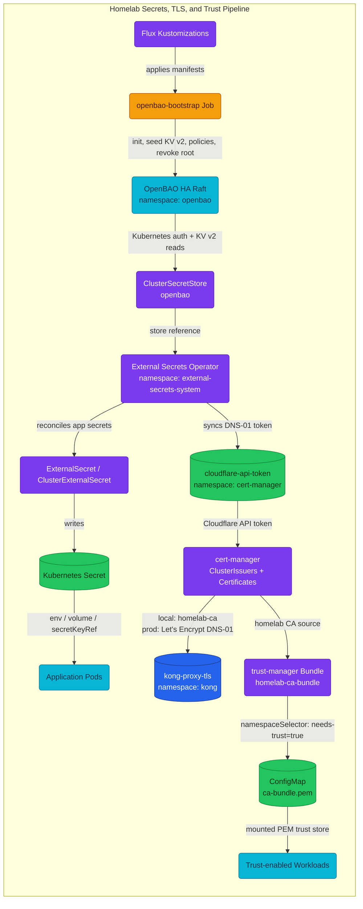
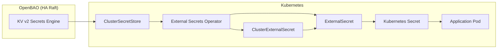
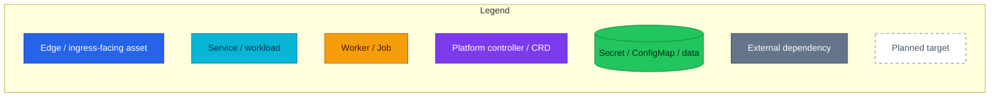

# Secrets, TLS & Trust

Entry point for the homelab secrets, certificate, and trust chain.

The platform treats secrets delivery as one pipeline: OpenBAO is the source of
truth, External Secrets Operator materializes Kubernetes Secrets, cert-manager
uses one of those Secrets for DNS-01 TLS issuance, and trust-manager distributes
the internal CA bundle to opted-in namespaces. Application pods consume Kubernetes
Secrets — they never call OpenBAO directly.

## Quick Facts

| Topic | Current local Kind state | Production target |
|---|---|---|
| Secret store | OpenBAO HA, 3 Raft pods, PVC-backed | Same HA shape, production seal/TLS hardening |
| App secret delivery | ESO reads OpenBAO KV v2 and writes Kubernetes Secrets | Same, plus dynamic DB credentials |
| OpenBAO endpoint | Plain HTTP in-cluster (`tlsDisable: true`) | TLS via cert-manager |
| OpenBAO unseal | `awskms` auto-unseal via the floci KMS emulator (pods self-unseal at boot); `openbao-init-keys` holds only a break-glass recovery key; root token revoked ([ADR-024](../proposals/adr/ADR-024-floci-kms-emulator-auto-unseal/)) | Real cloud KMS (swap floci `endpoint`) |
| TLS issuer split | Local `kong-proxy-tls` is signed by `homelab-ca` | Prod `kong-proxy-tls` is Let's Encrypt via Cloudflare DNS-01 |
| Trust distribution | trust-manager distributes `homelab-ca-bundle` to labeled namespaces | Same, with rotation runbooks |
| Unsafe local choices | Dev placeholders, root token persistence, plaintext listener | Remove before production; tracked by RFC-0008 |

## What To Read

| Need | Canonical doc |
|---|---|
| Understand the whole homelab secrets/TLS/trust chain | This file |
| Understand OpenBAO internals: HA/Raft, seal, auth, engines, policies | [OpenBAO Architecture](./openbao.md) |
| Add, rotate, or troubleshoot an ESO-managed secret | [Runbooks](./runbooks/) |
| Understand/rotate the RS256 JWT signing key (auth signs, Kong verifies) | [OpenBAO — JWT signing key](./openbao.md#jwt-signing-key-auth--kong) |
| Understand cert-manager, Let's Encrypt DNS-01, and `kong-proxy-tls` | [cert-manager + Let's Encrypt](./cert-manager.md) |
| Understand `homelab-ca-bundle`, namespace opt-in, and CA rotation | [Trust Distribution](./trust-distribution.md) |
| Study production hardening targets | [Production Hardening](./production-hardening.md) and [RFC-0008](../proposals/rfc/RFC-0008/) |
| Review accepted decisions | [ADR-004](../proposals/adr/ADR-004-enable-openbao-audit-logging/) and [ADR-005](../proposals/adr/ADR-005-openbao-ha-raft/) |

## Overview

This project uses **OpenBAO** (Apache 2.0 fork of HashiCorp Vault) as the source of
truth for secrets, with **External Secrets Operator (ESO)** syncing secrets to
Kubernetes. This approach:

- Centralizes secret management in OpenBAO
- Eliminates plaintext secrets in Git (eventual goal)
- Provides audit trails for secret access
- Enables secret rotation without redeployment
- Runs a production-ready HA cluster (3-node Raft) — not dev mode

## Architecture

### Platform pipeline



### ESO sync path



### Legend



### Components

| Component | Purpose | Namespace | Version |
|-----------|---------|-----------|---------|
| OpenBAO (HA) | Secret storage (3-node Raft) | `openbao` | 2.5.x |
| External Secrets Operator | Sync secrets to K8s | `external-secrets-system` | **v2.5.0** |
| ClusterSecretStore | OpenBAO connection config | cluster-scoped | `openbao` |
| ClusterExternalSecret | Shared secrets across namespaces | cluster-scoped | Backup creds |
| ExternalSecret | Per-secret definition | app namespaces | Creates K8s Secrets |

OpenBAO runs HA with Raft integrated storage (3 replicas, 10Gi PVC per node),
Kubernetes auth for ESO (`eso-reader` role), KV v2 at path `secret/`, and
best-effort stdout audit → Vector → VictoriaLogs. Local Kind **auto-unseals** via the
floci KMS emulator (`seal "awskms"`, RFC-0008 / ADR-024) — pods self-unseal at boot,
root token revoked; production target is a real cloud KMS. See
[OpenBAO Architecture](./openbao.md) for internals.

### Deployed Flow

| Step | Component | What happens |
|---|---|---|
| 1 | Flux | Applies OpenBAO, ESO, cert-manager, trust-manager, and their config Kustomizations in dependency order |
| 2 | OpenBAO bootstrap | Ensures the floci KMS alias, initializes OpenBAO (**awskms auto-unseal** — pods self-unseal), enables KV v2, Kubernetes auth, policies, seeds learning secrets, then **revokes the root token** |
| 3 | ClusterSecretStore | Points ESO at `http://openbao.openbao.svc.cluster.local:8200` with Kubernetes auth role `eso-reader` |
| 4 | ESO | Reads OpenBAO paths and materializes Kubernetes Secrets with `refreshInterval: 1h` |
| 5 | cert-manager | Uses `cloudflare-api-token` only for prod Let's Encrypt DNS-01; local Kind patches `kong-proxy-tls` to `homelab-ca` |
| 6 | trust-manager | Combines Mozilla CAs and the committed `homelab-ca` PEM into `homelab-ca-bundle` ConfigMaps |
| 7 | Workloads | Consume Kubernetes Secrets or mount trust bundles; they do not call OpenBAO directly |

## Secret organization

Secrets are organized using a **hybrid strategy** for maintainability and
scalability:

| Category | Location | Mechanism | Rationale |
|----------|----------|-----------|-----------|
| **DB credentials** | `configs/databases/clusters/*/secrets/` | ExternalSecret | Co-located with the DB cluster they serve |
| **Pooler credentials** | `configs/databases/clusters/*/secrets/` | ExternalSecret | Co-located with the pooler they serve |
| **Backup credentials** | `configs/secrets/cluster-external-secrets/` | ClusterExternalSecret | Shared across CloudNativePG cluster namespaces via namespace labels |
| **Future shared secrets** | `configs/secrets/cluster-external-secrets/` | ClusterExternalSecret | Any secret needed by multiple namespaces |

### Path naming convention

All secret paths follow a standardized 4-level hierarchy:

```
secret/{environment}/{category}/{service-or-component}/{resource}
```

| Level | Values | Purpose |
|-------|--------|---------|
| `{environment}` | `local`, `staging`, `prod` | Environment isolation; same paths across envs |
| `{category}` | `databases`, `services`, `infra` | Top-level grouping; maps to policy templates |
| `{service-or-component}` | `auth`, `product`, `pgdog-cnpg`, `rustfs` | Specific service or infra component |
| `{resource}` | `credentials`, `jwt-signing-key`, `api-keys`, `backup-credentials` | Type of secret |

For the **full canonical KV catalog** (all paths currently seeded plus
future-app placeholders) see
[OpenBAO §5.1 KV v2 — Static Secrets](./openbao.md#51-kv-v2--static-secrets).

> **`secret/local/infra/cloudflare/api-token`** (key `api_token`): on **local Kind**
> the `openbao-bootstrap` Job seeds a **dev placeholder** so the ExternalSecret
> syncs; on **prod** the real token is operator-supplied (not in Git) and
> re-seeded after every fresh cluster — see
> [OpenBAO initial setup § Step 7](./runbooks/openbao-initial-setup.md#step-7--seed-bootstrap-only-cloudflare-token-operator).

### Kubernetes secret catalog

ESO-managed secrets use the **same name** as the original secret they replace
(e.g., `product-db-secret`). The `managed-by: external-secrets` label identifies
OpenBAO-backed secrets. No `-vault` suffix is used.

#### Database secrets (ExternalSecret per cluster)

| K8s Secret | Namespace | Source |
|------------|-----------|--------|
| `platform-db-secret` | auth, platform | `secret/data/local/databases/auth-db/auth` (compat) |
| `platform-db-user-secret` | user, platform | `secret/data/local/databases/shared-db/user` (compat) |
| `platform-db-notification-secret` | notification, platform | `secret/data/local/databases/shared-db/notification` (compat) |
| `platform-db-shipping-secret` | shipping, platform | `secret/data/local/databases/shared-db/shipping` (compat) |
| `platform-db-review-secret` | review, platform | `secret/data/local/databases/shared-db/review` (compat) |
| `platform-db-temporal-secret` | temporal, platform | `secret/data/local/databases/platform-db/temporal` |
| `product-db-secret` | product | `secret/data/local/databases/product-db/product` |
| `product-db-cart-secret` | cart | `secret/data/local/databases/product-db/cart` |
| `product-db-order-secret` | order | `secret/data/local/databases/product-db/order` |
| `product-db-payment-secret` | product, payment | `secret/data/local/databases/product-db/payment` |

The `product-db-payment-secret` is materialised in **both** `product` (where the
`payment` database/owner is created on `product-db`) and `payment` (where the
payment service consumes it to connect direct-TLS to `product-db-rw`).

#### Backup secrets (ClusterExternalSecret)

Backup credentials use **ClusterExternalSecret** with namespace labels to
auto-deploy to all namespaces that need them:

| ClusterExternalSecret | Label Selector | Target Namespaces | Key Format |
|----------------------|----------------|-------------------|------------|
| `pg-backup-rustfs-cnpg` | `platform.duynhlab/backup: "cnpg"` | platform, product | CNPG/Barman: `ACCESS_KEY_ID`, `ACCESS_SECRET_KEY` |

Since the Zalando→CNPG migration every cluster backs up via Barman, so `cnpg` is
the only backup label (the old WAL-G `pg-backup-rustfs-walg` / `backup: walg`
mapping was removed).

**Adding backup credentials to a new namespace**: add the label to the namespace
in `kubernetes/infra/controllers/namespaces.yaml`:

```yaml
metadata:
  labels:
    platform.duynhlab/backup: "cnpg"   # CloudNativePG / Barman backup credentials
```

**ResourceSet namespaces**: microservice namespaces are also created by Flux
**ResourceSet** templates under
[`kubernetes/apps/domains/`](../../kubernetes/apps/domains/). If the `Namespace`
resource there omits `platform.duynhlab/backup`, app reconciliation can overwrite
metadata and **drop** the label from `controllers/namespaces.yaml`, so
ClusterExternalSecret **stops** matching and `pg-backup-rustfs-credentials` is not
created. Keep the label in the ResourceSet `Namespace` block (now `cnpg`
fleet-wide — set via `platform_backup_label` in the ResourceSetInputProvider
where the domain hosts a CNPG cluster).

#### Pooler secrets

| K8s Secret | Namespace | Source | Status |
|------------|-----------|--------|--------|
| `pgdog-cnpg-credentials` | product | `secret/data/local/databases/pgdog-cnpg/credentials` | Available (not consumed) |

Pooler charts don't currently support `secretRef`. Secrets are created for future
use.

#### Infrastructure ExternalSecrets (per-namespace)

| K8s Secret | Namespace | Source path (OpenBAO) | Source key | K8s key |
|------------|-----------|-----------------------|------------|---------|
| `cloudflare-api-token` | `cert-manager` | `secret/data/local/infra/cloudflare/api-token` | `api_token` | `api-token` |
| `payment-webhook-hmac` | `payment` | `secret/data/local/services/payment/webhook-hmac` | `secret` | `secret` |

Defined at
`kubernetes/infra/configs/secrets/cluster-external-secrets/cloudflare.yaml` (kind
`ExternalSecret`, despite the directory name — the cert-manager ClusterIssuer
only needs the Secret in one namespace). `payment-webhook-hmac` is defined at
`kubernetes/infra/configs/secrets/payment-webhook-external-secrets.yaml` — the
shared HMAC key mockpay signs webhooks with and payment verifies.

## Monitoring

External Secrets Operator exposes Prometheus metrics, scraped by the
`external-secrets` ServiceMonitor in the `monitoring` namespace.

| Metric | Description | Alert Threshold |
|--------|-------------|-----------------|
| `externalsecret_sync_calls_error_total` | Total sync failures | Any increase |
| `externalsecret_status_condition{condition="Ready",status="False"}` | Unhealthy ExternalSecrets | Any value > 0 |
| `externalsecret_reconcile_duration` | Reconcile latency | p99 > 30s |

Verify ESO sync status:

```bash
kubectl get externalsecret -A
kubectl get clusterexternalsecret
kubectl get clustersecretstore
```

## Current boundaries

| Current | Planned / not yet deployed |
|---|---|
| KV v2 static secrets | OpenBAO database secrets engine for dynamic PostgreSQL users |
| Kubernetes auth for ESO | OIDC for humans and AppRole for CI/CD |
| Best-effort audit to stdout | Durable, fail-closed audit storage |
| Local floci KMS emulator (`awskms` auto-unseal) | Real cloud KMS (swap `endpoint`) |
| HTTP in-cluster OpenBAO listener | TLS listener and ESO `caBundle` |
| Dev placeholder Cloudflare token on local | Operator-supplied production token outside Git |
| PgDog/PgCat inline pooler passwords (dev-only) | Pooler `secretRef` or initContainer config rendering |

**Pooler inline passwords:** PgDog and PgCat Helm charts don't support
`secretRef`. Inline passwords remain in HelmRelease/ConfigMap (dev-only). OpenBAO
already materialises `pgdog-cnpg-credentials` in the `product` namespace for
future use. See [Production Hardening](./production-hardening.md) and
[RFC-0008](../proposals/rfc/RFC-0008/) for the production target.

## Related documentation

- [OpenBAO Architecture](./openbao.md) — OpenBAO internals and learning notes.
- [Runbooks](./runbooks/) — add, rotate, bootstrap, and troubleshoot secrets.
- [cert-manager + Let's Encrypt](./cert-manager.md) — TLS issuance for `kong-proxy-tls`.
- [Trust Distribution](./trust-distribution.md) — CA bundle distribution with trust-manager.
- [Production Hardening](./production-hardening.md) — planned production target and guardrails.
- [OpenBAO file reference](./openbao.md#16-file-reference) — canonical manifest paths.
- [RFC-0008](../proposals/rfc/RFC-0008/) — production secrets hardening and parity matrix.

---

_Last updated: 2026-07-19 — Merged `secrets-management.md` into this hub; operational procedures live in `runbooks/`._
