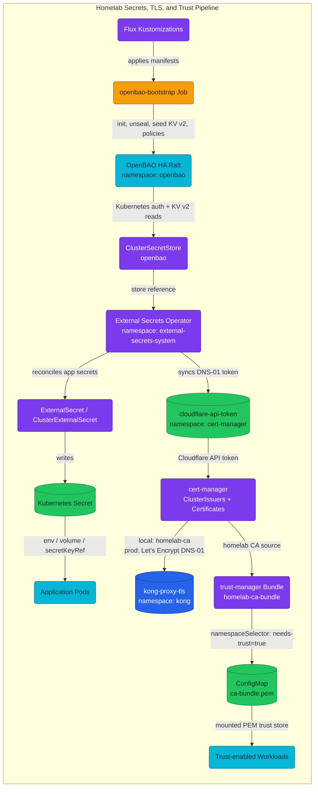
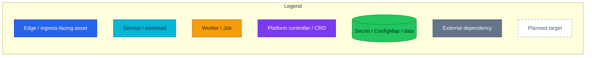

# Secrets, TLS & Trust

Entry point for the homelab secrets, certificate, and trust chain.

The platform treats secrets delivery as one pipeline: OpenBAO is the source of
truth, External Secrets Operator materializes Kubernetes Secrets, cert-manager
uses one of those Secrets for DNS-01 TLS issuance, and trust-manager distributes
the internal CA bundle to opted-in namespaces.

## Quick Facts

| Topic | Current local Kind state | Production target |
|---|---|---|
| Secret store | OpenBAO HA, 3 Raft pods, PVC-backed | Same HA shape, production seal/TLS hardening |
| App secret delivery | ESO reads OpenBAO KV v2 and writes Kubernetes Secrets | Same, plus dynamic DB credentials |
| OpenBAO endpoint | Plain HTTP in-cluster (`tlsDisable: true`) | TLS via cert-manager |
| OpenBAO unseal | Shamir key and root token kept in `openbao-init-keys`; unsealer CronJob replays the key | KMS or Transit auto-unseal; root token revoked after bootstrap |
| TLS issuer split | Local `kong-proxy-tls` is signed by `homelab-ca` | Prod `kong-proxy-tls` is Let's Encrypt via Cloudflare DNS-01 |
| Trust distribution | trust-manager distributes `homelab-ca-bundle` to labeled namespaces | Same, with rotation runbooks |
| Unsafe local choices | Dev placeholders, root token persistence, plaintext listener | Remove before production; tracked by RFC-0008 |

## Architecture

### Homelab Architecture

### Legend

## What To Read

| Need | Canonical doc |
|---|---|
| Understand the whole homelab secrets/TLS/trust chain | This file |
| Understand OpenBAO internals: HA/Raft, seal, auth, engines, policies | [OpenBAO Architecture](./openbao.md) |
| Add, consume, or rotate an ESO-managed application secret | [Secrets Management](./secrets-management.md) |
| Understand cert-manager, Let's Encrypt DNS-01, and `kong-proxy-tls` | [cert-manager + Let's Encrypt](./cert-manager.md) |
| Understand `homelab-ca-bundle`, namespace opt-in, and CA rotation | [Trust Distribution](./trust-distribution.md) |
| Recover from OpenBAO/ESO/cert-manager incidents | [Runbooks](./runbooks/) |
| Study production hardening targets | [Production Hardening](./production-hardening.md) and [RFC-0008](../proposals/rfc/RFC-0008/) |
| Review accepted decisions | [ADR-004](../proposals/adr/ADR-004-enable-openbao-audit-logging/) and [ADR-005](../proposals/adr/ADR-005-openbao-ha-raft/) |

## Deployed Flow

| Step | Component | What happens |
|---|---|---|
| 1 | Flux | Applies OpenBAO, ESO, cert-manager, trust-manager, and their config Kustomizations in dependency order |
| 2 | OpenBAO bootstrap | Initializes/unseals local OpenBAO, enables KV v2, Kubernetes auth, policies, and seeds local learning secrets |
| 3 | ClusterSecretStore | Points ESO at `http://openbao.openbao.svc.cluster.local:8200` with Kubernetes auth role `eso-reader` |
| 4 | ESO | Reads OpenBAO paths and materializes Kubernetes Secrets with `refreshInterval: 1h` |
| 5 | cert-manager | Uses `cloudflare-api-token` only for prod Let's Encrypt DNS-01; local Kind patches `kong-proxy-tls` to `homelab-ca` |
| 6 | trust-manager | Combines Mozilla CAs and the committed `homelab-ca` PEM into `homelab-ca-bundle` ConfigMaps |
| 7 | Workloads | Consume Kubernetes Secrets or mount trust bundles; they do not call OpenBAO directly |

## Current Boundaries

| Current | Planned / not yet deployed |
|---|---|
| KV v2 static secrets | OpenBAO database secrets engine for dynamic PostgreSQL users |
| Kubernetes auth for ESO | OIDC for humans and AppRole for CI/CD |
| Best-effort audit to stdout | Durable, fail-closed audit storage |
| Local Shamir unseal helper | KMS or Transit auto-unseal |
| HTTP in-cluster OpenBAO listener | TLS listener and ESO `caBundle` |
| Dev placeholder Cloudflare token on local | Operator-supplied production token outside Git |

## Related Documentation

- [OpenBAO Architecture](./openbao.md) - OpenBAO internals and learning notes.
- [Secrets Management](./secrets-management.md) - ESO patterns, path conventions, and application usage.
- [cert-manager + Let's Encrypt](./cert-manager.md) - TLS issuance for `kong-proxy-tls`.
- [Trust Distribution](./trust-distribution.md) - CA bundle distribution with trust-manager.
- [Runbooks](./runbooks/) - Operational recovery procedures.
- [RFC-0008](../proposals/rfc/RFC-0008/) - production secrets hardening and parity matrix.

---

_Last updated: 2026-07-14 - Refactored into a homelab-wide hub; OpenBAO internals moved to `openbao.md`, operational procedures moved to `runbooks/`, and the old PNG/SVG topology artifact was removed in favor of Mermaid-only diagrams._
