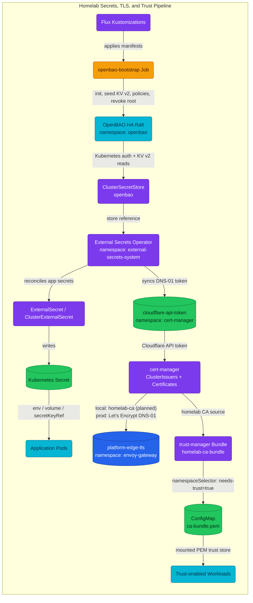
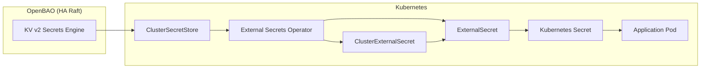
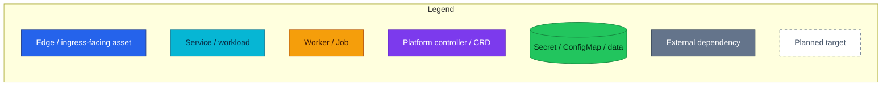

# Secrets, TLS & Trust

Entry point for the homelab secrets, certificate, and trust chain.

The platform treats secrets delivery as one pipeline: OpenBAO is the source of
truth, External Secrets Operator materializes Kubernetes Secrets, cert-manager
uses one of those Secrets for DNS-01 TLS issuance, and trust-manager distributes
the internal CA bundle to opted-in namespaces. Application pods consume Kubernetes
Secrets — they never call OpenBAO directly.

## Quick Facts

| Topic | Current local Kind state | Production target |
|---|---|---|
| Secret store | OpenBAO HA, 3 Raft pods, PVC-backed | Same HA shape, production seal/TLS hardening |
| App secret delivery | ESO reads OpenBAO KV v2; the notification service reads the **database engine static role** instead ([ADR-025](../proposals/adr/ADR-025-pgdog-passthrough-dynamic-db-creds/) pilot) | Extend database-engine credentials beyond the pilot |
| OpenBAO endpoint | Plain HTTP in-cluster (`tlsDisable: true`) | TLS via cert-manager |
| OpenBAO unseal | `awskms` auto-unseal via the floci KMS emulator (pods self-unseal at boot); `openbao-init-keys` holds only a break-glass recovery key; root token revoked ([ADR-024](../proposals/adr/ADR-024-floci-kms-emulator-auto-unseal/)) | Real cloud KMS (swap floci `endpoint`) |
| TLS issuer split | Local `platform-edge-tls` is signed by `homelab-ca` (planned — not yet reconciled on Kind) | Prod `platform-edge-tls` is Let's Encrypt via Cloudflare DNS-01 |
| Trust distribution | trust-manager distributes `homelab-ca-bundle` to labeled namespaces | Same, with rotation runbooks |
| Unsafe local choices | Dev placeholders, root token persistence, plaintext listener | Remove before production; tracked by RFC-0008 |

## What To Read

| Need | Canonical doc |
|---|---|
| Understand the whole homelab secrets/TLS/trust chain | This file |
| Understand OpenBAO internals: HA/Raft, seal, auth, engines, policies | [OpenBAO Architecture](./openbao.md) |
| Add, rotate, or troubleshoot an ESO-managed secret | [Runbooks](./runbooks/) |
| Understand cert-manager, Let's Encrypt DNS-01, and `platform-edge-tls` | [cert-manager + Let's Encrypt](./cert-manager.md) |
| Understand `homelab-ca-bundle`, namespace opt-in, and CA rotation | [cert-manager §11 — trust-manager](./cert-manager.md#11-trust-manager--distributing-the-homelab-ca-bundle) |
| Study production hardening targets | [§ Current boundaries & hardening](#current-boundaries--production-hardening) and [RFC-0008](../proposals/rfc/RFC-0008/) |
| Review accepted decisions | [ADR-004](../proposals/adr/ADR-004-enable-openbao-audit-logging/) and [ADR-005](../proposals/adr/ADR-005-openbao-ha-raft/) |

## Overview

This project uses **OpenBAO** (Apache 2.0 fork of HashiCorp Vault) as the source of
truth for secrets, with **External Secrets Operator (ESO)** syncing secrets to
Kubernetes. This approach:

- Centralizes secret management in OpenBAO
- Eliminates plaintext secrets in Git (eventual goal)
- Provides audit trails for secret access
- Enables secret rotation without redeployment
- Runs a production-ready HA cluster (3-node Raft) — not dev mode

## Architecture

### Platform pipeline


```mermaid
graph TD
subgraph homelab["Homelab Secrets, TLS, and Trust Pipeline"]
    direction TB
    flux(Flux Kustomizations):::platform
    bootstrap(openbao-bootstrap Job):::worker
    bao(OpenBAO HA Raft<br/>namespace: openbao):::service
    css(ClusterSecretStore<br/>openbao):::platform
    eso(External Secrets Operator<br/>namespace: external-secrets-system):::platform
    es(ExternalSecret / ClusterExternalSecret):::platform
    k8ssecret[(Kubernetes Secret)]:::data
    apps(Application Pods):::service
    cfsecret[(cloudflare-api-token<br/>namespace: cert-manager)]:::data
    cm(cert-manager<br/>ClusterIssuers + Certificates):::platform
    edgecert[(platform-edge-tls<br/>namespace: envoy-gateway)]:::edge
    tm(trust-manager Bundle<br/>homelab-ca-bundle):::platform
    cabundle[(ConfigMap<br/>ca-bundle.pem)]:::data
    trusted(Trust-enabled Workloads):::service

    flux -->|"applies manifests"| bootstrap
    bootstrap -->|"init, seed KV v2, policies, revoke root"| bao
    bao -->|"Kubernetes auth + KV v2 reads"| css
    css -->|"store reference"| eso
    eso -->|"reconciles app secrets"| es
    es -->|"writes"| k8ssecret
    k8ssecret -->|"env / volume / secretKeyRef"| apps
    eso -->|"syncs DNS-01 token"| cfsecret
    cfsecret -->|"Cloudflare API token"| cm
    cm -->|"local: homelab-ca (planned)<br/>prod: Let's Encrypt DNS-01"| edgecert
    cm -->|"homelab CA source"| tm
    tm -->|"namespaceSelector: needs-trust=true"| cabundle
    cabundle -->|"mounted PEM trust store"| trusted
end

classDef edge fill:#2563eb,color:#fff,stroke:#1e3a8a;
classDef service fill:#06b6d4,color:#082f49,stroke:#0e7490;
classDef worker fill:#f59e0b,color:#451a03,stroke:#b45309;
classDef platform fill:#7c3aed,color:#fff,stroke:#5b21b6;
classDef data fill:#22c55e,color:#052e16,stroke:#15803d;
classDef external fill:#64748b,color:#fff,stroke:#334155;
classDef planned fill:#fff,color:#475569,stroke:#64748b,stroke-dasharray:5 5;
```

### ESO sync path


```mermaid
flowchart LR
    subgraph OpenBAOBox["OpenBAO (HA Raft)"]
        KV["KV v2 Secrets Engine"]
    end

    subgraph K8s["Kubernetes"]
        ESO["External Secrets Operator"]
        CSS["ClusterSecretStore"]
        CES["ClusterExternalSecret"]
        ES["ExternalSecret"]
        Secret["Kubernetes Secret"]
        App["Application Pod"]
    end

    KV --> CSS
    CSS --> ESO
    ESO --> CES
    ESO --> ES
    CES --> ES
    ES --> Secret
    Secret --> App
```

### Legend


```mermaid
graph LR
subgraph legend["Legend"]
    l_edge["Edge / ingress-facing asset"]:::edge
    l_service["Service / workload"]:::service
    l_worker["Worker / Job"]:::worker
    l_platform["Platform controller / CRD"]:::platform
    l_data[(Secret / ConfigMap / data)]:::data
    l_external["External dependency"]:::external
    l_planned["Planned target"]:::planned
end

classDef edge fill:#2563eb,color:#fff,stroke:#1e3a8a;
classDef service fill:#06b6d4,color:#082f49,stroke:#0e7490;
classDef worker fill:#f59e0b,color:#451a03,stroke:#b45309;
classDef platform fill:#7c3aed,color:#fff,stroke:#5b21b6;
classDef data fill:#22c55e,color:#052e16,stroke:#15803d;
classDef external fill:#64748b,color:#fff,stroke:#334155;
classDef planned fill:#fff,color:#475569,stroke:#64748b,stroke-dasharray:5 5;
```

### Components

| Component | Purpose | Namespace | Version |
|-----------|---------|-----------|---------|
| OpenBAO (HA) | Secret storage (3-node Raft) | `openbao` | 2.5.x |
| External Secrets Operator | Sync secrets to K8s | `external-secrets-system` | **v2.9.0** |
| ClusterSecretStore | OpenBAO connection config | cluster-scoped | `openbao` (KV v2) + `openbao-db` (database engine, KV v1 read — ADR-025) |
| ClusterExternalSecret | Shared secrets across namespaces | cluster-scoped | Backup creds |
| ExternalSecret | Per-secret definition | app namespaces | Creates K8s Secrets |

OpenBAO runs HA with Raft integrated storage (3 replicas, 10Gi PVC per node),
Kubernetes auth for ESO (`eso-reader` role), KV v2 at path `secret/`, and
best-effort stdout audit → Vector → VictoriaLogs. Local Kind **auto-unseals** via the
floci KMS emulator (`seal "awskms"`, RFC-0008 / ADR-024) — pods self-unseal at boot,
root token revoked; production target is a real cloud KMS. See
[OpenBAO Architecture](./openbao.md) for internals.

### Deployed Flow

| Step | Component | What happens |
|---|---|---|
| 1 | Flux | Applies OpenBAO, ESO, cert-manager, trust-manager, and their config Kustomizations in dependency order |
| 2 | OpenBAO bootstrap | Ensures the floci KMS alias, initializes OpenBAO (**awskms auto-unseal** — pods self-unseal), enables KV v2, Kubernetes auth, policies, seeds learning secrets, then **revokes the root token** |
| 3 | ClusterSecretStore | Points ESO at `http://openbao.openbao.svc.cluster.local:8200` with Kubernetes auth role `eso-reader` |
| 4 | ESO | Reads OpenBAO paths and materializes Kubernetes Secrets with `refreshInterval: 1h` |
| 5 | cert-manager | Uses `cloudflare-api-token` only for prod Let's Encrypt DNS-01; local Kind patches `platform-edge-tls` to `homelab-ca` (planned — the patch lives in `envoy-gateway-config.yaml`, not yet reconciled on Kind) |
| 6 | trust-manager | Combines Mozilla CAs and the committed `homelab-ca` PEM into `homelab-ca-bundle` ConfigMaps |
| 7 | Workloads | Consume Kubernetes Secrets or mount trust bundles; they do not call OpenBAO directly |

## Secret organization

Secrets are organized using a **hybrid strategy** for maintainability and
scalability:

| Category | Location | Mechanism | Rationale |
|----------|----------|-----------|-----------|
| **DB credentials** | `configs/databases/clusters/*/secrets/` | ExternalSecret | Co-located with the DB cluster they serve |
| **Pooler credentials** | `configs/databases/clusters/*/secrets/` | ExternalSecret | Co-located with the pooler they serve |
| **Backup credentials** | `configs/secrets/cluster-external-secrets/` | ClusterExternalSecret | Shared across CloudNativePG cluster namespaces via namespace labels |
| **Future shared secrets** | `configs/secrets/cluster-external-secrets/` | ClusterExternalSecret | Any secret needed by multiple namespaces |

### Path naming convention

All secret paths follow a standardized 4-level hierarchy:

```
secret/{environment}/{category}/{service-or-component}/{resource}
```

| Level | Values | Purpose |
|-------|--------|---------|
| `{environment}` | `local`, `staging`, `prod` | Environment isolation; same paths across envs |
| `{category}` | `databases`, `services`, `infra` | Top-level grouping; maps to policy templates |
| `{service-or-component}` | `product`, `keycloak`, `clickhouse`, `rustfs` | Specific service or infra component |
| `{resource}` | `credentials`, `jwt-signing-key`, `api-keys`, `backup-credentials` | Type of secret |

For the **full canonical KV catalog** (all paths currently seeded plus
future-app placeholders) see
[OpenBAO §5.1 KV v2 — Static Secrets](./openbao.md#51-kv-v2--static-secrets).

> **`secret/local/infra/cloudflare/api-token`** (key `api_token`): on **local Kind**
> the `openbao-bootstrap` Job seeds a **dev placeholder** so the ExternalSecret
> syncs; on **prod** the real token is operator-supplied (not in Git) and
> re-seeded after every fresh cluster — see
> [OpenBAO initial setup § Step 7](./runbooks/openbao-initial-setup.md#step-7--seed-bootstrap-only-cloudflare-token-operator).

### Kubernetes secret catalog

ESO-managed secrets use the **same name** as the original secret they replace
(e.g., `product-db-secret`). The `managed-by: external-secrets` label identifies
OpenBAO-backed secrets. No `-vault` suffix is used.

#### Database secrets (ExternalSecret per cluster)

| K8s Secret | Namespace | Source |
|------------|-----------|--------|
| `platform-db-user-secret` | user, platform | `secret/data/local/databases/shared-db/user` (compat) |
| `platform-db-notification-secret` | notification | `database/static-creds/notification` via store `openbao-db` (ADR-025 static role, 720h rotation) |
| `platform-db-shipping-secret` | shipping, platform | `secret/data/local/databases/shared-db/shipping` (compat) |
| `platform-db-review-secret` | review, platform | `secret/data/local/databases/shared-db/review` (compat) |
| `platform-db-temporal-secret` | temporal, platform | `secret/data/local/databases/platform-db/temporal` |
| `platform-db-keycloak-secret` | identity | `secret/data/local/databases/platform-db/keycloak` |
| `product-db-secret` | product | `secret/data/local/databases/product-db/product` |
| `product-db-cart-secret` | cart | `secret/data/local/databases/product-db/cart` |
| `product-db-order-secret` | order | `secret/data/local/databases/product-db/order` |
| `product-db-inventory-secret` | inventory | `secret/data/local/databases/product-db/inventory` |
| `product-db-checkout-secret` | checkout | `secret/data/local/databases/product-db/checkout` |
| `product-db-payment-secret` | payment | `secret/data/local/databases/product-db/payment` |

The `product-db-payment-secret` ExternalSecret materialises in `payment` (the
service connects direct-TLS to `product-db-rw`); the product-side owner secret
comes from the RFC-0012 triplet in
`configs/databases/clusters/product-db/services/payment.yaml`.

#### Shared secrets (ClusterExternalSecret)

Namespace-label-selected **ClusterExternalSecrets** auto-deploy shared
credentials to every namespace that opts in:

| ClusterExternalSecret | Label Selector | Currently matched | Purpose |
|----------------------|----------------|-------------------|---------|
| `pg-backup-rustfs-cnpg` | `platform.duynhlab/backup: "cnpg"` | platform, product | CNPG/Barman: `ACCESS_KEY_ID`, `ACCESS_SECRET_KEY` |
| `clickhouse-credentials` | `platform.duynhlab/clickhouse: "true"` | monitoring | ClickHouse admin login |
| `tempo-rustfs` | `platform.duynhlab/s3: "tempo"` | monitoring | Tempo S3 (RustFS) credentials |
| `pyroscope-rustfs` | `platform.duynhlab/s3-pyroscope: "true"` | monitoring | Pyroscope S3 (RustFS) credentials |

Since the Zalando→CNPG migration every cluster backs up via Barman, so `cnpg` is
the only **backup** label (the old WAL-G `pg-backup-rustfs-walg` / `backup: walg`
mapping was removed).

**Adding backup credentials to a new namespace**: add the label to the namespace
in `kubernetes/infra/controllers/namespaces.yaml`:

```yaml
metadata:
  labels:
    platform.duynhlab/backup: "cnpg"   # CloudNativePG / Barman backup credentials
```

**ResourceSet namespaces**: microservice namespaces are also created by Flux
**ResourceSet** templates under
[`kubernetes/apps/domains/`](../../kubernetes/apps/domains/). If the `Namespace`
resource there omits `platform.duynhlab/backup`, app reconciliation can overwrite
metadata and **drop** the label from `controllers/namespaces.yaml`, so
ClusterExternalSecret **stops** matching and `pg-backup-rustfs-credentials` is not
created. Keep the label in the ResourceSet `Namespace` block (now `cnpg`
fleet-wide — set via `platform_backup_label` in the ResourceSetInputProvider
where the domain hosts a CNPG cluster).

#### Infrastructure ExternalSecrets (per-namespace)

| K8s Secret | Namespace | Source path (OpenBAO) | Defined at |
|------------|-----------|-----------------------|------------|
| `cloudflare-api-token` | `cert-manager` | `secret/data/local/infra/cloudflare/api-token` | `configs/secrets/cluster-external-secrets/cloudflare.yaml` (kind `ExternalSecret` despite the directory — the ClusterIssuer needs it in one namespace) |
| `payment-webhook-hmac` | `payment` | `secret/data/local/services/payment/webhook-hmac` | `configs/secrets/payment-webhook-external-secrets.yaml` — the HMAC key mockpay signs webhooks with and payment verifies |
| `keycloak-bootstrap-admin` | `identity` | `secret/data/local/infra/keycloak/admin` | `controllers/keycloak/external-secret.yaml` |
| `rustfs-credentials` | `rustfs` | `secret/data/local/infra/rustfs/root` | `controllers/storage/rustfs/external-secret.yaml` |

## Monitoring

External Secrets Operator exposes Prometheus metrics, scraped by the
`external-secrets` ServiceMonitor in the `monitoring` namespace.

| Metric | Description | Proposed threshold |
|--------|-------------|--------------------|
| `externalsecret_sync_calls_error_total` | Total sync failures | Any increase |
| `externalsecret_status_condition{condition="Ready",status="False"}` | Unhealthy ExternalSecrets | Any value > 0 |
| `externalsecret_reconcile_duration` | Reconcile latency | p99 > 30s |

> The thresholds above are **proposed — no PrometheusRule implements them yet**
> (a recorded gap; no OpenBAO/ESO alerts exist, consistent with the
> [runbooks index gap note](../observability/runbooks/README.md)).

Verify ESO sync status:

```bash
kubectl get externalsecret -A
kubectl get clusterexternalsecret
kubectl get clustersecretstore
```

## Current boundaries & production hardening

| Current | Planned / not yet deployed |
|---|---|
| KV v2 static secrets + database engine **static-role pilot** (notification, 720h rotation — [ADR-025](../proposals/adr/ADR-025-pgdog-passthrough-dynamic-db-creds/)) | Extend database-engine credentials to the remaining services; per-request dynamic roles |
| Kubernetes auth for ESO | OIDC for humans and AppRole for CI/CD |
| Best-effort audit to stdout | Durable, fail-closed audit storage |
| Local floci KMS emulator (`awskms` auto-unseal, root token revoked — [ADR-024](../proposals/adr/ADR-024-floci-kms-emulator-auto-unseal/)) | Real cloud KMS (swap `endpoint`) |
| HTTP in-cluster OpenBAO listener | TLS listener and ESO `caBundle` |
| Dev placeholder Cloudflare token on local | Operator-supplied production token outside Git |
| PgDog inline pooler passwords (dev-only) | Pooler `secretRef` or initContainer config rendering |

**Pooler inline passwords:** The PgDog Helm chart doesn't support `secretRef`,
so inline passwords remain in the HelmRelease/ConfigMap (dev-only); see
[RFC-0008](../proposals/rfc/RFC-0008/) for the production target.

### Hardening workstreams

| Workstream | Why it matters | Source of truth |
|---|---|---|
| TLS for OpenBAO | Prevent plaintext OpenBAO traffic and allow ESO `caBundle` validation | [RFC-0008](../proposals/rfc/RFC-0008/) |
| Real cloud KMS | Swap the floci emulator's `endpoint` for a managed KMS (auto-unseal itself shipped — ADR-024) | [RFC-0008](../proposals/rfc/RFC-0008/) |
| Database-engine credentials fleet-wide | Replace the remaining long-lived KV passwords with rotated/leased users (pilot shipped — ADR-025) | [OpenBAO §5.2](./openbao.md#52-database-secrets-engine--dynamic-credentials) |
| OIDC human access | Remove day-to-day break-glass ceremony use | [OpenBAO Architecture](./openbao.md) |
| Durable audit | Make secret access reconstructable after incidents | [ADR-004](../proposals/adr/ADR-004-enable-openbao-audit-logging/) |
| Cloudflare token handling | Keep production DNS-01 token outside Git and re-seed fresh clusters safely | [Seed bootstrap-only token](./runbooks/openbao-initial-setup.md) |

### Rotation schedule

| Credential | Type | Rotation today | Target |
|-----------|------|----------------|--------|
| Notification DB creds | Database-engine static role | Automatic, `rotation_period=720h` | Same, fleet-wide |
| Other service DB creds (KV) | Static | Manual — [rotate-static-secret](./runbooks/rotate-static-secret.md) | Database-engine roles |
| ESO OpenBAO token | Kubernetes-auth service token | Auto (auth TTL) | Same |
| S3/backup creds (KV) | Static | Manual (`bao kv put` via ceremony) | Static roles where supported |
| Break-glass root token | Generated per ceremony | Revoked after each use | Same |

### Doc wording guardrail

When editing secrets docs, keep current and planned behavior separate:
**Deployed today** (verified against `kubernetes/` manifests) · **Local Kind
only** (fine for learning, unsafe for production) · **Planned** (RFC-0008 /
ADR target) · **Rejected** (historical alternative — keep the rationale, never
present as active).

## Related documentation

- [OpenBAO Architecture](./openbao.md) — OpenBAO internals and learning notes.
- [Runbooks](./runbooks/) — add, rotate, bootstrap, and troubleshoot secrets.
- [cert-manager + Let's Encrypt + trust-manager](./cert-manager.md) — TLS issuance for `platform-edge-tls` and CA bundle distribution (§11).
- [OpenBAO file reference](./openbao.md#16-file-reference) — canonical manifest paths.
- [RFC-0008](../proposals/rfc/RFC-0008/) — production secrets hardening and parity matrix.

---

_Last updated: 2026-08-19 — production-hardening.md dissolved into § Current boundaries (corrected to ADR-024/ADR-025 reality); catalog completed against the deployed ExternalSecrets (keycloak, checkout/inventory, rustfs, 3 shared CES); fictional pooler secret dropped; auth-service rows removed._
