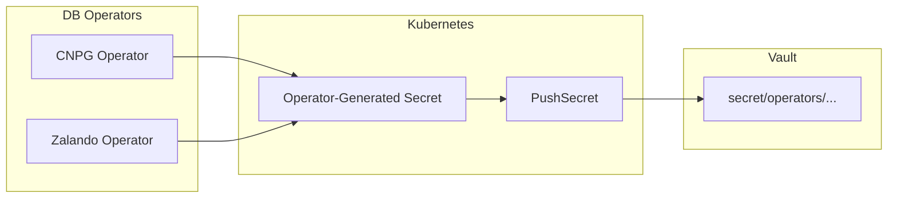

# Secrets Infrastructure Backlog

> **Purpose**: Detailed specs for P1/P2 improvements identified during the External Secrets deep dive (Feb 2026). Each item is self-contained -- pick up any item independently when ready.
>
> **P0 (Critical)**: Completed. See [CHANGELOG v0.50.9](../../CHANGELOG.md).
>
> **Note**: This project has migrated from HashiCorp Vault (dev mode) to **OpenBAO (HA Raft)**. References to "Vault" in code examples below should use `bao` CLI and OpenBAO paths. P2.1 (audit) and P2.3 (HA) are now complete via the OpenBAO migration. See [openbao.md](./openbao.md) for current architecture.

---

## Who Does This at Scale?

Before diving into each item, here is evidence from large companies that implement these exact patterns in production. This is not theoretical -- these are battle-tested approaches.

### Uber -- 150,000 secrets, 5,000+ microservices

**Source**: [Building Uber's Multi-Cloud Secrets Management Platform](https://www.uber.com/blog/building-ubers-multi-cloud-secrets-management-platform/) (2025)

- **Team size**: 10 engineers dedicated to secrets management
- **Architecture**: Centralized Secret Management Platform with metadata model (impact level, deployment platform, secret provider)
- **Vault consolidation**: Reduced 25 secret vaults (owned by different teams) to 6 managed by a single team
- **Auto-rotation**: Orchestrated automatic rotation for **20,000 secrets/month** via Cadence workflows (Secret Lifecycle Manager)
- **Secret scanning**: Pre-commit Git hooks, real-time scanning (PRs, Slack, logs), scheduled scanning (repos, filesystems, container images)
- **Scoped access**: Monitoring secret access within containers reduced distributed secrets by **90%**
- **Future direction**: Moving towards **secretless architecture** using workload identity federation (SPIFFE/SPIRE)

**Key patterns relevant to us**: secret rotation (P1.2), audit logging (P2.1), separation of auth from secret data (P1.1)

### Canva -- 1.2M secrets/month, 87.5% process reduction

**Source**: [Streamlining secrets management at Canva with HashiCorp Vault](https://www.hashicorp.com/resources/streamlining-secrets-management-at-canva-with-hashicorp-vault) (2025)

- **Before**: Secrets scattered across hundreds of AWS accounts, 1Password, encrypted app properties, developer laptops. Annual rotation diverted engineers from priorities.
- **After**: Vault as single source of truth. 1.2 million secrets issued in a single month. 12-step manual runbook reduced to a few clicks (87.5% reduction).
- **Key result**: Closed an entire risk category by removing direct engineering access to secrets in Vault.
- **Architecture**: Emphasis on testing, observability, and chaos testing before migrating secrets. System designed to be invisible to developers.

**Key patterns relevant to us**: Vault persistence (P2.3), centralized management (already done via ClusterSecretStore)

### PostFinance -- Open-source Rotation Tool (Propeller)

**Source**: [github.com/postfinance/propeller](https://github.com/postfinance/propeller)

- Swiss financial institution built **Propeller**: open-source automated secret rotation for Vault + Kubernetes
- CronJob-based rotation pattern -- same as our P1.2 design
- Production-proven in regulated financial environment (Swiss banking compliance)

**Key patterns relevant to us**: secret rotation CronJob (P1.2)

### ngrok -- PushSecret for Centralized Management

**Source**: [ESO + ngrok integration blog](https://ngrok.com/blog-post/kubernetes-external-secrets-sync)

- Uses ESO PushSecret to synchronize secrets bidirectionally between Kubernetes and external providers
- Eliminates "parallel inventories" -- single source of truth with automatic propagation
- Clean, controlled propagation across environments

**Key patterns relevant to us**: PushSecret (P2.2)

### HashiCorp Guidance -- Dynamic Database Secrets

**Source**: [Dynamic Database Credentials with Vault and Kubernetes](https://www.hashicorp.com/blog/dynamic-database-credentials-with-vault-and-kubernetes) (2025)

- Official HashiCorp pattern: Vault creates ephemeral DB users with configurable TTL (1h default, 24h max)
- Each pod gets unique credentials (audit trail per pod)
- Credentials auto-revoke on lease expiry -- no rotation needed
- Works with PostgreSQL, MySQL, MongoDB, etc.
- **Vault Secrets Operator (VSO)**: Officially supported, handles automatic rotation for Deployments/ReplicaSets/StatefulSets

**Key patterns relevant to us**: dynamic secrets (future roadmap in [vault.md](./vault.md) section 9)

### Compliance Requirements (SOC2, HIPAA)

**Sources**: HashiCorp Support, oneuptime.com

- **SOC2**: Requires audit trails for all secret access, demonstrating "who accessed what, when"
- **HIPAA**: Requires logging all access to Protected Health Information including secrets/ConfigMaps at `RequestResponse` level
- **Vault audit device**: Captures every authenticated request/response as JSON. Sensitive values are HMAC-hashed by default.
- **Log retention**: Production environments use persistent audit storage (`auditStorage` PVC in Helm chart)
- **Multiple audit devices**: Vault only responds after ALL enabled devices successfully log -- guarantees no operation goes unaudited

**Key patterns relevant to us**: audit logging (P2.1)

---

## P1: Important (Should Fix)

### P1.1: Split Bootstrap -- Separate Auth from Secret Seeding

**Priority**: P1 | **Effort**: Small (1-2 hours) | **Risk**: Low

**Who does this**: Uber (separated auth infrastructure from secret data across 6 vaults), Canva (secrets invisible to developers -- only platform team provisions)

**Problem**: `vault-bootstrap/configmap.yaml` mixes Vault auth configuration with plaintext secret values (`postgres`, `rustfsadmin`, `admin`). This couples infrastructure setup with secret data, making it harder to audit and rotate.

**Current state** (`vault-bootstrap/configmap.yaml` lines 78-129):

```bash
# Auth config (should stay) -- infrastructure
vault write auth/kubernetes/config ...
vault policy write external-secrets-read ...
vault write auth/kubernetes/role/external-secrets ...

# Secret seeding (should separate) -- data
vault kv put secret/product/db username="product" password="postgres"
vault kv put secret/cart/db username="cart" password="postgres"
vault kv put secret/backups/rustfs access_key_id="rustfsadmin" ...
```

**Solution**: Split into two scripts and two ConfigMaps:

1. **`bootstrap.sh`** (auth-only): Keep Vault auth, policy, role config. No secrets.
2. **`seed-secrets.sh`** (dev-only): Read passwords from environment variables instead of hardcoding. Clearly marked as `# DEV ONLY`.

**Implementation steps**:

1. Create `vault-bootstrap/seed-configmap.yaml`:

```yaml
apiVersion: v1
kind: ConfigMap
metadata:
  name: vault-seed-secrets-script
  namespace: vault
data:
  seed-secrets.sh: |
    #!/bin/sh
    # DEV ONLY: Seeds default credentials into Vault
    # In production: secrets are provisioned via Terraform or manual vault kv put
    set -e
    vault login root
    vault kv put secret/product/db username="${PRODUCT_DB_USER}" password="${PRODUCT_DB_PASS}"
    vault kv put secret/cart/db username="${CART_DB_USER}" password="${CART_DB_PASS}"
    vault kv put secret/order/db username="${ORDER_DB_USER}" password="${ORDER_DB_PASS}"
    vault kv put secret/backups/rustfs access_key_id="${RUSTFS_ACCESS_KEY}" secret_access_key="${RUSTFS_SECRET_KEY}"
    vault kv put secret/poolers/pgdog-cnpg username="${PGDOG_USER}" password="${PGDOG_PASS}"
```

2. Add second container in `vault-bootstrap/job.yaml` with env vars:

```yaml
- name: seed-secrets
  image: hashicorp/vault:1.21.2
  command: ["sh", "/scripts/seed-secrets.sh"]
  env:
    - name: VAULT_ADDR
      value: "http://vault.vault.svc.cluster.local:8200"
    - name: PRODUCT_DB_USER
      value: "product"
    - name: PRODUCT_DB_PASS
      value: "postgres"   # Dev defaults; production uses K8s Secret
    # ... remaining env vars
```

3. Remove seed section from `configmap.yaml` (keep auth only).

**Files to change**:
- `kubernetes/infra/configs/secrets/vault-bootstrap/configmap.yaml`
- `kubernetes/infra/configs/secrets/vault-bootstrap/job.yaml`
- New: `kubernetes/infra/configs/secrets/vault-bootstrap/seed-configmap.yaml`

---

### P1.2: Secret Rotation CronJob

**Priority**: P1 | **Effort**: Medium (2-3 hours) | **Risk**: Medium (requires pod restart)

**Who does this**: Uber (20,000 secrets rotated/month via Cadence workflows), PostFinance (Propeller -- open-source CronJob rotation for Vault+K8s), HCP Vault Secrets (30/60/90-day auto-rotation GA since Oct 2024)

**Problem**: `refreshInterval: 1h` on ExternalSecrets only syncs Vault -> K8s. There is no mechanism to rotate the actual password values in Vault. If a password is compromised, rotation is manual (`vault kv put`).

**Solution**: Create a Kubernetes CronJob that:
1. Generates random passwords using `openssl rand -base64 24`
2. Writes new passwords to Vault via `vault kv put`
3. Optionally triggers pod rollout restart for affected services

**Implementation**:

New directory: `kubernetes/infra/configs/secrets/vault-rotation/`

```yaml
# cronjob.yaml
apiVersion: batch/v1
kind: CronJob
metadata:
  name: vault-secret-rotation
  namespace: vault
spec:
  schedule: "0 3 * * 0"  # Weekly, Sunday 3 AM
  jobTemplate:
    spec:
      template:
        spec:
          serviceAccountName: vault-bootstrap
          containers:
            - name: rotate
              image: hashicorp/vault:1.21.2
              command: ["sh", "/scripts/rotate.sh"]
              env:
                - name: VAULT_ADDR
                  value: "http://vault.vault.svc.cluster.local:8200"
                - name: VAULT_TOKEN
                  value: "root"
              volumeMounts:
                - name: scripts
                  mountPath: /scripts
          volumes:
            - name: scripts
              configMap:
                name: vault-rotation-script
          restartPolicy: OnFailure
```

```bash
# rotate.sh
#!/bin/sh
set -e
NEW_PASS=$(openssl rand -base64 24)

vault kv put secret/product/db username="product" password="$NEW_PASS"
vault kv put secret/cart/db username="cart" password="$NEW_PASS"
vault kv put secret/order/db username="cart" password="$NEW_PASS"

echo "Secrets rotated. ESO will sync within refreshInterval (1h)."
echo "Force sync: kubectl annotate es <name> -n <ns> force-sync=\$(date +%s) --overwrite"
```

**Important considerations**:
- DB password must also be changed in PostgreSQL itself (not just Vault). For Zalando/CNPG operators, the operator manages DB users -- rotation must go through the operator or directly via SQL.
- For production: use Vault **dynamic database secrets engine** (see P2 roadmap in [vault.md](./vault.md) section 9) instead of CronJob rotation. Dynamic secrets eliminate rotation entirely.

**Files to create**:
- `kubernetes/infra/configs/secrets/vault-rotation/cronjob.yaml`
- `kubernetes/infra/configs/secrets/vault-rotation/configmap.yaml` (rotation script)
- `kubernetes/infra/configs/secrets/vault-rotation/kustomization.yaml`
- Update: `kubernetes/infra/configs/secrets/kustomization.yaml` (add `- vault-rotation/`)

---

## P2: Nice to Have (Future Scale)

### ~~P2.1: Vault Audit Logging~~ (COMPLETED)

> **Status**: Done. Added `vault audit enable file file_path=stdout` to bootstrap script. Logs collected by Vector -> Loki -> Grafana.

**Priority**: P2 | **Effort**: Small (30 min) | **Risk**: None

**Who does this**: Required for SOC2/HIPAA compliance. Vault audit device is used by every production Vault deployment (Uber, Canva, PostFinance, Fortune 250 retailers). Vault guarantees no operation completes unless ALL audit devices log it.

**Problem**: ~~No audit trail for secret access. Cannot answer "who accessed what secret when?"~~ Fixed.

**Solution**: Enable Vault file audit device writing to `stdout`. Container logs are already collected by Vector -> Loki, so audit logs automatically appear in Grafana.

**Implementation**: Add one line to `vault-bootstrap/configmap.yaml`:

```bash
# Enable audit logging (stdout -> Vector -> Loki)
vault audit enable file file_path=stdout 2>/dev/null || echo "Audit already enabled"
```

**For production**: Use persistent audit storage:

```yaml
# In Vault HelmRelease values
server:
  auditStorage:
    enabled: true
    size: 50Gi
```

**Audit log format** (JSON, one line per operation):

```json
{"type":"response","auth":{"token_type":"service","policies":["external-secrets-read"]},"request":{"path":"secret/data/local/databases/product/credentials","operation":"read"},"response":{"data":{"data":{"username":"***","password":"***"}}}}
```

Sensitive values are HMAC-hashed by default. Only metadata (path, operation, policy) is readable.

**Files to change**:
- `kubernetes/infra/configs/secrets/vault-bootstrap/configmap.yaml` (add 1 line)

---

### P2.2: PushSecret for Operator-Generated Secrets

**Priority**: P2 | **Effort**: Medium (3-4 hours) | **Risk**: Low

**Who does this**: ngrok (bidirectional sync between K8s and providers), Uber (centralized secret inventory must know about ALL secrets including auto-generated ones). ESO PushSecret is GA since v0.10 with Replace/IfNotExists policies.

**Problem**: DB operators (CNPG, Zalando) auto-generate superuser credentials as K8s Secrets:

| Operator | Secret Name | Namespace | Keys |
|----------|-------------|-----------|------|
| CNPG | `cnpg-db-superuser` | product | `username`, `password`, `pgpass`, `uri` |
| Zalando | `postgres.auth-db.credentials.postgresql.acid.zalan.do` | auth | `username`, `password` |
| Zalando | `postgres.supporting-shared-db.credentials.postgresql.acid.zalan.do` | user | `username`, `password` |

These secrets are invisible to Vault. If Vault is the source of truth, it should know about all secrets.

**Solution**: Use ESO `PushSecret` to push operator-generated secrets back to Vault.

**Architecture**:



**Requirements**:
1. A **write-capable ClusterSecretStore** (current `vault-dev` is read-only)
2. A Vault policy with write capabilities for the push path
3. PushSecret resources for each operator-generated secret

**Implementation**:

1. New Vault policy in bootstrap (`external-secrets-push`):

```hcl
path "secret/data/operators/*" {
  capabilities = ["create", "update", "read"]
}
path "secret/metadata/operators/*" {
  capabilities = ["read", "list", "delete"]
}
```

2. New Vault role for push:

```bash
vault write auth/kubernetes/role/external-secrets-push \
  bound_service_account_names=external-secrets \
  bound_service_account_namespaces=external-secrets-system \
  policies=external-secrets-push \
  ttl=1h
```

3. New ClusterSecretStore:

```yaml
apiVersion: external-secrets.io/v1
kind: ClusterSecretStore
metadata:
  name: vault-push
spec:
  provider:
    vault:
      server: "http://vault.vault.svc.cluster.local:8200"
      path: "secret"
      version: "v2"
      auth:
        kubernetes:
          mountPath: "kubernetes"
          role: "external-secrets-push"
          serviceAccountRef:
            name: external-secrets
            namespace: external-secrets-system
```

4. PushSecret example (CNPG product-db):

```yaml
apiVersion: external-secrets.io/v1alpha1
kind: PushSecret
metadata:
  name: push-product-db-superuser
  namespace: product
spec:
  updatePolicy: Replace
  deletionPolicy: None
  refreshInterval: 1h
  secretStoreRefs:
    - name: vault-push
      kind: ClusterSecretStore
  selector:
    secret:
      name: product-db-superuser
  data:
    - secretKey: username
      remoteRef:
        remoteKey: secret/data/operators/product-db/superuser
        property: username
    - secretKey: password
      remoteRef:
        remoteKey: secret/data/operators/product-db/superuser
        property: password
```

**Files to create**:
- `kubernetes/infra/configs/secrets/cluster-secret-store-push.yaml`
- `kubernetes/infra/configs/secrets/push-secrets/kustomization.yaml`
- `kubernetes/infra/configs/secrets/push-secrets/cnpg-db.yaml` *(consolidated; replaces former cnpg-product-db + cnpg-transaction-shared-db)*
- `kubernetes/infra/configs/secrets/push-secrets/zalando-auth-db.yaml`
- `kubernetes/infra/configs/secrets/push-secrets/zalando-supporting-shared-db.yaml`
- Update: `kubernetes/infra/configs/secrets/vault-bootstrap/configmap.yaml` (add push policy + role)
- Update: `kubernetes/infra/configs/secrets/kustomization.yaml`

---

### P2.3: Vault Standalone / HA Migration Templates

**Priority**: P2 | **Effort**: Small (1 hour) | **Risk**: None (templates only)

**Who does this**: Every production Vault deployment. HashiCorp recommends Raft integrated storage with 3-5 nodes for HA. Canva, Uber, Fortune 250 retailer all run persistent HA Vault. Dev mode is explicitly "NOT for production" per HashiCorp docs.

**Problem**: Migration from dev to production Vault is documented but no ready-to-use config files exist.

**Solution**: Create template HelmRelease values files (NOT applied by Flux, reference only).

**Files to create**:
- `kubernetes/infra/controllers/secrets/vault/examples/standalone-values.yaml`:

```yaml
# Standalone Vault with PVC (single node, persistent)
server:
  dev:
    enabled: false
  standalone:
    enabled: true
  dataStorage:
    enabled: true
    size: 10Gi
    storageClass: standard
```

- `kubernetes/infra/controllers/secrets/vault/examples/ha-raft-values.yaml`:

```yaml
# HA Vault with Raft (3 nodes, auto-unseal via AWS KMS)
server:
  dev:
    enabled: false
  ha:
    enabled: true
    replicas: 3
    raft:
      enabled: true
      config: |
        storage "raft" { path = "/vault/data" }
        seal "awskms" { region = "us-east-1"; kms_key_id = "alias/vault-unseal" }
  auditStorage:
    enabled: true
    size: 50Gi
```

**Detailed migration steps**: Already documented in [vault.md](./vault.md) sections 7-9.

---

## Quick Reference

| ID | Priority | Effort | Description | Who Does This |
|----|----------|--------|-------------|---------------|
| P1.1 | P1 | Small | Split bootstrap auth from secret seeding | Uber, Canva |
| P1.2 | P1 | Medium | Secret rotation CronJob | Uber (20K/month), PostFinance (Propeller), HCP Vault |
| ~~P2.1~~ | ~~P2~~ | ~~Small~~ | ~~Vault audit logging to stdout~~ | **DONE** |
| P2.2 | P2 | Medium | PushSecret for operator secrets | ngrok, Uber (centralized inventory) |
| P2.3 | P2 | Small | Vault standalone/HA templates | Canva, Uber, all production deployments |

**Recommended order**: P2.1 (quick win, 30 min, 1 line change) -> P1.1 -> P1.2 -> P2.2 -> P2.3

---

## References

- [Uber: Building Multi-Cloud Secrets Management Platform](https://www.uber.com/blog/building-ubers-multi-cloud-secrets-management-platform/) -- 150K secrets, 5K microservices, 20K rotations/month
- [Canva: Streamlining Secrets Management with Vault](https://www.hashicorp.com/resources/streamlining-secrets-management-at-canva-with-hashicorp-vault) -- 1.2M secrets/month, 87.5% process reduction
- [PostFinance: Propeller (open-source rotation)](https://github.com/postfinance/propeller) -- CronJob rotation for Vault+K8s
- [HashiCorp: Dynamic Database Credentials](https://www.hashicorp.com/blog/dynamic-database-credentials-with-vault-and-kubernetes) -- ephemeral DB users, auto-revoke
- [ESO: PushSecret Guide](https://external-secrets.io/latest/guides/pushsecrets/) -- bidirectional sync
- [Vault Audit Devices](https://developer.hashicorp.com/vault/docs/audit) -- compliance logging
