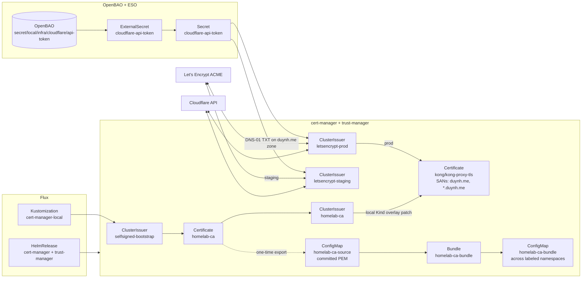

# cert-manager + Let's Encrypt + Flux CD

This guide documents how cert-manager is wired into Flux in this repo: **two ClusterIssuer families** (internal `homelab-ca` + public `letsencrypt-{staging,prod}`), a **single `kong-proxy-tls` wildcard cert** issued via **Cloudflare DNS-01** on prod (the local Kind overlay patches it to the self-signed **`homelab-ca`** instead), and **trust-manager** distributing the homelab CA bundle.

**Repository paths (implemented in this repo):**

| Purpose | Path |
|--------|------|
| Jetstack `HelmRepository` | [`kubernetes/clusters/local/sources/helm/jetstack.yaml`](../../kubernetes/clusters/local/sources/helm/jetstack.yaml) |
| cert-manager `HelmRelease` | [`kubernetes/infra/controllers/cert-manager/helmrelease.yaml`](../../kubernetes/infra/controllers/cert-manager/helmrelease.yaml) |
| trust-manager `HelmRelease` | [`kubernetes/infra/controllers/cert-manager/trust-manager-helmrelease.yaml`](../../kubernetes/infra/controllers/cert-manager/trust-manager-helmrelease.yaml) |
| ClusterIssuers (selfsigned + homelab-ca + LE) | [`kubernetes/infra/configs/cert-manager/clusterissuers.yaml`](../../kubernetes/infra/configs/cert-manager/clusterissuers.yaml) |
| Kong proxy Certificate | [`kubernetes/infra/configs/cert-manager/certificates-microservices.yaml`](../../kubernetes/infra/configs/cert-manager/certificates-microservices.yaml) |
| trust-manager Bundle | [`kubernetes/infra/configs/cert-manager/bundles.yaml`](../../kubernetes/infra/configs/cert-manager/bundles.yaml) |
| Committed CA PEM (Bundle source) | [`kubernetes/infra/configs/cert-manager/ca-source/homelab-ca.crt`](../../kubernetes/infra/configs/cert-manager/ca-source/homelab-ca.crt) |
| CA bundle distribution deep-dive | [`./trust-distribution.md`](./trust-distribution.md) |
| Cloudflare API token ExternalSecret | [`kubernetes/infra/configs/secrets/cluster-external-secrets/cloudflare.yaml`](../../kubernetes/infra/configs/secrets/cluster-external-secrets/cloudflare.yaml) |
| Flux `Kustomization` (configs) | [`kubernetes/clusters/local/cert-manager-config.yaml`](../../kubernetes/clusters/local/cert-manager-config.yaml) |

**ACME solver:** **DNS-01 via Cloudflare** is the only solver in use. The Kind cluster does not need to be reachable from the internet — only Cloudflare API access (publish a TXT on the `duynh.me` zone) is required. HTTP-01 is intentionally not configured (it would require a public LB).

**Compatibility:** Flux **Kustomization** `kustomize.toolkit.fluxcd.io/v1`, **HelmRelease** `helm.toolkit.fluxcd.io/v2`, **GitOps** best practices (declarative sources, `dependsOn`, prune).

---

## 1. Architecture (summary)



**Two coexisting PKIs:**

| PKI | Issuer chain | Used by | Trusted by |
|---|---|---|---|
| Internal | `selfsigned-bootstrap` → `homelab-ca` Certificate → `homelab-ca` ClusterIssuer | Webhooks, future internal mTLS, **and `kong-proxy-tls` on local Kind** (via the overlay patch) | Workloads that mount `homelab-ca-bundle` (trust-manager) |
| Public | `letsencrypt-staging` / `letsencrypt-prod` (DNS-01 via Cloudflare) | `kong-proxy-tls` (browser-facing wildcard) **on prod** | Browsers (Mozilla bundle covers LE roots) |

> **Local vs prod:** on the local Kind cluster the `kong-proxy-tls` wildcard is issued by the internal `homelab-ca` (Kind has no real `duynh.me` DNS zone / Cloudflare token, so LE DNS-01 can't complete — a browser warning is expected unless `homelab-ca` is trusted). On prod it is Let's Encrypt via Cloudflare DNS-01. The switch is a `spec.patches` override in `clusters/local/cert-manager-config.yaml`; prod has no such patch.

---

## 2. HelmRepository (Jetstack)

**File:** `kubernetes/clusters/local/sources/helm/jetstack.yaml`

```yaml
apiVersion: source.toolkit.fluxcd.io/v1
kind: HelmRepository
metadata:
  name: jetstack
  namespace: flux-system
spec:
  interval: 1h
  url: https://charts.jetstack.io
```

Add the file to `kubernetes/clusters/local/sources/kustomization.yaml` under `resources:`.

---

## 3. Namespace

Add to `kubernetes/infra/controllers/namespaces.yaml` (or let the chart create it — this repo pre-creates namespaces):

```yaml
apiVersion: v1
kind: Namespace
metadata:
  labels:
    environment: local
  name: cert-manager
```

---

## 4. Helm values (cert-manager HelmRelease)

Official chart: `jetstack/cert-manager`. Pin a chart version that matches your target ([Artifact Hub — cert-manager](https://artifacthub.io/packages/helm/cert-manager/cert-manager)).

**File:** `kubernetes/infra/controllers/cert-manager/helmrelease.yaml`

```yaml
apiVersion: helm.toolkit.fluxcd.io/v2
kind: HelmRelease
metadata:
  name: cert-manager
  namespace: cert-manager
spec:
  interval: 10m
  timeout: 10m
  chart:
    spec:
      chart: cert-manager
      sourceRef:
        kind: HelmRepository
        name: jetstack
        namespace: flux-system
      version: "v1.20.2"
  install:
    crds: CreateReplace
    createNamespace: false
    remediation:
      retries: 3
  upgrade:
    crds: CreateReplace
    remediation:
      retries: 3
  values:
    installCRDs: true
    global:
      leaderElection:
        namespace: cert-manager
    replicaCount: 1
    resources:
      requests:
        cpu: 25m
        memory: 64Mi
      limits:
        cpu: 200m
        memory: 256Mi
    webhook:
      replicaCount: 1
      resources:
        requests:
          cpu: 10m
          memory: 32Mi
        limits:
          cpu: 100m
          memory: 128Mi
    cainjector:
      replicaCount: 1
      resources:
        requests:
          cpu: 10m
          memory: 64Mi
        limits:
          cpu: 100m
          memory: 256Mi
```

**Include** `kubernetes/infra/controllers/cert-manager/kustomization.yaml`:

```yaml
apiVersion: kustomize.config.k8s.io/v1beta1
kind: Kustomization
resources:
  - helmrelease.yaml
```

**Wire** `cert-manager/` into `kubernetes/infra/controllers/kustomization.yaml` `resources:` (e.g. after `secrets/`).

**Controllers Flux Kustomization health check** (`kubernetes/clusters/local/controllers.yaml`): add:

```yaml
    - apiVersion: helm.toolkit.fluxcd.io/v2
      kind: HelmRelease
      name: cert-manager
      namespace: cert-manager
```

---

## 5. ClusterIssuers (selfsigned + homelab-ca + Let's Encrypt DNS-01)

The real file at `kubernetes/infra/configs/cert-manager/clusterissuers.yaml` declares **four** ClusterIssuers in a single manifest:

```yaml
# Step 1: bootstrap issuer (self-signs the homelab CA cert)
apiVersion: cert-manager.io/v1
kind: ClusterIssuer
metadata:
  name: selfsigned-bootstrap
spec:
  selfSigned: {}
---
# Step 2: homelab CA cert (10-year, ECDSA P-256), signed by the bootstrap issuer
apiVersion: cert-manager.io/v1
kind: Certificate
metadata:
  name: homelab-ca
  namespace: cert-manager
spec:
  isCA: true
  commonName: homelab-ca
  duration: 87600h
  secretName: homelab-ca-secret
  privateKey: { algorithm: ECDSA, size: 256 }
  issuerRef: { kind: ClusterIssuer, name: selfsigned-bootstrap, group: cert-manager.io }
---
# Step 3: homelab CA ClusterIssuer — signs internal leaves
apiVersion: cert-manager.io/v1
kind: ClusterIssuer
metadata:
  name: homelab-ca
spec:
  ca: { secretName: homelab-ca-secret }
---
# Step 4: Let's Encrypt staging — DNS-01 via Cloudflare, scoped to duynh.me
apiVersion: cert-manager.io/v1
kind: ClusterIssuer
metadata:
  name: letsencrypt-staging
spec:
  acme:
    email: duyhenry250897@gmail.com
    server: https://acme-staging-v02.api.letsencrypt.org/directory
    privateKeySecretRef: { name: letsencrypt-staging-account-key }
    solvers:
      - dns01:
          cloudflare:
            apiTokenSecretRef:
              name: cloudflare-api-token
              key: api-token
        selector:
          dnsZones: [duynh.me]
---
# Step 5: Let's Encrypt prod — same shape, prod ACME endpoint
apiVersion: cert-manager.io/v1
kind: ClusterIssuer
metadata:
  name: letsencrypt-prod
spec:
  acme:
    email: duyhenry250897@gmail.com
    server: https://acme-v02.api.letsencrypt.org/directory
    privateKeySecretRef: { name: letsencrypt-prod-account-key }
    solvers:
      - dns01:
          cloudflare:
            apiTokenSecretRef:
              name: cloudflare-api-token
              key: api-token
        selector:
          dnsZones: [duynh.me]
```

**Pre-requisite Secret — `cloudflare-api-token`** (`cert-manager` namespace, key `api-token`) is synced from OpenBAO by the ExternalSecret in `kubernetes/infra/configs/secrets/cluster-external-secrets/cloudflare.yaml`. The OpenBAO path is `secret/local/infra/cloudflare/api-token` (key `api_token`). On **local Kind** the `openbao-bootstrap` Job seeds a **dev placeholder** value so the ExternalSecret syncs and does not block `secrets-local` — the local `kong-proxy-tls` is `homelab-ca`-signed, so the (failing) DNS-01 solver never uses this token. On **prod** the token is **operator-supplied** — a real Cloudflare token, not in Git — and must be re-seeded after every cluster recreate (`bao kv put …`). Operator runbook: [`./secrets-management.md`](./secrets-management.md#bootstrap-only-secrets).

---

## 6. Kong proxy Certificate (single wildcard for all browser-facing hosts)

Kong terminates TLS centrally. There is **one** Certificate — `kong/kong-proxy-tls` — covering the apex and wildcard (`duynh.me`, `*.duynh.me`); every browser-facing host (`local.duynh.me`, `gateway.duynh.me`, …) is covered by the `*.duynh.me` wildcard, not listed as an explicit SAN. Per-service Certificates are not used; Ingresses do not carry `tls:` blocks because Kong serves the cert via `default-ssl-cert`.

> **No redundant SANs.** Do not add an explicit SAN that is already covered by the wildcard (e.g. `local.duynh.me`): ACME (RFC 8555 §7.1.3) rejects a SAN redundant with a wildcard in the same request (Let's Encrypt returns `400 malformed`).

**File:** `kubernetes/infra/configs/cert-manager/certificates-microservices.yaml`

```yaml
apiVersion: cert-manager.io/v1
kind: Certificate
metadata:
  name: kong-proxy-tls
  namespace: kong
spec:
  secretName: kong-proxy-tls
  duration: 2160h          # 90d — LE max
  renewBefore: 720h        # 30d before expiry
  privateKey:
    algorithm: ECDSA
    size: 256
    rotationPolicy: Always
  commonName: duynh.me
  dnsNames:
    - duynh.me
    - "*.duynh.me"
  issuerRef:
    kind: ClusterIssuer
    name: letsencrypt-prod
```

> **Local overlay:** the base manifest above uses `letsencrypt-prod`, but `clusters/local/cert-manager-config.yaml` patches `issuerRef.name` → `homelab-ca` on the local Kind cluster (self-signed; no ACME). Only prod issues this cert from Let's Encrypt.

On prod, switch `letsencrypt-prod` → `letsencrypt-staging` while iterating to avoid LE prod rate limits.

### Adding a new browser-facing host

If a new subdomain (e.g. `newtool.duynh.me`) is added to a Kong Ingress, **no Certificate change is needed** — it is already covered by the `*.duynh.me` SAN. Just add the host to `scripts/setup-hosts.sh` and create the Ingress.

---

## 7. Ingress wiring (Kong, no per-Ingress TLS block)

This platform uses **Kong** as the only ingress controller. Kong terminates TLS at the proxy with the wildcard `kong-proxy-tls` Secret; Ingress objects do **not** carry `tls:` blocks and do **not** use the `cert-manager.io/cluster-issuer` annotation. They only:

- declare hosts (`*.duynh.me`),
- force HTTPS via per-Ingress annotations:
  - `konghq.com/protocols: "https"`
  - `konghq.com/https-redirect-status-code: "301"`

For the full Kong setup (CORS, rate limiting, ingress catalog, verification runbook) see [`docs/platform/kong-gateway.md`](../platform/kong-gateway.md).

---

## 8. Flux: Kustomization for cert-manager configs

**File:** `kubernetes/infra/configs/cert-manager/kustomization.yaml`

```yaml
apiVersion: kustomize.config.k8s.io/v1beta1
kind: Kustomization
resources:
  - clusterissuers.yaml
  - certificates-microservices.yaml
  - bundles.yaml
  - ca-source/
```

**File:** `kubernetes/clusters/local/cert-manager-config.yaml`

```yaml
apiVersion: kustomize.toolkit.fluxcd.io/v1
kind: Kustomization
metadata:
  name: cert-manager-local
  namespace: flux-system
spec:
  interval: 10m
  retryInterval: 2m
  timeout: 5m
  sourceRef:
    kind: OCIRepository
    name: infrastructure-oci
  path: ./configs/cert-manager
  prune: true
  wait: true
  dependsOn:
    - name: controllers-local
    - name: secrets-local       # cloudflare-api-token Secret must exist before LE issuers reconcile
```

`cert-manager-config.yaml` is registered in `kubernetes/clusters/local/kustomization.yaml` between `controllers.yaml`/`secrets.yaml` and `kong-local`/`apps.yaml`.

---

## 9. Deployment (step-by-step)

1. **Seed Cloudflare API token in OpenBAO** (host setup, runs once per fresh cluster):
   ```bash
   ROOT=$(kubectl get secret -n openbao openbao-init-keys -o jsonpath='{.data.root_token}' | base64 -d)
   kubectl exec -n openbao openbao-0 -- sh -c \
     "BAO_TOKEN=$ROOT bao kv put secret/local/infra/cloudflare/api-token api_token=cfut_..."
   ```
2. **Reconcile** `secrets-local` so ESO syncs `cloudflare-api-token` into the `cert-manager` namespace:
   ```bash
   flux reconcile ks secrets-local --with-source
   ```
3. **Reconcile** `cert-manager-local` — on **local Kind** the overlay patches `kong-proxy-tls` to `homelab-ca`, so cert-manager signs the wildcard Secret directly (no ACME Order / DNS-01 / LE validation) and `kong-proxy-tls` lands in the `kong` namespace immediately. On **prod** the `letsencrypt-{staging,prod}` ClusterIssuers go Ready, cert-manager creates an Order, publishes the DNS-01 TXT, LE validates, and the Secret lands.
4. **Reconcile** `kong-local` (and `kong-config-local`) — Kong pod starts and mounts the Secret as `ssl_cert`/`ssl_cert_key`.
5. **Verify**:
   ```bash
   kubectl get clusterissuer
   kubectl get certificate -A
   kubectl get secret kong-proxy-tls -n kong
   ```
6. **Browser test**: `https://local.duynh.me` (after `sudo ./scripts/setup-hosts.sh`). On **local Kind** the cert is `homelab-ca`-signed, so expect an untrusted-CA warning unless `homelab-ca` is added to the trust store. On **prod** it shows a green padlock with a Let's Encrypt-issued cert covering `*.duynh.me`.

---

## 10. Troubleshooting & validation

```bash
# cert-manager pods
kubectl -n cert-manager get pods

# ClusterIssuers ready
kubectl describe clusterissuer letsencrypt-staging

# All certificates & challenges
kubectl get certificate,certificaterequest,order,challenge -A

# One certificate detail
kubectl -n kong describe certificate kong-proxy-tls

# cert-manager logs
kubectl -n cert-manager logs deploy/cert-manager -f

# Flux
flux get kustomizations
flux reconcile kustomization cert-manager-local --with-source
```

**Common issues (DNS-01)**

| Symptom | Check |
|--------|--------|
| `Secret "cloudflare-api-token" not found` on ClusterIssuer | OpenBAO not seeded → see §9 step 1; or `ClusterSecretStore openbao` NotReady (ESO can't auth to OpenBAO — see [ESO sync failure runbook](./runbooks/eso-sync-failure.md)) |
| Order stuck in `pending` | DNS-01 challenge waiting on Cloudflare TXT propagation — cert-manager retries automatically (1–2 min) |
| `cloudflare API call failed` | Token revoked or scope wrong (needs Zone\:Read + DNS\:Edit on `duynh.me`); regenerate and re-seed OpenBAO |
| LE prod rate-limit (429) | Iterate on `letsencrypt-staging` first; switch `issuerRef` to `prod` only when SANs are stable |
| Cert SAN mismatch in browser | Check `kubectl describe cert kong-proxy-tls -n kong` — SANs must include the host being browsed; add to `dnsNames` and reissue |

---

## 11. trust-manager — distributing the homelab CA bundle

cert-manager creates `homelab-ca-secret` only in the `cert-manager` namespace. Workloads in other namespaces that need to validate TLS connections signed by the homelab CA use trust-manager to receive a cluster-scoped `Bundle` synced as a per-namespace ConfigMap.

**Full deep-dive (architecture, opt-in label, rotation runbook):** [`./trust-distribution.md`](./trust-distribution.md).

---

## References

- [cert-manager — Installation (Helm)](https://cert-manager.io/docs/installation/helm/)
- [Flux — HelmRelease](https://fluxcd.io/flux/components/helm/helmreleases/)
- [Let's Encrypt — Staging](https://letsencrypt.org/docs/staging-environment/)

---

_Last updated: 2026-07-10 — chart pin corrected to `v1.20.2`. cert-manager + Let's Encrypt (DNS-01 via Cloudflare) for the `kong-proxy-tls` wildcard on prod; local Kind issues it from the self-signed `homelab-ca` (overlay patch). SANs `duynh.me`, `*.duynh.me`. `cloudflare-api-token` is a dev placeholder on local (bootstrap-seeded), operator-supplied on prod._
