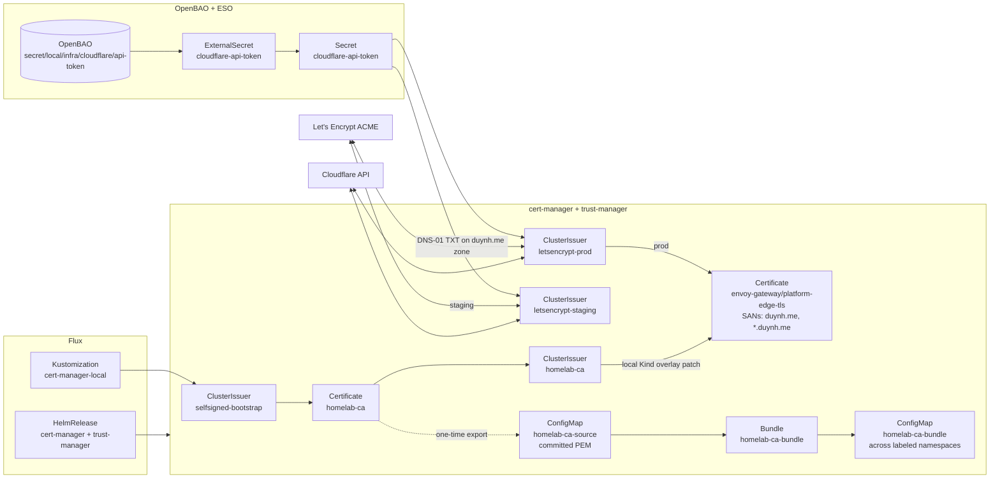
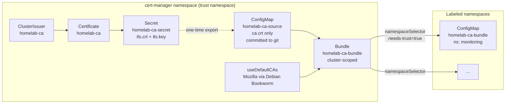
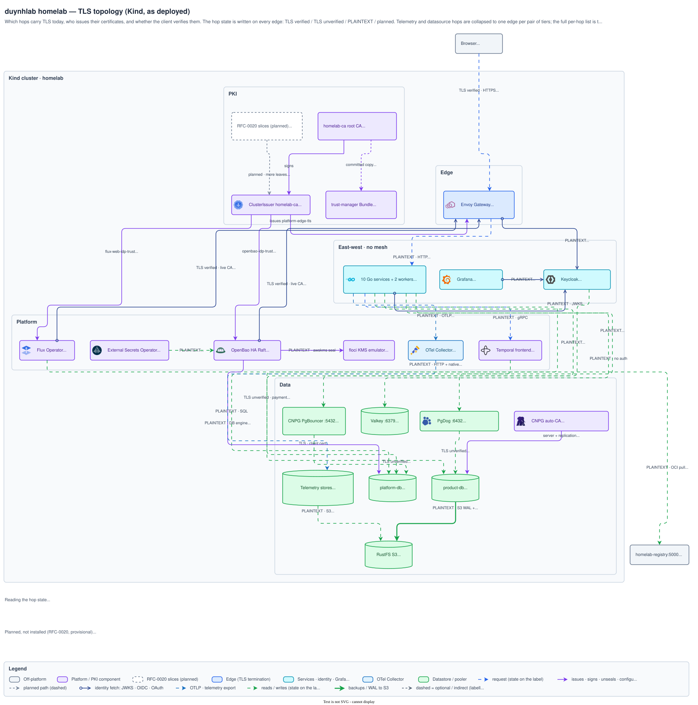

# cert-manager + Let's Encrypt + Flux CD

This guide documents how cert-manager is wired into Flux in this repo: **two ClusterIssuer families** (internal `homelab-ca` + public `letsencrypt-{staging,prod}`), a **single `platform-edge-tls` wildcard cert** issued via **Cloudflare DNS-01** on prod — **planned**: no production cluster deploys cert-manager or the edge yet (the local Kind overlay patches it to the self-signed **`homelab-ca`** instead), and **trust-manager** distributing the homelab CA bundle.

> **Cluster status:** the `envoy-gateway-config-local` Kustomization that owns
> this Certificate **has reconciled on Kind** during the RFC-0024 bring-up
> (#791; see the status table in
> [`docs/platform/envoy-gateway.md`](../platform/envoy-gateway.md)) and has since
> passed the end-to-end Kind gate (see
> [`kind-e2e-audit.md` § Previous runs](../platform/kind-e2e-audit.md#previous-runs)). The ClusterIssuers,
> `homelab-ca` Certificate, and trust-manager Bundle described below are live;
> §6 and §9's steps 3–6 describe the edge Certificate's behavior.

**Repository paths (implemented in this repo):**

| Purpose | Path |
|--------|------|
| Jetstack `HelmRepository` | [`kubernetes/clusters/local/sources/helm/jetstack.yaml`](../../kubernetes/clusters/local/sources/helm/jetstack.yaml) |
| cert-manager `HelmRelease` | [`kubernetes/infra/controllers/cert-manager/helmrelease.yaml`](../../kubernetes/infra/controllers/cert-manager/helmrelease.yaml) |
| trust-manager `HelmRelease` | [`kubernetes/infra/controllers/cert-manager/trust-manager-helmrelease.yaml`](../../kubernetes/infra/controllers/cert-manager/trust-manager-helmrelease.yaml) |
| ClusterIssuers (selfsigned + homelab-ca + LE) | [`kubernetes/infra/configs/cert-manager/clusterissuers.yaml`](../../kubernetes/infra/configs/cert-manager/clusterissuers.yaml) |
| Platform edge Certificate | [`kubernetes/infra/configs/envoy-gateway/certificate.yaml`](../../kubernetes/infra/configs/envoy-gateway/certificate.yaml) |
| trust-manager Bundle | [`kubernetes/infra/configs/cert-manager/bundles.yaml`](../../kubernetes/infra/configs/cert-manager/bundles.yaml) |
| Committed CA PEM (Bundle source) | [`kubernetes/infra/configs/cert-manager/ca-source/homelab-ca.crt`](../../kubernetes/infra/configs/cert-manager/ca-source/homelab-ca.crt) |
| Static CA copy source dir | [`kubernetes/infra/configs/cert-manager/ca-source/`](../../kubernetes/infra/configs/cert-manager/ca-source/) |
| Cloudflare API token ExternalSecret | [`kubernetes/infra/configs/secrets/cluster-external-secrets/cloudflare.yaml`](../../kubernetes/infra/configs/secrets/cluster-external-secrets/cloudflare.yaml) |
| Flux `Kustomization` (configs) | [`kubernetes/clusters/local/cert-manager-config.yaml`](../../kubernetes/clusters/local/cert-manager-config.yaml) |

**ACME solver:** **DNS-01 via Cloudflare** is the only solver in use. The Kind cluster does not need to be reachable from the internet — only Cloudflare API access (publish a TXT on the `duynh.me` zone) is required. HTTP-01 is intentionally not configured (it would require a public LB).

**Compatibility:** Flux **Kustomization** `kustomize.toolkit.fluxcd.io/v1`, **HelmRelease** `helm.toolkit.fluxcd.io/v2`, **GitOps** best practices (declarative sources, `dependsOn`, prune).

---

## 1. Architecture (summary)


```mermaid
flowchart LR
  subgraph flux[Flux]
    HR[HelmRelease<br/>cert-manager + trust-manager]
    K[Kustomization<br/>cert-manager-local]
  end
  subgraph eso[OpenBAO + ESO]
    Bao[(OpenBAO<br/>secret/local/infra/cloudflare/api-token)]
    ES[ExternalSecret<br/>cloudflare-api-token]
    Sec[Secret<br/>cloudflare-api-token]
  end
  subgraph cm[cert-manager + trust-manager]
    SS[ClusterIssuer<br/>selfsigned-bootstrap]
    CA[Certificate<br/>homelab-ca]
    HCA[ClusterIssuer<br/>homelab-ca]
    LES[ClusterIssuer<br/>letsencrypt-staging]
    LEP[ClusterIssuer<br/>letsencrypt-prod]
    EdgeCert[Certificate<br/>envoy-gateway/platform-edge-tls<br/>SANs: duynh.me, *.duynh.me]
    CACOPY[ConfigMap<br/>homelab-ca-source<br/>committed PEM]
    Bundle[Bundle<br/>homelab-ca-bundle]
    OUT[ConfigMap<br/>homelab-ca-bundle<br/>across labeled namespaces]
  end
  HR --> cm
  K --> SS --> CA --> HCA
  Bao --> ES --> Sec --> LES & LEP
  LEP -->|prod| EdgeCert
  HCA -->|local Kind overlay patch| EdgeCert
  CA -. one-time export .-> CACOPY --> Bundle --> OUT
  LE[Let's Encrypt ACME] <-->|DNS-01 TXT on duynh.me zone| LEP
  LE <-->|staging| LES
  CF[Cloudflare API] <--> LEP & LES
```

**Two coexisting PKIs:**

| PKI | Issuer chain | Used by | Trusted by |
|---|---|---|---|
| Internal | `selfsigned-bootstrap` → `homelab-ca` Certificate → `homelab-ca` ClusterIssuer | Future internal mTLS (RFC-0020, planned), the two live-CA trust anchors (`openbao-idp-trust`, `flux-web-idp-trust`), **and `platform-edge-tls` on local Kind** (via the overlay patch — reconciled with the RFC-0024 bring-up) | Workloads that mount `homelab-ca-bundle` (trust-manager) |
| Public | `letsencrypt-staging` / `letsencrypt-prod` (DNS-01 via Cloudflare) | `platform-edge-tls` (browser-facing wildcard) **on prod — planned, not deployed** | Browsers (Mozilla bundle covers LE roots) |

> **Local vs prod:** on the local Kind cluster the `platform-edge-tls` wildcard is issued by the internal `homelab-ca` (Kind has no real `duynh.me` DNS zone / Cloudflare token, so LE DNS-01 can't complete — a browser warning is expected unless `homelab-ca` is trusted). On prod it would be Let's Encrypt via Cloudflare DNS-01 — **planned**: `kubernetes/clusters/production/` declares no cert-manager or edge Kustomization yet. Webhook serving certs do not come from `homelab-ca` either: each chart (cert-manager, Kyverno, Temporal Worker Controller, Barman plugin) runs its own self-signed Issuer. The switch is a `spec.patches` override in [`clusters/local/envoy-gateway-config.yaml`](../../kubernetes/clusters/local/envoy-gateway-config.yaml) (not `cert-manager-config.yaml` — the edge Certificate lives in the `envoy-gateway` Kustomization, not the `cert-manager` one); prod has no such patch. The patch reconciled on Kind with the RFC-0024 bring-up (#791) and has since passed the end-to-end Kind gate ([Previous runs](../platform/kind-e2e-audit.md#previous-runs)).

---

## 2. HelmRepository (Jetstack)

**File:** `kubernetes/clusters/local/sources/helm/jetstack.yaml`

```yaml
apiVersion: source.toolkit.fluxcd.io/v1
kind: HelmRepository
metadata:
  name: jetstack
  namespace: flux-system
spec:
  interval: 1h
  url: https://charts.jetstack.io
```

Add the file to `kubernetes/clusters/local/sources/kustomization.yaml` under `resources:`.

---

## 3. Namespace

Add to `kubernetes/infra/controllers/namespaces.yaml` (or let the chart create it — this repo pre-creates namespaces):

```yaml
apiVersion: v1
kind: Namespace
metadata:
  labels:
    environment: local
  name: cert-manager
```

---

## 4. Helm values (cert-manager HelmRelease)

Official chart: `jetstack/cert-manager`. Pin a chart version that matches your target ([Artifact Hub — cert-manager](https://artifacthub.io/packages/helm/cert-manager/cert-manager)).

**File:** `kubernetes/infra/controllers/cert-manager/helmrelease.yaml`

```yaml
apiVersion: helm.toolkit.fluxcd.io/v2
kind: HelmRelease
metadata:
  name: cert-manager
  namespace: cert-manager
spec:
  interval: 10m
  timeout: 10m
  chart:
    spec:
      chart: cert-manager
      sourceRef:
        kind: HelmRepository
        name: jetstack
        namespace: flux-system
      version: "v1.21.2"
  install:
    crds: CreateReplace
    createNamespace: false
    remediation:
      retries: 3
  upgrade:
    crds: CreateReplace
    remediation:
      retries: 3
  values:
    installCRDs: true
    global:
      leaderElection:
        namespace: cert-manager
    replicaCount: 1
    resources:
      requests:
        cpu: 25m
        memory: 64Mi
      limits:
        cpu: 200m
        memory: 256Mi
    webhook:
      replicaCount: 1
      resources:
        requests:
          cpu: 10m
          memory: 32Mi
        limits:
          cpu: 100m
          memory: 128Mi
    cainjector:
      replicaCount: 1
      resources:
        requests:
          cpu: 10m
          memory: 64Mi
        limits:
          cpu: 100m
          memory: 256Mi
    # Chart-native metrics scrape — controller/webhook/cainjector expose
    # /metrics on :9402; backs the CertManager* alerts and the GitOps board.
    prometheus:
      enabled: true
      servicemonitor:
        enabled: true
        interval: 60s
```

**Include** `kubernetes/infra/controllers/cert-manager/kustomization.yaml`:

```yaml
apiVersion: kustomize.config.k8s.io/v1beta1
kind: Kustomization
resources:
  - helmrelease.yaml
```

**Wire** `cert-manager/` into `kubernetes/infra/controllers/kustomization.yaml` `resources:` (e.g. after `secrets/`).

**Controllers Flux Kustomization health check** (`kubernetes/clusters/local/controllers.yaml`): add:

```yaml
    - apiVersion: helm.toolkit.fluxcd.io/v2
      kind: HelmRelease
      name: cert-manager
      namespace: cert-manager
```

---

## 5. ClusterIssuers (selfsigned + homelab-ca + Let's Encrypt DNS-01)

The real file at `kubernetes/infra/configs/cert-manager/clusterissuers.yaml` declares **four** ClusterIssuers in a single manifest:

```yaml
# Step 1: bootstrap issuer (self-signs the homelab CA cert)
apiVersion: cert-manager.io/v1
kind: ClusterIssuer
metadata:
  name: selfsigned-bootstrap
spec:
  selfSigned: {}
---
# Step 2: homelab CA cert (10-year, ECDSA P-256), signed by the bootstrap issuer
apiVersion: cert-manager.io/v1
kind: Certificate
metadata:
  name: homelab-ca
  namespace: cert-manager
spec:
  isCA: true
  commonName: homelab-ca
  duration: 87600h
  secretName: homelab-ca-secret
  privateKey: { algorithm: ECDSA, size: 256 }
  issuerRef: { kind: ClusterIssuer, name: selfsigned-bootstrap, group: cert-manager.io }
---
# Step 3: homelab CA ClusterIssuer — signs internal leaves
apiVersion: cert-manager.io/v1
kind: ClusterIssuer
metadata:
  name: homelab-ca
spec:
  ca: { secretName: homelab-ca-secret }
---
# Step 4: Let's Encrypt staging — DNS-01 via Cloudflare, scoped to duynh.me
apiVersion: cert-manager.io/v1
kind: ClusterIssuer
metadata:
  name: letsencrypt-staging
spec:
  acme:
    email: duyhenry250897@gmail.com
    server: https://acme-staging-v02.api.letsencrypt.org/directory
    privateKeySecretRef: { name: letsencrypt-staging-account-key }
    solvers:
      - dns01:
          cloudflare:
            apiTokenSecretRef:
              name: cloudflare-api-token
              key: api-token
        selector:
          dnsZones: [duynh.me]
---
# Step 5: Let's Encrypt prod — same shape, prod ACME endpoint
apiVersion: cert-manager.io/v1
kind: ClusterIssuer
metadata:
  name: letsencrypt-prod
spec:
  acme:
    email: duyhenry250897@gmail.com
    server: https://acme-v02.api.letsencrypt.org/directory
    privateKeySecretRef: { name: letsencrypt-prod-account-key }
    solvers:
      - dns01:
          cloudflare:
            apiTokenSecretRef:
              name: cloudflare-api-token
              key: api-token
        selector:
          dnsZones: [duynh.me]
```

**Pre-requisite Secret — `cloudflare-api-token`** (`cert-manager` namespace, key `api-token`) is synced from OpenBAO by the ExternalSecret in `kubernetes/infra/configs/secrets/cluster-external-secrets/cloudflare.yaml`. The OpenBAO path is `secret/local/infra/cloudflare/api-token` (key `api_token`). On **local Kind** the `openbao-bootstrap` Job seeds a **dev placeholder** value so the ExternalSecret syncs and does not block `secrets-local` — the local `platform-edge-tls` is `homelab-ca`-signed, so the (failing) DNS-01 solver never uses this token. On **prod (planned)** the token is **operator-supplied** — a real Cloudflare token, not in Git — and must be re-seeded after every cluster recreate (`bao kv put …`). Operator runbook: [OpenBAO initial setup § Step 7](./runbooks/openbao-initial-setup.md#step-7--seed-bootstrap-only-cloudflare-token-operator).

---

## 6. Platform edge Certificate (single wildcard for all browser-facing hosts)

Envoy Gateway terminates TLS centrally, at the `platform` Gateway's `https`
listener. There is **one** Certificate — `envoy-gateway/platform-edge-tls` —
covering the apex and wildcard (`duynh.me`, `*.duynh.me`); every browser-facing
host (`local.duynh.me`, `gateway.duynh.me`, …) is covered by the `*.duynh.me`
wildcard, not listed as an explicit SAN. Per-service Certificates are not used;
HTTPRoutes do not carry any TLS configuration because the Gateway listener
references the Secret directly via `certificateRefs`.

> **No redundant SANs.** Do not add an explicit SAN that is already covered by the wildcard (e.g. `local.duynh.me`): ACME (RFC 8555 §7.1.3) rejects a SAN redundant with a wildcard in the same request (Let's Encrypt returns `400 malformed`).

**File:** `kubernetes/infra/configs/envoy-gateway/certificate.yaml`

```yaml
apiVersion: cert-manager.io/v1
kind: Certificate
metadata:
  name: platform-edge-tls
  namespace: envoy-gateway
spec:
  secretName: platform-edge-tls
  duration: 2160h # 90 days
  renewBefore: 360h # 15 days
  privateKey:
    algorithm: ECDSA
    size: 256
    rotationPolicy: Always
  issuerRef:
    kind: ClusterIssuer
    name: letsencrypt-prod
  commonName: duynh.me
  dnsNames:
    - duynh.me
    - "*.duynh.me"
```

> **Local overlay:** the base manifest above uses `letsencrypt-prod`, but [`clusters/local/envoy-gateway-config.yaml`](../../kubernetes/clusters/local/envoy-gateway-config.yaml) patches `issuerRef.name` → `homelab-ca` on the local Kind cluster (self-signed; no ACME). Only prod would issue this cert from Let's Encrypt (planned — no production cluster deploys it yet). The `envoy-gateway-config-local` Kustomization carrying this patch has reconciled on Kind (RFC-0024 bring-up, #791) and has since passed the full Kind gate (see [`kind-e2e-audit.md` § Previous runs](../platform/kind-e2e-audit.md#previous-runs)).

On prod, switch `letsencrypt-prod` → `letsencrypt-staging` while iterating to avoid LE prod rate limits.

### Adding a new browser-facing host

If a new subdomain (e.g. `newtool.duynh.me`) is added as an HTTPRoute, **no Certificate change is needed** — it is already covered by the `*.duynh.me` SAN and the Gateway's `https` listener, which is itself a wildcard (`*.duynh.me`). Just add the host to `scripts/setup-hosts.sh` and create the HTTPRoute (see [Envoy Gateway routing](../platform/envoy-gateway.md#routing-is-audience-scoped)).

---

## 7. Gateway API TLS termination (no per-route TLS)

Envoy Gateway is the only edge control plane. TLS terminates once, on the
`platform` Gateway's `https` listener
([`kubernetes/infra/configs/envoy-gateway/gateway.yaml`](../../kubernetes/infra/configs/envoy-gateway/gateway.yaml)),
via `certificateRefs` pointing at the `platform-edge-tls` Secret. HTTPRoute
objects carry **no** TLS block and **no** `cert-manager.io/cluster-issuer`
annotation — a route only declares `hostnames` and path matches; the listener
it attaches to is what decides encryption.

Plaintext (`:80`) is handled the canonical Gateway API way: a single `http`
listener whose only route is a `RequestRedirect` filter (301 to `https`), so no
app route can ever be reached over plaintext.

For the full edge setup (resource model, routing, JWT policy, telemetry,
operations) see [`docs/platform/envoy-gateway.md`](../platform/envoy-gateway.md).

---

## 8. Flux: Kustomization for cert-manager configs

**File:** `kubernetes/infra/configs/cert-manager/kustomization.yaml`

```yaml
apiVersion: kustomize.config.k8s.io/v1beta1
kind: Kustomization
resources:
  - clusterissuers.yaml
  - ca-source
  - bundles.yaml
```

The platform edge Certificate is **not** in this directory — it is owned by
[`configs/envoy-gateway/certificate.yaml`](../../kubernetes/infra/configs/envoy-gateway/certificate.yaml),
reconciled by the separate `envoy-gateway-config-local` Kustomization (§6).

**File:** `kubernetes/clusters/local/cert-manager-config.yaml`

```yaml
apiVersion: kustomize.toolkit.fluxcd.io/v1
kind: Kustomization
metadata:
  name: cert-manager-local
  namespace: flux-system
spec:
  interval: 10m
  retryInterval: 2m
  timeout: 5m
  sourceRef:
    kind: OCIRepository
    name: infrastructure-oci
  path: ./configs/cert-manager
  prune: true
  wait: true
  dependsOn:
    - name: controllers-local
    - name: secrets-local       # cloudflare-api-token Secret must exist before LE issuers reconcile
```

`cert-manager-config.yaml` is registered in `kubernetes/clusters/local/kustomization.yaml` right after `controllers.yaml`, ahead of `envoy-gateway.yaml`/`envoy-gateway-config.yaml`/`secrets.yaml`/`apps.yaml`.

---

## 9. Deployment (step-by-step)

> **Kind status:** steps 3–6 are owned by the `envoy-gateway-config-local`
> Kustomization, which has reconciled on Kind (RFC-0024 bring-up, #791) and has
> since passed the end-to-end Kind gate (see
> [`kind-e2e-audit.md` § Previous runs](../platform/kind-e2e-audit.md#previous-runs)).
> Steps 1–2 (ClusterIssuers + `cloudflare-api-token`) predate it and are live.

1. **Seed Cloudflare API token in OpenBAO** (host setup, runs once per fresh cluster):
   ```bash
   ROOT=$(kubectl get secret -n openbao openbao-init-keys -o jsonpath='{.data.root_token}' | base64 -d)
   kubectl exec -n openbao openbao-0 -- sh -c \
     "BAO_TOKEN=$ROOT bao kv put secret/local/infra/cloudflare/api-token api_token=cfut_..."
   ```
2. **Reconcile** `secrets-local` so ESO syncs `cloudflare-api-token` into the `cert-manager` namespace:
   ```bash
   flux reconcile ks secrets-local --with-source
   ```
3. **Reconcile** `cert-manager-local`, then `envoy-gateway-config-local` — on **local Kind** the overlay patches `platform-edge-tls` to `homelab-ca`, so cert-manager signs the wildcard Secret directly (no ACME Order / DNS-01 / LE validation) and `platform-edge-tls` lands in the `envoy-gateway` namespace. On **prod (planned)** the `letsencrypt-{staging,prod}` ClusterIssuers would go Ready, cert-manager creates an Order, publishes the DNS-01 TXT, LE validates, and the Secret lands.
4. **Reconcile** `envoy-gateway-local` (and `envoy-gateway-config-local`) — Envoy Gateway starts the data plane and mounts the Secret via the Gateway listener's `certificateRefs`.
5. **Verify**:
   ```bash
   kubectl get clusterissuer
   kubectl get certificate -A
   kubectl get secret platform-edge-tls -n envoy-gateway
   ```
6. **Browser test**: `https://local.duynh.me` (after `sudo ./scripts/setup-hosts.sh`). On **local Kind** the cert is `homelab-ca`-signed, so expect an untrusted-CA warning until `homelab-ca` is trusted. On macOS it must go in the **System** keychain — the login keychain makes `curl` trust it while Chrome still refuses, because Chrome reads root trust from the System store only:

   ```bash
   kubectl get secret -n cert-manager homelab-ca-secret \
     -o jsonpath='{.data.tls\.crt}' | base64 -d > /tmp/homelab-ca.crt
   sudo security add-trusted-cert -d -r trustRoot \
     -k /Library/Keychains/System.keychain /tmp/homelab-ca.crt
   # undo:
   sudo security delete-certificate -c homelab-ca -t /Library/Keychains/System.keychain
   ```

   Chrome's `--ignore-certificate-errors` and `--ignore-certificate-errors-spki-list`
   flags do **not** work as a substitute (measured 2026-08-25). On **prod (planned)** it would show a green padlock with a Let's Encrypt-issued cert covering `*.duynh.me`.

---

## 10. Troubleshooting & validation

```bash
# cert-manager pods
kubectl -n cert-manager get pods

# ClusterIssuers ready
kubectl describe clusterissuer letsencrypt-staging

# All certificates & challenges
kubectl get certificate,certificaterequest,order,challenge -A

# One certificate detail
kubectl -n envoy-gateway describe certificate platform-edge-tls

# cert-manager logs
kubectl -n cert-manager logs deploy/cert-manager -f

# Flux
flux get kustomizations
flux reconcile kustomization cert-manager-local --with-source
```

**Common issues (DNS-01)**

| Symptom | Check |
|--------|--------|
| `Secret "cloudflare-api-token" not found` on ClusterIssuer | OpenBAO not seeded → see §9 step 1; or `ClusterSecretStore openbao` NotReady (ESO can't auth to OpenBAO — see [ESO sync failure runbook](./runbooks/eso-sync-failure.md)) |
| Order stuck in `pending` | DNS-01 challenge waiting on Cloudflare TXT propagation — cert-manager retries automatically (1–2 min) |
| `cloudflare API call failed` | Token revoked or scope wrong (needs Zone\:Read + DNS\:Edit on `duynh.me`); regenerate and re-seed OpenBAO |
| LE prod rate-limit (429) | Iterate on `letsencrypt-staging` first; switch `issuerRef` to `prod` only when SANs are stable |
| Cert SAN mismatch in browser | Check `kubectl describe cert platform-edge-tls -n envoy-gateway` — SANs must include the host being browsed; add to `dnsNames` and reissue |

---

## 11. trust-manager — distributing the homelab CA bundle

cert-manager creates `homelab-ca-secret` only in the `cert-manager` namespace.
Workloads in other namespaces that need to **verify** TLS connections signed by
the homelab CA — load-test runners against the edge on local Kind, Vector
pushing to an HTTPS sink, future private endpoints — would otherwise resort to
`InsecureSkipVerify=true` or hand-copied CA files. trust-manager solves this: a
cluster-scoped `Bundle` synced as a per-namespace ConfigMap.

Why trust-manager over reflector / kubernetes-replicator:

- **CA-only, no private keys**: the `Bundle` API never touches `tls.key` — you
  cannot accidentally fan a private key out across namespaces.
- **Combine sources**: one Bundle merges Mozilla CAs (`useDefaultCAs: true`) +
  the homelab CA into a single `ca-bundle.pem` per workload.
- **Same upstream as cert-manager**: identical release cadence, GitOps flow,
  Helm chart, security review.
- **Output formats**: PEM by default; JKS / PKCS#12 exist but stay disabled
  here (Go uses PEM only).

Client-trust implications of the two PKIs (§1's table): a pod calling the edge
on **prod (planned)** would not need the bundle — the cert is Let's Encrypt and Mozilla
roots already cover it. On **local Kind** the edge cert is `homelab-ca`-issued,
so an in-cluster client verifying it does need the bundle. Opt a
namespace in only when it consumes a **homelab-CA-signed** endpoint; adding a
browser-facing host means adding a SAN to `platform-edge-tls` (§6), never
issuing a separate homelab-ca leaf for the same SNI.

### 11.1 Bundle architecture


```mermaid
flowchart LR
  subgraph cm["cert-manager namespace (trust namespace)"]
    Issuer[ClusterIssuer<br/>homelab-ca]
    CA[Certificate<br/>homelab-ca]
    Secret[Secret<br/>homelab-ca-secret<br/>tls.crt + tls.key]
    Copy[ConfigMap<br/>homelab-ca-source<br/>ca.crt only<br/>committed to git]
    Bundle[Bundle<br/>homelab-ca-bundle<br/>cluster-scoped]
    Default[useDefaultCAs<br/>Mozilla via Debian Bookworm]
  end

  subgraph workloads["Labeled namespaces"]
    direction TB
    NS1[ConfigMap<br/>homelab-ca-bundle<br/>ns: monitoring]
    NS2[...]
  end

  Issuer --> CA
  CA --> Secret
  Secret -. one-time export .-> Copy
  Copy --> Bundle
  Default --> Bundle
  Bundle -->|namespaceSelector<br/>needs-trust=true| NS1
  Bundle -->|namespaceSelector| NS2
```

**Why the static `homelab-ca-source` ConfigMap?** trust-manager could read
`homelab-ca-secret` directly. We deliberately do not — rotation (§11.4)
requires a window where both old and new CA are trusted, so the Bundle reads a
git-committed PEM the platform controls, not a Secret cert-manager could
rotate underneath us.

### 11.2 Opting a namespace in

Add the label to the `Namespace` resource (managed in
[`kubernetes/infra/controllers/namespaces.yaml`](../../kubernetes/infra/controllers/namespaces.yaml)):

```yaml
apiVersion: v1
kind: Namespace
metadata:
  name: my-namespace
  labels:
    platform.duynhlab.dev/needs-trust: "true"
```

trust-manager reconciles within ~10s and creates `ConfigMap/homelab-ca-bundle`
(`ca-bundle.pem` = Mozilla roots + `homelab-ca`). Verify:

```bash
kubectl get bundles
kubectl get cm homelab-ca-bundle -A
kubectl get cm homelab-ca-bundle -n my-namespace -o jsonpath='{.data.ca-bundle\.pem}' | grep -c BEGIN
```

**Currently labeled:** only `monitoring` (future Vector / Grafana outbound
HTTPS to homelab-CA-signed targets). `gateway.duynh.me` is **not** a reason to
opt in — it is trusted via the Mozilla roots already in the bundle and in
every container's system store.

### 11.3 Mounting the bundle in a workload

```yaml
spec:
  containers:
    - name: app
      env:
        - name: SSL_CERT_FILE
          value: /etc/ssl/certs/ca-bundle.pem
      volumeMounts:
        - name: trust
          mountPath: /etc/ssl/certs/ca-bundle.pem
          subPath: ca-bundle.pem
          readOnly: true
  volumes:
    - name: trust
      configMap:
        name: homelab-ca-bundle
```

For Go workloads, `SSL_CERT_FILE` makes `crypto/tls` use the bundle as its
**only** trust store. To merge with the system root pool instead, mount at
`/etc/ssl/certs/homelab-ca.crt` (subPath) and let Go combine them. That merged
shape is the one the Bundle manifest's header names
([`bundles.yaml`](../../kubernetes/infra/configs/cert-manager/bundles.yaml));
both are valid, so pick one per workload. No workload mounts the bundle yet.

### 11.4 CA rotation

The fundamental rule: **never overwrite a trust store atomically with a
different CA** — workloads holding a leaf signed by the old CA fail
verification the moment peers serve the new one. Every rotation needs a window
where **both** CAs are trusted; each step below is its own PR with its own
rollback:

```bash
# 1. Add homelab-ca-v2 Certificate + ClusterIssuer alongside the old ones in
#    kubernetes/infra/configs/cert-manager/clusterissuers.yaml.

# 2. After Flux reconciles, export the new CA cert:
kubectl get secret homelab-ca-v2-secret -n cert-manager \
  -o jsonpath='{.data.tls\.crt}' | base64 -d \
  > kubernetes/infra/configs/cert-manager/ca-source/homelab-ca-v2.crt

# 3. configMapGenerator in ca-source/kustomization.yaml bundles BOTH PEMs —
#    trust-manager combines all keys from the source.

# 4. PR + merge: every labeled namespace now trusts old AND new.

# 5. Switch leaf Certificates (platform-edge-tls, future ones) issuerRef to
#    homelab-ca-v2; wait for reissue (kubectl get certificate -A).

# 6. PR removing homelab-ca.crt from the generator + deleting the file.

# 7. Eventually delete the old homelab-ca Certificate + ClusterIssuer.
```

### 11.5 Bootstrap (fresh cluster)

`ca-source/homelab-ca.crt` is committed for the current cluster's CA. A fresh
cluster generates a new CA key, so **on every `make down && make up` the
committed copy — and therefore the bundle's `homelab-ca` entry — is stale
until this re-export runs.** This is not cosmetic: it already bit once — the
ADR-062 OpenBAO OIDC configurator originally trusted the bundle and failed
`x509: ECDSA verification failure … candidate authority "homelab-ca"` on a
rebuilt cluster (fixed in PR #933 by trusting a live-issuer Certificate
instead; that consumer-side pattern — a throwaway Certificate from the
`homelab-ca` ClusterIssuer whose `ca.crt` is current by construction — is the
right choice for anything that must verify the edge in-cluster). Re-export
once cert-manager has issued `homelab-ca-secret`:

```bash
kubectl get secret homelab-ca-secret -n cert-manager \
  -o jsonpath='{.data.tls\.crt}' | base64 -d \
  > kubernetes/infra/configs/cert-manager/ca-source/homelab-ca.crt
# kustomization.yaml already references the file. Commit the .crt —
# CA certs are public; only tls.key is sensitive.
```

### 11.6 Bundle troubleshooting

General pod/Flux dialect is §10; Bundle-specific symptoms:

```bash
kubectl -n cert-manager logs deploy/trust-manager -f
kubectl describe bundle homelab-ca-bundle
```

| Symptom | Check |
|---|---|
| Bundle status `False` | `kubectl describe bundle homelab-ca-bundle` — usually missing source ConfigMap or wrong key |
| ConfigMap not appearing in target ns | Namespace missing `platform.duynhlab.dev/needs-trust=true` |
| ConfigMap exists but is empty | trust-manager pod logs — most often the Mozilla pkg image failed to pull |
| Old CA still in bundle after rotation | Rebuild not triggered — `flux reconcile kustomization cert-manager-local --with-source` |
| In-cluster TLS to `*.duynh.me` fails `x509: … candidate authority "homelab-ca"` after a cluster rebuild | The committed `ca-source/homelab-ca.crt` predates this cluster's CA — re-export per §11.5, or have the consumer trust a live-issuer Certificate instead (the ADR-062 / PR #933 pattern) |

---

## 12. TLS topology — which hops are encrypted today

This section answers **one** question about the **Kind cluster as deployed**:
which hops carry TLS today, who issues their certificates, and whether the client
verifies them. The target design, and why it has that shape, belongs to
[RFC-0020](../proposals/rfc/RFC-0020/README.md) (status `provisional`, **no
slice applied**). This section only links to it. The secrets pipeline
(OpenBao → ESO → Secrets) is a different question, drawn in
[`README.md` § Platform pipeline](./README.md#platform-pipeline).

| Fact | Value (verified against manifests, 2026-10-01) |
|------|------|
| Certificates issued from `homelab-ca` | 3 leaves: `platform-edge-tls` (the edge), `openbao-idp-trust` and `flux-web-idp-trust` (only their `ca.crt` is used). There is also the root `Certificate homelab-ca` |
| Hops with verified TLS | browser → edge, and the two `id.duynh.me` hairpins (OpenBao OIDC config, Flux web UI) |
| Hops with TLS but no verification | `payment` → `product-db-rw` (`sslmode=require`), PgDog → CNPG `product-db`, and Keycloak JDBC → `platform-db` — all TLS 1.3, measured on Kind 2026-10-01 via `pg_stat_ssl`. PgDog's `tls_verify` and pgjdbc both default to `prefer`, which never checks the CA |
| Plaintext | every other in-cluster hop: app → pooler, gRPC, Temporal, OpenBao `:8200`, Keycloak `:8080`, Valkey, telemetry, S3 (RustFS). Temporal → `platform-db` and the OpenBao DB engine → `platform-db` are confirmed plaintext (measured on Kind 2026-10-01 via `pg_stat_ssl`) |
| Operator-managed TLS (not `homelab-ca`) | CNPG auto-CA (server cert, `streaming_replica`, PgBouncer client cert), the OpenBao Raft cluster port `:8201`, Envoy Gateway xDS (certgen), and chart self-signed webhook Issuers (Temporal Worker Controller, Barman plugin) |
| Trust bundle | `homelab-ca-bundle` reaches `monitoring` only, and nothing mounts it (§11.2) |
| local-stack | plaintext end to end, by design (an RFC-0020 non-goal). The only TLS there is Envoy Gateway xDS (`certgen --local`) |

The Draw.io view below is the canonical picture for this question. Every edge
names its state: `TLS verified`, `TLS unverified` (encrypted, but the client
does not check who answers), `PLAINTEXT`, or `planned`. No edge is left
`unconfirmed`: every database hop was read from `pg_stat_ssl` on Kind (2026-10-01). Telemetry and datasource hops are collapsed
to one edge per pair of tiers; §12.1 lists each hop with its evidence.

<p align="center"><a href="../architecture/security/tls-topology.svg"></a></p>
<p align="center"><sub>Source <a href="../architecture/security/tls-topology.drawio"><code>security/tls-topology.drawio</code></a> · <a href="../architecture/security/img/tls-topology.png">PNG</a></sub></p>

### 12.1 Hop inventory

| Hop | State | Cert issuer | Verified? | Evidence |
|-----|-------|-------------|-----------|----------|
| Browser → Envoy `:443` (`*.duynh.me`) | TLS, `Terminate` | `homelab-ca` on Kind (overlay patch). The base says `letsencrypt-prod`, but no cluster deploys that | by the browser, once `homelab-ca` is trusted (§9 step 6) | `configs/envoy-gateway/gateway.yaml:31-39`, `certificate.yaml:22-34`, `clusters/local/envoy-gateway-config.yaml:35-42` |
| Browser → Envoy `:80` | 301 → https only | — | — | `gateway.yaml:24-30,46-60` |
| HSTS | `max-age=31536000; includeSubDomains`, set on every route except `id.duynh.me`, which leaves headers to Keycloak | — | — | `routes/api.yaml:57-58`, `routes/keycloak.yaml:7-12` |
| Envoy → backends (services, SPA, Keycloak, admin UIs) | plaintext HTTP | — | — | no `BackendTLSPolicy` exists; `routes/*.yaml` `backendRefs` |
| Envoy → Keycloak JWKS · services → Keycloak JWKS | plaintext HTTP | — | — | `policies/security-jwt.yaml:17-22,47`; `apps/domains/catalog-rs.yaml:190-192` |
| Grafana → Keycloak token / userinfo | plaintext HTTP | — | — | `configs/observability/grafana/grafana.yaml:40-41` |
| OpenBao OIDC config → `https://id.duynh.me` (CoreDNS hairpin to the edge) | TLS | `homelab-ca` (live) | yes — `oidc_discovery_ca_pem` built from `openbao-idp-trust` `ca.crt` | `configs/envoy-gateway/coredns.yaml:30-33`; `configs/secrets/openbao-oidc-config/oidc-config.yaml:83,95`; `.../certificate.yaml` |
| flux-operator web UI → `https://id.duynh.me` | TLS | `homelab-ca` (live) | yes — `SSL_CERT_DIR` = `flux-web-idp-trust` | `terraform/main.tf:43-52`; `configs/flux-web/certificate.yaml` |
| Service ↔ service gRPC `:9090` (incl. workers → payment) | plaintext | — | — | `pkg/grpcx/client.go:71` (`insecure.NewCredentials()`); `grpcx/server.go:116` (no `grpc.Creds`) |
| Services / workers → Temporal frontend `:7233` | plaintext | — | — | `pkg/temporalx/temporalx.go:58`; `apps/order-worker.yaml:53-54` |
| 9 services + 2 workers → PgDog `:6432` / PgBouncer `:5432` | plaintext | — | — | `apps/services/*.yaml` `db_sslmode: "disable"` (e.g. `cart.yaml:42`); `apps/order-worker.yaml:228-229`, `checkout-worker.yaml:173-174`; PgDog sets no `tls_*` (`product-db/poolers/helmrelease.yaml`) |
| `payment` → `product-db-rw:5432` | TLS, **not verified** | CNPG auto-CA | no (`sslmode=require`) | `apps/services/payment.yaml:72-81`; `product-db/instance.yaml:46` (`hostssl`); TLS 1.3, measured on Kind 2026-10-01 via `pg_stat_ssl` |
| PgDog → CNPG `product-db` | TLS, **not verified**. Encrypted (TLS 1.3 for all six PgDog backends: cart, checkout, inventory, order, payment, product); PgDog's `tls_verify` default `prefer` does not check the CA | CNPG auto-CA | no | `poolers/helmrelease.yaml:71-136` (no `tls_verify`); measured on Kind 2026-10-01 via `pg_stat_ssl` |
| CNPG PgBouncer → `platform-db` | TLS + client cert (`auth_query`); the user, review, shipping and notification server connections are TLS 1.3 | CNPG auto-CA | managed by the operator; the verify mode is not visible in the repo | `platform-db/poolers/pooler.yaml:1-8`; measured on Kind 2026-10-01 via `pg_stat_ssl` |
| Keycloak → `platform-db-rw` (JDBC) | TLS, **not verified**. Encrypted (TLS 1.3); there is no `sslmode` in the URL, so pgjdbc's default `prefer` applies and the CA is not checked | CNPG auto-CA | no | `controllers/keycloak/deployment.yaml:56-57`; measured on Kind 2026-10-01 via `pg_stat_ssl` |
| Temporal → `platform-db-rw` | plaintext (no `tls:` in either datastore); 14 connections with `ssl=f` | — | — | `controllers/temporal/helmrelease.yaml:146-198`; measured on Kind 2026-10-01 via `pg_stat_ssl` |
| OpenBao DB secrets engine → `platform-db-rw` | plaintext; `vault_rotator` sessions show `ssl=f` | — | — | `platform-db/openbao-db-config.yaml:85` (`sslmode=disable`); measured on Kind 2026-10-01 via `pg_stat_ssl` |
| CNPG replication (`streaming_replica`) | TLS + cert auth (TLS 1.3) | CNPG auto-CA | yes (operator-managed) | `product-db/instance.yaml:36-38`; measured on Kind 2026-10-01 via `pg_stat_ssl` |
| CNPG Barman → RustFS · DR replica restore · ClickHouse cold tier · Pyroscope | plaintext HTTP S3 | — | — | `*/objectstore.yaml:11`; `product-db-replica/instance.yaml:59-65`; `configs/clickhouse/clickhouseinstallation.yaml:347`; `controllers/profiling/pyroscope/helmrelease.yaml:96` |
| Services → Valkey `:6379` | plaintext, no auth | — | — | `controllers/caching/valkey/helmrelease.yaml:46-47`; `catalog-rs.yaml:155-157` |
| ESO / bootstrap / OIDC / DB-config Jobs → OpenBao `:8200` | plaintext HTTP | — | — | `controllers/secrets/openbao/helmrelease.yaml:56,94`; `configs/secrets/cluster-secret-store.yaml:24`, `cluster-secret-store-db.yaml:18`; `openbao-bootstrap/configmap.yaml:33` |
| OpenBao Raft (`retry_join` API · cluster port `:8201`) | join over HTTP; the cluster port uses OpenBao's own TLS | OpenBao internal | operator-managed | `openbao/helmrelease.yaml:96,131-138` |
| OpenBao → floci KMS `:4566` (awskms seal) | plaintext HTTP | — | — | `openbao/helmrelease.yaml:152-158` |
| Services / Envoy → OTel Collector · Collector → VictoriaMetrics/Logs/Traces · Collector → ClickHouse `:9000` · Vector · Grafana datasources | plaintext | — | — | `pkg/obsx/setup.go:335,373,400` (`WithInsecure`); `controllers/tracing/otel-collector/otel-collector.yaml:77-111,152`; `controllers/logging/vector/vector.yaml:410,441`; `configs/observability/grafana/datasource-*.yaml` |
| ClickHouse ↔ Keeper `:2181` | plaintext | — | — | `configs/clickhouse-keeper/clickhousekeeperinstallation.yaml:65` |
| vmagent → kubelet / kube-apiserver · metrics-server → kubelet | TLS, **not verified** | kubeadm CA | no (`insecureSkipVerify`, `--kubelet-insecure-tls`) | `victoriametrics/vmnodescrape-kubelet.yaml:23-24,49-50`; `servicemonitors/kube-apiserver.yaml:16-17`; `controllers/metrics/metrics-server.yaml:27` |
| Flux source-controller → `homelab-registry:5000` | plaintext HTTP, `insecure: true`, no cosign `verify` | — | — | `clusters/local/flux-system/instance.yaml:45-58`; `sources/oci/apps-oci.yaml:12-19` |
| Webhooks (cert-manager, Kyverno, Temporal Worker Controller, Barman plugin), EG xDS | TLS | each chart's own self-signed CA or certgen | yes (via the caBundle) | `controllers/temporal/worker-controller-helmrelease.yaml:24-28`; `controllers/databases/cnpg-barman-plugin/helmrelease.yaml:1-10` |

### 12.2 What to check on a live cluster

```bash
# Which Postgres sessions really use TLS (re-check the rows measured 2026-10-01)
kubectl -n product exec product-db-1 -c postgres -- psql -U postgres -c \
  "select a.usename, a.client_addr, s.ssl, s.version from pg_stat_ssl s join pg_stat_activity a using (pid) where a.backend_type='client backend';"
kubectl -n platform exec platform-db-1 -c postgres -- psql -U postgres -c \
  "select a.usename, s.ssl from pg_stat_ssl s join pg_stat_activity a using (pid) where a.backend_type='client backend';"
# Every Certificate and its expiry
kubectl get certificate -A
# Edge chain as a client sees it
openssl s_client -connect gateway.duynh.me:443 -servername gateway.duynh.me </dev/null | openssl x509 -noout -issuer -dates
```

---

## References

- [cert-manager — Installation (Helm)](https://cert-manager.io/docs/installation/helm/)
- [Flux — HelmRelease](https://fluxcd.io/flux/components/helm/helmreleases/)
- [Let's Encrypt — Staging](https://letsencrypt.org/docs/staging-environment/)
- [trust-manager docs](https://cert-manager.io/docs/trust/trust-manager/) · [API reference](https://cert-manager.io/docs/trust/trust-manager/api-reference/) (`trust.cert-manager.io/v1alpha1`)
- [trust-manager — Preparing for Production](https://cert-manager.io/docs/trust/trust-manager/#preparing-for-production) — why the static CA copy beats reading the Secret directly

---

_Last updated: 2026-10-01 — §12 database hops settled by `pg_stat_ssl` on Kind: PgDog → CNPG, Keycloak JDBC, the CNPG PgBouncer server connections and replication are TLS 1.3 (unverified where the client is `prefer`/`require`); Temporal and the OpenBao DB engine → `platform-db` are plaintext; the edge Certificate has passed the Kind gate (no longer "pending"); inline cert-manager chart copy v1.21.2. Earlier the same day — §12 added: the TLS topology of the deployed Kind cluster (which hops are encrypted, the issuer of each certificate, whether each hop is verified) as the `security/tls-topology` Draw.io view, with a hop inventory that cites file:line evidence. The same day: the Let's Encrypt prod path is labelled planned (no production cluster deploys cert-manager or the edge yet), the "Webhooks" claim on `homelab-ca` is corrected (each webhook chart runs its own self-signed Issuer), and §11.3's mount path now matches the Bundle manifest. Earlier: 2026-08-27 — §11.5 now states plainly that the committed CA is stale on every rebuilt cluster (it broke the ADR-062 OIDC configurator once; PR #933's live-issuer Certificate is the consumer-side pattern) and §11.6 gains the matching troubleshooting row. 2026-08-19 — edge-Certificate status corrected: `envoy-gateway-config-local` reconciled on Kind with the RFC-0024 bring-up (#791), K-row gate pass pending; earlier same day: trust-distribution.md dissolved into §11 (architecture, opt-in, mounting, CA rotation, bootstrap, troubleshooting; the stale `auth` namespace row dropped — only `monitoring` carries `needs-trust`); inline HelmRelease copy synced with the deployed `prometheus.servicemonitor` block. Previously 2026-08-13 — edge Certificate `platform-edge-tls` (ns `envoy-gateway`), LE DNS-01 on prod / `homelab-ca` on local Kind (planned)._
