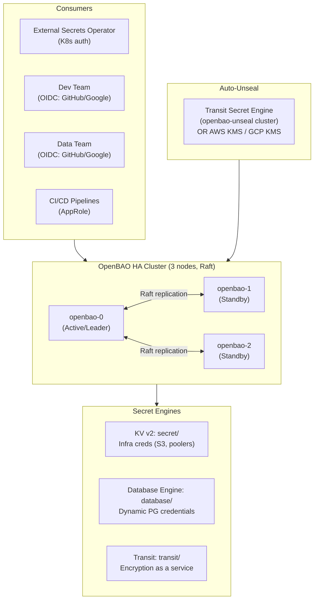
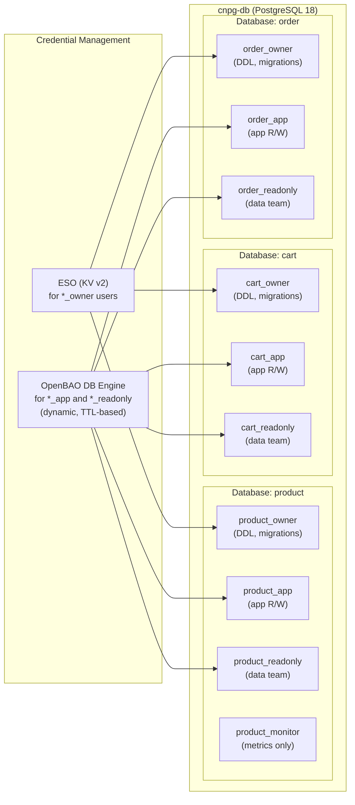

# OpenBAO Production-Ready Plan
## Migrating from HashiCorp Vault (Dev Mode) to OpenBAO HA

**Date**: 2026-03-27
**Scope**: Secrets management redesign for local Kind + EKS/GKE deployments
**Purpose**: Learning, production patterns, team access control, credential rotation

---

## 1. Current State Audit

### What Is Running Now

| Component | Current Config | Problem |
|-----------|---------------|---------|
| HashiCorp Vault 0.32.0 | Dev mode, in-memory, root token = `root` | Data lost on restart, no TLS, insecure |
| ESO 2.1.0 | `ClusterSecretStore: vault-dev` via Kubernetes auth | Works but tied to dev Vault |
| KV policy | Wildcard `secret/data/*` for ESO | No least-privilege |
| DB passwords | All `postgres` or `admin` | Trivially guessable |

### Secrets Currently Managed via ESO → Vault

| Vault Path | ESO Resource | Namespace(s) | Purpose |
|-----------|-------------|--------------|---------|
| `secret/local/databases/cnpg-db/product` | `cnpg-db-secret` | product | CNPG bootstrap owner |
| `secret/local/databases/cnpg-db/cart` | `cnpg-db-cart-secret` | product, cart | Cart app DB creds |
| `secret/local/databases/cnpg-db/order` | `cnpg-db-order-secret` | product, order | Order app DB creds |
| `secret/local/databases/pgdog-cnpg/credentials` | `pgdog-cnpg-credentials` | product | PgDog pooler admin |
| `secret/local/infra/rustfs/backup-zalando` | `ClusterExternalSecret: pg-backup-rustfs-walg` | auth, user, review | WAL-G S3 backup creds |
| `secret/local/infra/rustfs/backup-cnpg` | `ClusterExternalSecret: pg-backup-rustfs-cnpg` | product, cart | Barman S3 backup creds |

### Database Credential Issues Found

**CloudNativePG (cnpg-db, PG18)**:
- `product` user: password `postgres` stored in Vault KV — owner created via bootstrap secret
- `cart` user: **hardcoded** `CREATE USER cart WITH PASSWORD 'postgres'` in `postInitSQL` — bypasses ESO
- `order` user: **hardcoded** `CREATE USER "order" WITH PASSWORD 'postgres'` in `postInitSQL` — bypasses ESO
- PgDog pooler: `admin/admin` — completely insecure

**Zalando (auth-db, PG17)**:
- `auth` user: Zalando operator creates K8s secret natively (`auth.auth-db.credentials.postgresql.acid.zalan.do`)
- `pooler` user: Zalando operator manages — not in Vault
- No rotation mechanism

**Zalando (supporting-shared-db, PG16)**:
- `user`, `notification`, `shipping`, `review`, `pooler` users: Zalando operator manages K8s secrets natively
- No rotation mechanism

---

## 2. OpenBAO Feature Selection

### Why OpenBAO Over HashiCorp Vault

OpenBAO is a community fork of HashiCorp Vault created after the BSL license change (2023). It is:
- Apache 2.0 licensed (truly open source)
- Binary/API-compatible with Vault — ESO, k8s auth, all existing patterns work
- A CNCF Sandbox project under OpenSSF
- Versioned at 2.x (latest stable: 2.5.x)
- Drop-in replacement: rename `vault` CLI to `bao`, same API paths

### Feature Matrix — Which to Implement

#### Tier 1: Essential (Production Foundation)

| Feature | Use Case | Why This Project |
|---------|----------|-----------------|
| **HA + Integrated Storage (Raft)** | 3-node cluster, no external storage | Resilience; data survives pod restarts/restarts |
| **Seal/Unseal** | Auto-unseal via Transit or KMS | Manual unseal is operational burden at 3AM |
| **Kubernetes Auth** | ESO authenticates as K8s ServiceAccount | Current pattern — keep it, it works |
| **Policies** | Least-privilege per team/service | Replace wildcard with scoped access |
| **KV v2 (Static Secrets)** | Infrastructure creds (S3, poolers) | Same as today — just production-ready |
| **Lease, Renew, Revoke** | Database dynamic credentials | Core rotation mechanism |
| **Tokens** | Service/batch tokens per consumer | Proper TTLs instead of root token |

#### Tier 2: Important (Team Access & Rotation)

| Feature | Use Case | Why This Project |
|---------|----------|-----------------|
| **Database Secrets Engine** | Dynamic PG credentials per service | Eliminates static `postgres/postgres` passwords |
| **Password Policies** | Enforce complexity, length for DB users | Compliance; EKS/GKE production requirement |
| **Username Templating** | `v-k8s-product-{{.RoleName}}-{{unix_time}}` | Audit trail — know which lease touched what |
| **Identity + Groups** | dev-team group, data-team group | Map OIDC groups → Vault policies |
| **OIDC Provider** | Human operator SSO (GitHub OIDC, Google) | Dev/data teams don't need personal Vault tokens |
| **Namespaces** | `local/`, `staging/`, `prod/` isolation | Multi-environment without multiple clusters |

#### Tier 3: Good to Have (Operational Excellence)

| Feature | Use Case | Why This Project |
|---------|----------|-----------------|
| **Response Wrapping** | One-time secret delivery in CI/CD | Deliver bootstrap secrets to pipelines securely |
| **Resource Quotas** | Rate-limit ESO refresh storms | Protect OpenBAO from misconfigured `refreshInterval: 1s` |
| **User Lockout** | Brute-force protection for OIDC users | Security hardening |
| **Recovery Mode** | Emergency cluster recovery | Day-2 operations; when Raft quorum is lost |
| **PGP/Keybase** | Encrypt unseal keys at initialization | Security ceremony; store encrypted shards offline |
| **Audit Logging** | Already enabled (stdout → Vector → Loki) | Keep; extend to file backend for compliance |

#### Tier 4: Skip for Now

| Feature | Reason to Skip |
|---------|---------------|
| **Dev Server** | That's what we're moving away from |
| **Transform** | Format-preserving encryption — not needed unless masking PII in apps |
| **Mount Migration** | Only needed when reorganizing existing mount paths |
| **Duration String Format** | Documentation reference, not a deployable feature |
| **Profile System** | UI convenience feature — low priority |

---

## 3. Architecture Design

### OpenBAO Cluster Topology



### Namespace Structure

```
root/
├── local/          ← Kind/local dev environment
│   ├── secret/     ← KV v2 for infra secrets
│   └── database/   ← Dynamic DB credentials
├── staging/        ← Staging namespace (future)
│   ├── secret/
│   └── database/
└── prod/           ← Production namespace (EKS/GKE)
    ├── secret/
    └── database/
```

> For Kind (local): use `local/` namespace.
> For EKS: create `prod/` namespace. ESO ClusterSecretStore points to `prod/`.

### Auth Methods

| Method | Path | Used By | Token TTL |
|--------|------|---------|-----------|
| Kubernetes | `auth/kubernetes` | ESO (service accounts) | 1h, renewable |
| OIDC | `auth/oidc` | Dev team, data team, DevOps | 8h (working session) |
| AppRole | `auth/approle` | CI/CD (GitHub Actions) | 1h, non-renewable |
| Token (root) | — | Initial bootstrap only — revoke after setup | Revoke immediately |

### Policy Structure

```
policies/
├── eso-read-local          ← ESO: read KV secret/local/*, database leases
├── eso-read-prod           ← ESO (prod): read KV secret/prod/*
├── service-product         ← Dynamic DB creds: product role only
├── service-cart            ← Dynamic DB creds: cart role only
├── service-order           ← Dynamic DB creds: order role only
├── service-auth            ← Dynamic DB creds: auth role only
├── service-user            ← Dynamic DB creds: user/notification/shipping/review roles
├── dev-team-rw             ← Developers: KV read/write dev paths + dynamic RW DB creds
├── dev-team-ro             ← Developers: KV read dev paths + dynamic RO DB creds
├── data-team-ro            ← Data team: dynamic read-only DB creds only
├── devops-admin            ← Full admin (DevOps team)
└── cicd-deploy             ← CI/CD: write KV deploy artifacts, no DB access
```

---

## 4. Database Credential Redesign

### Strategy: Two-Track Approach

**Track A — KV v2 (Static Secrets)**: For credentials that operators manage (infra, backup S3, pooler admin). Same pattern as today.

**Track B — Database Engine (Dynamic Secrets)**: For application database access. OpenBAO creates/destroys short-lived PG users on demand. ESO uses `VaultDynamicSecret` generator or polls `/database/creds/{role}`.

### Database Users Per Cluster

#### CloudNativePG (cnpg-db) — Product, Cart, Order Databases



**Fix for postInitSQL hardcoded passwords** — Replace with ExternalSecret-backed secrets:
```yaml
# cnpg-db/instance.yaml postInitSQL — replace hardcoded passwords
# Remove: CREATE USER cart WITH PASSWORD 'postgres';
# Replace with: reference cnpg-db-cart-secret (ESO-backed) in bootstrap
# Use CNPG managed.roles (v1.22+) to declare users declaratively
```

CNPG `managed.roles` feature allows declaring DB roles in the Cluster spec with `passwordSecret` referencing a K8s Secret (backed by ESO → OpenBAO).

#### Zalando (auth-db) — Auth Database

Zalando operator **owns** user/password lifecycle and creates K8s secrets natively. Options:

1. **Keep Zalando-native** (recommended for `auth` user): Let Zalando manage `auth` user secret. Use `passwordFromSecret` if Zalando supports it (it does via `enableTeamMemberDeprecation`).
2. **Rotation via Zalando**: Zalando operator supports password rotation via annotation `zalando.org/controller-restart-allowed: "true"` and `patronictl` triggers.
3. **Add app-level users via OpenBAO DB Engine**: Create `auth_app_rw` and `auth_readonly` via OpenBAO dynamic roles — applications use dynamic credentials, not the Zalando-managed `auth` owner.

#### Zalando (supporting-shared-db) — User, Notification, Shipping, Review

Same pattern as auth-db: Zalando manages owner users. Add:
- `{service}_app_rw` — dynamic, short-lived, for application pods
- `{service}_readonly` — dynamic, read-only, for data team/analytics

### Dynamic Credential Role Definitions

```hcl
# Example: OpenBAO DB role for product app (read-write)
path "database/creds/product-app-rw" {
  capabilities = ["read"]
}

# Role configuration:
# creation_statements = [
#   "CREATE ROLE \"{{name}}\" WITH LOGIN PASSWORD '{{password}}' VALID UNTIL '{{expiration}}';",
#   "GRANT CONNECT ON DATABASE product TO \"{{name}}\";",
#   "GRANT USAGE ON SCHEMA public TO \"{{name}}\";",
#   "GRANT SELECT, INSERT, UPDATE, DELETE ON ALL TABLES IN SCHEMA public TO \"{{name}}\";",
#   "ALTER DEFAULT PRIVILEGES IN SCHEMA public GRANT SELECT, INSERT, UPDATE, DELETE ON TABLES TO \"{{name}}\";"
# ]
# default_ttl = "1h"
# max_ttl = "24h"
```

```hcl
# Example: Read-only role for data team
# creation_statements = [
#   "CREATE ROLE \"{{name}}\" WITH LOGIN PASSWORD '{{password}}' VALID UNTIL '{{expiration}}';",
#   "GRANT CONNECT ON DATABASE product TO \"{{name}}\";",
#   "GRANT USAGE ON SCHEMA public TO \"{{name}}\";",
#   "GRANT SELECT ON ALL TABLES IN SCHEMA public TO \"{{name}}\";",
#   "ALTER DEFAULT PRIVILEGES IN SCHEMA public GRANT SELECT ON TABLES TO \"{{name}}\";"
# ]
# default_ttl = "8h"   ← data team work session
# max_ttl = "24h"
```

### Password Policy (OpenBAO)

```hcl
# /sys/policies/password/db-strong
length = 32
rule "charset" {
  charset = "abcdefghijklmnopqrstuvwxyz"
  min-chars = 4
}
rule "charset" {
  charset = "ABCDEFGHIJKLMNOPQRSTUVWXYZ"
  min-chars = 4
}
rule "charset" {
  charset = "0123456789"
  min-chars = 4
}
rule "charset" {
  charset = "!@#%^&*()-_=+[]"
  min-chars = 2
}
```

### Username Templating

```hcl
# Template for audit trail: v-k8s-{role}-{unix_time}
username_template = "v-k8s-{{.RoleName | truncate 20}}-{{unix_time}}"
# Example: v-k8s-product-app-rw-1711584000
# Max PG username length = 63 chars — stays under limit
```

### Rotation Schedule (Production)

| Credential Type | TTL | Max TTL | Rotation Trigger |
|----------------|-----|---------|-----------------|
| App dynamic creds (services) | 1h | 24h | ESO `refreshInterval: 55m` |
| Dev team dynamic creds | 8h | 16h | OIDC session expiry |
| Data team readonly creds | 8h | 24h | OIDC session expiry |
| Static owner creds (Flyway) | 90 days | — | Manual or scheduled job |
| S3/backup creds (KV) | N/A | — | Manual rotation (no auto-rotation) |
| OIDC/CI tokens | 1h | 1h | Non-renewable |

---

## 5. Installation Plan

### Phase 1: OpenBAO HA Cluster (Replace Vault Dev)

**Helm Chart Setup** — Replace `kubernetes/infra/controllers/secrets/vault/helmrelease.yaml`:

```yaml
# openbao HelmRelease (HA mode with Raft)
apiVersion: helm.toolkit.fluxcd.io/v2
kind: HelmRelease
metadata:
  name: openbao
  namespace: openbao
spec:
  chart:
    spec:
      chart: openbao
      sourceRef:
        kind: HelmRepository
        name: openbao
        namespace: flux-system
      version: "0.9.x"  # Latest from openbao/openbao-helm
  values:
    global:
      tlsDisable: false  # TLS enabled in production
    server:
      ha:
        enabled: true
        replicas: 3
        raft:
          enabled: true
          setNodeId: true
        config: |
          ui = true
          listener "tcp" {
            tls_disable = 0
            address = "[::]:8200"
            cluster_address = "[::]:8201"
            tls_cert_file = "/openbao/userconfig/tls/tls.crt"
            tls_key_file  = "/openbao/userconfig/tls/tls.key"
          }
          storage "raft" {
            path    = "/openbao/data"
            retry_join {
              leader_api_addr = "https://openbao-0.openbao-internal:8200"
            }
            retry_join {
              leader_api_addr = "https://openbao-1.openbao-internal:8200"
            }
            retry_join {
              leader_api_addr = "https://openbao-2.openbao-internal:8200"
            }
          }
          # Auto-unseal: AWS KMS (EKS) or Transit (local Kind)
          seal "transit" {
            address            = "http://openbao-unseal.openbao.svc.cluster.local:8200"
            token              = "UNSEAL_TOKEN"
            disable_renewal    = "false"
            key_name           = "autounseal"
            mount_path         = "transit/"
          }
          service_registration "kubernetes" {}
      dataStorage:
        enabled: true
        size: 10Gi
        storageClass: standard
      auditStorage:
        enabled: true
        size: 5Gi
```

**TLS**: Use `cert-manager` (already in stack) to issue a Certificate for OpenBAO:
```yaml
# Certificate for OpenBAO — issued by cluster CA
apiVersion: cert-manager.io/v1
kind: Certificate
metadata:
  name: openbao-tls
  namespace: openbao
spec:
  secretName: openbao-tls
  issuerRef:
    name: cluster-issuer
    kind: ClusterIssuer
  dnsNames:
    - openbao.openbao.svc.cluster.local
    - openbao-0.openbao-internal.openbao.svc.cluster.local
    - openbao-1.openbao-internal.openbao.svc.cluster.local
    - openbao-2.openbao-internal.openbao.svc.cluster.local
```

**Auto-Unseal Strategy**:
- **Kind (local)**: Dedicated single-node `openbao-unseal` instance (standalone, minimal) that seals itself via Shamir. The HA cluster uses this as a Transit auto-unseal target. The unseal cluster only needs to unseal manually once after local cluster restart.
- **EKS**: Use `seal "awskms"` with IAM role (IRSA). Zero manual unseal steps.
- **GKE**: Use `seal "gcpckms"` with Workload Identity.

**Initialization Ceremony (One-Time)**:
```bash
# Initialize with PGP keys for secure shard distribution
bao operator init \
  -key-shares=5 \
  -key-threshold=3 \
  -pgp-keys="keybase:devops1,keybase:devops2,keybase:devops3,keybase:devops4,keybase:devops5" \
  -root-token-pgp-key="keybase:devops-lead"

# Store encrypted shards offline (password manager + printed backup)
# Revoke root token after bootstrap is complete
bao token revoke <root-token>
```

> For local Kind (learning): use `-key-shares=1 -key-threshold=1` without PGP. Store unseal key in 1Password or similar.

### Phase 2: Bootstrap Script Redesign

Replace the current bootstrap Job with a proper init procedure:

```
bootstrap/
├── 00-init-check.sh        ← Check if already initialized (idempotent)
├── 01-enable-engines.sh    ← Enable KV v2, database engine, transit, audit
├── 02-kubernetes-auth.sh   ← Configure Kubernetes auth + roles
├── 03-oidc-auth.sh         ← Configure OIDC (GitHub/Google)
├── 04-policies.sh          ← Write all policies (least-privilege)
├── 05-namespaces.sh        ← Create local/, staging/, prod/ namespaces
├── 06-db-connections.sh    ← Configure database engine connections
├── 07-db-roles.sh          ← Define dynamic roles per service/team
├── 08-kv-seed.sh           ← Seed static KV secrets (infra/backup creds)
└── 09-password-policies.sh ← Write password policies
```

The Job runs **only if vault is not already initialized** (checks `bao status -format=json | jq '.initialized'`).

### Phase 3: ESO Integration Update

Update `ClusterSecretStore` to point to OpenBAO:

```yaml
apiVersion: external-secrets.io/v1
kind: ClusterSecretStore
metadata:
  name: openbao
  # Keep old 'vault-dev' as deprecated alias during migration
spec:
  provider:
    vault:
      server: "https://openbao.openbao.svc.cluster.local:8200"
      path: "secret"
      version: "v2"
      namespace: "local"  # OpenBAO namespace
      caBundle: <base64-cert-manager-CA>
      auth:
        kubernetes:
          mountPath: "kubernetes"
          role: "eso-reader"
          serviceAccountRef:
            name: external-secrets
            namespace: external-secrets-system
```

ESO v2.1.0 is compatible with OpenBAO (same Vault API).

---

## 6. Production Use Cases for EKS/GKE

### Use Case 1: Application Database Credentials (Auto-Rotation)

Services never see static passwords. ESO requests fresh dynamic credentials from OpenBAO before each TTL expiry.

```
Flow:
Pod (product-service) → reads K8s Secret (cnpg-db-product-creds)
                                           ↑
                       ESO refreshes every 55m (before 1h TTL)
                                           ↑
                       OpenBAO DB engine creates: v-k8s-product-app-rw-{ts}
                                           ↑
                       PostgreSQL: new user with SELECT/INSERT/UPDATE/DELETE
                                   old user automatically expired/dropped
```

**Result**: New credentials every hour. No human ever knows the password.

### Use Case 2: Rotation Every 90 Days (Compliance)

For static owner credentials (Flyway migrations):

```bash
# Triggered by CI/CD pipeline on schedule (GitHub Actions cron)
# Or: OpenBAO static role with rotation_period = "2160h" (90d)
bao write database/static-roles/product-owner \
  db_name=cnpg-db \
  username=product_owner \
  rotation_statements=["ALTER USER \"{{name}}\" WITH PASSWORD '{{password}}';"] \
  rotation_period=2160h
```

ESO fetches the rotated password automatically at next `refreshInterval`.

### Use Case 3: Dev Team Database Access

Developer wants to query the product database:

```bash
# Developer authenticates via OIDC (GitHub SSO)
bao login -method=oidc role="dev-team"
# → Redirected to GitHub OIDC
# → Gets Vault token with policy: dev-team-rw
# → Token valid for 8h (working session)

# Request database credentials
bao read database/creds/product-app-rw
# Key             Value
# lease_id        database/creds/product-app-rw/abc123
# lease_duration  8h
# username        v-k8s-product-app-rw-1711584000
# password        Xk9mN3pQ...

# Connect to DB
psql -h cnpg-db-rw.product.svc.cluster.local \
     -U v-k8s-product-app-rw-1711584000 \
     -d product
```

Credentials auto-expire after 8h. Audit log shows exactly which developer accessed what.

### Use Case 4: Data Team Read-Only Access

```bash
# Data analyst authenticates
bao login -method=oidc role="data-team"
# Gets policy: data-team-ro

# Request read-only credentials for all databases
bao read database/creds/product-readonly
bao read database/creds/cart-readonly
bao read database/creds/order-readonly

# BI tool (Metabase, Tableau) connects with these time-limited credentials
```

### Use Case 5: Multi-Environment Isolation (Namespaces)

```bash
# Local development
bao kv put local/secret/databases/cnpg-db/product password=dev123

# Production (EKS)
bao kv put -namespace=prod secret/databases/cnpg-db/product password=<strong-generated>

# ESO for local cluster → ClusterSecretStore namespace: local
# ESO for prod cluster  → ClusterSecretStore namespace: prod
```

Teams in production cannot read local secrets and vice versa.

### Use Case 6: CI/CD Pipeline Secret Access (AppRole)

```bash
# GitHub Actions workflow:
# 1. Authenticate with AppRole (role_id stored in repo vars, secret_id from OpenBAO response wrapping)
VAULT_TOKEN=$(bao write -f auth/approle/login \
  role_id=$VAULT_ROLE_ID \
  secret_id=$VAULT_SECRET_ID | jq -r '.auth.client_token')

# 2. Get deployment secret (write-once wrapped token delivered via CI/CD secret)
bao kv get -namespace=prod secret/cicd/deploy-config
```

Response wrapping ensures `secret_id` is delivered once-only and expires after first use.

---

## 7. Migration Phases

### Phase 0: Preparation (No Downtime Impact)

- [ ] Deploy `cert-manager` ClusterIssuer (if not exists)
- [ ] Create OpenBAO namespace and RBAC
- [ ] Add OpenBAO Helm repository to Flux
- [ ] Design and review all policies (code review)
- [ ] Prepare init ceremony (PGP keys or 1Password for local)

### Phase 1: Deploy OpenBAO HA (Parallel Run)

- [ ] Deploy OpenBAO 3-node HA cluster in `openbao` namespace
- [ ] Initialize and unseal (manual for local Kind)
- [ ] Run bootstrap scripts (engines, auth, policies, namespaces)
- [ ] Seed static KV secrets (same paths as Vault)
- [ ] Create new `ClusterSecretStore: openbao` alongside existing `vault-dev`
- [ ] Verify ESO can read secrets from OpenBAO

### Phase 2: Migrate ExternalSecrets (Rolling)

- [ ] Update each ExternalSecret to reference `vault-dev → openbao` store
- [ ] Verify K8s secrets are recreated correctly
- [ ] Test application connectivity for each service
- [ ] Monitor ESO metrics for sync errors

Order: non-critical first → infra backup creds → DB credentials

### Phase 3: Database Engine + Dynamic Credentials

- [ ] Configure OpenBAO database engine for cnpg-db
- [ ] Create `*_app_rw` and `*_readonly` PostgreSQL roles (using CNPG `managed.roles`)
- [ ] Fix CNPG `postInitSQL` hardcoded passwords (remove `PASSWORD 'postgres'`)
- [ ] Define OpenBAO dynamic roles per service and team
- [ ] Update ExternalSecrets to use dynamic credential endpoint
- [ ] Validate rotation: confirm old user is dropped, new user connects

### Phase 4: Team Access + OIDC

- [ ] Configure OIDC auth method (GitHub OAuth App or Google Workspace)
- [ ] Create Identity groups: `devops`, `dev-team`, `data-team`
- [ ] Map OIDC groups → Vault group aliases → policies
- [ ] Document developer workflow (bao login + bao read database/creds)
- [ ] Test dev team and data team credential requests

### Phase 5: Decommission Vault Dev

- [ ] Confirm all services use OpenBAO `ClusterSecretStore`
- [ ] Remove `ClusterSecretStore: vault-dev`
- [ ] Delete Vault HelmRelease from Flux
- [ ] Remove `hashicorp` HelmRepository
- [ ] Update `docs/secrets/secrets-management.md`
- [ ] Archive vault bootstrap ConfigMap

---

## 8. Key Files to Create/Modify

```
kubernetes/infra/controllers/secrets/
├── openbao/                           ← NEW (replaces vault/)
│   └── helmrelease.yaml               ← OpenBAO HA Helm chart
├── vault/
│   └── helmrelease.yaml               ← DELETE after migration
└── kustomization.yaml                 ← Update to include openbao/

kubernetes/infra/configs/secrets/
├── openbao-bootstrap/                 ← NEW (replaces vault-bootstrap/)
│   ├── configmap.yaml                 ← Bootstrap scripts (split by phase)
│   ├── job.yaml                       ← Init Job
│   └── kustomization.yaml
├── cluster-secret-store.yaml          ← Update server URL + namespace
├── cluster-external-secrets/          ← Update secretStoreRef to 'openbao'
│   ├── pg-backup-rustfs-walg.yaml
│   └── pg-backup-rustfs-cnpg.yaml
└── vault-bootstrap/                   ← DELETE after migration

kubernetes/infra/configs/databases/clusters/cnpg-db/
├── instance.yaml                      ← Remove postInitSQL hardcoded passwords
│                                         Add managed.roles section
└── secrets/
    ├── cnpg-db-cart-bootstrap.yaml    ← NEW ExternalSecret for cart_owner
    └── cnpg-db-order-bootstrap.yaml   ← NEW ExternalSecret for order_owner
```

---

## 9. Operational Procedures (Day-2)

### Unseal After Restart (Kind/Local)

```bash
# Check status
kubectl exec -n openbao openbao-0 -- bao status

# If sealed, unseal (Shamir - local only)
kubectl exec -n openbao openbao-0 -- bao operator unseal <key1>
kubectl exec -n openbao openbao-0 -- bao operator unseal <key2>
kubectl exec -n openbao openbao-0 -- bao operator unseal <key3>
# Repeat for openbao-1 and openbao-2 (if auto-unseal not configured)
```

### Take Raft Snapshot (Backup)

```bash
# Backup OpenBAO state (run weekly via CronJob)
bao operator raft snapshot save openbao-snapshot-$(date +%Y%m%d).snap

# Upload to S3/RustFS
aws s3 cp openbao-snapshot-*.snap s3://openbao-backups/
```

### Rotate Static Credentials Manually

```bash
# Rotate S3/backup credentials
bao kv put local/secret/infra/rustfs/backup-cnpg \
  access_key_id=<new-key> \
  secret_access_key=<new-secret>

# ESO refreshes within refreshInterval (1h)
# Force immediate refresh:
kubectl annotate externalsecret pg-backup-rustfs-cnpg \
  force-sync=$(date +%s) --overwrite -n product
```

### Revoke Leaked Credential

```bash
# If a database credential lease is compromised:
bao lease revoke database/creds/product-app-rw/<lease-id>

# Revoke all leases for a role (incident response):
bao lease revoke -prefix database/creds/product-app-rw/

# OpenBAO immediately drops the PostgreSQL user
```

### Add New Service (Onboarding)

1. Create OpenBAO policy: `service-{name}` (read dynamic creds for `{name}-app-rw`)
2. Create Kubernetes auth role: bind to `{name}` ServiceAccount in `{name}` namespace
3. Create DB role in OpenBAO database engine: `{name}-app-rw` and `{name}-readonly`
4. Create ExternalSecret in service namespace referencing dynamic creds
5. Add `managed.roles` entry in CNPG Cluster spec (for CNPG services)

---

## 10. Summary Recommendation

For this project's goals (learning + production patterns + EKS/GKE readiness):

| Priority | Action |
|----------|--------|
| **Do immediately** | Deploy OpenBAO HA with Raft storage, TLS, proper policies |
| **Do soon** | Fix CNPG hardcoded passwords; implement password policies |
| **Do for team access** | OIDC auth for dev/data teams; Identity groups |
| **Do for EKS/GKE** | Switch Transit auto-unseal → AWS KMS / GCP KMS; enable Namespaces |
| **Do for compliance** | Static role 90-day rotation; audit log → Loki pipeline |
| **Skip for now** | Transform engine, Mount migration, PGP ceremony (until real production) |

The biggest immediate security wins are:
1. Remove Vault dev mode (no more data loss on restart, no root token exposed)
2. Enable TLS end-to-end
3. Replace wildcard ESO policy with scoped per-path policies
4. Fix hardcoded `postgres` passwords in CNPG postInitSQL
5. Implement database engine with dynamic credentials (kills static password problem entirely)
