# OpenBAO Architecture

> **Status**: Migration target — replacing HashiCorp Vault (Dev Mode) with OpenBAO HA
>
> **Scope**: OpenBAO internals, current local Kind behavior, and production-target learning notes.

> ### ⚠ Current deployment state vs. planned
>
> Much of this guide describes the **production target**. What the local Kind
> cluster **actually runs today**:
>
> | Capability | Deployed now (local Kind) | Planned for prod |
> |---|---|---|
> | Storage / HA | ✅ OpenBAO HA, 3-node Raft, PVC | same |
> | App secret delivery | ✅ ESO + **KV v2 static** secrets (`refreshInterval: 1h`) | + dynamic DB creds |
> | Auth (ESO) | ✅ Kubernetes auth, least-privilege `eso-read` policy | + OIDC for humans |
> | Audit | ⚠ `file → stdout` **best-effort** (enablement is not fail-closed; `auditStorage` off) | durable, fail-closed |
> | **Database secrets engine / dynamic creds** | ❌ **not enabled** — §5.2, §6, §10, §14 describe the *planned* design | enable DB engine |
> | Unseal | ❌ **Shamir key + root token in a K8s Secret** (`openbao-init-keys`), re-read by a 60s unsealer CronJob | KMS / Transit auto-unseal |
> | TLS | ❌ disabled (`tlsDisable: true`; plaintext HTTP in-cluster) | TLS via cert-manager |
> | Credentials | ❌ dev passwords **seeded from Git** (e.g. `*-K1nd-2026!`) | generated / dynamic, none in Git |
> | Root token | ❌ persisted, **not revoked** after bootstrap | revoked; OIDC / AppRole |
>
> **These local-only choices are unsafe for production.** The hardening path and a
> local-vs-prod parity/testing matrix live in [RFC-0008](../proposals/rfc/RFC-0008/).
> Any section below describing dynamic credentials, leases, OIDC, or auto-unseal is
> **planned**, not deployed.

---

## 1. What Is OpenBAO?

**OpenBAO** is an open-source fork of HashiCorp Vault, created after the BSL license change in 2023. It is:

- **Apache 2.0 licensed** — truly open-source, no enterprise licensing concerns
- **API-compatible with Vault** — ESO, Kubernetes auth, all existing patterns carry over unchanged
- **CNCF Sandbox project** under the OpenSSF
- **Drop-in replacement** — rename `vault` CLI to `bao`, same REST API paths (`/v1/...`)
- **Actively maintained** — this repo currently deploys OpenBAO 2.5.x via the OpenBAO Helm chart

### Why Migrate from Vault Dev Mode

| Problem | Vault Dev Mode | OpenBAO Production |
|---------|---------------|-------------------|
| Data persistence | ❌ In-memory, lost on restart | ✅ Raft PVC, survives reboots |
| Unseal | ❌ Always unsealed with root token | ✅ Auto-unseal via KMS / Transit |
| TLS | ❌ HTTP only | ✅ TLS everywhere |
| High availability | ❌ Single node | ✅ 3-node Raft cluster |
| Root token | ❌ Static `root` in Git | ✅ Revoked after init, operator access via OIDC |
| DB credentials | ❌ Static `postgres/postgres` | ✅ Dynamic, TTL-based, per-service |
| Multi-environment | ❌ One flat namespace | ✅ Namespaces: `local/`, `staging/`, `prod/` |
| License | ❌ BSL (non-OSS) | ✅ Apache 2.0 |

> This table is the canonical **Vault → OpenBAO** comparison (the legacy
> `vault.md` dev-mode doc has been retired). The decision and the rejected
> alternatives are recorded in
> [ADR-005](../proposals/adr/ADR-005-openbao-ha-raft/); the dev-vs-prod
> seal/TLS/credential tradeoffs and how to close them are in
> [RFC-0008](../proposals/rfc/RFC-0008/) and the current-state banner above.

---

## 2. OpenBAO Runtime Architecture

The diagram below summarizes the **logical** HA stack: traffic enters via the
in-cluster service, three Raft peers form the quorum, each peer persists Raft
state to PVCs, and ESO syncs OpenBAO-backed values into Kubernetes Secrets.

### High-Level Overview

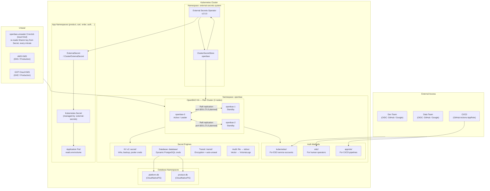

### Raft Cluster Internals

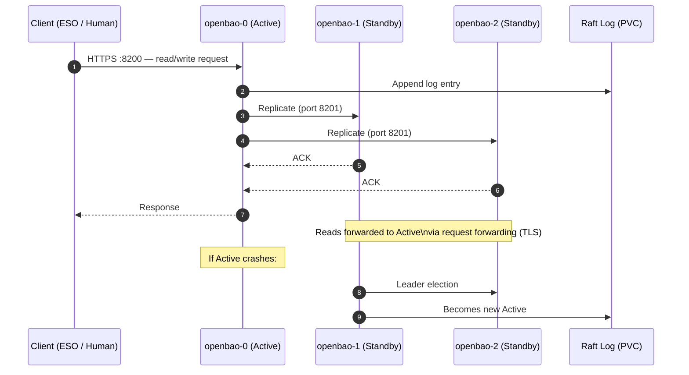

---

## 3. Seal / Unseal Architecture

Unsealing is the process of decrypting the root key so OpenBAO can serve requests. OpenBAO always starts **sealed**.

### Shamir vs Auto-Unseal

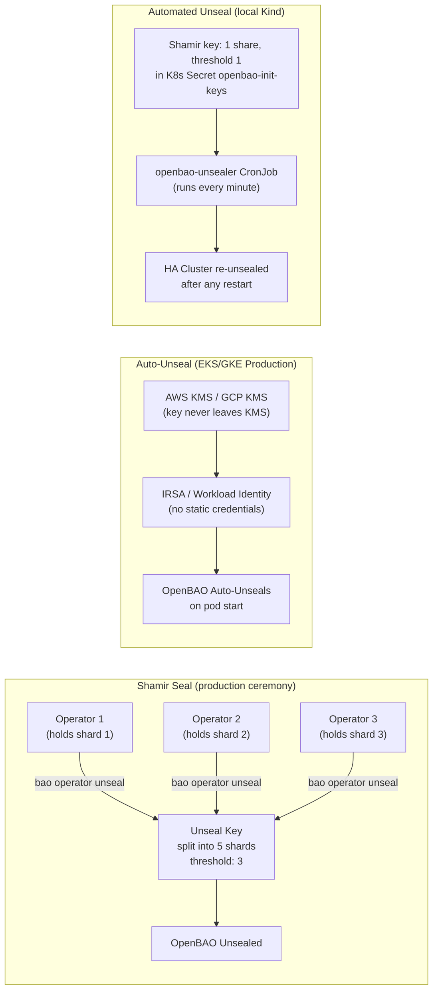

### Unseal Key Management (Init Ceremony)

On first initialization, unseal keys should be split with PGP to prevent any single operator knowing the full key:

```bash
# Production ceremony: 5 shares, threshold 3, each encrypted to a different operator's PGP key
bao operator init \
  -key-shares=5 \
  -key-threshold=3 \
  -pgp-keys="keybase:devops1,keybase:devops2,keybase:devops3,keybase:devops4,keybase:devops5" \
  -root-token-pgp-key="keybase:devops-lead"

# Local Kind (learning): 1 share, 1 threshold, store in 1Password
bao operator init -key-shares=1 -key-threshold=1
```

> **Critical**: After bootstrap is complete, revoke the root token. Operators use OIDC for day-to-day access.

---

## 4. Authentication Methods

### Overview

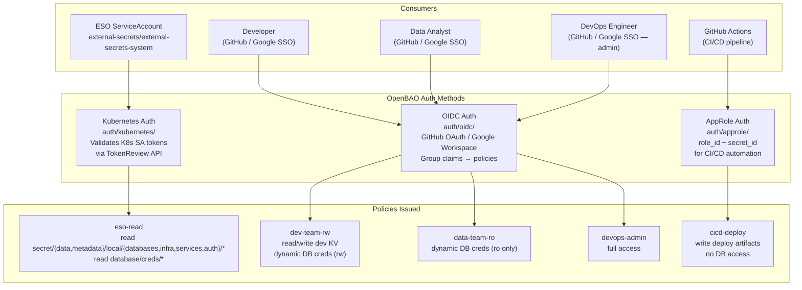

### Kubernetes Auth — ESO Integration

ESO authenticates to OpenBAO using its Kubernetes ServiceAccount token. OpenBAO validates the token against the Kubernetes TokenReview API.

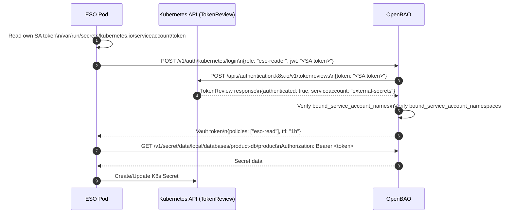

> ⚠️ **Reviewer-JWT pitfall (commit `fb14349`)** — When configuring `auth/kubernetes/config`, **omit** `token_reviewer_jwt` and set `disable_local_ca_jwt=false`. OpenBAO will then call `TokenReview` using its own pod's auto-rotated SA token (long-lived projected token, refreshed by kubelet).
>
> If you instead pass `token_reviewer_jwt=@/var/run/secrets/.../token` from the bootstrap Job's pod, that token is bound by `BoundServiceAccountTokenVolume` to ~1 h. After it expires every login fails with `permission denied` and ESO breaks platform-wide. See [Reviewer JWT auth failure](./runbooks/reviewer-jwt-auth-failure.md) for the runtime recovery procedure.

### OIDC Auth — Developer / Data Team

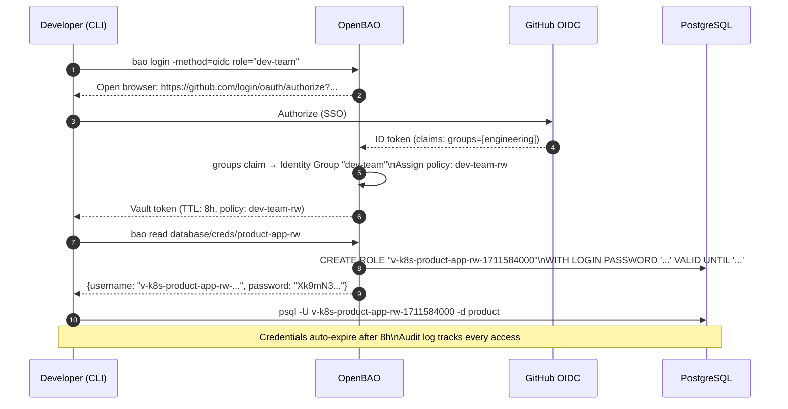

---

## 5. Secret Engines

### 5.1 KV v2 — Static Secrets

Used for infrastructure credentials that cannot be dynamic (S3 backup keys, pooler admin users).

**Path structure** (unchanged from current Vault convention):

```
secret/{environment}/{category}/{service}/{resource}
```

| Environment | KV path prefix | Use |
|-------------|----------------|-----|
| `local` | `secret/local/` | Kind cluster |
| `staging` | `secret/staging/` | Staging environment |
| `prod` | `secret/prod/` | EKS / GKE production |

**Current KV paths** (seeded at bootstrap):

| Path | Keys | Consumer |
|------|------|---------|
| `secret/local/databases/auth-db/auth` | `username`, `password` | platform-db auth owner (compat path) |
| `secret/local/databases/shared-db/user` | `username`, `password` | platform-db user owner (compat path) |
| `secret/local/databases/shared-db/notification` | `username`, `password` | platform-db notification owner (compat path) |
| `secret/local/databases/shared-db/shipping` | `username`, `password` | platform-db shipping owner (compat path) |
| `secret/local/databases/shared-db/review` | `username`, `password` | platform-db review owner (compat path) |
| `secret/local/databases/platform-db/temporal` | `username`, `password` | platform-db temporal owner (Temporal server) |
| `secret/local/databases/product-db/product` | `username`, `password` | CNPG bootstrap owner |
| `secret/local/databases/product-db/cart` | `username`, `password` | CNPG cart owner |
| `secret/local/databases/product-db/order` | `username`, `password` | CNPG order owner |
| `secret/local/databases/product-db/payment` | `username`, `password` | CNPG payment owner (consumed in `product` + `payment` ns) |
| `secret/local/databases/pgdog-cnpg/credentials` | `username`, `password` | PgDog pooler admin |
| `secret/local/services/payment/webhook-hmac` | `secret` | payment ↔ mockpay webhook HMAC (shared signing key) |
| `secret/local/auth/jwt-signing` | `private_key`, `public_key` | RS256 access-token keypair — auth signer (private → ns `auth`) + Kong edge JWT (public → ns `kong`); see [JWT signing key](#jwt-signing-key-auth--kong) |
| `secret/local/infra/rustfs/backup-cnpg` | `access_key_id`, `secret_access_key` | Barman S3 (all CloudNativePG clusters — bucket `pg-backups-cnpg`) |
| `secret/local/infra/cloudflare/api-token` ⚠️ | `api_token` | cert-manager `letsencrypt-{staging,prod}` ClusterIssuers (DNS-01 solver) — **prod only**; on local Kind `kong-proxy-tls` is `homelab-ca`-issued |

> **Note — `secret/local/services/payment/webhook-hmac`**: follows the standard 4-level `secret/{env}/{category}/{service}/{resource}` structure and is covered by the existing `eso-read` `local/services/*` grant. (It was briefly seeded at the 3-level `secret/local/payment/webhook-hmac`, which sat outside every `eso-read` prefix; renaming it into `local/services/*` fixed both the convention and the RBAC scope.)

> ⚠️ **Local vs prod**: on **local Kind** `openbao-bootstrap` **now seeds a dev placeholder** (`dev-cloudflare-placeholder`) so the `cloudflare-api-token` ExternalSecret syncs and doesn't block `secrets-local` (DNS-01 fails locally, which is fine — `kong-proxy-tls` is `homelab-ca`-issued). On **prod** the real token is **operator-supplied** and **not** in Git — re-seed after every fresh cluster — see [OpenBAO initial setup](./runbooks/openbao-initial-setup.md#step-7--seed-bootstrap-only-cloudflare-token-operator).

#### JWT signing key (auth + Kong)

The RS256 access-token keypair is a single OpenBAO secret,
`secret/local/auth/jwt-signing` (`private_key` + `public_key`), that **ESO fans out
to two consumers** — the private half signs, the public half verifies at the edge:

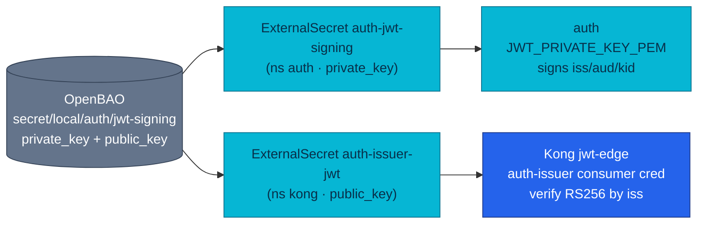

| ExternalSecret | Namespace | Property | Consumer |
|---|---|---|---|
| `auth-jwt-signing` | `auth` | `private_key` | auth env `JWT_PRIVATE_KEY_PEM` — signs access tokens (`iss=https://gateway.duynh.me`, `aud=duynhlab-platform`, `kid`) |
| `auth-issuer-jwt` | `kong` | `public_key` | rendered as a Kong `jwt` credential (`key=https://gateway.duynh.me`, `algorithm=RS256`, `rsa_public_key`) on the `auth-issuer` `KongConsumer` |

**Verification is two-layer.** Kong's `jwt-edge` plugin (on `/private/` routes) looks
up the credential **by the token's `iss` claim** (`key_claim_name: iss`) and checks the
RS256 signature + `exp` — Kong holds only the public key. Each service's `pkg/authmw`
then re-verifies the full token (audience, `nbf`, …) against auth's cached JWKS
(`/auth/v1/public/auth/jwks`) and is authoritative. Contract detail:
[auth service API](../api/auth.md); edge detail: [Kong gateway](../platform/kong-gateway.md).

**Rotation.** Because Kong verifies against the statically provisioned public key (Kong
OSS `jwt` can't fetch a JWKS), the key is dual-target — rotate **both** ExternalSecrets:

1. Write a new keypair to `secret/local/auth/jwt-signing` (both `private_key` + `public_key`).
2. Both ExternalSecrets re-sync (`refreshInterval`); force with `kubectl annotate externalsecret … force-sync=$(date +%s)` if needed.
3. **Restart auth** so it loads the new `JWT_PRIVATE_KEY_PEM`; Kong reloads the new `auth-issuer-jwt` credential automatically.
4. Overlap window: tokens signed by the old key keep validating until their `exp` — keep the old public key alongside the new one until the longest-lived token expires, or accept a short reject window. A JWKS refresh alone only covers the services, **not** Kong's edge credential.

> Path note: this ships at `secret/local/auth/jwt-signing`; [RFC-0009](../proposals/rfc/RFC-0009/) references a pre-implementation `secret/data/<env>/apps/auth/jwt-signing` — the deployed path is the one above.

### 5.2 Database Secrets Engine — Dynamic Credentials

> **⚠ Planned — not yet deployed.** The bootstrap enables only KV v2, Kubernetes
> auth, and audit; the database secrets engine is **not** enabled. Application
> credentials today are **static KV v2** values. This section describes the
> production design (tracked in [RFC-0008](../proposals/rfc/RFC-0008/)).

The **database secrets engine** would generate short-lived, unique PostgreSQL credentials on demand, so no static application passwords need exist.

#### How It Works

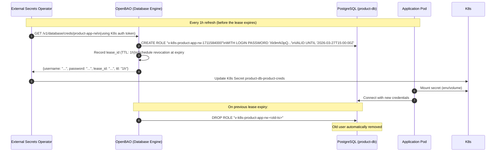

#### Database Connection Configuration

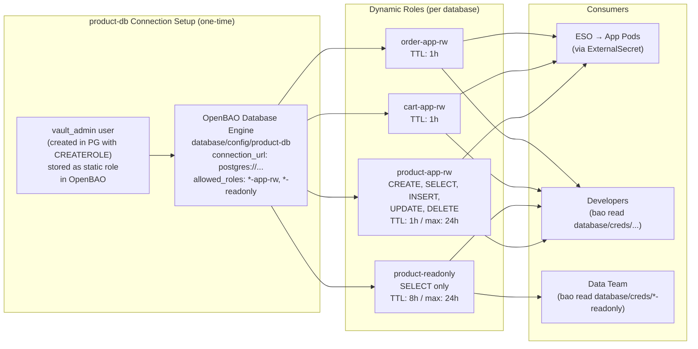

#### Role SQL Templates

**Read-Write role** (application service):
```sql
-- Creation statement (executed by OpenBAO when credential requested)
CREATE ROLE "{{name}}" WITH LOGIN PASSWORD '{{password}}' VALID UNTIL '{{expiration}}';
GRANT CONNECT ON DATABASE product TO "{{name}}";
GRANT USAGE ON SCHEMA public TO "{{name}}";
GRANT SELECT, INSERT, UPDATE, DELETE ON ALL TABLES IN SCHEMA public TO "{{name}}";
ALTER DEFAULT PRIVILEGES IN SCHEMA public
  GRANT SELECT, INSERT, UPDATE, DELETE ON TABLES TO "{{name}}";

-- Revocation statement (executed by OpenBAO on lease expiry)
REVOKE ALL PRIVILEGES ON ALL TABLES IN SCHEMA public FROM "{{name}}";
DROP ROLE IF EXISTS "{{name}}";
```

**Read-only role** (data team / analytics):
```sql
-- Creation statement
CREATE ROLE "{{name}}" WITH LOGIN PASSWORD '{{password}}' VALID UNTIL '{{expiration}}';
GRANT CONNECT ON DATABASE product TO "{{name}}";
GRANT USAGE ON SCHEMA public TO "{{name}}";
GRANT SELECT ON ALL TABLES IN SCHEMA public TO "{{name}}";
ALTER DEFAULT PRIVILEGES IN SCHEMA public GRANT SELECT ON TABLES TO "{{name}}";

-- Revocation statement
REVOKE ALL PRIVILEGES ON ALL TABLES IN SCHEMA public FROM "{{name}}";
DROP ROLE IF EXISTS "{{name}}";
```

---

## 6. Database Credential Workflows

> **⚠ Mixed state.** The `cart`/`order` owners are still created with hardcoded
> passwords in CNPG `postInitSQL` (`instance.yaml`). An ExternalSecret for those
> creds exists but is effectively **bypassed** — the same password is duplicated in
> Git, so it is not a single source of truth and rotating it in OpenBAO would not
> change the DB user. The "OpenBAO Solution" column below is the **planned** target;
> dynamic application users are not yet enabled.

### 6.1 Current State Problems

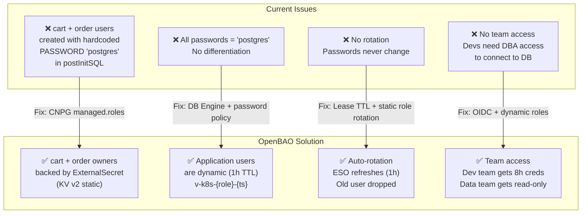

### 6.2 Database User Architecture

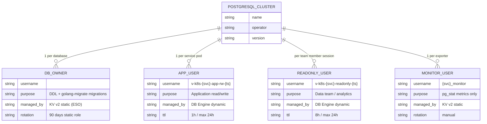

### 6.3 CloudNativePG (product-db) — Credential Flow

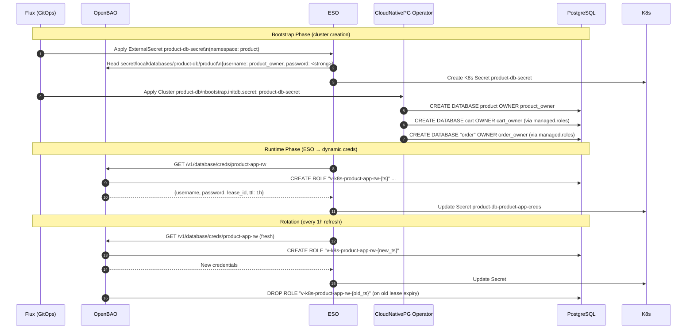

### 6.4 CloudNativePG (`platform-db`, `product-db`) — Credential Strategy

Every cluster now runs on **CloudNativePG**, so credentials follow the same ESO-first
pattern everywhere: owner/role passwords come from OpenBAO KV v2, synced by ESO, and
each service's role + database are declared with the **RFC-0012 triplet** (`ExternalSecret`
+ `DatabaseRole` + `Database`) that the operator applies. There are no operator-generated
credential secrets to reconcile against.

> **Historical:** the retired Zalando operator managed its own K8s secrets
> (`{user}.{cluster}.credentials.postgresql.acid.zalan.do`). The former `auth-db`,
> `shared-db`, and `temporal-db` clusters were consolidated into **`platform-db`**
> (RFC-0018). OpenBAO keeps **compat paths** `auth-db/*` and `shared-db/*` for app
> credentials; Temporal uses the new path `platform-db/temporal`.

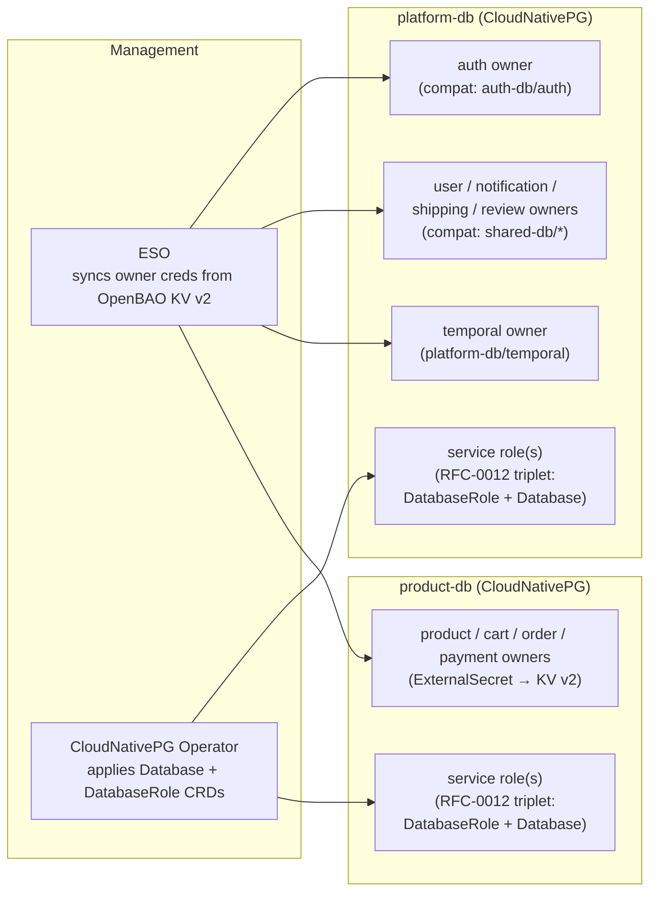

---

## 7. ESO Integration

### ClusterSecretStore (target shape — TLS is planned, RFC-0008)

> **Deployed reality:** the local store uses `server: "http://openbao.openbao.svc.cluster.local:8200"`
> with no `caBundle` (`kubernetes/infra/configs/secrets/cluster-secret-store.yaml` — OpenBAO runs
> `tlsDisable: true` locally). The `https` + `caBundle` shape below is the RFC-0008 target.
> Multi-env isolation is by **KV path prefix** (`secret/local/…`), not an OpenBAO namespace —
> OpenBAO (OSS) has no Enterprise-style namespaces feature.

```yaml
apiVersion: external-secrets.io/v1
kind: ClusterSecretStore
metadata:
  name: openbao
spec:
  provider:
    vault:
      server: "https://openbao.openbao.svc.cluster.local:8200"  # planned (RFC-0008); http:// today
      path: "secret"
      version: "v2"
      caBundle: <base64-ca-cert>   # cert-manager issued CA (planned with TLS)
      auth:
        kubernetes:
          mountPath: "kubernetes"
          role: "eso-reader"
          serviceAccountRef:
            name: external-secrets
            namespace: external-secrets-system
```

### ExternalSecret Pattern (Static KV)

```yaml
apiVersion: external-secrets.io/v1
kind: ExternalSecret
metadata:
  name: product-db-secret
  namespace: product
spec:
  refreshInterval: 1h
  secretStoreRef:
    name: openbao
    kind: ClusterSecretStore
  target:
    name: product-db-secret
    creationPolicy: Owner
    deletionPolicy: Retain
    template:
      type: Opaque
      metadata:
        labels:
          cnpg.io/reload: "true"    # Triggers CNPG to reload on rotation
  data:
    - secretKey: username
      remoteRef:
        key: secret/data/local/databases/product-db/product
        property: username
    - secretKey: password
      remoteRef:
        key: secret/data/local/databases/product-db/product
        property: password
```

### ESO Sync Flow

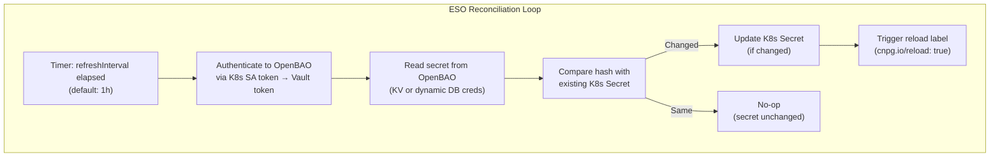

---

## 8. Policies

Policies follow the principle of **least privilege**. No wildcard access in production.

### Policy Hierarchy

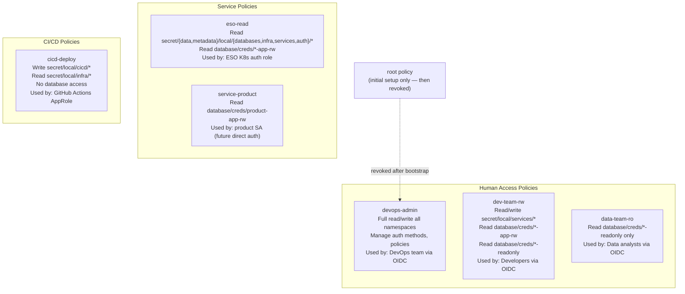

### Policy Syntax Example

```hcl
# eso-read: ESO service account policy (scoped paths, not wildcard)
path "secret/data/local/databases/*" {
  capabilities = ["read", "list"]
}
path "secret/metadata/local/databases/*" {
  capabilities = ["read", "list"]
}
path "secret/data/local/infra/*" {
  capabilities = ["read", "list"]
}
path "secret/metadata/local/infra/*" {
  capabilities = ["read", "list"]
}
path "secret/data/local/services/*" {
  capabilities = ["read", "list"]
}
path "secret/metadata/local/services/*" {
  capabilities = ["read", "list"]
}
# auth/* — auth JWT signing-key ExternalSecrets (RFC-0009 Phase 4 edge JWT)
path "secret/data/local/auth/*" {
  capabilities = ["read", "list"]
}
path "secret/metadata/local/auth/*" {
  capabilities = ["read", "list"]
}
# Dynamic DB credentials (planned — DB engine not yet enabled)
path "database/creds/*-app-rw" {
  capabilities = ["read"]
}

# dev-team-rw: Developer policy with identity templating
path "secret/data/local/services/{{identity.entity.name}}/*" {
  capabilities = ["create", "read", "update", "delete", "list"]
}
path "database/creds/*-app-rw" {
  capabilities = ["read"]
}
path "database/creds/*-readonly" {
  capabilities = ["read"]
}
```

---

## 9. Multi-Environment (KV Path Prefixes)

OpenBAO OSS has **no namespaces** (that is an Enterprise feature — consistent with §7). Multiple environments share a single instance, isolated by **KV v2 path prefixes** under one `secret/` mount (`secret/{environment}/…`) plus scoped policies. A single ESO `ClusterSecretStore` (`openbao`) targets that mount.

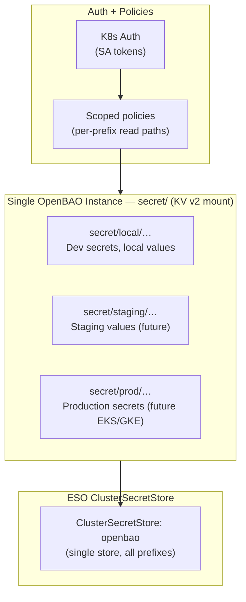

---

## 10. Lease, Renewal, and Revocation

Every dynamic credential in OpenBAO has a **lease** — a time-bounded grant to the secret.

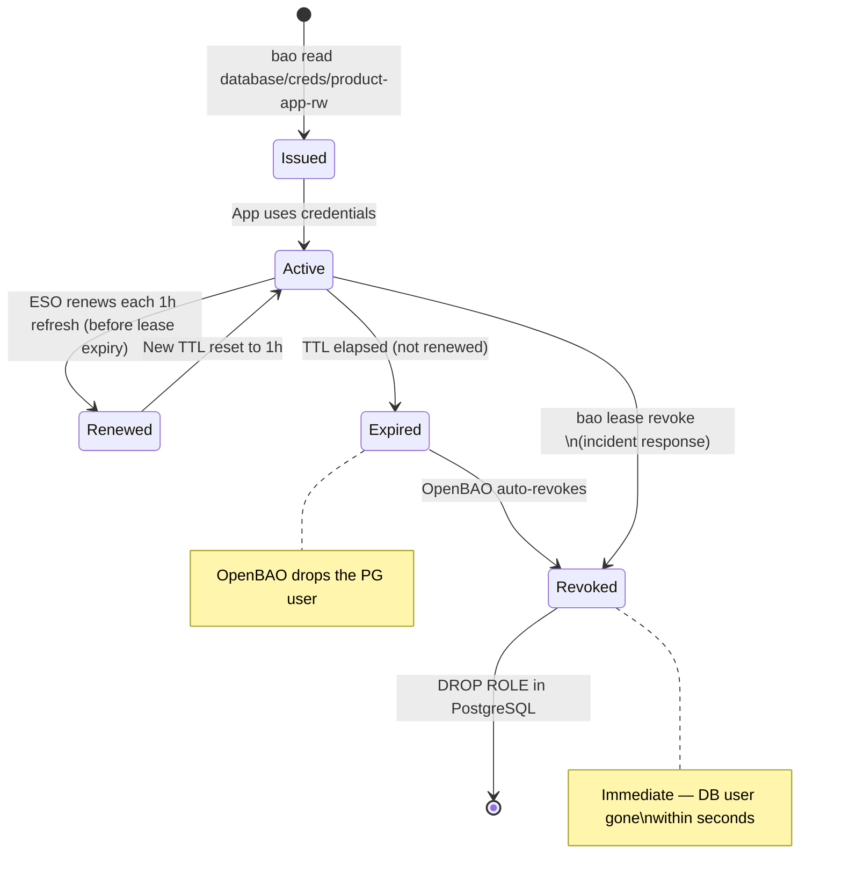

### Lease Commands

```bash
# List all active leases for a role
bao list sys/leases/lookup/database/creds/product-app-rw/

# Inspect a specific lease
bao lease lookup database/creds/product-app-rw/<lease-id>

# Renew a lease manually (normally done by ESO)
bao lease renew database/creds/product-app-rw/<lease-id>

# Revoke a single lease (compromised credential)
bao lease revoke database/creds/product-app-rw/<lease-id>

# Revoke ALL leases for a role (incident response — all apps get new creds on next refresh)
bao lease revoke -prefix database/creds/product-app-rw/
```

---

## 11. Password Policies

Custom password policies enforce strength requirements for all dynamically generated credentials.

```hcl
# Policy: db-strong (applied to all DB engine roles)
length = 32

rule "charset" {
  charset   = "abcdefghijklmnopqrstuvwxyz"
  min-chars = 4
}
rule "charset" {
  charset   = "ABCDEFGHIJKLMNOPQRSTUVWXYZ"
  min-chars = 4
}
rule "charset" {
  charset   = "0123456789"
  min-chars = 4
}
rule "charset" {
  charset   = "!@#%^&*()-_=+"
  min-chars = 2
}
```

Apply to a database role:
```bash
bao write database/roles/product-app-rw \
  db_name=product-db \
  password_policy="db-strong" \
  creation_statements="..." \
  default_ttl="1h" \
  max_ttl="24h"
```

---

---

## Operations And Runbooks

Operational commands are kept out of this architecture document so the learning material stays readable. Use these task-focused runbooks:

| Task | Runbook |
|---|---|
| Bootstrap a fresh local OpenBAO deployment | [Initial setup](./runbooks/openbao-initial-setup.md) |
| Recover sealed OpenBAO pods or a stuck `secrets-local` reconciliation | [Unseal and stuck reconciliation](./runbooks/openbao-unseal.md) |
| Diagnose ESO sync failures | [ESO sync failure](./runbooks/eso-sync-failure.md) |
| Recover the 1-hour Kubernetes reviewer JWT failure | [Reviewer JWT auth failure](./runbooks/reviewer-jwt-auth-failure.md) |
| Save or restore a Raft snapshot | [Raft snapshot and restore](./runbooks/raft-snapshot-restore.md) |
| Rotate static KV v2 secrets | [Rotate static secret](./runbooks/rotate-static-secret.md) |
| Revoke credentials after compromise | [Revoke compromised credential](./runbooks/revoke-compromised-credential.md) |

## 16. File Reference

### Infrastructure Files

| File | Purpose |
|------|---------|
| `kubernetes/infra/controllers/secrets/openbao/helmrelease.yaml` | OpenBAO HA Helm chart |
| `kubernetes/infra/controllers/secrets/external-secrets/helmrelease.yaml` | ESO HelmRelease |
| `kubernetes/infra/configs/secrets/openbao-bootstrap/` | Init scripts (phased) |
| `kubernetes/infra/configs/secrets/cluster-secret-store.yaml` | ClusterSecretStore (openbao) |
| `kubernetes/infra/configs/secrets/cluster-external-secrets/` | ClusterExternalSecret definitions |
| `kubernetes/infra/configs/secrets/cluster-external-secrets/cloudflare.yaml` | `ExternalSecret` (per-namespace) for cert-manager DNS-01 — file lives in CES dir but is `kind: ExternalSecret` since cert-manager only needs the Secret in one namespace |
| `kubernetes/infra/configs/databases/clusters/*/secrets/` | Per-cluster ExternalSecret definitions |

### Helm Sources

| File | Purpose |
|------|---------|
| `kubernetes/clusters/local/sources/helm/openbao.yaml` | OpenBAO Helm repository |
| `kubernetes/clusters/local/sources/helm/external-secrets.yaml` | ESO Helm repository |

---

## 17. Migration from Vault Dev Mode

### Phase Checklist

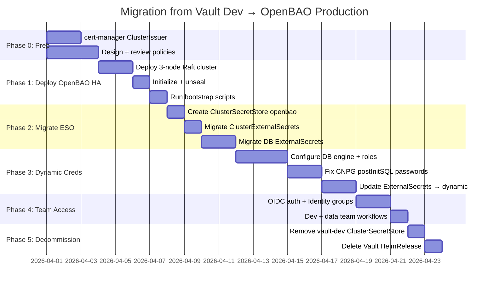

---

## 18. Related Documentation

- [RFC-0008 — Production secrets hardening](../proposals/rfc/RFC-0008/) (+ [implementation.md](../proposals/rfc/RFC-0008/implementation.md) — feature selection, architecture, DB redesign, install phases)
- [Secrets Management](./secrets-management.md) — ESO patterns, path conventions, operations
- [cert-manager](./cert-manager.md) — Certificate issuers and `kong-proxy-tls` wildcard pipeline
- [Trust Distribution](./trust-distribution.md) — trust-manager `homelab-ca-bundle` distribution
- [Secrets proposals](../proposals/) — ADR-004/005 (audit, HA) + RFC backlog (rotation, PushSecret, hardening)
- [OpenBAO Documentation](https://openbao.org/docs)
- [OpenBAO Helm Chart](https://openbao.org/docs/platform/k8s/helm)
- [External Secrets Operator](https://external-secrets.io/)
- [CloudNativePG External Secrets Integration](https://cloudnative-pg.io/docs/1.28/cncf-projects/external-secrets)

---

_Last updated: 2026-07-17 — Split from `docs/secrets/README.md`; RFC-0018 platform-db paths and compat OpenBAO layout._