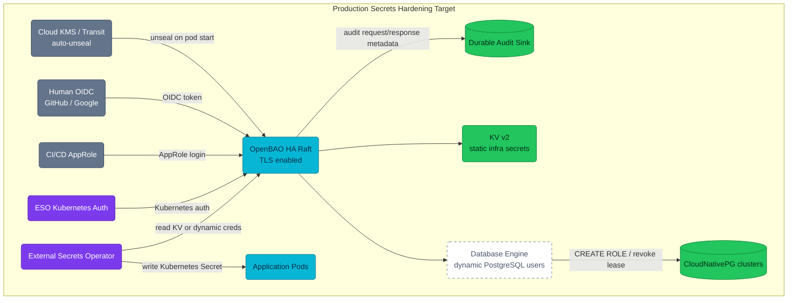
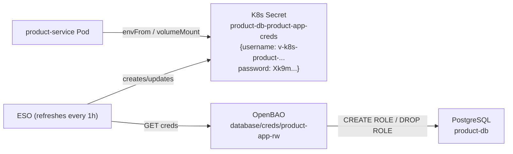

# Secrets Production Hardening

Production hardening items that are intentionally not treated as current local
Kind behavior. This file is a learning map for RFC-0008 and the OpenBAO target
state, not a claim that the features are deployed today.

## Status

| Capability | Local Kind today | Production target |
|---|---|---|
| OpenBAO listener | HTTP in-cluster | TLS with cert-manager-issued serving cert |
| Unseal | Shamir key stored in `openbao-init-keys`; CronJob replays it | KMS or Transit auto-unseal |
| Root token | Stored for local bootstrap and recovery | Revoked after bootstrap |
| Human access | Not wired | OIDC groups mapped to least-privilege policies |
| CI/CD access | Not wired | AppRole or equivalent short-lived automation token |
| App DB credentials | KV v2 static owner/user passwords | OpenBAO database engine dynamic credentials |
| Audit | File audit to stdout, best effort | Durable audit storage, fail-closed when required |

## Target Architecture



## Hardening Workstreams

| Workstream | Why it matters | Source of truth |
|---|---|---|
| TLS for OpenBAO | Prevent plaintext OpenBAO traffic and allow ESO `caBundle` validation | [RFC-0008](../proposals/rfc/RFC-0008/) |
| KMS / Transit auto-unseal | Avoid storing unseal keys in Kubernetes Secrets | [RFC-0008](../proposals/rfc/RFC-0008/) |
| Dynamic PostgreSQL credentials | Replace long-lived application DB passwords with leased users | [OpenBAO Architecture](./openbao.md#52-database-secrets-engine--dynamic-credentials) |
| OIDC human access | Remove day-to-day root token use | [OpenBAO Architecture](./openbao.md#oidc-auth--developer--data-team) |
| Durable audit | Make secret access reconstructable after incidents | [ADR-004](../proposals/adr/ADR-004-enable-openbao-audit-logging/) |
| Cloudflare token handling | Keep production DNS-01 token outside Git and re-seed fresh clusters safely | [Seed bootstrap-only token](./runbooks/openbao-initial-setup.md) |

## Guardrail

When editing docs, keep current and planned behavior separate:

| Wording | Meaning |
|---|---|
| **Deployed today** | Verified against manifests under `kubernetes/` |
| **Local Kind only** | Works for learning/dev but is unsafe for production |
| **Planned** | Target design from RFC-0008 or related ADRs |
| **Rejected** | Historical alternative; keep the rationale, but do not present as active |

---


## Learning Use Cases From The Target Design

#### Use Case 1: Application Database Access (Hourly Rotation)

Microservice `product-service` never stores a database password. Each pod gets fresh credentials every hour via ESO.



#### Use Case 2: 90-Day Compliance Rotation (EKS/GKE)

For static owner users required by golang-migrate migrations — scheduled automatic rotation every 90 days:

```bash
# Create static role with automatic rotation
bao write database/static-roles/product-owner \
  db_name=product-db \
  username=product_owner \
  rotation_statements=["ALTER USER \"{{name}}\" WITH PASSWORD '{{password}}';"] \
  rotation_period=2160h   # 90 days

# ESO pulls the rotated password at next refreshInterval
# Migration init containers read from this secret before running
```

#### Use Case 3: Developer Database Access (On-Demand)

```bash
# Developer login via OIDC (one command — browser opens)
bao login -method=oidc role="dev-team"

# Request temporary credentials for any database
bao read database/creds/product-app-rw     # 8h TTL
bao read database/creds/cart-app-rw
bao read database/creds/order-readonly

# Connect directly
psql -h product-db-rw.product.svc.cluster.local \
     -U $(bao read -field=username database/creds/product-app-rw) \
     -d product
```

#### Use Case 4: Data Team Analytics Access (Read-Only)

```bash
# Data analyst authenticates
bao login -method=oidc role="data-team"

# Request read-only creds for BI tool (Metabase, Superset)
bao read database/creds/product-readonly  # SELECT only, 8h TTL
bao read database/creds/order-readonly

# Configure Metabase data source with these credentials
# When TTL expires, re-request — data team policy enforces read-only always
```

#### Use Case 5: CI/CD Pipeline Secret Access

> **Planned pattern** — AppRole for CI is not wired yet, and the `https` endpoint
> assumes RFC-0008 TLS (the deployed listener is `http`).

```bash
# GitHub Actions workflow — AppRole auth
VAULT_TOKEN=$(curl -sk https://openbao.openbao.svc.cluster.local:8200/v1/auth/approle/login \
  -d "{\"role_id\":\"$VAULT_ROLE_ID\",\"secret_id\":\"$VAULT_SECRET_ID\"}" \
  | jq -r '.auth.client_token')

# Read deploy config (1h token, non-renewable, limited to cicd-deploy policy)
DB_MIGRATION_PASSWORD=$(curl -sk \
  -H "X-Vault-Token: $VAULT_TOKEN" \
  https://openbao.openbao.svc.cluster.local:8200/v1/secret/data/local/cicd/migrate-config \
  | jq -r '.data.data.password')
```

#### Use Case 6: Incident Response — Credential Compromise

```bash
# A developer's laptop was compromised. Revoke all their leases immediately.
# 1. Find their entity in OpenBAO
bao list identity/entity/name/

# 2. Revoke their token (if known)
bao token revoke <token>

# 3. Revoke all dynamic DB credentials they held
bao lease revoke -prefix database/creds/

# 4. Audit log shows exactly what they accessed (Grafana VictoriaLogs / LogsQL):
# _stream:{namespace="openbao"} | unpack_json | auth_display_name:="john.doe@company.com"

# 5. Create new OIDC session next time with MFA enforced
```

---

## Rotation Schedule Summary

| Credential | Type | TTL | Rotation Mechanism |
|-----------|------|-----|-------------------|
| App service DB creds (`*-app-rw`) | Dynamic | 1h / max 24h | ESO refreshInterval: 1h |
| Developer DB creds | Dynamic | 8h / max 16h | OIDC session expiry |
| Data team DB creds (`*-readonly`) | Dynamic | 8h / max 24h | OIDC session expiry |
| Owner/DDL creds (golang-migrate) | Static role | 90 days | OpenBAO `rotation_period` |
| ESO Vault token | Service token | 1h, renewable | Kubernetes auth TTL |
| S3 backup creds (KV) | Static | N/A | Manual (`bao kv put`) |
| PgDog pooler admin (KV) | Static | N/A | Manual |
| OIDC developer sessions | Token | 8h, non-renewable | Session expiry |
| CI/CD AppRole tokens | Batch token | 1h, non-renewable | Per pipeline run |

---

---

_Last updated: 2026-07-14 - Created during the secrets docs refactor to keep production-target learning material separate from current local Kind behavior._
