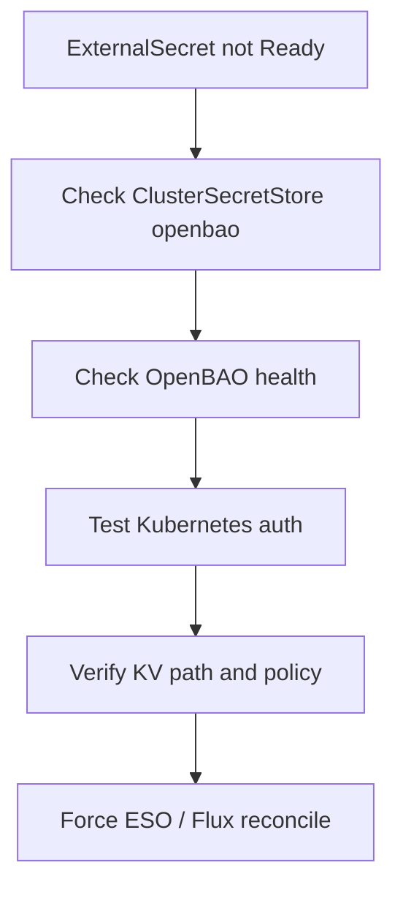

# ESO Sync Failure

Use this when an `ExternalSecret`, `ClusterExternalSecret`, or `ClusterSecretStore/openbao` is not Ready.



```bash
# Check ESO pod for errors
kubectl logs -n external-secrets-system deployment/external-secrets | grep ERROR

# Describe the ExternalSecret (shows last sync error)
kubectl describe externalsecret <name> -n <namespace>

# Check ClusterSecretStore connectivity
kubectl get clustersecretstore openbao -o yaml | grep -A10 conditions

# Verify OpenBAO is reachable from ESO namespace
kubectl run -it --rm test --image=curlimages/curl -n external-secrets-system \
  -- curl -s http://openbao.openbao.svc.cluster.local:8200/v1/sys/health
```

_Last updated: 2026-07-14 - Split from `docs/secrets/README.md` during the runbook refactor._
