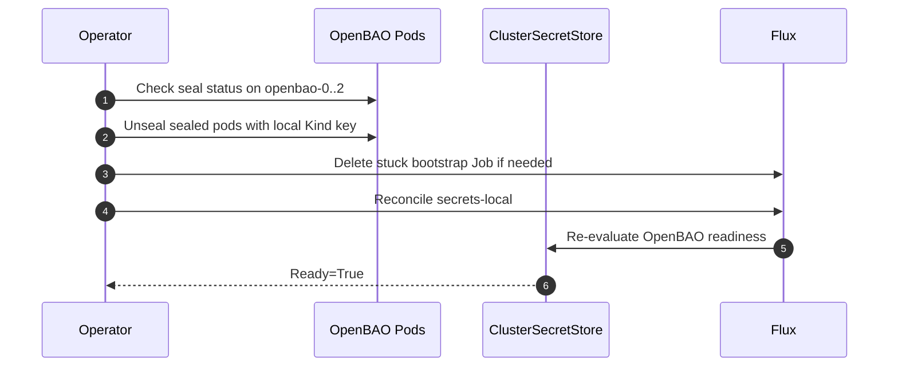

# OpenBAO Unseal And Stuck Reconciliation

Use this when OpenBAO pods are sealed, `ClusterSecretStore/openbao` returns 503, or Flux `secrets-local` is stuck.



```bash
# Check seal status on all nodes
for i in 0 1 2; do
  echo "openbao-$i:"
  kubectl exec -n openbao openbao-$i -- bao status 2>/dev/null | grep -E "Sealed|HA Mode"
done

# Unseal sealed nodes (only needed if auto-unseal is NOT configured)
kubectl exec -n openbao openbao-0 -- bao operator unseal <unseal-key>
```

## OpenBAO Node Sealed

```bash
# Check all nodes
kubectl get pods -n openbao -o wide

# Check seal status
kubectl exec -n openbao openbao-0 -- bao status | grep Sealed

# Unseal (if auto-unseal not configured)
kubectl exec -n openbao openbao-0 -- bao operator unseal <key>

# Check auto-unseal connectivity (Transit)
kubectl logs -n openbao openbao-0 | grep -i "unseal\|transit\|seal"
```

## Flux `secrets-local` stuck / `ClusterSecretStore` 503 / Job hangs

**Symptoms:** `flux get ks` shows `secrets-local` Unknown or HealthCheckFailed; `ClusterSecretStore` events show **503 Vault is sealed**; Job `openbao/openbao-bootstrap` log stops at **Waiting for sealed:false on openbao-0** / **Waiting for service…** or runs for hours.

**Cause (common):** OpenBAO **Raft nodes are sealed** after restart, or the bootstrap script used a **health URL without `sealedcode=200`**, so `wget` got **503** with no JSON and the wait loop never matched `sealed:false` (fixed in GitOps bootstrap script).

**Cause (cold start / script):** After unseal, all nodes can be unsealed while the **ClusterIP Service** still has **no Ready endpoints** for a short time (readinessProbe). The bootstrap script now **waits for `sealed:false` on `openbao-0` first** (same DNS as Phase 1), uses a **grep** that allows JSON whitespace around `sealed`, then **optionally** confirms the Service URL; on Service timeout it logs a **warning** and truncated health (Phase 4 uses `$BAO_ADDR` — check `kubectl get endpoints -n openbao openbao` if login fails).

**Recover (operations):**

1. **Confirm seal state**

   ```bash
   kubectl exec -n openbao openbao-0 -- bao status
   ```

2. **Unseal** using the key stored in Secret `openbao/openbao-init-keys` (keys `unseal_key`, `root_token` — base64 in the Secret; decode for the unseal key). Run on **each** node if needed:

   ```bash
   UNSEAL_KEY='<plaintext-unseal-key>'
   for i in 0 1 2; do
     kubectl exec -n openbao openbao-$i -- env BAO_ADDR="http://127.0.0.1:8200" bao operator unseal "$UNSEAL_KEY"
   done
   kubectl exec -n openbao openbao-0 -- bao status
   ```

3. **Delete the stuck Job** so a new pod can run the updated script (after GitOps push) or finish Phase 4:

   ```bash
   kubectl delete job openbao-bootstrap -n openbao
   ```

4. **Reconcile Flux** (order matters for `dependsOn`):

   ```bash
   flux reconcile kustomization secrets-local -n flux-system --with-source
   flux reconcile kustomization databases-local -n flux-system --with-source
   flux reconcile kustomization apps-local -n flux-system --with-source
   ```

5. **Verify** `kubectl get clustersecretstore openbao` → Ready=True; `flux get ks -A` → `secrets-local` True.

**Homelab only:** plaintext unseal key in Kubernetes Secret — do not use this pattern in production without KMS auto-unseal.

---

_Last updated: 2026-07-14 - Split from `docs/secrets/README.md` during the runbook refactor._
